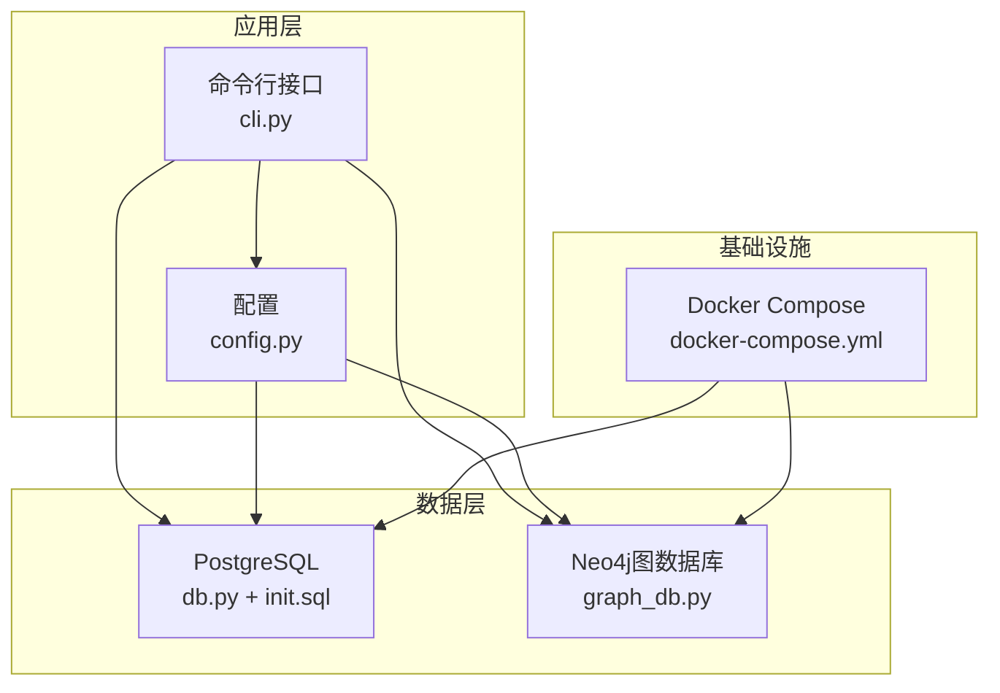
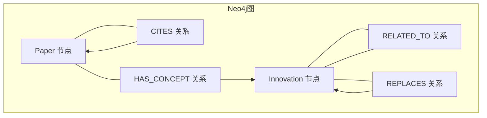
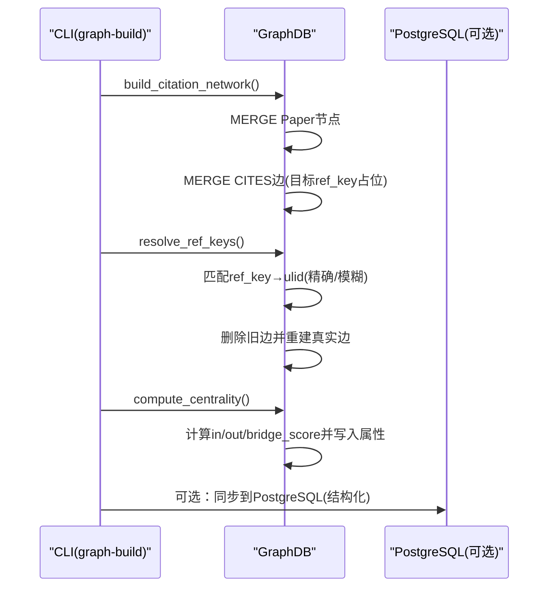
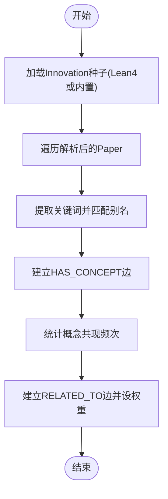
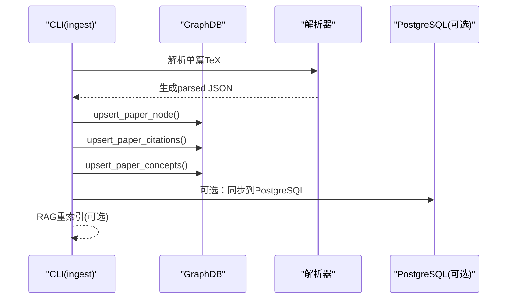
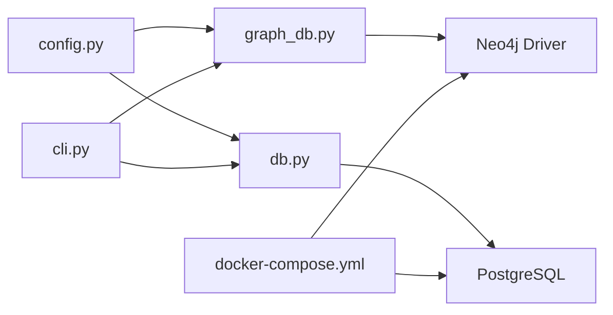

# Neo4j图数据库

<cite>
**本文档引用的文件**
- [graph_db.py](file://scholar/graph_db.py)
- [db.py](file://scholar/db.py)
- [config.py](file://scholar/config.py)
- [cli.py](file://scholar/cli.py)
- [docker-compose.yml](file://infra/docker-compose.yml)
- [init.sql](file://infra/init.sql)
- [CONNECTORS.md](file://plugin/CONNECTORS.md)
</cite>

## 目录
1. [简介](#简介)
2. [项目结构](#项目结构)
3. [核心组件](#核心组件)
4. [架构总览](#架构总览)
5. [详细组件分析](#详细组件分析)
6. [依赖关系分析](#依赖关系分析)
7. [性能考虑](#性能考虑)
8. [故障排查指南](#故障排查指南)
9. [结论](#结论)
10. [附录](#附录)

## 简介
本文件面向Neo4j图数据库在学术研究知识库中的应用，系统性梳理Schema设计、节点与关系建模、图数据操作接口、从PostgreSQL到Neo4j的数据迁移与增量更新策略，并给出查询优化与运维维护建议。内容基于仓库中实际实现，覆盖引用网络、概念图谱与创新演进（REPLACES）三类图谱构建与查询能力。

## 项目结构
- 图数据库层位于 scholar/graph_db.py，封装Neo4j连接、图构建、查询与增量更新。
- 数据库层位于 scholar/db.py，封装PostgreSQL访问与文件回退模式。
- 配置位于 scholar/config.py，统一管理Neo4j与PostgreSQL连接参数。
- CLI入口位于 scholar/cli.py，提供 graph-build、graph-stats、graph-query、cite-network 等命令。
- 基础设施与容器编排位于 infra/docker-compose.yml，定义Neo4j与PostgreSQL服务。
- 初始化SQL位于 infra/init.sql，定义PostgreSQL表结构与索引。

图表来源
- [cli.py](file://scholar/cli.py)
- [config.py](file://scholar/config.py)
- [db.py](file://scholar/db.py)
- [graph_db.py](file://scholar/graph_db.py)
- [docker-compose.yml](file://infra/docker-compose.yml)
- [init.sql](file://infra/init.sql)

章节来源
- [cli.py](file://scholar/cli.py)
- [config.py](file://scholar/config.py)
- [db.py](file://scholar/db.py)
- [graph_db.py](file://scholar/graph_db.py)
- [docker-compose.yml](file://infra/docker-compose.yml)
- [init.sql](file://infra/init.sql)

## 核心组件
- GraphDB：封装Neo4j连接、会话执行与关闭，提供run方法执行Cypher查询。
- 引用网络构建：build_citation_network、resolve_ref_keys、compute_centrality。
- 概念图谱构建：build_concept_graph、find_papers_by_concept、find_related_concepts、get_concept_subgraph。
- 创新演进同步：sync_lean4_replacements，将Lean4中的REPLACES关系导入Neo4j。
- 增量更新：upsert_paper_node、upsert_paper_citations、upsert_paper_concepts。
- CLI命令：graph-build、graph-stats、graph-query、cite-network等。

章节来源
- [graph_db.py](file://scholar/graph_db.py)
- [cli.py](file://scholar/cli.py)

## 架构总览
Neo4j作为图数据库承载三类图谱：
- 引用网络：Paper节点通过CITES关系形成引用边。
- 概念图谱：Paper通过HAS_CONCEPT连接到Innovation节点；Innovation之间通过RELATED_TO形成共现关系。
- 创新演进：Innovation之间通过REPLACES关系表达替代关系，来源于Lean4。

图表来源
- [graph_db.py](file://scholar/graph_db.py)

## 详细组件分析

### 图Schema与节点/关系建模
- 节点类型
  - Paper：论文节点，属性包括ulid、title、year、venue、formula_count、citation_count等。
  - Innovation：创新节点，属性包括id（唯一标识）、line（研究线）、year、scalability、simplicity、stability等。
- 关系类型
  - CITES：Paper → Paper，表示引用关系，属性ref_key、resolved。
  - HAS_CONCEPT：Paper → Innovation，表示论文包含某概念。
  - RELATED_TO：Innovation — Innovation，表示概念共现，属性weight。
  - REPLACES：Innovation → Innovation，表示替代关系，来源于Lean4。
- 索引策略
  - Paper.ulid：MERGE键，避免重复节点。
  - CITES关系属性ref_key、resolved：用于引用解析与统计。
  - Innovation.id：MERGE键，避免重复概念节点。
  - RELATED_TO权重：用于概念共现强度排序。

章节来源
- [graph_db.py](file://scholar/graph_db.py)

### 引用网络构建与查询
- 构建流程
  - 创建Paper节点（MERGE），设置基础属性。
  - 建立CITES边（MERGE），目标节点可能为占位节点（ref_key）。
  - 解析ref_key到真实Paper.ulid，删除旧边并重建指向真实节点的新边。
  - 计算中心性指标：in_degree、out_degree、bridge_score。
- 查询接口
  - 统计：总论文数、总引用边数、最被引用与最活跃引用者。
  - 单篇引用：前向引用（被哪些论文引用）、后向引用（引用了哪些论文）。
  - 路径：两点间最短引用路径。
  - 桥接论文：基于度乘积比计算的桥接评分。

图表来源
- [graph_db.py](file://scholar/graph_db.py)
- [cli.py](file://scholar/cli.py)

章节来源
- [graph_db.py](file://scholar/graph_db.py)
- [cli.py](file://scholar/cli.py)

### 概念图谱构建与查询
- 构建流程
  - 从Lean4动态加载Innovation种子数据，或回退到内置数据。
  - 对每篇Paper提取关键词，匹配预定义的概念别名集合，建立HAS_CONCEPT边。
  - 统计概念共现频次，构建RELATED_TO边并设置权重。
- 查询接口
  - 按概念查找论文列表。
  - 查找相关概念及其权重。
  - 获取概念时间线（按年份排序）。
  - 获取子图（指定概念集合的节点与边）。

图表来源
- [graph_db.py](file://scholar/graph_db.py)

章节来源
- [graph_db.py](file://scholar/graph_db.py)

### 创新演进同步（REPLACES）
- 来源：Lean4 Database.lean中的replacesDb条目。
- 同步逻辑：解析文件，提取from→to对，MERGE Innovation节点并建立REPLACES边；若文件缺失则回退到硬编码关系。
- 作用：表达概念层面的替代关系，支撑“概念演进”分析。

章节来源
- [graph_db.py](file://scholar/graph_db.py)

### 增量更新与单篇入库
- 单篇入库流程：解析→作者补全→自动生成阅读笔记→质量评分→分类→图谱更新→RAG重索引。
- 图谱更新：
  - upsert_paper_node：MERGE Paper节点并更新属性。
  - upsert_paper_citations：先删除该Paper的CITES边，再重建（含ref_key与resolved标记）。
  - upsert_paper_concepts：根据tags合并methods与sub_directions，建立HAS_CONCEPT边。
- 适用场景：新增论文或修改引用/标签后的快速同步。

图表来源
- [cli.py](file://scholar/cli.py)
- [graph_db.py](file://scholar/graph_db.py)
- [db.py](file://scholar/db.py)

章节来源
- [cli.py](file://scholar/cli.py)
- [graph_db.py](file://scholar/graph_db.py)
- [db.py](file://scholar/db.py)

### 从PostgreSQL到Neo4j的数据迁移与增量更新
- 全量迁移：bootstrap命令在Neo4j可用时，依次执行解析、年份补全、作者补全、图谱构建、RAG索引、自动生成笔记、质量评分、分类；同时将解析后的Paper同步到PostgreSQL（包含sections/formulas/citations）。
- 增量更新：ingest命令对单篇论文执行完整流程，并在Neo4j侧进行upsert操作，保证图谱与结构化数据的一致性。
- 注意：Neo4j侧的引用解析与概念匹配依赖parsed JSON；PG侧提供全文检索与结构化查询能力。

章节来源
- [cli.py](file://scholar/cli.py)
- [db.py](file://scholar/db.py)
- [graph_db.py](file://scholar/graph_db.py)

## 依赖关系分析
- 外部依赖
  - Neo4j驱动：用于连接与执行Cypher。
  - PostgreSQL驱动：用于结构化数据存取。
  - Docker Compose：提供Neo4j与PostgreSQL容器化运行。
- 内部依赖
  - config.py提供环境变量与路径配置。
  - db.py提供PG连接与事务封装。
  - graph_db.py提供Neo4j连接与图构建/查询。
  - cli.py提供命令入口与工作流编排。

图表来源
- [config.py](file://scholar/config.py)
- [graph_db.py](file://scholar/graph_db.py)
- [db.py](file://scholar/db.py)
- [cli.py](file://scholar/cli.py)
- [docker-compose.yml](file://infra/docker-compose.yml)

章节来源
- [config.py](file://scholar/config.py)
- [graph_db.py](file://scholar/graph_db.py)
- [db.py](file://scholar/db.py)
- [cli.py](file://scholar/cli.py)
- [docker-compose.yml](file://infra/docker-compose.yml)

## 性能考虑
- 查询优化
  - 使用MERGE而非CREATE以避免重复节点/边，降低写入成本。
  - 在高频查询上使用属性过滤（如Paper.year、CITES.resolved）。
  - 对于大规模批处理，采用UNWIND + 批大小（例如100）提升吞吐。
  - 使用shortestPath时限制深度或使用启发式约束，避免长链路扫描。
- 索引与约束
  - Paper.ulid与Innovation.id作为MERGE键，天然具备唯一性与高效匹配。
  - 若需按year、title等字段频繁过滤，可在Neo4j中添加索引或二级索引（取决于版本与插件）。
- 批处理与并发
  - 将节点/边创建拆分为固定批次，减少单事务压力。
  - 并发控制：在多进程/多线程环境下，确保每个会话独立且避免重复写入。
- 存储与备份
  - Neo4j：定期快照/备份，结合APOC插件进行数据导出。
  - PostgreSQL：利用init.sql初始化表结构，配合备份策略保障结构化数据安全。

[本节为通用指导，无需特定文件引用]

## 故障排查指南
- Neo4j不可用
  - 症状：graph-build、graph-stats、graph-query等命令提示Neo4j未就绪。
  - 排查：确认docker-compose是否启动neo4j容器，端口映射与认证信息正确。
- 引用解析失败
  - 症状：resolve_ref_keys返回大量unresolved。
  - 排查：检查parsed JSON中的citations字段格式，确认ref_key与Paper.title的匹配策略是否合理。
- 概念匹配不足
  - 症状：build_concept_graph建立的HAS_CONCEPT边较少。
  - 排查：检查CONCEPT_ALIASES是否覆盖目标领域术语，确认Paper文本清洗与分词策略。
- 中心性计算异常
  - 症状：in_degree/out_degree/bridge_score为空或异常。
  - 排查：确认CITES边已建立且resolved状态正确；检查year字段是否存在。
- 增量更新未生效
  - 症状：ingest后Neo4j未见变化。
  - 排查：确认GraphDB可用，检查upsert_*函数是否被调用，确认parsed JSON中tags与citations字段有效。

章节来源
- [cli.py](file://scholar/cli.py)
- [graph_db.py](file://scholar/graph_db.py)
- [docker-compose.yml](file://infra/docker-compose.yml)

## 结论
本项目在Neo4j中实现了三类图谱：引用网络、概念图谱与创新演进，结合PostgreSQL提供结构化数据与全文检索能力。通过CLI命令与增量更新机制，实现了从解析到图谱构建、查询与维护的完整闭环。建议在生产环境中完善索引策略、监控查询计划、定期备份与一致性校验，以保障图数据库的稳定性与性能。

[本节为总结，无需特定文件引用]

## 附录

### 命令速览
- graph-build：构建引用网络、解析ref_key、计算中心性、构建概念图谱、同步REPLACES。
- graph-stats：输出节点/边数量、解析状态分布、桥接论文TopN。
- graph-query：按概念ID查询论文与相关概念。
- cite-network：展示引用网络统计或单篇论文的前后向引用。
- ingest：单篇论文全量入库与图谱增量更新。
- bootstrap：全量初始化流程（解析→图谱→RAG→笔记→质量→分类）。

章节来源
- [cli.py](file://scholar/cli.py)

### Neo4j与PostgreSQL配置要点
- Neo4j连接：URI、用户、密码由config.py读取环境变量。
- PostgreSQL连接：主机、端口、数据库名、用户、密码由config.py读取环境变量。
- 容器化部署：docker-compose定义了neo4j与pg服务，包含健康检查与卷挂载。

章节来源
- [config.py](file://scholar/config.py)
- [docker-compose.yml](file://infra/docker-compose.yml)
- [CONNECTORS.md](file://plugin/CONNECTORS.md)