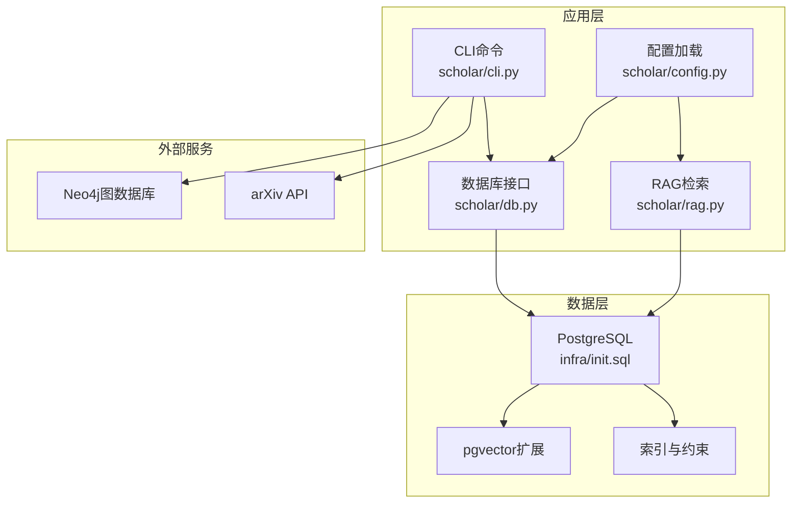
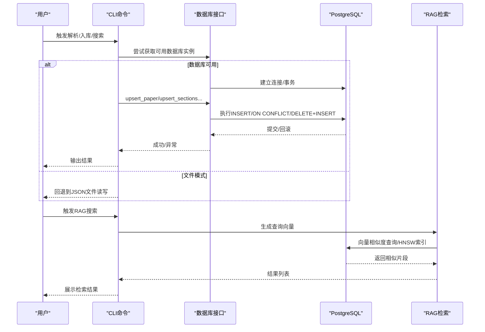
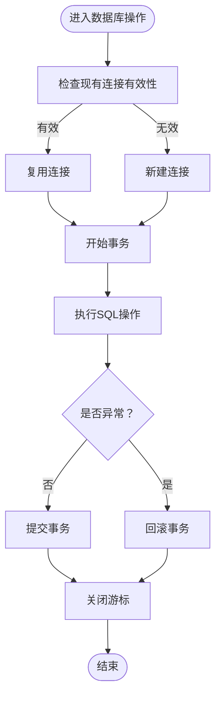
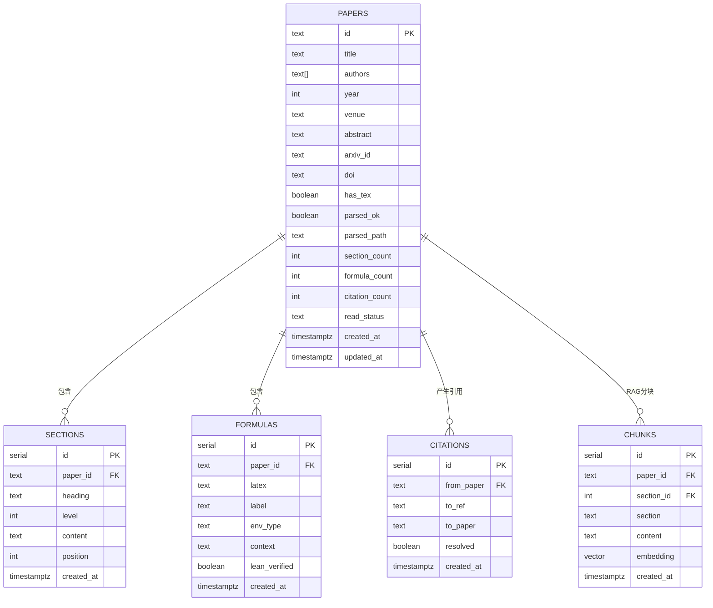
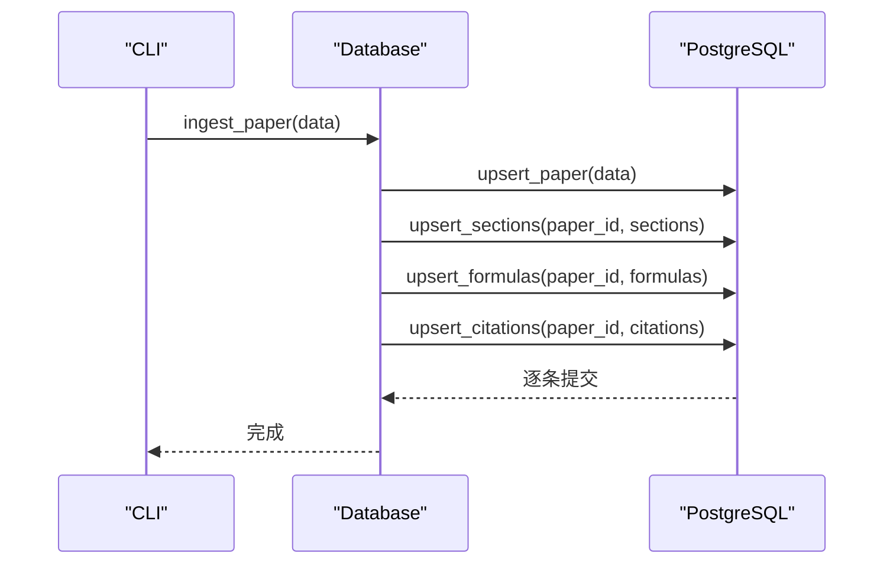
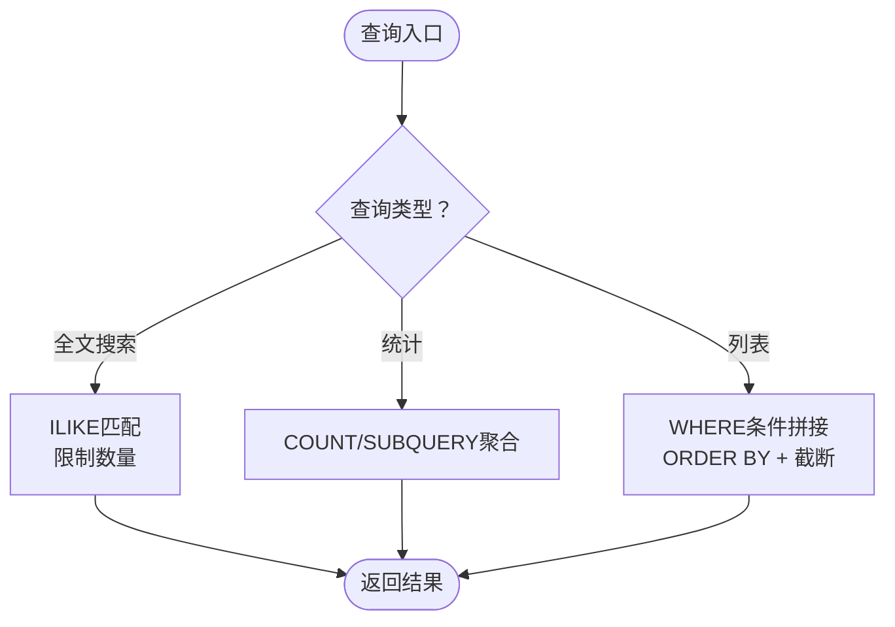
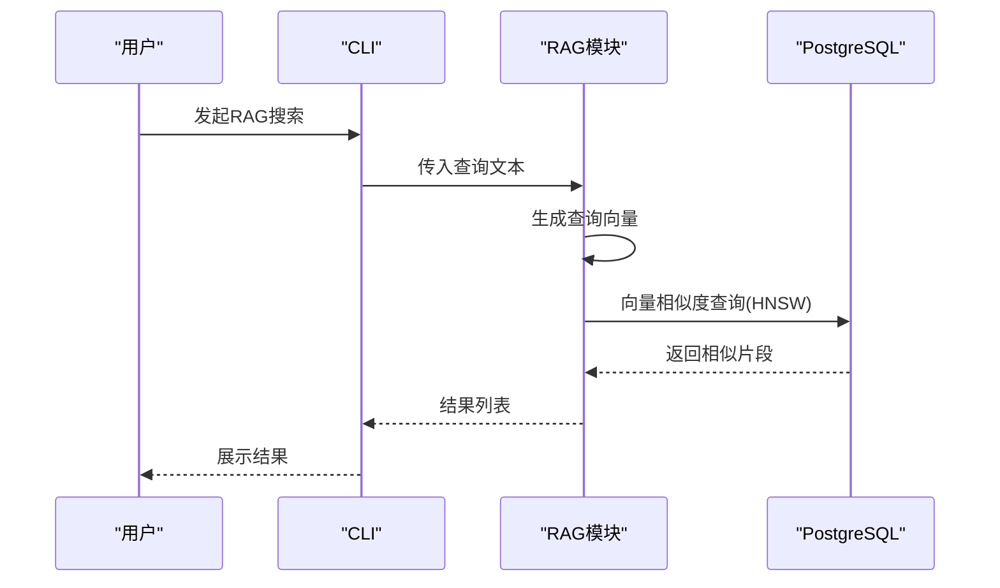
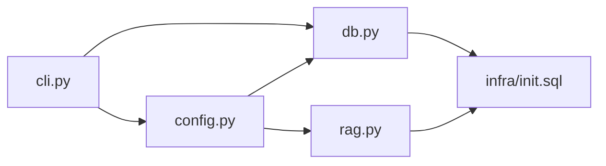

# PostgreSQL数据库

<cite>
**本文档引用的文件**
- [scholar/db.py](file://scholar/db.py)
- [infra/init.sql](file://infra/init.sql)
- [scholar/config.py](file://scholar/config.py)
- [scholar/cli.py](file://scholar/cli.py)
- [scholar/rag.py](file://scholar/rag.py)
- [plugin/commands/paper.md](file://plugin/commands/paper.md)
- [plugin/commands/stats.md](file://plugin/commands/stats.md)
- [plugin/commands/health.md](file://plugin/commands/health.md)
</cite>

## 目录
1. [简介](#简介)
2. [项目结构](#项目结构)
3. [核心组件](#核心组件)
4. [架构总览](#架构总览)
5. [详细组件分析](#详细组件分析)
6. [依赖关系分析](#依赖关系分析)
7. [性能考虑](#性能考虑)
8. [故障排除指南](#故障排除指南)
9. [结论](#结论)
10. [附录](#附录)

## 简介
本文件面向PostgreSQL数据库在学术研究工具中的应用，系统性阐述数据库连接配置、连接池管理与事务处理机制；详解papers、sections、formulas、citations等核心表的Schema设计与字段语义；文档化upsert_paper、upsert_sections、upsert_formulas、upsert_citations等CRUD操作的实现细节；解释全文搜索、统计查询与分页处理的优化策略；提供数据库初始化脚本说明（表创建、索引建立、约束设置）；并给出连接失败、查询超时、数据一致性等故障排除建议。

## 项目结构
该仓库采用“Python应用 + PostgreSQL + Neo4j + RAG向量索引”的多层数据存储架构：
- Python应用层通过psycopg2访问PostgreSQL，提供结构化存储与RAG向量检索能力
- 初始化脚本负责创建核心表与索引，并启用pgvector扩展
- CLI命令提供解析、入库、查询、统计等功能
- 插件命令文档描述用户操作流程与预期输出

**图表来源**
- [scholar/cli.py](file://scholar/cli.py)
- [scholar/db.py](file://scholar/db.py)
- [scholar/config.py](file://scholar/config.py)
- [scholar/rag.py](file://scholar/rag.py)
- [infra/init.sql](file://infra/init.sql)

**章节来源**
- [scholar/cli.py](file://scholar/cli.py)
- [scholar/db.py](file://scholar/db.py)
- [infra/init.sql](file://infra/init.sql)

## 核心组件
- 数据库接口类：封装psycopg2连接、事务控制、CRUD与查询方法
- 初始化脚本：定义表结构、索引、约束与扩展
- 配置模块：加载环境变量，提供连接参数
- CLI命令：驱动解析、入库、搜索、统计等流程
- RAG模块：基于pgvector的向量检索与HNSW索引

**章节来源**
- [scholar/db.py](file://scholar/db.py)
- [infra/init.sql](file://infra/init.sql)
- [scholar/config.py](file://scholar/config.py)
- [scholar/rag.py](file://scholar/rag.py)

## 架构总览
数据库层以PostgreSQL为核心，结合psycopg2实现连接、事务与SQL执行；通过初始化脚本建立表与索引；RAG功能使用pgvector扩展进行向量相似度检索；CLI命令在解析完成后尝试写入数据库，若不可用则回退到文件模式。

**图表来源**
- [scholar/cli.py](file://scholar/cli.py)
- [scholar/db.py](file://scholar/db.py)
- [scholar/rag.py](file://scholar/rag.py)

## 详细组件分析

### 数据库连接与事务管理
- 连接建立：延迟导入psycopg2，按需建立连接；每次使用前检查连接有效性，失败则重建
- 事务控制：cursor上下文管理器确保异常时回滚，正常时提交；关闭游标释放资源
- 可用性检测：通过一次短连接测试判断数据库可达性

**图表来源**
- [scholar/db.py](file://scholar/db.py)

**章节来源**
- [scholar/db.py](file://scholar/db.py)

### 表Schema与字段语义
- papers表：存储论文元数据与计数字段，主键为论文唯一标识；包含arXiv/DOI等标识符；read_status用于阅读状态；created_at/updated_at记录时间戳
- sections表：按论文拆分的正文段落，包含标题、层级、内容与顺序位置；外键级联删除保证数据一致性
- formulas表：提取的LaTeX公式，包含公式文本、标签、环境类型与上下文；可扩展为形式化验证标记
- citations表：引用关系，from_paper指向源论文，to_ref为目标引用键，to_paper为解析后的目标论文ID；UNIQUE约束避免重复
- concepts与paper_concepts：概念抽取与关联，支持后续概念图谱构建
- chunks：RAG分块与向量嵌入，支持向量相似度检索与HNSW索引

**图表来源**
- [infra/init.sql](file://infra/init.sql)

**章节来源**
- [infra/init.sql](file://infra/init.sql)

### CRUD操作接口详解
- upsert_paper：插入或更新论文记录，使用ON CONFLICT更新非空字段并刷新updated_at
- upsert_sections：先删除旧段落，再批量插入新段落，保证与解析结果一致
- upsert_formulas：先删除旧公式，再批量插入新公式
- upsert_citations：先删除旧引用，再批量插入新引用，ON CONFLICT忽略重复
- ingest_paper：一次性完成paper、sections、formulas、citations的全量入库

**图表来源**
- [scholar/db.py](file://scholar/db.py)

**章节来源**
- [scholar/db.py](file://scholar/db.py)

### 查询优化策略
- 全文搜索：基于ILIKE的标题/摘要/段落内容模糊匹配，限制返回数量
- 统计查询：聚合统计论文总数、解析完成数、段落数、公式数、引用数及年份范围
- 分页处理：CLI中对结果集进行截断与排序，避免大量数据渲染
- 索引策略：为paper_id、from_paper、to_paper等高频查询字段建立索引；RAG场景下使用pgvector与HNSW近似最近邻索引

**图表来源**
- [scholar/db.py](file://scholar/db.py)
- [scholar/cli.py](file://scholar/cli.py)
- [infra/init.sql](file://infra/init.sql)

**章节来源**
- [scholar/db.py](file://scholar/db.py)
- [scholar/cli.py](file://scholar/cli.py)
- [infra/init.sql](file://infra/init.sql)

### RAG向量检索
- 向量索引：使用pgvector扩展，HNSW索引支持余弦距离的近似最近邻搜索
- 查询流程：生成查询向量，执行向量相似度比较，按相似度排序返回
- 备选方案：无API Key时自动降级为全文搜索

**图表来源**
- [scholar/rag.py](file://scholar/rag.py)
- [infra/init.sql](file://infra/init.sql)

**章节来源**
- [scholar/rag.py](file://scholar/rag.py)
- [infra/init.sql](file://infra/init.sql)

### 初始化脚本说明
- 扩展启用：创建pgvector扩展以支持向量检索
- 表创建：papers、sections、formulas、citations、concepts、paper_concepts、chunks等
- 索引建立：为高频查询字段建立索引，提升查询性能
- 约束设置：UNIQUE、外键级联删除等保证数据一致性

**章节来源**
- [infra/init.sql](file://infra/init.sql)

### CLI与插件命令集成
- 解析与入库：解析TeX源后保存JSON并尝试写入数据库
- 搜索与列表：优先使用数据库全文搜索，否则回退到JSON文件扫描
- 统计与健康检查：提供知识库统计与健康状态检查命令

**章节来源**
- [scholar/cli.py](file://scholar/cli.py)
- [plugin/commands/paper.md](file://plugin/commands/paper.md)
- [plugin/commands/stats.md](file://plugin/commands/stats.md)
- [plugin/commands/health.md](file://plugin/commands/health.md)

## 依赖关系分析
- 数据库接口依赖配置模块提供的连接参数
- CLI命令依赖数据库接口与文件系统（回退到JSON）
- RAG模块依赖配置模块的嵌入API密钥与数据库连接
- 初始化脚本独立于应用逻辑，仅定义Schema与索引

**图表来源**
- [scholar/config.py](file://scholar/config.py)
- [scholar/db.py](file://scholar/db.py)
- [scholar/rag.py](file://scholar/rag.py)
- [scholar/cli.py](file://scholar/cli.py)
- [infra/init.sql](file://infra/init.sql)

**章节来源**
- [scholar/config.py](file://scholar/config.py)
- [scholar/db.py](file://scholar/db.py)
- [scholar/rag.py](file://scholar/rag.py)
- [scholar/cli.py](file://scholar/cli.py)
- [infra/init.sql](file://infra/init.sql)

## 性能考虑
- 连接管理：按需建立连接，避免长连接占用；异常时重建连接
- 事务粒度：单次操作封装在事务内，减少锁竞争
- 索引策略：为paper_id、from_paper、to_paper等建立索引；RAG使用HNSW加速向量检索
- 查询限制：全文搜索限制返回数量，避免大结果集传输
- 批量写入：sections/formulas/citations采用先删后插，减少碎片与重复

[本节为通用指导，不直接分析具体文件]

## 故障排除指南
- 连接失败处理
  - 确认环境变量配置正确（主机、端口、数据库名、用户名、密码）
  - 检查数据库服务状态与防火墙设置
  - 若psycopg2不可用，程序将回退到文件模式
- 查询超时解决
  - 在CLI中适当调整搜索关键词与限制数量
  - 对全文搜索添加更精确的过滤条件（如年份）
- 数据一致性保证
  - 使用ON CONFLICT更新策略避免重复
  - 外键级联删除确保子表数据同步清理
  - 事务提交/回滚确保原子性
- RAG检索无结果
  - 确认嵌入API密钥配置
  - 确保已执行RAG索引构建命令
  - 无API Key时自动降级为全文搜索

**章节来源**
- [scholar/config.py](file://scholar/config.py)
- [scholar/db.py](file://scholar/db.py)
- [scholar/rag.py](file://scholar/rag.py)
- [README.md](file://README.md)

## 结论
该数据库层通过清晰的Schema设计、完善的索引策略与严格的事务控制，实现了论文元数据、结构化正文、公式与引用关系的高效存储；配合CLI命令与RAG向量检索，提供了从入库到检索的完整链路。初始化脚本标准化了部署流程，故障排除指南有助于快速定位与解决问题。

## 附录
- 环境变量参考：SCHOLAR_PG_HOST、SCHOLAR_PG_PORT、SCHOLAR_PG_NAME、SCHOLAR_PG_USER、SCHOLAR_PG_PASS、SCHOLAR_EMBEDDING_API_KEY等
- CLI常用命令：parse、parse-all、info、search、list-papers、stats、export-bib等
- 插件命令：paper、stats、health等

**章节来源**
- [scholar/config.py](file://scholar/config.py)
- [scholar/cli.py](file://scholar/cli.py)
- [plugin/commands/paper.md](file://plugin/commands/paper.md)
- [plugin/commands/stats.md](file://plugin/commands/stats.md)
- [plugin/commands/health.md](file://plugin/commands/health.md)