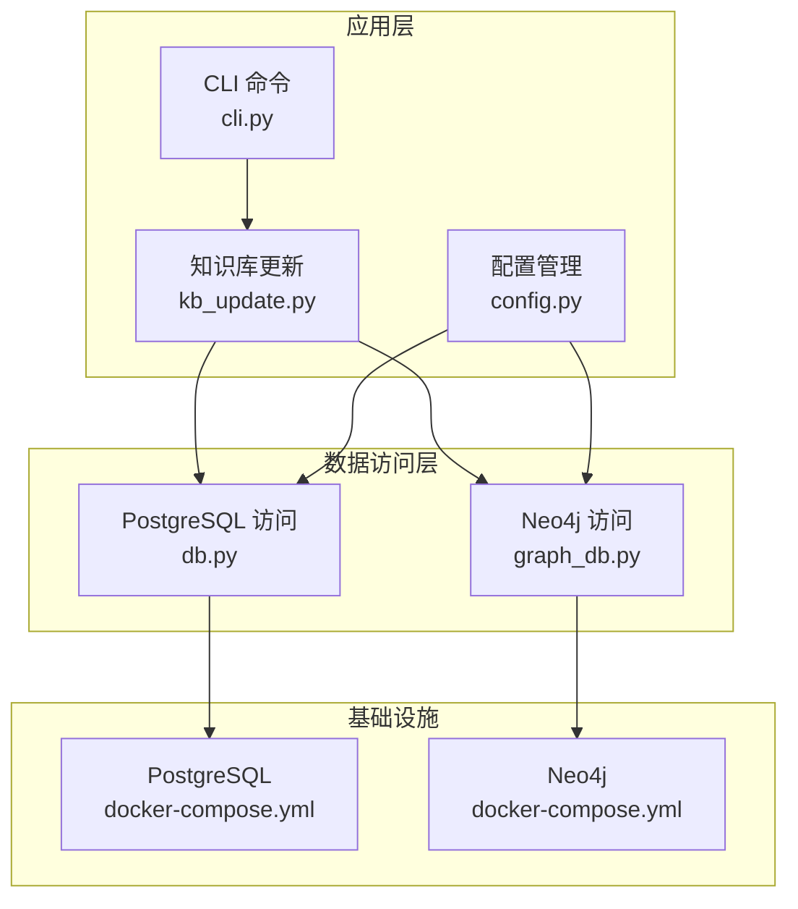
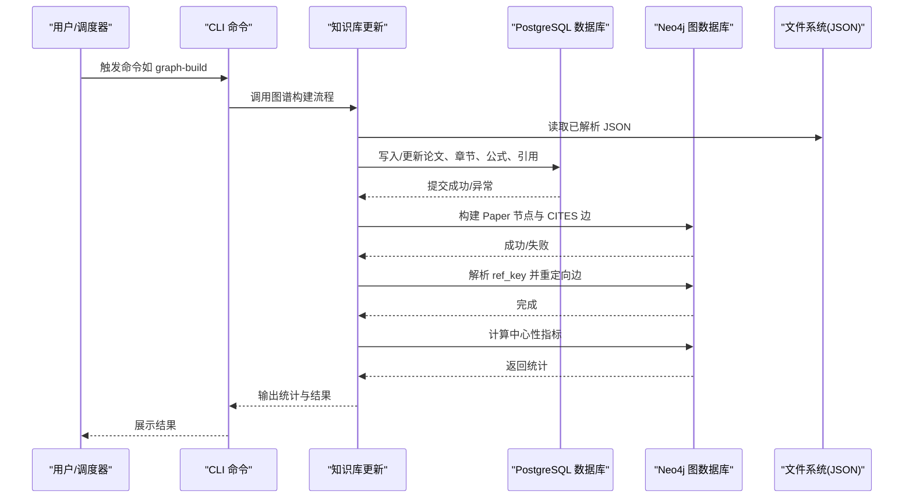
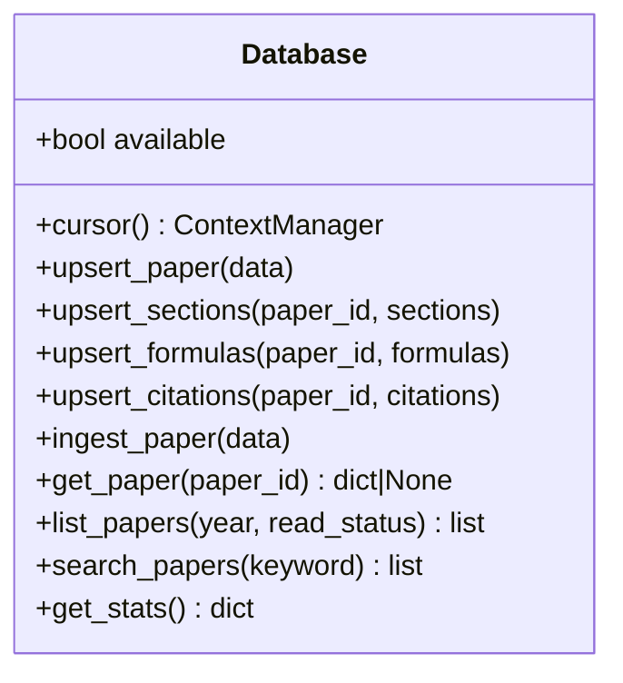
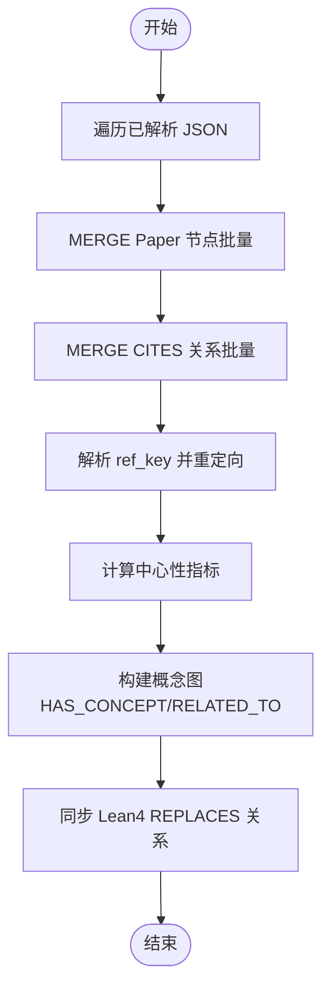
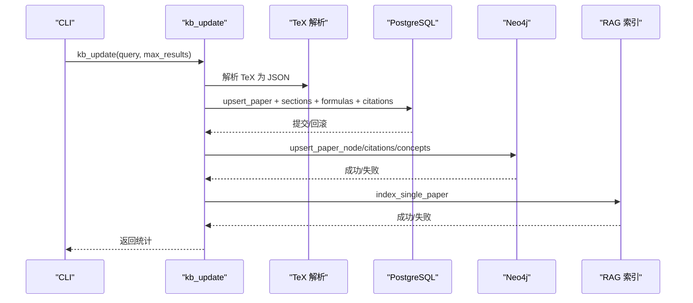
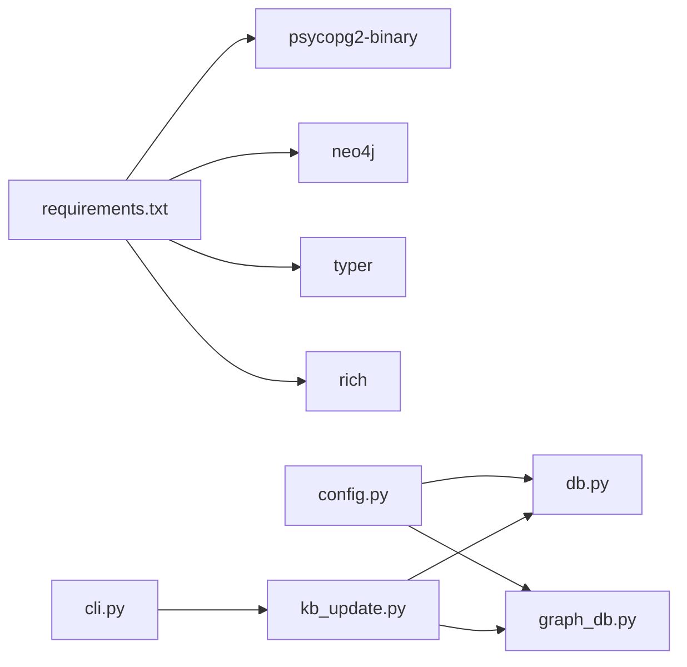

# 数据同步与迁移

<cite>
**本文引用的文件**
- [db.py](file://scholar/db.py)
- [graph_db.py](file://scholar/graph_db.py)
- [kb_update.py](file://scholar/kb_update.py)
- [cli.py](file://scholar/cli.py)
- [config.py](file://scholar/config.py)
- [docker-compose.yml](file://infra/docker-compose.yml)
- [init.sql](file://infra/init.sql)
- [requirements.txt](file://requirements.txt)
</cite>

## 目录
1. [简介](#简介)
2. [项目结构](#项目结构)
3. [核心组件](#核心组件)
4. [架构总览](#架构总览)
5. [详细组件分析](#详细组件分析)
6. [依赖分析](#依赖分析)
7. [性能考虑](#性能考虑)
8. [故障排除指南](#故障排除指南)
9. [结论](#结论)
10. [附录](#附录)

## 简介
本技术文档聚焦于“数据同步与迁移”的实现与运维实践，围绕从 PostgreSQL 到 Neo4j 的数据同步机制展开，涵盖数据抽取、转换、加载的完整流程；解释增量同步策略（基于时间戳的变更检测、批量处理、错误重试机制）；阐述数据一致性保障（事务处理、冲突解决、回滚策略）；梳理数据迁移工具与脚本（全量迁移、增量迁移、数据校验）；并提供性能优化建议与故障排除指南。

## 项目结构
该项目采用分层设计：
- 数据层：PostgreSQL（结构化数据 + 向量索引），通过数据库适配器封装访问。
- 图数据库层：Neo4j（引用网络、概念图、创新演进图谱）。
- 工具与命令层：CLI 命令、批处理脚本、配置管理。
- 基础设施：容器编排（Docker Compose）与初始化 SQL。

图表来源
- [docker-compose.yml:1-44](file://infra/docker-compose.yml#L1-L44)
- [cli.py:663-705](file://scholar/cli.py#L663-L705)
- [kb_update.py:199-412](file://scholar/kb_update.py#L199-L412)
- [db.py:24-74](file://scholar/db.py#L24-L74)
- [graph_db.py:32-70](file://scholar/graph_db.py#L32-L70)
- [config.py:41-51](file://scholar/config.py#L41-L51)

章节来源
- [docker-compose.yml:1-44](file://infra/docker-compose.yml#L1-L44)
- [requirements.txt:1-9](file://requirements.txt#L1-L9)

## 核心组件
- PostgreSQL 数据库适配器：提供连接、事务、UPSERT、批量写入等能力，并在不可用时回退为文件模式。
- Neo4j 图数据库适配器：提供连接、Cypher 查询执行、节点与关系构建、指标计算等。
- 知识库更新管线：统一协调下载、解析、入库、图谱构建、RAG 索引、笔记与质量评分等步骤。
- CLI 命令：提供扫描、解析、查询、统计、图谱构建与统计等命令，支撑日常运维与批量任务。
- 配置模块：集中管理数据库与图数据库的连接参数、输出目录、嵌入模型等。

章节来源
- [db.py:24-276](file://scholar/db.py#L24-L276)
- [graph_db.py:32-922](file://scholar/graph_db.py#L32-L922)
- [kb_update.py:199-445](file://scholar/kb_update.py#L199-L445)
- [cli.py:46-705](file://scholar/cli.py#L46-L705)
- [config.py:20-116](file://scholar/config.py#L20-L116)

## 架构总览
下图展示从结构化数据到图谱数据的同步路径，以及各组件之间的交互关系。

图表来源
- [cli.py:663-705](file://scholar/cli.py#L663-L705)
- [kb_update.py:199-412](file://scholar/kb_update.py#L199-L412)
- [db.py:79-176](file://scholar/db.py#L79-L176)
- [graph_db.py:225-281](file://scholar/graph_db.py#L225-L281)
- [graph_db.py:85-178](file://scholar/graph_db.py#L85-L178)

## 详细组件分析

### 组件一：PostgreSQL 数据层（抽取与加载）
- 连接与可用性检测：动态导入驱动，尝试建立连接并进行健康检查。
- 事务与上下文管理：使用上下文管理器确保提交或回滚，避免资源泄漏。
- UPSERT 与批量写入：提供论文、章节、公式、引用的插入/更新与替换逻辑，支持批量删除后重建。
- 文件回退：当数据库不可用时，仍可将解析后的 JSON 写入文件系统，维持功能可用。

图表来源
- [db.py:24-276](file://scholar/db.py#L24-L276)

章节来源
- [db.py:24-74](file://scholar/db.py#L24-L74)
- [db.py:79-176](file://scholar/db.py#L79-L176)
- [db.py:248-276](file://scholar/db.py#L248-L276)

### 组件二：Neo4j 图数据库层（抽取与加载）
- 连接与可用性检测：尝试建立驱动并执行简单查询以确认服务可用。
- 批量节点与关系构建：使用 UNWIND 批量 MERGE/CREATE，减少往返开销。
- 引用网络构建：先创建 Paper 节点，再创建 CITES 关系；随后解析 ref_key 并重定向至真实 ULID。
- 中心性指标计算：基于入度/出度计算桥接分数等指标。
- 概念图构建：匹配论文与创新概念，建立 HAS_CONCEPT 关系与 RELATED_TO 共现边。
- 创新演进同步：从 Lean4 源码动态加载 REPLACES 关系。

图表来源
- [graph_db.py:225-281](file://scholar/graph_db.py#L225-L281)
- [graph_db.py:85-178](file://scholar/graph_db.py#L85-L178)
- [graph_db.py:180-223](file://scholar/graph_db.py#L180-L223)
- [graph_db.py:636-732](file://scholar/graph_db.py#L636-L732)
- [graph_db.py:794-806](file://scholar/graph_db.py#L794-L806)

章节来源
- [graph_db.py:32-70](file://scholar/graph_db.py#L32-L70)
- [graph_db.py:225-281](file://scholar/graph_db.py#L225-L281)
- [graph_db.py:85-178](file://scholar/graph_db.py#L85-L178)
- [graph_db.py:180-223](file://scholar/graph_db.py#L180-L223)
- [graph_db.py:636-732](file://scholar/graph_db.py#L636-L732)
- [graph_db.py:794-806](file://scholar/graph_db.py#L794-L806)

### 组件三：知识库更新与迁移流水线
- 批量入库流程：解析 TeX → 元数据补全 → Neo4j 更新 → RAG 索引 → 自动生成笔记/质量评分/分类。
- 错误处理：每一步骤捕获异常并记录，保证整体流程的健壮性。
- 文件回退：当数据库不可用时，仍可完成解析与部分后续步骤。
- CLI 驱动：提供一键更新（下载→入库）命令，简化运维。

图表来源
- [kb_update.py:415-445](file://scholar/kb_update.py#L415-L445)
- [kb_update.py:199-412](file://scholar/kb_update.py#L199-L412)
- [cli.py:415-444](file://scholar/cli.py#L415-L444)

章节来源
- [kb_update.py:199-412](file://scholar/kb_update.py#L199-L412)
- [kb_update.py:415-445](file://scholar/kb_update.py#L415-L445)
- [cli.py:415-444](file://scholar/cli.py#L415-L444)

### 组件四：增量同步策略与时间戳变更检测
当前代码未直接暴露基于时间戳的增量同步接口。建议策略如下：
- 在 PostgreSQL 中引入变更时间字段（如 updated_at），用于识别增量。
- 在 Neo4j 中维护同步游标（如最近处理的 updated_at 时间戳），每次仅处理大于该时间戳的记录。
- 批量处理：按批次拉取增量数据，使用 UNWIND 批量写入 Neo4j。
- 错误重试：对单条记录失败进行局部重试与跳过，记录失败清单以便人工干预。
- 冲突解决：优先使用主键/唯一键去重（ON CONFLICT/UNIQUE），必要时采用版本号或时间戳仲裁。
- 回滚策略：在事务中执行增量写入，失败时回滚；对 Neo4j 使用幂等 MERGE 降低破坏性。

（本节为通用策略说明，不直接分析具体文件）

### 组件五：数据一致性与事务处理
- PostgreSQL：使用上下文管理器确保每个写入块内提交或回滚，避免部分写入导致的数据不一致。
- Neo4j：通过 MERGE 实现幂等写入，结合批量 UNWIND 减少会话开销；对关键关系（如 CITES）进行中心性指标重算。
- 冲突解决：在引用解析阶段，对 ref_key 进行精确匹配与模糊匹配，设定阈值并重定向关系，减少悬挂边。
- 回滚策略：对 Neo4j 的批量更新采用分批提交，失败时保留已成功批次，后续重试。

章节来源
- [db.py:62-74](file://scholar/db.py#L62-L74)
- [graph_db.py:156-168](file://scholar/graph_db.py#L156-L168)

### 组件六：迁移工具与脚本
- 全量迁移：通过 CLI 的图谱构建命令一次性导入全部论文、引用与概念关系。
- 增量迁移：建议基于 updated_at 字段与游标实现，按批次同步新增/变更记录。
- 数据校验：对比 Neo4j 中节点/边计数与解析 JSON 的统计信息，检查缺失与重复。

章节来源
- [cli.py:663-705](file://scholar/cli.py#L663-L705)
- [graph_db.py:225-281](file://scholar/graph_db.py#L225-L281)

## 依赖分析
- 外部依赖：psycopg2（PostgreSQL）、neo4j（Neo4j）、python-dotenv（环境变量）、Typer/Rich（CLI）。
- 内部依赖：配置模块集中管理数据库与图数据库连接参数；知识库更新模块依赖数据库与图数据库模块。

图表来源
- [requirements.txt:1-9](file://requirements.txt#L1-L9)
- [config.py:41-51](file://scholar/config.py#L41-L51)
- [db.py:12-28](file://scholar/db.py#L12-L28)
- [graph_db.py:17-37](file://scholar/graph_db.py#L17-L37)
- [kb_update.py:14-16](file://scholar/kb_update.py#L14-L16)
- [cli.py:19-29](file://scholar/cli.py#L19-L29)

章节来源
- [requirements.txt:1-9](file://requirements.txt#L1-L9)
- [config.py:41-51](file://scholar/config.py#L41-L51)

## 性能考虑
- 批量操作
  - PostgreSQL：使用批量 UPSERT（如 ON CONFLICT DO UPDATE）与批量删除后重建，减少往返次数。
  - Neo4j：使用 UNWIND 批量 MERGE/CREATE，合理设置批大小（例如 100）。
- 索引优化
  - PostgreSQL：为 citations.from_paper、citations.to_paper、sections.paper_id、formulas.paper_id 等建立索引。
  - Neo4j：为 Paper.ulid 建立唯一约束或索引，提升 MERGE 与 MATCH 性能。
- 并发控制
  - PostgreSQL：在高并发场景下限制连接池大小，避免锁争用。
  - Neo4j：控制批量写入并发度，避免瞬时压力过大。
- 资源隔离
  - Docker Compose 中为 Neo4j 设置堆内存上限，避免 OOM。

章节来源
- [init.sql:41-71](file://infra/init.sql#L41-L71)
- [docker-compose.yml:28-32](file://infra/docker-compose.yml#L28-L32)

## 故障排除指南
- 数据库不可用
  - 现象：PostgreSQL 不可用时，系统回退为文件模式，仍可解析与部分后续步骤。
  - 处理：检查连接参数与网络，确认容器运行状态。
- Neo4j 不可用
  - 现象：图数据库不可用时，图谱构建命令会报错。
  - 处理：启动容器或安装驱动，确认认证与端口。
- 引用解析失败
  - 现象：ref_key 无法解析为 ULID，导致悬挂边。
  - 处理：检查标题规范化与模糊匹配阈值，必要时手动修正。
- 批量写入失败
  - 现象：部分记录写入失败。
  - 处理：记录失败清单，分批重试；对唯一键冲突使用幂等 MERGE。
- 性能瓶颈
  - 现象：导入速度慢或内存占用高。
  - 处理：减小批大小、增加索引、调整容器内存上限。

章节来源
- [db.py:32-44](file://scholar/db.py#L32-L44)
- [graph_db.py:40-49](file://scholar/graph_db.py#L40-L49)
- [graph_db.py:145-151](file://scholar/graph_db.py#L145-L151)
- [docker-compose.yml:15-19](file://infra/docker-compose.yml#L15-L19)
- [docker-compose.yml:35-39](file://infra/docker-compose.yml#L35-L39)

## 结论
本项目提供了从结构化数据到图谱数据的完整同步链路：PostgreSQL 负责结构化存储与事务一致性，Neo4j 负责复杂关系与查询能力。通过批量化与幂等写入、错误重试与回退策略，系统在可用性与一致性之间取得平衡。建议进一步引入基于时间戳的增量同步与游标管理，以满足持续演进的数据需求。

## 附录
- 初始化 SQL：定义了论文、章节、公式、引用、概念、创新与替换关系等表结构及索引。
- Docker Compose：定义了 PostgreSQL 与 Neo4j 的容器、端口映射、健康检查与插件配置。

章节来源
- [init.sql:1-131](file://infra/init.sql#L1-L131)
- [docker-compose.yml:1-44](file://infra/docker-compose.yml#L1-L44)