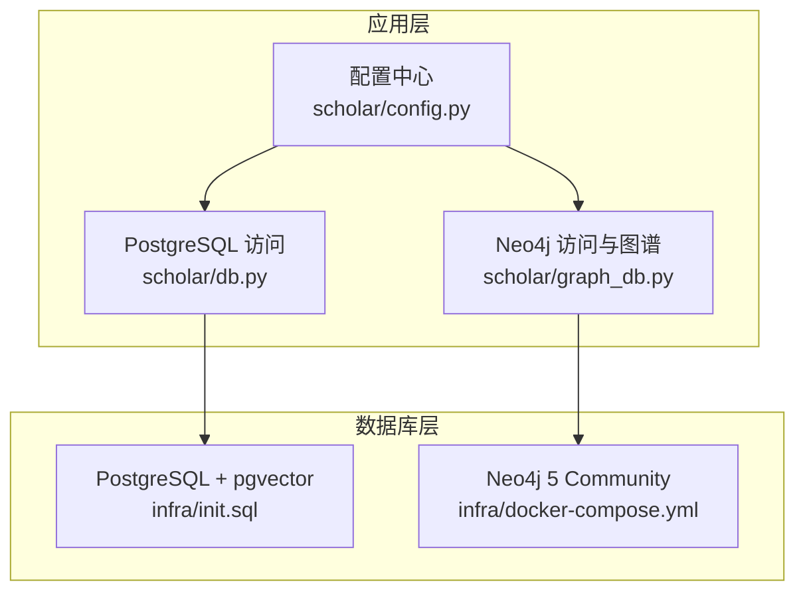
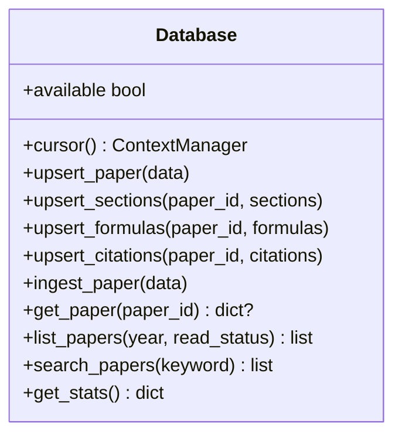
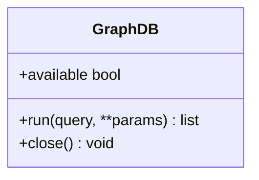
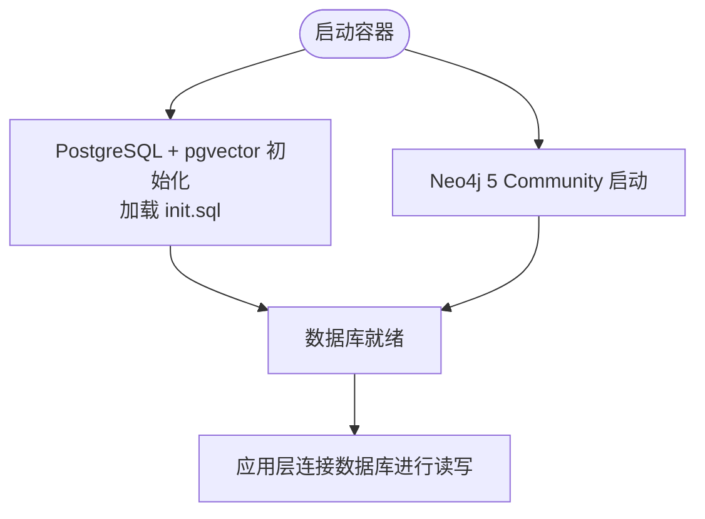
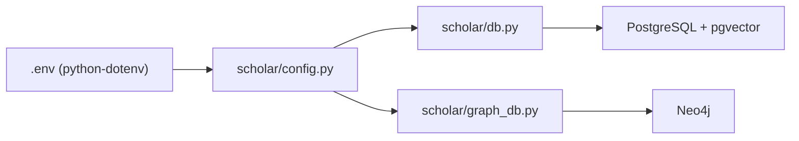
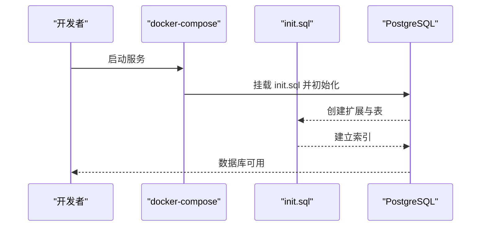
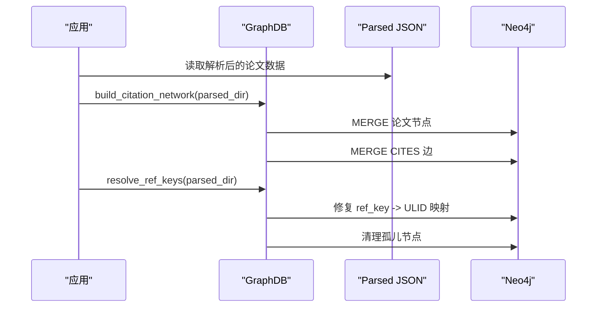

# 数据库系统

<cite>
**本文引用的文件**
- [infra/init.sql](file://infra/init.sql)
- [infra/docker-compose.yml](file://infra/docker-compose.yml)
- [scholar/db.py](file://scholar/db.py)
- [scholar/graph_db.py](file://scholar/graph_db.py)
- [scholar/config.py](file://scholar/config.py)
</cite>

## 目录
1. [简介](#简介)
2. [项目结构](#项目结构)
3. [核心组件](#核心组件)
4. [架构总览](#架构总览)
5. [详细组件分析](#详细组件分析)
6. [依赖关系分析](#依赖关系分析)
7. [性能考虑](#性能考虑)
8. [故障排除指南](#故障排除指南)
9. [结论](#结论)
10. [附录](#附录)

## 简介
本文件面向数据库系统的技术文档，聚焦以下目标：
- PostgreSQL + pgvector 的结构化与向量检索配置与使用，覆盖 papers、sections、formulas、citations、concepts、paper_concepts、chunks、innovations、replacements 等核心表的设计与关系。
- Neo4j 图数据库的 schema 设计与三类图谱：引用网络（CITES）、概念图（HAS_CONCEPT/RELATED_TO）、创新演进（REPLACES）。
- 数据库初始化脚本、连接配置、事务处理策略。
- 性能优化建议（索引、查询、缓存）。
- 数据同步机制：从 PostgreSQL 到 Neo4j 的迁移与增量更新策略。
- 故障排除与备份恢复方案。

## 项目结构
该仓库采用“分层模块 + 容器编排”的组织方式：
- 数据库层：PostgreSQL + pgvector（infra/init.sql 初始化表结构；docker-compose 提供容器化运行环境）
- 应用层：Python 模块 scholar/db.py（PostgreSQL 访问封装）、scholar/graph_db.py（Neo4j 访问与图构建/查询）
- 配置层：scholar/config.py（统一读取环境变量，定义目录与连接参数）



图表来源
- [infra/docker-compose.yml:1-44](file://infra/docker-compose.yml#L1-L44)
- [infra/init.sql:1-131](file://infra/init.sql#L1-L131)
- [scholar/db.py:1-276](file://scholar/db.py#L1-L276)
- [scholar/graph_db.py:1-800](file://scholar/graph_db.py#L1-L800)
- [scholar/config.py:1-116](file://scholar/config.py#L1-L116)

章节来源
- [infra/docker-compose.yml:1-44](file://infra/docker-compose.yml#L1-L44)
- [infra/init.sql:1-131](file://infra/init.sql#L1-L131)
- [scholar/db.py:1-276](file://scholar/db.py#L1-L276)
- [scholar/graph_db.py:1-800](file://scholar/graph_db.py#L1-L800)
- [scholar/config.py:1-116](file://scholar/config.py#L1-L116)

## 核心组件
- PostgreSQL + pgvector 表结构与索引：由 init.sql 统一初始化，涵盖论文元数据、章节、公式、引用、概念、论文-概念关联、分片嵌入、创新节点与替换关系。
- Python 数据库访问封装：scholar/db.py 提供 UPSERT、批量导入、统计查询、文件回退模式。
- Neo4j 图数据库封装：scholar/graph_db.py 提供图构建（引用网络、概念图、创新演进）、查询与指标计算。
- 运行时配置：scholar/config.py 通过环境变量加载数据库连接参数与目录路径。

章节来源
- [infra/init.sql:1-131](file://infra/init.sql#L1-L131)
- [scholar/db.py:24-276](file://scholar/db.py#L24-L276)
- [scholar/graph_db.py:32-800](file://scholar/graph_db.py#L32-L800)
- [scholar/config.py:41-64](file://scholar/config.py#L41-L64)

## 架构总览
系统以 PostgreSQL 为结构化与向量检索主存储，Neo4j 负责图谱分析与关系探索。初始化脚本定义表结构与索引；容器编排提供一键部署；Python 层负责数据写入、查询与图谱构建。

```mermaid
graph TB
A["PostgreSQL + pgvector<br/>infra/init.sql"] --> B["应用写入/查询<br/>scholar/db.py"]
B --> C["文件回退模式<br/>JSON 解析产物"]
D["Neo4j 5 Community<br/>infra/docker-compose.yml"] <- --> E["图谱构建/查询<br/>scholar/graph_db.py"]
B -.-> E
F["配置中心<br/>scholar/config.py"] --> B
F --> E
```

图表来源
- [infra/init.sql:1-131](file://infra/init.sql#L1-L131)
- [infra/docker-compose.yml:1-44](file://infra/docker-compose.yml#L1-L44)
- [scholar/db.py:15-276](file://scholar/db.py#L15-L276)
- [scholar/graph_db.py:24-800](file://scholar/graph_db.py#L24-L800)
- [scholar/config.py:41-64](file://scholar/config.py#L41-L64)

## 详细组件分析

### PostgreSQL + pgvector 表结构与关系
- papers：论文元数据主表，包含标题、作者、年份、会议、摘要、arXiv/DOI、解析状态、统计计数与时间戳。
- sections：论文结构化正文，按顺序保存段落内容，外键关联 papers。
- formulas：提取的 LaTeX 公式，记录公式文本、标签、环境类型与上下文。
- citations：引用关系，from_paper 指向源论文，to_ref 为引用键，to_paper 可选解析后的论文 ID。
- concepts：概念词典，唯一约束保证概念名不重复。
- paper_concepts：论文-概念关联表，记录相关性分数。
- chunks：RAG 分片与向量嵌入，embedding 维度可配置，外键关联 papers 与 sections。
- innovations：Lean4 创新节点同步，包含研究线、是否核心、年份与评分。
- replacements：创新节点之间的替换关系，去重约束保证方向唯一性。

```mermaid
erDiagram
PAPERS {
text id PK
text title
text[] authors
int year
text venue
text abstract
text arxiv_id
text doi
boolean has_tex
boolean parsed_ok
text parsed_path
int section_count
int formula_count
int citation_count
text read_status
timestamptz created_at
timestamptz updated_at
}
SECTIONS {
serial id PK
text paper_id FK
text heading
int level
text content
int position
timestamptz created_at
}
FORMULAS {
serial id PK
text paper_id FK
text latex
text label
text env_type
text context
boolean lean_verified
timestamptz created_at
}
CITATIONS {
serial id PK
text from_paper FK
text to_ref
text to_paper
boolean resolved
timestamptz created_at
}
CONCEPTS {
serial id PK
text name UK
text definition
timestamptz created_at
}
PAPER_CONCEPTS {
text paper_id FK
int concept_id FK
float relevance
}
CHUNKS {
serial id PK
text paper_id FK
int section_id
text section
text content
vector embedding
timestamptz created_at
}
INNOVATIONS {
text id PK
text line
boolean core
int year
int scalability
int simplicity
int stability
timestamptz created_at
}
REPLACEMENTS {
serial id PK
text from_innov FK
text to_innov FK
timestamptz created_at
}
PAPERS ||--o{ SECTIONS : "包含"
PAPERS ||--o{ FORMULAS : "包含"
PAPERS ||--o{ CITATIONS : "产生"
PAPERS ||--o{ CHUNKS : "生成"
PAPERS }o--o{ CONCEPTS : "关联"
INNOVATIONS ||--o{ REPLACEMENTS : "被替换"
```



图表来源
- [infra/init.sql:9-131](file://infra/init.sql#L9-L131)

章节来源
- [infra/init.sql:9-131](file://infra/init.sql#L9-L131)

### PostgreSQL 访问封装（scholar/db.py）
- 连接与可用性检测：动态导入 psycopg2，构造连接参数来自 config，提供可用性探测与连接复用。
- 事务管理：cursor 上下文管理器在成功时提交，异常时回滚，finally 关闭游标。
- 写入与更新：
  - upsert_paper：基于 id 的 ON CONFLICT 更新，保留部分字段的 COALESCE 合并。
  - upsert_sections/formulas/citations：先删除旧记录，再批量插入，确保幂等。
  - ingest_paper：一次性写入论文及其子表。
- 查询与统计：
  - get_paper/list_papers/search_papers：条件过滤、排序与限制。
  - get_stats：统计总数、解析完成数、分段/公式/引用数量与年份范围。
- 文件回退：save_parsed/load_parsed/list_parsed 在数据库不可用时保存/读取 JSON 文件。



图表来源
- [scholar/db.py:24-276](file://scholar/db.py#L24-L276)

章节来源
- [scholar/db.py:24-276](file://scholar/db.py#L24-L276)

### Neo4j 图数据库封装（scholar/graph_db.py）
- 连接与可用性：动态导入 neo4j.GraphDatabase，提供可用性探测与会话执行 run。
- 引用网络（CITES）：
  - build_citation_network：MERGE 论文节点，建立 CITES 边。
  - resolve_ref_keys：将引用键映射到实际 ULID，修复错误边并清理孤儿节点。
  - get_citation_stats/get_forward_citations/get_backward_citations/get_citation_path/get_bridge_papers：统计与查询。
- 概念图（HAS_CONCEPT/RELATED_TO）：
  - extract_concepts_tfidf：基于 TF-IDF 文档频率匹配概念别名集合。
  - build_concept_graph：MERGE 创新节点，建立 HAS_CONCEPT，基于共现建立 RELATED_TO 边。
  - find_papers_by_concept/find_related_concepts/get_concept_timeline/get_concept_subgraph：查询与子图。
- 创新演进（REPLACES）：
  - load_innovations_from_lean：从 Lean4 Database.lean 动态加载创新节点。
  - sync_lean4_replacements：导入 REPLACES 关系，支持回退硬编码数据。



图表来源
- [scholar/graph_db.py:32-70](file://scholar/graph_db.py#L32-L70)

章节来源
- [scholar/graph_db.py:32-800](file://scholar/graph_db.py#L32-L800)

### 初始化脚本与容器编排
- 初始化脚本（infra/init.sql）：
  - 创建扩展 vector（pgvector）。
  - 定义 papers、sections、formulas、citations、concepts、paper_concepts、chunks、innovations、replacements 表及索引。
- 容器编排（infra/docker-compose.yml）：
  - PostgreSQL（pg16 + pgvector），挂载 init.sql，暴露端口 5433。
  - Neo4j（5-community），启用 APOC 插件，暴露浏览器与 Bolt 端口。



图表来源
- [infra/docker-compose.yml:1-44](file://infra/docker-compose.yml#L1-L44)
- [infra/init.sql:1-131](file://infra/init.sql#L1-L131)

章节来源
- [infra/docker-compose.yml:1-44](file://infra/docker-compose.yml#L1-L44)
- [infra/init.sql:1-131](file://infra/init.sql#L1-L131)

## 依赖关系分析
- 外部依赖：
  - PostgreSQL + psycopg2（结构化与向量检索）
  - Neo4j（图谱分析）
  - python-dotenv（加载 .env）
- 内部耦合：
  - scholar/config.py 为 db.py 与 graph_db.py 提供统一的连接参数与目录路径。
  - db.py 与 graph_db.py 独立工作，但可通过 parsed JSON 间接共享数据（文件回退与图构建输入）。



图表来源
- [scholar/config.py:11-18](file://scholar/config.py#L11-L18)
- [scholar/db.py:12-28](file://scholar/db.py#L12-L28)
- [scholar/graph_db.py:17-37](file://scholar/graph_db.py#L17-L37)

章节来源
- [scholar/config.py:11-18](file://scholar/config.py#L11-L18)
- [scholar/db.py:12-28](file://scholar/db.py#L12-L28)
- [scholar/graph_db.py:17-37](file://scholar/graph_db.py#L17-L37)

## 性能考虑
- 索引策略
  - 已有索引：sections.paper_id、formulas.paper_id、citations.from_paper、citations.to_paper、chunks.paper_id。
  - 建议新增：papers.year、papers.read_status、papers.title/abstract 的全文索引（如 GIN/GIN_trgm），citations.to_ref 的前缀索引。
- 查询优化
  - 使用参数化查询（已实现）。
  - 对高频搜索（标题/摘要/内容）采用 ILIKE 并限制返回条数。
  - Neo4j 查询中对节点属性建立索引或使用 MERGE 时避免 N+1。
- 缓存机制
  - 应用层可引入 Redis 缓存热点论文详情与统计结果。
  - Neo4j 可缓存热门概念图谱子图与中心性指标。
- 连接池与并发
  - PostgreSQL：使用连接池（如 psycopg2.pool）减少连接开销，设置合理的最大连接数与空闲回收。
  - Neo4j：使用驱动内置会话池，控制并发与超时。
- 向量化与检索
  - chunks.embedding 使用 pgvector 向量相似度检索时，建议预估查询分布，必要时对 embedding 做归一化或分桶索引。

## 故障排除指南
- PostgreSQL 连接失败
  - 检查 SCHOLAR_PG_HOST/PORT/NAME/USER/PASS 是否正确。
  - 确认容器已健康运行（docker-compose 健康检查）。
  - 若导入失败，确认 init.sql 已挂载并执行。
- Neo4j 连接失败
  - 检查 SCHOLAR_NEO4J_URI/USER/PASS。
  - 确认 Neo4j 容器健康，APOC 插件已启用。
- 数据不一致
  - 引用解析：使用 resolve_ref_keys 修复 ref_key 到 ULID 的映射，清理孤儿节点。
  - 概念匹配：调整 TF-IDF 阈值与别名覆盖范围，确保 HAS_CONCEPT/RELATED_TO 边质量。
- 性能问题
  - 为高频查询列添加索引；对大结果集增加 LIMIT。
  - 对批量导入使用 UNWIND + 批处理（已实现）。
- 备份与恢复
  - PostgreSQL：定期导出 schema 与数据，结合 WAL 归档实现点-in-time 恢复。
  - Neo4j：使用快照与备份插件，定期导出图数据用于恢复测试。

## 结论
本系统通过 PostgreSQL + pgvector 实现论文结构化与向量检索，借助 Neo4j 构建引用网络、概念图与创新演进图谱。初始化脚本与容器编排提供了标准化部署路径；Python 封装实现了幂等写入、事务管理与文件回退。配合索引、查询优化与缓存策略，可在中大型论文库场景下获得稳定性能。通过引用解析、概念匹配与 REPLACES 同步，实现从结构化数据到知识图谱的高质量映射。

## 附录

### 数据库初始化流程（PostgreSQL）


图表来源
- [infra/docker-compose.yml:12-14](file://infra/docker-compose.yml#L12-L14)
- [infra/init.sql:4-106](file://infra/init.sql#L4-L106)

### Neo4j 图谱构建序列（引用网络）


图表来源
- [scholar/graph_db.py:225-281](file://scholar/graph_db.py#L225-L281)
- [scholar/graph_db.py:85-178](file://scholar/graph_db.py#L85-L178)

### 数据同步策略（PostgreSQL → Neo4j）
- 全量同步
  - 从 parsed JSON 读取论文元数据与引用，构建引用网络。
  - 从 parsed JSON 与概念别名匹配，构建概念图。
  - 从 Lean4 Database.lean 导入创新节点与 REPLACES 关系。
- 增量更新
  - 监控 parsed 目录变更，仅对新增/修改论文执行增量导入。
  - 引用解析阶段对未解析的 ref_key 进行增量修复。
  - 概念图根据新增论文重新计算 TF-IDF 并合并 HAS_CONCEPT/RELATED_TO 边。
- 一致性保障
  - 使用事务（PostgreSQL）与批处理（UNWIND）降低锁竞争。
  - Neo4j 中 MERGE 语句避免重复节点与边。
  - 定期运行中心性计算与统计查询，监控图谱健康度。

章节来源
- [scholar/graph_db.py:225-281](file://scholar/graph_db.py#L225-L281)
- [scholar/graph_db.py:85-178](file://scholar/graph_db.py#L85-L178)
- [scholar/graph_db.py:636-733](file://scholar/graph_db.py#L636-L733)
- [scholar/graph_db.py:794-800](file://scholar/graph_db.py#L794-L800)