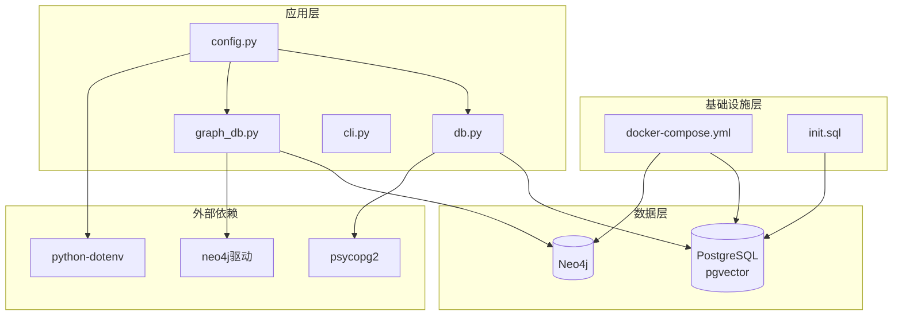
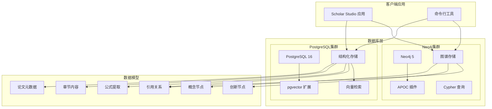
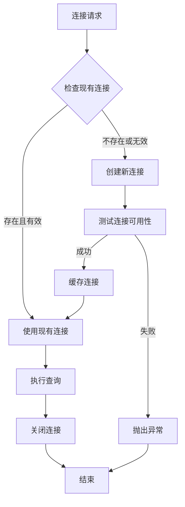
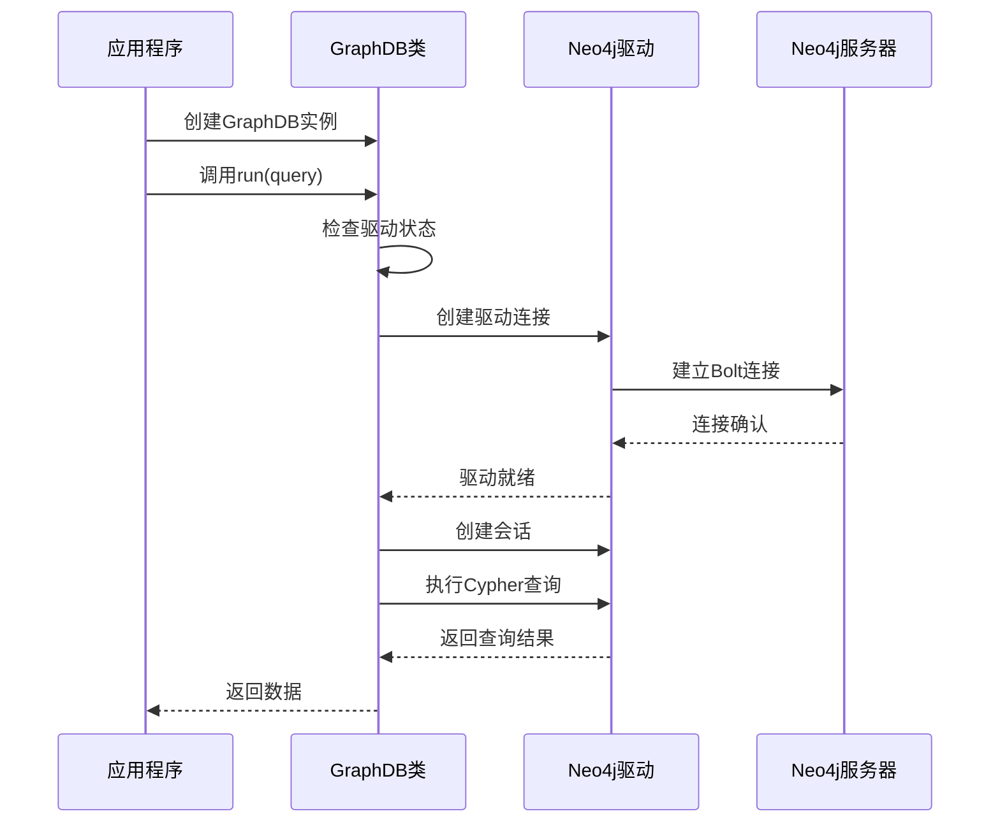
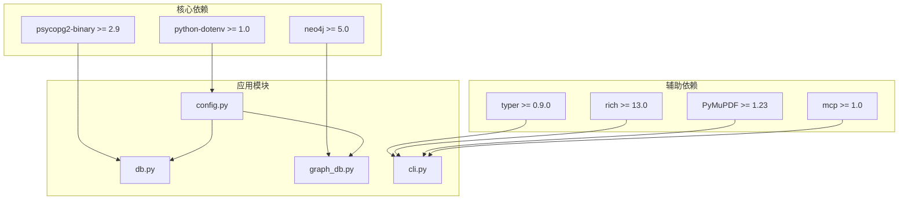
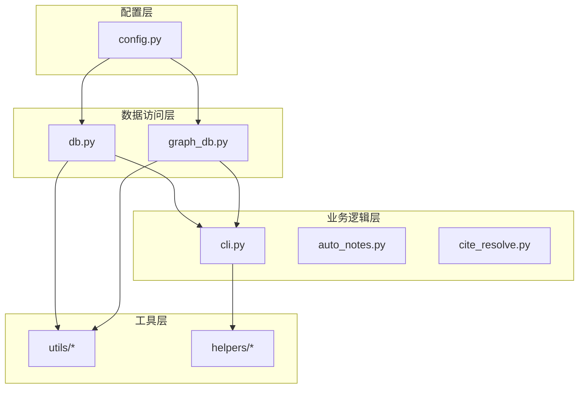
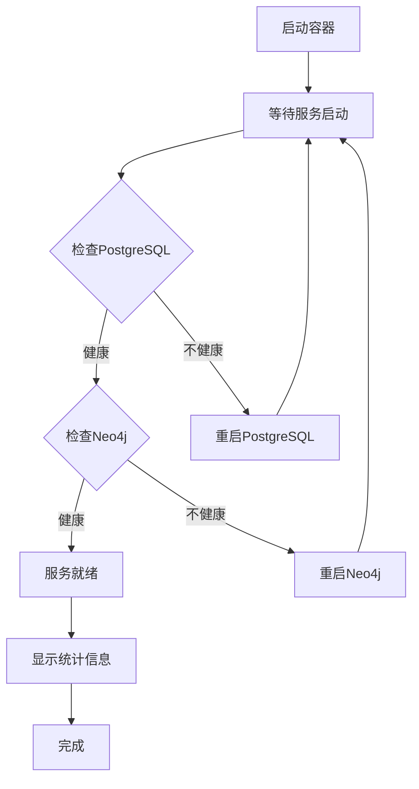

# 数据库配置与部署

<cite>
**本文档引用的文件**
- [docker-compose.yml](file://infra/docker-compose.yml)
- [init.sql](file://infra/init.sql)
- [config.py](file://scholar/config.py)
- [db.py](file://scholar/db.py)
- [graph_db.py](file://scholar/graph_db.py)
- [startup.ps1](file://startup.ps1)
- [requirements.txt](file://requirements.txt)
- [README.md](file://README.md)
- [Database.lean](file://LEAN/AiEvolution/Database.lean)
</cite>

## 目录
1. [简介](#简介)
2. [项目结构](#项目结构)
3. [核心组件](#核心组件)
4. [架构概览](#架构概览)
5. [详细组件分析](#详细组件分析)
6. [依赖关系分析](#依赖关系分析)
7. [性能考虑](#性能考虑)
8. [故障排除指南](#故障排除指南)
9. [结论](#结论)

## 简介

本文档提供了Scholar Studio项目的数据库配置与部署的完整技术文档。该项目采用容器化架构，使用Docker Compose同时部署PostgreSQL（带pgvector扩展）和Neo4j数据库服务，为机器学习研究知识库提供结构化存储和图谱分析能力。

系统支持两种数据库后端：PostgreSQL用于结构化数据存储和向量检索，Neo4j用于概念图谱和引用网络分析。所有数据库操作通过Python模块实现，具备优雅降级到文件系统的功能。

## 项目结构

项目采用模块化组织结构，数据库相关的核心文件分布如下：

**图表来源**
- [docker-compose.yml:1-44](file://infra/docker-compose.yml#L1-L44)
- [config.py:1-116](file://scholar/config.py#L1-L116)
- [db.py:1-276](file://scholar/db.py#L1-L276)
- [graph_db.py:1-922](file://scholar/graph_db.py#L1-L922)

**章节来源**
- [docker-compose.yml:1-44](file://infra/docker-compose.yml#L1-L44)
- [config.py:1-116](file://scholar/config.py#L1-L116)

## 核心组件

### PostgreSQL + pgvector 组件

PostgreSQL服务配置了以下关键参数：
- **镜像版本**: pgvector/pgvector:pg16
- **容器名称**: scholar-pg
- **端口映射**: 5433:5432（避免与本地PostgreSQL冲突）
- **数据库名称**: scholar
- **用户名**: scholar
- **密码**: scholar2024
- **卷挂载**: pgdata（持久化存储）、init.sql（初始化脚本）

### Neo4j 组件

Neo4j服务配置了以下关键参数：
- **镜像版本**: neo4j:5-community
- **容器名称**: scholar-neo4j
- **端口映射**: 7474:7474（Browser UI）、7687:7687（Bolt协议）
- **认证**: neo4j/scholar2024
- **插件**: APOC（Advanced Procedures and Custom Functions）
- **内存配置**: 初始堆大小512MB，最大1GB
- **卷挂载**: neo4jdata（持久化存储）

**章节来源**
- [docker-compose.yml:3-39](file://infra/docker-compose.yml#L3-L39)

## 架构概览

系统采用双数据库架构，每种数据库服务于特定的数据模型和查询模式：

**图表来源**
- [db.py:79-176](file://scholar/db.py#L79-L176)
- [graph_db.py:225-281](file://scholar/graph_db.py#L225-L281)
- [init.sql:1-131](file://infra/init.sql#L1-L131)

## 详细组件分析

### 数据库连接配置

#### PostgreSQL 连接配置

应用程序通过环境变量配置PostgreSQL连接参数：

| 配置项 | 默认值 | 环境变量 | 说明 |
|--------|--------|----------|------|
| 主机地址 | localhost | SCHOLAR_PG_HOST | 数据库主机名或IP |
| 端口 | 5433 | SCHOLAR_PG_PORT | PostgreSQL端口号 |
| 数据库名 | scholar | SCHOLAR_PG_NAME | 目标数据库名称 |
| 用户名 | scholar | SCHOLAR_PG_USER | 认证用户名 |
| 密码 | scholar2024 | SCHOLAR_PG_PASS | 认证密码 |

#### Neo4j 连接配置

应用程序通过环境变量配置Neo4j连接参数：

| 配置项 | 默认值 | 环境变量 | 说明 |
|--------|--------|----------|------|
| URI | bolt://localhost:7687 | SCHOLAR_NEO4J_URI | 连接URI格式 |
| 用户名 | neo4j | SCHOLAR_NEO4J_USER | 认证用户名 |
| 密码 | scholar2024 | SCHOLAR_NEO4J_PASS | 认证密码 |

**章节来源**
- [config.py:42-51](file://scholar/config.py#L42-L51)

### 数据库初始化脚本

初始化脚本定义了完整的数据库模式，包括以下核心表：

#### 论文表 (papers)
存储论文的核心元数据，支持全文搜索和统计分析。

#### 章节表 (sections)
存储论文的结构化内容，支持层次化文本检索。

#### 公式表 (formulas)
提取LaTeX公式，支持数学内容分析。

#### 引用表 (citations)
建立论文间的引用关系，支持引用网络分析。

#### 嵌入表 (chunks)
存储向量化文本块，支持RAG（检索增强生成）功能。

**章节来源**
- [init.sql:9-131](file://infra/init.sql#L9-L131)

### 连接池和错误处理

#### PostgreSQL 连接管理

数据库类实现了智能连接管理机制：

**图表来源**
- [db.py:46-73](file://scholar/db.py#L46-L73)

#### Neo4j 连接管理

图数据库类同样实现了连接池管理：

**图表来源**
- [graph_db.py:51-69](file://scholar/graph_db.py#L51-L69)

**章节来源**
- [db.py:24-73](file://scholar/db.py#L24-L73)
- [graph_db.py:32-69](file://scholar/graph_db.py#L32-L69)

## 依赖关系分析

### 外部依赖

项目的主要外部依赖包括：

**图表来源**
- [requirements.txt:1-9](file://requirements.txt#L1-L9)
- [config.py:1-116](file://scholar/config.py#L1-L116)

### 内部模块依赖

**图表来源**
- [config.py:1-116](file://scholar/config.py#L1-L116)
- [db.py:1-276](file://scholar/db.py#L1-L276)
- [graph_db.py:1-922](file://scholar/graph_db.py#L1-L922)

**章节来源**
- [requirements.txt:1-9](file://requirements.txt#L1-L9)

## 性能考虑

### 数据库性能优化

#### PostgreSQL 优化策略

1. **索引优化**: 初始化脚本为常用查询字段建立了适当的索引
2. **向量存储**: 使用pgvector扩展支持高效的相似性搜索
3. **连接池**: 实现智能连接复用减少连接开销
4. **批量操作**: 支持批量插入和更新操作

#### Neo4j 优化策略

1. **内存配置**: 合理的堆内存配置支持大规模图查询
2. **APOC插件**: 提供高级图算法和数据导入功能
3. **索引优化**: 为频繁查询的节点属性建立索引
4. **事务管理**: 合理的事务边界控制确保数据一致性

### 容器资源管理

Docker Compose文件中包含了基本的资源配置，可根据实际需求进行调整：

- **内存限制**: Neo4j配置了最大堆大小限制
- **存储卷**: 使用命名卷确保数据持久化
- **健康检查**: 自动监控数据库服务状态

## 故障排除指南

### 常见部署问题

#### 端口冲突

**问题描述**: 容器启动时提示端口已被占用

**解决方案**:
1. 检查宿主机端口占用情况
2. 修改docker-compose.yml中的端口映射
3. 使用`docker ps`查看现有容器状态

#### 权限问题

**问题描述**: 应用程序无法连接到数据库

**解决方案**:
1. 验证数据库凭据配置
2. 检查防火墙设置
3. 确认用户权限配置

#### 连接超时

**问题描述**: 应用程序连接数据库超时

**解决方案**:
1. 检查数据库服务状态
2. 验证网络连通性
3. 调整连接超时参数

### 健康检查

启动脚本提供了完整的健康检查流程：

**图表来源**
- [startup.ps1:17-44](file://startup.ps1#L17-L44)

**章节来源**
- [startup.ps1:1-65](file://startup.ps1#L1-L65)

## 结论

Scholar Studio项目采用了成熟的容器化数据库架构，通过Docker Compose实现了PostgreSQL和Neo4j的统一部署管理。该架构具有以下优势：

1. **隔离性强**: 每个数据库服务独立运行，互不影响
2. **易于维护**: 容器化部署简化了环境配置和版本管理
3. **可扩展性**: 支持水平扩展和负载均衡
4. **可靠性高**: 健康检查和自动重启机制确保服务稳定性

通过合理的配置管理和监控策略，该数据库架构能够满足机器学习研究知识库的高性能需求，为学术研究提供可靠的数据基础设施支持。