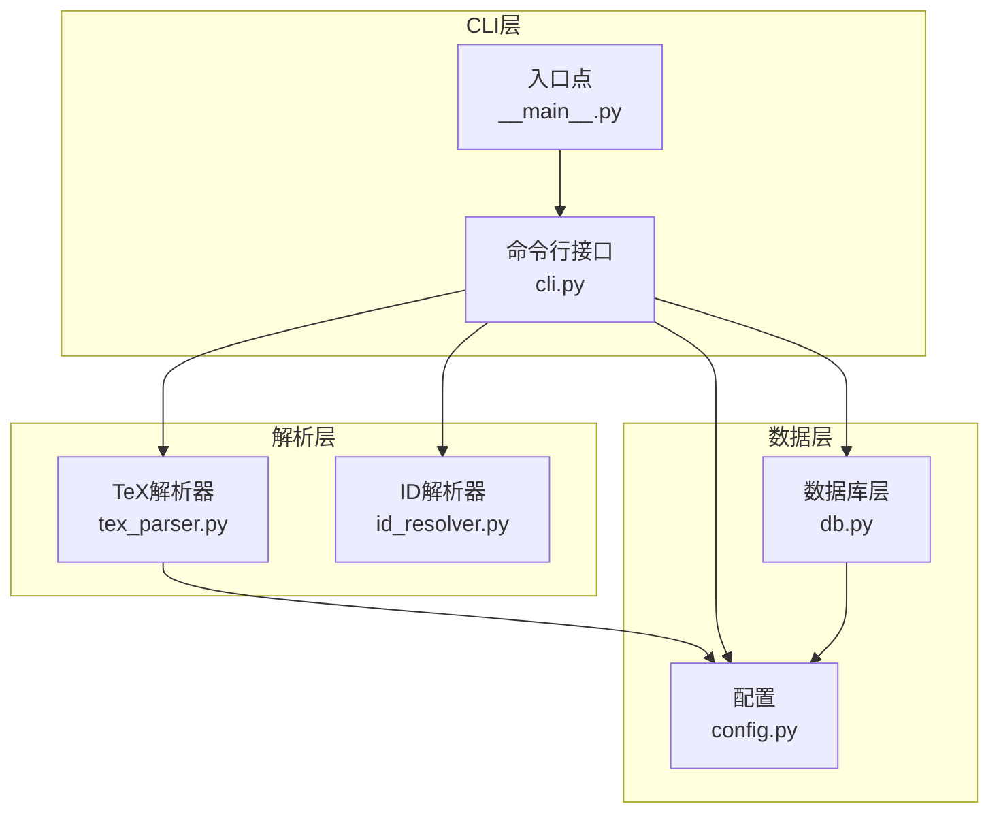
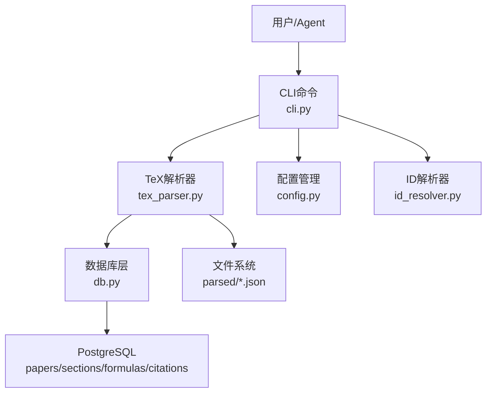
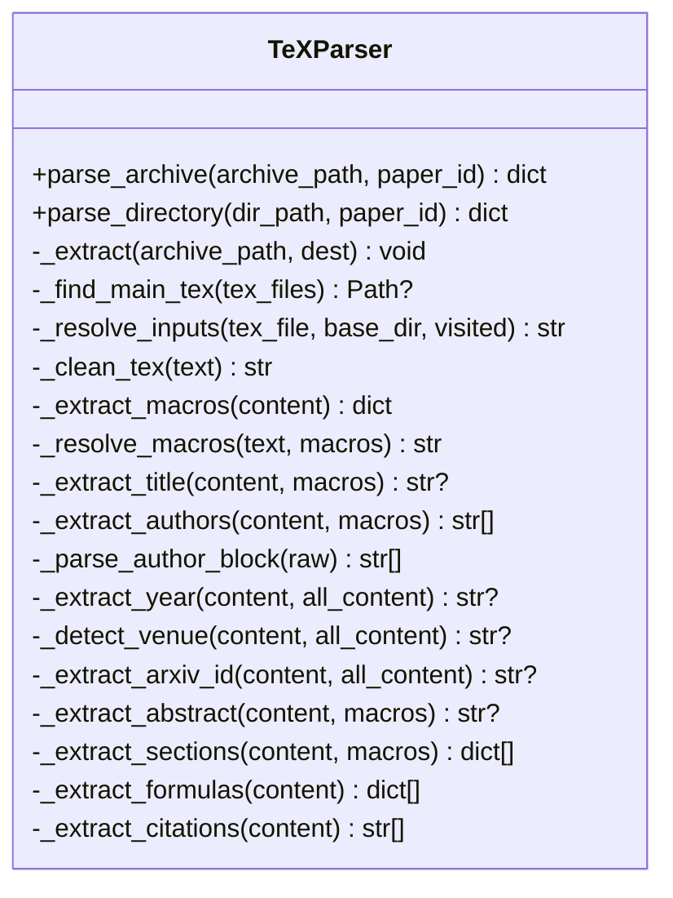
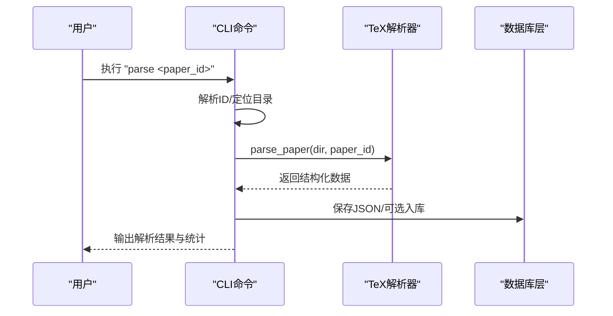
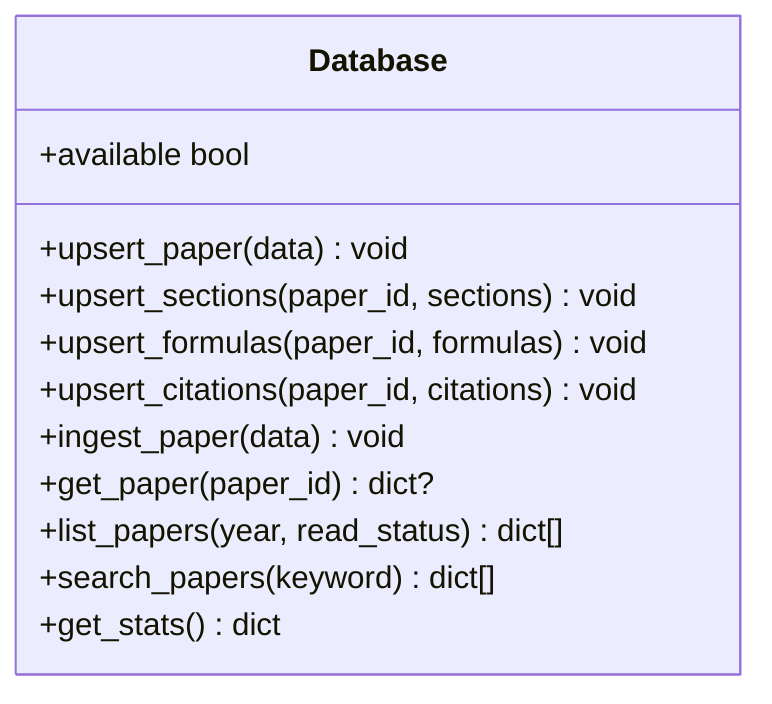
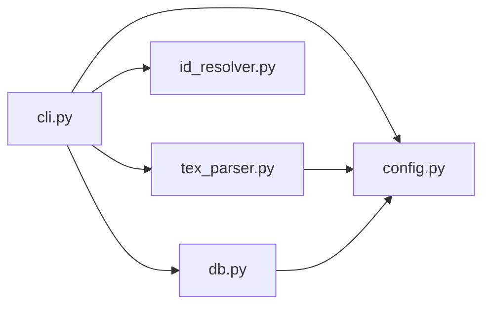

# LaTeX论文解析器

<cite>
**本文档引用的文件**
- [tex_parser.py](file://scholar/tex_parser.py)
- [cli.py](file://scholar/cli.py)
- [config.py](file://scholar/config.py)
- [db.py](file://scholar/db.py)
- [id_resolver.py](file://scholar/id_resolver.py)
- [__main__.py](file://scholar/__main__.py)
- [requirements.txt](file://requirements.txt)
- [README.md](file://README.md)
</cite>

## 目录
1. [简介](#简介)
2. [项目结构](#项目结构)
3. [核心组件](#核心组件)
4. [架构总览](#架构总览)
5. [详细组件分析](#详细组件分析)
6. [依赖关系分析](#依赖关系分析)
7. [性能考虑](#性能考虑)
8. [故障排除指南](#故障排除指南)
9. [结论](#结论)
10. [附录](#附录)

## 简介
本项目为一个面向学术论文（特别是人工智能领域）的LaTeX论文解析器，专注于从TeX源码中抽取结构化信息，包括标题、作者、年份、会议、arXiv ID、摘要、章节、公式以及引用等。解析器采用正则表达式与递归解析相结合的方式，具备强大的宏展开、输入文件合并、公式识别与去噪能力，并提供命令行工具进行批量解析、数据库持久化、图谱构建与RAG检索支持。

## 项目结构
- scholar/tex_parser.py：核心解析器，负责TeX源码解析、宏展开、元数据抽取、章节与公式提取
- scholar/cli.py：命令行接口，提供扫描、解析、批量解析、信息查询、图谱构建、RAG索引等命令
- scholar/config.py：配置与环境变量加载，包含数据库、Neo4j、嵌入API、arXiv请求等配置
- scholar/db.py：数据库访问层（PostgreSQL），提供论文、章节、公式、引用的增删改查与全文搜索
- scholar/id_resolver.py：论文ID解析器，支持ULID、arXiv、DOI、slug等多种ID格式
- scholar/__main__.py：CLI入口点
- requirements.txt：Python依赖清单
- README.md：项目说明、快速开始、命令参考、常见问题等

**图表来源**
- [cli.py:1-80](file://scholar/cli.py#L1-L80)
- [tex_parser.py:23-60](file://scholar/tex_parser.py#L23-L60)
- [config.py:1-40](file://scholar/config.py#L1-L40)
- [db.py:24-60](file://scholar/db.py#L24-L60)
- [id_resolver.py:15-40](file://scholar/id_resolver.py#L15-L40)

**章节来源**
- [README.md:365-404](file://README.md#L365-L404)
- [requirements.txt:1-14](file://requirements.txt#L1-L14)

## 核心组件
- TeXParser：解析TeX源码，提取元数据、章节、公式、引用；支持宏展开、输入文件递归合并、噪声过滤
- CLI：提供scan、parse、parse-all、info、search、list-papers、stats、export-bib、graph-build、graph-stats、graph-query、arxiv-search、rag-search等命令
- Database：PostgreSQL访问层，提供论文、章节、公式、引用的持久化与全文搜索
- Config：统一配置管理，包含数据库、Neo4j、嵌入API、arXiv请求等
- IDResolver：论文ID解析器，支持多种ID格式与模糊匹配

**章节来源**
- [tex_parser.py:23-60](file://scholar/tex_parser.py#L23-L60)
- [cli.py:46-171](file://scholar/cli.py#L46-L171)
- [db.py:24-60](file://scholar/db.py#L24-L60)
- [config.py:20-60](file://scholar/config.py#L20-L60)
- [id_resolver.py:15-40](file://scholar/id_resolver.py#L15-L40)

## 架构总览
解析器遵循“CLI → 解析器 → 数据库/文件”的分层架构。CLI负责用户交互与批处理调度，TeXParser负责内容抽取与清洗，Database负责结构化存储与检索，Config集中管理外部服务配置，IDResolver提供跨格式ID解析。

**图表来源**
- [cli.py:132-171](file://scholar/cli.py#L132-L171)
- [tex_parser.py:219-262](file://scholar/tex_parser.py#L219-L262)
- [db.py:79-176](file://scholar/db.py#L79-L176)
- [config.py:44-60](file://scholar/config.py#L44-L60)
- [id_resolver.py:47-86](file://scholar/id_resolver.py#L47-L86)

## 详细组件分析

### TeXParser组件分析
- 功能职责
  - 输入文件解析：支持tar.gz、tar、zip三种归档格式，自动解压并查找主.tex文件
  - 宏展开：提取\newcommand/\def定义，支持多轮替换，处理嵌套宏
  - 元数据抽取：标题、作者、年份、会议、arXiv ID、摘要
  - 章节提取：递归解析\input/\include，提取各级标题与正文，去除噪声命令
  - 公式抽取：识别多种数学环境与显示/行间公式，保留标签与环境类型
  - 引用抽取：识别各类cite命令与\bibitem条目
  - 噪声过滤：移除注释、格式命令、间距命令、图片/颜色/字体命令等
- 关键算法
  - 主文件选择：优先选择包含\documentclass且\input引用较多的文件
  - 输入文件合并：递归解析\input/\include，支持相对路径、绝对路径与全局搜索
  - 公式识别：正则匹配多种数学环境与$$、$$、$$、$$、$$等显示公式
  - 章节清洗：多阶段正则替换，逐步去除格式命令、噪声命令、数学环境
- 性能特性
  - 使用集合去重避免重复公式
  - 截断长文本防止内存膨胀
  - 递归解析使用visited集合避免环形依赖

**图表来源**
- [tex_parser.py:23-60](file://scholar/tex_parser.py#L23-L60)
- [tex_parser.py:219-298](file://scholar/tex_parser.py#L219-L298)
- [tex_parser.py:304-374](file://scholar/tex_parser.py#L304-L374)
- [tex_parser.py:403-435](file://scholar/tex_parser.py#L403-L435)
- [tex_parser.py:441-527](file://scholar/tex_parser.py#L441-L527)
- [tex_parser.py:529-714](file://scholar/tex_parser.py#L529-L714)
- [tex_parser.py:1542-1592](file://scholar/tex_parser.py#L1542-L1592)

**章节来源**
- [tex_parser.py:219-298](file://scholar/tex_parser.py#L219-L298)
- [tex_parser.py:304-374](file://scholar/tex_parser.py#L304-L374)
- [tex_parser.py:403-435](file://scholar/tex_parser.py#L403-L435)
- [tex_parser.py:441-527](file://scholar/tex_parser.py#L441-L527)
- [tex_parser.py:529-714](file://scholar/tex_parser.py#L529-L714)
- [tex_parser.py:1542-1592](file://scholar/tex_parser.py#L1542-L1592)

### CLI组件分析
- 命令功能
  - scan：扫描论文库，统计解析状态
  - parse：解析单篇论文，保存JSON并可选入库
  - parse-all：批量解析论文，支持限流与重试
  - info：查看解析后的论文详情
  - search：全文搜索（数据库优先，回退文件）
  - list-papers：列出解析后的论文元数据
  - stats：知识库统计
  - export-bib：导出BibTeX
  - graph-build/graph-stats/graph-query：Neo4j图谱构建与查询
  - arxiv-search：arXiv搜索
  - latex-compile：LaTeX编译与错误解析
- 错误处理
  - 解析失败捕获异常并输出错误
  - LaTeX编译错误解析，提取致命错误、警告与上下文

**图表来源**
- [cli.py:132-171](file://scholar/cli.py#L132-L171)
- [cli.py:1817-1909](file://scholar/cli.py#L1817-L1909)

**章节来源**
- [cli.py:46-171](file://scholar/cli.py#L46-L171)
- [cli.py:1739-1774](file://scholar/cli.py#L1739-L1774)
- [cli.py:1817-1909](file://scholar/cli.py#L1817-L1909)

### 数据库层分析
- 功能职责
  - 论文：upsert、查询、列表、搜索
  - 章节：按论文替换插入
  - 公式：按论文替换插入
  - 引用：按来源论文替换插入
- 错误处理
  - 连接检测与回退（无psycopg2时文件模式）
  - 事务控制与回滚

**图表来源**
- [db.py:24-60](file://scholar/db.py#L24-L60)
- [db.py:79-176](file://scholar/db.py#L79-L176)
- [db.py:181-241](file://scholar/db.py#L181-L241)

**章节来源**
- [db.py:24-60](file://scholar/db.py#L24-L60)
- [db.py:79-176](file://scholar/db.py#L79-L176)
- [db.py:181-241](file://scholar/db.py#L181-L241)

### 配置与ID解析
- 配置管理
  - 环境变量加载（dotenv）
  - 数据目录与输出目录
  - 数据库、Neo4j、嵌入API、LaTeX命令、Lean4路径
  - arXiv请求工具（重试、超时、代理）
- ID解析
  - 多格式ID解析：ULID、arXiv、DOI、slug
  - 内存缓存与首次扫描构建索引
  - 模糊匹配与规范化

**章节来源**
- [config.py:1-40](file://scholar/config.py#L1-L40)
- [config.py:72-119](file://scholar/config.py#L72-L119)
- [id_resolver.py:15-40](file://scholar/id_resolver.py#L15-L40)
- [id_resolver.py:47-86](file://scholar/id_resolver.py#L47-L86)

## 依赖关系分析
- 外部依赖
  - typer/rich：CLI框架与终端美化
  - psycopg2-binary：PostgreSQL连接
  - neo4j：Neo4j图数据库驱动
  - python-dotenv：环境变量加载
  - PyMuPDF：PDF处理（用于PDF侧的论文处理）
  - mcp：MCP协议（Qoder集成）
- 内部模块耦合
  - CLI依赖TeXParser、IDResolver、Config、DB
  - TeXParser依赖Config（正则与模式）
  - DB依赖Config（连接参数）

**图表来源**
- [cli.py:19-29](file://scholar/cli.py#L19-L29)
- [tex_parser.py:11-20](file://scholar/tex_parser.py#L11-L20)
- [db.py:12-12](file://scholar/db.py#L12-L12)
- [config.py:8-18](file://scholar/config.py#L8-L18)

**章节来源**
- [requirements.txt:1-14](file://requirements.txt#L1-L14)
- [cli.py:19-29](file://scholar/cli.py#L19-L29)

## 性能考虑
- 正则匹配优化
  - 使用预编译正则表达式减少重复编译开销
  - 多阶段清洗减少回溯复杂度
- 内存管理
  - 长文本截断与去重（公式）
  - 临时目录与资源释放
- I/O优化
  - 递归解析使用visited集合避免重复读取
  - 批量命令使用进度条与并发控制
- 数据库优化
  - UPSERT使用ON CONFLICT，减少查询次数
  - 全文搜索使用ILIKE与LIMIT

[本节为通用性能讨论，无需具体文件分析]

## 故障排除指南
- arXiv请求失败
  - 检查代理设置与超时重试配置
  - 确认API Key与网络连通性
- 数据库连接失败
  - 确认PostgreSQL容器运行与端口映射
  - 检查凭据与防火墙
- LaTeX编译错误
  - 查看致命错误与上下文行号
  - 检查宏包与字体依赖
- CLI命令失败
  - 使用--help查看参数
  - 检查paper_id解析与目录存在性

**章节来源**
- [config.py:72-119](file://scholar/config.py#L72-L119)
- [cli.py:1739-1774](file://scholar/cli.py#L1739-L1774)
- [cli.py:1817-1909](file://scholar/cli.py#L1817-L1909)

## 结论
本解析器通过严谨的正则匹配与递归解析策略，实现了对LaTeX论文源码的高精度结构化抽取。结合CLI、数据库与图谱能力，形成了从数据采集到知识推理的完整链路。建议在生产环境中配合数据库与缓存策略，进一步提升大规模解析的稳定性与性能。

[本节为总结性内容，无需具体文件分析]

## 附录

### 支持的LaTeX宏包与命令
- 标题与作者：\title、\author、\icmlauthor、\icmltitle、\icmltitlerunning
- 年份与会议：\year、\month、\day、\acmYear、会议样式识别
- 抽象：\begin{abstract}...\end{abstract}
- 章节：\section、\subsection、\subsubsection、\chapter、\part
- 数学环境：equation、align、gather、multline、eqnarray、displaymath、alignat、split等
- 引用：\cite、\citep、\citet、\citealp、\citeauthor、\citeyear、\Cite、\bibitem
- 宏定义：\newcommand、\renewcommand、\def
- 公式：$$...$$、$$...$$、$$...$$、行间$...$

**章节来源**
- [tex_parser.py:27-107](file://scholar/tex_parser.py#L27-L107)
- [tex_parser.py:1542-1592](file://scholar/tex_parser.py#L1542-L1592)

### 结构化输出字段
- paper_id：论文唯一标识
- title：标题
- authors：作者列表
- year：年份
- venue：会议/期刊
- arxiv_id：arXiv ID
- abstract：摘要
- sections：章节数组（heading、level、content、position）
- formulas：公式数组（latex、label、env_type）
- citations：引用数组
- tex_file_count：TeX文件数量
- main_tex_file：主TeX文件名

**章节来源**
- [tex_parser.py:245-262](file://scholar/tex_parser.py#L245-L262)
- [tex_parser.py:282-298](file://scholar/tex_parser.py#L282-L298)

### 使用示例与集成指南
- 快速开始
  - 安装依赖、配置.env、启动数据库、执行bootstrap
- 基本命令
  - python -m scholar scan
  - python -m scholar parse <paper_id>
  - python -m scholar parse-all
  - python -m scholar info <paper_id>
  - python -m scholar search "<keyword>"
  - python -m scholar list-papers --year 2024
  - python -m scholar stats
  - python -m scholar export-bib
  - python -m scholar graph-build / graph-stats / graph-query
  - python -m scholar arxiv-search "<query>"
- 集成
  - 作为MCP Server与Qoder集成
  - 通过插件分发（build_plugin.py）

**章节来源**
- [README.md:9-127](file://README.md#L9-L127)
- [README.md:317-361](file://README.md#L317-L361)
- [README.md:501-524](file://README.md#L501-L524)