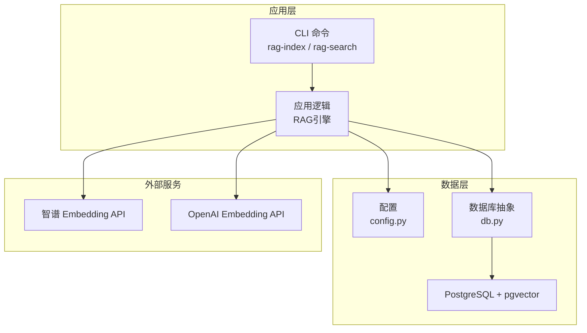
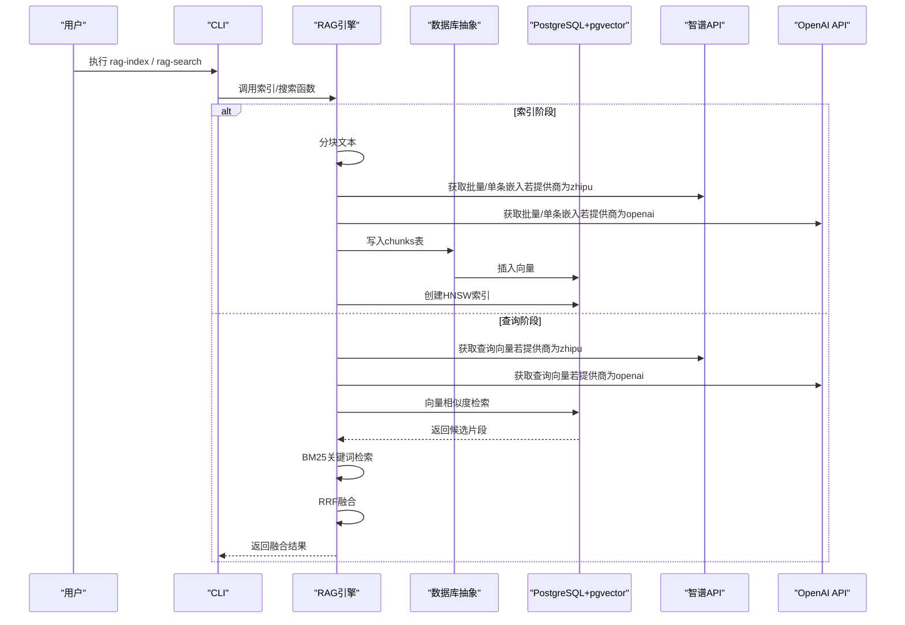
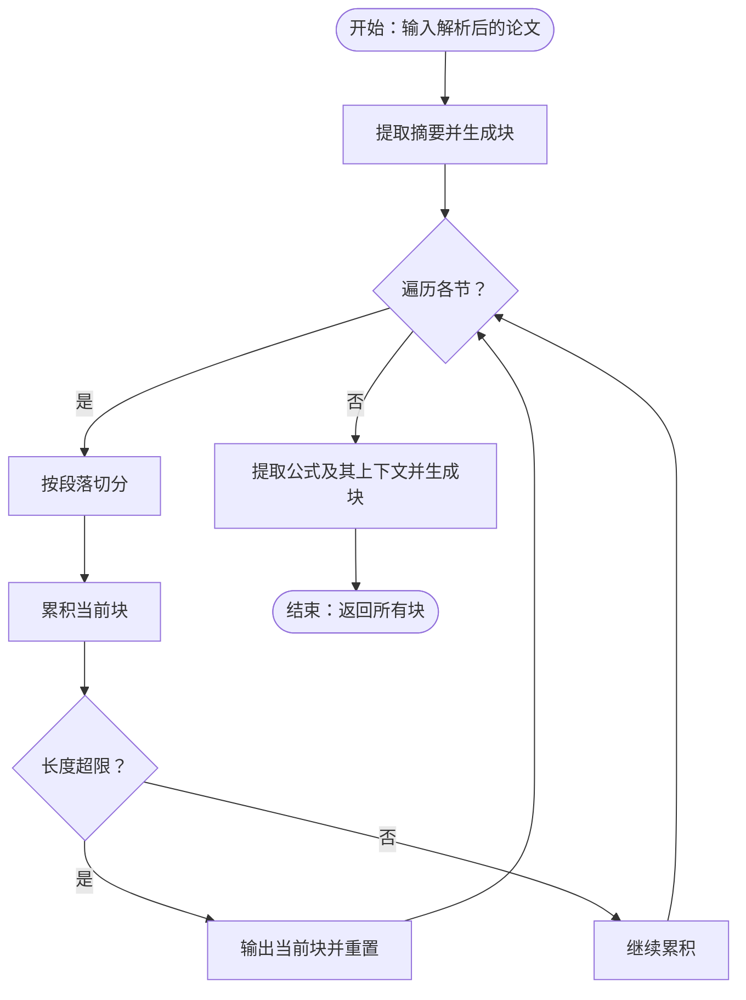
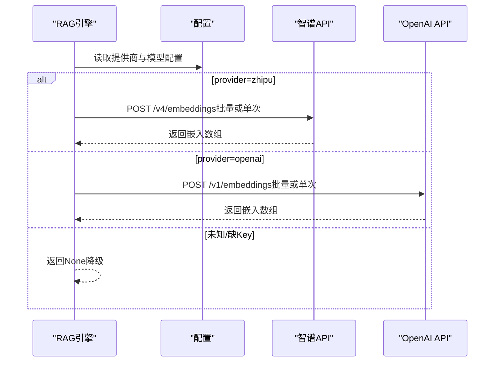
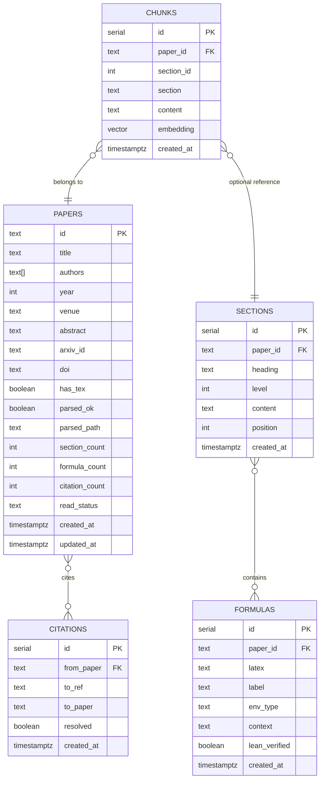
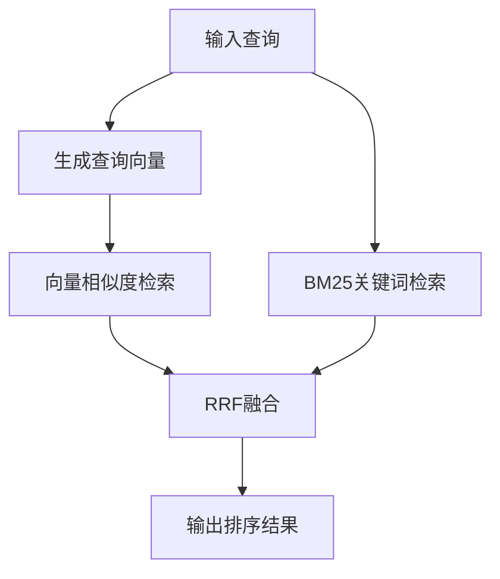
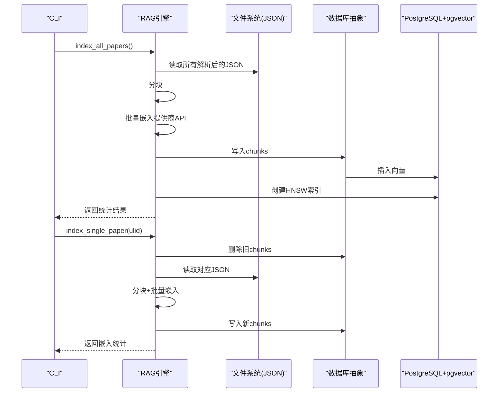
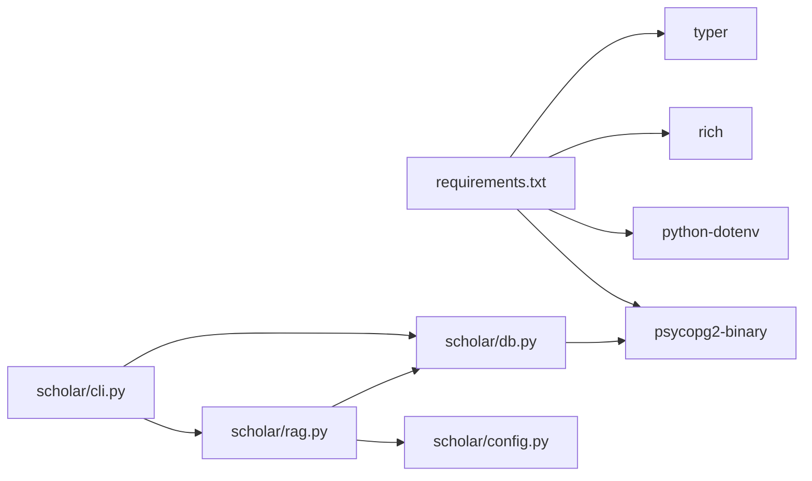

# RAG引擎架构

<cite>
**本文引用的文件**
- [rag.py](file://scholar/rag.py)
- [db.py](file://scholar/db.py)
- [config.py](file://scholar/config.py)
- [init.sql](file://infra/init.sql)
- [requirements.txt](file://requirements.txt)
- [cli.py](file://scholar/cli.py)
</cite>

## 目录
1. [简介](#简介)
2. [项目结构](#项目结构)
3. [核心组件](#核心组件)
4. [架构总览](#架构总览)
5. [详细组件分析](#详细组件分析)
6. [依赖关系分析](#依赖关系分析)
7. [性能考虑](#性能考虑)
8. [故障排查指南](#故障排查指南)
9. [结论](#结论)
10. [附录：API与配置参数](#附录api与配置参数)

## 简介
本技术文档面向RAG（检索增强生成）引擎的架构与实现，系统性阐述从“文本分块”到“向量嵌入生成”、“PostgreSQL + pgvector向量存储与近似最近邻搜索”，再到“混合检索与重排序”的完整链路。文档同时覆盖智谱与OpenAI两种嵌入模型提供商的集成方式、错误处理与降级策略、HNSW索引的创建与优化、批量嵌入处理、增量索引更新以及性能优化实践，并提供可操作的API使用示例与配置参数说明。

## 项目结构
RAG引擎位于 scholar 子模块中，配合数据库层、配置与初始化脚本共同构成端到端能力：
- 文本分块与嵌入：scholar/rag.py
- 数据库抽象与落库：scholar/db.py
- 配置加载与环境变量：scholar/config.py
- 初始化SQL（含pgvector扩展与表结构）：infra/init.sql
- 依赖声明：requirements.txt
- CLI命令入口与RAG相关子命令：scholar/cli.py

图表来源
- [cli.py](file://scholar/cli.py)
- [rag.py](file://scholar/rag.py)
- [db.py](file://scholar/db.py)
- [config.py](file://scholar/config.py)

章节来源
- [cli.py](file://scholar/cli.py)
- [rag.py](file://scholar/rag.py)
- [db.py](file://scholar/db.py)
- [config.py](file://scholar/config.py)
- [init.sql](file://infra/init.sql)
- [requirements.txt](file://requirements.txt)

## 核心组件
- 文本分块器：将解析后的论文按节拆分为可嵌入的片段，保留摘要、公式等关键语义单元。
- 嵌入生成器：支持智谱与OpenAI两种提供商，具备批量与单次调用路径，内置超时与异常降级。
- 向量存储与索引：基于PostgreSQL + pgvector，采用HNSW索引进行向量相似度检索。
- 关键词检索与融合：轻量BM25关键词检索作为补充，与向量检索通过RRF（Reciprocal Rank Fusion）融合。
- 批量索引与增量更新：提供全量构建与单篇重索引能力，支持进度可视化与统计输出。
- 数据库抽象：在PostgreSQL可用时走结构化存储，不可用时回退至文件模式。

章节来源
- [rag.py](file://scholar/rag.py)
- [db.py](file://scholar/db.py)
- [config.py](file://scholar/config.py)
- [init.sql](file://infra/init.sql)

## 架构总览
下图展示RAG引擎的关键交互：CLI触发索引或查询；RAG模块负责分块、嵌入、入库与检索；数据库层封装连接与事务；外部API提供向量表示；pgvector提供高效相似度检索。

图表来源
- [cli.py](file://scholar/cli.py)
- [rag.py](file://scholar/rag.py)
- [db.py](file://scholar/db.py)

## 详细组件分析

### 文本分块策略
- 抽象摘要始终独立成块，确保检索起点覆盖全文要点。
- 按节拆分段落，超过阈值自动切分，保持上下文连贯。
- 公式及其上下文单独成块，便于数学表达检索。
- 输出包含paper_id、节名、内容与类型标记，便于后续检索与去重。

图表来源
- [rag.py](file://scholar/rag.py)

章节来源
- [rag.py](file://scholar/rag.py)

### 向量嵌入生成与提供商集成
- 提供商选择：通过配置项选择智谱或OpenAI。
- 智谱API：支持批量输入（约30条/批），请求体包含模型名与截断后文本列表；单次调用作为回退路径。
- OpenAI API：固定模型名，限制输入长度；同样支持单次调用回退。
- 错误处理：统一捕获异常并返回None，保证上层流程不中断；超时控制在10秒以上（批量场景可达30秒）。
- 降级策略：当API密钥缺失或调用失败时，返回空向量占位，后续入库跳过该条，统计失败数用于评估质量。

图表来源
- [rag.py](file://scholar/rag.py)
- [config.py](file://scholar/config.py)

章节来源
- [rag.py](file://scholar/rag.py)
- [config.py](file://scholar/config.py)

### PostgreSQL + pgvector：存储与索引
- 表结构：chunks表保存paper_id、节名、内容与向量字段；其他表如papers、sections、formulas、citations支撑知识库。
- 向量维度：根据所选提供商配置（默认1024）。
- 插入：逐条写入，向量以字符串形式传入，由pgvector转换。
- HNSW索引：使用cosine距离，参数m与ef_construction可调，提升召回与吞吐平衡。
- 连接管理：统一通过配置读取主机、端口、库名、账号与密码；异常时打印错误但不中断流程。

图表来源
- [init.sql](file://infra/init.sql)

章节来源
- [init.sql](file://infra/init.sql)
- [rag.py](file://scholar/rag.py)
- [config.py](file://scholar/config.py)

### 语义搜索与混合检索
- 向量检索：先对查询生成向量，再通过pgvector的向量距离函数进行排序。
- 关键词检索：轻量BM25实现，从chunks表加载内容构建倒排统计，支持评分与裁剪。
- 融合策略：RRF（Reciprocal Rank Fusion），将向量与BM25的排名进行加权融合，最终按融合分数排序输出。

图表来源
- [rag.py](file://scholar/rag.py)

章节来源
- [rag.py](file://scholar/rag.py)

### 批量嵌入处理与增量索引更新
- 批量嵌入：优先使用提供商的批量接口；失败则回退到逐条调用，保证覆盖率。
- 进度可视化：在存在富终端依赖时显示进度条与剩余时间；否则输出计数提示。
- 全量索引：遍历已解析JSON，分块、批量嵌入、入库、创建HNSW索引，并返回统计结果。
- 增量索引：删除既有同paper_id的chunks，重新插入新分块与嵌入，保持一致性。

图表来源
- [cli.py](file://scholar/cli.py)
- [rag.py](file://scholar/rag.py)
- [db.py](file://scholar/db.py)

章节来源
- [cli.py](file://scholar/cli.py)
- [rag.py](file://scholar/rag.py)
- [db.py](file://scholar/db.py)

## 依赖关系分析
- 外部依赖：psycopg2-binary用于PostgreSQL连接；python-dotenv用于加载.env；Rich用于进度显示；Typer用于CLI框架。
- 组件耦合：RAG模块依赖配置模块；数据库抽象模块封装psycopg2；CLI命令调用RAG与数据库模块。

图表来源
- [requirements.txt](file://requirements.txt)
- [rag.py](file://scholar/rag.py)
- [db.py](file://scholar/db.py)
- [cli.py](file://scholar/cli.py)
- [config.py](file://scholar/config.py)

章节来源
- [requirements.txt](file://requirements.txt)
- [rag.py](file://scholar/rag.py)
- [db.py](file://scholar/db.py)
- [cli.py](file://scholar/cli.py)
- [config.py](file://scholar/config.py)

## 性能考虑
- 批量嵌入：优先使用提供商批量接口，减少HTTP往返；对长文本进行截断以满足API限制。
- 向量索引：HNSW参数（如m与ef_construction）影响索引质量与查询速度，建议结合数据规模与硬件资源调优。
- I/O与并发：入库采用逐条写入，可在高并发场景引入连接池与事务批量提交以提升吞吐。
- 检索路径：向量检索+BM25融合适合兼顾语义与关键词的场景；可根据业务调整RRF融合参数与两路检索的候选数量。
- 超时与重试：API调用设置合理超时；对临时网络波动可增加指数退避重试（当前实现为直接降级返回）。

## 故障排查指南
- PostgreSQL连接失败：检查主机、端口、库名、用户名与密码是否正确；确认pgvector扩展已启用。
- API密钥缺失：确认环境变量已正确加载；若为空，嵌入调用将降级返回None。
- 批量接口失败：观察回退路径是否生效；检查提供商限制（如文本长度、批次大小）。
- 检索无结果：确认HNSW索引已创建；检查chunks表是否为空或向量字段是否有效。
- CLI命令未找到：确认已安装所需依赖并正确运行python -m scholar命令。

章节来源
- [rag.py](file://scholar/rag.py)
- [db.py](file://scholar/db.py)
- [config.py](file://scholar/config.py)
- [cli.py](file://scholar/cli.py)

## 结论
该RAG引擎以清晰的模块划分实现了从文本分块、嵌入生成、向量存储到语义检索的闭环，具备良好的可扩展性与容错能力。通过PostgreSQL + pgvector与HNSW索引，系统在召回质量与性能之间取得平衡；通过混合检索与RRF融合，进一步提升了跨领域论文检索的鲁棒性。建议在生产环境中结合业务规模对索引参数与批处理策略进行迭代优化。

## 附录：API与配置参数

### 环境变量与配置项
- 数据库连接
  - SCHOLAR_PG_HOST：PostgreSQL主机，默认localhost
  - SCHOLAR_PG_PORT：端口，默认5433
  - SCHOLAR_PG_NAME：数据库名，默认scholar
  - SCHOLAR_PG_USER：用户名，默认scholar
  - SCHOLAR_PG_PASS：密码，默认scholar2024
- 嵌入模型
  - SCHOLAR_EMBEDDING_PROVIDER：提供商，zhipu 或 openai
  - SCHOLAR_EMBEDDING_MODEL：模型名（zhipu），默认embedding-2
  - SCHOLAR_EMBEDDING_DIM：向量维度，默认1024
  - SCHOLAR_EMBEDDING_API_KEY：API密钥
- 目录与路径
  - 输出目录：PARSED_DIR、NOTES_DIR、DRAFTS_DIR、BIB_DIR、EXPERIMENTS_DIR
  - LaTeX编译命令：SCHOLAR_LATEX_CMD，默认pdflatex
  - Lean4项目路径：LEAN_PROJECT_DIR

章节来源
- [config.py](file://scholar/config.py)

### CLI命令（与RAG相关）
- 索引构建
  - 命令：python -m scholar rag-index
  - 功能：全量分块、批量嵌入、入库、创建HNSW索引，并输出统计
- 语义检索
  - 命令：python -m scholar rag-search
  - 参数：query（查询）、limit（返回条数）
  - 功能：向量检索；若未构建索引，提示先执行rag-index
- 单篇重索引
  - 命令：在工作流中调用 index_single_paper(ulid)
  - 功能：删除旧chunks，重新分块、嵌入并入库

章节来源
- [cli.py](file://scholar/cli.py)
- [rag.py](file://scholar/rag.py)

### 关键函数与用途（路径参考）
- 文本分块
  - 函数：chunk_paper(data, max_chunk_size)
  - 位置：[rag.py](file://scholar/rag.py)
- 嵌入生成
  - 函数：get_embedding(text)、_zhipu_embedding(text)、_openai_embedding(text)
  - 位置：[rag.py](file://scholar/rag.py)
- 批量嵌入
  - 函数：_get_batch_embeddings(texts, provider)
  - 位置：[rag.py](file://scholar/rag.py)
- 向量存储
  - 函数：store_chunks_pg(chunks, embeddings)
  - 位置：[rag.py](file://scholar/rag.py)
- HNSW索引
  - 函数：create_hnsw_index()
  - 位置：[rag.py](file://scholar/rag.py)
- 语义检索
  - 函数：search_rag(query, limit)
  - 位置：[rag.py](file://scholar/rag.py)
- 混合检索
  - 函数：search_rag_hybrid(query, limit, k_vector, k_bm25)
  - 位置：[rag.py](file://scholar/rag.py)
- 全量索引
  - 函数：index_all_papers(parsed_dir, batch_size)
  - 位置：[rag.py](file://scholar/rag.py)
- 增量索引
  - 函数：index_single_paper(ulid, parsed_dir)
  - 位置：[rag.py](file://scholar/rag.py)