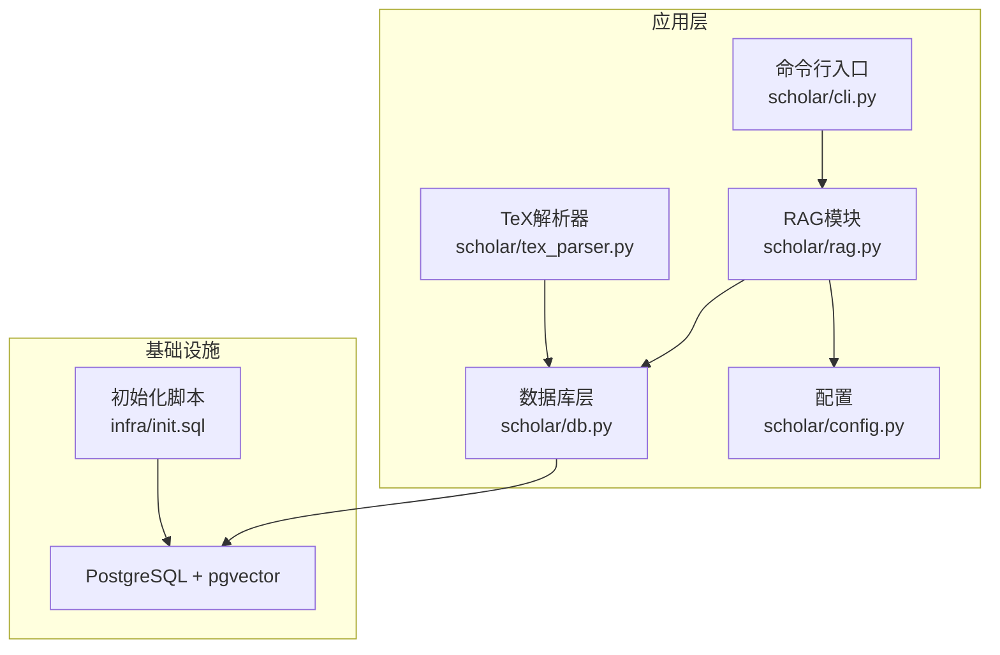
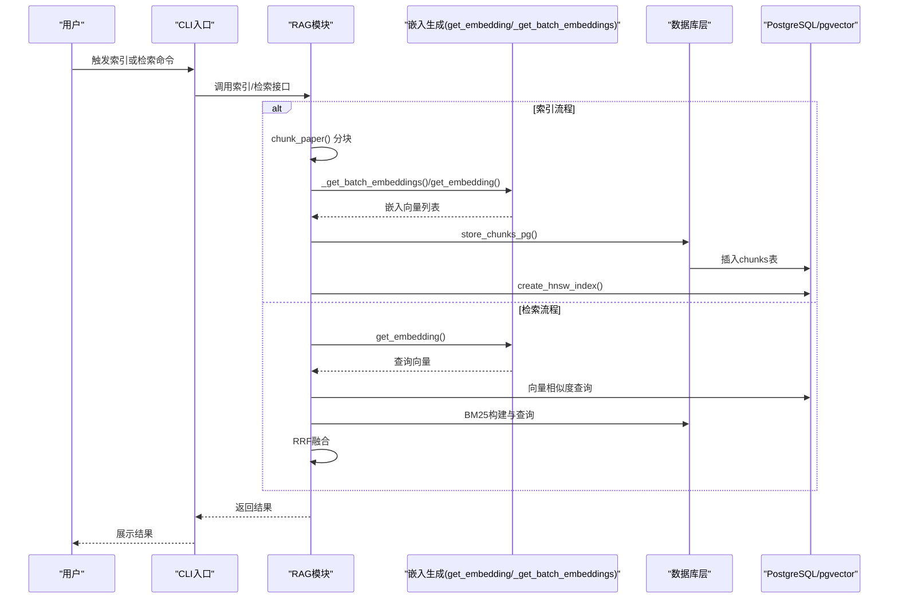
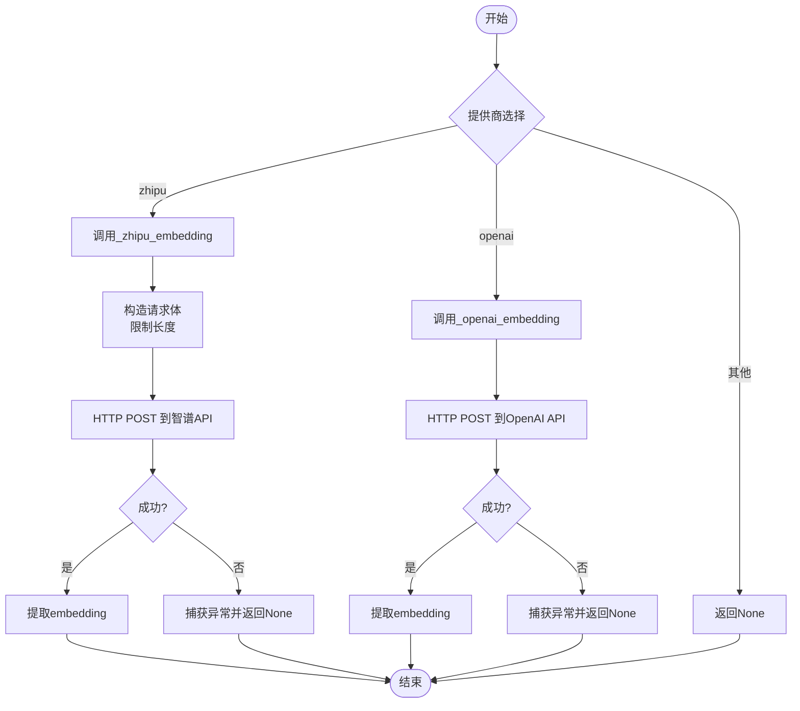
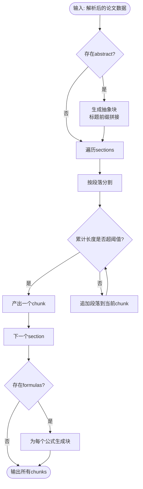
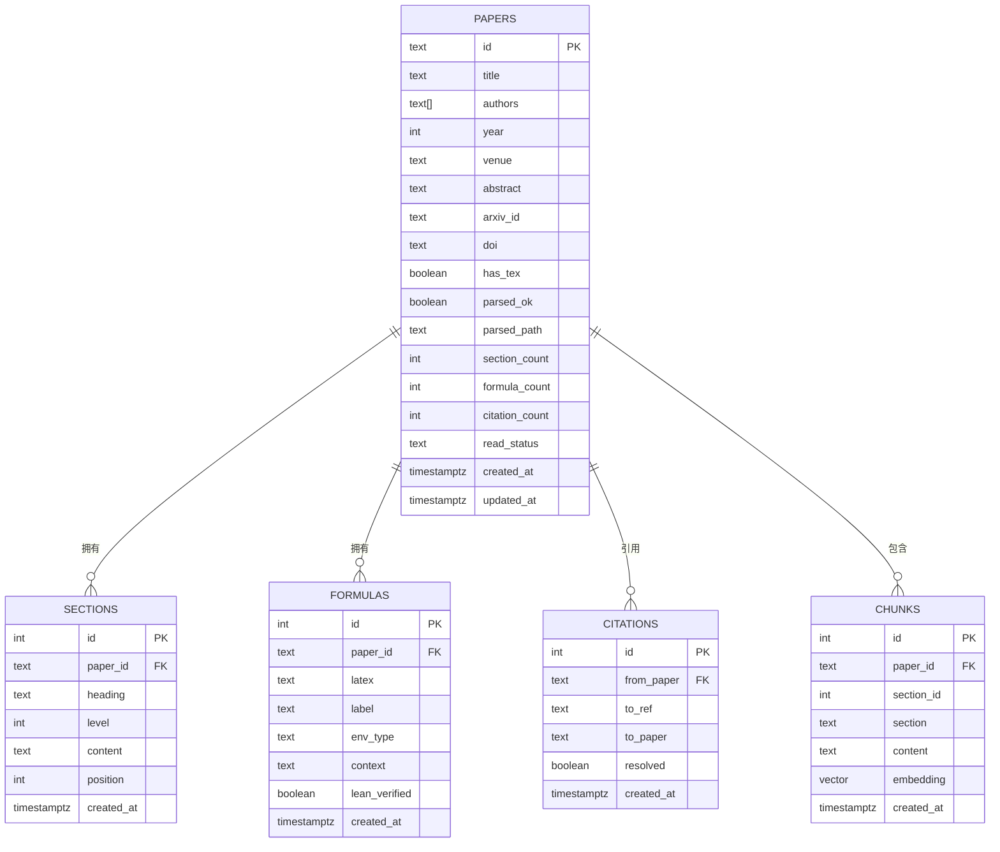
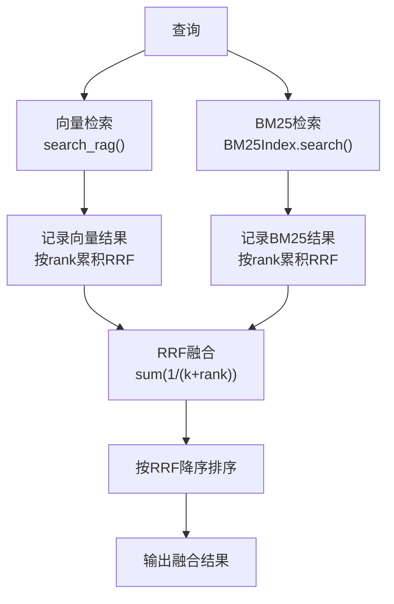
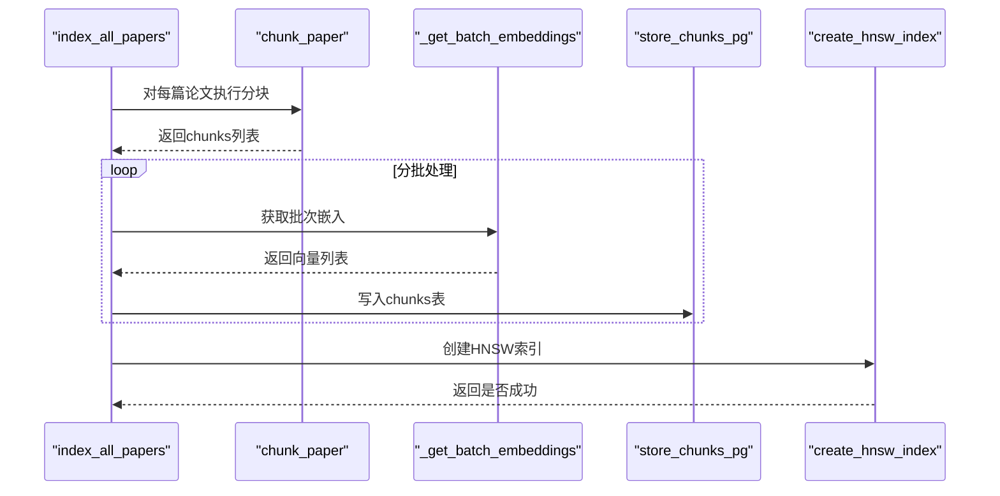
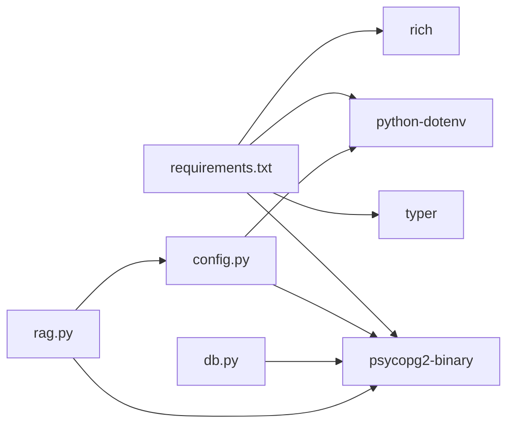

# RAG检索引擎

<cite>
**本文引用的文件列表**
- [rag.py](file://scholar/rag.py)
- [db.py](file://scholar/db.py)
- [config.py](file://scholar/config.py)
- [tex_parser.py](file://scholar/tex_parser.py)
- [init.sql](file://infra/init.sql)
- [requirements.txt](file://requirements.txt)
- [cli.py](file://scholar/cli.py)
- [test_config.py](file://test/test_config.py)
</cite>

## 目录
1. [简介](#简介)
2. [项目结构](#项目结构)
3. [核心组件](#核心组件)
4. [架构总览](#架构总览)
5. [详细组件分析](#详细组件分析)
6. [依赖关系分析](#依赖关系分析)
7. [性能与可扩展性](#性能与可扩展性)
8. [故障排查指南](#故障排查指南)
9. [结论](#结论)
10. [附录](#附录)

## 简介
本文件面向RAG检索引擎的技术文档，聚焦以下目标：
- 向量嵌入生成机制：智谱API、OpenAI API与本地嵌入的实现与差异
- 论文分块策略（chunk_paper函数）：抽象、章节、公式块的处理逻辑
- PostgreSQL + pgvector存储架构与HNSW近似最近邻索引的创建与优化
- 混合搜索算法（向量+BM25+RRF融合）的工作原理与性能优势
- 批量索引处理、错误处理机制、性能监控与扩展性建议
- 配置项、API使用示例与故障排除指南

## 项目结构
该仓库采用模块化组织，RAG相关能力集中在scholar/rag.py中，数据库层在scholar/db.py，配置在scholar/config.py，LaTeX解析在scholar/tex_parser.py，数据库初始化脚本在infra/init.sql，CLI入口在scholar/cli.py，依赖在requirements.txt。

图表来源
- [cli.py:1-120](file://scholar/cli.py#L1-L120)
- [rag.py:1-120](file://scholar/rag.py#L1-L120)
- [db.py:1-80](file://scholar/db.py#L1-L80)
- [config.py:1-60](file://scholar/config.py#L1-L60)
- [tex_parser.py:1-60](file://scholar/tex_parser.py#L1-L60)
- [init.sql:1-40](file://infra/init.sql#L1-L40)

章节来源
- [cli.py:1-120](file://scholar/cli.py#L1-L120)
- [rag.py:1-120](file://scholar/rag.py#L1-L120)
- [db.py:1-80](file://scholar/db.py#L1-L80)
- [config.py:1-60](file://scholar/config.py#L1-L60)
- [tex_parser.py:1-60](file://scholar/tex_parser.py#L1-L60)
- [init.sql:1-40](file://infra/init.sql#L1-L40)

## 核心组件
- 向量嵌入生成：支持智谱API、OpenAI API；提供批量与单次调用路径，并对异常进行降级返回
- 分块策略：将论文抽象、章节段落、公式上下文拆分为可嵌入的文本单元
- 存储与索引：PostgreSQL + pgvector向量列，HNSW索引加速相似度检索
- 关键词检索：轻量BM25索引（无外部依赖），用于与向量检索融合
- 混合检索：向量相似度 + BM25关键词匹配 + RRF融合排序
- 批量索引：分批生成嵌入、入库、进度可视化、最终建立HNSW索引
- 错误处理：API调用超时/异常、数据库连接失败、索引创建失败等均有降级与日志输出

章节来源
- [rag.py:25-93](file://scholar/rag.py#L25-L93)
- [rag.py:100-175](file://scholar/rag.py#L100-L175)
- [rag.py:182-288](file://scholar/rag.py#L182-L288)
- [rag.py:295-364](file://scholar/rag.py#L295-L364)
- [rag.py:383-420](file://scholar/rag.py#L383-L420)
- [rag.py:471-581](file://scholar/rag.py#L471-L581)

## 架构总览
RAG检索引擎由“数据准备（TeX解析）—分块—嵌入—入库—索引—检索”构成闭环。检索阶段支持纯向量、纯BM25以及向量+BM25+RRF融合三种模式。

图表来源
- [cli.py:1-120](file://scholar/cli.py#L1-L120)
- [rag.py:100-175](file://scholar/rag.py#L100-L175)
- [rag.py:182-288](file://scholar/rag.py#L182-L288)
- [rag.py:300-364](file://scholar/rag.py#L300-L364)
- [rag.py:383-420](file://scholar/rag.py#L383-L420)
- [db.py:1-80](file://scholar/db.py#L1-L80)

## 详细组件分析

### 向量嵌入生成机制
- 提供统一入口get_embedding，根据配置选择提供商（zhipu/openai）
- 智谱API：支持批量输入（最多约30条），按index排序恢复顺序；单次调用限制文本长度
- OpenAI API：使用固定模型名，限制输入长度
- 本地嵌入：预留占位，当前返回None（可扩展为本地SentenceTransformers）

图表来源
- [rag.py:100-175](file://scholar/rag.py#L100-L175)

章节来源
- [rag.py:100-175](file://scholar/rag.py#L100-L175)

### 论文分块策略（chunk_paper）
- 抽象：始终作为独立块，拼接标题前缀
- 章节：按段落切分，超过阈值则拆分；保留章节标题信息
- 公式：抽取公式及其上下文，形成独立块
- 类型标记：区分abstract/section/formula三类，便于后续检索与展示

图表来源
- [rag.py:25-93](file://scholar/rag.py#L25-L93)

章节来源
- [rag.py:25-93](file://scholar/rag.py#L25-L93)

### PostgreSQL + pgvector存储与HNSW索引
- 表结构：papers、sections、formulas、citations、concepts、paper_concepts、chunks
- 向量列：chunks.embedding为向量类型，维度由配置决定
- 插入：store_chunks_pg将分块内容与向量写入chunks表
- 索引：create_hnsw_index基于向量余弦距离创建HNSW索引，参数可调
- 检索：search_rag使用向量余弦距离（1 - (a<=>b)）进行相似度排序

图表来源
- [init.sql:9-104](file://infra/init.sql#L9-L104)

章节来源
- [init.sql:9-104](file://infra/init.sql#L9-L104)
- [rag.py:182-288](file://scholar/rag.py#L182-L288)
- [rag.py:214-237](file://scholar/rag.py#L214-L237)

### BM25关键词检索与RRF融合
- BM25Index：从chunks表加载内容，构建词频统计与平均文档长度，实现标准BM25打分
- 检索：对查询进行简单分词，计算每个文档的BM25分数并排序
- RRF融合：对向量与BM25结果分别按排名贡献1/(k+rank)，k=60为标准常数，合并后按RRF分数排序

图表来源
- [rag.py:252-288](file://scholar/rag.py#L252-L288)
- [rag.py:300-364](file://scholar/rag.py#L300-L364)
- [rag.py:383-420](file://scholar/rag.py#L383-L420)

章节来源
- [rag.py:295-364](file://scholar/rag.py#L295-L364)
- [rag.py:383-420](file://scholar/rag.py#L383-L420)

### 批量索引处理与进度可视化
- 遍历解析后的JSON，调用chunk_paper生成chunks
- 分批调用_get_batch_embeddings，优先使用智谱批量API，失败回退单次调用
- store_chunks_pg入库，Rich进度条显示进度
- 完成后创建HNSW索引

图表来源
- [rag.py:471-581](file://scholar/rag.py#L471-L581)

章节来源
- [rag.py:471-581](file://scholar/rag.py#L471-L581)

## 依赖关系分析
- 运行时依赖：psycopg2-binary（PostgreSQL）、typer/rich（CLI与进度）、python-dotenv（环境变量）
- 数据库层：db.py封装psycopg2连接与事务，提供UPSERT与查询方法
- 配置层：config.py从.env加载数据库、嵌入提供商、模型、API密钥等

图表来源
- [requirements.txt:1-14](file://requirements.txt#L1-L14)
- [config.py:44-61](file://scholar/config.py#L44-L61)
- [db.py:15-22](file://scholar/db.py#L15-L22)
- [rag.py:182-211](file://scholar/rag.py#L182-L211)

章节来源
- [requirements.txt:1-14](file://requirements.txt#L1-L14)
- [config.py:44-61](file://scholar/config.py#L44-L61)
- [db.py:15-22](file://scholar/db.py#L15-L22)
- [rag.py:182-211](file://scholar/rag.py#L182-L211)

## 性能与可扩展性
- 向量检索性能
  - HNSW索引参数：m与ef_construction影响索引质量与构建成本，可根据数据规模调整
  - 余弦距离：1 - (a<=>b)更直观表达相似度，适合归一化向量
- 批量嵌入
  - 智谱API支持批量输入，显著降低RTT与API开销
  - 回退策略：批量失败时逐条重试，保证覆盖率
- BM25
  - 仅加载有限数量的chunks构建索引，避免内存压力
  - k1、b为可调参数，平衡词频饱和与文档长度归一化
- 可扩展性
  - 支持多提供商切换（zhipu/openai），便于迁移与成本控制
  - 本地嵌入预留位置，可替换为本地模型以降低对外部API依赖
  - 数据库层具备可用性检测与降级（文件模式）能力

[本节为通用性能讨论，不直接分析具体文件]

## 故障排查指南
- 嵌入API失败
  - 现象：get_embedding/_get_batch_embeddings返回None
  - 排查：检查EMBEDDING_API_KEY、提供商配置、网络代理、超时设置
  - 参考：嵌入函数的异常捕获与返回None的降级逻辑
- 数据库连接失败
  - 现象：store_chunks_pg/create_hnsw_index打印错误
  - 排查：确认PG_HOST/PORT/NAME/USER/PASS配置正确，PostgreSQL服务运行状态
  - 参考：数据库层可用性检测与连接复用
- HNSW索引创建失败
  - 现象：create_hnsw_index返回False并打印错误
  - 排查：确认pgvector扩展已安装、chunks表存在且有数据
- arXiv请求失败
  - 现象：arxiv_request抛出异常
  - 排查：检查代理、超时、重试次数配置；参考测试用例中的重试行为
- CLI进度缺失
  - 现象：无进度条
  - 排查：rich未安装时会降级为普通输出；安装rich即可启用进度条

章节来源
- [rag.py:120-175](file://scholar/rag.py#L120-L175)
- [rag.py:182-237](file://scholar/rag.py#L182-L237)
- [db.py:15-44](file://scholar/db.py#L15-L44)
- [config.py:72-118](file://scholar/config.py#L72-L118)
- [test_config.py:77-114](file://test/test_config.py#L77-L114)

## 结论
本RAG检索引擎通过清晰的模块划分与稳健的错误处理，实现了从论文解析到向量检索的完整链路。其混合检索（向量+BM25+RRF）在召回与排序上取得良好平衡，结合HNSW索引与批量嵌入策略，在性能与成本之间取得合理折中。未来可在本地嵌入替换、索引参数调优、缓存与并发等方面进一步优化。

[本节为总结性内容，不直接分析具体文件]

## 附录

### 配置项清单
- 数据库相关
  - SCHOLAR_PG_HOST/SCHOLAR_PG_PORT/SCHOLAR_PG_NAME/SCHOLAR_PG_USER/SCHOLAR_PG_PASS
- 嵌入相关
  - SCHOLAR_EMBEDDING_PROVIDER: "zhipu" 或 "openai"
  - SCHOLAR_EMBEDDING_MODEL: 模型名称（zhipu示例）
  - SCHOLAR_EMBEDDING_DIM: 维度（与模型一致）
  - SCHOLAR_EMBEDDING_API_KEY: API密钥
- arXiv请求
  - SCHOLAR_ARXIV_TIMEOUT/SCHOLAR_ARXIV_RETRIES
- 输出目录
  - PARSED_DIR/NOTES_DIR/DRAFTS_DIR/BIB_DIR/EXPERIMENTS_DIR/DATASETS_DIR/PDFS_DIR/DIGESTS_DIR/LOGS_DIR

章节来源
- [config.py:44-61](file://scholar/config.py#L44-L61)
- [config.py:72-118](file://scholar/config.py#L72-L118)

### API使用示例（路径指引）
- 向量检索
  - [search_rag:252-288](file://scholar/rag.py#L252-L288)
- 混合检索
  - [search_rag_hybrid:383-420](file://scholar/rag.py#L383-L420)
- 单条嵌入
  - [get_embedding:100-117](file://scholar/rag.py#L100-L117)
- 批量嵌入
  - [_get_batch_embeddings:427-468](file://scholar/rag.py#L427-L468)
- 存储分块
  - [store_chunks_pg:182-211](file://scholar/rag.py#L182-L211)
- 创建HNSW索引
  - [create_hnsw_index:214-237](file://scholar/rag.py#L214-L237)
- 数据库操作（Upsert/查询）
  - [Database.upsert_paper/upsert_sections/upsert_formulas/upsert_citations:79-175](file://scholar/db.py#L79-L175)
  - [Database.search_papers/get_paper/list_papers/get_stats:180-241](file://scholar/db.py#L180-L241)

### CLI命令（路径指引）
- 索引全部论文
  - [index_all_papers:471-581](file://scholar/rag.py#L471-L581)
- 重新索引单篇论文
  - [index_single_paper:551-581](file://scholar/rag.py#L551-L581)
- arXiv搜索
  - [arxiv_search:605-657](file://scholar/cli.py#L605-L657)