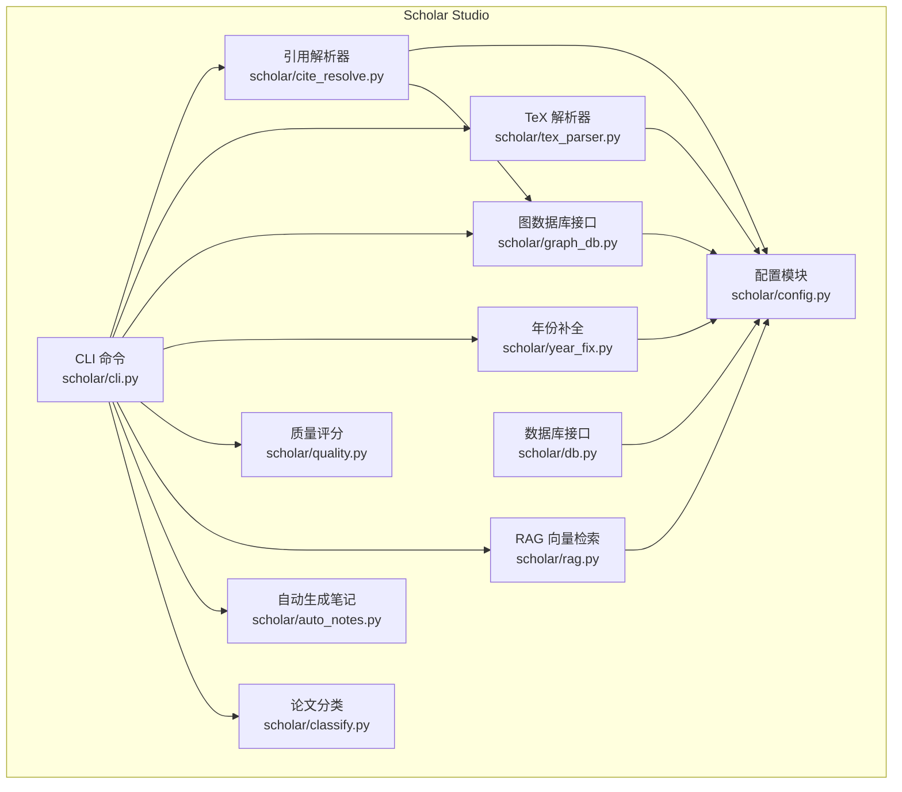
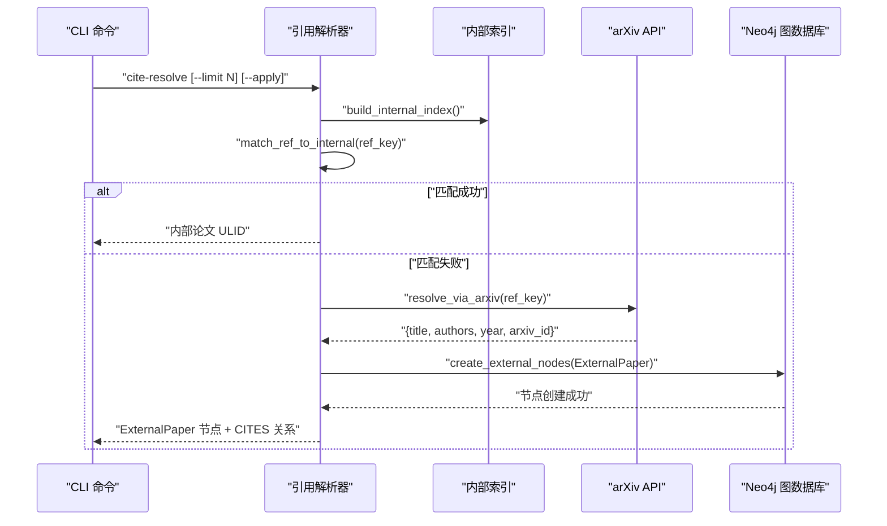
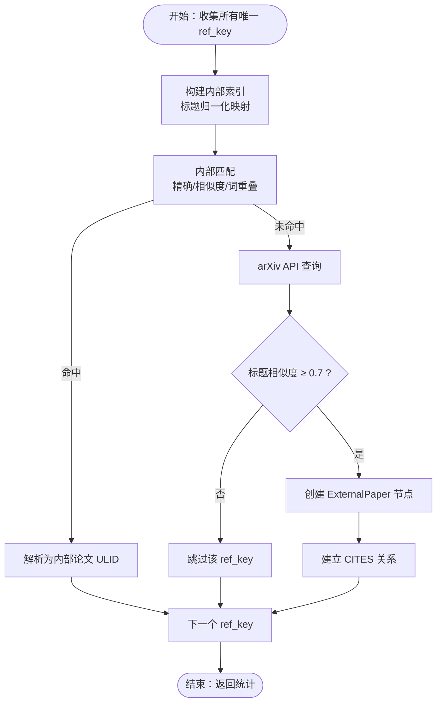
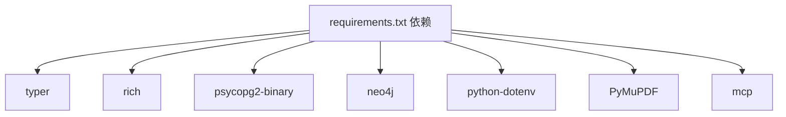

# 引用解析器

<cite>
**本文档引用的文件**
- [scholar/cite_resolve.py](file://scholar/cite_resolve.py)
- [scholar/config.py](file://scholar/config.py)
- [scholar/graph_db.py](file://scholar/graph_db.py)
- [scholar/cli.py](file://scholar/cli.py)
- [scholar/year_fix.py](file://scholar/year_fix.py)
- [scholar/tex_parser.py](file://scholar/tex_parser.py)
- [requirements.txt](file://requirements.txt)
- [README.md](file://README.md)
</cite>

## 目录
1. [简介](#简介)
2. [项目结构](#项目结构)
3. [核心组件](#核心组件)
4. [架构总览](#架构总览)
5. [详细组件分析](#详细组件分析)
6. [依赖关系分析](#依赖关系分析)
7. [性能考虑](#性能考虑)
8. [故障排除指南](#故障排除指南)
9. [结论](#结论)
10. [附录](#附录)

## 简介
本文件为学术论文引用解析器的技术文档，聚焦于将论文中的引用标记（ref_key）自动解析为已知内部论文（ULID）或外部文献（arXiv API），并将其同步到 Neo4j 概念图谱中。文档涵盖：
- 引用格式识别与规范化
- 作者信息提取与补全
- 出版信息解析与补全
- 与外部 arXiv 文献数据库的集成方式与数据同步机制
- 质量评估方法与错误纠正策略
- 配置选项、支持的引用格式与实际应用示例
- 不规范引用格式与跨语言引用的处理建议

## 项目结构
该项目采用模块化设计，核心围绕 scholar 目录下的 Python 模块展开，配合 CLI、数据库与图数据库层协同工作。

图表来源
- [scholar/cli.py](file://scholar/cli.py)
- [scholar/config.py](file://scholar/config.py)
- [scholar/cite_resolve.py](file://scholar/cite_resolve.py)
- [scholar/graph_db.py](file://scholar/graph_db.py)
- [scholar/tex_parser.py](file://scholar/tex_parser.py)
- [scholar/year_fix.py](file://scholar/year_fix.py)
- [scholar/quality.py](file://scholar/quality.py)
- [scholar/rag.py](file://scholar/rag.py)
- [scholar/auto_notes.py](file://scholar/auto_notes.py)
- [scholar/classify.py](file://scholar/classify.py)

章节来源
- [README.md](file://README.md)
- [scholar/cli.py](file://scholar/cli.py)

## 核心组件
- 引用解析器（cite_resolve.py）
  - 功能：将引用 ref_key 与内部已解析论文进行匹配；对未匹配项通过 arXiv API 查询；在 Neo4j 中创建 ExternalPaper 节点并建立 CITES 关系。
  - 关键算法：Levenshtein 距离、归一化文本匹配、词重叠阈值。
- 图数据库接口（graph_db.py）
  - 功能：构建/解析 Neo4j 引用网络，计算中心性指标，构建概念图谱，同步 Lean4 创新关系。
- 配置模块（config.py）
  - 功能：统一管理项目根目录、输出目录、数据库与图数据库连接参数、嵌入模型等。
- TeX 解析器（tex_parser.py）
  - 功能：从 TeX 源码中抽取标题、作者、年份、会议、摘要、章节、公式与引用列表。
- 年份补全（year_fix.py）
  - 功能：通过 Lean4 数据库与 arXiv API 补全缺失年份；辅助作者补全。
- CLI（cli.py）
  - 功能：提供命令行入口，组织解析、图谱构建、RAG 索引、质量评分、分类等流程。

章节来源
- [scholar/cite_resolve.py](file://scholar/cite_resolve.py)
- [scholar/graph_db.py](file://scholar/graph_db.py)
- [scholar/config.py](file://scholar/config.py)
- [scholar/tex_parser.py](file://scholar/tex_parser.py)
- [scholar/year_fix.py](file://scholar/year_fix.py)
- [scholar/cli.py](file://scholar/cli.py)

## 架构总览
引用解析器的端到端流程如下：

图表来源
- [scholar/cite_resolve.py](file://scholar/cite_resolve.py)
- [scholar/graph_db.py](file://scholar/graph_db.py)

## 详细组件分析

### 引用解析器（cite_resolve.py）
- 内部匹配策略
  - 构建内部索引：基于已解析论文的标题进行归一化（小写、去除标点、合并多余空格）。
  - 匹配策略：精确匹配（归一化）、Levenshtein 相似度阈值（默认≥0.8）、词重叠比例（>0.7）。
- 外部解析策略
  - arXiv API 查询：清理 ref_key（下划线替换为空格、连字符移除），构造查询参数，限制返回数量与相关性排序。
  - 标题相似度校验：仅当相似度≥0.7 时接受结果。
- Neo4j 同步
  - 创建 ExternalPaper 节点（包含 ref_key、title、year、arxiv_id、authors），并为引用论文创建 CITES 关系（resolved=false）。
- 主流程统计
  - 返回总引用数、内部解析数、arXiv 解析数、外部节点创建数、仍不可解析数、查询 arXiv 数量。

图表来源
- [scholar/cite_resolve.py](file://scholar/cite_resolve.py)

章节来源
- [scholar/cite_resolve.py](file://scholar/cite_resolve.py)

### 图数据库接口（graph_db.py）
- 引用网络解析
  - 将原始 CITES 边中指向 ref_key 的目标节点重新解析为正确的 Paper ULID，删除旧边并建立新的 CITES 关系（resolved=true）。
  - 清理孤立的 ref_key 节点（非 ULID 格式且无入边）。
- 中心性计算
  - 计算每篇论文的入度（被引次数）、出度（引用他人数量）、桥接分数（入度×出度/总度数）。
- Neo4j 连接与查询
  - 提供 run() 方法执行 Cypher 查询；close() 关闭驱动；可用性检测（ping）。
- 概念图谱构建
  - 从 Lean4 Database.lean 动态加载创新节点，匹配论文与概念，构建 HAS_CONCEPT 与 RELATED_TO 边。
- REPLACES 关系同步
  - 从 Lean4 加载创新节点间的替代关系并写入 Neo4j。

章节来源
- [scholar/graph_db.py](file://scholar/graph_db.py)

### 配置模块（config.py）
- 目录结构
  - 输出目录：parsed、notes、drafts、bib、experiments
  - 数据目录：data/papers、LEAN
- 数据库与图数据库
  - PostgreSQL（pgvector）：papers、sections、formulas、citations、chunks
  - Neo4j：bolt://localhost:7687
- 嵌入模型与 API Key
  - 支持 zhipu/openai 嵌入模型，维度与模型名称可配置。
- LaTeX 编译器与 Lean4 项目路径

章节来源
- [scholar/config.py](file://scholar/config.py)

### TeX 解析器（tex_parser.py）
- 标题提取
  - 支持多类文档类与宏命令，清理格式化命令、图片、颜色、间距等噪声，保留纯文本标题。
- 作者提取
  - 支持 \author、\icmlauthor、authblk、tabular 等多种格式；清洗邮箱、注记、上标等；按逗号、\and/\And 分割并去重。
- 年份与会议
  - 支持文档类、宏包、注释行、会议样式年份、arXiv ID 等多种来源；优先级与回退策略明确。
- 抽象、章节、公式与引用
  - 抽取抽象、章节标题与内容、显示数学环境、标签、引用键列表等。
- 宏定义解析
  - 提取 \newcommand/\def 定义，递归解析自定义宏，减少歧义。

章节来源
- [scholar/tex_parser.py](file://scholar/tex_parser.py)

### 年份补全（year_fix.py）
- Lean4 匹配
  - 解析 Database.lean 中的 Paper 定义，将 Lean ID 转换为近似标题后与已解析论文标题进行匹配。
- 内容启发式
  - 对未匹配论文，从摘要与前几个段落中提取年份候选，选择出现频率最高且≥2017年的年份。
- arXiv 回退
  - 对仍缺失年份的论文，使用 arXiv API 标题搜索获取发布年份。
- 作者补全
  - 对缺失作者的论文，使用 arXiv API 标题搜索获取作者列表。

章节来源
- [scholar/year_fix.py](file://scholar/year_fix.py)

### CLI（cli.py）
- 命令组织
  - 提供 scan、parse、parse-all、info、search、list-papers、stats、export-bib、author-fix、arxiv-search、graph-build、graph-stats、graph-query、cite-network、rag-search、rag-index、auto-notes、quality-score、classify、bootstrap、ingest、survey、landscape 等命令。
- 与引用解析集成
  - graph-build 流程中包含引用解析（resolve_ref_keys）与外部节点创建。
  - author-fix 与 year-fix 作为元数据补全前置步骤。

章节来源
- [scholar/cli.py](file://scholar/cli.py)

## 依赖关系分析
- Python 依赖
  - typer、rich：命令行框架与终端美化
  - psycopg2-binary：PostgreSQL 连接
  - neo4j：Neo4j 图数据库驱动
  - python-dotenv：环境变量加载
  - PyMuPDF、mcp：PDF 处理与 MCP 协议支持
- 内部模块耦合
  - cite_resolve 依赖 config、graph_db
  - graph_db 依赖 config
  - year_fix 依赖 config
  - cli 统一调度各模块

图表来源
- [requirements.txt](file://requirements.txt)

章节来源
- [requirements.txt](file://requirements.txt)

## 性能考虑
- 引用解析
  - 内部匹配采用预构建索引与归一化，复杂度主要受论文数量与 ref_key 数量影响；相似度计算与词重叠检查为线性扫描。
  - arXiv 查询限制最大查询数（limit），避免触发限流。
- Neo4j 写入
  - 批量 MERGE/UNWIND 降低事务开销；仅在 --apply 模式下写入，dry-run 仅统计。
- 图谱解析
  - resolve_ref_keys 限制查询边数（LIMIT 50000），分批处理并删除旧边，避免大事务。
- 数据库与嵌入
  - RAG 批量嵌入与 HNSW 索引提升检索效率；嵌入失败计数便于重试与监控。

## 故障排除指南
- Neo4j 不可用
  - 现象：graph-build 或 graph-stats 报错
  - 处理：确认 docker compose 启动 neo4j，检查端口 7687/7474；使用 gdb.available 检测可用性
- PostgreSQL 连接失败
  - 现象：RAG 索引或数据库写入报错
  - 处理：确认 docker compose 启动 PostgreSQL（端口 5433），检查凭据与网络
- arXiv API 限流或超时
  - 现象：cite-resolve 或 year-fix/arxiv-search 失败
  - 处理：降低 limit，增加延时；检查 User-Agent；确认网络可达
- 引用解析未产生外部节点
  - 现象：dry-run 统计 resolved_arxiv=0
  - 处理：提高 limit；检查 ref_key 规范化（下划线/连字符处理）；确认相似度阈值设置
- 作者/年份补全无效
  - 现象：author-fix/year-fix 未写入
  - 处理：确认 --apply 参数；检查 TeX 解析是否正确提取作者/年份；必要时使用 arXiv 回退

章节来源
- [scholar/cli.py](file://scholar/cli.py)
- [scholar/cite_resolve.py](file://scholar/cite_resolve.py)
- [scholar/year_fix.py](file://scholar/year_fix.py)

## 结论
引用解析器通过“内部匹配 + 外部 API + 图数据库”的三层策略，实现了对学术论文引用的自动解析与标准化。结合 TeX 解析器提供的高质量元数据与引用列表，以及 Neo4j 的图谱能力，形成了可查询、可推理、可组合的学术数据层。配套的年份/作者补全、质量评分、RAG 检索与分类体系进一步提升了知识库的完整性与可用性。

## 附录

### 配置选项与环境变量
- 数据库与图数据库
  - SCHOLAR_PG_HOST/SCHOLAR_PG_PORT/SCHOLAR_PG_NAME/SCHOLAR_PG_USER/SCHOLAR_PG_PASS
  - SCHOLAR_NEO4J_URI/SCHOLAR_NEO4J_USER/SCHOLAR_NEO4J_PASS
- 嵌入模型
  - SCHOLAR_EMBEDDING_PROVIDER（zhipu/openai）
  - SCHOLAR_EMBEDDING_MODEL/SCHOLAR_EMBEDDING_DIM
  - SCHOLAR_EMBEDDING_API_KEY
- LaTeX 编译器
  - SCHOLAR_LATEX_CMD（默认 pdflatex）

章节来源
- [scholar/config.py](file://scholar/config.py)

### 支持的引用格式与处理策略
- 内部引用
  - 通过 ref_key 与内部论文标题进行匹配；支持归一化、相似度与词重叠策略。
- 外部引用
  - arXiv API 标题搜索；相似度校验；创建 ExternalPaper 节点与 CITES 关系。
- 不规范格式
  - 下划线/连字符清理；模糊匹配阈值；词重叠过滤。
- 跨语言引用
  - 标题归一化（小写、去标点）；相似度比较；建议在 TeX 解析阶段保留英文关键词以便统一匹配。

章节来源
- [scholar/cite_resolve.py](file://scholar/cite_resolve.py)
- [scholar/tex_parser.py](file://scholar/tex_parser.py)

### 实际应用示例
- 全量初始化（bootstrap）
  - 步骤：parse-all → year-fix → author-fix → graph-build → PG 同步 → rag-index → auto-notes → quality-score → classify
- 引用解析
  - 命令：python -m scholar cite-resolve --limit 200 --apply
  - 输出：Neo4j ExternalPaper 节点与 CITES 关系，统计报表
- 图谱构建与解析
  - 命令：python -m scholar graph-build
  - 输出：引用网络（CITES）、概念图谱（HAS_CONCEPT/RELATED_TO）、桥接论文（桥接分数）

章节来源
- [README.md](file://README.md)
- [scholar/cli.py](file://scholar/cli.py)
- [scholar/cite_resolve.py](file://scholar/cite_resolve.py)
- [scholar/graph_db.py](file://scholar/graph_db.py)