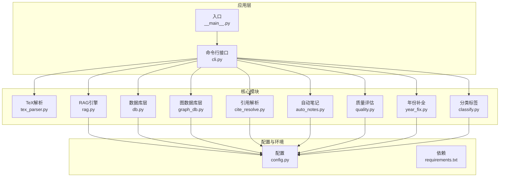
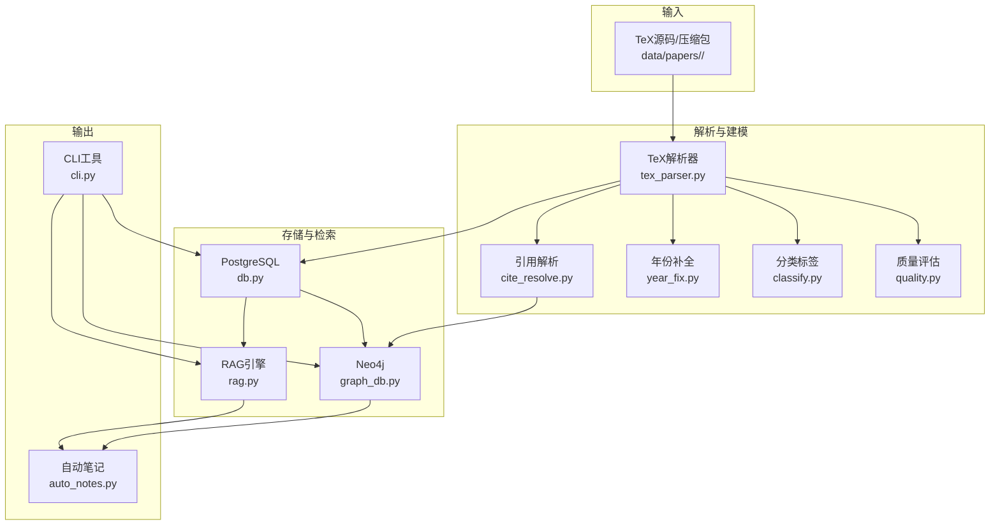
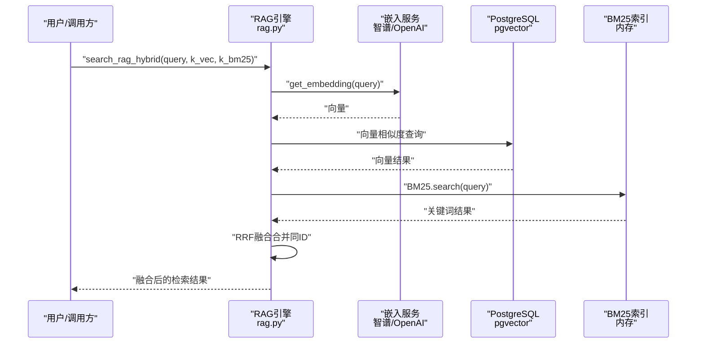
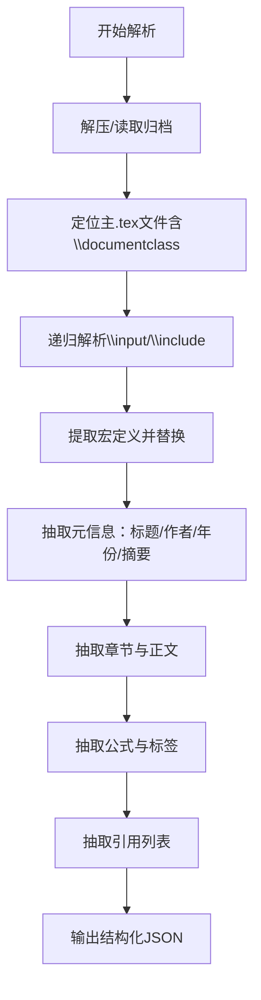
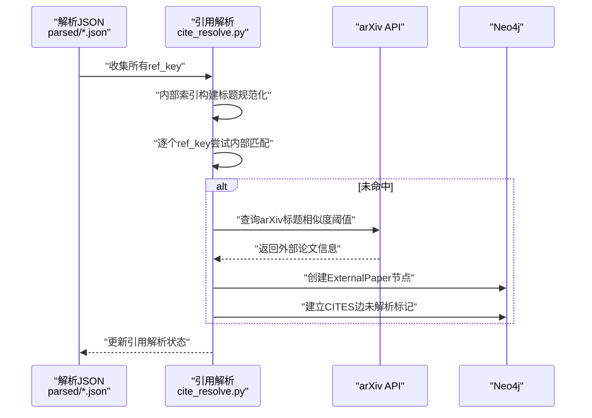
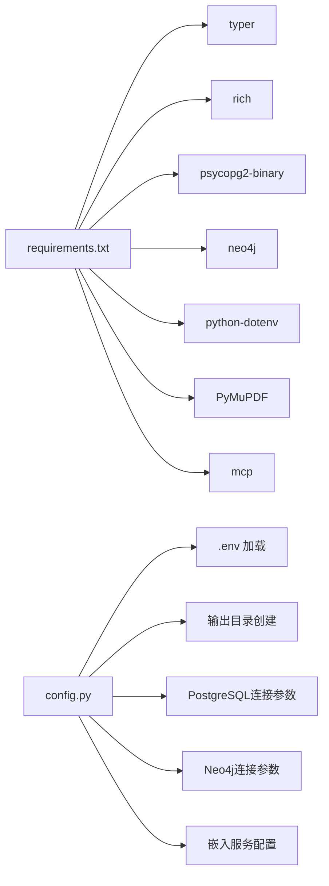

# 智能检索系统

<cite>
**本文档引用的文件**
- [rag.py](file://scholar/rag.py)
- [tex_parser.py](file://scholar/tex_parser.py)
- [cite_resolve.py](file://scholar/cite_resolve.py)
- [auto_notes.py](file://scholar/auto_notes.py)
- [db.py](file://scholar/db.py)
- [config.py](file://scholar/config.py)
- [graph_db.py](file://scholar/graph_db.py)
- [quality.py](file://scholar/quality.py)
- [cli.py](file://scholar/cli.py)
- [year_fix.py](file://scholar/year_fix.py)
- [classify.py](file://scholar/classify.py)
- [__main__.py](file://scholar/__main__.py)
- [requirements.txt](file://requirements.txt)
</cite>

## 目录
1. [简介](#简介)
2. [项目结构](#项目结构)
3. [核心组件](#核心组件)
4. [架构总览](#架构总览)
5. [详细组件分析](#详细组件分析)
6. [依赖关系分析](#依赖关系分析)
7. [性能考虑](#性能考虑)
8. [故障排查指南](#故障排查指南)
9. [结论](#结论)
10. [附录](#附录)

## 简介
本项目是一个面向学术论文的智能检索与知识管理平台，围绕“检索增强生成（RAG）”引擎构建，融合了TeX论文解析、引用解析、自动笔记生成、概念图谱与质量评估等能力。系统支持：
- 基于向量嵌入的语义检索与基于BM25的关键词检索的混合融合
- 高性能向量索引（pgvector/HNSW）与轻量级BM25索引
- 多源数据清洗与结构化入库（PostgreSQL/Neo4j）
- 自动化论文分类、质量评分与参考文献外部解析
- 可扩展的命令行工具链与批处理流程

## 项目结构
项目采用模块化分层组织，核心目录与职责如下：
- scholar：Python核心模块，包含RAG、解析、数据库、图数据库、质量评估、CLI等
- data/papers：原始论文数据（按ULID子目录存放）
- output：生成产物（解析JSON、阅读笔记、草稿、BibTeX、实验结果等）
- infra：基础设施脚本（Docker Compose、初始化SQL等）

**图表来源**
- [cli.py:1-1638](file://scholar/cli.py#L1-L1638)
- [__main__.py:1-8](file://scholar/__main__.py#L1-L8)
- [config.py:1-62](file://scholar/config.py#L1-L62)

**章节来源**
- [cli.py:1-1638](file://scholar/cli.py#L1-L1638)
- [__main__.py:1-8](file://scholar/__main__.py#L1-L8)
- [config.py:1-62](file://scholar/config.py#L1-L62)

## 核心组件
- RAG引擎：负责论文分块、向量嵌入、向量存储、语义检索、BM25关键词检索与RRF融合
- TeX解析器：从压缩包或目录中提取标题、作者、年份、摘要、章节、公式、引用等元信息
- 引用解析：将内部引用键映射到已知论文ULID，无法解析时通过arXiv API创建外部节点
- 自动笔记：从解析JSON生成结构化Markdown阅读笔记
- 数据库层：PostgreSQL封装，支持文件模式回退；提供全文检索与统计
- 图数据库层：Neo4j封装，构建引文网络、概念图谱与Lean4替换关系
- 质量评估：多维度评分（元数据、结构、引用密度、可复现性、问题定义、创新点、实验严谨性）
- 年份补全：基于Lean4数据库与arXiv API补全年份
- 分类标签：多级领域/子方向/方法标签抽取
- CLI：统一命令行入口，提供扫描、解析、搜索、统计、图谱构建等功能

**章节来源**
- [rag.py:1-582](file://scholar/rag.py#L1-L582)
- [tex_parser.py:1-1605](file://scholar/tex_parser.py#L1-L1605)
- [cite_resolve.py:1-322](file://scholar/cite_resolve.py#L1-L322)
- [auto_notes.py:1-355](file://scholar/auto_notes.py#L1-L355)
- [db.py:1-270](file://scholar/db.py#L1-L270)
- [graph_db.py:1-922](file://scholar/graph_db.py#L1-L922)
- [quality.py:1-432](file://scholar/quality.py#L1-L432)
- [year_fix.py:1-436](file://scholar/year_fix.py#L1-L436)
- [classify.py:1-328](file://scholar/classify.py#L1-L328)
- [cli.py:1-1638](file://scholar/cli.py#L1-L1638)

## 架构总览
系统以“解析—索引—检索—可视化/输出”为主线，结合结构化数据库与图数据库，形成“结构化+语义+关系”的综合检索体系。

**图表来源**
- [tex_parser.py:1-1605](file://scholar/tex_parser.py#L1-L1605)
- [cite_resolve.py:1-322](file://scholar/cite_resolve.py#L1-L322)
- [year_fix.py:1-436](file://scholar/year_fix.py#L1-L436)
- [classify.py:1-328](file://scholar/classify.py#L1-L328)
- [quality.py:1-432](file://scholar/quality.py#L1-L432)
- [db.py:1-270](file://scholar/db.py#L1-L270)
- [rag.py:1-582](file://scholar/rag.py#L1-L582)
- [graph_db.py:1-922](file://scholar/graph_db.py#L1-L922)
- [auto_notes.py:1-355](file://scholar/auto_notes.py#L1-L355)
- [cli.py:1-1638](file://scholar/cli.py#L1-L1638)

## 详细组件分析

### RAG引擎（检索增强生成）
- 论文分块策略：抽象、段落、带上下文的公式三类块，确保语义完整性
- 向量嵌入：支持智谱、OpenAI、本地（占位），批量优先，失败回退单次
- 向量存储：PostgreSQL + pgvector，HNSW索引加速近似最近邻搜索
- 语义检索：余弦距离排序，返回相似度
- 关键词检索：轻量级BM25，支持从PG加载文档构建索引
- 混合检索：RRF（Reciprocal Rank Fusion）融合向量与BM25结果，统一相似度字段
- 批量索引：进度条可视化，断点安全（删除旧块后重写）

**图表来源**
- [rag.py:252-421](file://scholar/rag.py#L252-L421)

**章节来源**
- [rag.py:25-93](file://scholar/rag.py#L25-L93)
- [rag.py:100-176](file://scholar/rag.py#L100-L176)
- [rag.py:182-237](file://scholar/rag.py#L182-L237)
- [rag.py:252-289](file://scholar/rag.py#L252-L289)
- [rag.py:295-365](file://scholar/rag.py#L295-L365)
- [rag.py:383-421](file://scholar/rag.py#L383-L421)
- [rag.py:471-582](file://scholar/rag.py#L471-L582)

### TeX论文解析器
- 支持多格式归档（tar.gz、tar、zip）与目录解析
- 主文件识别：优先含\input引用的主文件，避免独立大文件遗漏章节
- 宏展开：递归解析\input/\include，提取宏定义并进行多轮替换
- 元信息抽取：标题、作者、年份、摘要、章节、公式、引用
- 标题/作者清洗：去除LaTeX命令、保留纯文本，处理多种分隔符与格式
- 年份推断：会议样式、arXiv ID、注释、预处理扫描等
- 公式环境识别：覆盖多种display math环境与标签

**图表来源**
- [tex_parser.py:214-285](file://scholar/tex_parser.py#L214-L285)

**章节来源**
- [tex_parser.py:23-285](file://scholar/tex_parser.py#L23-L285)

### 引用解析与外部节点创建
- 内部匹配：规范化标题+Levenshtein相似度+词重叠，快速定位已收录论文
- 外部解析：arXiv API查询未收录的参考文献，创建ExternalPaper节点并建立CITES边
- 统计报告：总引用数、内部解析数、arXiv解析数、仍不可解析数

**图表来源**
- [cite_resolve.py:237-322](file://scholar/cite_resolve.py#L237-L322)

**章节来源**
- [cite_resolve.py:65-134](file://scholar/cite_resolve.py#L65-L134)
- [cite_resolve.py:140-190](file://scholar/cite_resolve.py#L140-L190)
- [cite_resolve.py:196-231](file://scholar/cite_resolve.py#L196-L231)
- [cite_resolve.py:237-322](file://scholar/cite_resolve.py#L237-L322)

### 自动笔记生成
- 输出：Markdown阅读笔记，包含摘要、核心贡献、方法概览、关键公式、章节树、引用汇总
- 提取策略：正则与启发式规则，支持字符串化列表的回退解析
- 批处理：遍历解析JSON，按需覆盖或跳过

**章节来源**
- [auto_notes.py:28-161](file://scholar/auto_notes.py#L28-L161)
- [auto_notes.py:167-276](file://scholar/auto_notes.py#L167-L276)
- [auto_notes.py:282-355](file://scholar/auto_notes.py#L282-L355)

### 数据库层（PostgreSQL）
- 封装psycopg2，支持可用性检测与连接池式使用
- 论文/章节/公式/引用的增删改查与批量导入
- 文件模式回退：当数据库不可用时，直接读写JSON文件

**章节来源**
- [db.py:24-74](file://scholar/db.py#L24-L74)
- [db.py:79-170](file://scholar/db.py#L79-L170)
- [db.py:175-236](file://scholar/db.py#L175-L236)
- [db.py:242-270](file://scholar/db.py#L242-L270)

### 图数据库层（Neo4j）
- 连接与可用性检测
- 引文网络：Paper节点与CITES边，支持ref_key解析与中心性指标
- 概念图谱：基于关键词别名的TF-IDF匹配，构建Innovation节点与共现关系
- Lean4同步：从Lean4数据库动态加载创新节点与替换关系

**章节来源**
- [graph_db.py:32-70](file://scholar/graph_db.py#L32-L70)
- [graph_db.py:225-281](file://scholar/graph_db.py#L225-L281)
- [graph_db.py:371-441](file://scholar/graph_db.py#L371-L441)
- [graph_db.py:581-634](file://scholar/graph_db.py#L581-L634)
- [graph_db.py:636-733](file://scholar/graph_db.py#L636-L733)
- [graph_db.py:794-806](file://scholar/graph_db.py#L794-L806)

### 质量评估体系
- 维度：元数据完整度、结构质量、引用密度、可复现性信号、问题定义清晰度、创新点、实验严谨性
- 计算：各维度0-10分，总分归一化得到等级（A-F）
- 批处理：为每篇论文生成质量JSON并回写parsed JSON

**章节来源**
- [quality.py:28-58](file://scholar/quality.py#L28-L58)
- [quality.py:61-96](file://scholar/quality.py#L61-L96)
- [quality.py:99-125](file://scholar/quality.py#L99-L125)
- [quality.py:128-166](file://scholar/quality.py#L128-L166)
- [quality.py:169-212](file://scholar/quality.py#L169-L212)
- [quality.py:215-251](file://scholar/quality.py#L215-L251)
- [quality.py:254-299](file://scholar/quality.py#L254-L299)
- [quality.py:317-357](file://scholar/quality.py#L317-L357)
- [quality.py:363-432](file://scholar/quality.py#L363-L432)

### 年份补全与作者修复
- Lean4匹配：将Lean4中的paper_id映射到ULID，基于标题规范化匹配
- arXiv回填：对缺失年份/作者的论文发起API查询，按阈值填充
- 内容启发：从摘要/前几节中提取年份候选

**章节来源**
- [year_fix.py:19-44](file://scholar/year_fix.py#L19-L44)
- [year_fix.py:102-159](file://scholar/year_fix.py#L102-L159)
- [year_fix.py:165-239](file://scholar/year_fix.py#L165-L239)
- [year_fix.py:270-312](file://scholar/year_fix.py#L270-L312)
- [year_fix.py:314-339](file://scholar/year_fix.py#L314-L339)

### 分类与标签
- 多级标签：领域（NLP/CV/RL/ML/Safety/Multimodal/Systems）、子方向、具体方法
- 规则引擎：关键词匹配+会议提示权重，提取方法标签并去重
- 批处理：聚合统计并写回parsed JSON

**章节来源**
- [classify.py:26-143](file://scholar/classify.py#L26-L143)
- [classify.py:161-239](file://scholar/classify.py#L161-L239)
- [classify.py:245-328](file://scholar/classify.py#L245-L328)

### 命令行接口（CLI）
- 功能覆盖：扫描、解析单篇/批量、信息展示、全文搜索、统计、导出BibTeX、arXiv搜索、图谱构建/统计、作者/年份补全等
- 可视化：Rich表格/面板/进度条
- 数据库/图库可用性检测与降级策略

**章节来源**
- [cli.py:45-126](file://scholar/cli.py#L45-L126)
- [cli.py:131-168](file://scholar/cli.py#L131-L168)
- [cli.py:173-234](file://scholar/cli.py#L173-L234)
- [cli.py:239-301](file://scholar/cli.py#L239-L301)
- [cli.py:306-365](file://scholar/cli.py#L306-L365)
- [cli.py:369-411](file://scholar/cli.py#L369-L411)
- [cli.py:417-482](file://scholar/cli.py#L417-L482)
- [cli.py:487-519](file://scholar/cli.py#L487-L519)
- [cli.py:524-603](file://scholar/cli.py#L524-L603)
- [cli.py:608-668](file://scholar/cli.py#L608-L668)
- [cli.py:673-715](file://scholar/cli.py#L673-L715)
- [cli.py:721-800](file://scholar/cli.py#L721-L800)

## 依赖关系分析
- 运行时依赖：typer、rich、psycopg2-binary、neo4j、python-dotenv、PyMuPDF、mcp
- 配置加载：通过dotenv从项目根目录加载.SCHOLAR_*环境变量
- 数据流：解析JSON作为中间态，既可写入数据库也可写入文件系统

**图表来源**
- [requirements.txt:1-9](file://requirements.txt#L1-L9)
- [config.py:1-62](file://scholar/config.py#L1-L62)

**章节来源**
- [requirements.txt:1-9](file://requirements.txt#L1-L9)
- [config.py:1-62](file://scholar/config.py#L1-L62)

## 性能考虑
- 向量检索
  - 使用HNSW索引（cosine距离）提升大规模向量近邻搜索效率
  - 批量嵌入优先，失败时回退单次调用，减少API开销
- 文本检索
  - BM25在内存中构建，适合中小规模文档集合；可按需限制加载数量
- 存储与并发
  - PostgreSQL连接池化与事务控制，避免长事务阻塞
  - Neo4j批量写入（UNWIND + MERGE）降低网络往返
- I/O与缓存
  - 解析JSON作为中间态，避免重复解析；Rich进度条减少等待焦虑
  - 可在应用层增加Redis缓存热点查询结果（建议在上层接入）

[本节为通用指导，不涉及特定文件分析]

## 故障排查指南
- 数据库不可用
  - 现象：数据库不可用时自动切换文件模式，部分功能受限
  - 排查：检查PostgreSQL连接参数与可达性
- 图数据库不可用
  - 现象：图谱构建/统计命令报错
  - 排查：确认Neo4j服务运行、认证信息正确
- 嵌入API异常
  - 现象：向量为空、检索失败
  - 排查：核对API密钥、模型名称、请求超时设置
- arXiv限流
  - 现象：作者/年份补全查询失败
  - 排查：适当降低查询频率，遵守API速率限制
- 解析失败
  - 现象：TeX归档格式不支持或主文件缺失
  - 排查：确认归档类型、主文件存在且包含\documentclass

**章节来源**
- [db.py:32-44](file://scholar/db.py#L32-L44)
- [graph_db.py:40-49](file://scholar/graph_db.py#L40-L49)
- [rag.py:120-147](file://scholar/rag.py#L120-L147)
- [year_fix.py:391-435](file://scholar/year_fix.py#L391-L435)
- [tex_parser.py:292-306](file://scholar/tex_parser.py#L292-L306)

## 结论
该智能检索系统通过“结构化解析 + 语义向量 + 关键词BM25 + 图谱关系”的多维融合，实现了高精度、可解释、可扩展的学术论文检索与知识管理。RAG引擎在保证召回的同时，通过RRF融合显著提升了排序稳定性；TeX解析器与引用解析保障了数据质量；质量评估与分类标签为后续推荐与综述生成奠定基础。建议在生产环境中结合缓存与异步任务队列进一步提升实时查询体验。

[本节为总结性内容，不涉及特定文件分析]

## 附录

### API使用示例（路径指引）
- 向量嵌入
  - 获取单条嵌入：[get_embedding:100-118](file://scholar/rag.py#L100-L118)
  - 批量嵌入（优先批量）：[index_all_papers:471-548](file://scholar/rag.py#L471-L548)
- 向量检索
  - 单次语义检索：[search_rag:252-289](file://scholar/rag.py#L252-L289)
  - 混合检索（向量+BM25+RRF）：[search_rag_hybrid:383-421](file://scholar/rag.py#L383-L421)
- TeX解析
  - 归档解析：[parse_archive:214-253](file://scholar/tex_parser.py#L214-L253)
  - 目录解析：[parse_directory:255-285](file://scholar/tex_parser.py#L255-L285)
- 引用解析
  - 内部匹配：[match_ref_to_internal:96-134](file://scholar/cite_resolve.py#L96-L134)
  - 外部解析：[resolve_via_arxiv:140-190](file://scholar/cite_resolve.py#L140-L190)
  - 创建外部节点：[create_external_nodes:196-231](file://scholar/cite_resolve.py#L196-L231)
- 自动笔记
  - 生成单篇：[generate_note:28-161](file://scholar/auto_notes.py#L28-L161)
  - 批量生成：[generate_all_notes:282-327](file://scholar/auto_notes.py#L282-L327)
- 质量评估
  - 单篇评分：[score_paper:317-357](file://scholar/quality.py#L317-L357)
  - 批量评分：[score_all_papers:363-402](file://scholar/quality.py#L363-L402)
- 年份/作者补全
  - 补全年份（Lean4+arXiv）：[complete_years:165-239](file://scholar/year_fix.py#L165-L239)
  - 补全作者（arXiv）：[complete_authors_arxiv:376-435](file://scholar/year_fix.py#L376-L435)
- 分类标签
  - 单篇分类：[classify_paper:161-239](file://scholar/classify.py#L161-L239)
  - 批量分类：[classify_all_papers:245-275](file://scholar/classify.py#L245-L275)
- CLI命令
  - 扫描/解析/搜索/统计/导出/图谱构建等：[cli.py:45-800](file://scholar/cli.py#L45-L800)

### 参数配置说明（路径指引）
- 环境变量与默认值：[config.py:39-62](file://scholar/config.py#L39-L62)
- 输出目录与数据目录：[config.py:23-37](file://scholar/config.py#L23-L37)

### 效果评估方法（路径指引）
- 质量评分维度与等级映射：[quality.py:317-357](file://scholar/quality.py#L317-L357)
- 引用解析统计：[cite_resolve.py:313-322](file://scholar/cite_resolve.py#L313-L322)
- 图谱统计：[graph_db.py:721-800](file://scholar/graph_db.py#L721-L800)