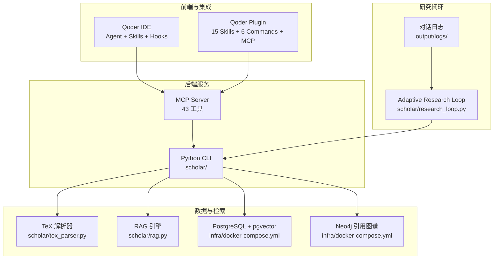
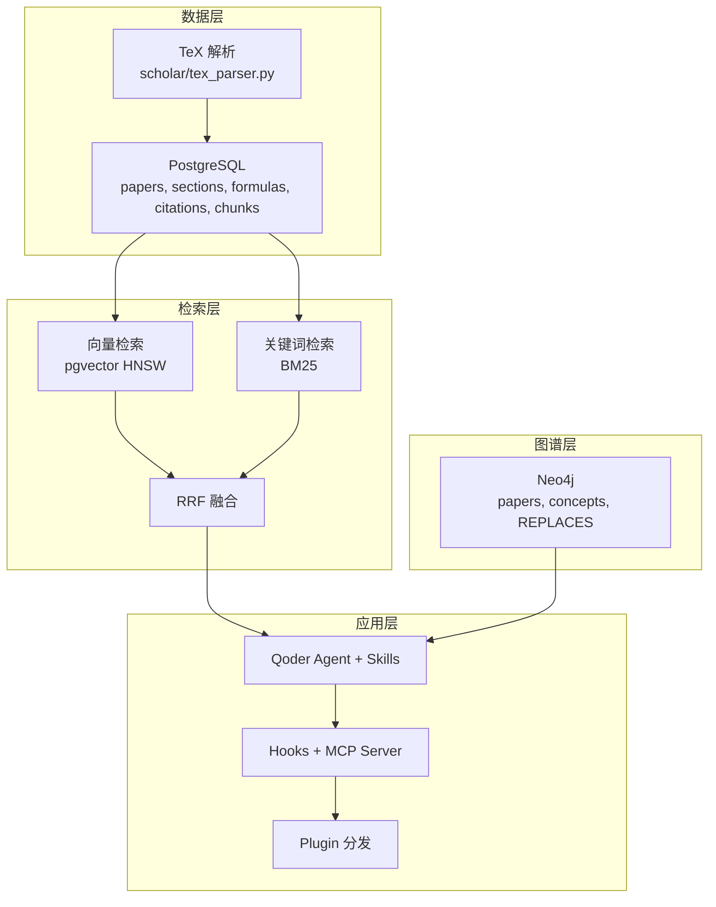
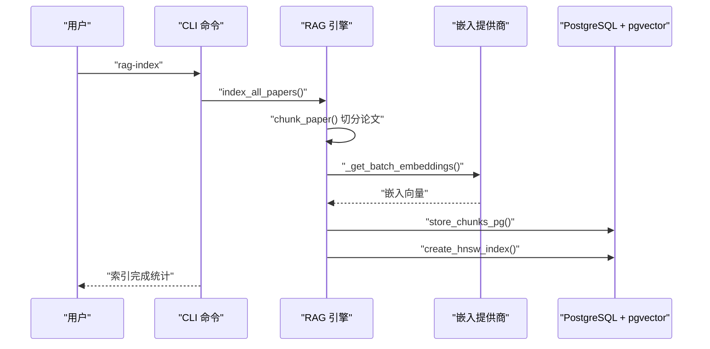
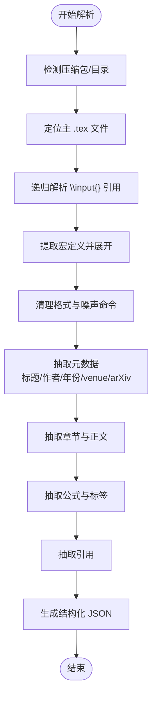
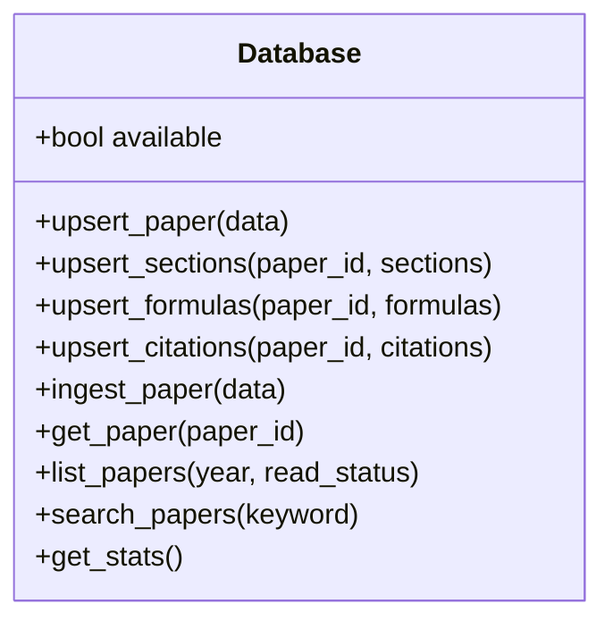
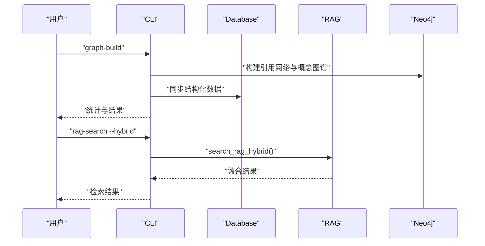
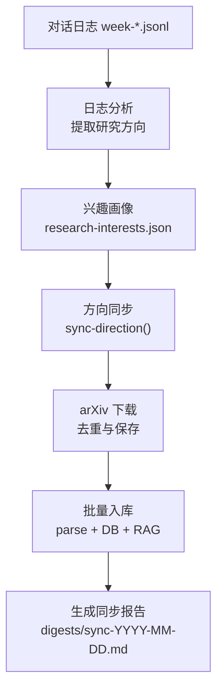
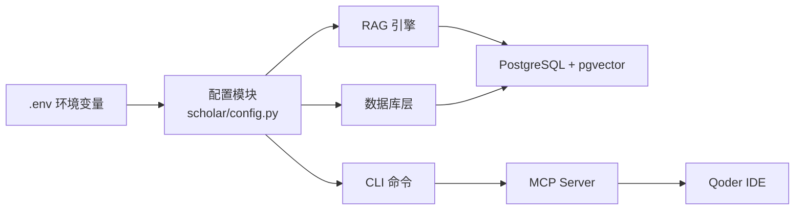

# 智能检索系统

<cite>
**本文档引用的文件**
- [scholar/rag.py](file://scholar/rag.py)
- [scholar/tex_parser.py](file://scholar/tex_parser.py)
- [scholar/config.py](file://scholar/config.py)
- [scholar/db.py](file://scholar/db.py)
- [scholar/cli.py](file://scholar/cli.py)
- [scholar/research_loop.py](file://scholar/research_loop.py)
- [infra/docker-compose.yml](file://infra/docker-compose.yml)
- [README.md](file://README.md)
- [plugin/README.md](file://plugin/README.md)
</cite>

## 目录
1. [简介](#简介)
2. [项目结构](#项目结构)
3. [核心组件](#核心组件)
4. [架构总览](#架构总览)
5. [详细组件分析](#详细组件分析)
6. [依赖关系分析](#依赖关系分析)
7. [性能考虑](#性能考虑)
8. [故障排除指南](#故障排除指南)
9. [结论](#结论)
10. [附录](#附录)

## 简介
本项目是一个面向学术研究的智能检索系统，围绕 RAG（检索增强生成）语义检索、LaTeX 论文解析、Neo4j 引用图谱与 Lean4 形式化验证构建。系统通过 TeX 源码解析生成结构化数据，结合 PostgreSQL + pgvector 的向量索引与关键词 BM25 混合检索，提供高精度、可解释的论文检索与推荐能力；并通过 Adaptive Research Loop 实现从对话日志到论文入库的闭环。

## 项目结构
项目采用模块化组织，核心目录与职责如下：
- scholar：Python CLI 与核心业务逻辑（RAG、TeX 解析、数据库、CLI 命令）
- infra：Docker 编排（PostgreSQL + pgvector、Neo4j）
- plugin：Qoder 插件分发（15个技能 + 6个快捷指令 + MCP Server）
- data/papers：论文源文件（每篇包含 PDF 与 TeX 源压缩包）
- output：解析产物（parsed、notes、drafts、bib、experiments、digests、logs）

图表来源
- [README.md:260-314](file://README.md#L260-L314)
- [infra/docker-compose.yml:1-44](file://infra/docker-compose.yml#L1-L44)

章节来源
- [README.md:365-404](file://README.md#L365-L404)

## 核心组件
- RAG 检索引擎：负责将论文切分为可检索块、生成嵌入、存储至 PostgreSQL + pgvector，并提供向量检索与混合检索（向量 + BM25 + RRF 融合）。
- LaTeX 论文解析器：从 TeX 源码中抽取标题、作者、年份、摘要、章节、公式、引用等结构化信息。
- 数据库层：封装 PostgreSQL 访问，提供论文、章节、公式、引用的增删改查与统计。
- CLI 命令集：提供扫描、解析、入库、图谱构建、RAG 索引、全文搜索、语义搜索、研究循环等命令。
- 研究闭环：从对话日志提取研究方向，自动搜索 arXiv、下载论文、全量入库。

章节来源
- [scholar/rag.py:25-93](file://scholar/rag.py#L25-L93)
- [scholar/tex_parser.py:23-298](file://scholar/tex_parser.py#L23-L298)
- [scholar/db.py:24-176](file://scholar/db.py#L24-L176)
- [scholar/cli.py:46-127](file://scholar/cli.py#L46-L127)
- [scholar/research_loop.py:181-285](file://scholar/research_loop.py#L181-L285)

## 架构总览
系统整体架构由“数据层”“检索层”“图谱层”“应用层”四部分组成：
- 数据层：TeX 解析 + PostgreSQL 结构化存储（papers、sections、formulas、citations、chunks）
- 检索层：向量检索（pgvector HNSW）+ 关键词检索（BM25）+ RRF 融合
- 图谱层：Neo4j 引用网络 + 概念图谱 + Lean4 REPLACES 关系
- 应用层：Qoder Agent + Skills + Hooks + MCP Server + Plugin

图表来源
- [README.md:260-314](file://README.md#L260-L314)
- [infra/docker-compose.yml:1-44](file://infra/docker-compose.yml#L1-L44)

## 详细组件分析

### RAG 检索引擎
- 文本切分策略：抽象、章节段落、公式上下文三类块，保证语义完整性与检索粒度平衡。
- 嵌入生成：支持智谱、OpenAI 两种提供商，本地占位；对提供商 API 进行超时与异常处理。
- 向量存储：将 chunks 与 embedding 写入 PostgreSQL 的 chunks 表，使用 pgvector 向量类型。
- 索引与搜索：创建 HNSW 索引，使用余弦距离进行近似最近邻搜索；提供纯向量检索与混合检索（向量 + BM25 + RRF）。
- 批量索引：分批获取嵌入、进度可视化、失败统计与索引重建。

图表来源
- [scholar/rag.py:471-548](file://scholar/rag.py#L471-L548)
- [scholar/rag.py:182-237](file://scholar/rag.py#L182-L237)
- [scholar/rag.py:427-469](file://scholar/rag.py#L427-L469)

章节来源
- [scholar/rag.py:25-93](file://scholar/rag.py#L25-L93)
- [scholar/rag.py:100-176](file://scholar/rag.py#L100-L176)
- [scholar/rag.py:182-237](file://scholar/rag.py#L182-L237)
- [scholar/rag.py:252-289](file://scholar/rag.py#L252-L289)
- [scholar/rag.py:300-365](file://scholar/rag.py#L300-L365)
- [scholar/rag.py:383-421](file://scholar/rag.py#L383-L421)
- [scholar/rag.py:471-548](file://scholar/rag.py#L471-L548)

### LaTeX 论文解析器
- 输入支持：Tar/Gzip、Tar、Zip 三种压缩格式；也支持已解压目录。
- 主文件定位：优先含 \documentclass 的文件，其次按 \input 引用数量与文件大小排序。
- 宏展开：提取 \newcommand/\def 定义，多轮替换宏，清理噪声命令。
- 元数据抽取：标题（含格式清理与换行处理）、作者（兼容多种分隔符与格式）、年份（会议风格、arXiv ID、前言扫描）、会议/期刊（venue 检测）。
- 结构抽取：章节标题、层级、正文内容；公式抽取（多环境与显示公式）；引用抽取（cite、bibitem）。
- 输出：统一结构化 JSON，包含 tex_file_count、main_tex_file 等统计字段。

图表来源
- [scholar/tex_parser.py:219-298](file://scholar/tex_parser.py#L219-L298)
- [scholar/tex_parser.py:320-344](file://scholar/tex_parser.py#L320-L344)
- [scholar/tex_parser.py:346-374](file://scholar/tex_parser.py#L346-L374)
- [scholar/tex_parser.py:403-435](file://scholar/tex_parser.py#L403-L435)
- [scholar/tex_parser.py:441-527](file://scholar/tex_parser.py#L441-L527)
- [scholar/tex_parser.py:529-714](file://scholar/tex_parser.py#L529-L714)
- [scholar/tex_parser.py:1590-1604](file://scholar/tex_parser.py#L1590-L1604)

章节来源
- [scholar/tex_parser.py:23-298](file://scholar/tex_parser.py#L23-L298)
- [scholar/tex_parser.py:304-374](file://scholar/tex_parser.py#L304-L374)
- [scholar/tex_parser.py:403-527](file://scholar/tex_parser.py#L403-L527)
- [scholar/tex_parser.py:529-714](file://scholar/tex_parser.py#L529-L714)
- [scholar/tex_parser.py:1590-1604](file://scholar/tex_parser.py#L1590-L1604)

### 数据库层
- PostgreSQL 封装：提供可用性检测、连接池、事务控制与上下文管理。
- 论文与结构：upsert_paper、upsert_sections、upsert_formulas、upsert_citations。
- 查询接口：按关键字搜索论文、列出论文、统计指标。
- 文件回退：当数据库不可用时，仍可通过 JSON 文件进行解析与统计。

图表来源
- [scholar/db.py:24-176](file://scholar/db.py#L24-L176)

章节来源
- [scholar/db.py:24-176](file://scholar/db.py#L24-L176)
- [scholar/db.py:248-276](file://scholar/db.py#L248-L276)

### CLI 命令与工作流
- 扫描与解析：scan、parse、parse-all，支持批量进度与错误收集。
- 入库与统计：info、search、list-papers、stats、export-bib。
- 图谱与检索：graph-build、graph-stats、graph-query、rag-search（向量/混合）。
- 研究闭环：interests、research-sync、arxiv-search、arxiv-download、batch-ingest、bootstrap。

图表来源
- [scholar/cli.py:663-705](file://scholar/cli.py#L663-L705)
- [scholar/cli.py:311-370](file://scholar/cli.py#L311-L370)
- [scholar/rag.py:383-421](file://scholar/rag.py#L383-L421)

章节来源
- [scholar/cli.py:46-127](file://scholar/cli.py#L46-L127)
- [scholar/cli.py:311-370](file://scholar/cli.py#L311-L370)
- [scholar/cli.py:663-705](file://scholar/cli.py#L663-L705)

### Adaptive Research Loop（自适应研究闭环）
- 兴趣画像：支持添加、删除、历史记录与原子写入。
- 日志分析：按周读取对话日志，提取研究方向，标记已分析。
- 方向同步：跨关键词去重、arXiv 下载、批量入库、生成同步报告。
- 与 MCP/Plugin 集成：在 Qoder 中通过快捷指令触发，实现端到端自动化。

图表来源
- [scholar/research_loop.py:102-148](file://scholar/research_loop.py#L102-L148)
- [scholar/research_loop.py:181-285](file://scholar/research_loop.py#L181-L285)
- [scholar/research_loop.py:320-358](file://scholar/research_loop.py#L320-L358)

章节来源
- [scholar/research_loop.py:22-96](file://scholar/research_loop.py#L22-L96)
- [scholar/research_loop.py:102-175](file://scholar/research_loop.py#L102-L175)
- [scholar/research_loop.py:181-285](file://scholar/research_loop.py#L181-L285)
- [scholar/research_loop.py:320-358](file://scholar/research_loop.py#L320-L358)

## 依赖关系分析
- 外部依赖：psycopg2（PostgreSQL）、neo4j（Neo4j）、python-dotenv（环境变量）、PyMuPDF（PDF 处理）、mcp（MCP Server）、typer/rich（CLI 界面）。
- 容器依赖：PostgreSQL + pgvector、Neo4j，端口 5433/7474/7687。
- 环境变量：数据库连接、嵌入提供商、API Key、本地编译命令等。

图表来源
- [scholar/config.py:44-61](file://scholar/config.py#L44-L61)
- [infra/docker-compose.yml:1-44](file://infra/docker-compose.yml#L1-L44)

章节来源
- [scholar/config.py:1-119](file://scholar/config.py#L1-L119)
- [infra/docker-compose.yml:1-44](file://infra/docker-compose.yml#L1-L44)

## 性能考虑
- 向量检索性能
  - 使用 HNSW 索引与余弦距离，提高近似最近邻搜索效率。
  - 批量嵌入生成：优先使用提供商的批量接口，降级为单条请求。
  - 分批写入：Rich 进度条与分页提交，降低内存峰值。
- 混合检索
  - BM25 关键词检索作为轻量补充，RRF 融合提升召回与相关性平衡。
- 数据库与索引
  - PostgreSQL 连接池与事务管理，减少连接开销。
  - 索引重建与延迟写入策略，平衡写入吞吐与查询性能。
- 大规模数据处理
  - 批量解析与入库，配合断点续传与错误汇总，提升稳定性。
  - 研究闭环的速率限制与跨关键词去重，避免重复下载与入库。

## 故障排除指南
- Docker 容器启动失败
  - 检查 Docker 状态与端口占用；必要时修改 docker-compose.yml 中端口映射。
- PostgreSQL 连接超时
  - 确认连接端口为 5433（避免与本地 PostgreSQL 冲突）。
- RAG 搜索无结果
  - 确认 SCHOLAR_EMBEDDING_API_KEY；若缺失，系统会回退到全文搜索。
- Bootstrap 中断恢复
  - 重新运行 bootstrap，已完成步骤会自动跳过；如需重跑某步，先 TRUNCATE chunks 表再重建索引。
- 测试失败
  - 确保依赖完整；若数据库未运行，部分测试会跳过，可仅运行不依赖数据库的测试。

章节来源
- [README.md:590-651](file://README.md#L590-L651)

## 结论
本系统通过 TeX 解析与结构化存储，结合 PostgreSQL + pgvector 的向量检索与关键词 BM25 混合检索，实现了高精度、可解释的学术论文检索；配合 Neo4j 引用图谱与 Lean4 形式化验证，进一步增强了知识表达与推理能力。Adaptive Research Loop 将研究流程自动化，从对话日志到论文入库形成闭环。整体架构清晰、模块解耦、扩展性强，适合在多领域论文库场景中推广与定制。

## 附录

### 使用示例
- 初始化与启动
  - 安装依赖、启动数据库、全量初始化（约 40 分钟）。
- 常用命令
  - 全文搜索：python -m scholar search "attention"
  - 语义搜索：python -m scholar rag-search "query"（向量）/ --hybrid（混合）
  - 图谱查询：python -m scholar graph-stats / graph-query
  - 研究闭环：python -m scholar research-sync --category "NLP"

章节来源
- [README.md:87-108](file://README.md#L87-L108)
- [README.md:317-361](file://README.md#L317-L361)

### 配置选项
- 环境变量
  - SCHOLAR_EMBEDDING_API_KEY：RAG 语义搜索所需
  - SCHOLAR_PG_HOST/PORT/NAME/USER/PASS：PostgreSQL 连接
  - SCHOLAR_NEO4J_URI/USER/PASS：Neo4j 连接
  - SCHOLAR_LATEX_CMD：本地 LaTeX 编译命令
- CLI 选项
  - parse-all：limit、force 控制解析范围与覆盖行为
  - rag-search：limit、--hybrid 控制结果数量与检索模式

章节来源
- [scholar/config.py:44-61](file://scholar/config.py#L44-L61)
- [scholar/cli.py:176-196](file://scholar/cli.py#L176-L196)
- [scholar/cli.py:311-370](file://scholar/cli.py#L311-L370)

### 扩展指南
- 更换嵌入提供商：在嵌入函数中新增分支，遵循现有异常与超时处理模式。
- 自定义切分策略：调整 chunk_paper 的分段与公式块策略，平衡检索粒度与语义完整性。
- 新增检索算法：在 BM25 之外增加其他关键词检索算法，统一接口后参与 RRF 融合。
- 多模态内容处理：在解析阶段扩展 PDF/图像/表格等多模态特征抽取，丰富检索信号。

章节来源
- [scholar/rag.py:25-93](file://scholar/rag.py#L25-L93)
- [scholar/rag.py:295-365](file://scholar/rag.py#L295-L365)
- [scholar/tex_parser.py:23-298](file://scholar/tex_parser.py#L23-L298)