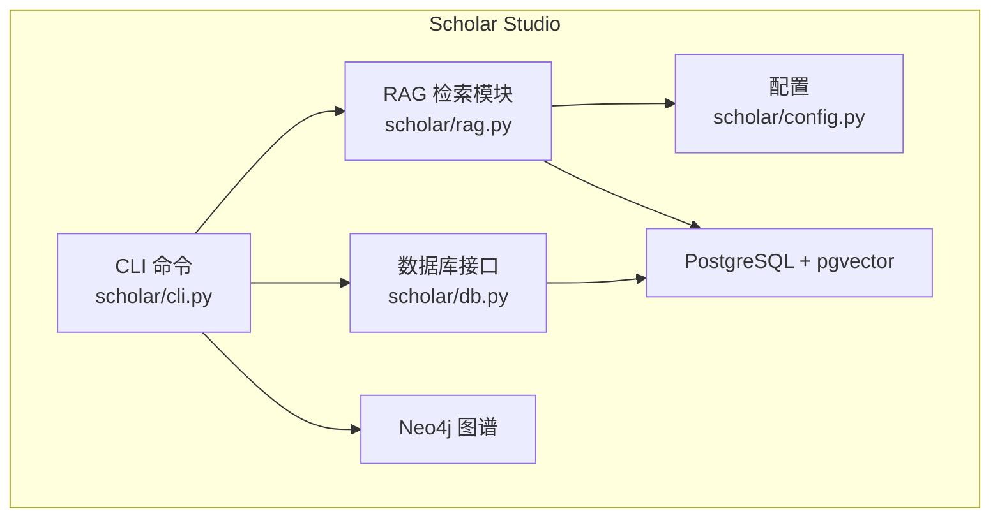
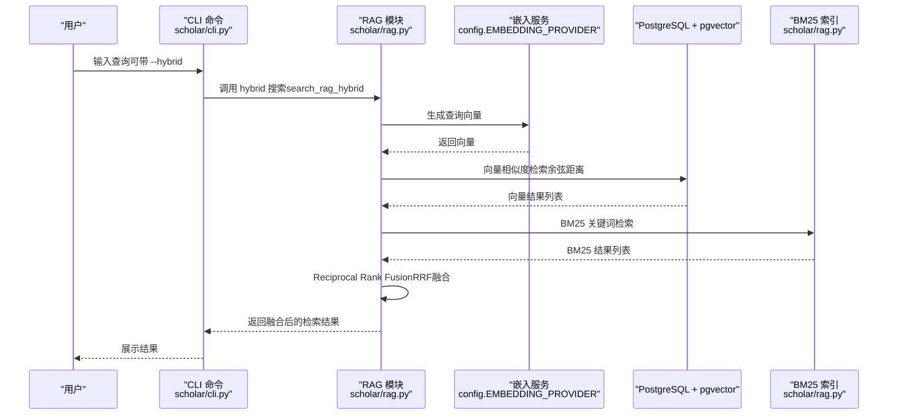
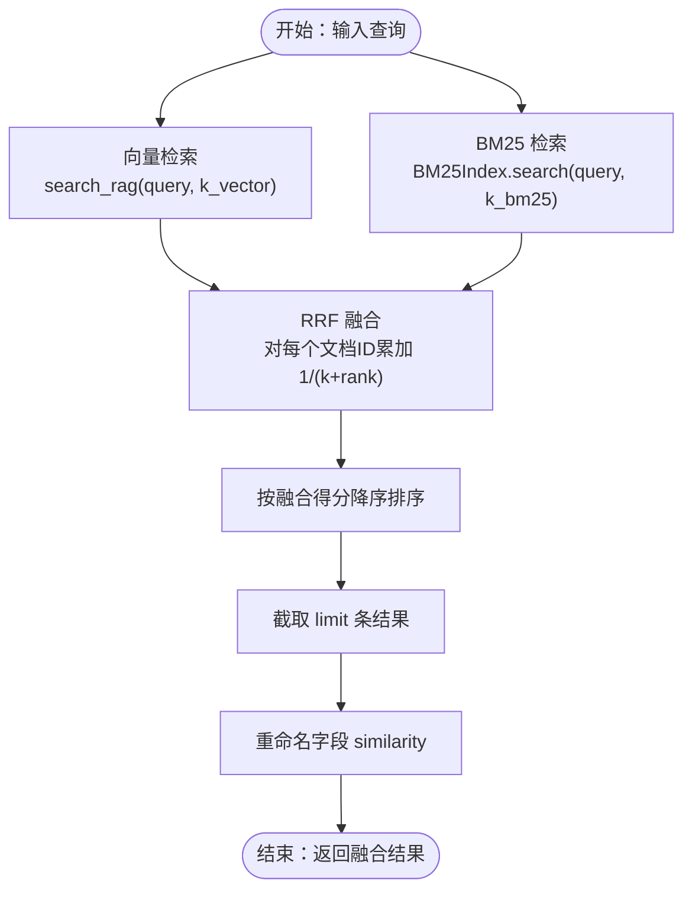
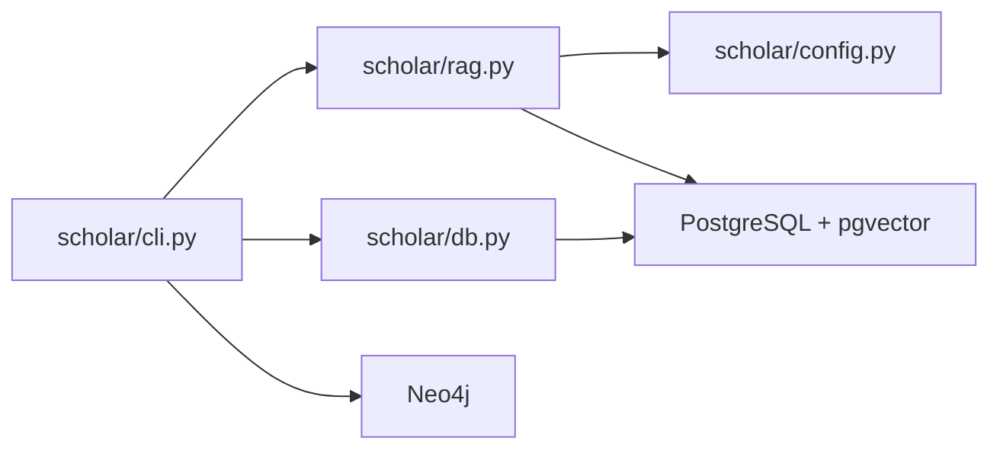

# 混合检索策略

<cite>
**本文档引用的文件**
- [rag.py](file://scholar/rag.py)
- [config.py](file://scholar/config.py)
- [cli.py](file://scholar/cli.py)
- [db.py](file://scholar/db.py)
- [README.md](file://README.md)
- [requirements.txt](file://requirements.txt)
</cite>

## 目录
1. [简介](#简介)
2. [项目结构](#项目结构)
3. [核心组件](#核心组件)
4. [架构总览](#架构总览)
5. [详细组件分析](#详细组件分析)
6. [依赖分析](#依赖分析)
7. [性能考量](#性能考量)
8. [故障排查指南](#故障排查指南)
9. [结论](#结论)
10. [附录](#附录)

## 简介
本文件系统性阐述 Scholar Studio 中“混合检索策略”的技术实现，重点覆盖向量相似度搜索与 BM25 关键词搜索的融合方法，以及 Reciprocal Rank Fusion（RRF）融合算法的原理、参数与调优。文档从查询处理到结果融合的完整流程进行拆解，并给出不同搜索策略的适用场景、性能对比、配置选项、调优参数与实际应用示例，帮助读者按业务需求灵活调整向量与关键词搜索的权重分配。

## 项目结构
Scholar Studio 的检索能力由 RAG 模块提供，核心文件包括：
- 检索与融合：scholar/rag.py
- 配置与环境变量：scholar/config.py
- CLI 命令入口与检索命令：scholar/cli.py
- 数据库访问与全文搜索：scholar/db.py
- 项目说明与命令参考：README.md
- 依赖声明：requirements.txt

图表来源
- [cli.py](file://scholar/cli.py)
- [config.py](file://scholar/config.py)
- [rag.py](file://scholar/rag.py)
- [db.py](file://scholar/db.py)

章节来源
- [README.md](file://README.md)
- [requirements.txt](file://requirements.txt)

## 核心组件
- 向量检索（Semantic Search）
  - 将查询文本经嵌入模型编码为向量，使用 PostgreSQL + pgvector 的余弦距离近似最近邻搜索，返回相似度最高的片段。
- BM25 关键词检索（Keyword Search）
  - 基于分词与词频统计构建轻量级 BM25 索引，支持对片段内容进行关键词匹配与打分排序。
- 混合检索（Hybrid Search）
  - 并行执行向量检索与 BM25 检索，采用 Reciprocal Rank Fusion（RRF）对两个来源的结果进行融合，统一输出相似度分数。
- 批量索引与 HNSW 索引
  - 支持批量生成嵌入、分批入库、创建 HNSW 索引以提升大规模向量检索性能。

章节来源
- [rag.py](file://scholar/rag.py)
- [config.py](file://scholar/config.py)

## 架构总览
混合检索的整体工作流如下：

图表来源
- [cli.py](file://scholar/cli.py)
- [rag.py](file://scholar/rag.py)
- [config.py](file://scholar/config.py)

## 详细组件分析

### 向量相似度搜索
- 功能要点
  - 查询文本经嵌入模型编码为向量。
  - 使用 PostgreSQL + pgvector 的向量类型与余弦距离进行近似最近邻搜索。
  - 返回片段级相似度与元数据（论文 ID、片段内容、所属章节）。
- 性能特性
  - 创建 HNSW 索引以加速大规模向量检索；索引参数可在模块内配置。
- 适用场景
  - 语义相近但表达不同的内容召回；跨段落的主题关联。
- 关键实现位置
  - 嵌入生成与提供商选择：[get_embedding](file://scholar/rag.py)
  - 向量检索主流程：[search_rag](file://scholar/rag.py)
  - HNSW 索引创建：[create_hnsw_index](file://scholar/rag.py)

章节来源
- [rag.py](file://scholar/rag.py)

### BM25 关键词搜索
- 功能要点
  - 使用简单分词器提取关键词，统计词频与文档频率，计算 BM25 得分。
  - 从 PostgreSQL 加载片段内容构建索引，支持限制加载数量以控制内存。
- 参数与行为
  - k1、b：BM25 的饱和与长度归一化参数，默认值在类构造函数中设置。
  - 通过 build_from_pg 从 chunks 表加载数据，计算平均文档长度与词项频率。
- 适用场景
  - 精确术语匹配；短查询、强关键词主导的检索。
- 关键实现位置
  - 分词器：[_tokenize](file://scholar/rag.py)
  - BM25 索引类与搜索：[BM25Index.search](file://scholar/rag.py)
  - 全局懒加载实例：[_get_bm25](file://scholar/rag.py)

章节来源
- [rag.py](file://scholar/rag.py)

### Reciprocal Rank Fusion（RRF）融合
- 算法原理
  - 对同一查询，分别得到向量检索与 BM25 检索的候选集合。
  - 对每个唯一文档 ID，按其在两个列表中的排名计算 1/(k+rank)，累加作为最终融合得分。
  - k 为融合常数，常用默认值 60；rank 从 0 开始。
- 融合流程
  - 先遍历向量结果，再遍历 BM25 结果，累加每个文档的 RRF 分数。
  - 按融合得分降序排序，截取指定数量结果。
  - 为兼容对外 API，将融合得分字段重命名为 similarity。
- 参数与调优
  - k_rrf：RRF 融合常数，影响远距离排名的衰减速度。增大 k 使更靠后的结果对融合得分贡献更大，降低 k 则更强调前排结果。
  - k_vector、k_bm25：分别控制向量与 BM25 的候选规模，影响召回广度与性能。
- 关键实现位置
  - 融合主流程：[search_rag_hybrid](file://scholar/rag.py)

图表来源
- [rag.py](file://scholar/rag.py)

章节来源
- [rag.py](file://scholar/rag.py)

### 混合检索工作流程（从查询到融合）
- CLI 层
  - 用户通过命令行触发检索，支持普通向量检索与混合检索模式。
- 检索层
  - 混合模式下并行执行向量与 BM25 检索，随后进行 RRF 融合。
- 输出层
  - 统一返回包含 similarity 字段的结果列表，便于上层展示与二次加工。

章节来源
- [cli.py](file://scholar/cli.py)
- [rag.py](file://scholar/rag.py)

### 不同策略的适用场景与性能对比
- 向量检索
  - 优势：语义理解能力强，适合长尾与表达差异较大的查询。
  - 成本：依赖外部嵌入服务，延迟与费用较高；对噪声词与拼写错误敏感。
- BM25 关键词检索
  - 优势：响应快、可控性强，适合精确术语与短查询。
  - 成本：对语义理解有限，易漏召回。
- 混合检索
  - 优势：兼顾语义与精确性，提升整体召回与准确率。
  - 成本：并发两次检索，资源消耗增加；需合理设置 k_rrf、k_vector、k_bm25 以平衡效果与性能。

章节来源
- [rag.py](file://scholar/rag.py)

### 配置选项与调优参数
- 环境与配置
  - 嵌入提供商与模型：EMBEDDING_PROVIDER、EMBEDDING_MODEL、EMBEDDING_DIM、EMBEDDING_API_KEY
  - 数据库连接：PG_HOST、PG_PORT、PG_NAME、PG_USER、PG_PASS
  - 输出目录与中间产物路径：PARSED_DIR、OUTPUT_DIR 等
- 检索参数
  - RRF 常数：k_rrf（默认 60）
  - 向量候选规模：k_vector（默认 30）
  - BM25 候选规模：k_bm25（默认 30）
  - BM25 参数：k1、b（在 BM25Index 构造函数中设置）
- 索引与性能
  - HNSW 索引参数：M、ef_construction（在创建索引处设置）
  - 批量嵌入：支持批量调用以减少 API 调用次数

章节来源
- [config.py](file://scholar/config.py)
- [rag.py](file://scholar/rag.py)

### 实际应用示例
- 命令行示例
  - 向量检索：python -m scholar rag-search "query"
  - 混合检索：python -m scholar rag-search "query" --hybrid
- 业务调优思路
  - 以关键词为主：提高 k_bm25，适当降低 k_rrf，强化精确匹配。
  - 以语义为主：提高 k_vector，适度增大 k_rrf，增强远距离召回。
  - 平衡策略：保持 k_rrf 默认值，按数据规模调整 k_vector 与 k_bm25，观察命中率与平均排名变化。

章节来源
- [README.md](file://README.md)
- [cli.py](file://scholar/cli.py)
- [rag.py](file://scholar/rag.py)

## 依赖分析
- 外部依赖
  - PostgreSQL + pgvector：向量存储与检索
  - Neo4j：图谱分析（与检索互补）
  - python-dotenv：环境变量加载
  - rich、typer：CLI 交互与输出美化
  - psycopg2-binary：PostgreSQL 连接
- 模块间耦合
  - RAG 模块依赖配置模块读取环境变量与数据库连接参数。
  - CLI 通过命令路由调用 RAG 与数据库模块。
  - 数据库模块提供全文搜索能力，作为混合检索的关键词侧补充。

图表来源
- [rag.py](file://scholar/rag.py)
- [config.py](file://scholar/config.py)
- [cli.py](file://scholar/cli.py)
- [db.py](file://scholar/db.py)

章节来源
- [requirements.txt](file://requirements.txt)
- [config.py](file://scholar/config.py)

## 性能考量
- 向量检索
  - 使用 HNSW 索引显著降低查询延迟；索引参数（如 M、ef_construction）直接影响检索精度与性能，应结合数据规模与硬件条件调优。
  - 批量嵌入可减少 API 调用次数，提升吞吐。
- BM25 检索
  - 通过限制 build_from_pg 的加载上限与合理的 k_bm25，控制内存与 CPU 占用。
- 混合检索
  - RRF 融合的时间复杂度与两个候选列表长度线性相关；可通过合理设置 k_vector 与 k_bm25 控制候选规模。
  - 在高并发场景下，建议对向量与 BM25 检索结果进行缓存（按查询指纹），以减少重复计算。

## 故障排查指南
- RAG 搜索无结果
  - 确认嵌入 API Key 已正确配置；若缺失，系统会回退至全文搜索。
  - 确认已成功执行 RAG 索引构建与 HNSW 索引创建。
- 数据库连接异常
  - 端口 5433 为默认值，避免与本地 PostgreSQL 冲突；请核对环境变量与容器配置。
- 混合检索性能差
  - 适当降低 k_vector 与 k_bm25，或调整 k_rrf；评估 HNSW 索引参数与硬件资源。

章节来源
- [README.md](file://README.md)
- [rag.py](file://scholar/rag.py)
- [config.py](file://scholar/config.py)

## 结论
混合检索通过将向量语义与 BM25 关键词检索相结合，并以 RRF 进行统一融合，能够在准确性与效率之间取得良好平衡。实践中应依据业务目标与数据特征，合理设置 k_rrf、k_vector、k_bm25 以及索引参数，持续监控命中率、平均排名与响应时间，逐步优化检索策略。

## 附录
- 命令参考（来自 README）
  - 全文搜索：python -m scholar search "keyword"
  - 向量搜索：python -m scholar rag-search "query"
  - 混合搜索：python -m scholar rag-search "query" --hybrid
- 数据规模与指标（来自 README）
  - 论文数量、片段数量、Neo4j 节点与边等，有助于评估检索规模与性能基线。

章节来源
- [README.md](file://README.md)
- [cli.py](file://scholar/cli.py)