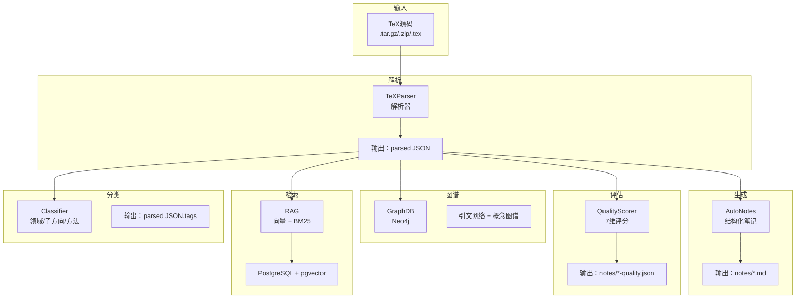
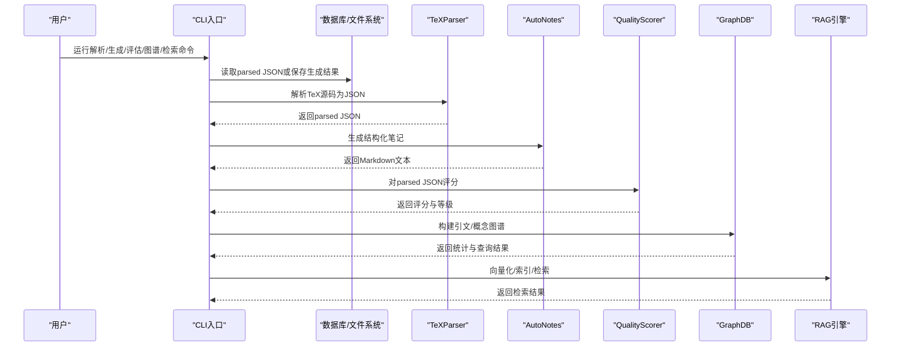
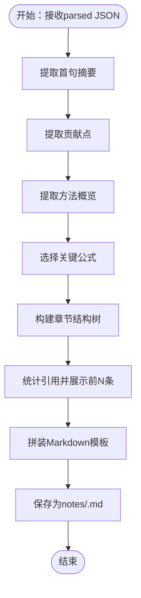
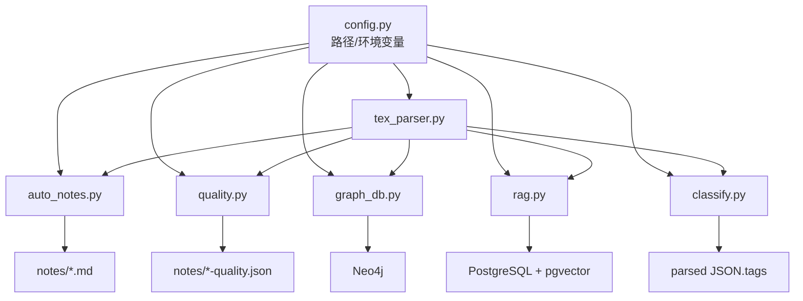

# 自动笔记生成

<cite>
**本文档引用的文件**
- [auto_notes.py](file://scholar/auto_notes.py)
- [tex_parser.py](file://scholar/tex_parser.py)
- [quality.py](file://scholar/quality.py)
- [config.py](file://scholar/config.py)
- [db.py](file://scholar/db.py)
- [cli.py](file://scholar/cli.py)
- [graph_db.py](file://scholar/graph_db.py)
- [rag.py](file://scholar/rag.py)
- [classify.py](file://scholar/classify.py)
- [cite_resolve.py](file://scholar/cite_resolve.py)
- [year_fix.py](file://scholar/year_fix.py)
- [requirements.txt](file://requirements.txt)
</cite>

## 目录
1. [简介](#简介)
2. [项目结构](#项目结构)
3. [核心组件](#核心组件)
4. [架构总览](#架构总览)
5. [详细组件分析](#详细组件分析)
6. [依赖关系分析](#依赖关系分析)
7. [性能考虑](#性能考虑)
8. [故障排除指南](#故障排除指南)
9. [结论](#结论)
10. [附录](#附录)

## 简介
本项目为“学术研究工具包（Scholar Studio）”中的自动笔记生成功能，旨在从解析后的论文JSON中自动生成结构化的Markdown阅读笔记。该功能覆盖摘要提取、贡献点识别、方法概览、关键公式筛选、章节结构树、参考文献汇总等维度，并提供批量处理能力与质量评估、知识图谱集成、RAG检索增强等扩展能力。本文档将深入解释算法设计、数据流、模板结构、质量评估指标、人工审核流程以及与知识图谱和后续处理机制的集成方式，并给出优化建议与大规模论文集处理策略。

## 项目结构
项目采用模块化设计，围绕“解析-生成-评估-图谱-检索”的流水线组织：
- 解析层：从TeX源码解析出结构化JSON（标题、作者、年份、会议、摘要、章节、公式、引用）
- 生成层：将解析结果转化为结构化笔记（Markdown）
- 质量层：对论文进行多维评分，辅助筛选与人工复核
- 图谱层：在Neo4j中构建引文网络与概念图谱
- 检索层：向量化嵌入与混合检索，支持RAG应用
- CLI层：命令行入口，统一调度各模块

图表来源
- [tex_parser.py:23-285](file://scholar/tex_parser.py#L23-L285)
- [auto_notes.py:28-160](file://scholar/auto_notes.py#L28-L160)
- [quality.py:317-356](file://scholar/quality.py#L317-L356)
- [graph_db.py:225-280](file://scholar/graph_db.py#L225-L280)
- [rag.py:471-548](file://scholar/rag.py#L471-L548)
- [classify.py:161-238](file://scholar/classify.py#L161-L238)

章节来源
- [config.py:20-37](file://scholar/config.py#L20-L37)
- [cli.py:42-234](file://scholar/cli.py#L42-L234)

## 核心组件
- 自动笔记生成器（AutoNotes）：负责将解析后的论文数据转换为结构化Markdown笔记，包含摘要、贡献点、方法概览、关键公式、章节结构、引用统计等。
- 论文质量评分器（QualityScorer）：对论文的元数据完整性、结构质量、引用密度、可复现性信号、问题定义清晰度、创新性、实验严谨性等维度进行打分，输出总分与等级。
- TeX解析器（TeXParser）：从压缩包或目录中解析出论文的标题、作者、年份、会议、摘要、章节、公式、引用等字段，形成标准化JSON。
- 图数据库（GraphDB）：在Neo4j中构建引文网络与概念图谱，支持中心性计算、桥接论文识别、概念共现等分析。
- 检索增强（RAG）：将论文切分为块，生成向量嵌入，存入PostgreSQL pgvector，提供向量相似搜索与BM25关键词搜索的混合融合检索。
- 分类器（Classifier）：基于规则与关键词匹配，将论文归类到多级标签体系（领域/子方向/具体方法），并写回parsed JSON。
- 引用解析（Citation Resolver）：将引用键映射到内部已知论文或外部arXiv条目，创建外部节点并建立引文边。
- 年份补全（Year Fix）：通过Lean4数据库与内容启发式推断，补全缺失的发表年份。

章节来源
- [auto_notes.py:28-160](file://scholar/auto_notes.py#L28-L160)
- [quality.py:317-356](file://scholar/quality.py#L317-L356)
- [tex_parser.py:214-285](file://scholar/tex_parser.py#L214-L285)
- [graph_db.py:225-280](file://scholar/graph_db.py#L225-L280)
- [rag.py:471-548](file://scholar/rag.py#L471-L548)
- [classify.py:161-238](file://scholar/classify.py#L161-L238)
- [cite_resolve.py:237-322](file://scholar/cite_resolve.py#L237-L322)
- [year_fix.py:165-239](file://scholar/year_fix.py#L165-L239)

## 架构总览
自动笔记生成是“解析-生成-评估-图谱-检索”流水线中的关键一环。其控制流如下：
- 输入：解析后的parsed JSON（由TeXParser产出）
- 处理：AutoNotes按固定模板抽取关键信息并生成Markdown
- 输出：单篇笔记文件（notes/<ULID>.md）
- 扩展：QualityScorer对同一数据打分；GraphDB与RAG可基于相同parsed JSON进行后续处理

图表来源
- [cli.py:131-167](file://scholar/cli.py#L131-L167)
- [cli.py:173-234](file://scholar/cli.py#L173-L234)
- [auto_notes.py:282-354](file://scholar/auto_notes.py#L282-L354)
- [quality.py:363-431](file://scholar/quality.py#L363-L431)
- [graph_db.py:225-280](file://scholar/graph_db.py#L225-L280)
- [rag.py:471-548](file://scholar/rag.py#L471-L548)

## 详细组件分析

### 自动笔记生成器（AutoNotes）
- 功能概述
  - 将parsed JSON转换为结构化Markdown笔记，包含：摘要、核心贡献、方法概览、关键公式、章节结构树、引用统计等。
  - 支持单篇生成与批量生成，具备去重与覆盖控制。
- 关键算法
  - 首句摘要提取：基于句子边界分割，过滤过短片段，返回第一个有效句子。
  - 贡献点提取：在引言/结论/摘要等目标段落中使用正则模式匹配贡献性语句，去重并限制数量。
  - 方法概览：在“方法/方法论/框架/模型”等关键词段落中截取首段作为概览。
  - 关键公式选择：综合“带标签公式优先”、“复杂度加分”、“环境类型偏好”等启发式打分，选取前N个。
  - 章节结构树：递归解析sections列表，按层级缩进输出标题与内容长度。
  - 引用统计：统计引用总数并展示前若干条。
- 模板与自定义
  - 模板结构固定，便于统一阅读体验；可通过调整正则模式、阈值与截断长度实现定制。
  - 公式选择的打分权重、方法概览的关键词集合、贡献点的匹配模式均可配置。
- 批量处理
  - 遍历parsed目录下的所有JSON，逐个生成笔记，支持跳过已存在文件与失败统计。

图表来源
- [auto_notes.py:28-160](file://scholar/auto_notes.py#L28-L160)
- [auto_notes.py:282-354](file://scholar/auto_notes.py#L282-L354)

章节来源
- [auto_notes.py:28-160](file://scholar/auto_notes.py#L28-L160)
- [auto_notes.py:282-354](file://scholar/auto_notes.py#L282-L354)

### TeX解析器（TeXParser）
- 功能概述
  - 从压缩包或目录中解析出论文的元数据与正文结构，包括标题、作者、年份、会议、摘要、章节、公式、引用等。
  - 支持宏展开、命令清理、数学环境识别、引用解析等。
- 关键算法
  - 主文件识别：优先选择包含\input引用的主文件，避免仅含章节内容的独立大文件遗漏主干。
  - 宏解析：收集\newcommand/\def定义，多轮替换以解析自定义命令。
  - 标题/作者/年份/会议提取：针对不同会议风格与格式进行模式匹配与清洗。
  - 数学公式提取：识别多种LaTeX数学环境，保留标签与上下文。
  - 引用解析：提取\bibitem与\cite系列命令，形成引用列表。
- 性能与健壮性
  - 使用正则表达式与递归解析，兼顾准确性与效率；对缺失文件与异常进行容错处理。

章节来源
- [tex_parser.py:214-285](file://scholar/tex_parser.py#L214-L285)
- [tex_parser.py:307-361](file://scholar/tex_parser.py#L307-L361)
- [tex_parser.py:428-514](file://scholar/tex_parser.py#L428-L514)
- [tex_parser.py:516-801](file://scholar/tex_parser.py#L516-L801)

### 质量评分器（QualityScorer）
- 维度设计
  - 元数据完整性：标题、作者、年份、会议、摘要完整性评分
  - 结构质量：章节数量、关键段落覆盖、层级多样性
  - 引用密度：引用总数与多样性
  - 可复现性信号：代码链接、数据集提及、超参数描述、训练细节
  - 问题定义清晰度：明确的问题陈述、挑战、动机、目标
  - 创新性信号：新颖声明、与先验对比、贡献表述、消融分析
  - 实验严谨性：基准测试、指标、统计分析、多基线比较、结果表格/图示
- 评分逻辑
  - 每个维度返回0-10分与详细说明，最终计算总分与百分比等级（A-F）。
  - 将评分写入parsed JSON的quality字段，并单独输出quality JSON文件用于审计与可视化。

章节来源
- [quality.py:28-58](file://scholar/quality.py#L28-L58)
- [quality.py:61-96](file://scholar/quality.py#L61-L96)
- [quality.py:99-125](file://scholar/quality.py#L99-L125)
- [quality.py:128-166](file://scholar/quality.py#L128-L166)
- [quality.py:169-212](file://scholar/quality.py#L169-L212)
- [quality.py:215-251](file://scholar/quality.py#L215-L251)
- [quality.py:254-299](file://scholar/quality.py#L254-L299)
- [quality.py:317-356](file://scholar/quality.py#L317-L356)
- [quality.py:363-431](file://scholar/quality.py#L363-L431)

### 图数据库（GraphDB）
- 引文网络
  - 基于parsed JSON中的引用列表，在Neo4j中创建Paper节点与CITES边，支持引用键到ULID的解析与重映射。
  - 提供中心性计算（入度/出度/桥接分数）、最短路径查找、引文统计等查询。
- 概念图谱
  - 从Lean4数据库动态加载创新节点，基于TF-IDF与别名匹配将论文与概念关联，构建概念共现边。
  - 支持概念时间线、相关概念查询、子图导出等分析。
- 增量更新
  - 提供单篇Paper节点、引文、概念的增量同步接口，配合CLI的“graph-build”命令使用。

章节来源
- [graph_db.py:225-280](file://scholar/graph_db.py#L225-L280)
- [graph_db.py:846-922](file://scholar/graph_db.py#L846-L922)

### 检索增强（RAG）
- 文本切分
  - 将摘要、章节段落、公式上下文切分为适合嵌入的块，保留标题与上下文信息。
- 向量嵌入
  - 支持智谱、OpenAI等API，生成向量并存入PostgreSQL pgvector。
- 检索策略
  - 向量相似搜索与BM25关键词搜索的混合融合（RRF），提升召回与排序效果。
- 批量索引
  - 提供批量切分、批量化嵌入、入库与HNSW索引创建的完整流程。

章节来源
- [rag.py:25-93](file://scholar/rag.py#L25-L93)
- [rag.py:100-175](file://scholar/rag.py#L100-L175)
- [rag.py:182-237](file://scholar/rag.py#L182-L237)
- [rag.py:252-288](file://scholar/rag.py#L252-L288)
- [rag.py:383-420](file://scholar/rag.py#L383-L420)
- [rag.py:471-548](file://scholar/rag.py#L471-L548)

### 分类器（Classifier）
- 多级标签体系
  - 领域（如NLP/CV/RL/ML/Safety/Multimodal/Systems）
  - 子方向（如语言建模、目标检测、策略优化等）
  - 具体方法（如Transformer、ResNet、DQN等）
- 规则与关键词匹配
  - 基于预定义关键词与会议提示词进行打分与匹配，结合前几个章节标题与摘要内容。
  - 输出domains/sub_directions/methods/tags并写回parsed JSON。

章节来源
- [classify.py:161-238](file://scholar/classify.py#L161-L238)
- [classify.py:245-275](file://scholar/classify.py#L245-L275)
- [classify.py:278-293](file://scholar/classify.py#L278-L293)
- [classify.py:296-327](file://scholar/classify.py#L296-L327)

### 引用解析（Citation Resolver）
- 内部匹配
  - 构建内部论文索引（规范化标题→ULID），使用编辑距离与词重叠进行模糊匹配。
- 外部解析
  - 对未解析的引用键调用arXiv API，创建ExternalPaper节点并在图中建立CITES边。
- 统计与报告
  - 输出总引用数、内部解析数、arXiv解析数、仍不可解析数等统计信息。

章节来源
- [cite_resolve.py:65-133](file://scholar/cite_resolve.py#L65-L133)
- [cite_resolve.py:140-189](file://scholar/cite_resolve.py#L140-L189)
- [cite_resolve.py:196-230](file://scholar/cite_resolve.py#L196-L230)
- [cite_resolve.py:237-322](file://scholar/cite_resolve.py#L237-L322)

### 年份补全（Year Fix）
- Lean4匹配
  - 解析Lean4 Database.lean中的paper定义，通过标题规范化与模糊匹配将Lean ID映射到ULID。
- 内容启发式
  - 从摘要与前几段内容中提取年份提及，选择出现频率最高且较新的年份。
- arXiv回填
  - 对仍缺失年份的论文发起arXiv API查询，补充年份信息。
- 统计与报告
  - 输出匹配数、已有时、补全数、仍缺失数等统计。

章节来源
- [year_fix.py:19-84](file://scholar/year_fix.py#L19-L84)
- [year_fix.py:102-158](file://scholar/year_fix.py#L102-L158)
- [year_fix.py:165-239](file://scholar/year_fix.py#L165-L239)
- [year_fix.py:270-311](file://scholar/year_fix.py#L270-L311)

## 依赖关系分析
- 外部依赖
  - PostgreSQL + pgvector：结构化存储与向量检索
  - Neo4j：概念图谱与引文网络
  - 智谱/OpenAI：嵌入API
  - PyMuPDF：PDF处理（用于其他流程）
  - Typer/Rich：CLI与终端显示
- 内部模块耦合
  - AutoNotes依赖parsed JSON字段（sections/formulas/citations/abstract等）
  - QualityScorer与Classifier均消费parsed JSON并写回字段
  - GraphDB与RAG均依赖parsed JSON进行图谱/索引构建
  - CLI统一调度上述模块，提供命令入口

图表来源
- [config.py:20-62](file://scholar/config.py#L20-L62)
- [auto_notes.py:28-160](file://scholar/auto_notes.py#L28-L160)
- [quality.py:317-356](file://scholar/quality.py#L317-L356)
- [graph_db.py:225-280](file://scholar/graph_db.py#L225-L280)
- [rag.py:471-548](file://scholar/rag.py#L471-L548)
- [classify.py:161-238](file://scholar/classify.py#L161-L238)

章节来源
- [requirements.txt:1-9](file://requirements.txt#L1-L9)
- [config.py:20-62](file://scholar/config.py#L20-L62)

## 性能考虑
- 批量处理
  - AutoNotes与QualityScorer均提供批量函数，遍历parsed目录，支持跳过已存在文件与失败统计，减少重复工作。
- 向量化与索引
  - RAG采用HNSW近似最近邻索引，显著降低相似搜索延迟；批量化嵌入与进度条提升吞吐。
- 正则与字符串处理
  - TeXParser与AutoNotes大量使用正则，建议在大规模运行时开启缓存与合理的阈值，避免过度匹配导致的性能损耗。
- 数据库连接
  - GraphDB与RAG均采用连接池与批量写入，减少事务开销；注意合理设置批大小与超时。

## 故障排除指南
- 解析失败
  - 检查TeX压缩包是否包含主文件与必要宏；确认宏定义是否被正确解析；查看CLI的错误输出与日志。
- 笔记为空或不完整
  - 确认parsed JSON中sections/formulas/citations/abstract字段是否存在；检查AutoNotes的正则模式是否覆盖目标段落。
- 质量评分异常
  - 检查parsed JSON字段是否齐全；确认QualityScorer的维度阈值是否合理；查看输出的details字段定位问题。
- 图谱构建失败
  - 确认Neo4j服务可用；检查parsed JSON中的citations格式；使用“graph-build”命令逐步排查。
- RAG索引失败
  - 确认PostgreSQL与pgvector扩展可用；检查嵌入API密钥与网络；查看HNSW索引创建日志。
- 引用解析未命中
  - 使用cite-resolve命令进行内部匹配与arXiv回填；检查引用键格式与规范化策略。

章节来源
- [cli.py:165-167](file://scholar/cli.py#L165-L167)
- [cli.py:217-233](file://scholar/cli.py#L217-L233)
- [auto_notes.py:314-321](file://scholar/auto_notes.py#L314-L321)
- [quality.py:399-400](file://scholar/quality.py#L399-L400)
- [graph_db.py:676-677](file://scholar/graph_db.py#L676-L677)
- [rag.py:214-237](file://scholar/rag.py#L214-L237)
- [cite_resolve.py:300-310](file://scholar/cite_resolve.py#L300-L310)

## 结论
自动笔记生成功能通过“解析-生成-评估-图谱-检索”的流水线，实现了从原始论文到结构化笔记的自动化转换。其核心在于：
- 基于规则与启发式的摘要、贡献点、方法概览提取
- 关键公式的选择性压缩与展示
- 固定模板与可配置参数的平衡
- 与质量评分、知识图谱、RAG检索的深度集成
- 批量处理与错误恢复机制保障规模化应用

建议在实际部署中结合质量评分进行人工审核，持续优化正则与阈值，并利用图谱与检索能力提升后续阅读与研究效率。

## 附录
- 命令行入口
  - 解析单篇/批量：parse/parse-all
  - 生成笔记：auto-notes（通过CLI调度）
  - 质量评分：score-all/score-single
  - 图谱构建：graph-build/graph-stats
  - 检索：rag-index/rag-search
  - 分类：classify-all/classify-single
  - 引用解析：cite-resolve
  - 年份补全：year-fix/year-fix-arxiv
- 输出目录
  - parsed：解析后的JSON
  - notes：结构化笔记与质量JSON
  - drafts：草稿（预留）
  - bib：参考文献导出
  - experiments：实验产物（预留）

章节来源
- [cli.py:131-167](file://scholar/cli.py#L131-L167)
- [cli.py:173-234](file://scholar/cli.py#L173-L234)
- [cli.py:306-364](file://scholar/cli.py#L306-L364)
- [cli.py:416-482](file://scholar/cli.py#L416-L482)
- [cli.py:673-715](file://scholar/cli.py#L673-L715)
- [config.py:27-37](file://scholar/config.py#L27-L37)