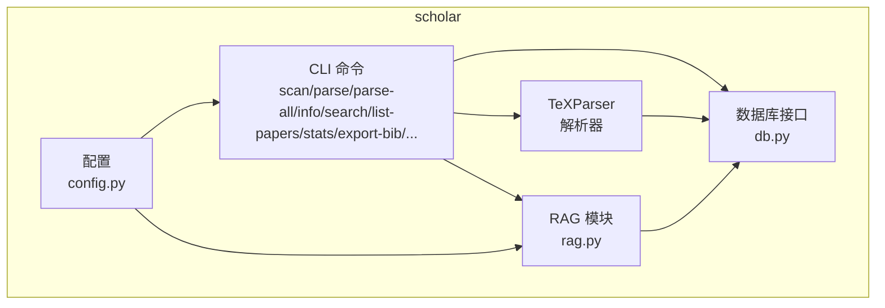
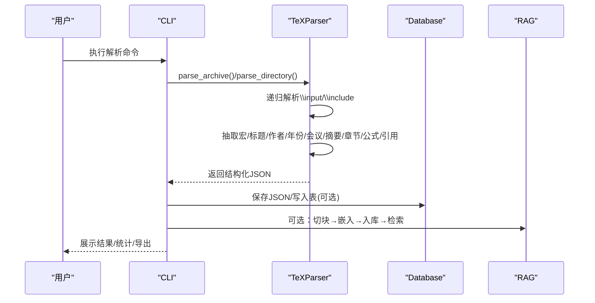
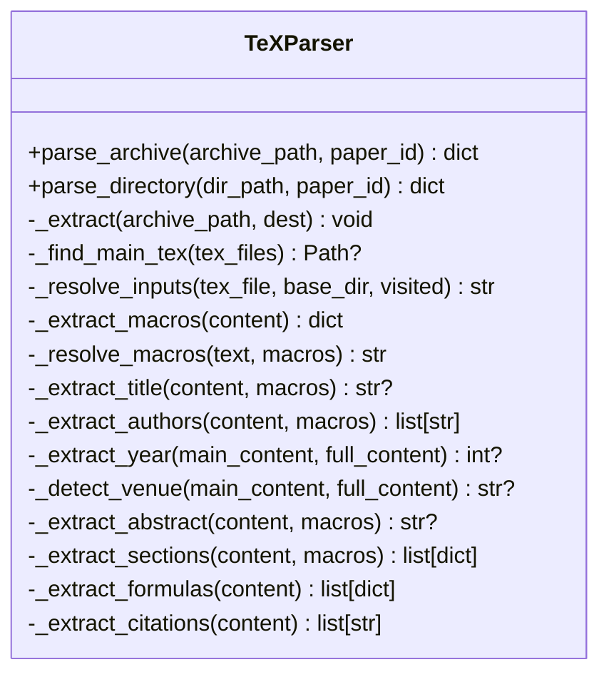
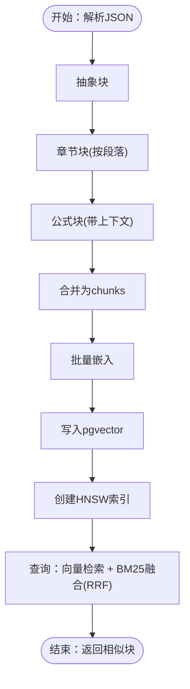
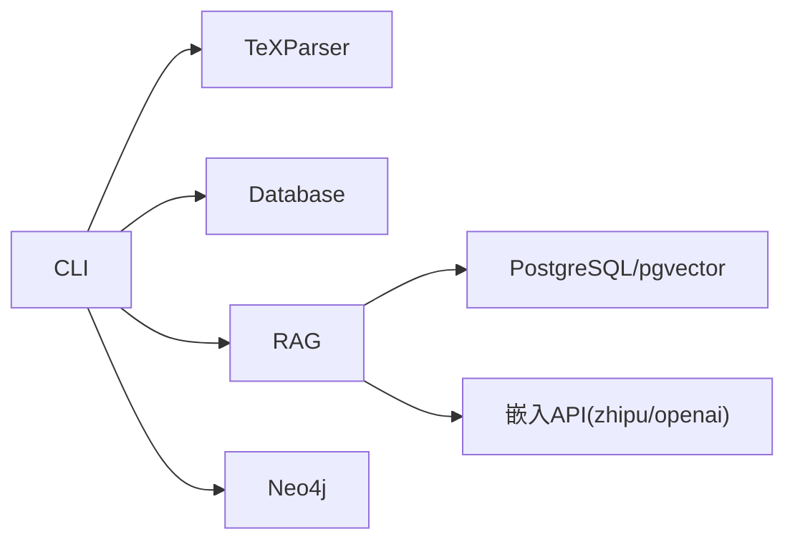

# 论文解析器

<cite>
**本文档引用的文件**
- [tex_parser.py](file://scholar/tex_parser.py)
- [cli.py](file://scholar/cli.py)
- [config.py](file://scholar/config.py)
- [db.py](file://scholar/db.py)
- [rag.py](file://scholar/rag.py)
</cite>

## 目录
1. [简介](#简介)
2. [项目结构](#项目结构)
3. [核心组件](#核心组件)
4. [架构总览](#架构总览)
5. [详细组件分析](#详细组件分析)
6. [依赖分析](#依赖分析)
7. [性能考虑](#性能考虑)
8. [故障排除指南](#故障排除指南)
9. [结论](#结论)
10. [附录](#附录)

## 简介
本文件为“论文解析器”的技术文档，聚焦于对TeX格式论文的解析流程与实现细节，涵盖LaTeX语法分析、公式提取、段落结构重组、元数据抽取（标题、作者、年份、会议）、引用识别、输出格式与数据结构设计，并给出与RAG系统集成的数据预处理流程、配置选项、使用示例与性能优化建议。

## 项目结构
该项目围绕“学术研究工具包”构建，论文解析器位于 scholar 子模块中，配合CLI命令、数据库层与RAG向量化检索模块协同工作。核心文件如下：
- 解析器：scholar/tex_parser.py
- 命令行入口：scholar/cli.py
- 配置管理：scholar/config.py
- 数据库接口：scholar/db.py
- RAG索引与检索：scholar/rag.py

图表来源
- [tex_parser.py:23-286](file://scholar/tex_parser.py#L23-L286)
- [cli.py:18-800](file://scholar/cli.py#L18-L800)
- [config.py:20-62](file://scholar/config.py#L20-L62)
- [db.py:24-270](file://scholar/db.py#L24-L270)
- [rag.py:25-582](file://scholar/rag.py#L25-L582)

章节来源
- [tex_parser.py:23-286](file://scholar/tex_parser.py#L23-L286)
- [cli.py:18-800](file://scholar/cli.py#L18-L800)
- [config.py:20-62](file://scholar/config.py#L20-L62)
- [db.py:24-270](file://scholar/db.py#L24-L270)
- [rag.py:25-582](file://scholar/rag.py#L25-L582)

## 核心组件
- TeXParser：负责从压缩归档或目录中解析TeX源，递归合并输入文件，抽取元数据、章节、公式与引用，生成结构化JSON。
- CLI：提供扫描、解析单篇/批量解析、信息展示、全文检索、统计、导出BibTeX等命令。
- Database：封装PostgreSQL访问，支持UPSERT、分表写入、全文检索查询与统计。
- RAG：将解析后的文本切分为可嵌入的块，调用外部嵌入服务生成向量，存入pgvector并提供混合检索（向量+BM25）。

章节来源
- [tex_parser.py:23-286](file://scholar/tex_parser.py#L23-L286)
- [cli.py:18-800](file://scholar/cli.py#L18-L800)
- [db.py:24-270](file://scholar/db.py#L24-L270)
- [rag.py:25-582](file://scholar/rag.py#L25-L582)

## 架构总览
解析器以“归档/目录 → 全文拼接 → 宏展开 → 正则抽取 → 清洗重组 → 输出JSON”的流水线运行；CLI驱动批处理与交互式操作；Database提供持久化；RAG在解析后进行向量化索引与检索。

图表来源
- [tex_parser.py:214-285](file://scholar/tex_parser.py#L214-L285)
- [cli.py:131-168](file://scholar/cli.py#L131-L168)
- [db.py:164-170](file://scholar/db.py#L164-L170)
- [rag.py:471-548](file://scholar/rag.py#L471-L548)

## 详细组件分析

### TeXParser 组件
- 职责：从归档或目录解析TeX论文，递归合并子文件，抽取并清洗元数据、章节、公式与引用，输出统一JSON结构。
- 关键能力
  - 归档解压与主文件定位：优先含\input引用且含\documentclass的文件作为主文件。
  - 宏定义解析与多轮替换：支持\newcommand/\renewcommand与\def，最多3轮替换避免嵌套死循环。
  - 标题/作者/年份/会议/摘要抽取：采用多策略正则匹配与清洗，覆盖常见会议样式与arXiv ID。
  - 章节结构：按\section/\subsection等层级抽取，清洗噪声命令、环境与交叉引用。
  - 公式提取：支持多种环境与$$、\[...\]、inline $...$，保留标签与环境类型。
  - 引用提取：支持\cite系列与\bibitem，去重排序。
  - 输入解析：递归解析\input/\include，缺失文件标记为占位注释。
  - 文本清洗：移除注释、格式命令、尺寸/间距/颜色/图片/列表/表格/算法/证明等噪声，保留语义文本。

图表来源
- [tex_parser.py:23-286](file://scholar/tex_parser.py#L23-L286)

章节来源
- [tex_parser.py:214-286](file://scholar/tex_parser.py#L214-L286)
- [tex_parser.py:291-362](file://scholar/tex_parser.py#L291-L362)
- [tex_parser.py:390-423](file://scholar/tex_parser.py#L390-L423)
- [tex_parser.py:428-514](file://scholar/tex_parser.py#L428-L514)
- [tex_parser.py:516-701](file://scholar/tex_parser.py#L516-L701)
- [tex_parser.py:995-1125](file://scholar/tex_parser.py#L995-L1125)
- [tex_parser.py:1127-1160](file://scholar/tex_parser.py#L1127-L1160)
- [tex_parser.py:1139-1240](file://scholar/tex_parser.py#L1139-L1240)
- [tex_parser.py:1246-1518](file://scholar/tex_parser.py#L1246-L1518)
- [tex_parser.py:1520-1582](file://scholar/tex_parser.py#L1520-L1582)
- [tex_parser.py:1589-1605](file://scholar/tex_parser.py#L1589-L1605)

### CLI 组件
- 提供命令：scan、parse、parse-all、info、search、list-papers、stats、export-bib、author-fix、arxiv-search、graph-build、graph-stats。
- 功能要点：批量进度条、错误收集、数据库可用性检测、聚合统计、arXiv作者补全、Neo4j图谱构建与统计。

章节来源
- [cli.py:45-126](file://scholar/cli.py#L45-L126)
- [cli.py:131-168](file://scholar/cli.py#L131-L168)
- [cli.py:173-234](file://scholar/cli.py#L173-L234)
- [cli.py:239-301](file://scholar/cli.py#L239-L301)
- [cli.py:306-365](file://scholar/cli.py#L306-L365)
- [cli.py:370-411](file://scholar/cli.py#L370-L411)
- [cli.py:417-482](file://scholar/cli.py#L417-L482)
- [cli.py:487-519](file://scholar/cli.py#L487-L519)
- [cli.py:524-603](file://scholar/cli.py#L524-L603)
- [cli.py:608-668](file://scholar/cli.py#L608-L668)
- [cli.py:673-715](file://scholar/cli.py#L673-L715)
- [cli.py:721-799](file://scholar/cli.py#L721-L799)

### Database 组件
- 支持PostgreSQL连接与事务，提供UPSERT、删除重建、全文检索SQL与统计查询。
- 文件回退：当无法连接数据库时，仍可将解析结果保存为JSON文件。

章节来源
- [db.py:24-170](file://scholar/db.py#L24-L170)
- [db.py:175-235](file://scholar/db.py#L175-L235)
- [db.py:242-270](file://scholar/db.py#L242-L270)

### RAG 组件
- 切块策略：抽象单独成块；章节按段落切分；公式独立成块；可配置最大块大小。
- 嵌入：支持智谱/OPENAI API，可批量获取嵌入。
- 存储：使用pgvector向量列，建HNSW索引加速相似度检索。
- 检索：向量检索与BM25关键词检索融合（RRF），返回带相似度的块级结果。

图表来源
- [rag.py:25-93](file://scholar/rag.py#L25-L93)
- [rag.py:100-176](file://scholar/rag.py#L100-L176)
- [rag.py:182-237](file://scholar/rag.py#L182-L237)
- [rag.py:252-289](file://scholar/rag.py#L252-L289)
- [rag.py:295-365](file://scholar/rag.py#L295-L365)
- [rag.py:383-421](file://scholar/rag.py#L383-L421)
- [rag.py:471-548](file://scholar/rag.py#L471-L548)

章节来源
- [rag.py:25-93](file://scholar/rag.py#L25-L93)
- [rag.py:100-176](file://scholar/rag.py#L100-L176)
- [rag.py:182-237](file://scholar/rag.py#L182-L237)
- [rag.py:252-289](file://scholar/rag.py#L252-L289)
- [rag.py:295-365](file://scholar/rag.py#L295-L365)
- [rag.py:383-421](file://scholar/rag.py#L383-L421)
- [rag.py:471-548](file://scholar/rag.py#L471-L548)

## 依赖分析
- 内部耦合
  - CLI依赖TeXParser与Database；部分命令可选调用RAG。
  - RAG依赖config中的嵌入提供商与数据库连接参数。
  - Database提供统一的持久化接口，既可写JSON文件也可写PostgreSQL。
- 外部依赖
  - PostgreSQL + pgvector（向量检索）
  - Neo4j（图谱构建，由CLI命令触发）
  - 智谱/OpenAI嵌入API（RAG）

图表来源
- [cli.py:18-28](file://scholar/cli.py#L18-L28)
- [config.py:39-59](file://scholar/config.py#L39-L59)
- [rag.py:100-176](file://scholar/rag.py#L100-L176)

章节来源
- [cli.py:18-28](file://scholar/cli.py#L18-L28)
- [config.py:39-59](file://scholar/config.py#L39-L59)
- [rag.py:100-176](file://scholar/rag.py#L100-L176)

## 性能考虑
- 正则与多轮宏替换：限制替换轮次与最长截断长度，避免极端嵌套导致的性能问题。
- 输入解析：递归解析\input/\include时记录visited避免环形依赖与重复处理。
- 文本清洗：分阶段清理，先大范围再细粒度，减少重复扫描。
- RAG批处理：批量获取嵌入，结合进度条与分片写入，降低IO压力。
- 索引：HNSW近似最近邻索引提升检索速度。
- I/O：优先使用内存临时目录解压，避免磁盘抖动。

章节来源
- [tex_parser.py:406-422](file://scholar/tex_parser.py#L406-L422)
- [tex_parser.py:333-361](file://scholar/tex_parser.py#L333-L361)
- [rag.py:514-537](file://scholar/rag.py#L514-L537)
- [rag.py:214-237](file://scholar/rag.py#L214-L237)

## 故障排除指南
- 归档格式不支持：仅支持tar.gz、tgz、tar、zip，其他格式会抛出异常。
- 未找到.tex文件：归档内无.tex或目录下无.tex会报错。
- 主文件缺失：找不到含\documentclass的主文件时提示。
- 宏未定义：缺失宏将导致替换失败，可通过补充宏或使用更全面的宏集。
- 数据库不可用：自动降级为文件模式，解析结果保存为JSON。
- RAG嵌入失败：检查API密钥与网络连通性；若批量失败，回退单条请求。
- 图谱构建失败：确认Neo4j服务可用与凭据正确。

章节来源
- [tex_parser.py:291-306](file://scholar/tex_parser.py#L291-L306)
- [tex_parser.py:214-227](file://scholar/tex_parser.py#L214-L227)
- [db.py:31-44](file://scholar/db.py#L31-L44)
- [cli.py:673-715](file://scholar/cli.py#L673-L715)

## 结论
该解析器以稳健的正则与宏替换策略，覆盖主流会议与期刊的TeX论文格式，能够准确抽取标题、作者、年份、会议、摘要、章节、公式与引用，并输出结构化JSON。通过CLI与Database/RAG模块的组合，实现了从解析到知识库与向量检索的完整链路，适合大规模论文知识库建设与RAG应用。

## 附录

### 使用示例
- 单篇解析
  - CLI：python -m scholar parse <ULID>
  - 行为：查找source归档或.tex目录，解析并保存JSON；可选写入数据库。
- 批量解析
  - CLI：python -m scholar parse-all [--limit N] [--force]
  - 行为：遍历论文目录，按进度条批量解析，记录成功/失败。
- 查看解析状态
  - CLI：python -m scholar scan
  - 行为：统计已解析/有源/有PDF的论文数量。
- 导出BibTeX
  - CLI：python -m scholar export-bib --output output/bib/references.bib
  - 行为：基于解析结果生成.bib文件。
- RAG索引与检索
  - CLI：python -m scholar parse-all → python -m scholar index-all-papers
  - 行为：切块→嵌入→入库→创建HNSW索引；支持向量/关键词/混合检索。

章节来源
- [cli.py:131-168](file://scholar/cli.py#L131-L168)
- [cli.py:173-234](file://scholar/cli.py#L173-L234)
- [cli.py:45-126](file://scholar/cli.py#L45-L126)
- [cli.py:487-519](file://scholar/cli.py#L487-L519)
- [rag.py:471-548](file://scholar/rag.py#L471-L548)

### 配置选项
- 数据目录
  - PAPERS_DIR：论文根目录
  - PARSED_DIR：解析JSON输出目录
  - BIB_DIR/NOTES_DIR/DRAFTS_DIR/EXPERIMENTS_DIR：其他产物目录
- 数据库
  - PG_HOST/PG_PORT/PG_NAME/PG_USER/PG_PASS：PostgreSQL连接参数
- Neo4j
  - NEO4J_URI/NEO4J_USER/NEO4J_PASS：图数据库连接参数
- 嵌入
  - EMBEDDING_PROVIDER：zhipu 或 openai
  - EMBEDDING_MODEL/EMBEDDING_DIM：模型与维度
  - EMBEDDING_API_KEY：API密钥
- LaTeX编译
  - LATEX_CMD：默认pdflatex

章节来源
- [config.py:23-62](file://scholar/config.py#L23-L62)

### 输出格式与数据结构
- 字段概览（示例）
  - paper_id、title、authors、year、venue、abstract、tex_file_count、main_tex_file
  - sections：每个元素含heading、level、content、position
  - formulas：每个元素含latex、label、env_type
  - citations：引用键数组
- 数据库表
  - papers、sections、formulas、citations（由Database.upsert_*写入）

章节来源
- [tex_parser.py:240-253](file://scholar/tex_parser.py#L240-L253)
- [db.py:79-169](file://scholar/db.py#L79-L169)

### 与RAG系统的集成流程
- 解析阶段：TeXParser产出JSON
- 预处理阶段：RAG.chunk_paper将JSON切分为块
- 向量化阶段：RAG.get_embedding批量获取嵌入
- 存储阶段：RAG.store_chunks_pg写入pgvector
- 索引阶段：RAG.create_hnsw_index建立HNSW
- 检索阶段：RAG.search_rag或search_rag_hybrid返回相似块

章节来源
- [tex_parser.py:214-285](file://scholar/tex_parser.py#L214-L285)
- [rag.py:25-93](file://scholar/rag.py#L25-L93)
- [rag.py:182-237](file://scholar/rag.py#L182-L237)
- [rag.py:252-289](file://scholar/rag.py#L252-L289)
- [rag.py:383-421](file://scholar/rag.py#L383-L421)