# 质量评估体系

<cite>
**本文档引用的文件**
- [quality.py](file://scholar/quality.py)
- [config.py](file://scholar/config.py)
- [db.py](file://scholar/db.py)
- [cli.py](file://scholar/cli.py)
- [graph_db.py](file://scholar/graph_db.py)
- [rag.py](file://scholar/rag.py)
- [tex_parser.py](file://scholar/tex_parser.py)
- [requirements.txt](file://requirements.txt)
- [README.md](file://README.md)
</cite>

## 目录
1. [简介](#简介)
2. [项目结构](#项目结构)
3. [核心组件](#核心组件)
4. [架构概览](#架构概览)
5. [详细组件分析](#详细组件分析)
6. [依赖关系分析](#依赖关系分析)
7. [性能考虑](#性能考虑)
8. [故障排除指南](#故障排除指南)
9. [结论](#结论)
10. [附录](#附录)

## 简介

质量评估体系是 Scholar Studio 学术研究助手的核心功能模块，专门用于对论文进行全面的质量评估。该系统采用多维度评估方法，涵盖学术影响力、创新性、完整性、可读性等多个维度，为论文推荐、排序优化和筛选过滤提供科学依据。

系统基于 440 篇 AI 演化方向论文构建，实现了从论文解析到质量评分的完整流水线。通过 7 维度评分模型，将论文质量量化为 0-10 分制，并最终映射到 A-F 等级，为学术研究提供可靠的决策支持。

## 项目结构

Scholar Studio 采用模块化架构设计，质量评估体系作为核心组件之一，与其他功能模块紧密集成：

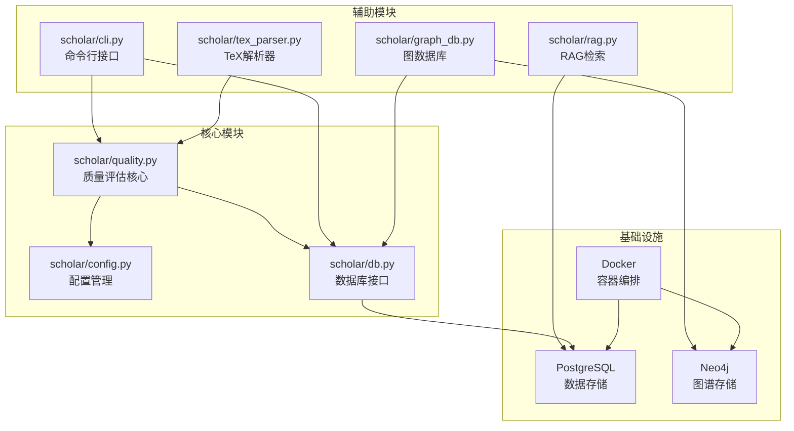

**图表来源**
- [quality.py:1-50](file://scholar/quality.py#L1-L50)
- [config.py:1-62](file://scholar/config.py#L1-L62)
- [db.py:1-50](file://scholar/db.py#L1-L50)

**章节来源**
- [README.md:300-326](file://README.md#L300-L326)
- [requirements.txt:1-9](file://requirements.txt#L1-L9)

## 核心组件

### 质量评估引擎

质量评估引擎是整个系统的中枢，负责执行 7 维度的论文质量评分。每个维度都有独立的评分函数，采用规则匹配和统计分析相结合的方法。

主要特性：
- **多维度评估**：涵盖元数据完整性、结构质量、引用密度、可重现性信号、问题定义清晰度、创新性信号、实验严谨性
- **标准化评分**：每个维度输出 0-10 分，总分归一化为百分比
- **等级映射**：A(≥85%)、B(≥70%)、C(≥55%)、D(≥40%)、F(<40%)

### 数据存储与管理

系统采用混合存储策略，结合文件系统和数据库两种模式：

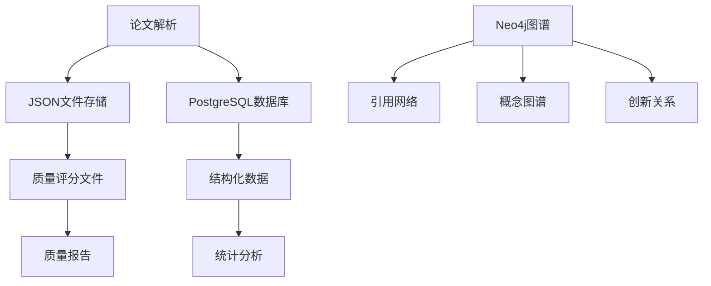

**图表来源**
- [quality.py:363-402](file://scholar/quality.py#L363-L402)
- [db.py:79-170](file://scholar/db.py#L79-L170)

**章节来源**
- [quality.py:306-356](file://scholar/quality.py#L306-L356)
- [config.py:23-37](file://scholar/config.py#L23-L37)

## 架构概览

质量评估体系采用分层架构设计，确保各组件职责明确、耦合度低：

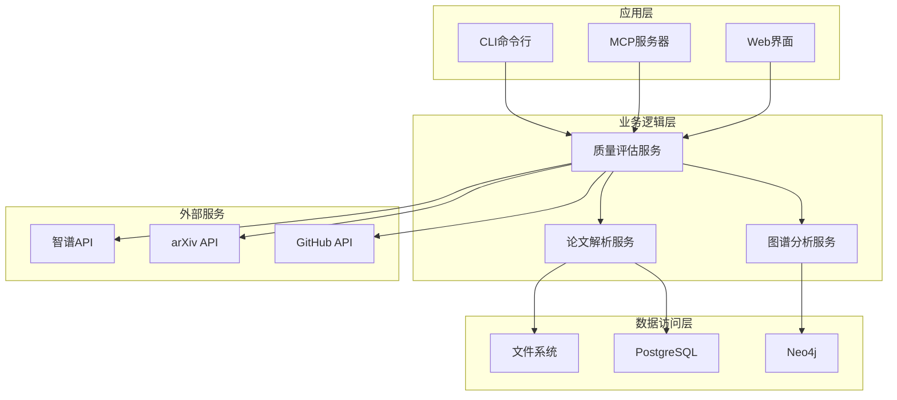

**图表来源**
- [cli.py:22-28](file://scholar/cli.py#L22-L28)
- [graph_db.py:32-69](file://scholar/graph_db.py#L32-L69)
- [rag.py:100-176](file://scholar/rag.py#L100-L176)

## 详细组件分析

### 质量评估算法实现

#### 元数据完整性评分
评估论文基本信息的完整性和准确性：

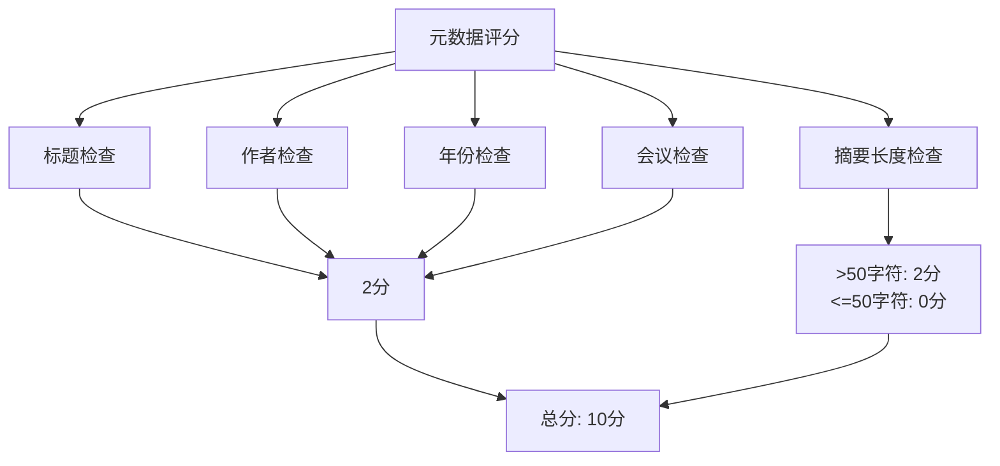

**图表来源**
- [quality.py:28-58](file://scholar/quality.py#L28-L58)

#### 结构质量评分
分析论文组织结构的合理性和完整性：

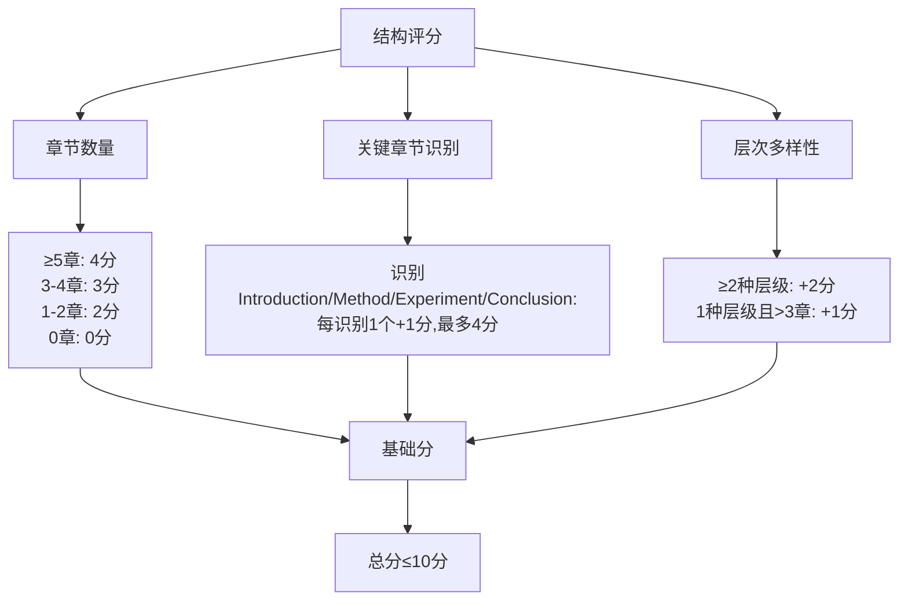

**图表来源**
- [quality.py:61-96](file://scholar/quality.py#L61-L96)

#### 引用密度评分
衡量论文引用的丰富程度和覆盖面：

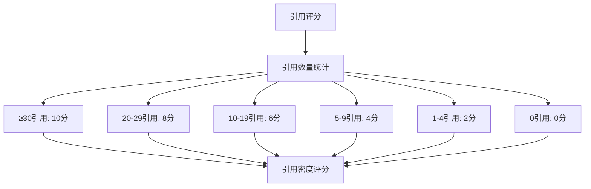

**图表来源**
- [quality.py:99-125](file://scholar/quality.py#L99-L125)

#### 可重现性信号评分
检测论文是否提供足够的可重现信息：

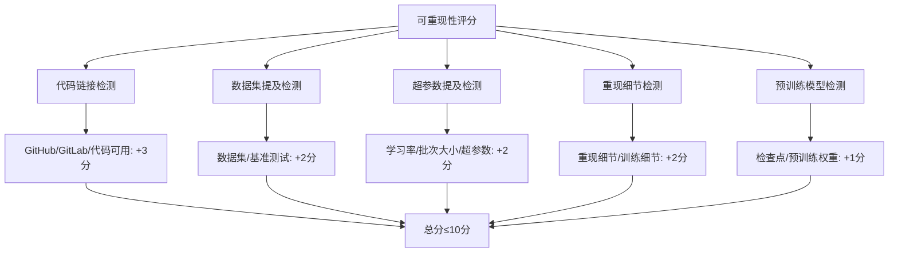

**图表来源**
- [quality.py:128-166](file://scholar/quality.py#L128-L166)

#### 问题定义清晰度评分
评估论文问题陈述的明确性和完整性：

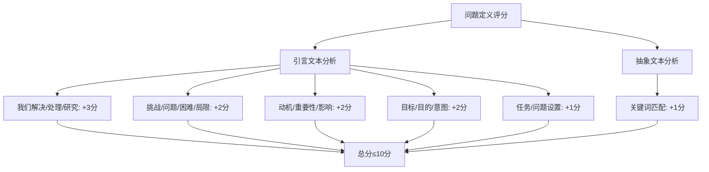

**图表来源**
- [quality.py:169-212](file://scholar/quality.py#L169-L212)

#### 创新性信号评分
识别论文的创新贡献和独特价值：

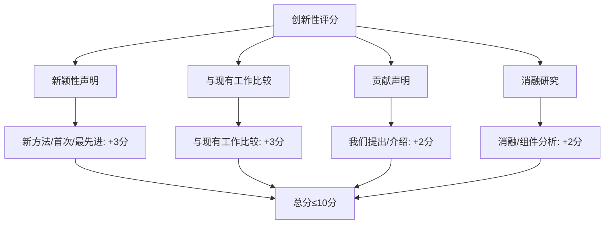

**图表来源**
- [quality.py:215-251](file://scholar/quality.py#L215-L251)

#### 实验严谨性评分
评估实验设计和结果呈现的科学性：

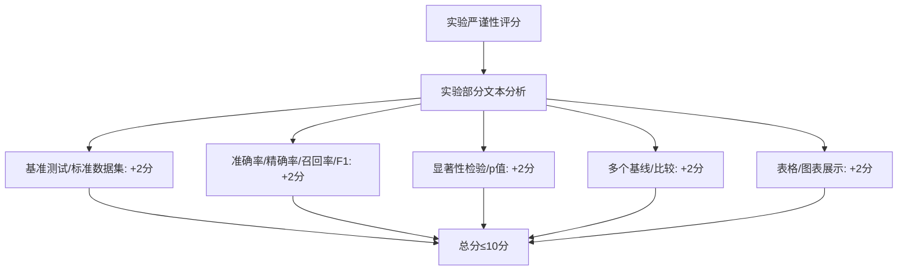

**图表来源**
- [quality.py:254-299](file://scholar/quality.py#L254-L299)

### 主要评分流程

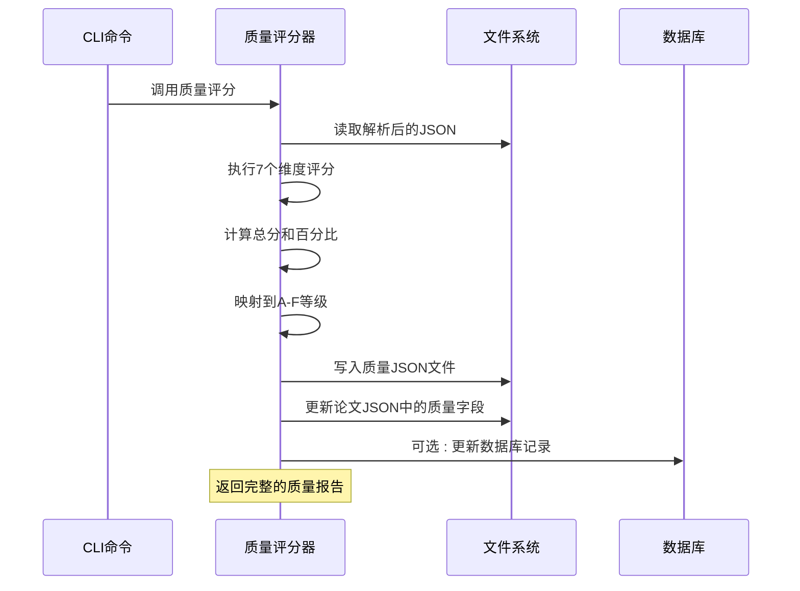

**图表来源**
- [quality.py:317-356](file://scholar/quality.py#L317-L356)
- [quality.py:363-402](file://scholar/quality.py#L363-L402)

**章节来源**
- [quality.py:306-432](file://scholar/quality.py#L306-L432)

### 批量处理机制

系统支持批量处理大量论文，提高处理效率：

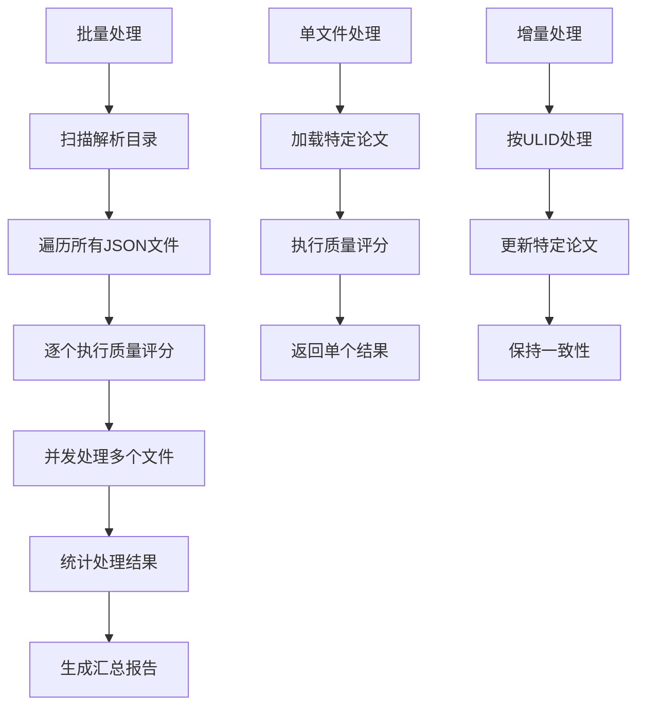

**图表来源**
- [quality.py:363-402](file://scholar/quality.py#L363-L402)
- [quality.py:405-432](file://scholar/quality.py#L405-L432)

**章节来源**
- [quality.py:363-432](file://scholar/quality.py#L363-L432)

## 依赖关系分析

质量评估体系的依赖关系相对简单，主要依赖于配置管理和数据库接口：

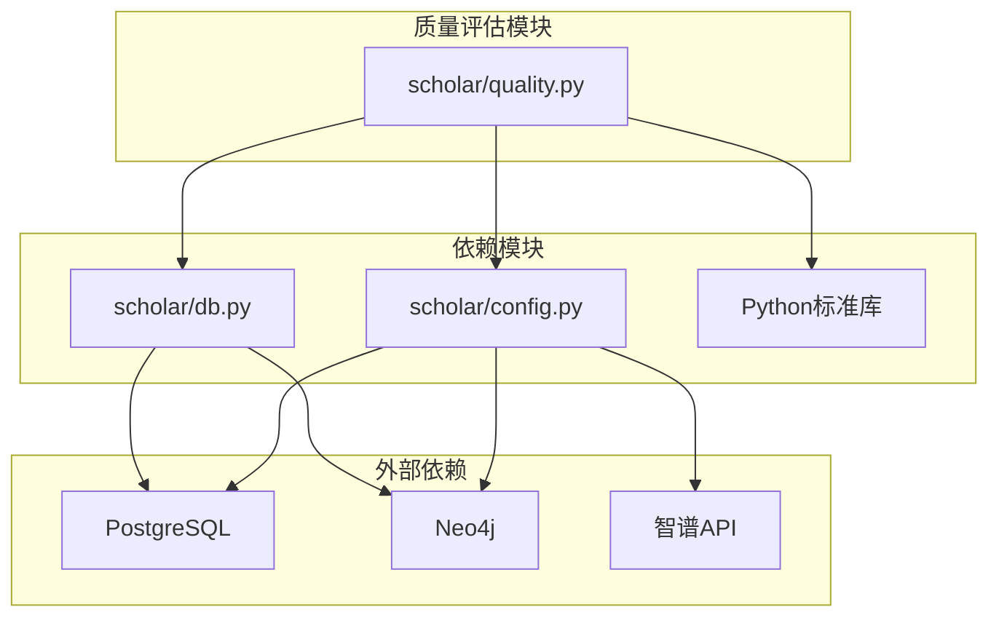

**图表来源**
- [quality.py:15-22](file://scholar/quality.py#L15-L22)
- [config.py:8-18](file://scholar/config.py#L8-L18)

**章节来源**
- [requirements.txt:1-9](file://requirements.txt#L1-L9)
- [config.py:39-62](file://scholar/config.py#L39-L62)

### 外部服务集成

系统集成了多个外部服务来增强质量评估能力：

| 服务类型 | 服务名称 | 用途 | 配置参数 |
|---------|----------|------|----------|
| 向量嵌入 | 智谱API | RAG语义搜索 | SCHOLAR_EMBEDDING_API_KEY |
| 数据库 | PostgreSQL | 结构化数据存储 | SCHOLAR_PG_HOST, SCHOLAR_PG_PORT |
| 图数据库 | Neo4j | 引用网络和概念图谱 | SCHOLAR_NEO4J_URI, SCHOLAR_NEO4J_PORT |
| 版本控制 | GitHub | 代码链接检测 | 自动识别 |

**章节来源**
- [config.py:39-62](file://scholar/config.py#L39-L62)
- [requirements.txt:4-8](file://requirements.txt#L4-L8)

## 性能考虑

### 处理效率优化

质量评估系统在设计时充分考虑了性能优化：

1. **内存管理**：采用流式处理方式，避免一次性加载大量数据
2. **并发处理**：支持多线程并行处理多个论文
3. **缓存机制**：利用数据库连接池减少连接开销
4. **批处理优化**：批量处理文件时采用分块策略

### 存储优化

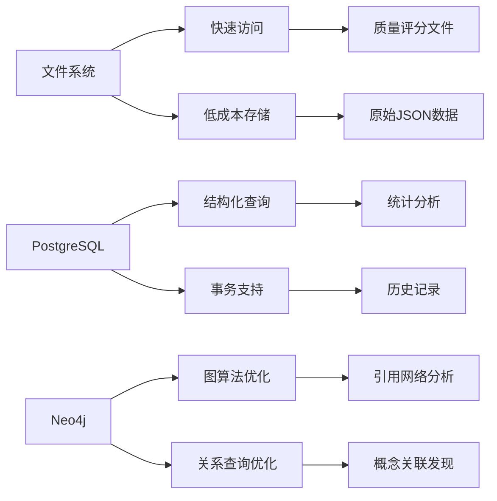

**图表来源**
- [db.py:24-74](file://scholar/db.py#L24-L74)
- [graph_db.py:32-69](file://scholar/graph_db.py#L32-L69)

### 扩展性设计

系统采用插件化设计，便于扩展新的评估维度：

- **维度扩展**：新增评估维度只需实现评分函数
- **算法替换**：支持替换现有的评分算法
- **数据源扩展**：可以接入新的数据源进行评估
- **输出格式扩展**：支持多种输出格式

## 故障排除指南

### 常见问题及解决方案

#### 质量评分异常

**问题**：某些论文评分为 0 或异常高
**原因**：论文解析不完整或缺少必要字段
**解决方案**：
1. 检查论文解析是否成功
2. 验证 JSON 文件格式正确性
3. 确认必要的字段存在

#### 性能问题

**问题**：批量处理速度慢
**原因**：磁盘 I/O 瓶颈或内存不足
**解决方案**：
1. 检查磁盘空间和权限
2. 增加系统内存
3. 调整批处理大小

#### 数据库连接问题

**问题**：无法连接到 PostgreSQL 或 Neo4j
**原因**：服务未启动或配置错误
**解决方案**：
1. 检查 Docker 容器状态
2. 验证端口映射配置
3. 确认凭据正确性

**章节来源**
- [README.md:429-480](file://README.md#L429-L480)

### 调试工具

系统提供了丰富的调试工具来帮助诊断问题：

1. **状态检查**：使用 `python -m scholar stats` 查看系统状态
2. **日志输出**：详细的处理进度和错误信息
3. **中间结果**：保存解析后的 JSON 文件用于调试
4. **性能监控**：跟踪处理时间和资源使用情况

## 结论

质量评估体系为 Scholar Studio 提供了强大的论文质量分析能力。通过 7 维度的综合评估，系统能够客观地量化论文质量，为学术研究提供可靠的数据支撑。

该体系的主要优势包括：
- **全面性**：覆盖论文质量的各个重要方面
- **可解释性**：每个维度都有明确的评分标准和理由
- **可扩展性**：支持新增评估维度和算法
- **实用性**：为论文推荐、排序和筛选提供实际价值

未来的发展方向包括：
- 集成机器学习模型提升评估准确性
- 支持自定义评估权重和阈值
- 扩展到更多学科领域的论文质量评估
- 提供更丰富的可视化和报告功能

## 附录

### 参数配置说明

| 参数名称 | 默认值 | 说明 |
|---------|--------|------|
| SCHOLAR_EMBEDDING_API_KEY | 空 | 智谱API密钥 |
| SCHOLAR_PG_HOST | localhost | PostgreSQL主机地址 |
| SCHOLAR_PG_PORT | 5433 | PostgreSQL端口号 |
| SCHOLAR_NEO4J_URI | bolt://localhost:7687 | Neo4j连接URI |
| SCHOLAR_EMBEDDING_MODEL | embedding-2 | 嵌入模型名称 |
| SCHOLAR_EMBEDDING_DIM | 1024 | 嵌入向量维度 |

### 评分阈值设置

| 等级 | 百分比范围 | 分数范围 |
|------|------------|----------|
| A | ≥85% | 8.5-10分 |
| B | ≥70% | 7-8.49分 |
| C | ≥55% | 5.5-6.99分 |
| D | ≥40% | 4-5.49分 |
| F | <40% | 0-3.99分 |

### 应用场景

1. **论文推荐系统**：基于质量评分推荐高质量论文
2. **学术搜索引擎**：在搜索结果中加入质量排序
3. **期刊审稿**：辅助编辑和审稿人筛选论文
4. **学术评价**：为学术机构的绩效评估提供数据
5. **学习路径规划**：根据质量选择合适的学习材料