# 最佳实践

<cite>
**本文引用的文件**
- [plugin/README.md](file://plugin/README.md)
- [plugin/skills/paper-ingestion/SKILL.md](file://plugin/skills/paper-ingestion/SKILL.md)
- [plugin/skills/kb-management/SKILL.md](file://plugin/skills/kb-management/SKILL.md)
- [plugin/skills/reproduce-paper/SKILL.md](file://plugin/skills/reproduce-paper/SKILL.md)
- [plugin/skills/writing-pipeline/SKILL.md](file://plugin/skills/writing-pipeline/SKILL.md)
- [plugin/skills/review-report/SKILL.md](file://plugin/skills/review-report/SKILL.md)
- [plugin/skills/cold-start/SKILL.md](file://plugin/skills/cold-start/SKILL.md)
- [plugin/skills/research-gap/SKILL.md](file://plugin/skills/research-gap/SKILL.md)
- [plugin/skills/paper-recommendation/SKILL.md](file://plugin/skills/paper-recommendation/SKILL.md)
- [plugin/skills/citation-network/SKILL.md](file://plugin/skills/citation-network/SKILL.md)
- [plugin/skills/math-verification/SKILL.md](file://plugin/skills/math-verification/SKILL.md)
- [plugin/skills/experiment-code/SKILL.md](file://plugin/skills/experiment-code/SKILL.md)
- [scholar/__main__.py](file://scholar/__main__.py)
- [scholar/cli.py](file://scholar/cli.py)
- [scholar/db.py](file://scholar/db.py)
- [scholar/config.py](file://scholar/config.py)
</cite>

## 目录
1. [简介](#简介)
2. [项目结构](#项目结构)
3. [核心组件](#核心组件)
4. [架构总览](#架构总览)
5. [详细组件分析](#详细组件分析)
6. [依赖分析](#依赖分析)
7. [性能考虑](#性能考虑)
8. [故障排查指南](#故障排查指南)
9. [结论](#结论)
10. [附录](#附录)

## 简介
本指南基于项目实践经验，总结学术研究方法论与系统使用最佳实践，涵盖文献调研、笔记管理、论文写作的标准流程；系统使用技巧包括高效利用14项研究技能、设计研究工作流与维护知识库；数据管理策略包括数据质量控制、元数据标准化与版本管理；团队协作规范包括多人协作工作流程与知识共享实践；专家级技巧包括高级搜索策略、复杂分析方法与自动化工作流设计；并提供性能优化与效率提升的实际案例。

## 项目结构
项目采用“插件 + 后端”的分层架构：
- 插件层（Plugin）：提供14项Skills、4项Commands、MCP工具与规则钩子，负责“告诉AI做什么、怎么做”
- 后端（scholar/）：Python CLI与服务，负责搜索、解析、检索、数据库与图谱集成
- 基础设施（infra/）：Docker Compose与初始化SQL，提供PostgreSQL与Neo4j
- 知识库（data/papers/ 与 output/）：论文源与解析产物、笔记、草稿、实验、PDF等

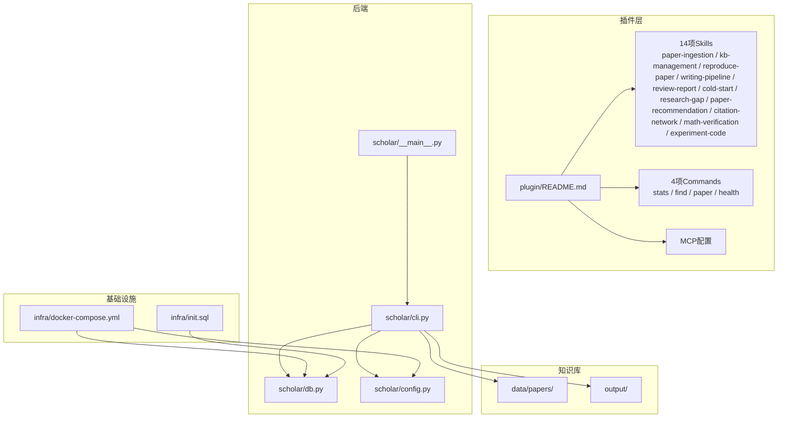

**图示来源**
- [plugin/README.md:1-79](file://plugin/README.md#L1-L79)
- [scholar/__main__.py:1-8](file://scholar/__main__.py#L1-L8)
- [scholar/cli.py:1-800](file://scholar/cli.py#L1-L800)
- [scholar/db.py:1-276](file://scholar/db.py#L1-L276)
- [scholar/config.py:1-116](file://scholar/config.py#L1-L116)

**章节来源**
- [plugin/README.md:1-79](file://plugin/README.md#L1-L79)
- [scholar/__main__.py:1-8](file://scholar/__main__.py#L1-L8)
- [scholar/cli.py:1-800](file://scholar/cli.py#L1-L800)
- [scholar/db.py:1-276](file://scholar/db.py#L1-L276)
- [scholar/config.py:1-116](file://scholar/config.py#L1-L116)

## 核心组件
- 插件能力矩阵：14项Skills（8项原子技能 + 6项工作流）、4项Commands、1项规则、2项Hooks、1个MCP服务
- 后端CLI：提供扫描、解析、查询、统计、arXiv搜索、图谱构建与查询、RAG索引、编译、导出BibTeX等命令
- 数据层：PostgreSQL（结构化存储）与文件系统（JSON解析产物）双轨回退
- 图谱层：Neo4j（引用网络 + 概念图谱 + 技术演化关系）
- 环境配置：通过.env注入数据库、图数据库、嵌入模型、LaTeX编译器等参数

**章节来源**
- [plugin/README.md:50-79](file://plugin/README.md#L50-L79)
- [scholar/cli.py:420-800](file://scholar/cli.py#L420-L800)
- [scholar/db.py:24-276](file://scholar/db.py#L24-L276)
- [scholar/config.py:20-116](file://scholar/config.py#L20-L116)

## 架构总览
系统以“插件驱动 + 后端执行 + 数据与图谱支撑”的方式运行，插件提供工作流与技能，后端提供数据处理与检索能力，数据库与图谱提供结构化与关系分析能力。

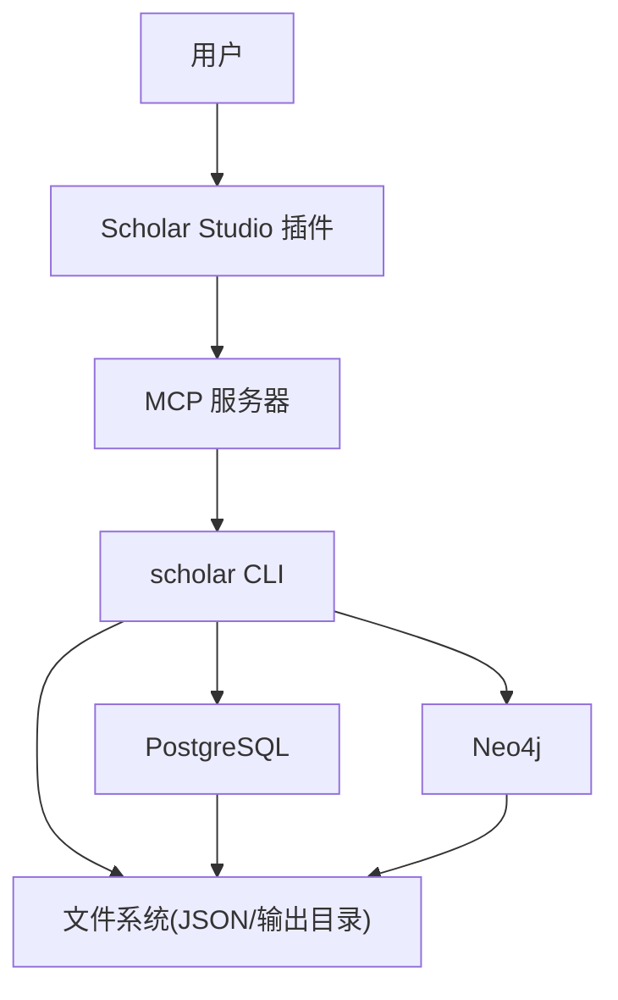

**图示来源**
- [plugin/README.md:5-17](file://plugin/README.md#L5-L17)
- [scholar/__main__.py:1-8](file://scholar/__main__.py#L1-L8)
- [scholar/cli.py:1-800](file://scholar/cli.py#L1-L800)
- [scholar/db.py:24-276](file://scholar/db.py#L24-L276)
- [scholar/config.py:41-64](file://scholar/config.py#L41-L64)

## 详细组件分析

### 文献入库与增量维护（paper-ingestion 与 kb-management）
- 入库流程：扫描 → 批量解析 → 失败诊断 → 元数据补全 → 预处理（笔记/质量/分类） → 统计校验 → 单篇验证
- 增量入库：新增论文目录后，执行扫描、单篇解析、统计更新
- 知识库维护：健康检查 → 自动更新（arXiv搜索/下载/入库）→ 元数据回填 → 引用解析与图谱同步 → RAG索引同步 → 维护报告

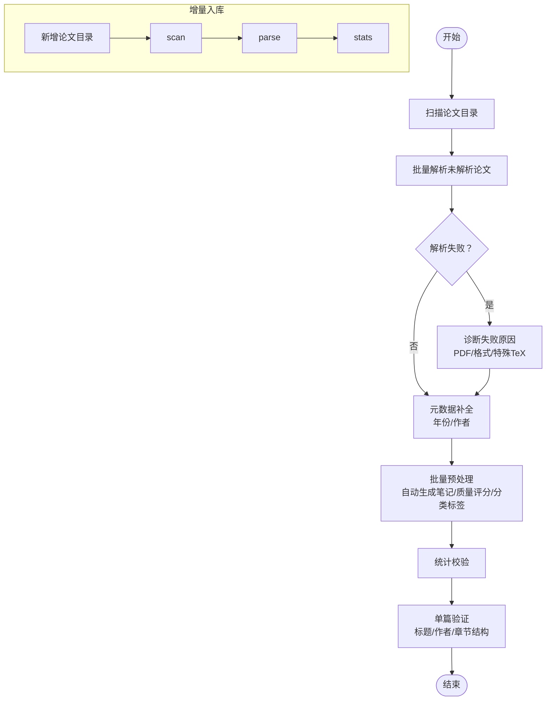

**图示来源**
- [plugin/skills/paper-ingestion/SKILL.md:9-85](file://plugin/skills/paper-ingestion/SKILL.md#L9-L85)
- [plugin/skills/kb-management/SKILL.md:9-54](file://plugin/skills/kb-management/SKILL.md#L9-L54)

**章节来源**
- [plugin/skills/paper-ingestion/SKILL.md:6-85](file://plugin/skills/paper-ingestion/SKILL.md#L6-L85)
- [plugin/skills/kb-management/SKILL.md:6-59](file://plugin/skills/kb-management/SKILL.md#L6-L59)

### 端到端学术写作（writing-pipeline）
- 主题调研：双路搜索（RAG + 关键词 + arXiv）→ 生成调研报告
- 阅读与笔记：优先Top论文的结构化笔记与质量评分
- 撰写：按标准结构撰写（摘要/引言/相关工作/方法/实验/结论）
- 编译：LaTeX自动修复与多次重试 → 输出PDF
- 自审：逻辑、引用、格式检查

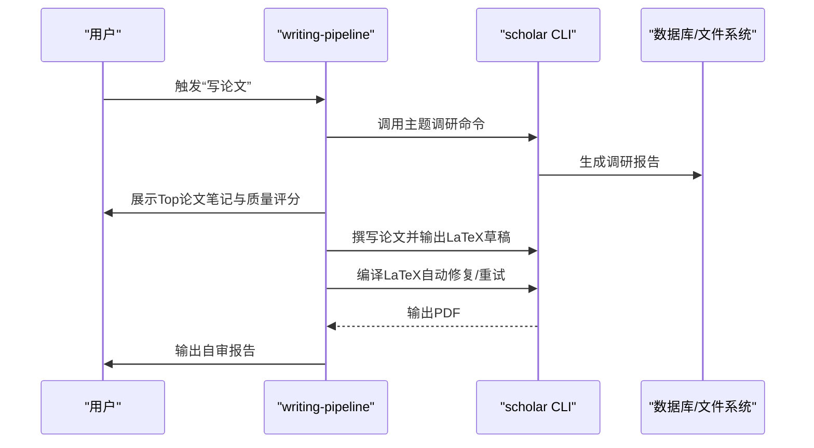

**图示来源**
- [plugin/skills/writing-pipeline/SKILL.md:9-61](file://plugin/skills/writing-pipeline/SKILL.md#L9-L61)
- [scholar/cli.py:420-800](file://scholar/cli.py#L420-L800)

**章节来源**
- [plugin/skills/writing-pipeline/SKILL.md:6-61](file://plugin/skills/writing-pipeline/SKILL.md#L6-L61)

### 同行评审（review-report）
- 定位与深度阅读：质量评分、笔记、完整JSON
- 评估维度：新颖性、重要性、完整性
- 方法论审查：假设、数学正确性、对比、消融
- 实验审查：数据集、指标、显著性、可复现性
- 写作质量审查：结构、图表、引用、语言
- 引用网络与Lean4对照：引用准确性、前置工作遗漏、形式化一致性
- 输出结构化评审报告

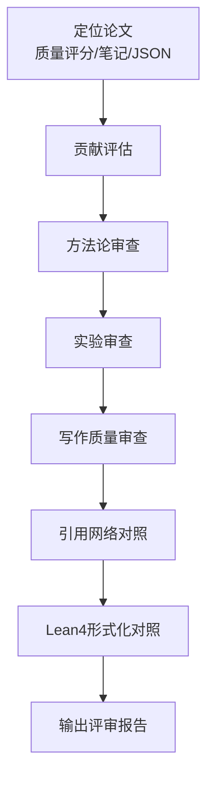

**图示来源**
- [plugin/skills/review-report/SKILL.md:9-116](file://plugin/skills/review-report/SKILL.md#L9-L116)

**章节来源**
- [plugin/skills/review-report/SKILL.md:6-116](file://plugin/skills/review-report/SKILL.md#L6-L116)

### 实验复现（reproduce-paper）
- 深度阅读：算法/实验设置/超参数/数据集
- 环境配置：自动检测requirements/environment.yml → 创建conda环境
- 代码生成：主训练脚本、模型定义、数据加载、评估脚本、配置文件
- 数据集下载：自动检测HuggingFace数据集
- 运行实验：quick/full模式 + 超时保护
- 结果对比：metrics对比与报告
- 失败调试：常见错误自动诊断与修复建议

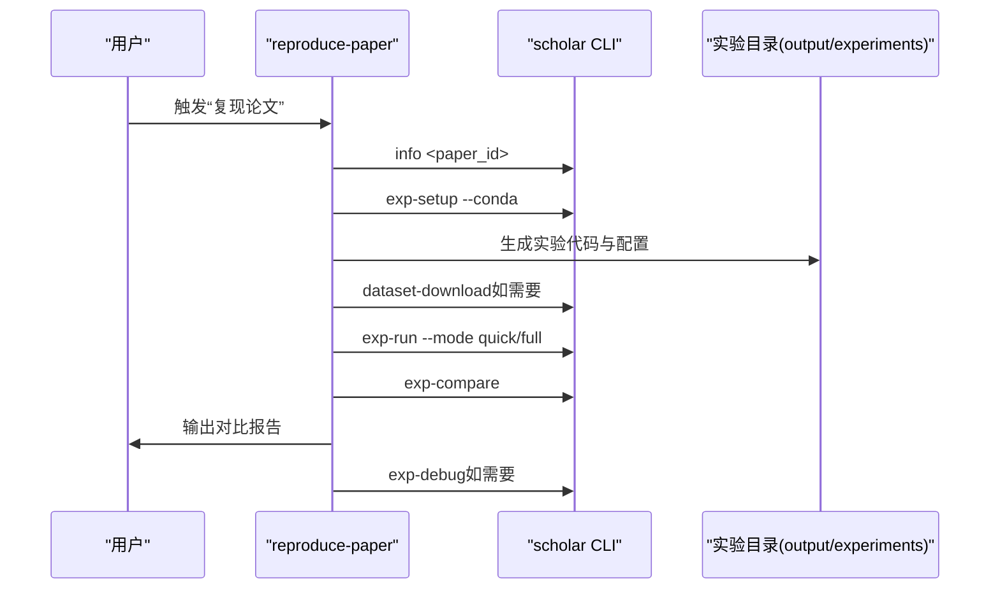

**图示来源**
- [plugin/skills/reproduce-paper/SKILL.md:9-69](file://plugin/skills/reproduce-paper/SKILL.md#L9-L69)
- [scholar/cli.py:420-800](file://scholar/cli.py#L420-L800)

**章节来源**
- [plugin/skills/reproduce-paper/SKILL.md:6-69](file://plugin/skills/reproduce-paper/SKILL.md#L6-L69)

### 冷启动与学习路径（cold-start）
- 评估本地库覆盖度与概念图谱覆盖率
- 本地库充足：基于被引最多论文建立基础认知
- 本地库不足：基于arXiv补充，优先综述/最新/开创性工作
- 构建知识地图：核心概念、依赖关系、分类层次、关键人物
- 时间线梳理：里程碑与阶段划分
- 必读论文精读：结合笔记与质量评分
- 与已有知识关联：通过搜索建立连接点
- 输出冷启动指南：概念、必读论文、时间线、学习路径

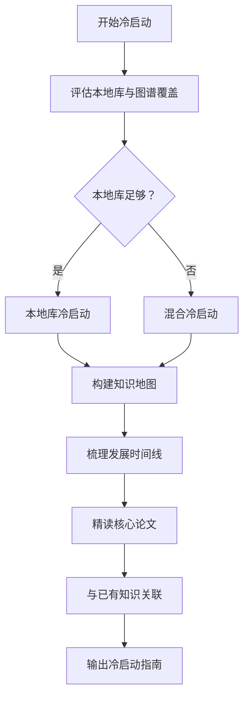

**图示来源**
- [plugin/skills/cold-start/SKILL.md:9-147](file://plugin/skills/cold-start/SKILL.md#L9-L147)

**章节来源**
- [plugin/skills/cold-start/SKILL.md:6-147](file://plugin/skills/cold-start/SKILL.md#L6-L147)

### 研究空白发现（research-gap）
- 确定分析范围：领域/子方向/论文/缺口类型
- 收集局限性声明：从JSON与笔记中提取“局限性/未来工作/未解决问题”
- 交叉分析：共识缺口、矛盾缺口、盲区缺口
- 引用网络辅助：概念共现、桥接论文、引用链断裂
- 概念演化分析：REPLACES边与技术替代模式
- arXiv最新动态验证：确认是否已被填补
- 输出缺口分析报告

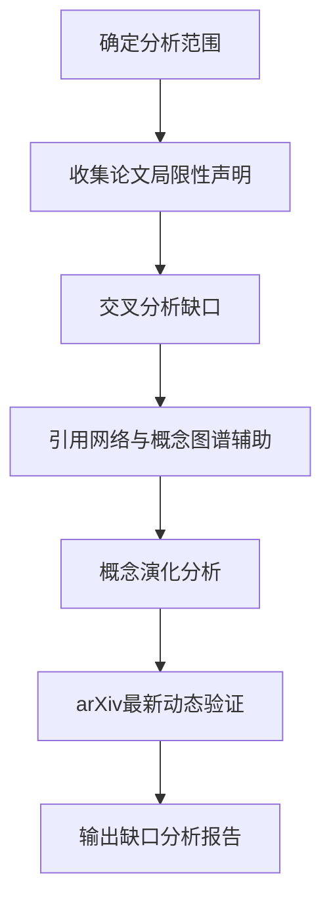

**图示来源**
- [plugin/skills/research-gap/SKILL.md:12-105](file://plugin/skills/research-gap/SKILL.md#L12-L105)

**章节来源**
- [plugin/skills/research-gap/SKILL.md:6-105](file://plugin/skills/research-gap/SKILL.md#L6-L105)

### 论文推荐（paper-recommendation）
- 理解推荐场景：基于论文/方向/阅读缺口
- 引用关系推荐：前向/后向引用、桥接论文
- 方向推荐：搜索 + RAG + 分类标签 + arXiv
- 阅读缺口推荐：识别缺失环节/未覆盖节点/空白年份
- 排序与说明：必读/推荐/可选 + 关联说明 + 难度评估
- 输出推荐列表

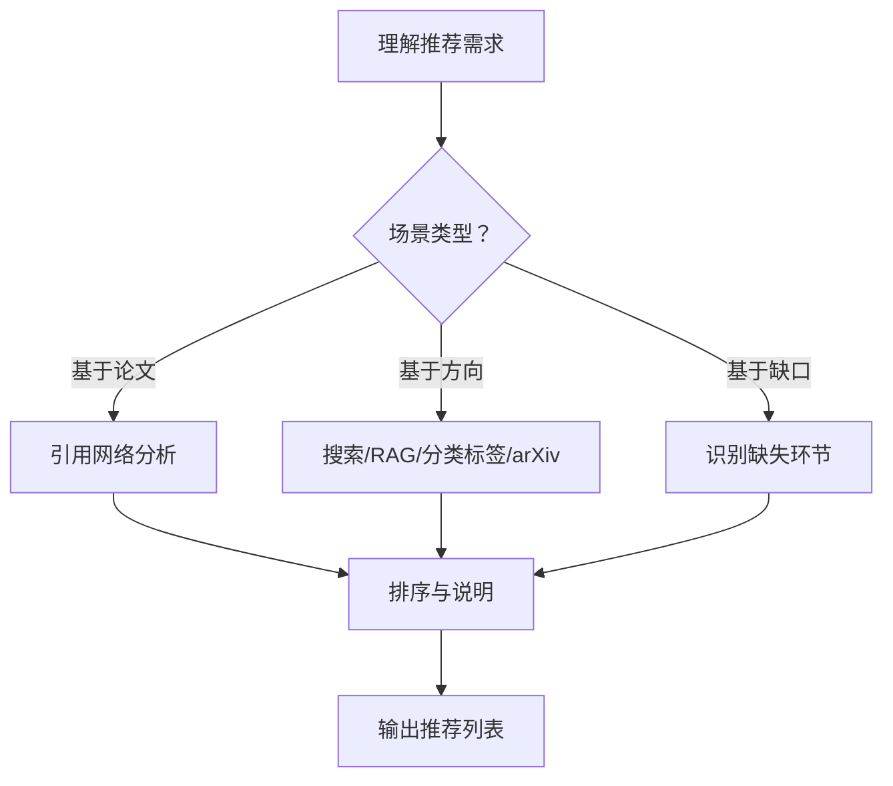

**图示来源**
- [plugin/skills/paper-recommendation/SKILL.md:9-96](file://plugin/skills/paper-recommendation/SKILL.md#L9-L96)

**章节来源**
- [plugin/skills/paper-recommendation/SKILL.md:6-96](file://plugin/skills/paper-recommendation/SKILL.md#L6-L96)

### 引用网络分析（citation-network）
- 全局统计：节点/边数、解析率、孤立节点、Top被引/桥接论文
- 单论文分析：后向/前向引用、引用深度
- 概念关联：共现概念、活跃年份
- 关键节点识别：高入度/高出度/桥接/最短路径
- 时间线构建：按年份梳理关键事件
- 输出网络分析报告

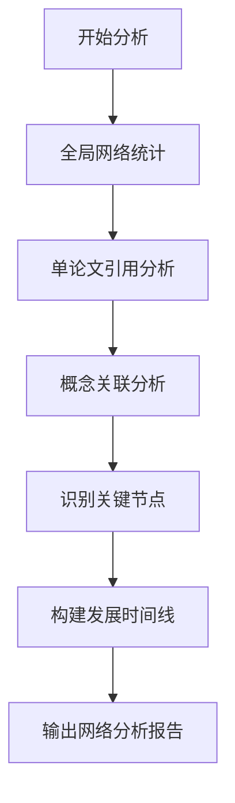

**图示来源**
- [plugin/skills/citation-network/SKILL.md:13-101](file://plugin/skills/citation-network/SKILL.md#L13-L101)

**章节来源**
- [plugin/skills/citation-network/SKILL.md:6-101](file://plugin/skills/citation-network/SKILL.md#L6-L101)

### 数学形式化验证（math-verification）
- 定位目标公式：论文JSON/命题/Lean4已有定义
- 提取上下文：公式LaTeX、所在章节、前后文说明
- 语义分析：符号含义、维度一致性、极限退化、特殊值代入
- 对照Lean4：概念节点/已有形式化
- 形式化尝试：类型定义、定理表述、简单策略证明
- 编译验证：Lake构建通过与否
- 生成验证报告

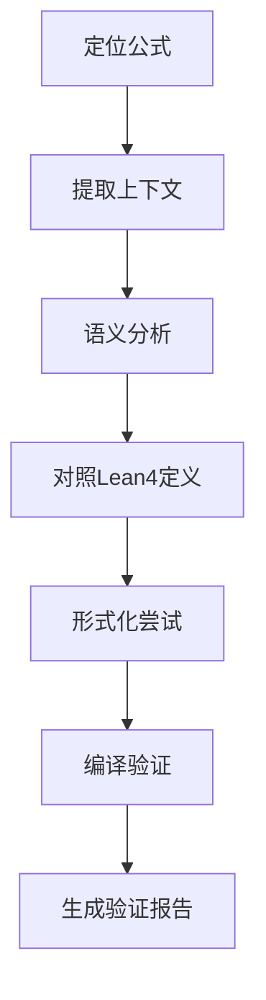

**图示来源**
- [plugin/skills/math-verification/SKILL.md:12-101](file://plugin/skills/math-verification/SKILL.md#L12-L101)

**章节来源**
- [plugin/skills/math-verification/SKILL.md:6-101](file://plugin/skills/math-verification/SKILL.md#L6-L101)

### 实验代码生成（experiment-code）
- 深度阅读：方法概述/公式/实验设置/模型架构
- 提取要素：输入/输出/核心循环/损失函数/优化目标
- 技术栈确认：框架/库/运行环境
- 生成代码结构：model/data/train/evaluate/config/requirements/README
- 逐步实现：按章节映射与公式注释
- 验证与说明：维度/公式一致性 + 运行说明 + 已知差异与问题

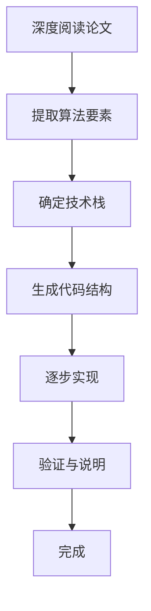

**图示来源**
- [plugin/skills/experiment-code/SKILL.md:9-111](file://plugin/skills/experiment-code/SKILL.md#L9-L111)

**章节来源**
- [plugin/skills/experiment-code/SKILL.md:6-111](file://plugin/skills/experiment-code/SKILL.md#L6-L111)

## 依赖分析
- 插件依赖后端CLI与数据库/图谱服务
- 后端依赖配置模块（环境变量）、数据库模块（PostgreSQL）、图谱模块（Neo4j）
- 基础设施通过Docker提供数据库与图数据库服务
- 输出目录统一由配置模块管理，确保生成物有序存放

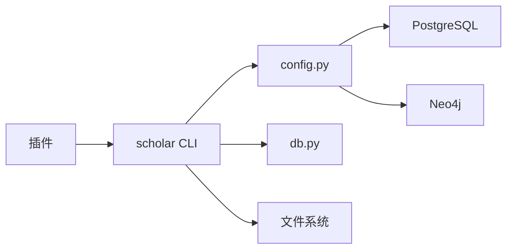

**图示来源**
- [plugin/README.md:5-17](file://plugin/README.md#L5-L17)
- [scholar/cli.py:19-30](file://scholar/cli.py#L19-L30)
- [scholar/db.py:24-276](file://scholar/db.py#L24-L276)
- [scholar/config.py:41-64](file://scholar/config.py#L41-L64)

**章节来源**
- [plugin/README.md:5-17](file://plugin/README.md#L5-L17)
- [scholar/cli.py:19-30](file://scholar/cli.py#L19-L30)
- [scholar/db.py:24-276](file://scholar/db.py#L24-L276)
- [scholar/config.py:41-64](file://scholar/config.py#L41-L64)

## 性能考虑
- 批量解析与统计：使用进度条与分页展示，避免表格溢出
- 数据库可用性：自动探测PostgreSQL连接，不可用时回退文件模式
- 图谱构建：分步执行（引用网络→引用解析→中心度→概念图谱→Lean4同步），便于监控与重试
- 编译与搜索：LaTeX编译最多重试3次；arXiv请求带重试与代理支持
- I/O与缓存：解析产物与笔记统一输出到固定目录，便于增量处理与版本管理

**章节来源**
- [scholar/cli.py:46-127](file://scholar/cli.py#L46-L127)
- [scholar/cli.py:175-237](file://scholar/cli.py#L175-L237)
- [scholar/db.py:32-44](file://scholar/db.py#L32-L44)
- [scholar/cli.py:660-706](file://scholar/cli.py#L660-L706)
- [scholar/config.py:69-116](file://scholar/config.py#L69-L116)

## 故障排查指南
- arXiv请求失败：检查代理与超时设置，确认重试次数
- 数据库不可用：确认PostgreSQL连接参数与服务状态，必要时回退文件模式
- Neo4j不可用：确认图数据库服务状态与URI/凭证
- 解析失败：针对缺少source、PDF格式、特殊TeX等情况进行诊断与手工处理
- 编译失败：启用自动修复选项并查看日志，逐步定位缺失包或未定义引用
- 环境问题：conda环境创建失败时，检查依赖文件与网络代理

**章节来源**
- [scholar/cli.py:605-658](file://scholar/cli.py#L605-L658)
- [scholar/db.py:32-44](file://scholar/db.py#L32-L44)
- [scholar/cli.py:660-706](file://scholar/cli.py#L660-L706)
- [plugin/skills/paper-ingestion/SKILL.md:27-36](file://plugin/skills/paper-ingestion/SKILL.md#L27-L36)
- [scholar/cli.py:418-477](file://scholar/cli.py#L418-L477)

## 结论
本项目通过“插件 + 后端 + 数据与图谱”的协同，提供了从文献入库、知识库维护、引用网络分析、冷启动学习、论文写作到实验复现与形式化验证的全链路研究工作流。遵循本文档的数据质量控制、元数据标准化、版本管理与团队协作规范，可显著提升学术研究效率与成果质量。

## 附录

### 学术研究方法论与标准流程
- 文献调研：双路搜索（RAG + 关键词 + arXiv）→ 调研报告 → 结构化笔记 → 质量评分
- 笔记管理：统一输出到notes目录，包含结构化摘要、质量评分、公式与引用标注
- 论文写作：调研 → 撰写 → 编译 → 自审 → 修改迭代

**章节来源**
- [plugin/skills/writing-pipeline/SKILL.md:11-55](file://plugin/skills/writing-pipeline/SKILL.md#L11-L55)

### 系统使用技巧与14项研究技能
- 原子技能（8项）：paper-ingestion、math-verification、paper-recommendation、citation-network、research-gap、review-report、cold-start、experiment-code
- 工作流（6项）：research-survey、paper-deep-dive、writing-pipeline、reproduce-paper、idea-to-paper、kb-management
- 使用建议：以技能为“原子动作”，组合形成工作流；每次操作后执行stats校验与单篇验证

**章节来源**
- [plugin/README.md:60-79](file://plugin/README.md#L60-L79)

### 研究工作流设计与知识库维护
- 设计原则：以“增量处理 + 预计算 + 统一输出”为核心
- 维护策略：定期健康检查、元数据回填、引用解析与图谱同步、RAG索引同步
- 版本管理：解析产物与笔记以ULID命名，配合Git跟踪变更

**章节来源**
- [plugin/skills/kb-management/SKILL.md:9-54](file://plugin/skills/kb-management/SKILL.md#L9-L54)
- [plugin/skills/paper-ingestion/SKILL.md:65-85](file://plugin/skills/paper-ingestion/SKILL.md#L65-L85)

### 数据管理策略
- 数据质量控制：解析失败诊断、元数据补全、质量评分、单篇验证
- 元数据标准化：统一字段（标题、作者、年份、摘要、会议/期刊、arXiv/DOI）
- 版本管理：以ULID为单位的解析产物与笔记，配合Git与输出目录结构

**章节来源**
- [plugin/skills/paper-ingestion/SKILL.md:27-64](file://plugin/skills/paper-ingestion/SKILL.md#L27-L64)
- [scholar/cli.py:526-600](file://scholar/cli.py#L526-L600)

### 团队协作规范
- 多人协作：以技能为边界，工作流为串联；通过commands/stats统一状态
- 知识共享：统一notes/drafts/bib输出，导出BibTeX供引用管理
- 风险控制：hooks拦截危险命令，rules定义Agent角色职责

**章节来源**
- [plugin/README.md:50-59](file://plugin/README.md#L50-L59)

### 专家级使用技巧
- 高级搜索：arXiv搜索 + RAG混合检索 + 关键词过滤
- 复杂分析：引用网络中心度计算、概念共现分析、REPLACES演化路径
- 自动化工作流：将CLI命令封装为插件工作流，实现端到端自动化

**章节来源**
- [scholar/cli.py:605-706](file://scholar/cli.py#L605-L706)
- [plugin/skills/citation-network/SKILL.md:15-63](file://plugin/skills/citation-network/SKILL.md#L15-L63)

### 性能优化与效率提升案例
- 批量解析：进度可视化与错误聚合，避免阻塞
- 编译修复：自动修复与重试机制，减少人工干预
- 图谱构建：分步执行与结果汇总，便于定位瓶颈
- 环境隔离：conda自动创建与依赖安装，降低环境差异

**章节来源**
- [scholar/cli.py:175-237](file://scholar/cli.py#L175-L237)
- [scholar/cli.py:418-477](file://scholar/cli.py#L418-L477)
- [plugin/skills/reproduce-paper/SKILL.md:42-62](file://plugin/skills/reproduce-paper/SKILL.md#L42-L62)