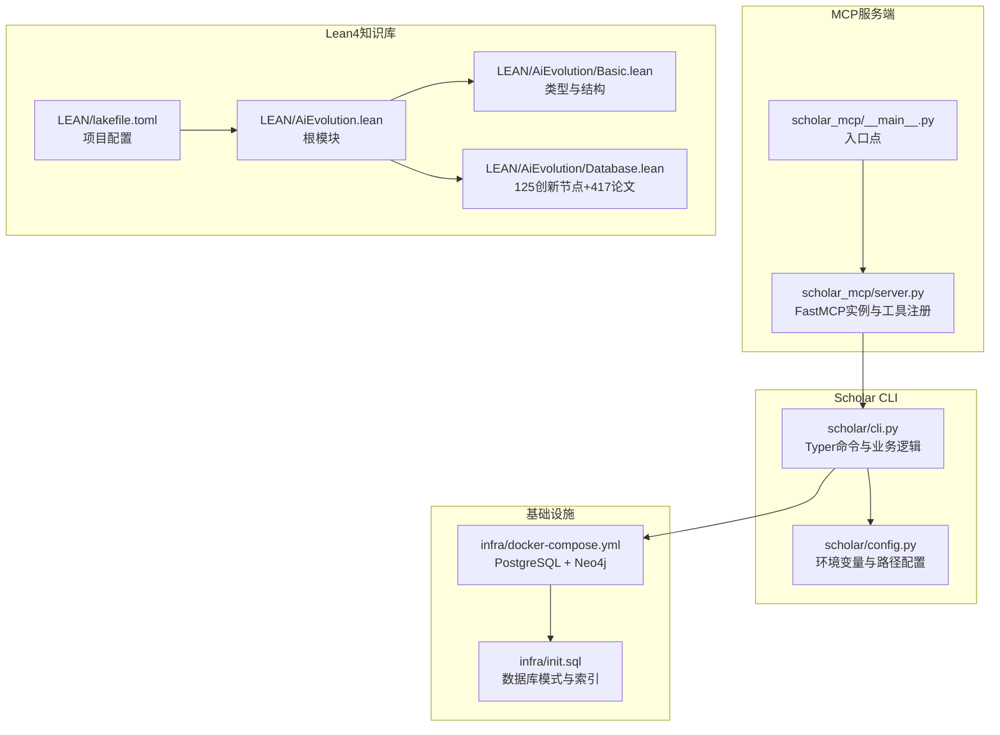
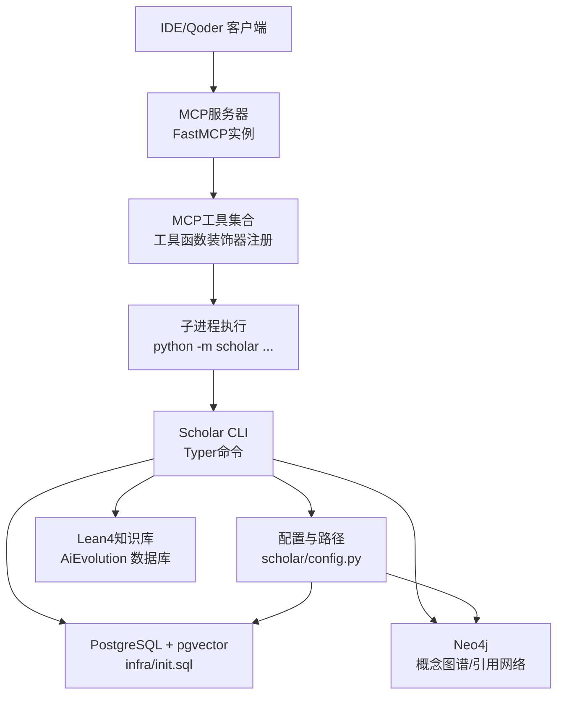
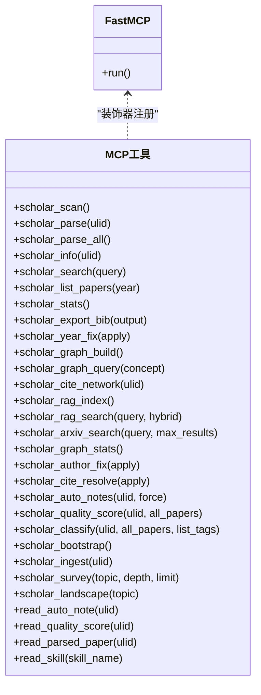
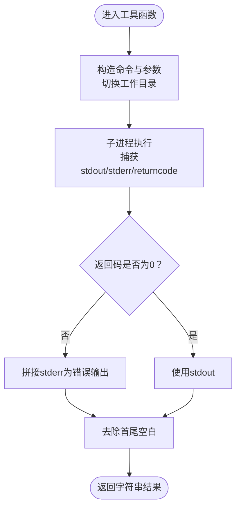
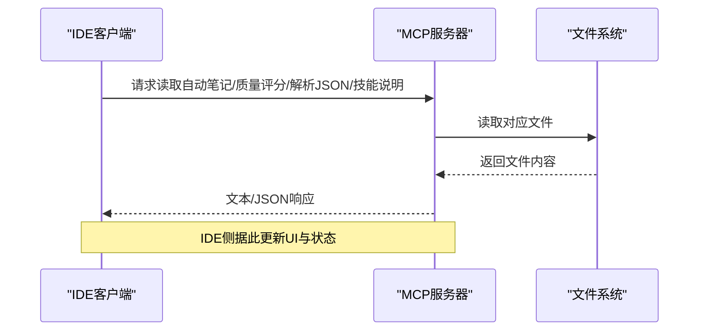
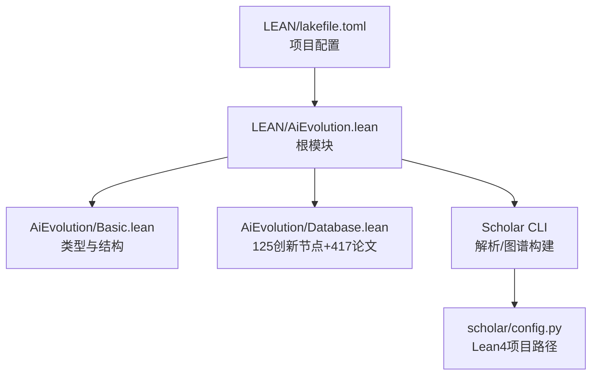
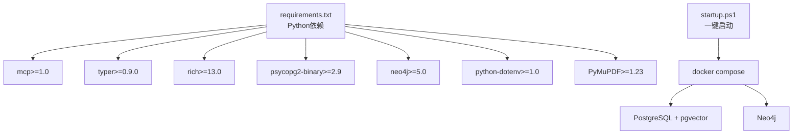

# MCP服务器

<cite>
**本文引用的文件**
- [scholar_mcp/__main__.py](file://scholar_mcp/__main__.py)
- [scholar_mcp/server.py](file://scholar_mcp/server.py)
- [requirements.txt](file://requirements.txt)
- [startup.ps1](file://startup.ps1)
- [infra/docker-compose.yml](file://infra/docker-compose.yml)
- [infra/init.sql](file://infra/init.sql)
- [scholar/cli.py](file://scholar/cli.py)
- [scholar/config.py](file://scholar/config.py)
- [LEAN/lakefile.toml](file://LEAN/lakefile.toml)
- [LEAN/AiEvolution.lean](file://LEAN/AiEvolution.lean)
- [LEAN/AiEvolution/Basic.lean](file://LEAN/AiEvolution/Basic.lean)
- [LEAN/AiEvolution/Database.lean](file://LEAN/AiEvolution/Database.lean)
</cite>

## 目录
1. [简介](#简介)
2. [项目结构](#项目结构)
3. [核心组件](#核心组件)
4. [架构总览](#架构总览)
5. [详细组件分析](#详细组件分析)
6. [依赖分析](#依赖分析)
7. [性能考虑](#性能考虑)
8. [故障排除指南](#故障排除指南)
9. [结论](#结论)
10. [附录](#附录)

## 简介
本文件为MCP（Model Context Protocol）服务器的技术文档，聚焦于“Scholar Studio”项目中的MCP服务端实现。该服务将学术研究工具链（Scholar CLI）以MCP工具的形式暴露给IDE（如Qoder），实现模型上下文中的可调用工具集。文档涵盖以下主题：
- MCP协议在本项目中的实现方式与消息交互
- 服务器启动、连接管理与会话处理
- MCP消息的序列化/反序列化与错误处理
- 客户端连接示例、消息收发与状态同步
- 安全认证、权限控制与速率限制配置思路
- 与Lean4系统的集成方式与数据交换格式
- 故障排除与性能优化建议

## 项目结构
该项目采用多模块分层组织：
- MCP服务端：scholar_mcp，封装Scholar CLI为MCP工具
- 学术研究CLI：scholar，提供解析、搜索、RAG、图谱构建等命令行功能
- 基础设施：Docker Compose编排PostgreSQL+pgvector与Neo4j
- 数据库初始化：SQL脚本定义知识库表结构
- Lean4形式化知识库：AiEvolution，提供AI演进图谱与创新节点数据

图表来源
- [scholar_mcp/server.py:1-387](file://scholar_mcp/server.py#L1-L387)
- [scholar_mcp/__main__.py:1-5](file://scholar_mcp/__main__.py#L1-L5)
- [scholar/cli.py:1-200](file://scholar/cli.py#L1-L200)
- [scholar/config.py:1-62](file://scholar/config.py#L1-L62)
- [infra/docker-compose.yml:1-44](file://infra/docker-compose.yml#L1-L44)
- [infra/init.sql:1-131](file://infra/init.sql#L1-L131)
- [LEAN/lakefile.toml:1-11](file://LEAN/lakefile.toml#L1-L11)
- [LEAN/AiEvolution.lean:1-7](file://LEAN/AiEvolution.lean#L1-L7)
- [LEAN/AiEvolution/Basic.lean:1-65](file://LEAN/AiEvolution/Basic.lean#L1-L65)
- [LEAN/AiEvolution/Database.lean:1-200](file://LEAN/AiEvolution/Database.lean#L1-L200)

章节来源
- [scholar_mcp/server.py:1-387](file://scholar_mcp/server.py#L1-L387)
- [scholar_mcp/__main__.py:1-5](file://scholar_mcp/__main__.py#L1-L5)
- [scholar/cli.py:1-200](file://scholar/cli.py#L1-L200)
- [scholar/config.py:1-62](file://scholar/config.py#L1-L62)
- [infra/docker-compose.yml:1-44](file://infra/docker-compose.yml#L1-L44)
- [infra/init.sql:1-131](file://infra/init.sql#L1-L131)
- [LEAN/lakefile.toml:1-11](file://LEAN/lakefile.toml#L1-L11)
- [LEAN/AiEvolution.lean:1-7](file://LEAN/AiEvolution.lean#L1-L7)
- [LEAN/AiEvolution/Basic.lean:1-65](file://LEAN/AiEvolution/Basic.lean#L1-L65)
- [LEAN/AiEvolution/Database.lean:1-200](file://LEAN/AiEvolution/Database.lean#L1-L200)

## 核心组件
- FastMCP实例与工具注册
  - 使用FastMCP创建MCP服务器实例，并通过装饰器注册一系列工具函数，覆盖论文解析、搜索、图谱分析、RAG检索、元数据补全、批量预处理、编排流水线等能力。
  - 工具函数统一通过子进程调用Scholar CLI，实现MCP接口与实际业务逻辑解耦。

- 子进程执行与超时控制
  - 所有工具均通过子进程运行Scholar命令，支持超时参数，避免长时间阻塞影响MCP会话稳定性。

- 文件读取工具
  - 提供直接读取已生成的解析JSON、质量评分JSON、自动笔记Markdown等文件的能力，便于IDE侧展示与编辑。

- 入口点
  - 通过包级入口调用MCP.run()启动服务。

章节来源
- [scholar_mcp/server.py:17-387](file://scholar_mcp/server.py#L17-L387)
- [scholar_mcp/__main__.py:1-5](file://scholar_mcp/__main__.py#L1-L5)

## 架构总览
下图展示了MCP服务器与Scholar CLI、数据库与图数据库之间的交互关系，以及Lean4知识库作为外部数据源的集成位置。

图表来源
- [scholar_mcp/server.py:17-387](file://scholar_mcp/server.py#L17-L387)
- [scholar/cli.py:1-200](file://scholar/cli.py#L1-L200)
- [scholar/config.py:1-62](file://scholar/config.py#L1-L62)
- [infra/init.sql:1-131](file://infra/init.sql#L1-L131)
- [LEAN/AiEvolution/Database.lean:1-200](file://LEAN/AiEvolution/Database.lean#L1-L200)

## 详细组件分析

### MCP服务器与工具注册
- 实例化与描述
  - 创建FastMCP实例，设置服务器名称与指令说明，用于向客户端描述能力边界。
- 工具注册
  - 使用装饰器注册多个工具函数，覆盖论文库操作、图谱与网络分析、RAG检索、外部arXiv搜索、元数据补全、批量预处理、编排流水线与文件读取等。
- 子进程封装
  - 统一通过_run_scholar封装子进程调用，传入超时参数，捕获标准输出与错误输出，拼接错误信息返回。

图表来源
- [scholar_mcp/server.py:17-387](file://scholar_mcp/server.py#L17-L387)

章节来源
- [scholar_mcp/server.py:17-387](file://scholar_mcp/server.py#L17-L387)

### 子进程执行与错误处理流程
- 调用流程
  - 工具函数通过_run_scholar构造命令，切换到项目根目录，执行Scholar命令，捕获stdout/stderr与返回码。
  - 若非零返回码且存在stderr，则将错误信息拼接到输出中返回。
- 超时控制
  - 多数工具提供timeout参数，默认120秒；部分耗时任务（如批量解析、RAG索引、图谱构建）使用更高超时值，避免被提前中断。

图表来源
- [scholar_mcp/server.py:23-36](file://scholar_mcp/server.py#L23-L36)

章节来源
- [scholar_mcp/server.py:23-36](file://scholar_mcp/server.py#L23-L36)

### 文件读取工具与状态同步
- 自动笔记与质量评分读取
  - 通过读取输出目录下的Markdown与JSON文件，实现IDE侧对生成内容的查看与编辑。
- 解析JSON读取
  - 读取已解析的论文JSON，供IDE侧进行结构化展示。
- 技能说明读取
  - 读取技能目录下的说明文档，辅助用户按步骤执行工作流。

图表来源
- [scholar_mcp/server.py:328-378](file://scholar_mcp/server.py#L328-L378)

章节来源
- [scholar_mcp/server.py:328-378](file://scholar_mcp/server.py#L328-L378)

### 与Lean4系统的集成
- Lean4项目配置
  - 通过lakefile.toml声明项目与可执行目标，确保Lean4工具链可用。
- 形式化知识库
  - AiEvolution模块提供研究线、创新节点、论文记录与替换关系等结构，作为外部权威数据源。
- 集成方式
  - Scholar CLI在解析与图谱构建阶段可与Lean4数据库进行同步或对齐，确保形式化验证与知识库一致性。

图表来源
- [LEAN/lakefile.toml:1-11](file://LEAN/lakefile.toml#L1-L11)
- [LEAN/AiEvolution.lean:1-7](file://LEAN/AiEvolution.lean#L1-L7)
- [LEAN/AiEvolution/Basic.lean:1-65](file://LEAN/AiEvolution/Basic.lean#L1-L65)
- [LEAN/AiEvolution/Database.lean:1-200](file://LEAN/AiEvolution/Database.lean#L1-L200)
- [scholar/config.py:60-62](file://scholar/config.py#L60-L62)

章节来源
- [LEAN/lakefile.toml:1-11](file://LEAN/lakefile.toml#L1-L11)
- [LEAN/AiEvolution.lean:1-7](file://LEAN/AiEvolution.lean#L1-L7)
- [LEAN/AiEvolution/Basic.lean:1-65](file://LEAN/AiEvolution/Basic.lean#L1-L65)
- [LEAN/AiEvolution/Database.lean:1-200](file://LEAN/AiEvolution/Database.lean#L1-L200)
- [scholar/config.py:60-62](file://scholar/config.py#L60-L62)

## 依赖分析
- 运行时依赖
  - mcp>=1.0：提供FastMCP服务器框架
  - typer>=0.9.0、rich>=13.0：命令行与终端渲染
  - psycopg2-binary>=2.9、neo4j>=5.0：PostgreSQL与Neo4j驱动
  - python-dotenv>=1.0：.env加载
  - PyMuPDF>=1.23：PDF处理
- 启动脚本依赖
  - Docker Compose：编排数据库与图数据库容器
  - 健康检查：等待PostgreSQL与Neo4j就绪

图表来源
- [requirements.txt:1-9](file://requirements.txt#L1-L9)
- [startup.ps1:1-65](file://startup.ps1#L1-L65)
- [infra/docker-compose.yml:1-44](file://infra/docker-compose.yml#L1-L44)

章节来源
- [requirements.txt:1-9](file://requirements.txt#L1-L9)
- [startup.ps1:1-65](file://startup.ps1#L1-L65)
- [infra/docker-compose.yml:1-44](file://infra/docker-compose.yml#L1-L44)

## 性能考虑
- 子进程超时与并发
  - 对高耗时任务设置合理超时，避免阻塞MCP会话；若需要并发，可在上层客户端或调度层进行并发控制。
- 数据库与图数据库
  - PostgreSQL与Neo4j均提供健康检查与索引，确保查询性能；建议在高频查询场景下增加索引与缓存策略。
- RAG与嵌入
  - 嵌入维度与API密钥需正确配置；批量索引与混合检索可能带来较高资源消耗，建议在离峰时段执行。
- 文件读写
  - 自动笔记与解析JSON读取为本地文件IO，注意磁盘IO瓶颈与文件锁问题。

## 故障排除指南
- 服务未就绪
  - 使用一键启动脚本等待数据库与图数据库健康检查通过；若超时，检查容器日志与端口占用。
- 子进程失败
  - 查看工具函数返回的错误信息，确认Scholar CLI命令参数与工作目录；必要时提高超时时间。
- 数据库连接失败
  - 检查PostgreSQL连接参数与密码；确认init.sql已成功执行并创建所需表与索引。
- 图数据库连接失败
  - 检查Neo4j认证与插件配置；确认容器端口映射与防火墙规则。
- Lean4集成异常
  - 确认Lake项目构建完成；核对Lean4项目路径与模块导入。

章节来源
- [startup.ps1:17-44](file://startup.ps1#L17-L44)
- [scholar_mcp/server.py:23-36](file://scholar_mcp/server.py#L23-L36)
- [infra/init.sql:1-131](file://infra/init.sql#L1-L131)
- [scholar/config.py:39-62](file://scholar/config.py#L39-L62)

## 结论
本MCP服务器通过FastMCP将Scholar CLI能力以工具形式暴露给IDE，结合PostgreSQL、Neo4j与Lean4知识库，形成从数据采集、解析、检索到形式化验证的完整研究工作流。通过合理的超时控制、文件读取工具与基础设施编排，实现了稳定、可扩展的MCP服务。后续可在认证、权限与速率限制方面进一步完善，以适配更复杂的生产环境需求。

## 附录

### MCP消息格式与通信机制
- 协议实现
  - 使用FastMCP作为MCP服务器框架，负责握手、工具发现、请求路由与响应返回。
- 消息序列化/反序列化
  - 工具函数返回字符串或JSON文本；客户端负责解析与展示。
- 错误处理
  - 子进程返回非零码时，将stderr拼接到输出中返回，便于客户端识别与提示。

章节来源
- [scholar_mcp/server.py:17-387](file://scholar_mcp/server.py#L17-L387)

### 安全认证、权限控制与速率限制
- 认证与权限
  - 当前实现未内置认证与权限控制；建议在MCP服务器前部署反向代理或网关，添加访问令牌、IP白名单与角色授权。
- 速率限制
  - 可在反向代理层或应用层引入限流策略，针对不同工具设置QPS阈值，防止滥用与资源耗尽。

### 客户端连接示例与状态同步
- 连接与会话
  - 客户端通过MCP协议与服务器建立会话，请求工具列表后调用具体工具。
- 状态同步
  - 工具返回文本/JSON后，客户端根据内容更新界面状态；文件读取工具可用于实时展示生成内容。

### 与Lean4系统的数据交换
- 数据来源
  - AiEvolution模块提供标准化的数据结构，Scholar CLI在解析与图谱构建过程中与其保持一致。
- 交换格式
  - 主要为JSON与Cypher查询结果；通过Scholar CLI桥接至Lean4数据库。