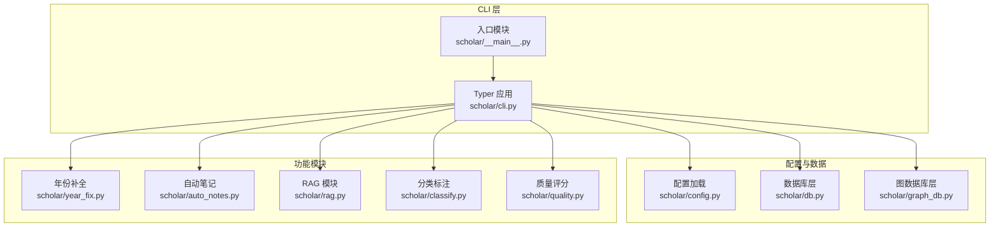
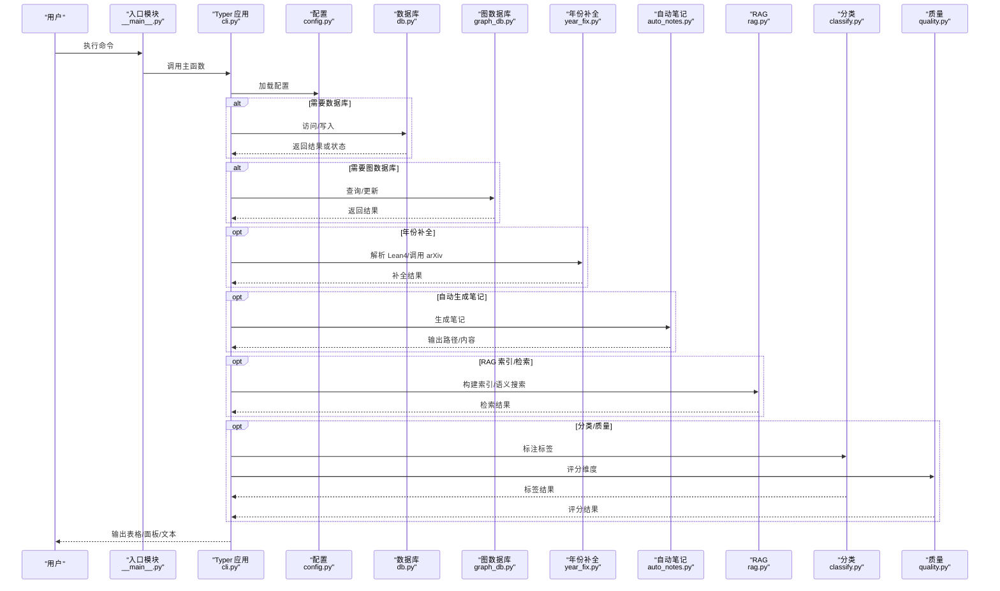
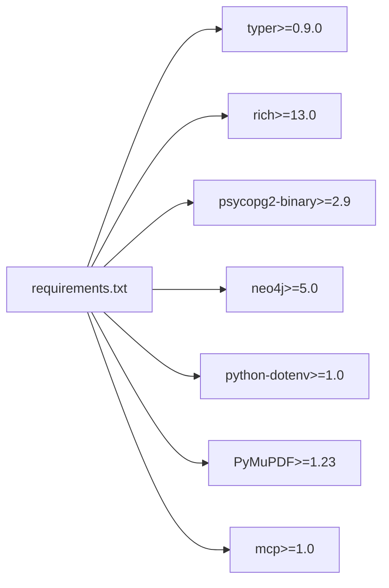

# 命令行接口

<cite>
**本文档引用的文件**
- [cli.py](file://scholar/cli.py)
- [__main__.py](file://scholar/__main__.py)
- [config.py](file://scholar/config.py)
- [db.py](file://scholar/db.py)
- [graph_db.py](file://scholar/graph_db.py)
- [year_fix.py](file://scholar/year_fix.py)
- [auto_notes.py](file://scholar/auto_notes.py)
- [rag.py](file://scholar/rag.py)
- [classify.py](file://scholar/classify.py)
- [quality.py](file://scholar/quality.py)
- [requirements.txt](file://requirements.txt)
</cite>

## 目录
1. [简介](#简介)
2. [项目结构](#项目结构)
3. [核心组件](#核心组件)
4. [架构总览](#架构总览)
5. [详细组件分析](#详细组件分析)
6. [依赖关系分析](#依赖关系分析)
7. [性能考虑](#性能考虑)
8. [故障排除指南](#故障排除指南)
9. [结论](#结论)
10. [附录](#附录)

## 简介
本文件面向命令行接口（CLI）的使用者与维护者，系统性地介绍基于 Typer 的命令定义、参数配置与选项设置。文档覆盖以下命令族：
- 文本解析与信息展示：scan、parse、parse-all、info、stats
- 全文检索：search、list-papers
- 导出与补全：export-bib、author-fix、year-fix
- arXiv 集成：arxiv-search
- 图谱构建与统计：graph-build、graph-stats、graph-query、cite-network
- RAG 索引与检索：rag-index、rag-search
- 自动笔记生成：auto-notes
- 质量评分：quality-score
- 分类标注：classify
- 引用解析：cite-resolve
- 初始化流水线：bootstrap、ingest
- 综合调研：survey、landscape

文档同时解释各命令的参数类型、默认值、验证规则、错误处理与调试建议，并提供丰富的使用示例与最佳实践。

## 项目结构
Scholar Studio 的 CLI 通过 Typer 定义命令入口，配合数据库层、图数据库层、RAG 模块与各类处理脚本完成端到端的学术研究工具链。

图表来源
- [cli.py](file://scholar/cli.py)
- [__main__.py](file://scholar/__main__.py)
- [config.py](file://scholar/config.py)
- [db.py](file://scholar/db.py)
- [graph_db.py](file://scholar/graph_db.py)
- [year_fix.py](file://scholar/year_fix.py)
- [auto_notes.py](file://scholar/auto_notes.py)
- [rag.py](file://scholar/rag.py)
- [classify.py](file://scholar/classify.py)
- [quality.py](file://scholar/quality.py)

章节来源
- [cli.py](file://scholar/cli.py)
- [__main__.py](file://scholar/__main__.py)
- [config.py](file://scholar/config.py)

## 核心组件
- Typer 应用与命令注册：在 CLI 文件中集中定义所有命令，统一帮助信息与参数校验。
- 数据目录与环境变量：通过配置模块加载项目根路径、数据目录与外部服务凭据。
- 数据库层：封装 PostgreSQL 存储，支持文件回退模式；提供论文、章节、公式、引用的增删改查。
- 图数据库层：封装 Neo4j 连接与查询，提供引用网络、概念图谱与创新同步能力。
- 功能模块：年份补全、自动笔记、RAG 向量化检索、分类标注、质量评分等独立模块。

章节来源
- [cli.py](file://scholar/cli.py)
- [config.py](file://scholar/config.py)
- [db.py](file://scholar/db.py)
- [graph_db.py](file://scholar/graph_db.py)

## 架构总览
下图展示了 CLI 命令与内部模块之间的交互关系，以及数据流向。

图表来源
- [cli.py](file://scholar/cli.py)
- [__main__.py](file://scholar/__main__.py)
- [config.py](file://scholar/config.py)
- [db.py](file://scholar/db.py)
- [graph_db.py](file://scholar/graph_db.py)
- [year_fix.py](file://scholar/year_fix.py)
- [auto_notes.py](file://scholar/auto_notes.py)
- [rag.py](file://scholar/rag.py)
- [classify.py](file://scholar/classify.py)
- [quality.py](file://scholar/quality.py)

## 详细组件分析

### 基础命令族
- scan：扫描论文目录，显示解析状态与汇总统计。
- parse：解析单篇论文，输出结构化 JSON 并可选入库。
- parse-all：批量解析，支持限制数量与强制重解析。
- info：展示已解析论文的元信息、摘要、章节、公式与引用概览。
- stats：统计知识库规模、公式/引用/章节总量与元数据覆盖率。
- list-papers：列出已解析论文，支持按年份过滤与结果上限。

章节来源
- [cli.py](file://scholar/cli.py)

### 检索与导出
- search：全文检索（标题、摘要、章节），优先使用数据库，回退到文件扫描。
- export-bib：从已解析论文生成 BibTeX 文件，默认输出至 output/bib/references.bib。
- arxiv-search：调用 arXiv API 搜索，返回标题、作者、年份与 arXiv ID。

章节来源
- [cli.py](file://scholar/cli.py)

### 元数据补全
- author-fix：使用 arXiv API 填充缺失作者，支持 --apply 应用更改。
- year-fix：先尝试 Lean4 数据库匹配，再回退到 arXiv API，支持 --apply 应用更改。

章节来源
- [cli.py](file://scholar/cli.py)
- [year_fix.py](file://scholar/year_fix.py)

### 图谱构建与统计
- graph-build：构建引用网络、解析 ref_key、计算中心性、构建概念图谱、同步 Lean4 替换关系。
- graph-stats：统计节点/边数量、解析/未解析引用、孤立节点、Top 引用与桥接论文。
- graph-query：按概念 ID 查询相关论文与相关概念。
- cite-network：查看引用网络全局统计或指定论文的前向/后向引用。

章节来源
- [cli.py](file://scholar/cli.py)
- [graph_db.py](file://scholar/graph_db.py)

### RAG 索引与检索
- rag-index：基于配置的嵌入模型与 API Key 构建向量索引，支持智谱/OpenAI。
- rag-search：语义检索，支持 --hybrid 使用向量+BM25+RRF 融合。

章节来源
- [cli.py](file://scholar/cli.py)
- [rag.py](file://scholar/rag.py)

### 自动笔记与质量评分
- auto-notes：生成结构化阅读笔记，支持单篇或批量，支持 --force 覆盖。
- quality-score：对单篇或全部论文进行七维质量评分，输出等级与维度明细。

章节来源
- [cli.py](file://scholar/cli.py)
- [auto_notes.py](file://scholar/auto_notes.py)
- [quality.py](file://scholar/quality.py)

### 分类标注
- classify：对单篇或全部论文进行多级标签标注，支持 --list-tags 查看标签分布。

章节来源
- [cli.py](file://scholar/cli.py)
- [classify.py](file://scholar/classify.py)

### 引用解析
- cite-resolve：解析引用参考文献，支持内部匹配、arXiv API 与 Neo4j 节点同步，支持 --apply 应用更改。

章节来源
- [cli.py](file://scholar/cli.py)

### 初始化与增量流水线
- bootstrap：完整初始化流水线，依次执行 parse-all、year-fix、author-fix、graph-build、rag-index、auto-notes、quality、classify。
- ingest：增量导入新论文，包含解析、作者补全、自动生成笔记、质量评分、分类、图谱更新与 RAG 重索引。

章节来源
- [cli.py](file://scholar/cli.py)

### 综合调研与领域景观
- survey：混合检索（RAG+BM25）+图谱查询+分类+时间线+结构化输出。
- landscape：基于领域标签匹配收集论文，输出年份分布、图谱中心性与质量分布。

章节来源
- [cli.py](file://scholar/cli.py)

## 依赖关系分析
- Typer 版本要求：>=0.9.0
- Rich：用于富文本输出与进度条
- PostgreSQL + pgvector：结构化存储与向量检索
- Neo4j：图谱存储与查询
- python-dotenv：加载 .env 环境变量
- PyMuPDF、mcp：辅助处理

图表来源
- [requirements.txt](file://requirements.txt)

章节来源
- [requirements.txt](file://requirements.txt)

## 性能考虑
- 批量处理：parse-all、parse-all-papers、rag-index、classify、quality 等命令均支持分批处理与进度条，避免一次性占用过多内存。
- 搜索优化：search 优先使用数据库全文检索；rag-search 支持 --hybrid 使用向量+BM25+RRF 融合，提升召回与排序效果。
- 图谱操作：graph-build 采用批量创建节点与边，减少事务开销；graph-stats 提供快速统计，避免全量遍历。
- I/O 优化：所有 JSON 文件读写均在输出目录内，确保路径存在且权限正确。

## 故障排除指南
- 数据库不可用：当 PostgreSQL 不可用时，命令会回退到文件模式。可通过检查连接参数与网络访问确认问题。
- 图数据库不可用：Neo4j 未运行或凭据错误会导致图谱相关命令失败。请确认服务状态与认证信息。
- RAG 索引失败：需设置嵌入 API Key。若未设置，命令会提示缺少密钥并退出。
- arXiv 请求失败：网络超时或 API 限制可能导致失败。建议降低查询频率或使用 --apply 时谨慎使用。
- 权限与路径：确保输出目录存在且具备写权限；必要时手动创建 output/* 子目录。

章节来源
- [cli.py](file://scholar/cli.py)
- [db.py](file://scholar/db.py)
- [graph_db.py](file://scholar/graph_db.py)
- [rag.py](file://scholar/rag.py)

## 结论
本 CLI 工具链围绕“解析—补全—索引—检索—分析”的闭环设计，结合 PostgreSQL 与 Neo4j 实现结构化与图谱化的知识管理。通过 Typer 的强类型参数与选项定义，命令行为清晰、可测试、易扩展。建议在生产环境中合理配置环境变量与外部服务，充分利用批量与进度反馈功能，以获得最佳体验。

## 附录

### 命令与参数速查表
- scan：扫描论文目录，显示解析状态与汇总统计。
- parse ULID：解析单篇论文，输出结构化 JSON 并可选入库。
- parse-all [--limit N] [--force]：批量解析，限制数量与是否重解析。
- info ULID：展示已解析论文的元信息、摘要、章节、公式与引用概览。
- search KEYWORD [--limit N]：全文检索，优先数据库，回退文件扫描。
- list-papers [--year Y] [--limit N]：列出已解析论文，支持按年份过滤与结果上限。
- stats：统计知识库规模、公式/引用/章节总量与元数据覆盖率。
- export-bib [--output PATH]：导出 BibTeX 文件，默认输出至 output/bib/references.bib。
- author-fix [--apply] [--limit N]：使用 arXiv API 填充缺失作者，支持 --apply 应用更改。
- year-fix [--apply]：先尝试 Lean4 匹配，再回退 arXiv，支持 --apply 应用更改。
- arxiv-search QUERY [--max N]：调用 arXiv API 搜索，返回标题、作者、年份与 arXiv ID。
- graph-build：构建引用网络、解析 ref_key、计算中心性、构建概念图谱、同步 Lean4 替换关系。
- graph-stats：统计节点/边数量、解析/未解析引用、孤立节点、Top 引用与桥接论文。
- graph-query CONCEPT：按概念 ID 查询相关论文与相关概念。
- cite-network [ULID]：查看引用网络全局统计或指定论文的前向/后向引用。
- rag-index：基于配置的嵌入模型与 API Key 构建向量索引。
- rag-search QUERY [--limit N] [--hybrid]：语义检索，支持 --hybrid 使用向量+BM25+RRF 融合。
- auto-notes [ULID] [--force]：生成结构化阅读笔记，支持单篇或批量，支持 --force 覆盖。
- quality-score [ULID] [--all]：对单篇或全部论文进行七维质量评分，输出等级与维度明细。
- classify [ULID] [--all] [--list-tags]：对单篇或全部论文进行多级标签标注，支持 --list-tags 查看标签分布。
- cite-resolve [--limit N] [--dry-run|--apply]：解析引用参考文献，支持内部匹配、arXiv API 与 Neo4j 节点同步。
- bootstrap：完整初始化流水线，依次执行 parse-all、year-fix、author-fix、graph-build、rag-index、auto-notes、quality、classify。
- ingest ULID：增量导入新论文，包含解析、作者补全、自动生成笔记、质量评分、分类、图谱更新与 RAG 重索引。
- survey TOPIC [--depth D] [--limit N]：混合检索（RAG+BM25）+图谱查询+分类+时间线+结构化输出。
- landscape DOMAIN：基于领域标签匹配收集论文，输出年份分布、图谱中心性与质量分布。

### 最佳实践
- 批量处理：使用 --limit 控制数量，避免一次性处理过多论文；在 parse-all 中结合 --force 进行增量更新。
- 过滤条件：search 与 list-papers 支持 --limit 与 --year，便于缩小结果范围。
- 输出格式控制：export-bib 默认输出至 output/bib/references.bib，可根据需要调整输出路径。
- 错误处理：遇到网络或 API 限制时，适当降低并发与频率；必要时使用 --dry-run 预览变更。
- 调试选项：在命令中加入 --help 查看参数说明；在 parse、info、stats 等命令中关注输出表格与面板信息。