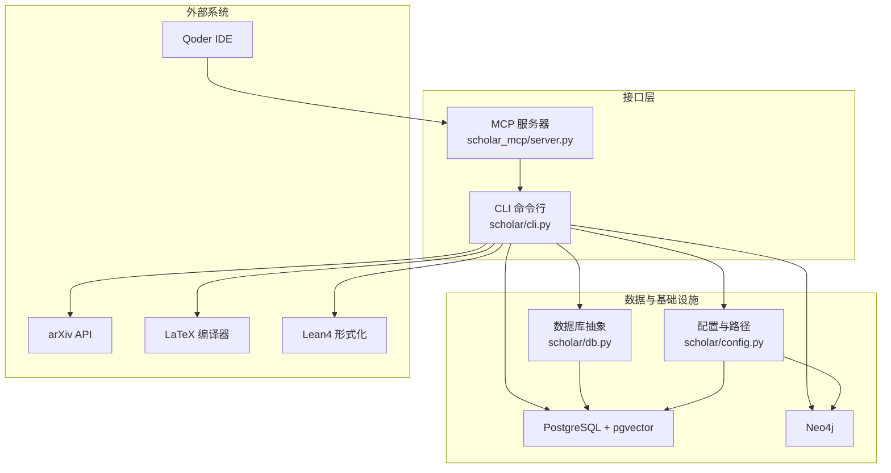
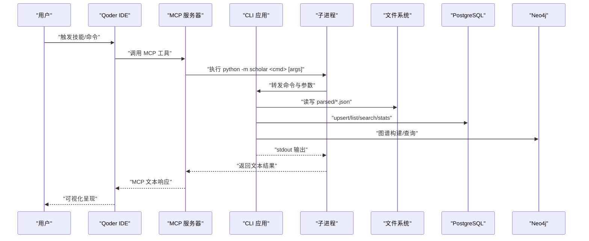
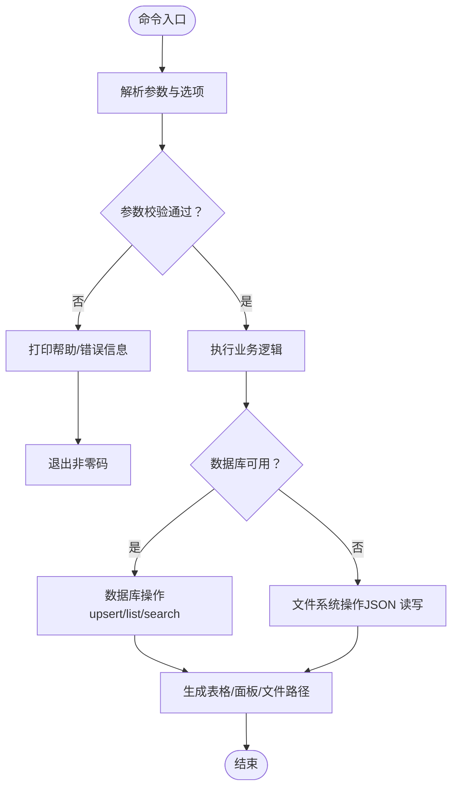
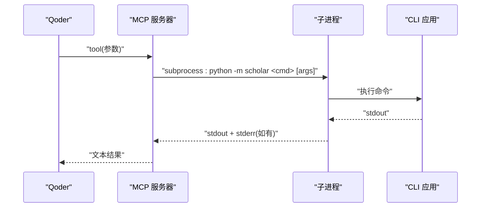
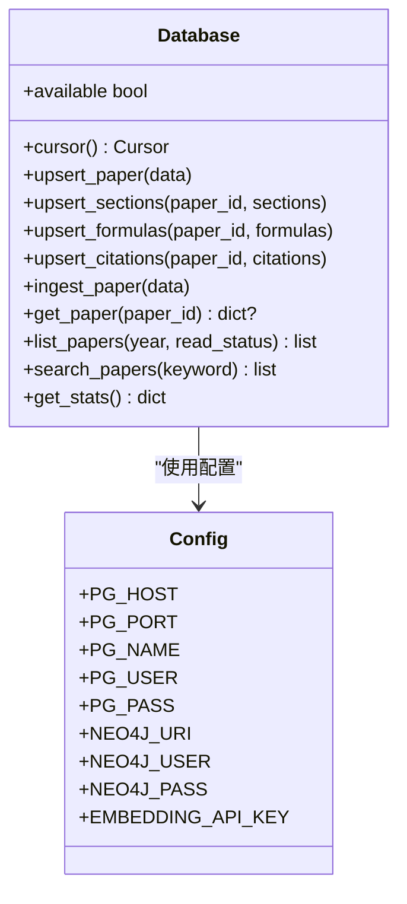
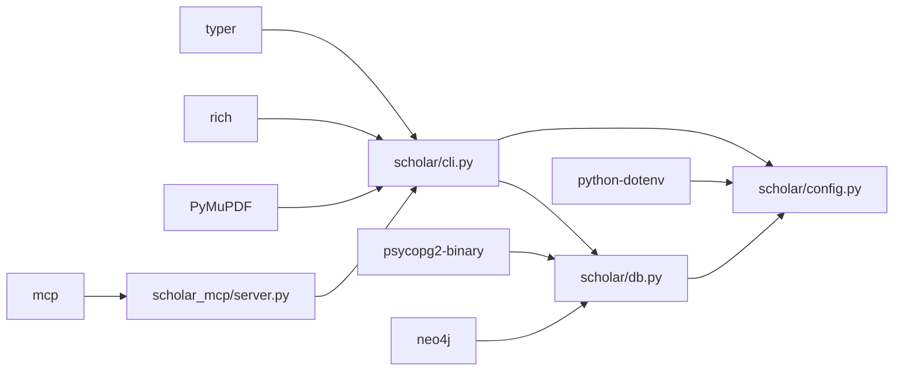

# 服务接口层

<cite>
**本文档引用的文件**
- [README.md](file://README.md)
- [requirements.txt](file://requirements.txt)
- [docker-compose.yml](file://infra/docker-compose.yml)
- [scholar/cli.py](file://scholar/cli.py)
- [scholar/__main__.py](file://scholar/__main__.py)
- [scholar/config.py](file://scholar/config.py)
- [scholar/db.py](file://scholar/db.py)
- [scholar_mcp/server.py](file://scholar_mcp/server.py)
</cite>

## 目录
1. [简介](#简介)
2. [项目结构](#项目结构)
3. [核心组件](#核心组件)
4. [架构总览](#架构总览)
5. [详细组件分析](#详细组件分析)
6. [依赖分析](#依赖分析)
7. [性能考虑](#性能考虑)
8. [故障排查指南](#故障排查指南)
9. [结论](#结论)
10. [附录](#附录)

## 简介
本文件面向“服务接口层”的技术文档，聚焦于三类接口形态：
- CLI 命令行接口：提供论文解析、检索、图谱分析、RAG 搜索、批处理与编排等能力。
- HTTP API 服务：本仓库未提供传统 HTTP API；如需对外暴露服务，请在现有 CLI 基础上封装轻量 HTTP 适配器。
- MCP（Model Context Protocol）服务器：作为 Qoder IDE 的桥接层，将 CLI 命令映射为 MCP 工具，供 Agent 与技能系统调用。

文档将系统阐述各接口的设计原则、请求/响应格式、错误处理机制，并给出安全认证、权限控制、速率限制、高可用与监控告警的实施建议，以及客户端集成最佳实践与常见问题解决方案。

## 项目结构
服务接口层由以下模块组成：
- scholar/cli.py：Typer 驱动的 CLI 应用，覆盖论文库管理、全文检索、图谱分析、RAG 搜索、批处理与编排等命令。
- scholar_mcp/server.py：基于 FastMCP 的 MCP 服务器，将 CLI 命令包装为 MCP 工具，供 Qoder IDE 使用。
- scholar/config.py：统一配置与环境变量加载，含数据库、图数据库、嵌入模型与本地工具路径等。
- scholar/db.py：PostgreSQL 抽象层，支持文件回退模式，提供论文、章节、公式、引用的增删改查与统计。
- infra/docker-compose.yml：PostgreSQL（pgvector）与 Neo4j 的容器编排，支撑结构化存储与图谱分析。
- requirements.txt：Python 依赖清单，包含 typer、rich、psycopg2、neo4j、python-dotenv、mcp 等。

图表来源
- [scholar/cli.py:1-800](file://scholar/cli.py#L1-L800)
- [scholar_mcp/server.py:1-387](file://scholar_mcp/server.py#L1-L387)
- [scholar/config.py:1-62](file://scholar/config.py#L1-L62)
- [scholar/db.py:1-270](file://scholar/db.py#L1-L270)
- [docker-compose.yml:1-44](file://infra/docker-compose.yml#L1-L44)

章节来源
- [README.md:300-326](file://README.md#L300-L326)
- [requirements.txt:1-9](file://requirements.txt#L1-L9)
- [docker-compose.yml:1-44](file://infra/docker-compose.yml#L1-L44)

## 核心组件
- CLI 应用（Typer + Rich）
  - 设计原则：命令分组清晰、参数明确、输出表格化与面板化，便于人类阅读与调试。
  - 主要命令族：论文库管理（scan、parse、parse-all、info、list-papers、stats、export-bib）、全文检索（search）、arXiv 检索（arxiv-search）、图谱分析（graph-build、graph-stats、graph-query、cite-network）、RAG（rag-index、rag-search）、元数据补全（year-fix、author-fix、cite-resolve）、批处理与编排（auto-notes、quality-score、classify、bootstrap、ingest、survey、landscape）、文件访问（read_auto_note、read_quality_score、read_parsed_paper、read_skill）。
  - 错误处理：异常捕获并打印到控制台，返回非零退出码；部分命令提供“干跑”模式（如 --apply）。
- MCP 服务器（FastMCP）
  - 设计原则：将 CLI 命令映射为 MCP 工具，参数类型与默认值来自 CLI 定义；通过子进程调用 CLI，捕获标准输出作为工具返回值。
  - 工具数量：29 个工具，覆盖论文库、图谱、RAG、外部检索、元数据补全、批处理与编排、文件读取等。
  - 错误处理：子进程返回码非零时附加 stderr 信息；文件读取工具若目标不存在，返回提示文本。
- 数据库抽象（PostgreSQL + 文件回退）
  - 设计原则：优先使用 PostgreSQL（psycopg2）；当依赖缺失或连接失败时，自动回退至文件系统（JSON）。
  - 功能：论文、章节、公式、引用的增删改查；全文检索；统计聚合；批量入库。
- 配置与环境变量
  - 设计原则：集中管理路径、数据库、图数据库、嵌入模型、本地工具等；支持 .env 加载。
  - 关键项：PostgreSQL 连接参数、Neo4j 连接参数、嵌入提供商与密钥、LaTeX 编译器命令、Lean4 项目路径。

章节来源
- [scholar/cli.py:22-800](file://scholar/cli.py#L22-L800)
- [scholar_mcp/server.py:17-387](file://scholar_mcp/server.py#L17-L387)
- [scholar/db.py:24-270](file://scholar/db.py#L24-L270)
- [scholar/config.py:20-62](file://scholar/config.py#L20-L62)

## 架构总览
下图展示了 CLI、MCP 与外部系统的交互关系，以及数据流向。

图表来源
- [scholar_mcp/server.py:23-36](file://scholar_mcp/server.py#L23-L36)
- [scholar/cli.py:131-168](file://scholar/cli.py#L131-L168)
- [scholar/db.py:79-170](file://scholar/db.py#L79-L170)

## 详细组件分析

### CLI 命令行接口
- 设计原则
  - 参数显式、帮助信息完整；选项与参数分离，避免歧义。
  - 输出采用表格与面板，便于快速浏览统计与列表。
  - 支持批量与限流（如 parse-all 的 limit、search 的 limit）。
- 请求/响应格式
  - 输入：命令行参数与选项（位置参数、可选参数）。
  - 输出：结构化文本（表格、面板、JSON 文件路径等）；异常时返回错误文本并退出码非零。
- 错误处理
  - 目录/文件不存在：打印红色错误并退出。
  - 外部服务失败（如 arXiv）：打印错误并退出。
  - 数据库不可用：回退到文件模式，提示“文件模式”。

图表来源
- [scholar/cli.py:45-168](file://scholar/cli.py#L45-L168)
- [scholar/db.py:31-74](file://scholar/db.py#L31-L74)

章节来源
- [scholar/cli.py:45-800](file://scholar/cli.py#L45-L800)
- [scholar/db.py:24-270](file://scholar/db.py#L24-L270)

### MCP 服务器（Qoder 集成）
- 设计原则
  - 将 CLI 命令映射为 MCP 工具，参数类型与默认值来自 CLI 定义。
  - 通过子进程调用 CLI，捕获 stdout 作为 MCP 工具返回值；stderr 作为错误信息附加。
  - 文件读取工具直接读取本地文件，不存在时返回提示文本。
- 请求/响应格式
  - 输入：MCP 工具参数（JSON Schema 由 FastMCP 根据函数签名推断）。
  - 输出：纯文本字符串（CLI 输出的 stdout）。
- 错误处理
  - 子进程非零退出码：附加 stderr 信息。
  - 文件读取不存在：返回提示文本，不抛异常。

图表来源
- [scholar_mcp/server.py:23-36](file://scholar_mcp/server.py#L23-L36)
- [scholar_mcp/server.py:41-325](file://scholar_mcp/server.py#L41-L325)

章节来源
- [scholar_mcp/server.py:17-387](file://scholar_mcp/server.py#L17-L387)

### 数据库抽象层
- 设计原则
  - 可插拔：优先使用 psycopg2；缺失时回退文件模式。
  - 事务：上下文管理器确保提交/回滚与游标关闭。
  - 全量入库：论文、章节、公式、引用的 upsert 与替换。
- 请求/响应格式
  - 输入：字典数据（paper_id、sections、formulas、citations 等）。
  - 输出：无返回值（副作用写入数据库/文件）。
- 错误处理
  - 连接失败：返回不可用；后续操作回退文件模式。
  - 事务异常：回滚并抛出异常。

图表来源
- [scholar/db.py:24-236](file://scholar/db.py#L24-L236)
- [scholar/config.py:39-62](file://scholar/config.py#L39-L62)

章节来源
- [scholar/db.py:24-270](file://scholar/db.py#L24-L270)
- [scholar/config.py:20-62](file://scholar/config.py#L20-L62)

### 配置与环境变量
- 设计原则
  - 通过 .env 加载环境变量，未安装 python-dotenv 时回退 os.environ。
  - 统一项目根目录与输出目录，确保路径一致性。
  - 数据库、图数据库、嵌入模型、本地工具均通过环境变量配置。
- 关键项
  - PostgreSQL：主机、端口、数据库名、用户名、密码。
  - Neo4j：URI、用户名、密码。
  - RAG 嵌入：提供商、模型、维度、API Key。
  - LaTeX：编译命令。
  - Lean4：项目目录。

章节来源
- [scholar/config.py:11-62](file://scholar/config.py#L11-L62)

## 依赖分析
- 外部依赖
  - typer/rich：CLI 框架与终端渲染。
  - psycopg2-binary：PostgreSQL 连接。
  - neo4j：Neo4j 驱动。
  - python-dotenv：.env 加载。
  - PyMuPDF：PDF 处理。
  - mcp：MCP 服务器框架。
- 内部耦合
  - CLI 依赖 config 与 db；db 依赖 config。
  - MCP 服务器依赖 CLI（通过子进程）。
  - docker-compose 提供 PostgreSQL 与 Neo4j 的运行时。

图表来源
- [requirements.txt:2-9](file://requirements.txt#L2-L9)
- [scholar/cli.py:12-21](file://scholar/cli.py#L12-L21)
- [scholar/db.py:15-22](file://scholar/db.py#L15-L22)
- [scholar/config.py:11-18](file://scholar/config.py#L11-L18)
- [scholar_mcp/server.py:12-12](file://scholar_mcp/server.py#L12-L12)

章节来源
- [requirements.txt:1-9](file://requirements.txt#L1-L9)

## 性能考虑
- CLI 批处理
  - parse-all 支持 limit 与 force，避免重复解析与资源耗尽。
  - 进度条与分段显示，减少大列表渲染压力。
- 数据库操作
  - upsert 使用 ON CONFLICT，减少查询次数；批量删除后插入，保证一致性。
  - 全文检索使用 ILIKE 与 LIMIT，避免全表扫描。
- MCP 工具
  - 子进程调用 CLI，适合短时任务；长耗时工具应设置合理 timeout。
  - 文件读取工具直接读取本地文件，避免网络开销。
- 外部服务
  - arXiv 搜索设置超时，避免阻塞。
  - RAG 嵌入需 API Key，否则回退全文搜索。

## 故障排查指南
- Docker 容器启动失败
  - 检查 Docker 状态与端口占用；必要时修改 docker-compose.yml 中的端口映射。
- PostgreSQL 连接超时
  - 端口 5433 为默认值，确认连接字符串与防火墙设置。
- Neo4j 不可用
  - 确认容器健康检查通过；检查凭据与插件配置。
- RAG 搜索无结果
  - 确认 .env 中 API Key；确认 rag-index 成功执行；无 Key 时自动回退全文搜索。
- MCP 工具报错
  - 查看子进程 stderr；确认 CLI 命令可用且参数正确。
- 数据库不可用
  - 回退文件模式；检查路径与权限。

章节来源
- [README.md:429-480](file://README.md#L429-L480)
- [docker-compose.yml:15-39](file://infra/docker-compose.yml#L15-L39)
- [scholar_mcp/server.py:23-36](file://scholar_mcp/server.py#L23-L36)
- [scholar/db.py:31-44](file://scholar/db.py#L31-L44)

## 结论
本服务接口层以 CLI 为核心，辅以 MCP 服务器实现与 Qoder 的无缝集成。通过数据库抽象层实现“数据库优先、文件回退”的稳健策略，并以丰富的命令族覆盖论文解析、检索、图谱分析与 RAG 搜索等场景。对于 HTTP API 需求，可在现有 CLI 基础上封装轻量 HTTP 适配器；安全与高可用方面，建议结合反向代理、速率限制与监控告警体系进行增强。

## 附录

### API 文档（CLI 命令参考）
- 论文库
  - stats：知识库统计
  - search <keyword> [--limit N]：全文检索
  - list-papers [--year Y] [--limit N]：按年份列出
  - info <ulid>：论文详情
  - export-bib [--output PATH]：导出 BibTeX
- 图谱与网络
  - graph-build：构建引用网络与概念图
  - graph-stats：图谱统计
  - graph-query <concept>：概念查询
  - cite-network [<ulid>]：引用网络分析
- 语义搜索（需 RAG 索引 + API Key）
  - rag-index：构建向量索引
  - rag-search <query> [--hybrid]：向量/混合搜索
- 批处理与编排
  - auto-notes [<ulid> --force]：生成阅读笔记
  - quality-score [<ulid>|--all]：质量评分
  - classify [<ulid>|--all|--list-tags]：领域分类
  - bootstrap：全量初始化
  - ingest <ulid>：增量导入
  - survey <topic> [--depth standard|full] [--limit N]：综述生成
  - landscape <topic>：领域全景分析
- 元数据补全
  - year-fix [--apply]：补全年份
  - author-fix [--apply]：补全作者
  - cite-resolve [--apply]：解析引用
- 外部
  - arxiv-search <query> [--max N]：arXiv 检索
- 文件访问
  - read_auto_note <ulid>：读取阅读笔记
  - read_quality_score <ulid>：读取质量评分
  - read_parsed_paper <ulid>：读取解析后的 JSON
  - read_skill <skill_name>：读取技能说明

章节来源
- [README.md:265-296](file://README.md#L265-L296)
- [scholar/cli.py:45-800](file://scholar/cli.py#L45-L800)

### MCP 工具清单（概览）
- 论文库：scan、parse、parse-all、info、search、list-papers、stats、export-bib、year-fix、author-fix、cite-resolve、ingest、survey、landscape
- 图谱与网络：graph-build、graph-query、cite-network、graph-stats
- RAG：rag-index、rag-search
- 文件访问：read_auto_note、read_quality_score、read_parsed_paper、read_skill

章节来源
- [scholar_mcp/server.py:41-325](file://scholar_mcp/server.py#L41-L325)

### 安全、认证与速率限制建议
- 认证与授权
  - 本地开发：无需认证；生产环境建议在反向代理层增加 API Key 校验与访问控制。
- 速率限制
  - 对外暴露 HTTP 适配器时，为高频工具（如 rag-search、arxiv-search）设置限流。
- 数据保护
  - 严格控制输出目录权限；敏感信息（API Key）仅保留在受控环境变量中。

### 高可用与监控告警
- 高可用
  - 使用反向代理（如 Nginx/Caddy）与多实例部署；数据库与图数据库使用容器编排与健康检查。
- 监控告警
  - 监控容器健康状态、数据库连接、MCP 工具执行耗时与错误率；对关键命令（bootstrap、rag-index）设置告警。

### 客户端集成最佳实践
- Qoder 集成
  - 使用 MCP 工具时，确保 MCP 服务器随 Qoder 启动；工具参数与默认值与 CLI 保持一致。
- 外部系统
  - arXiv 搜索设置合理超时；RAG 需要 API Key，否则回退全文搜索。
- 错误处理
  - 客户端应解析 MCP 返回的文本结果；遇到非零退出码，记录 stderr 并提示用户。