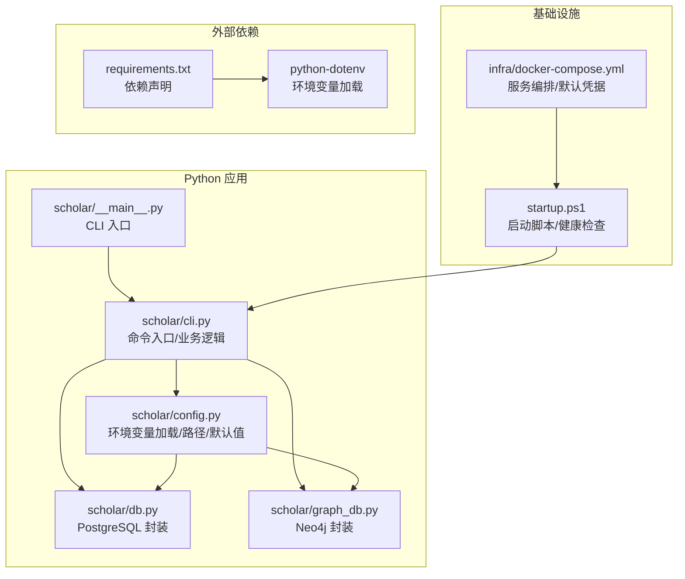
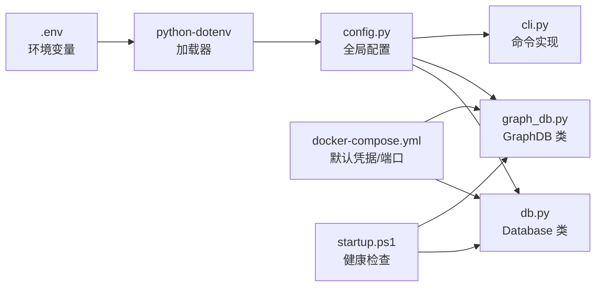
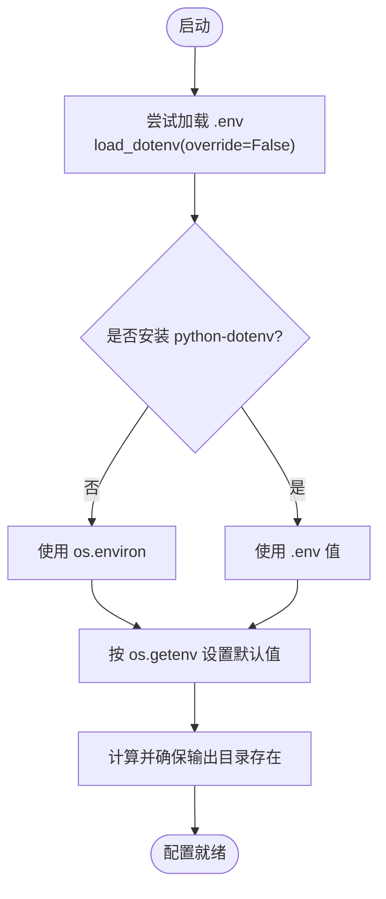
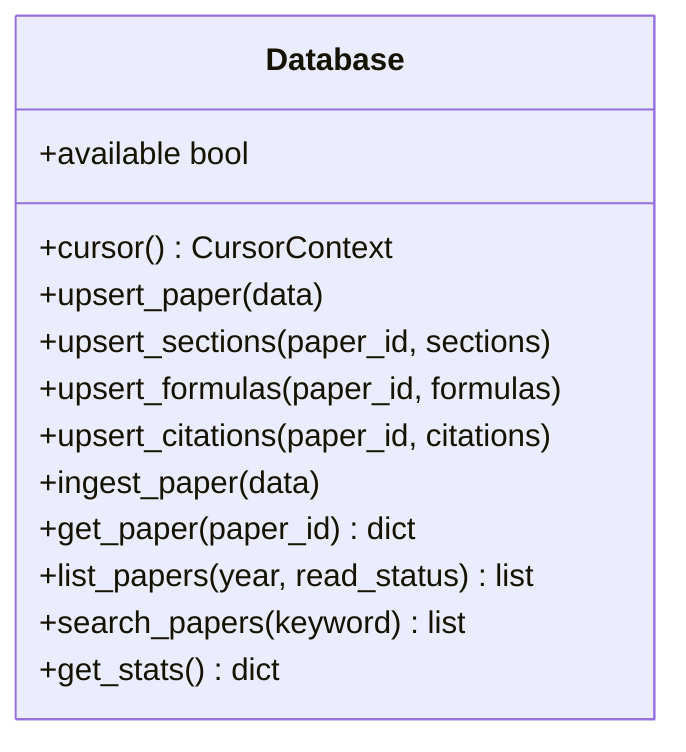
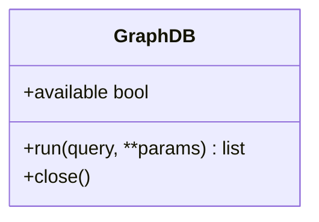
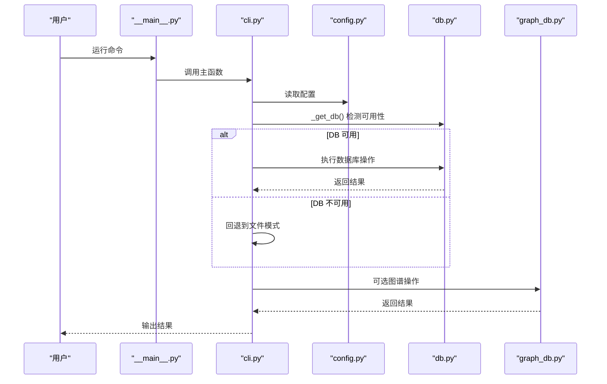
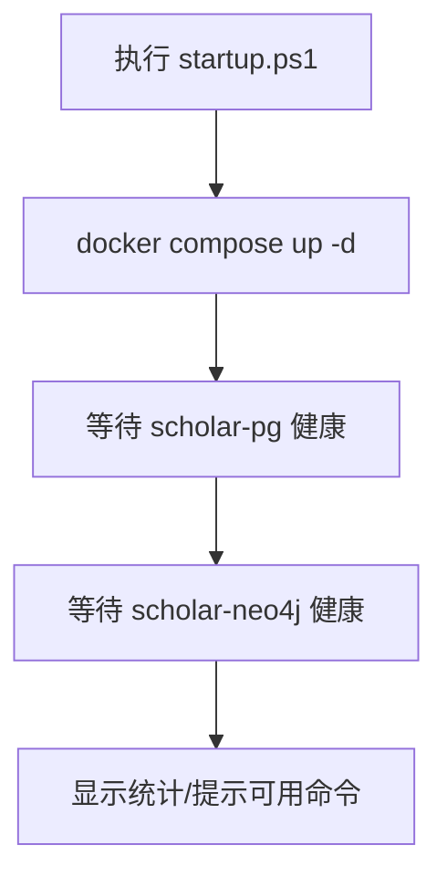
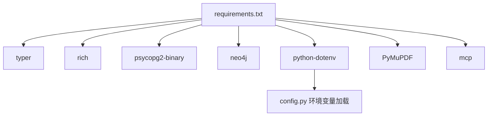

# 配置管理

<cite>
**本文档引用的文件**
- [config.py](file://scholar/config.py)
- [db.py](file://scholar/db.py)
- [graph_db.py](file://scholar/graph_db.py)
- [cli.py](file://scholar/cli.py)
- [__main__.py](file://scholar/__main__.py)
- [docker-compose.yml](file://infra/docker-compose.yml)
- [startup.ps1](file://startup.ps1)
- [requirements.txt](file://requirements.txt)
- [README.md](file://README.md)
</cite>

## 目录
1. [简介](#简介)
2. [项目结构](#项目结构)
3. [核心组件](#核心组件)
4. [架构总览](#架构总览)
5. [详细组件分析](#详细组件分析)
6. [依赖分析](#依赖分析)
7. [性能考虑](#性能考虑)
8. [故障排除指南](#故障排除指南)
9. [结论](#结论)
10. [附录](#附录)

## 简介
本文件为“配置管理系统”的技术文档，聚焦于 Scholar Studio 的配置体系，涵盖：
- 配置文件结构、参数定义与默认值
- 数据库连接、文件路径与环境变量管理
- 配置项优先级、覆盖规则与验证机制
- 不同部署环境的配置示例（开发、测试、生产）
- 配置热更新、动态加载与回滚机制现状与建议
- 安全配置、敏感信息保护与访问控制最佳实践
- 故障排除与调试方法

## 项目结构
Scholar Studio 的配置主要集中在 Python 包中的配置模块，并通过 CLI 与数据库层、图数据库层协同工作；基础设施通过 Docker Compose 编排。

图表来源
- [__main__.py:1-8](file://scholar/__main__.py#L1-L8)
- [cli.py:1-40](file://scholar/cli.py#L1-L40)
- [config.py:1-62](file://scholar/config.py#L1-L62)
- [db.py:1-60](file://scholar/db.py#L1-L60)
- [graph_db.py:1-70](file://scholar/graph_db.py#L1-L70)
- [docker-compose.yml:1-44](file://infra/docker-compose.yml#L1-L44)
- [startup.ps1:1-65](file://startup.ps1#L1-L65)
- [requirements.txt:1-9](file://requirements.txt#L1-L9)

章节来源
- [__main__.py:1-8](file://scholar/__main__.py#L1-L8)
- [cli.py:1-40](file://scholar/cli.py#L1-L40)
- [config.py:1-62](file://scholar/config.py#L1-L62)
- [db.py:1-60](file://scholar/db.py#L1-L60)
- [graph_db.py:1-70](file://scholar/graph_db.py#L1-L70)
- [docker-compose.yml:1-44](file://infra/docker-compose.yml#L1-L44)
- [startup.ps1:1-65](file://startup.ps1#L1-L65)
- [requirements.txt:1-9](file://requirements.txt#L1-L9)

## 核心组件
- 环境变量与默认值：通过 Python-dotenv 从项目根目录下的 .env 加载，未安装时回退到 os.environ。大部分连接参数与路径均采用 os.getenv 提供默认值。
- 数据库连接：PostgreSQL 使用 psycopg2，Neo4j 使用官方驱动，均从配置模块读取连接参数。
- 文件路径：项目根目录、数据目录、输出目录、解析产物目录等均在配置模块中集中定义并确保存在。
- CLI 集成：CLI 命令根据数据库可用性进行降级（DB 可用走数据库，否则走文件模式）。

章节来源
- [config.py:1-62](file://scholar/config.py#L1-L62)
- [db.py:24-74](file://scholar/db.py#L24-L74)
- [graph_db.py:32-70](file://scholar/graph_db.py#L32-L70)
- [cli.py:31-40](file://scholar/cli.py#L31-L40)

## 架构总览
下图展示了配置在系统中的流向与依赖关系。

图表来源
- [config.py:11-18](file://scholar/config.py#L11-L18)
- [db.py:24-60](file://scholar/db.py#L24-L60)
- [graph_db.py:32-70](file://scholar/graph_db.py#L32-L70)
- [cli.py:31-40](file://scholar/cli.py#L31-L40)
- [docker-compose.yml:1-44](file://infra/docker-compose.yml#L1-L44)
- [startup.ps1:1-65](file://startup.ps1#L1-L65)

## 详细组件分析

### 配置模块（config.py）
- 环境变量加载策略
  - 从项目根目录查找 .env 文件，使用 load_dotenv 且不覆盖已存在的环境变量（避免覆盖风险）。
  - 若未安装 python-dotenv，则回退到 os.environ。
- 默认值与类型转换
  - PostgreSQL：主机、端口、数据库名、用户名、密码均有默认值，端口默认 5433。
  - Neo4j：URI、用户名、密码均有默认值。
  - RAG Embedding：提供商、模型、维度、API Key 默认值。
  - LaTeX 编译命令默认 pdflatex。
- 路径与目录
  - 项目根目录、论文目录、Lean 项目目录、输出目录及子目录（解析、笔记、草稿、Bib、实验）统一定义并确保存在。

图表来源
- [config.py:11-18](file://scholar/config.py#L11-L18)
- [config.py:39-62](file://scholar/config.py#L39-L62)

章节来源
- [config.py:1-62](file://scholar/config.py#L1-L62)

### 数据库层（db.py）
- 可用性检测：尝试建立连接以判断 PostgreSQL 是否可用。
- 连接与上下文：封装连接、事务提交/回滚、游标管理。
- 数据模型：提供论文、章节、公式、引用的增删改查与批量导入。
- 文件模式回退：当数据库不可用时，使用 JSON 文件保存解析结果。

图表来源
- [db.py:24-235](file://scholar/db.py#L24-L235)

章节来源
- [db.py:1-270](file://scholar/db.py#L1-L270)

### 图数据库层（graph_db.py）
- Neo4j 连接：通过 GraphDatabase.driver 读取配置中的 URI 与认证信息。
- 可用性检测：尝试 session.run("RETURN 1") 判断服务可用。
- 查询与关闭：提供 run 方法执行 Cypher，以及 close 释放驱动。

图表来源
- [graph_db.py:32-70](file://scholar/graph_db.py#L32-L70)

章节来源
- [graph_db.py:1-200](file://scholar/graph_db.py#L1-L200)

### CLI 集成（cli.py）
- 数据库可用性判定：通过 _get_db 判定 DB 是否可用，决定是否走数据库路径。
- 文件模式降级：当 DB 不可用时，使用 JSON 文件进行搜索、列表与统计。
- 命令示例：scan、parse、parse-all、info、search、list-papers、stats、export-bib、graph-build、graph-stats 等。

图表来源
- [__main__.py:1-8](file://scholar/__main__.py#L1-L8)
- [cli.py:31-40](file://scholar/cli.py#L31-L40)
- [config.py:1-62](file://scholar/config.py#L1-L62)
- [db.py:24-74](file://scholar/db.py#L24-L74)
- [graph_db.py:32-70](file://scholar/graph_db.py#L32-L70)

章节来源
- [cli.py:1-800](file://scholar/cli.py#L1-L800)
- [__main__.py:1-8](file://scholar/__main__.py#L1-L8)

### 基础设施与启动（docker-compose.yml、startup.ps1）
- docker-compose.yml
  - PostgreSQL（pgvector）：默认数据库、用户、密码；端口 5433；挂载初始化 SQL。
  - Neo4j：默认认证、插件、内存参数；端口 7474/7687。
- startup.ps1
  - 启动容器、等待健康检查、显示知识库统计。

图表来源
- [docker-compose.yml:1-44](file://infra/docker-compose.yml#L1-L44)
- [startup.ps1:1-65](file://startup.ps1#L1-L65)

章节来源
- [docker-compose.yml:1-44](file://infra/docker-compose.yml#L1-L44)
- [startup.ps1:1-65](file://startup.ps1#L1-L65)

## 依赖分析
- Python 依赖：typer、rich、psycopg2-binary、neo4j、python-dotenv、PyMuPDF、mcp。
- 环境变量加载：python-dotenv 仅在开发/本地环境中使用；生产中可通过容器环境变量注入。

图表来源
- [requirements.txt:1-9](file://requirements.txt#L1-L9)
- [config.py:11-18](file://scholar/config.py#L11-L18)

章节来源
- [requirements.txt:1-9](file://requirements.txt#L1-L9)
- [config.py:1-62](file://scholar/config.py#L1-L62)

## 性能考虑
- 连接池与重用：数据库层未显式使用连接池，建议在高并发场景引入连接池（如 psycopg2.pool）。
- 健康检查：启动脚本对数据库进行健康检查，减少无效请求。
- 文件模式降级：在 DB 不可用时，CLI 自动切换到文件模式，保证功能可用但性能不及数据库。

## 故障排除指南
- 环境变量未生效
  - 确认 .env 文件位于项目根目录，且未被 git 忽略。
  - 确认已安装 python-dotenv，且未禁用 override=False。
- PostgreSQL 连接失败
  - 端口默认 5433，确认未被占用；容器健康检查通过后再试。
  - 确认数据库凭据与 docker-compose.yml 一致。
- Neo4j 连接失败
  - 确认容器健康检查通过；认证信息与 docker-compose.yml 一致。
- RAG 搜索无结果
  - 确认 .env 中存在有效 API Key；若无则回退到全文搜索。
- CLI 命令报错
  - 使用 CLI 的 stats 命令查看知识库状态；必要时执行 bootstrap 或分步重做。

章节来源
- [README.md:429-480](file://README.md#L429-L480)
- [startup.ps1:1-65](file://startup.ps1#L1-L65)
- [config.py:1-62](file://scholar/config.py#L1-L62)
- [db.py:24-74](file://scholar/db.py#L24-L74)
- [graph_db.py:32-70](file://scholar/graph_db.py#L32-L70)

## 结论
本配置系统通过环境变量与默认值结合的方式，实现了清晰、可移植的配置管理。数据库层与图数据库层均从统一配置读取连接参数，CLI 在 DB 不可用时自动降级至文件模式，提升了系统的鲁棒性。建议在生产环境中进一步完善配置热更新、动态加载与回滚机制，并强化敏感信息保护与访问控制。

## 附录

### 配置项与默认值一览
- PostgreSQL
  - 主机：localhost
  - 端口：5433
  - 数据库名：scholar
  - 用户名：scholar
  - 密码：scholar2024
- Neo4j
  - URI：bolt://localhost:7687
  - 用户名：neo4j
  - 密码：scholar2024
- RAG Embedding
  - 提供商：zhipu
  - 模型：embedding-2
  - 维度：1024
  - API Key：空字符串
- LaTeX
  - 命令：pdflatex

章节来源
- [config.py:39-62](file://scholar/config.py#L39-L62)

### 不同部署环境的配置示例
- 开发环境
  - 使用 .env 文件设置 SCHOLAR_EMBEDDING_API_KEY；其他参数保持默认或按需调整。
- 测试环境
  - 通过容器环境变量覆盖默认凭据；确保端口映射与防火墙允许访问。
- 生产环境
  - 将敏感信息（数据库密码、API Key）置于受控的密钥管理服务；避免将 .env 提交到版本库。

章节来源
- [README.md:53-86](file://README.md#L53-L86)
- [docker-compose.yml:1-44](file://infra/docker-compose.yml#L1-L44)

### 配置优先级与覆盖规则
- 环境变量优先级：.env（若安装 python-dotenv） > 系统环境变量（回退时）。
- 覆盖策略：load_dotenv(override=False)，避免意外覆盖已存在的环境变量。
- 默认值：所有关键参数均提供合理默认值，便于快速启动。

章节来源
- [config.py:11-18](file://scholar/config.py#L11-L18)
- [config.py:39-62](file://scholar/config.py#L39-L62)

### 配置热更新、动态加载与回滚机制
- 现状：当前系统在进程启动时一次性读取配置，未实现运行时热更新。
- 建议：
  - 引入配置中心或文件监控（如 watchdog）在变更时触发重载。
  - 对数据库连接与图数据库驱动采用延迟初始化，以便在重载后重建连接。
  - 为关键配置（如连接参数）提供回滚策略（保留上一版本配置快照）。

章节来源
- [config.py:1-62](file://scholar/config.py#L1-L62)
- [db.py:24-74](file://scholar/db.py#L24-L74)
- [graph_db.py:32-70](file://scholar/graph_db.py#L32-L70)

### 安全配置、敏感信息保护与访问控制最佳实践
- 敏感信息保护
  - .env 文件加入 .gitignore；数据库密码与 API Key 通过容器环境变量或密钥管理服务注入。
- 访问控制
  - 限制对 .env 与容器凭据的访问权限；仅授权人员可修改。
- 网络隔离
  - 将数据库与图数据库置于受控网络；仅开放必要端口。

章节来源
- [README.md:53-86](file://README.md#L53-L86)
- [docker-compose.yml:1-44](file://infra/docker-compose.yml#L1-L44)