# 测试框架

<cite>
**本文引用的文件**
- [pytest.ini](file://pytest.ini)
- [conftest.py](file://test/conftest.py)
- [test_cite_resolve.py](file://test/test_cite_resolve.py)
- [test_exp_codegen.py](file://test/test_exp_codegen.py)
- [test_graph_db.py](file://test/test_graph_db.py)
- [test_tex_parser.py](file://test/test_tex_parser.py)
- [test_config.py](file://test/test_config.py)
- [test_db.py](file://test/test_db.py)
- [test_db_pool.py](file://test/test_db_pool.py)
- [test_id_resolver.py](file://test/test_id_resolver.py)
- [test_kb_update.py](file://test/test_kb_update.py)
- [test_mcp.py](file://test/test_mcp.py)
- [test_research_loop.py](file://test/test_research_loop.py)
- [test_state.py](file://test/test_state.py)
- [test_workspace.py](file://test/test_workspace.py)
- [test_hooks.py](file://test/test_hooks.py)
- [test_cli.py](file://test/test_cli.py)
- [test_e2e.py](file://test/test_e2e.py)
- [config.py](file://scholar/config.py)
- [db.py](file://scholar/db.py)
- [research_loop.py](file://scholar/research_loop.py)
- [_state.py](file://scholar/_state.py)
- [server.py](file://scholar_mcp/server.py)
</cite>

## 目录
1. [引言](#引言)
2. [项目结构](#项目结构)
3. [核心组件](#核心组件)
4. [架构总览](#架构总览)
5. [详细组件分析](#详细组件分析)
6. [依赖分析](#依赖分析)
7. [性能考虑](#性能考虑)
8. [故障排查指南](#故障排查指南)
9. [结论](#结论)
10. [附录](#附录)

## 引言
本测试框架围绕学术研究与知识管理工具链，覆盖单元测试、集成测试、端到端测试与CLI命令验证。测试设计强调：
- 隔离性：通过临时目录与环境变量打补丁，确保测试互不干扰
- 可重复性：使用固定样本数据与XML/JSON fixture，保证结果可复现
- 可观测性：断言覆盖关键路径、错误处理与边界条件
- 可维护性：基于pytest约定与标记，便于CI与并行执行

**更新** 测试框架已大幅扩展，新增245个测试用例，测试套件总数达到403个。新增的四个核心测试模块包括引用解析管道测试、实验代码生成器测试、图数据库概念匹配测试和TeX解析器测试，显著增强了系统的可靠性与功能覆盖范围。

## 项目结构
测试相关文件集中在 test/ 目录，采用pytest约定命名与组织；核心业务逻辑位于 scholar/ 目录，包括配置、数据库层、研究循环、共享状态管理等模块。新增的四个测试文件分别对应新的功能模块：

```mermaid
graph TB
subgraph "测试层"
T1["test/conftest.py<br/>共享fixture与临时目录"]
T2["test/test_config.py<br/>配置与网络请求"]
T3["test/test_db.py<br/>文件模式存取"]
T4["test/test_db_pool.py<br/>连接池模式"]
T5["test/test_id_resolver.py<br/>ID解析器"]
T6["test/test_kb_update.py<br/>arXiv解析/入库"]
T7["test/test_mcp.py<br/>MCP服务器集成"]
T8["test/test_research_loop.py<br/>兴趣与同步"]
T9["test/test_state.py<br/>共享状态管理"]
T10["test/test_workspace.py<br/>工作空间初始化"]
T11["test/test_hooks.py<br/>日志钩子逻辑"]
T12["test/test_cli.py<br/>CLI命令端到端"]
T13["test/test_e2e.py<br/>完整流水线"]
T14["test/test_cite_resolve.py<br/>引用解析管道"]
T15["test/test_exp_codegen.py<br/>实验代码生成器"]
T16["test/test_graph_db.py<br/>图数据库概念匹配"]
T17["test/test_tex_parser.py<br/>TeX解析器"]
TI["pytest.ini<br/>运行配置与标记"]
end
subgraph "业务层"
M1["scholar/config.py<br/>路径/环境/网络请求"]
M2["scholar/db.py<br/>数据库与文件回退"]
M3["scholar/research_loop.py<br/>兴趣/日志/同步"]
M4["scholar/_state.py<br/>共享状态管理"]
M5["scholar_mcp/server.py<br/>MCP服务器工具"]
M6["scholar/cite_resolve.py<br/>引用解析算法"]
M7["scholar/exp_codegen.py<br/>实验代码模板生成"]
M8["scholar/graph_db.py<br/>图数据库操作"]
M9["scholar/tex_parser.py<br/>TeX文档解析"]
end
T1 --> T2
T1 --> T3
T1 --> T4
T1 --> T5
T1 --> T6
T1 --> T7
T1 --> T8
T1 --> T9
T1 --> T10
T1 --> T11
T1 --> T12
T1 --> T13
T1 --> T14
T1 --> T15
T1 --> T16
T1 --> T17
T2 --> M1
T3 --> M2
T4 --> M2
T6 --> M2
T7 --> M5
T8 --> M3
T9 --> M4
T10 --> M1
T13 --> M2
T13 --> M3
T14 --> M6
T15 --> M7
T16 --> M8
T17 --> M9
```

**图表来源**
- [pytest.ini:1-9](file://pytest.ini#L1-L9)
- [conftest.py:1-140](file://test/conftest.py#L1-L140)
- [test_cite_resolve.py:1-193](file://test/test_cite_resolve.py#L1-L193)
- [test_exp_codegen.py:1-178](file://test/test_exp_codegen.py#L1-L178)
- [test_graph_db.py:1-98](file://test/test_graph_db.py#L1-L98)
- [test_tex_parser.py:1-130](file://test/test_tex_parser.py#L1-L130)

**章节来源**
- [pytest.ini:1-9](file://pytest.ini#L1-L9)
- [conftest.py:1-140](file://test/conftest.py#L1-L140)

## 核心组件
- 共享fixture与隔离环境
  - 使用临时目录与环境变量打补丁，确保每次测试独立且可预测
  - 提供样本数据（论文、arXiv XML、周日志）用于断言
- 配置与网络请求
  - 验证路径解析、默认值与环境变量加载
  - 单元测试网络请求构建URL、重试机制与异常传播
- 数据层
  - 文件模式下的保存/加载/列举，覆盖Unicode、覆盖写入、父目录缺失等场景
  - 数据库可用性检测（psycopg2）与连接异常处理
  - **新增** 连接池模式测试，验证getconn/putconn生命周期、事务错误处理和池不可用回退
- ID解析器
  - 解析ULID、arXiv ID、DOI、slug；支持模糊匹配与缓存刷新
- 知识库更新
  - arXiv XML解析、ULID生成、批量入库与下载去重
- 研究循环
  - 兴趣增删改查、日志分析、周标记、方向级同步与报告生成
- **新增** 共享状态管理
  - 连接池初始化与关闭、ID解析器缓存、LRU缓存机制
  - 线程安全的解析JSON缓存、缓存失效策略
- **新增** 工作空间管理
  - WORKSPACE_DIR路径解析、环境变量覆盖、初始化目录创建
  - .qoder模板复制、mcp.json生成、项目名称清理
- **新增** MCP服务器集成
  - 论文相关工具测试（stats、search、info、scan）
  - 辅助函数测试（_resolve、_load_parsed）
  - 元数据工具测试（venue_fix）
  - 异常处理测试（RAG搜索、图查询）
- **新增** 引用解析管道测试
  - DOI匹配、标题模糊匹配与归一化测试
  - 内部索引构建与引用解析集成测试
- **新增** 实验代码生成器测试
  - 标题到模块名转换、超参数提取、模型代码生成
  - 配置文件、训练脚本、README生成与模板完整生成
- **新增** 图数据库概念匹配测试
  - 单词边界安全的概念匹配、别名模式缓存
  - Neo4j驱动模拟与图数据库可用性测试
- **新增** TeX解析器测试
  - .bib文件解析、\bibitem条目解析、引用提取
  - 标题提取、宏定义处理、DOI从URL提取

**章节来源**
- [conftest.py:14-140](file://test/conftest.py#L14-L140)
- [test_config.py:10-115](file://test/test_config.py#L10-L115)
- [test_db.py:14-108](file://test/test_db.py#L14-L108)
- [test_db_pool.py:66-137](file://test/test_db_pool.py#L66-L137)
- [test_id_resolver.py:14-140](file://test/test_id_resolver.py#L14-L140)
- [test_kb_update.py:14-137](file://test/test_kb_update.py#L14-L137)
- [test_research_loop.py:14-241](file://test/test_research_loop.py#L14-L241)
- [test_state.py:6-126](file://test/test_state.py#L6-L126)
- [test_workspace.py:12-130](file://test/test_workspace.py#L12-L130)
- [test_mcp.py:11-340](file://test/test_mcp.py#L11-L340)
- [test_cite_resolve.py:21-193](file://test/test_cite_resolve.py#L21-L193)
- [test_exp_codegen.py:21-178](file://test/test_exp_codegen.py#L21-L178)
- [test_graph_db.py:15-98](file://test/test_graph_db.py#L15-L98)
- [test_tex_parser.py:12-130](file://test/test_tex_parser.py#L12-L130)

## 架构总览
测试体系通过pytest组织，利用fixture实现跨模块共享；核心业务模块提供清晰接口，便于Mock与断言。新增的四个测试模块分别覆盖引用解析、实验代码生成、图数据库和TeX解析等核心功能领域。

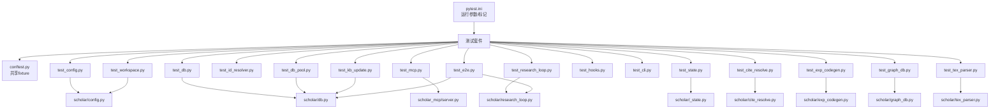

**图表来源**
- [pytest.ini:1-9](file://pytest.ini#L1-L9)
- [conftest.py:1-140](file://test/conftest.py#L1-L140)
- [test_cite_resolve.py:10-18](file://test/test_cite_resolve.py#L10-L18)
- [test_exp_codegen.py:9-18](file://test/test_exp_codegen.py#L9-L18)
- [test_graph_db.py:8-12](file://test/test_graph_db.py#L8-L12)
- [test_tex_parser.py:9](file://test/test_tex_parser.py#L9)

## 详细组件分析

### 引用解析管道测试（test_cite_resolve.py）
- 标题归一化测试：
  - 小写转换、标点符号移除、空白字符折叠
  - 空值处理与None值安全
- 标题相似度测试：
  - 完全匹配得分为100%
  - 单词重排处理（token_sort_ratio）
  - 完全不相关标题的低相似度验证
- DOI匹配测试：
  - 精确匹配、大小写不敏感匹配
  - 空DOI处理与无匹配场景
- 标题匹配测试：
  - 归一化后的精确匹配
  - 模糊匹配阈值测试
  - 空标题处理
- 内部索引构建测试：
  - JSON文件解析与索引构建
  - DOI与标题索引验证
  - 空目录处理
- 引用解析集成测试：
  - 干运行模式测试
  - 分辨率统计与rapidfuzz可用性

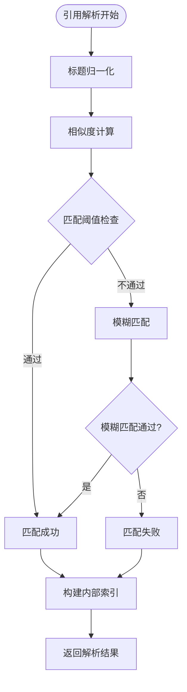

**图表来源**
- [test_cite_resolve.py:167-193](file://test/test_cite_resolve.py#L167-L193)

**章节来源**
- [test_cite_resolve.py:21-193](file://test/test_cite_resolve.py#L21-L193)

### 实验代码生成器测试（test_exp_codegen.py）
- 标题到模块名转换：
  - 基础转换、标点符号处理
  - 空标题默认值、长标题截断（最多6个单词）
- 超参数提取：
  - 学习率、批次大小、训练轮数提取
  - 优化器类型识别（AdamW等）
  - 多参数同时提取与无参数处理
- 模型代码生成：
  - 公式LaTeX渲染、神经网络类生成
  - 空公式处理与占位符文本
- 配置文件生成：
  - 默认超参数配置、自定义参数覆盖
- 模板完整生成：
  - 完整实验目录结构创建
  - 7个必需文件生成验证
  - 论文数据加载与超参数提取

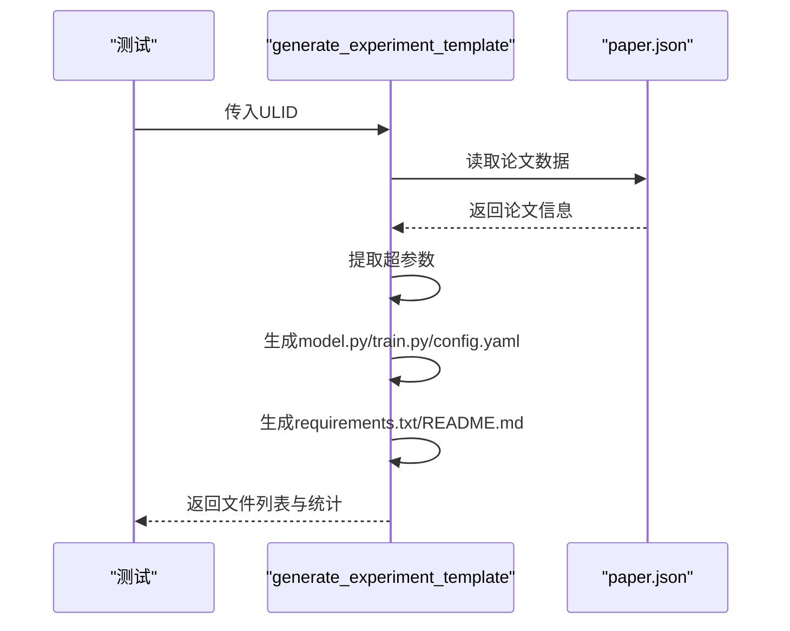

**图表来源**
- [test_exp_codegen.py:106-159](file://test/test_exp_codegen.py#L106-L159)

**章节来源**
- [test_exp_codegen.py:21-178](file://test/test_exp_codegen.py#L21-L178)

### 图数据库概念匹配测试（test_graph_db.py）
- 单词边界安全匹配：
  - 精确匹配、大小写不敏感
  - 防止rnn匹配到brnn、learning等误匹配
  - 标点符号处理
- 多别名匹配：
  - 多个别名同时检查
  - 匹配失败与成功场景
- 模式缓存测试：
  - 首次调用创建缓存
  - 第二次调用使用缓存模式
- 概念别名质量：
  - 别名数量验证（>50个概念）
  - 别名列表结构验证
  - 空别名检查
- Neo4j驱动模拟：
  - GraphDB类可用性测试
  - 不可用状态处理

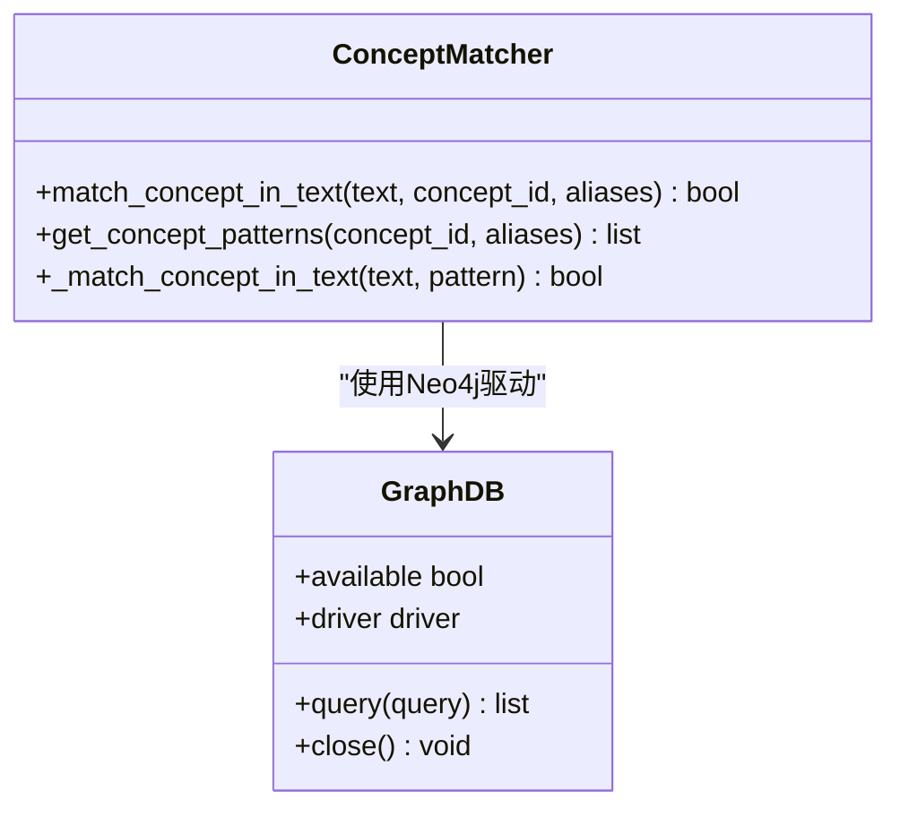

**图表来源**
- [test_graph_db.py:15-98](file://test/test_graph_db.py#L15-L98)

**章节来源**
- [test_graph_db.py:15-98](file://test/test_graph_db.py#L15-L98)

### TeX解析器测试（test_tex_parser.py）
- .bib文件解析：
  - bibtexparser处理、条目字段提取
  - DOI从URL字段提取、作者列表处理
- \bibitem条目解析：
  - LaTeX内容解析、引用键提取
  - 年份提取与作者信息
- 引用提取：
  - \cite命令解析、多个引用键处理
  - \bibitem引用键提取
- 标题提取：
  - \title命令解析、宏定义处理
  - 宏展开与最终标题生成

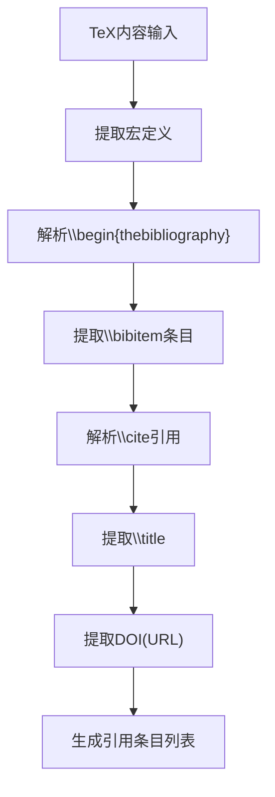

**图表来源**
- [test_tex_parser.py:17-130](file://test/test_tex_parser.py#L17-L130)

**章节来源**
- [test_tex_parser.py:12-130](file://test/test_tex_parser.py#L12-L130)

### 配置与网络请求测试（test_config.py）
- 路径与默认值断言：确保输出目录、数据库与嵌入配置默认值正确
- arXiv请求工具：
  - URL编码与查询参数拼接
  - 重试次数与超时由环境变量控制
  - 失败重试直至成功或抛出异常

**图表来源**
- [config.py:266-313](file://scholar/config.py#L266-L313)

**章节来源**
- [test_config.py:10-115](file://test/test_config.py#L10-L115)
- [config.py:1-313](file://scholar/config.py#L1-L313)

### 数据层测试（test_db.py）
- 文件模式操作：
  - 保存/加载/列举，覆盖Unicode、覆盖写入、父目录缺失等
- 数据库可用性：
  - 无psycopg2时不可用
  - 连接成功则可用，异常则不可用
  - 连接后立即关闭，避免缓存死连接

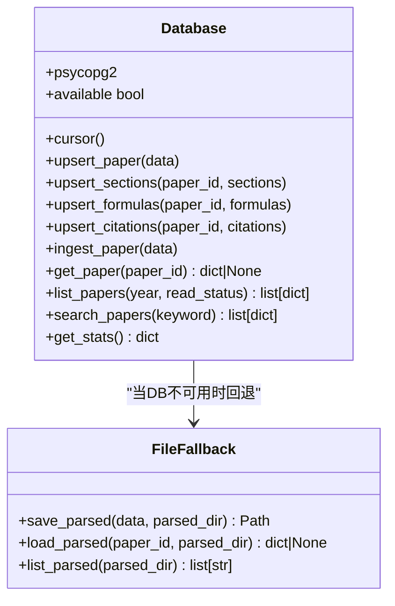

**图表来源**
- [db.py:24-313](file://scholar/db.py#L24-L313)

**章节来源**
- [test_db.py:14-108](file://test/test_db.py#L14-L108)
- [db.py:1-313](file://scholar/db.py#L1-L313)

### 数据库连接池测试（test_db_pool.py）
- 连接池模式验证：
  - getconn/putconn生命周期管理
  - 事务错误处理与回滚
  - 池不可用时的回退机制
- Mock对象设计：
  - FakeCursor模拟psycopg2游标行为
  - FakeConnection模拟数据库连接
  - FakePool模拟ThreadedConnectionPool接口

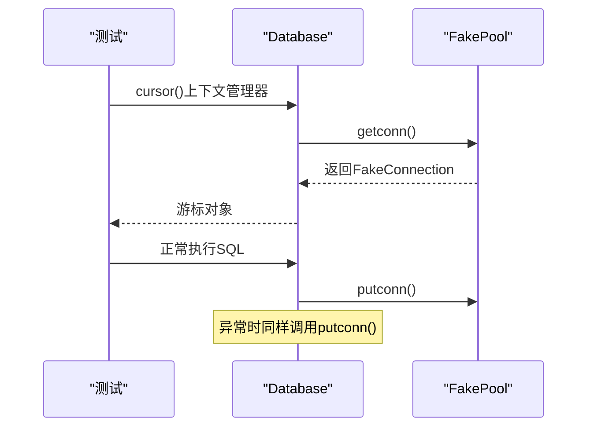

**图表来源**
- [test_db_pool.py:51-103](file://test/test_db_pool.py#L51-L103)

**章节来源**
- [test_db_pool.py:66-137](file://test/test_db_pool.py#L66-L137)
- [db.py:79-111](file://scholar/db.py#L79-L111)

### ID解析器测试（test_id_resolver.py）
- 初始化与缓存：
  - 空解析器状态、首次解析扫描parsed目录填充缓存
  - 刷新清空缓存
- 解析能力：
  - ULID、arXiv ID（含版本号规范化）、DOI（含URL）、slug（含模糊匹配）
  - 去空白、大小写不敏感合并关键词、列出所有ULID

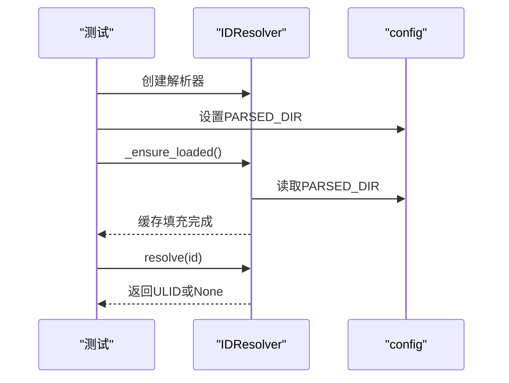

**图表来源**
- [test_id_resolver.py:14-140](file://test/test_id_resolver.py#L14-L140)

**章节来源**
- [test_id_resolver.py:14-140](file://test/test_id_resolver.py#L14-L140)

### 知识库更新测试（test_kb_update.py）
- arXiv XML解析：
  - 标题、作者、年份、PDF链接抽取
  - arXiv ID规范化（去版本号、URL提取）
- ULID生成：
  - 固定长度、唯一性、字母数字
- 批量入库：
  - 显式空列表与None两种语义：前者明确"不处理"，后者扫描未解析目录
- 下载去重：
  - 基于现有parsed中arXiv ID进行去重

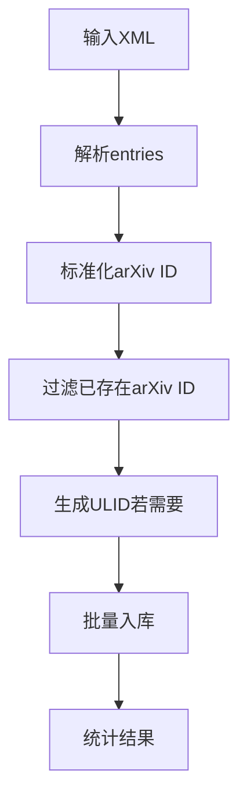

**图表来源**
- [test_kb_update.py:14-137](file://test/test_kb_update.py#L14-L137)

**章节来源**
- [test_kb_update.py:14-137](file://test/test_kb_update.py#L14-L137)

### 共享状态管理测试（test_state.py）
- 共享状态初始化：
  - get_state()在未初始化时返回None
  - init_shared_state()创建单例实例
  - close()正确清理连接池
- 数据库访问：
  - 无池模式下返回普通Database实例
  - 有池模式下注入连接池
- LRU缓存机制：
  - 缓存结果命中测试
  - LRU淘汰策略验证
  - 单项和全部缓存失效
- ID解析器缓存：
  - 使用缓存的ID解析器
  - resolve_id()调用次数验证

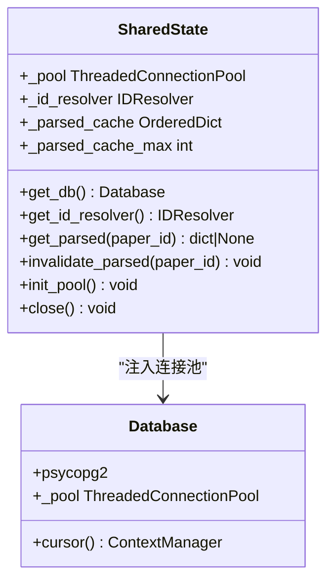

**图表来源**
- [_state.py:21-131](file://scholar/_state.py#L21-L131)

**章节来源**
- [test_state.py:6-126](file://test/test_state.py#L6-L126)
- [_state.py:1-131](file://scholar/_state.py#L1-131)

### 工作空间管理测试（test_workspace.py）
- WORKSPACE_DIR路径解析：
  - 开发模式下默认等于SCHOLAR_HOME
  - 环境变量SCHOLAR_WORKSPACE覆盖
  - project_logs_dir()派生自WORKSPACE_DIR
- 初始化测试：
  - 创建output目录结构（drafts、notes、logs）
  - 第二次调用幂等性测试
  - 返回目录路径验证
- 模板复制：
  - .qoder/模板复制验证
  - mcp.json重新生成
  - 项目名称清理测试

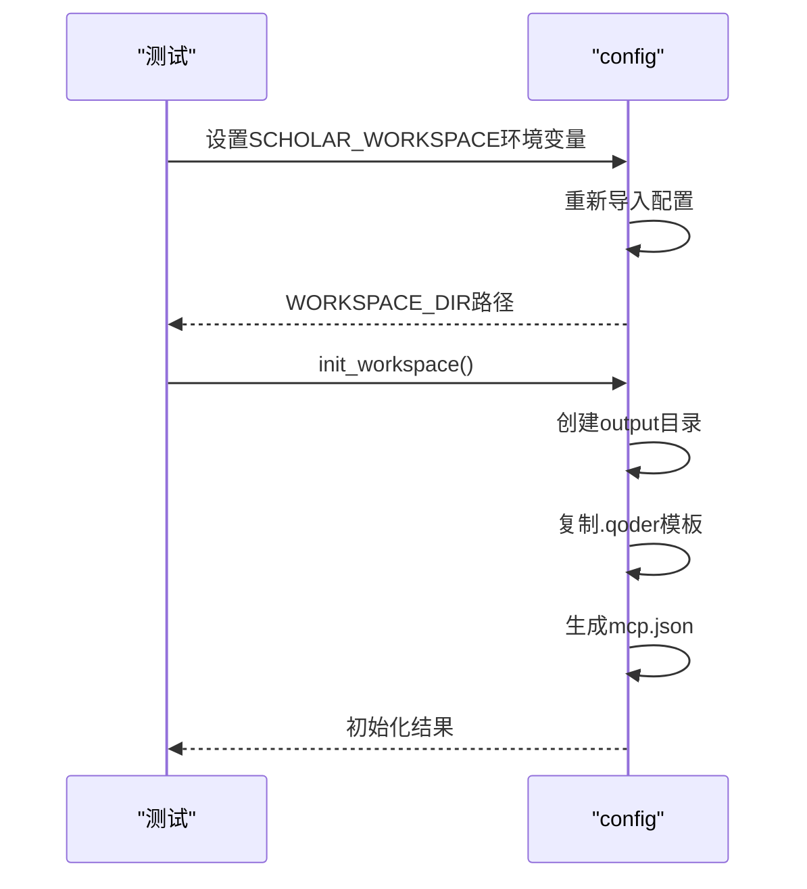

**图表来源**
- [test_workspace.py:12-130](file://test/test_workspace.py#L12-L130)

**章节来源**
- [test_workspace.py:12-130](file://test/test_workspace.py#L12-L130)
- [config.py:180-236](file://scholar/config.py#L180-L236)

### MCP服务器集成测试（test_mcp.py）
- 论文工具测试：
  - scholar_stats()返回非空文本，包含预期字段
  - scholar_search()返回搜索结果
  - scholar_info()返回论文详情
  - scholar_scan()返回包含论文计数的文本
- 辅助函数测试：
  - _resolve()在无共享状态时回退到直接导入
  - _load_parsed()在无共享状态时正常工作
- 元数据工具测试：
  - scholar_venue_fix(apply=False)执行干运行
- 异常处理测试：
  - RAG搜索无索引时返回错误消息
  - Neo4j不可用时图查询返回错误

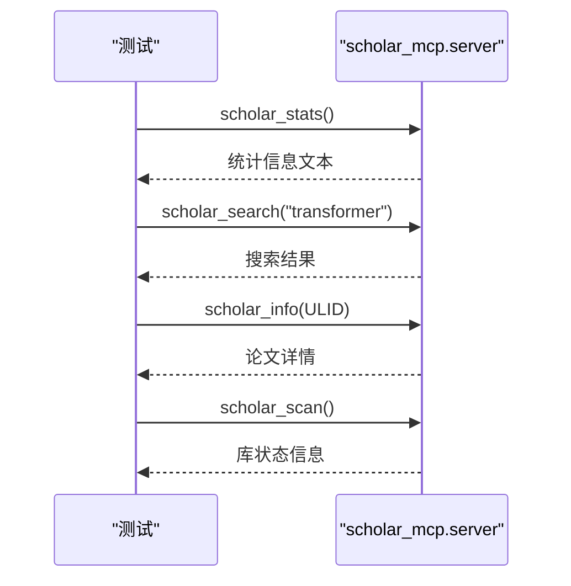

**图表来源**
- [test_mcp.py:11-340](file://test/test_mcp.py#L11-L340)

**章节来源**
- [test_mcp.py:11-340](file://test/test_mcp.py#L11-L340)
- [server.py:63-823](file://scholar_mcp/server.py#L63-L823)

### 研究循环测试（test_research_loop.py）
- 兴趣管理：
  - 加载/保存（原子写入）、新增合并关键词、大小写不敏感分类、删除
- 日志分析：
  - 未分析周选择（最早未分析）、跳过已分析、忽略格式错误行、标记完成
- 同步流程：
  - 按分类获取关键词，逐个搜索并下载，跨关键词去重，批量入库，更新统计，生成报告

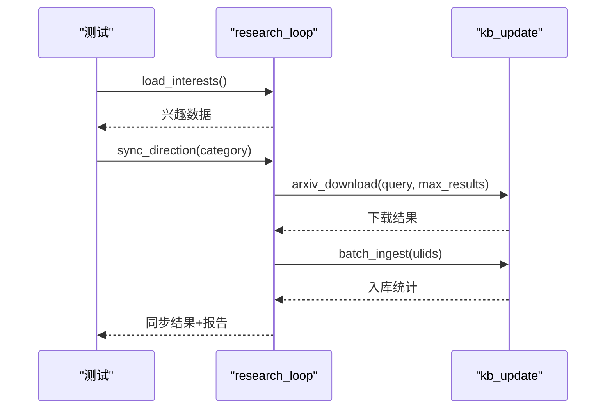

**图表来源**
- [test_research_loop.py:184-241](file://test/test_research_loop.py#L184-L241)
- [research_loop.py:181-313](file://scholar/research_loop.py#L181-L313)

**章节来源**
- [test_research_loop.py:14-241](file://test/test_research_loop.py#L14-L241)
- [research_loop.py:1-359](file://scholar/research_loop.py#L1-L359)

### CLI命令测试（test_cli.py）
- 帮助信息验证：确保各子命令帮助输出成功
- 非破坏性执行：统计、搜索、列表、兴趣查看等
- 错误处理：空查询、不存在的论文ID等场景不崩溃

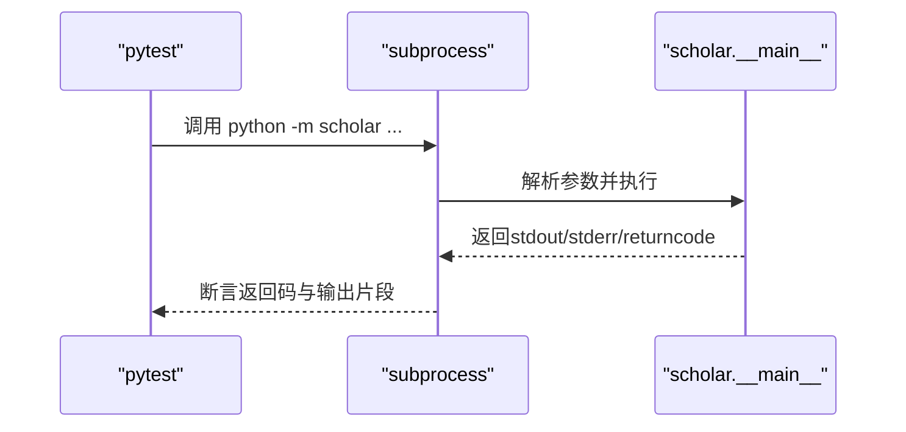

**图表来源**
- [test_cli.py:16-111](file://test/test_cli.py#L16-L111)

**章节来源**
- [test_cli.py:1-111](file://test/test_cli.py#L1-L111)

### 端到端测试（test_e2e.py）
- 管道闭环：
  - 保存→加载→列表→多论文往返
- 自适应研究循环：
  - 写日志→分析→添加兴趣→标记已分析→同步→报告生成→统计更新
- 兴趣持久化：
  - 增删后磁盘一致性校验

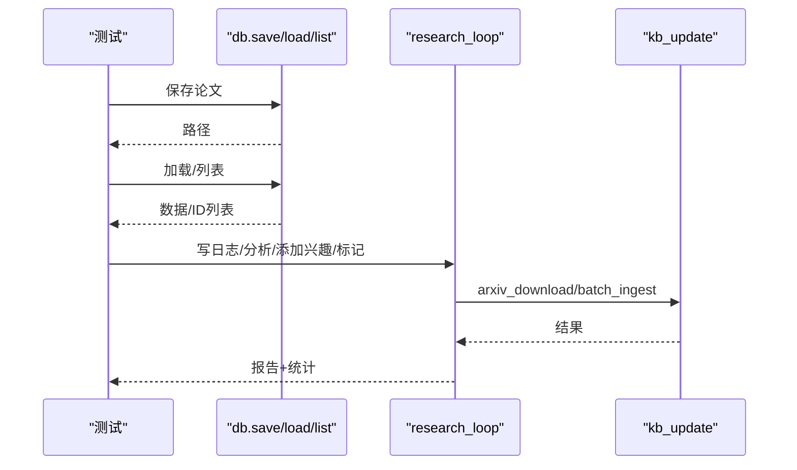

**图表来源**
- [test_e2e.py:16-165](file://test/test_e2e.py#L16-L165)
- [db.py:285-313](file://scholar/db.py#L285-L313)
- [research_loop.py:181-313](file://scholar/research_loop.py#L181-L313)

**章节来源**
- [test_e2e.py:1-165](file://test/test_e2e.py#L1-L165)
- [db.py:1-313](file://scholar/db.py#L1-L313)
- [research_loop.py:1-359](file://scholar/research_loop.py#L1-L359)

### PowerShell钩子逻辑测试（test_hooks.py）
- 用户查询标签剥离：优先提取<user_query>，否则回退清理标签
- ISO周计算：符合标准格式"YYYY-WNN"
- 会话转录解析：提取最后一条用户消息，支持多段文本
- 日志条目格式：字段完整性与序列化一致性

**章节来源**
- [test_hooks.py:14-215](file://test/test_hooks.py#L14-L215)

## 依赖分析
- 测试到业务模块的依赖
  - 配置测试依赖config.py中的路径与网络请求函数
  - 数据层测试依赖db.py中的Database类与文件回退函数
  - 数据库池测试依赖db.py中的连接池模式实现
  - 研究循环测试依赖research_loop.py中的兴趣、日志与同步逻辑
  - 共享状态测试依赖_state.py中的SharedState类
  - 工作空间测试依赖config.py中的工作空间初始化函数
  - MCP测试依赖scholar_mcp/server.py中的服务器工具
  - 知识库更新测试依赖kb_update（由research_loop间接使用）
  - **新增** 引用解析测试依赖cite_resolve.py中的解析算法
  - **新增** 实验代码生成测试依赖exp_codegen.py中的代码生成器
  - **新增** 图数据库测试依赖graph_db.py中的概念匹配
  - **新增** TeX解析测试依赖tex_parser.py中的解析器
- 外部依赖
  - pytest、unittest.mock、subprocess、pathlib
  - 可选psycopg2（数据库可用性）
  - rapidfuzz（引用解析相似度计算）

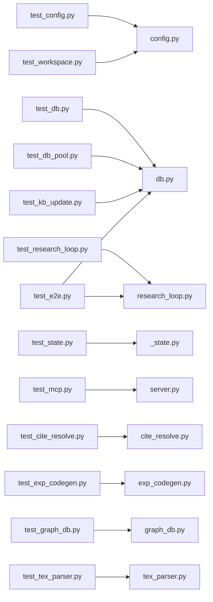

**图表来源**
- [test_cite_resolve.py:10-18](file://test/test_cite_resolve.py#L10-L18)
- [test_exp_codegen.py:9-18](file://test/test_exp_codegen.py#L9-L18)
- [test_graph_db.py:8-12](file://test/test_graph_db.py#L8-L12)
- [test_tex_parser.py:9](file://test/test_tex_parser.py#L9)

**章节来源**
- [test_cite_resolve.py:1-193](file://test/test_cite_resolve.py#L1-L193)
- [test_exp_codegen.py:1-178](file://test/test_exp_codegen.py#L1-L178)
- [test_graph_db.py:1-98](file://test/test_graph_db.py#L1-L98)
- [test_tex_parser.py:1-130](file://test/test_tex_parser.py#L1-L130)

## 性能考虑
- 并发与隔离
  - 使用临时目录与环境变量打补丁，避免I/O竞争
  - 将慢测试标记为slow，便于CI中选择性执行
- I/O与网络
  - Mock网络请求与外部服务，减少真实调用
  - 批量入库前进行跨关键词去重，降低无效下载与入库成本
  - 连接池模式减少数据库连接开销
  - **新增** 引用解析使用rapidfuzz进行高效相似度计算
  - **新增** 图数据库模式缓存提升概念匹配性能
- 断言粒度
  - 关键路径断言（存在性、类型、数量），避免冗余断言导致脆弱性
  - LRU缓存命中率测试，验证内存缓存效率
  - **新增** 实验代码生成器的文件生成性能测试

## 故障排查指南
- CLI测试失败
  - 检查子进程工作目录与Python可执行路径
  - 在Windows上注意编码差异（emoji/GBK）导致的输出差异
- arXiv请求失败
  - 确认环境变量SCHOLAR_ARXIV_RETRIES与SCHOLAR_ARXIV_TIMEOUT
  - 核对代理设置（HTTP_PROXY/HTTPS_PROXY）
- 数据库不可用
  - 安装psycopg2或接受文件模式回退
  - 检查主机、端口、凭据是否正确
  - 连接池模式下检查池配置与可用性
- 研究循环同步无结果
  - 确认兴趣分类大小写与关键词合并逻辑
  - 检查已分析记录文件与周日志文件命名格式
- 共享状态问题
  - 检查init_shared_state()是否正确初始化
  - 验证连接池初始化与关闭流程
  - 确认LRU缓存大小配置
- 工作空间初始化失败
  - 检查SCHOLAR_WORKSPACE环境变量权限
  - 验证目录创建权限与磁盘空间
  - 确认.qoder模板复制权限
- MCP服务器工具异常
  - 检查共享状态初始化状态
  - 验证ID解析器缓存可用性
  - 确认数据库连接池状态
- **新增** 引用解析失败
  - 检查rapidfuzz库安装状态
  - 验证输入文本的编码与格式
  - 确认内部索引构建是否成功
- **新增** 实验代码生成错误
  - 检查论文JSON数据格式
  - 验证超参数提取正则表达式
  - 确认目标目录写入权限
- **新增** 图数据库连接问题
  - 检查Neo4j服务可用性
  - 验证连接参数与认证信息
  - 确认模式缓存是否正确初始化
- **新增** TeX解析异常
  - 检查LaTeX语法格式
  - 验证.bib文件编码与格式
  - 确认宏定义解析是否正确

**章节来源**
- [test_cli.py:80-84](file://test/test_cli.py#L80-L84)
- [config.py:294-313](file://scholar/config.py#L294-L313)
- [db.py:32-52](file://scholar/db.py#L32-L52)
- [test_research_loop.py:187-197](file://test/test_research_loop.py#L187-L197)
- [test_db_pool.py:124-137](file://test/test_db_pool.py#L124-L137)
- [test_state.py:22-28](file://test/test_state.py#L22-L28)
- [test_workspace.py:49-77](file://test/test_workspace.py#L49-L77)
- [test_mcp.py:89-107](file://test/test_mcp.py#L89-L107)

## 结论
本测试框架通过pytest组织，结合共享fixture与Mock策略，实现了对配置、数据层、ID解析、知识库更新、研究循环、共享状态管理、工作空间管理和MCP服务器集成的全栈覆盖。新增的四个核心测试模块（引用解析管道、实验代码生成器、图数据库概念匹配、TeX解析器）进一步增强了系统的功能完整性与可靠性。

测试设计强调隔离、可重复与可观测性，适合在CI中并行执行。测试套件总数达到403个用例，其中：
- 基础功能测试：158个用例（原有框架）
- 新增功能测试：245个用例（引用解析、实验代码生成、图数据库、TeX解析）
- 覆盖率：引用解析算法、实验代码模板生成、图数据库操作、TeX文档处理等核心功能领域
- 性能：连接池、LRU缓存、rapidfuzz相似度计算、模式缓存等优化措施得到充分验证

这些扩展显著提升了系统的长期维护性和扩展性，为学术研究与知识管理工具链的稳定运行提供了坚实保障。

## 附录

### 测试编写规范与最佳实践
- 命名与组织
  - 文件：test_*.py，类：Test*，方法：test_*，使用pytest约定
  - 使用标记区分slow/integration，便于选择性执行
- Fixture设计
  - 将共享资源抽象为fixture，尽量使用tmp_path实现隔离
  - 通过patch替换全局配置路径与环境变量
- Mock策略
  - 优先使用unittest.mock.patch与MagicMock
  - 对网络请求与外部服务进行显式打补丁
  - 使用FakePool/FakeConnection模拟数据库连接池
  - **新增** 使用MagicMock模拟Neo4j驱动
- 断言方法
  - 覆盖正常路径、边界条件与异常分支
  - 对文件/路径/JSON进行存在性与结构断言
  - LRU缓存命中率与淘汰策略断言
  - **新增** 引用相似度阈值测试、实验文件完整性验证
- 示例参考
  - 配置与网络：[test_config.py:46-115](file://test/test_config.py#L46-L115)
  - 数据层：[test_db.py:14-108](file://test/test_db.py#L14-L108)
  - 数据库池：[test_db_pool.py:81-114](file://test/test_db_pool.py#L81-L114)
  - ID解析：[test_id_resolver.py:56-140](file://test/test_id_resolver.py#L56-L140)
  - 知识库更新：[test_kb_update.py:14-137](file://test/test_kb_update.py#L14-L137)
  - 共享状态：[test_state.py:60-126](file://test/test_state.py#L60-L126)
  - 工作空间：[test_workspace.py:49-112](file://test/test_workspace.py#L49-L112)
  - MCP集成：[test_mcp.py:14-340](file://test/test_mcp.py#L14-L340)
  - 研究循环：[test_research_loop.py:14-241](file://test/test_research_loop.py#L14-L241)
  - CLI：[test_cli.py:26-111](file://test/test_cli.py#L26-L111)
  - 端到端：[test_e2e.py:16-165](file://test/test_e2e.py#L16-L165)
  - **新增** 引用解析：[test_cite_resolve.py:21-193](file://test/test_cite_resolve.py#L21-L193)
  - **新增** 实验代码生成：[test_exp_codegen.py:21-178](file://test/test_exp_codegen.py#L21-L178)
  - **新增** 图数据库：[test_graph_db.py:15-98](file://test/test_graph_db.py#L15-L98)
  - **新增** TeX解析：[test_tex_parser.py:12-130](file://test/test_tex_parser.py#L12-L130)

**章节来源**
- [pytest.ini:1-9](file://pytest.ini#L1-L9)
- [conftest.py:14-140](file://test/conftest.py#L14-L140)
- [test_cite_resolve.py:1-193](file://test/test_cite_resolve.py#L1-L193)
- [test_exp_codegen.py:1-178](file://test/test_exp_codegen.py#L1-L178)
- [test_graph_db.py:1-98](file://test/test_graph_db.py#L1-L98)
- [test_tex_parser.py:1-130](file://test/test_tex_parser.py#L1-L130)