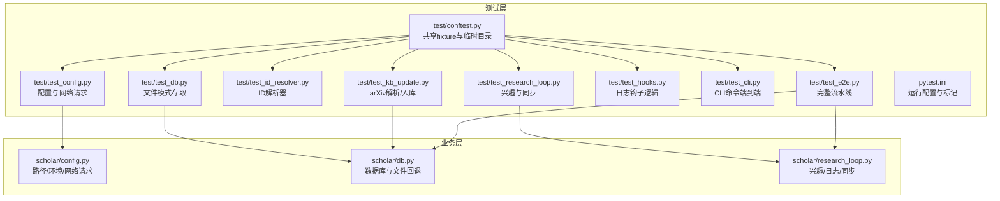
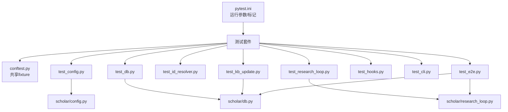
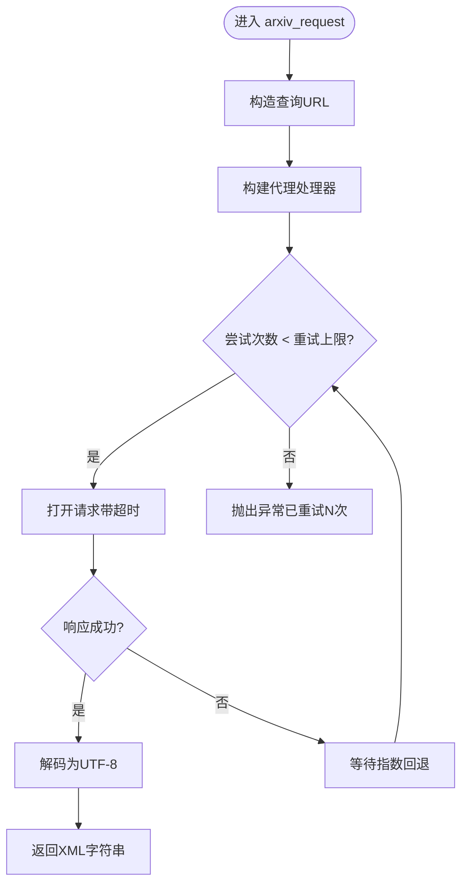
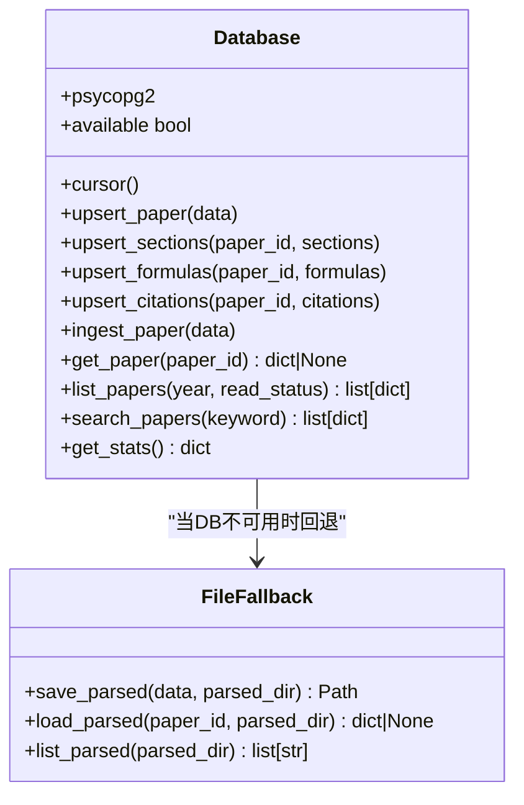
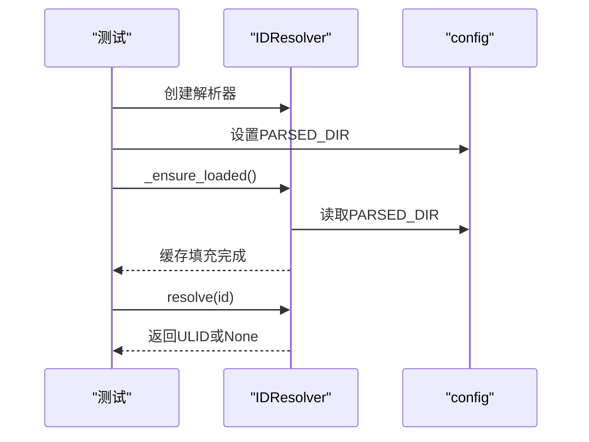
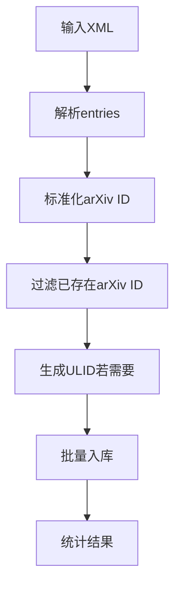
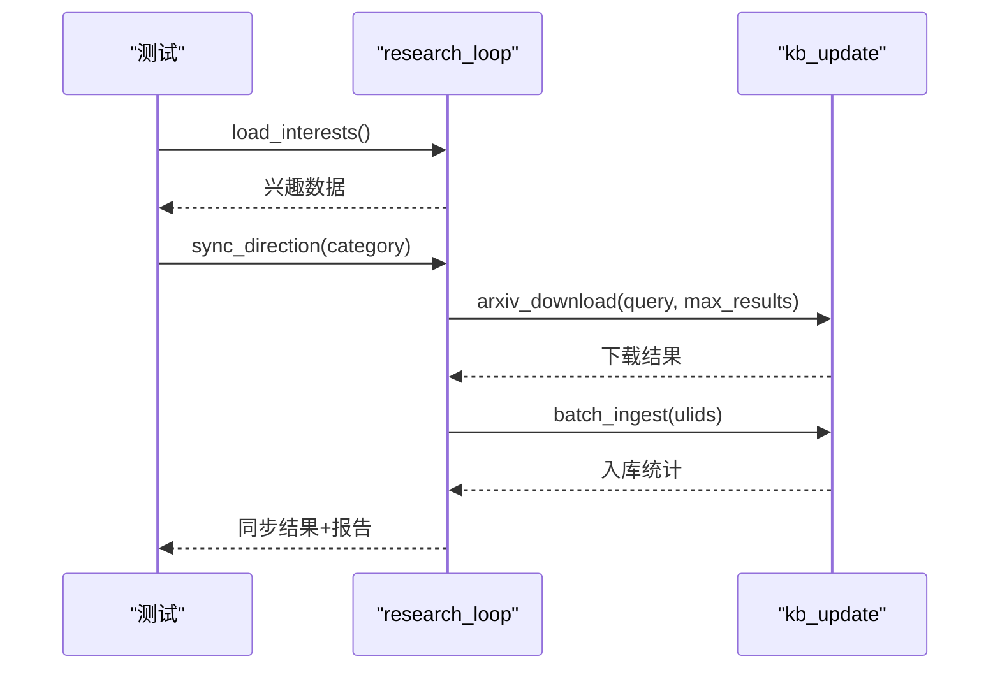
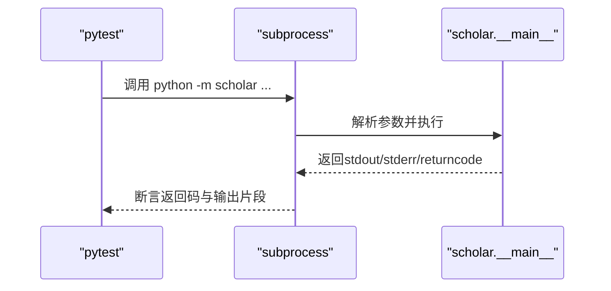
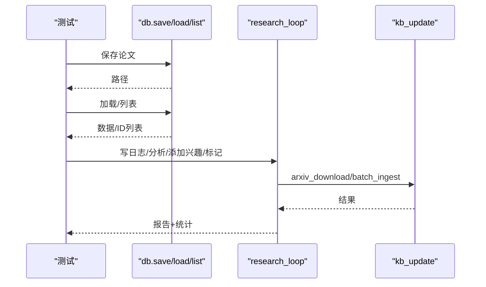
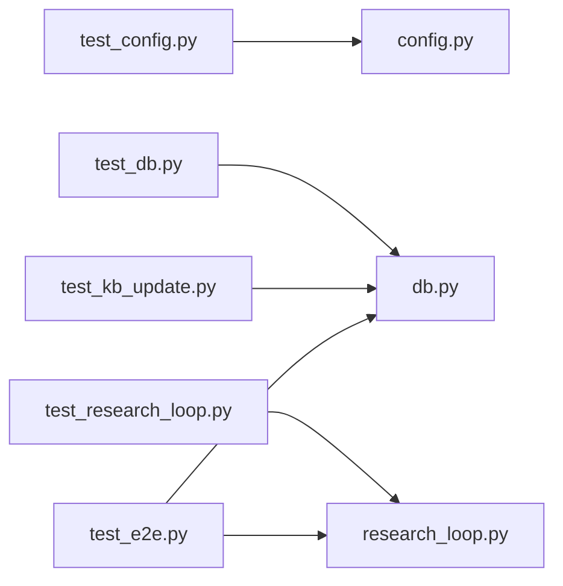

# 测试框架

<cite>
**本文引用的文件**
- [pytest.ini](file://pytest.ini)
- [conftest.py](file://test/conftest.py)
- [test_config.py](file://test/test_config.py)
- [test_db.py](file://test/test_db.py)
- [test_id_resolver.py](file://test/test_id_resolver.py)
- [test_kb_update.py](file://test/test_kb_update.py)
- [test_research_loop.py](file://test/test_research_loop.py)
- [test_hooks.py](file://test/test_hooks.py)
- [test_cli.py](file://test/test_cli.py)
- [test_e2e.py](file://test/test_e2e.py)
- [config.py](file://scholar/config.py)
- [db.py](file://scholar/db.py)
- [research_loop.py](file://scholar/research_loop.py)
</cite>

## 目录
1. [引言](#引言)
2. [项目结构](#项目结构)
3. [核心组件](#核心组件)
4. [架构总览](#架构总览)
5. [详细组件分析](#详细组件分析)
6. [依赖分析](#依赖分析)
7. [性能考虑](#性能考虑)
8. [故障排查指南](#故障排查指南)
9. [结论](#结论)
10. [附录](#附录)

## 引言
本测试框架围绕学术研究与知识管理工具链，覆盖单元测试、集成测试、端到端测试与CLI命令验证。测试设计强调：
- 隔离性：通过临时目录与环境变量打补丁，确保测试互不干扰
- 可重复性：使用固定样本数据与XML/JSON fixture，保证结果可复现
- 可观测性：断言覆盖关键路径、错误处理与边界条件
- 可维护性：基于pytest约定与标记，便于CI与并行执行

## 项目结构
测试相关文件集中在 test/ 目录，采用pytest约定命名与组织；核心业务逻辑位于 scholar/ 目录，包括配置、数据库层、研究循环等模块。

图表来源
- [pytest.ini:1-9](file://pytest.ini#L1-L9)
- [conftest.py:1-140](file://test/conftest.py#L1-L140)
- [test_config.py:1-115](file://test/test_config.py#L1-L115)
- [test_db.py:1-108](file://test/test_db.py#L1-L108)
- [test_id_resolver.py:1-140](file://test/test_id_resolver.py#L1-L140)
- [test_kb_update.py:1-137](file://test/test_kb_update.py#L1-L137)
- [test_research_loop.py:1-241](file://test/test_research_loop.py#L1-L241)
- [test_hooks.py:1-215](file://test/test_hooks.py#L1-L215)
- [test_cli.py:1-111](file://test/test_cli.py#L1-L111)
- [test_e2e.py:1-163](file://test/test_e2e.py#L1-L163)
- [config.py:1-119](file://scholar/config.py#L1-L119)
- [db.py:1-276](file://scholar/db.py#L1-L276)
- [research_loop.py:1-359](file://scholar/research_loop.py#L1-L359)

章节来源
- [pytest.ini:1-9](file://pytest.ini#L1-L9)
- [conftest.py:1-140](file://test/conftest.py#L1-L140)

## 核心组件
- 共享fixture与隔离环境
  - 使用临时目录与环境变量打补丁，确保每次测试独立且可预测
  - 提供样本数据（论文、arXiv XML、周日志）用于断言
- 配置与网络请求
  - 验证路径解析、默认值与环境变量加载
  - 单元测试网络请求构建URL、重试机制与异常传播
- 数据层
  - 文件模式下的保存/加载/列举，覆盖Unicode、覆盖写入、父目录缺失等场景
  - 数据库可用性检测（psycopg2）与连接异常处理
- ID解析器
  - 解析ULID、arXiv ID、DOI、slug；支持模糊匹配与缓存刷新
- 知识库更新
  - arXiv XML解析、ULID生成、批量入库与下载去重
- 研究循环
  - 兴趣增删改查、日志分析、周标记、方向级同步与报告生成
- CLI与端到端
  - 子进程调用CLI命令，验证帮助信息、非破坏性执行与错误处理
  - 完整流水线：保存→加载→列表→同步→报告

章节来源
- [conftest.py:14-140](file://test/conftest.py#L14-L140)
- [test_config.py:10-115](file://test/test_config.py#L10-L115)
- [test_db.py:14-108](file://test/test_db.py#L14-L108)
- [test_id_resolver.py:14-140](file://test/test_id_resolver.py#L14-L140)
- [test_kb_update.py:14-137](file://test/test_kb_update.py#L14-L137)
- [test_research_loop.py:14-241](file://test/test_research_loop.py#L14-L241)
- [test_cli.py:16-111](file://test/test_cli.py#L16-L111)
- [test_e2e.py:16-163](file://test/test_e2e.py#L16-L163)

## 架构总览
测试体系通过pytest组织，利用fixture实现跨模块共享；核心业务模块提供清晰接口，便于Mock与断言。

图表来源
- [pytest.ini:1-9](file://pytest.ini#L1-L9)
- [conftest.py:1-140](file://test/conftest.py#L1-L140)
- [test_config.py:1-115](file://test/test_config.py#L1-L115)
- [test_db.py:1-108](file://test/test_db.py#L1-L108)
- [test_id_resolver.py:1-140](file://test/test_id_resolver.py#L1-L140)
- [test_kb_update.py:1-137](file://test/test_kb_update.py#L1-L137)
- [test_research_loop.py:1-241](file://test/test_research_loop.py#L1-L241)
- [test_cli.py:1-111](file://test/test_cli.py#L1-L111)
- [test_e2e.py:1-163](file://test/test_e2e.py#L1-L163)
- [config.py:1-119](file://scholar/config.py#L1-L119)
- [db.py:1-276](file://scholar/db.py#L1-L276)
- [research_loop.py:1-359](file://scholar/research_loop.py#L1-L359)

## 详细组件分析

### 配置与网络请求测试（test_config.py）
- 路径与默认值断言：确保输出目录、数据库与嵌入配置默认值正确
- arXiv请求工具：
  - URL编码与查询参数拼接
  - 重试次数与超时由环境变量控制
  - 失败重试直至成功或抛出异常

图表来源
- [config.py:72-119](file://scholar/config.py#L72-L119)

章节来源
- [test_config.py:10-115](file://test/test_config.py#L10-L115)
- [config.py:1-119](file://scholar/config.py#L1-L119)

### 数据层测试（test_db.py）
- 文件模式操作：
  - 保存/加载/列举，覆盖Unicode、覆盖写入、父目录缺失等
- 数据库可用性：
  - 无psycopg2时不可用
  - 连接成功则可用，异常则不可用
  - 连接后立即关闭，避免缓存死连接

图表来源
- [db.py:24-276](file://scholar/db.py#L24-L276)

章节来源
- [test_db.py:14-108](file://test/test_db.py#L14-L108)
- [db.py:1-276](file://scholar/db.py#L1-L276)

### ID解析器测试（test_id_resolver.py）
- 初始化与缓存：
  - 空解析器状态、首次解析扫描parsed目录填充缓存
  - 刷新清空缓存
- 解析能力：
  - ULID、arXiv ID（含版本号规范化）、DOI（含URL）、slug（含模糊匹配）
  - 去空白、大小写不敏感合并关键词、列出所有ULID

图表来源
- [test_id_resolver.py:14-140](file://test/test_id_resolver.py#L14-L140)

章节来源
- [test_id_resolver.py:14-140](file://test/test_id_resolver.py#L14-L140)

### 知识库更新测试（test_kb_update.py）
- arXiv XML解析：
  - 标题、作者、年份、PDF链接抽取
  - arXiv ID规范化（去版本号、URL提取）
- ULID生成：
  - 固定长度、唯一性、字母数字
- 批量入库：
  - 显式空列表与None两种语义：前者明确“不处理”，后者扫描未解析目录
- 下载去重：
  - 基于现有parsed中arXiv ID进行去重

图表来源
- [test_kb_update.py:14-137](file://test/test_kb_update.py#L14-L137)

章节来源
- [test_kb_update.py:14-137](file://test/test_kb_update.py#L14-L137)

### 研究循环测试（test_research_loop.py）
- 兴趣管理：
  - 加载/保存（原子写入）、新增合并关键词、大小写不敏感分类、删除
- 日志分析：
  - 未分析周选择（最早未分析）、跳过已分析、忽略格式错误行、标记完成
- 同步流程：
  - 按分类获取关键词，逐个搜索并下载，跨关键词去重，批量入库，更新统计，生成报告

图表来源
- [test_research_loop.py:184-241](file://test/test_research_loop.py#L184-L241)
- [research_loop.py:181-313](file://scholar/research_loop.py#L181-L313)

章节来源
- [test_research_loop.py:14-241](file://test/test_research_loop.py#L14-L241)
- [research_loop.py:1-359](file://scholar/research_loop.py#L1-L359)

### CLI命令测试（test_cli.py）
- 帮助信息验证：确保各子命令帮助输出成功
- 非破坏性执行：统计、搜索、列表、兴趣查看等
- 错误处理：空查询、不存在的论文ID等场景不崩溃

图表来源
- [test_cli.py:16-111](file://test/test_cli.py#L16-L111)

章节来源
- [test_cli.py:1-111](file://test/test_cli.py#L1-L111)

### 端到端测试（test_e2e.py）
- 管道闭环：
  - 保存→加载→列表→多论文往返
- 自适应研究循环：
  - 写日志→分析→添加兴趣→标记已分析→同步→报告生成→统计更新
- 兴趣持久化：
  - 增删后磁盘一致性校验

图表来源
- [test_e2e.py:16-163](file://test/test_e2e.py#L16-L163)
- [db.py:248-276](file://scholar/db.py#L248-L276)
- [research_loop.py:181-313](file://scholar/research_loop.py#L181-L313)

章节来源
- [test_e2e.py:1-163](file://test/test_e2e.py#L1-L163)
- [db.py:1-276](file://scholar/db.py#L1-L276)
- [research_loop.py:1-359](file://scholar/research_loop.py#L1-L359)

### PowerShell钩子逻辑测试（test_hooks.py）
- 用户查询标签剥离：优先提取<user_query>，否则回退清理标签
- ISO周计算：符合标准格式“YYYY-WNN”
- 会话转录解析：提取最后一条用户消息，支持多段文本
- 日志条目格式：字段完整性与序列化一致性

章节来源
- [test_hooks.py:14-215](file://test/test_hooks.py#L14-L215)

## 依赖分析
- 测试到业务模块的依赖
  - 配置测试依赖config.py中的路径与网络请求函数
  - 数据层测试依赖db.py中的Database类与文件回退函数
  - 研究循环测试依赖research_loop.py中的兴趣、日志与同步逻辑
  - 知识库更新测试依赖kb_update（由research_loop间接使用）
- 外部依赖
  - pytest、unittest.mock、subprocess、pathlib
  - 可选psycopg2（数据库可用性）

图表来源
- [test_config.py:1-115](file://test/test_config.py#L1-L115)
- [test_db.py:1-108](file://test/test_db.py#L1-L108)
- [test_kb_update.py:1-137](file://test/test_kb_update.py#L1-L137)
- [test_research_loop.py:1-241](file://test/test_research_loop.py#L1-L241)
- [test_e2e.py:1-163](file://test/test_e2e.py#L1-L163)
- [config.py:1-119](file://scholar/config.py#L1-L119)
- [db.py:1-276](file://scholar/db.py#L1-L276)
- [research_loop.py:1-359](file://scholar/research_loop.py#L1-L359)

章节来源
- [test_config.py:1-115](file://test/test_config.py#L1-L115)
- [test_db.py:1-108](file://test/test_db.py#L1-L108)
- [test_kb_update.py:1-137](file://test/test_kb_update.py#L1-L137)
- [test_research_loop.py:1-241](file://test/test_research_loop.py#L1-L241)
- [test_e2e.py:1-163](file://test/test_e2e.py#L1-L163)
- [config.py:1-119](file://scholar/config.py#L1-L119)
- [db.py:1-276](file://scholar/db.py#L1-L276)
- [research_loop.py:1-359](file://scholar/research_loop.py#L1-L359)

## 性能考虑
- 并发与隔离
  - 使用临时目录与环境变量打补丁，避免I/O竞争
  - 将慢测试标记为slow，便于CI中选择性执行
- I/O与网络
  - Mock网络请求与外部服务，减少真实调用
  - 批量入库前进行跨关键词去重，降低无效下载与入库成本
- 断言粒度
  - 关键路径断言（存在性、类型、数量），避免冗余断言导致脆弱性

## 故障排查指南
- CLI测试失败
  - 检查子进程工作目录与Python可执行路径
  - 在Windows上注意编码差异（emoji/GBK）导致的输出差异
- arXiv请求失败
  - 确认环境变量SCHOLAR_ARXIV_RETRIES与SCHOLAR_ARXIV_TIMEOUT
  - 核对代理设置（HTTP_PROXY/HTTPS_PROXY）
- 数据库不可用
  - 安装psycopg2或接受文件模式回退
  - 检查主机、端口、凭据是否正确
- 研究循环同步无结果
  - 确认兴趣分类大小写与关键词合并逻辑
  - 检查已分析记录文件与周日志文件命名格式

章节来源
- [test_cli.py:80-84](file://test/test_cli.py#L80-L84)
- [config.py:100-119](file://scholar/config.py#L100-L119)
- [db.py:32-44](file://scholar/db.py#L32-L44)
- [test_research_loop.py:187-197](file://test/test_research_loop.py#L187-L197)

## 结论
本测试框架通过pytest组织，结合共享fixture与Mock策略，实现了对配置、数据层、ID解析、知识库更新、研究循环与CLI的全栈覆盖。测试设计强调隔离、可重复与可观测性，适合在CI中并行执行，并为后续扩展（如性能基准、覆盖率与报告生成）提供了良好基础。

## 附录

### 测试编写规范与最佳实践
- 命名与组织
  - 文件：test_*.py，类：Test*，方法：test_*，使用pytest约定
  - 使用标记区分slow/integration，便于选择性执行
- Fixture设计
  - 将共享资源抽象为fixture，尽量使用tmp_path实现隔离
  - 通过patch替换全局配置路径与环境变量
- Mock策略
  - 优先使用unittest.mock.patch与MagicMock
  - 对网络请求与外部服务进行显式打补丁
- 断言方法
  - 覆盖正常路径、边界条件与异常分支
  - 对文件/路径/JSON进行存在性与结构断言
- 示例参考
  - 配置与网络：[test_config.py:46-115](file://test/test_config.py#L46-L115)
  - 数据层：[test_db.py:14-108](file://test/test_db.py#L14-L108)
  - ID解析：[test_id_resolver.py:56-140](file://test/test_id_resolver.py#L56-L140)
  - 知识库更新：[test_kb_update.py:14-137](file://test/test_kb_update.py#L14-L137)
  - 研究循环：[test_research_loop.py:14-241](file://test/test_research_loop.py#L14-L241)
  - CLI：[test_cli.py:26-111](file://test/test_cli.py#L26-L111)
  - 端到端：[test_e2e.py:16-163](file://test/test_e2e.py#L16-L163)

章节来源
- [pytest.ini:1-9](file://pytest.ini#L1-L9)
- [conftest.py:14-140](file://test/conftest.py#L14-L140)
- [test_config.py:1-115](file://test/test_config.py#L1-L115)
- [test_db.py:1-108](file://test/test_db.py#L1-L108)
- [test_id_resolver.py:1-140](file://test/test_id_resolver.py#L1-L140)
- [test_kb_update.py:1-137](file://test/test_kb_update.py#L1-L137)
- [test_research_loop.py:1-241](file://test/test_research_loop.py#L1-L241)
- [test_cli.py:1-111](file://test/test_cli.py#L1-L111)
- [test_e2e.py:1-163](file://test/test_e2e.py#L1-L163)