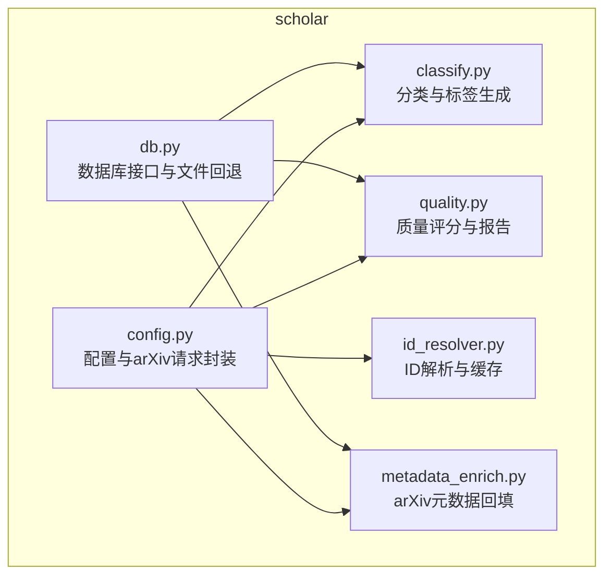
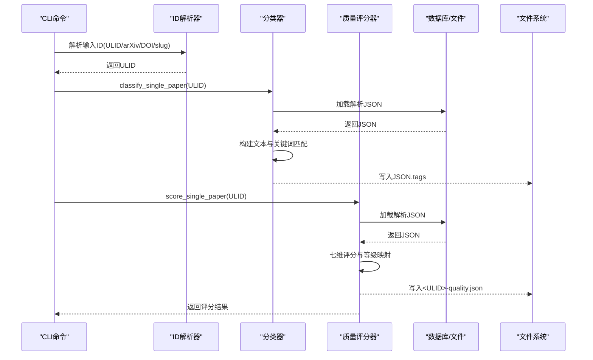
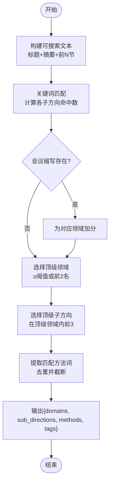
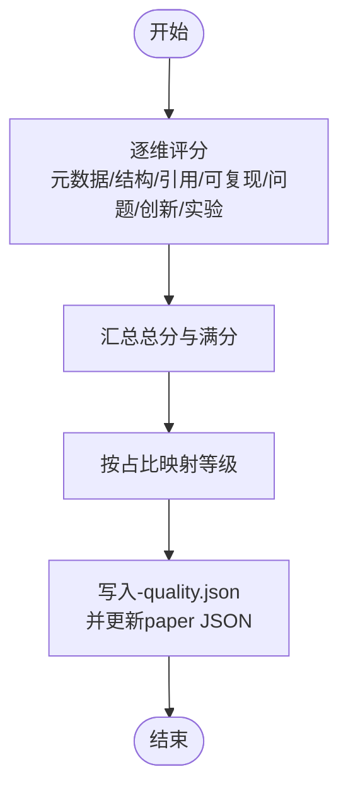
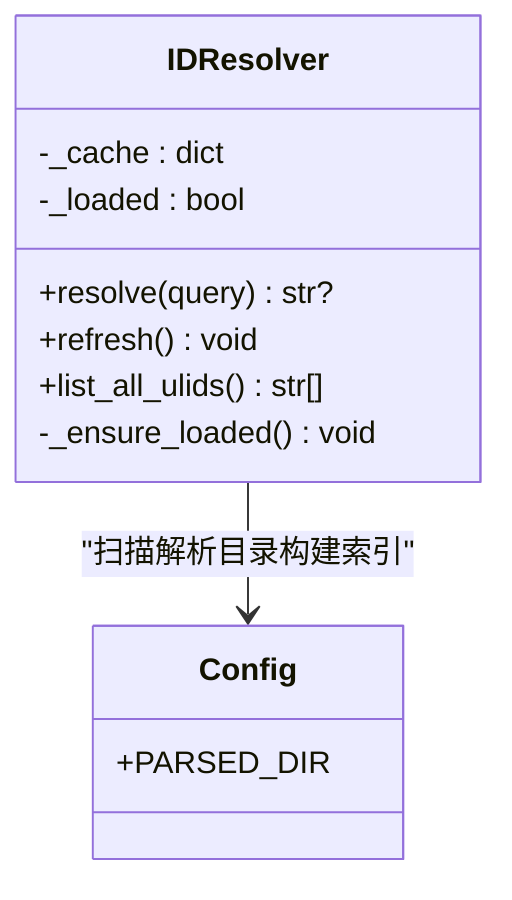
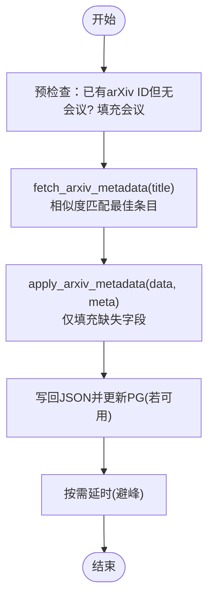
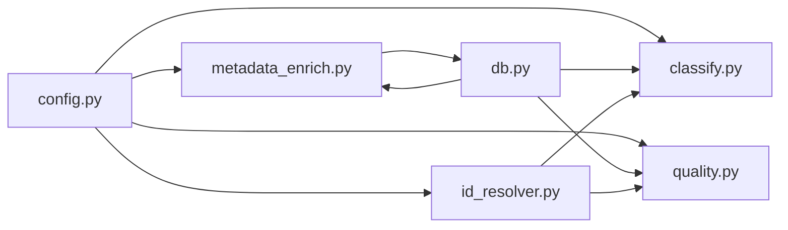

# 分类与质量控制

<cite>
**本文档引用的文件**
- [scholar/classify.py](file://scholar/classify.py)
- [scholar/quality.py](file://scholar/quality.py)
- [scholar/id_resolver.py](file://scholar/id_resolver.py)
- [scholar/metadata_enrich.py](file://scholar/metadata_enrich.py)
- [scholar/db.py](file://scholar/db.py)
- [scholar/config.py](file://scholar/config.py)
- [test/test_id_resolver.py](file://test/test_id_resolver.py)
- [plugin/commands/paper.md](file://plugin/commands/paper.md)
- [plugin/commands/health.md](file://plugin/commands/health.md)
- [plugin/skills/review-report/README.md](file://plugin/skills/review-report/README.md)
</cite>

## 目录
1. [简介](#简介)
2. [项目结构](#项目结构)
3. [核心组件](#核心组件)
4. [架构总览](#架构总览)
5. [详细组件分析](#详细组件分析)
6. [依赖关系分析](#依赖关系分析)
7. [性能考量](#性能考量)
8. [故障排查指南](#故障排查指南)
9. [结论](#结论)
10. [附录](#附录)

## 简介
本文件面向“分类与质量控制”模块，系统阐述论文自动分类算法、质量评估标准与ID解析机制的设计原理与实现细节。内容覆盖：
- 分类模型设计：基于规则引擎、关键词匹配与会议归属提示的多层级标签体系
- 质量评分体系：七维质量指标与等级映射
- ID解析策略：统一ID解析器，支持ULID、arXiv、DOI、slug，并内置缓存与归一化
- 数据完整性与异常检测：元数据完整性、结构质量、引用密度、可复现性信号、问题定义清晰度、创新性与实验严谨性
- 报告生成与人工审核：质量报告输出、分级统计与CLI交互

## 项目结构
该模块位于Python包scholar下，围绕“解析后的论文JSON”进行批处理与单篇处理，配合配置与数据库层实现持久化与查询。

图表来源
- [scholar/config.py:1-119](file://scholar/config.py#L1-L119)
- [scholar/db.py:1-276](file://scholar/db.py#L1-L276)
- [scholar/classify.py:1-328](file://scholar/classify.py#L1-L328)
- [scholar/quality.py:1-432](file://scholar/quality.py#L1-L432)
- [scholar/id_resolver.py:1-107](file://scholar/id_resolver.py#L1-L107)
- [scholar/metadata_enrich.py:1-312](file://scholar/metadata_enrich.py#L1-L312)

章节来源
- [scholar/config.py:1-119](file://scholar/config.py#L1-L119)
- [scholar/db.py:1-276](file://scholar/db.py#L1-L276)

## 核心组件
- 分类器（classify.py）：构建可搜索文本，基于关键词计分与会议提示，输出多层级标签（领域、子方向、方法），并支持批量与单篇处理
- 质量评分器（quality.py）：按七维指标评分并汇总，输出总分、满分与等级
- ID解析器（id_resolver.py）：统一解析ULID、arXiv、DOI、slug，带内存缓存与首次扫描构建索引
- 元数据增强（metadata_enrich.py）：基于arXiv API批量回填arXiv ID、DOI、作者、年份等
- 数据库接口（db.py）：PostgreSQL可选存储与文件回退，提供论文增删改查与统计

章节来源
- [scholar/classify.py:161-327](file://scholar/classify.py#L161-L327)
- [scholar/quality.py:317-431](file://scholar/quality.py#L317-L431)
- [scholar/id_resolver.py:15-107](file://scholar/id_resolver.py#L15-L107)
- [scholar/metadata_enrich.py:80-312](file://scholar/metadata_enrich.py#L80-L312)
- [scholar/db.py:24-276](file://scholar/db.py#L24-L276)

## 架构总览
整体工作流：解析后的论文JSON经分类与质量评分，生成标签与质量报告；ID解析器统一查询入口；元数据增强提升数据完整性；数据库层持久化与查询。

图表来源
- [scholar/id_resolver.py:99-106](file://scholar/id_resolver.py#L99-L106)
- [scholar/classify.py:277-293](file://scholar/classify.py#L277-L293)
- [scholar/quality.py:405-431](file://scholar/quality.py#L405-L431)
- [scholar/db.py:248-276](file://scholar/db.py#L248-L276)

## 详细组件分析

### 分类算法与标签体系
- 多层级标签
  - 一级：领域（如NLP、CV、RL、ML、Safety、Multimodal、Systems）
  - 二级：子方向（如语言建模、目标检测、策略优化等）
  - 三级：具体方法（如Transformer、ResNet、DQN等）
- 文本构建与关键词匹配
  - 从标题、摘要与前若干节标题/内容构建可搜索文本
  - 对每个子方向计算命中关键词数量作为得分
  - 选择得分≥阈值或前两名的领域，再筛选对应领域的子方向
  - 提取匹配到的方法词并去重，限制输出数量
- 会议归属提示
  - 基于会议缩写到领域的映射，为特定领域提供额外权重
- 批量与统计
  - 支持遍历解析目录，批量写入标签并统计领域分布
  - 提供聚合统计接口，输出领域、子方向与方法的频次

图表来源
- [scholar/classify.py:161-238](file://scholar/classify.py#L161-L238)
- [scholar/classify.py:245-327](file://scholar/classify.py#L245-L327)

章节来源
- [scholar/classify.py:26-154](file://scholar/classify.py#L26-L154)
- [scholar/classify.py:161-238](file://scholar/classify.py#L161-L238)
- [scholar/classify.py:245-327](file://scholar/classify.py#L245-L327)

### 质量评分体系与异常检测
- 七维评分
  - 元数据完整性：标题、作者、年份、会议、摘要长度
  - 结构质量：节数量、关键节覆盖、层级多样性
  - 引用密度：引用总数分级
  - 可复现性信号：代码链接、数据集、超参、实现细节、检查点
  - 问题定义清晰度：明确的问题陈述、挑战、动机、目标、任务定义
  - 创新性信号：新颖性声明、与既有工作对比、贡献表述、消融分析
  - 实验严谨性：基准、指标、统计分析、基线、结果表格/图
- 等级映射
  - 总分占比阈值映射到A/B/C/D/F等级
- 批量处理
  - 遍历解析目录，生成质量JSON并更新paper JSON中的质量字段，统计等级分布

图表来源
- [scholar/quality.py:317-356](file://scholar/quality.py#L317-L356)
- [scholar/quality.py:363-431](file://scholar/quality.py#L363-L431)

章节来源
- [scholar/quality.py:28-314](file://scholar/quality.py#L28-L314)
- [scholar/quality.py:317-356](file://scholar/quality.py#L317-L356)
- [scholar/quality.py:363-431](file://scholar/quality.py#L363-L431)

### ID解析机制与跨数据库标识符映射
- 支持格式
  - ULID（内部唯一ID）、arXiv ID、DOI、slug（文章别名）
- 解析策略
  - 精确匹配：直接命中任一ID格式
  - 归一化：arXiv ID去除版本后匹配；DOI URL标准化为10.xxxx
  - slug模糊匹配：对不含“10.”且形如arXiv ID的键不参与slug匹配
- 缓存与延迟加载
  - 首次解析时扫描解析目录构建内存缓存
  - 提供刷新接口，清空缓存以便重建
- 单例与便捷函数
  - 全局实例与便捷resolve_id函数

图表来源
- [scholar/id_resolver.py:15-107](file://scholar/id_resolver.py#L15-L107)
- [scholar/config.py:23-42](file://scholar/config.py#L23-L42)

章节来源
- [scholar/id_resolver.py:15-107](file://scholar/id_resolver.py#L15-L107)
- [test/test_id_resolver.py:14-140](file://test/test_id_resolver.py#L14-L140)

### 元数据增强与去重策略
- arXiv元数据回填
  - 基于标题相似度（Jaccard）匹配最佳条目，提取arXiv ID、DOI、作者、年份、会议
  - 仅填充缺失字段，避免覆盖既有数据
- 批量处理
  - 预检查：对已有arXiv ID但无会议的论文先行填充会议
  - 限速：遵循arXiv速率限制，避免触发限流
  - 统计：记录处理总数、已存在、无匹配、无标题、错误等

图表来源
- [scholar/metadata_enrich.py:186-312](file://scholar/metadata_enrich.py#L186-L312)
- [scholar/metadata_enrich.py:80-132](file://scholar/metadata_enrich.py#L80-L132)
- [scholar/metadata_enrich.py:134-158](file://scholar/metadata_enrich.py#L134-L158)

章节来源
- [scholar/metadata_enrich.py:80-132](file://scholar/metadata_enrich.py#L80-L132)
- [scholar/metadata_enrich.py:134-158](file://scholar/metadata_enrich.py#L134-L158)
- [scholar/metadata_enrich.py:186-312](file://scholar/metadata_enrich.py#L186-L312)

### 数据完整性验证与异常检测
- 元数据完整性
  - 质量评分器对标题、作者、年份、会议、摘要长度进行校验
- 结构质量
  - 节数量、关键节覆盖、层级多样性
- 引用密度
  - 引用总数分级，无引用将被标记
- 可复现性信号
  - 代码链接、数据集、超参、实现细节、检查点
- 问题定义与实验严谨性
  - 明确的问题陈述、挑战、动机、目标、任务定义；基准、指标、统计分析、基线、结果呈现
- 健康检查
  - 健康命令提供元数据覆盖率、数据库一致性、图谱连通性、RAG索引状态等检查要点

章节来源
- [scholar/quality.py:28-314](file://scholar/quality.py#L28-L314)
- [plugin/commands/health.md:1-13](file://plugin/commands/health.md#L1-L13)

### 报告生成与人工审核接口
- 质量报告
  - 生成<ULID>-quality.json，包含各维度得分、总分、等级与详情
  - CLI命令支持单篇与批量评分，展示维度明细与等级分布
- 分类报告
  - 生成paper JSON的tags字段，包含领域、子方向与方法标签
  - 提供聚合统计接口，输出各类标签频次
- 人工审核
  - 插件技能提供结构化同行评审流程，结合质量评分与笔记进行深度分析

章节来源
- [scholar/quality.py:363-431](file://scholar/quality.py#L363-L431)
- [plugin/commands/paper.md:1-11](file://plugin/commands/paper.md#L1-L11)
- [plugin/skills/review-report/README.md:1-38](file://plugin/skills/review-report/README.md#L1-L38)

## 依赖关系分析
- 模块耦合
  - classify.py与quality.py均依赖config.py提供的解析目录与笔记目录
  - id_resolver.py依赖config.PARSED_DIR进行首次扫描构建缓存
  - metadata_enrich.py依赖config.arxiv_request进行API请求
  - db.py为分类与质量评分提供文件回退能力
- 外部依赖
  - PostgreSQL（可选）：通过psycopg2连接，提供论文、章节、公式、引用的结构化存储
  - arXiv API：用于元数据增强与标题匹配
  - 文件系统：解析目录与笔记目录用于读写JSON

图表来源
- [scholar/config.py:1-119](file://scholar/config.py#L1-L119)
- [scholar/db.py:1-276](file://scholar/db.py#L1-L276)
- [scholar/classify.py:19](file://scholar/classify.py#L19)
- [scholar/quality.py:21](file://scholar/quality.py#L21)
- [scholar/id_resolver.py:12](file://scholar/id_resolver.py#L12)
- [scholar/metadata_enrich.py:14](file://scholar/metadata_enrich.py#L14)

章节来源
- [scholar/config.py:1-119](file://scholar/config.py#L1-L119)
- [scholar/db.py:1-276](file://scholar/db.py#L1-L276)

## 性能考量
- 分类与评分复杂度
  - 分类：对每个子方向进行关键词计数，时间复杂度近似O(N×M)，N为子方向数，M为关键词数；空间复杂度O(K)（K为命中方法数）
  - 质量评分：逐维正则匹配与统计，时间复杂度近似O(L)，L为文本长度；空间复杂度O(1)
- 缓存与I/O
  - ID解析器首次扫描构建内存缓存，后续解析为O(1)查找；批量处理时建议避免重复刷新缓存
  - 元数据增强遵循arXiv速率限制，批量处理时注意延时参数
- 存储与回退
  - 数据库不可用时自动回退至文件系统，确保批处理连续性

## 故障排查指南
- 分类/评分失败
  - 检查解析JSON是否包含必需字段（标题、摘要、sections等）
  - 确认解析目录路径与权限
- ID解析失败
  - 确认输入ID格式（ULID、arXiv、DOI、slug）
  - 如需重建缓存，调用刷新接口
- 元数据增强失败
  - 检查arXiv API可达性与速率限制
  - 确认标题字段非空且可匹配
- 健康检查
  - 使用健康命令检查元数据覆盖率、数据库一致性、图谱连通性与RAG索引状态

章节来源
- [plugin/commands/health.md:1-13](file://plugin/commands/health.md#L1-L13)
- [test/test_id_resolver.py:14-140](file://test/test_id_resolver.py#L14-L140)

## 结论
该模块通过规则驱动的分类与七维质量评分，结合统一ID解析与arXiv元数据增强，实现了从数据到标签与质量报告的自动化流水线。其设计强调可扩展性（新增关键词与评分维度）、可维护性（清晰的模块边界与测试覆盖）与可观测性（详尽的统计与报告）。建议在生产环境中：
- 持续维护关键词词典与会议映射
- 结合人工审核与领域专家反馈迭代评分阈值
- 在大规模批处理时合理设置缓存与限速策略

## 附录
- CLI集成
  - 分类与质量评分命令支持单篇与批量模式，便于与工作流集成
- 报告输出
  - 质量报告与标签分别写入notes与parsed目录，便于后续阅读与审计

章节来源
- [plugin/commands/paper.md:1-11](file://plugin/commands/paper.md#L1-L11)
- [scholar/quality.py:363-431](file://scholar/quality.py#L363-L431)
- [scholar/classify.py:245-327](file://scholar/classify.py#L245-L327)