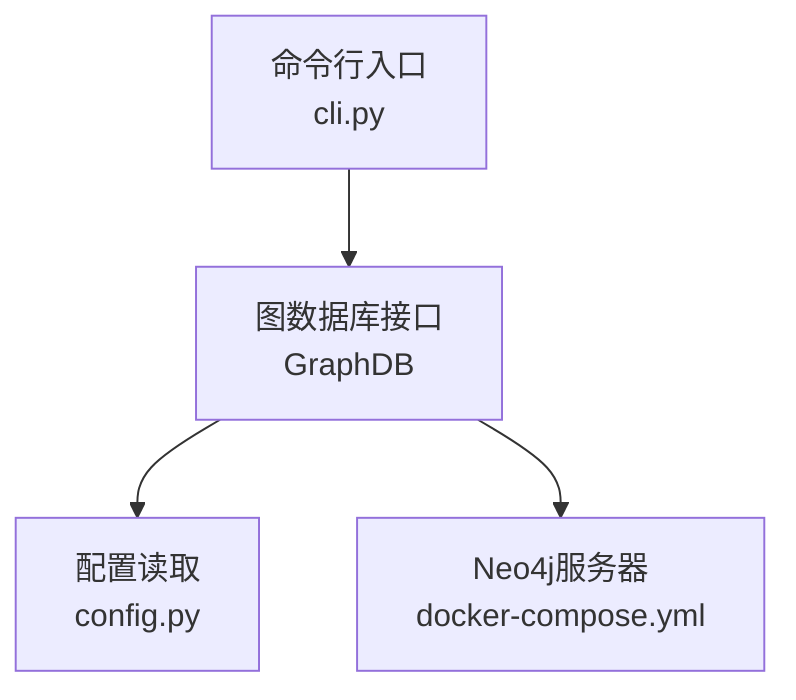
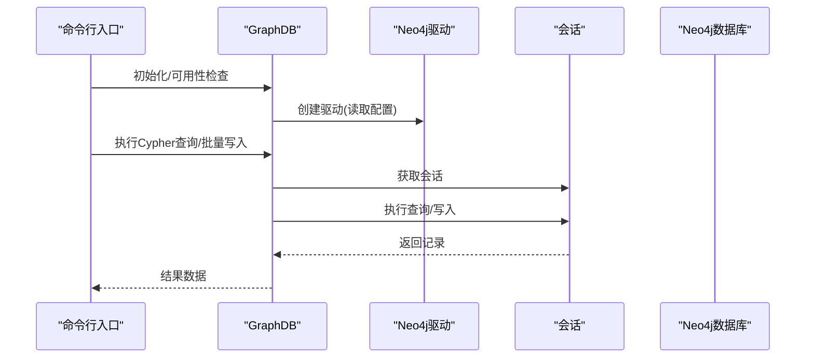
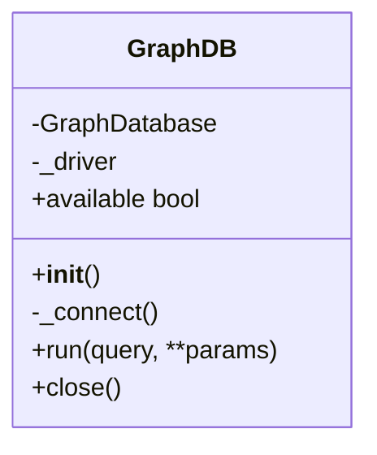
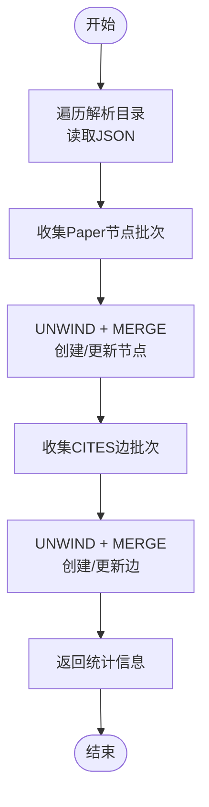
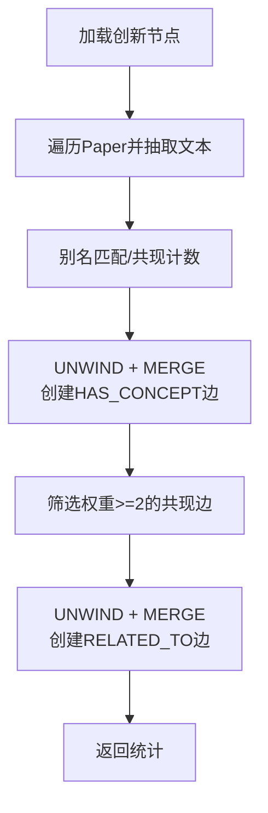
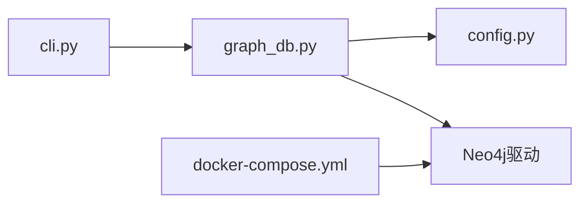

# 图数据库集成

<cite>
**本文引用的文件**
- [graph_db.py](file://scholar/graph_db.py)
- [config.py](file://scholar/config.py)
- [cli.py](file://scholar/cli.py)
- [docker-compose.yml](file://infra/docker-compose.yml)
</cite>

## 目录
1. [简介](#简介)
2. [项目结构](#项目结构)
3. [核心组件](#核心组件)
4. [架构总览](#架构总览)
5. [详细组件分析](#详细组件分析)
6. [依赖分析](#依赖分析)
7. [性能考虑](#性能考虑)
8. [故障排除指南](#故障排除指南)
9. [结论](#结论)
10. [附录](#附录)

## 简介
本文件面向“图数据库集成模块”，聚焦于Neo4j图数据库在项目中的连接配置、驱动初始化、会话管理与连接池机制，以及GraphDB类的设计架构（连接状态管理、异常处理与资源清理）。文档还覆盖图数据库可用性检测、连接重试逻辑与性能监控建议，并提供Cypher查询执行机制、批量操作优化与事务管理策略说明。最后给出配置示例、环境变量设置与故障排除指南。

## 项目结构
本模块位于 scholar/graph_db.py，围绕Neo4j提供以下能力：
- 连接层：GraphDB类负责导入驱动、建立连接、执行Cypher查询、关闭连接
- 构建层：引用网络构建、概念图构建、创新图同步
- 查询层：引用统计、引文路径、桥接论文、概念检索等
- 配置层：通过环境变量注入Neo4j连接参数
- 可选运行支撑：通过docker-compose提供Neo4j服务

图表来源
- [cli.py](file://scholar/cli.py)
- [graph_db.py](file://scholar/graph_db.py)
- [config.py](file://scholar/config.py)
- [docker-compose.yml](file://infra/docker-compose.yml)

章节来源
- [graph_db.py](file://scholar/graph_db.py)
- [config.py](file://scholar/config.py)
- [cli.py](file://scholar/cli.py)
- [docker-compose.yml](file://infra/docker-compose.yml)

## 核心组件
- GraphDB类：封装Neo4j驱动导入、连接建立、会话执行与资源关闭；提供可用性检测方法；支持批量Cypher执行
- 引用网络构建：从解析后的JSON数据创建Paper节点与CITES边，支持ref_key规范化与模糊匹配
- 概念图构建：基于文本别名映射与TF-IDF思想匹配创新概念，生成HAS_CONCEPT与RELATED_TO关系
- 创新图同步：从Lean4源码动态提取创新节点与替换关系，写入Neo4j
- 查询接口：提供统计、引文路径、桥接论文、概念子图等查询函数

章节来源
- [graph_db.py](file://scholar/graph_db.py)

## 架构总览
下图展示调用链与数据流：CLI触发构建或查询，GraphDB通过配置读取连接参数，使用会话执行Cypher，Neo4j返回结果。

图表来源
- [graph_db.py](file://scholar/graph_db.py)
- [config.py](file://scholar/config.py)

## 详细组件分析

### GraphDB类设计与实现
- 导入策略：延迟导入neo4j.GraphDatabase，避免未安装依赖时启动失败
- 连接状态：单例驱动缓存，首次调用时建立连接
- 会话管理：每次执行使用独立会话，确保线程安全与资源隔离
- 资源清理：显式关闭驱动，释放底层连接
- 可用性检测：尝试建立驱动并执行简单查询以判断可达性

图表来源
- [graph_db.py](file://scholar/graph_db.py)

章节来源
- [graph_db.py](file://scholar/graph_db.py)

### 引用网络构建流程
- 步骤一：批量创建Paper节点（MERGE去重），设置属性
- 步骤二：批量创建CITES边（MERGE去重）
- 支持批处理大小控制，减少网络往返与事务开销

图表来源
- [graph_db.py](file://scholar/graph_db.py)

章节来源
- [graph_db.py](file://scholar/graph_db.py)

### 概念图构建与匹配
- 动态加载创新节点：优先从Lean4源码解析，失败则回退到内置种子数据
- 文本匹配：基于别名集合进行关键词匹配，计算共现权重，生成RELATED_TO边
- 批量写入：统一使用UNWIND批处理，提升吞吐

图表来源
- [graph_db.py](file://scholar/graph_db.py)

章节来源
- [graph_db.py](file://scholar/graph_db.py)

### 创新图同步（Lean4 REPLACES）
- 从Lean4数据库文件中提取REPLACES关系，写入Neo4j
- 失败时回退到硬编码关系列表

章节来源
- [graph_db.py](file://scholar/graph_db.py)

### 查询接口与统计
- 引用统计：节点/边总数、最被引用/最活跃作者
- 引文路径：使用最短路径算法查找两篇论文间的引用路径
- 桥接论文：基于入度/出度组合评分近似中心性
- 概念查询：按概念检索论文、相关概念、时间线与子图

章节来源
- [graph_db.py](file://scholar/graph_db.py)

## 依赖分析
- 内部依赖：GraphDB依赖配置模块读取连接参数；CLI在命令执行前进行可用性检查
- 外部依赖：Neo4j Python驱动（延迟导入），Docker Compose提供Neo4j服务
- 运行时耦合：GraphDB与Neo4j之间为直接驱动调用，无中间抽象层

图表来源
- [cli.py](file://scholar/cli.py)
- [graph_db.py](file://scholar/graph_db.py)
- [config.py](file://scholar/config.py)
- [docker-compose.yml](file://infra/docker-compose.yml)

章节来源
- [cli.py](file://scholar/cli.py)
- [graph_db.py](file://scholar/graph_db.py)
- [config.py](file://scholar/config.py)
- [docker-compose.yml](file://infra/docker-compose.yml)

## 性能考虑
- 批量写入：多处使用UNWIND + MERGE模式，分批提交（默认批大小为100），降低网络往返与事务开销
- 会话复用：每次执行新建会话，避免跨请求共享状态引发的并发问题
- 连接复用：驱动采用单例缓存，减少重复握手成本
- 查询优化：对高频统计与路径查询使用索引友好的过滤条件（如按年份、属性存在性）
- 资源回收：显式关闭驱动，避免连接泄漏

章节来源
- [graph_db.py](file://scholar/graph_db.py)

## 故障排除指南
- Neo4j不可用
  - 现象：GraphDB.available为False，CLI提示无法连接
  - 排查：确认Neo4j服务已启动，端口可达；检查环境变量是否正确
- 认证失败
  - 现象：连接抛出认证异常
  - 排查：核对用户名/密码；确认容器内初始密码与配置一致
- 驱动缺失
  - 现象：模块导入成功但GraphDB不可用
  - 排查：安装neo4j驱动；或在环境中禁用图功能
- 连接超时/不稳定
  - 建议：增加批处理大小以减少往返；在应用侧增加重试与指数退避
- 资源泄漏
  - 建议：确保在生命周期结束时调用close()；避免长期持有驱动实例

章节来源
- [graph_db.py](file://scholar/graph_db.py)
- [cli.py](file://scholar/cli.py)
- [docker-compose.yml](file://infra/docker-compose.yml)

## 结论
本模块以轻量、可扩展的方式实现了Neo4j的连接与查询能力，结合批处理与会话隔离策略，在保证稳定性的同时兼顾性能。通过配置驱动化与可用性检测，系统可在缺失依赖或服务不可达时优雅降级。建议在生产环境中引入连接池、重试与监控机制，并为高频查询建立索引以进一步提升性能。

## 附录

### 配置示例与环境变量
- Neo4j连接参数
  - SCHOLAR_NEO4J_URI：Neo4j Bolt地址，默认值见配置文件
  - SCHOLAR_NEO4J_USER：用户名，默认值见配置文件
  - SCHOLAR_NEO4J_PASS：密码，默认值见配置文件
- Docker Compose
  - 容器镜像：neo4j:5-community
  - 默认认证：neo4j/scholar2024
  - 数据卷：持久化数据目录
  - 健康检查：容器内neo4j状态检查

章节来源
- [config.py](file://scholar/config.py)
- [docker-compose.yml](file://infra/docker-compose.yml)

### Cypher执行与事务管理
- 执行模型：GraphDB.run每次调用创建独立会话，执行后自动释放
- 事务语义：未显式开启事务时，驱动默认在会话内执行单条语句；批量写入通过UNWIND + MERGE在单次会话内完成
- 事务建议：对于需要强一致性的多步写入，可在应用层合并为单条Cypher语句或使用显式事务块（需根据具体驱动版本特性）

章节来源
- [graph_db.py](file://scholar/graph_db.py)