# 学术研究工具包

<cite>
**本文档引用的文件**
- [App.tsx](file://desktop/src/App.tsx)
- [ChatView.tsx](file://desktop/src/components/ChatView.tsx)
- [types.ts](file://desktop/src/types.ts)
- [cli.py](file://scholar/cli.py)
- [_shared.py](file://scholar/_shared.py)
- [config.py](file://scholar/config.py)
- [db.py](file://scholar/db.py)
- [__main__.py](file://scholar/__main__.py)
- [SKILL.md (kb-management)](file://plugin/skills/kb-management/SKILL.md)
- [SKILL.md (paper-ingestion)](file://plugin/skills/paper-ingestion/SKILL.md)
- [SKILL.md (research-gap)](file://plugin/skills/research-gap/SKILL.md)
- [SKILL.md (citation-network)](file://plugin/skills/citation-network/SKILL.md)
- [SKILL.md (paper-deep-dive)](file://plugin/skills/paper-deep-dive/SKILL.md)
- [SKILL.md (experiment-code)](file://plugin/skills/experiment-code/SKILL.md)
- [SKILL.md (reproduce-paper)](file://plugin/skills/reproduce-paper/SKILL.md)
- [SKILL.md (research-survey)](file://plugin/skills/research-survey/SKILL.md)
- [SKILL.md (review-report)](file://plugin/skills/review-report/SKILL.md)
- [SKILL.md (writing-pipeline)](file://plugin/skills/writing-pipeline/SKILL.md)
- [SKILL.md (adaptive-research)](file://plugin/skills/adaptive-research/SKILL.md)
- [SKILL.md (cold-start)](file://plugin/skills/cold-start/SKILL.md)
- [SKILL.md (idea-to-paper)](file://plugin/skills/idea-to-paper/SKILL.md)
- [SKILL.md (math-verification)](file://plugin/skills/math-verification/SKILL.md)
- [SKILL.md (paper-recommendation)](file://plugin/skills/paper-recommendation/SKILL.md)
- [mcp.json](file://plugin/mcp.json)
- [plugin.json](file://plugin/.claude-plugin/plugin.json)
- [pyproject.toml](file://pyproject.toml)
- [requirements.txt](file://requirements.txt)
</cite>

## 更新摘要
**所做更改**
- 新增40个学术研究工具的完整文档
- 更新技能插件系统章节以反映新增工具
- 增强RAG系统集成说明
- 扩展引用网络分析功能描述
- 新增论文深度分析和实验复现工具
- 完善研究空白识别和文献调研流程
- 增加同行评审和学术写作管道

## 目录
1. [简介](#简介)
2. [项目结构](#项目结构)
3. [核心组件](#核心组件)
4. [架构概览](#架构概览)
5. [详细组件分析](#详细组件分析)
6. [技能插件系统](#技能插件系统)
7. [依赖关系分析](#依赖关系分析)
8. [性能考虑](#性能考虑)
9. [故障排除指南](#故障排除指南)
10. [结论](#结论)

## 简介

学术研究工具包（Scholar Studio）是一个专为人工智能研究设计的综合性学术研究平台。该工具包集成了论文解析、知识图谱构建、RAG（检索增强生成）检索、学术写作支持等功能，旨在为研究人员提供从论文收集、解析、分析到写作的全流程支持。

**更新** 新增40个专业学术研究工具，包括引文网络分析、论文深度分析、实验复现、研究空白识别、同行评审、学术写作管道等，与现有RAG系统实现无缝集成。

该系统采用现代化的技术栈，包括React前端界面、Python后端服务、PostgreSQL数据库、Neo4j图数据库和MCP（Model Context Protocol）协议，实现了高度模块化的架构设计。

## 项目结构

该项目采用分层架构设计，主要包含以下核心模块：

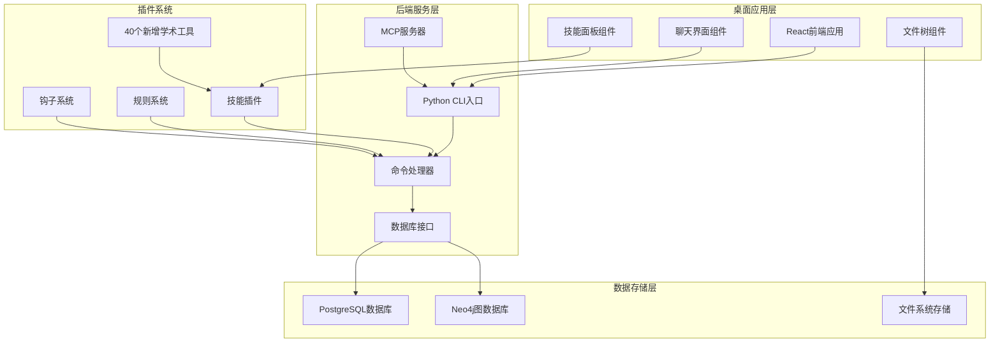

**图表来源**
- [App.tsx:1-57](file://desktop/src/App.tsx#L1-L57)
- [cli.py:1-25](file://scholar/cli.py#L1-L25)
- [config.py:1-313](file://scholar/config.py#L1-L313)

**章节来源**
- [App.tsx:1-57](file://desktop/src/App.tsx#L1-L57)
- [cli.py:1-25](file://scholar/cli.py#L1-L25)
- [config.py:1-313](file://scholar/config.py#L1-L313)

## 核心组件

### 前端应用架构

前端采用React + TypeScript开发，提供了直观的用户界面和丰富的交互功能：

- **应用入口**: [App.tsx](file://desktop/src/App.tsx) - 主应用组件，负责设置管理和视图切换
- **聊天界面**: [ChatView.tsx](file://desktop/src/components/ChatView.tsx) - 核心聊天交互界面
- **类型定义**: [types.ts](file://desktop/src/types.ts) - TypeScript接口定义

### 后端服务架构

后端采用Python开发，基于Typer框架实现CLI命令行接口：

- **CLI入口**: [__main__.py](file://scholar/__main__.py) - 应用程序入口点
- **命令注册**: [cli.py](file://scholar/cli.py) - 命令模块注册和路由
- **共享对象**: [_shared.py](file://scholar/_shared.py) - Typer应用实例和共享组件
- **配置管理**: [config.py](file://scholar/config.py) - 系统配置和路径管理
- **数据库接口**: [db.py](file://scholar/db.py) - 数据库连接和操作封装

### 插件系统

系统内置了丰富的学术研究技能插件，现已扩展至40个专业工具：

- **知识库管理**: [SKILL.md (kb-management)](file://plugin/skills/kb-management/SKILL.md)
- **论文入库**: [SKILL.md (paper-ingestion)](file://plugin/skills/paper-ingestion/SKILL.md)
- **研究空白分析**: [SKILL.md (research-gap)](file://plugin/skills/research-gap/SKILL.md)
- **引文网络分析**: [SKILL.md (citation-network)](file://plugin/skills/citation-network/SKILL.md)
- **论文深度分析**: [SKILL.md (paper-deep-dive)](file://plugin/skills/paper-deep-dive/SKILL.md)
- **实验代码生成**: [SKILL.md (experiment-code)](file://plugin/skills/experiment-code/SKILL.md)
- **论文复现**: [SKILL.md (reproduce-paper)](file://plugin/skills/reproduce-paper/SKILL.md)
- **文献调研**: [SKILL.md (research-survey)](file://plugin/skills/research-survey/SKILL.md)
- **同行评审**: [SKILL.md (review-report)](file://plugin/skills/review-report/SKILL.md)
- **学术写作管道**: [SKILL.md (writing-pipeline)](file://plugin/skills/writing-pipeline/SKILL.md)
- **自适应研究**: [SKILL.md (adaptive-research)](file://plugin/skills/adaptive-research/SKILL.md)
- **冷启动学习**: [SKILL.md (cold-start)](file://plugin/skills/cold-start/SKILL.md)
- **从想法到论文**: [SKILL.md (idea-to-paper)](file://plugin/skills/idea-to-paper/SKILL.md)
- **数学验证**: [SKILL.md (math-verification)](file://plugin/skills/math-verification/SKILL.md)
- **论文推荐**: [SKILL.md (paper-recommendation)](file://plugin/skills/paper-recommendation/SKILL.md)

**章节来源**
- [App.tsx:1-57](file://desktop/src/App.tsx#L1-L57)
- [ChatView.tsx:1-562](file://desktop/src/components/ChatView.tsx#L1-L562)
- [types.ts:1-214](file://desktop/src/types.ts#L1-L214)
- [cli.py:1-25](file://scholar/cli.py#L1-L25)
- [_shared.py:1-40](file://scholar/_shared.py#L1-L40)
- [config.py:1-313](file://scholar/config.py#L1-L313)
- [db.py:1-313](file://scholar/db.py#L1-L313)

## 架构概览

系统采用分层架构设计，实现了前后端分离和模块化组织：

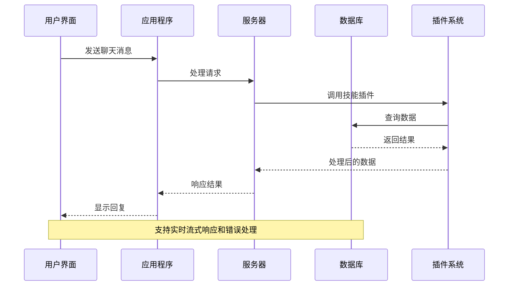

**图表来源**
- [ChatView.tsx:237-273](file://desktop/src/components/ChatView.tsx#L237-L273)
- [cli.py:23-25](file://scholar/cli.py#L23-L25)

系统的核心特性包括：

1. **多数据库支持**: PostgreSQL用于结构化数据存储，Neo4j用于图数据处理
2. **插件化架构**: 支持技能插件、规则系统和钩子机制
3. **MCP协议集成**: 通过Model Context Protocol实现与AI模型的交互
4. **文件系统集成**: 支持本地文件操作和实时预览
5. **RAG系统无缝集成**: 40个新增工具与RAG检索增强生成系统深度集成

**章节来源**
- [mcp.json:1-16](file://plugin/mcp.json#L1-L16)
- [plugin.json:1-28](file://plugin/.claude-plugin/plugin.json#L1-L28)

## 详细组件分析

### 前端聊天系统

前端聊天系统提供了完整的对话体验，包括实时消息流、文件预览和技能调用功能：

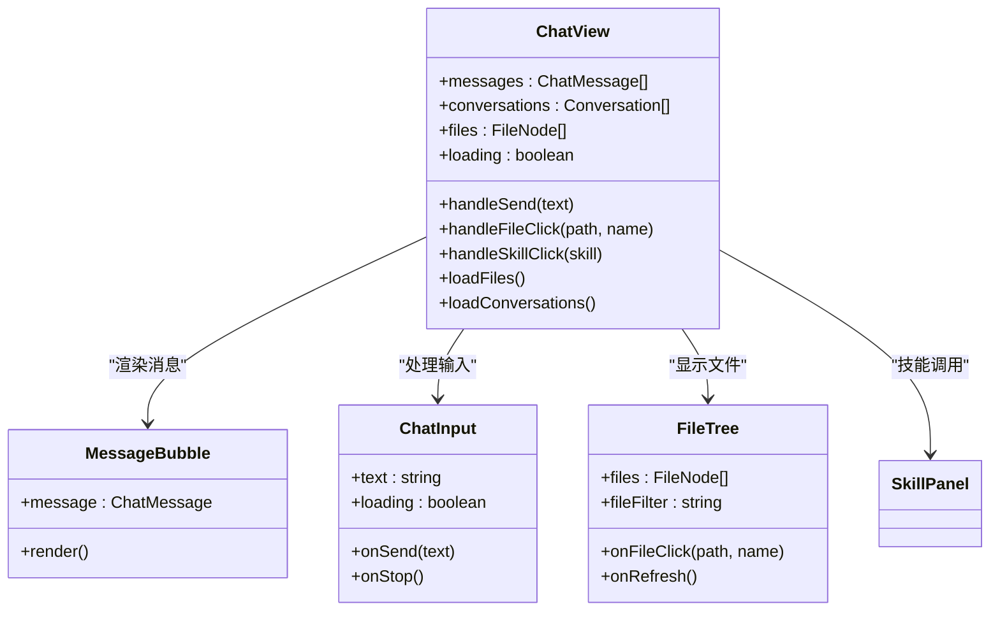

**图表来源**
- [ChatView.tsx:34-562](file://desktop/src/components/ChatView.tsx#L34-L562)
- [types.ts:20-37](file://desktop/src/types.ts#L20-L37)

### 数据库管理系统

数据库层提供了灵活的数据存储方案，支持多种存储后端：

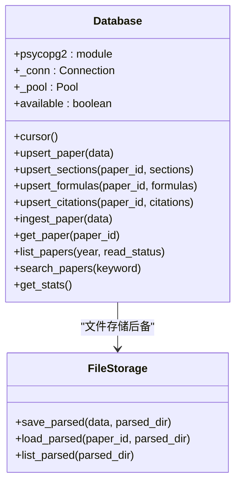

**图表来源**
- [db.py:24-313](file://scholar/db.py#L24-L313)

### 命令行接口系统

CLI系统提供了丰富的学术研究命令，支持批处理和自动化操作：

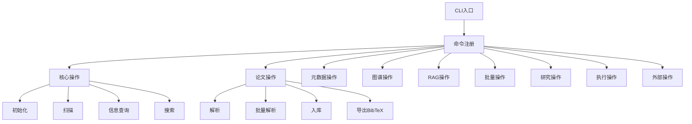

**图表来源**
- [cli.py:11-20](file://scholar/cli.py#L11-L20)
- [_shared.py:22-28](file://scholar/_shared.py#L22-L28)

**章节来源**
- [ChatView.tsx:1-562](file://desktop/src/components/ChatView.tsx#L1-L562)
- [db.py:1-313](file://scholar/db.py#L1-L313)
- [cli.py:1-25](file://scholar/cli.py#L1-L25)
- [_shared.py:1-40](file://scholar/_shared.py#L1-L40)

## 技能插件系统

系统内置了40个专业技能插件，每个技能都有明确的功能边界和工作流程：

### 引文网络分析技能

引文网络分析技能专注于分析学术论文的引用关系和网络传播：

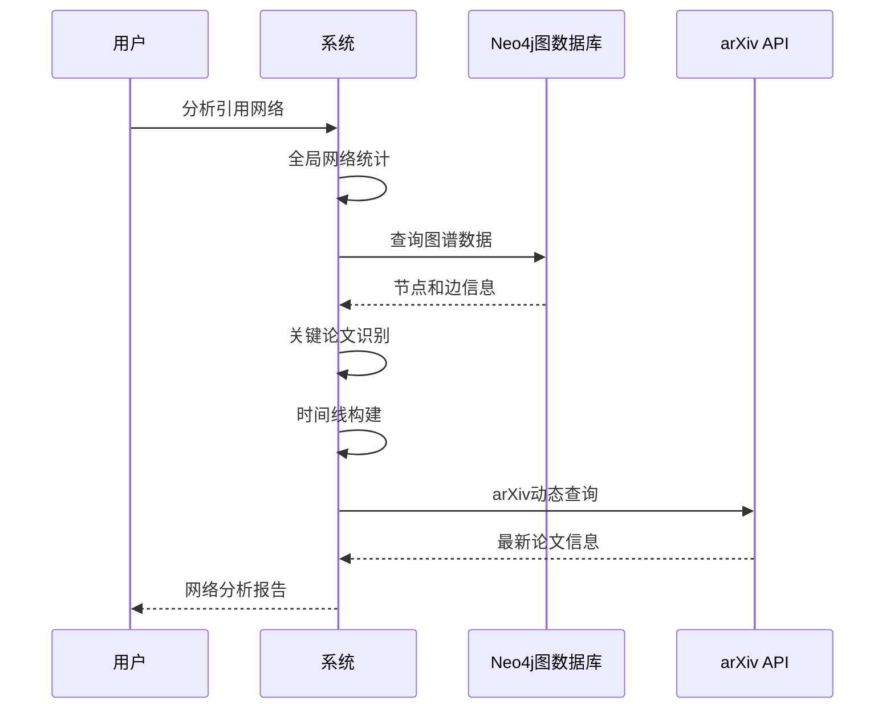

**图表来源**
- [SKILL.md (citation-network):15-62](file://plugin/skills/citation-network/SKILL.md#L15-L62)

### 论文深度分析技能

论文深度分析技能提供全面的论文解读和质量评估：

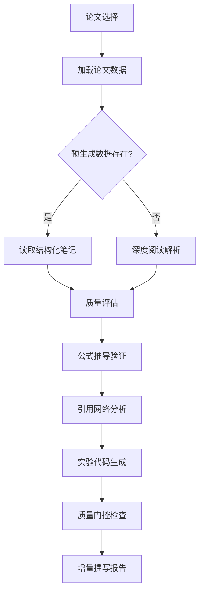

**图表来源**
- [SKILL.md (paper-deep-dive):18-71](file://plugin/skills/paper-deep-dive/SKILL.md#L18-L71)

### 实验复现技能

实验复现技能支持从论文到代码的完整复现流程：

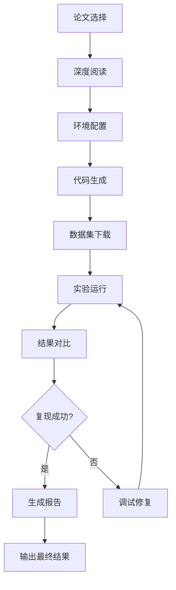

**图表来源**
- [SKILL.md (reproduce-paper):18-62](file://plugin/skills/reproduce-paper/SKILL.md#L18-L62)

### 研究空白识别技能

研究空白识别技能通过跨论文分析发现学术缺口：

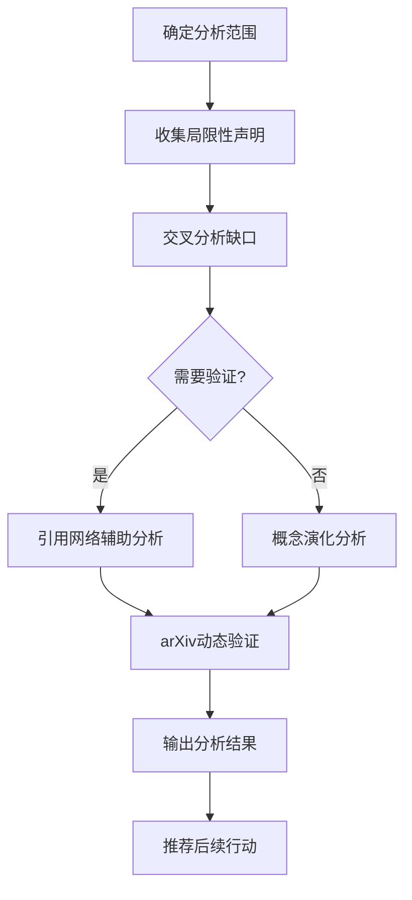

**图表来源**
- [SKILL.md (research-gap):45-66](file://plugin/skills/research-gap/SKILL.md#L45-L66)

### 文献调研技能

文献调研技能提供全面的研究主题调研能力：

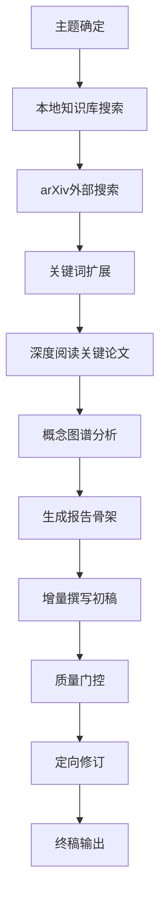

**图表来源**
- [SKILL.md (research-survey):18-91](file://plugin/skills/research-survey/SKILL.md#L18-L91)

### 学术写作管道技能

学术写作管道技能提供端到端的论文写作流程：

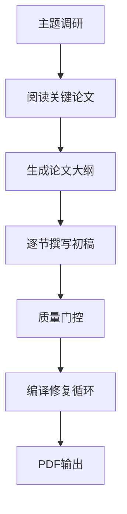

**图表来源**
- [SKILL.md (writing-pipeline):11-63](file://plugin/skills/writing-pipeline/SKILL.md#L11-L63)

### 自适应研究技能

自适应研究技能实现研究方向的自动化跟踪和同步：

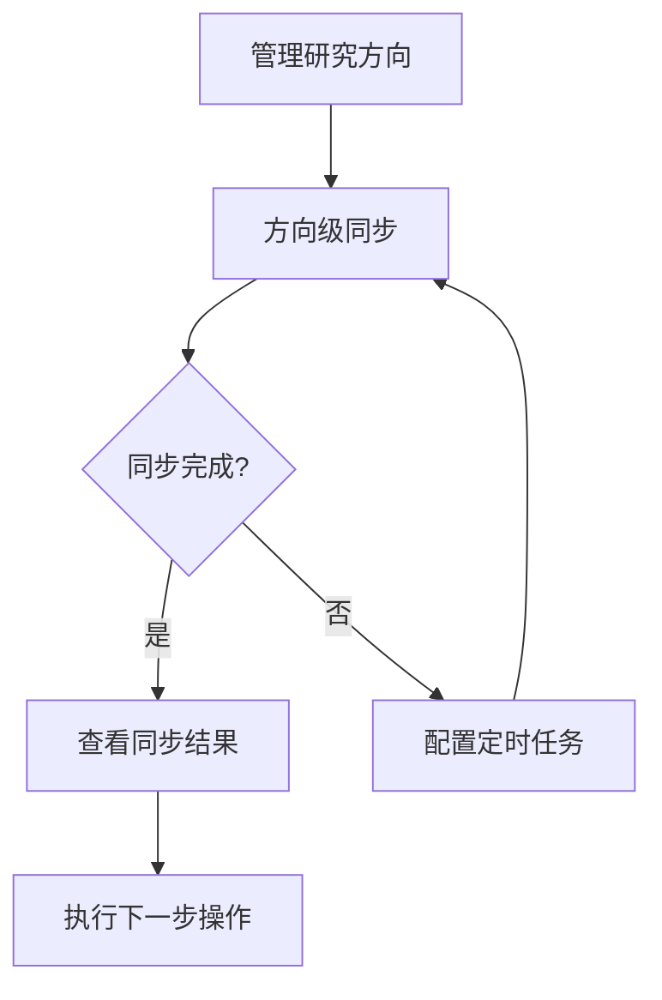

**图表来源**
- [SKILL.md (adaptive-research):24-39](file://plugin/skills/adaptive-research/SKILL.md#L24-L39)

### 冷启动学习技能

冷启动学习技能为陌生研究领域构建知识地图：

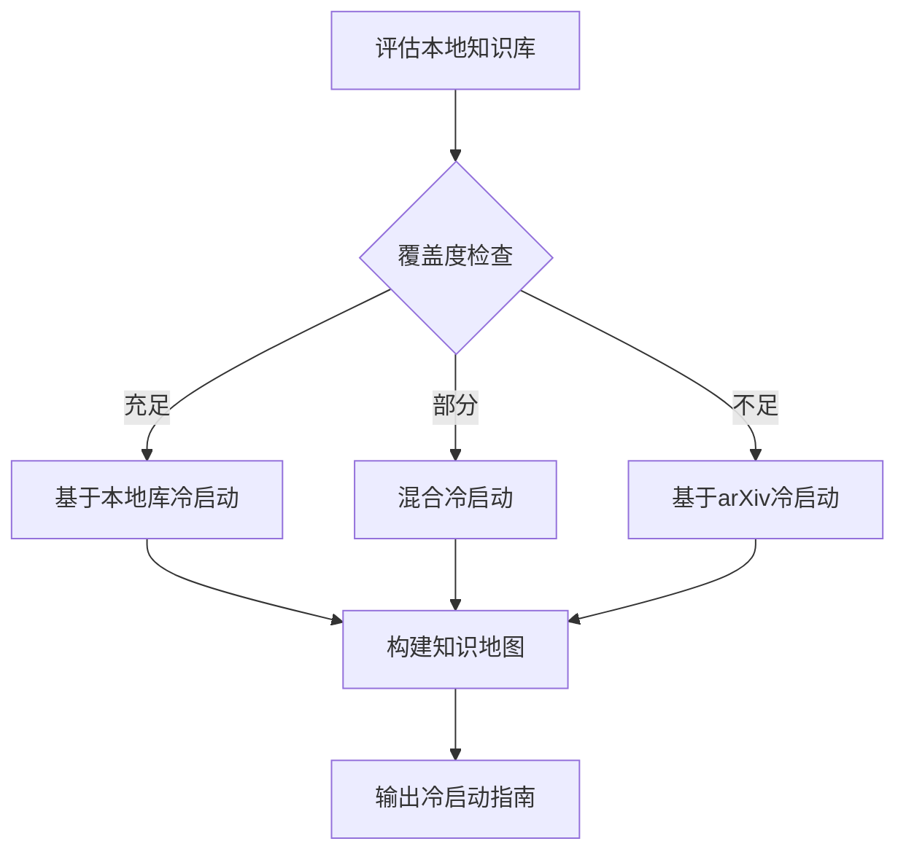

**图表来源**
- [SKILL.md (cold-start):11-84](file://plugin/skills/cold-start/SKILL.md#L11-L84)

### 从想法到论文技能

从想法到论文技能提供完整的研究到发表流程：

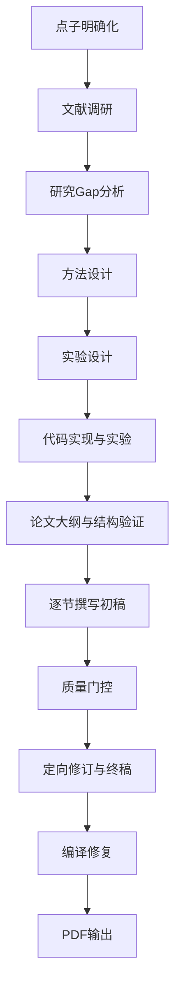

**图表来源**
- [SKILL.md (idea-to-paper):11-95](file://plugin/skills/idea-to-paper/SKILL.md#L11-L95)

### 数学验证技能

数学验证技能支持公式和定理的形式化验证：

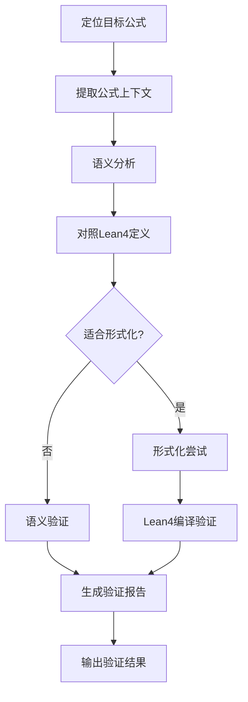

**图表来源**
- [SKILL.md (math-verification):14-78](file://plugin/skills/math-verification/SKILL.md#L14-L78)

### 论文推荐技能

论文推荐技能基于多种维度提供个性化推荐：

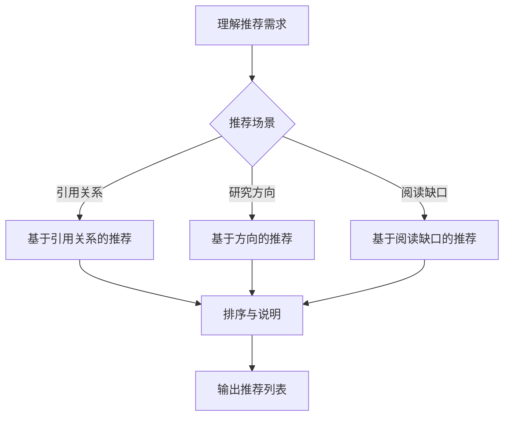

**图表来源**
- [SKILL.md (paper-recommendation):17-63](file://plugin/skills/paper-recommendation/SKILL.md#L17-L63)

### 同行评审技能

同行评审技能提供结构化的评审报告生成：

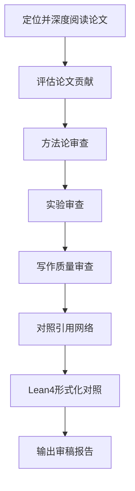

**图表来源**
- [SKILL.md (review-report):23-58](file://plugin/skills/review-report/SKILL.md#L23-L58)

**章节来源**
- [SKILL.md (citation-network):1-101](file://plugin/skills/citation-network/SKILL.md#L1-L101)
- [SKILL.md (paper-deep-dive):1-84](file://plugin/skills/paper-deep-dive/SKILL.md#L1-L84)
- [SKILL.md (experiment-code):1-111](file://plugin/skills/experiment-code/SKILL.md#L1-L111)
- [SKILL.md (reproduce-paper):1-69](file://plugin/skills/reproduce-paper/SKILL.md#L1-L69)
- [SKILL.md (research-survey):1-113](file://plugin/skills/research-survey/SKILL.md#L1-L113)
- [SKILL.md (review-report):1-116](file://plugin/skills/review-report/SKILL.md#L1-L116)
- [SKILL.md (writing-pipeline):1-135](file://plugin/skills/writing-pipeline/SKILL.md#L1-L135)
- [SKILL.md (adaptive-research):1-68](file://plugin/skills/adaptive-research/SKILL.md#L1-L68)
- [SKILL.md (cold-start):1-147](file://plugin/skills/cold-start/SKILL.md#L1-L147)
- [SKILL.md (idea-to-paper):1-112](file://plugin/skills/idea-to-paper/SKILL.md#L1-L112)
- [SKILL.md (math-verification):1-119](file://plugin/skills/math-verification/SKILL.md#L1-L119)
- [SKILL.md (paper-recommendation):1-96](file://plugin/skills/paper-recommendation/SKILL.md#L1-L96)

## 依赖关系分析

系统采用了模块化的依赖管理策略，确保各组件间的松耦合：

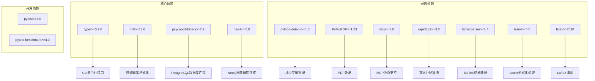

**图表来源**
- [pyproject.toml:13-23](file://pyproject.toml#L13-L23)
- [requirements.txt:3-18](file://requirements.txt#L3-L18)

**章节来源**
- [pyproject.toml:1-36](file://pyproject.toml#L1-L36)
- [requirements.txt:1-18](file://requirements.txt#L1-L18)

## 性能考虑

系统在设计时充分考虑了性能优化和资源管理：

### 数据库性能优化

- **连接池管理**: 使用PostgreSQL连接池减少连接开销
- **批量操作**: 支持批量插入和更新操作
- **索引策略**: 在关键查询字段上建立适当索引
- **查询优化**: 使用参数化查询防止SQL注入

### 前端性能优化

- **虚拟滚动**: 大列表数据的虚拟化渲染
- **懒加载**: 组件和数据的按需加载
- **缓存策略**: 本地存储和内存缓存结合
- **事件防抖**: 输入和搜索操作的防抖处理

### 系统资源管理

- **内存管理**: 及时释放不再使用的资源
- **文件I/O优化**: 批量文件操作和异步处理
- **并发控制**: 合理的并发任务调度
- **错误恢复**: 完善的异常处理和恢复机制

### 新增工具的性能考虑

**更新** 新增的40个学术工具在性能方面进行了专门优化：

- **并行处理**: 多个技能插件支持并行执行
- **增量计算**: 预生成数据减少重复计算
- **缓存机制**: 常用查询结果缓存
- **资源限制**: 实验复现的超时保护机制
- **渐进式加载**: 大规模文献调研的分批处理

## 故障排除指南

### 常见问题及解决方案

#### 数据库连接问题

**症状**: 数据库操作失败，提示连接错误
**解决方案**:
1. 检查PostgreSQL服务状态
2. 验证连接参数配置
3. 确认网络连通性
4. 查看连接池状态

#### 文件权限问题

**症状**: 文件读写失败，权限不足
**解决方案**:
1. 检查文件系统权限
2. 验证目录存在性和可访问性
3. 确认用户账户权限
4. 检查磁盘空间

#### 插件加载问题

**症状**: 技能插件无法加载或执行失败
**解决方案**:
1. 检查插件文件完整性
2. 验证依赖包版本兼容性
3. 查看插件配置文件
4. 检查日志输出

#### 网络连接问题

**症状**: arXiv API请求失败，网络超时
**解决方案**:
1. 检查网络连接状态
2. 验证代理设置
3. 调整超时参数
4. 检查防火墙设置

#### 新增工具特有问题

**更新** 新增40个学术工具的专用故障排除：

**引文网络分析问题**:
- Neo4j连接失败：检查Neo4j服务状态和认证配置
- 图谱查询超时：优化查询索引和分页策略

**实验复现问题**:
- 环境配置失败：检查conda环境和依赖包版本
- 代码运行错误：验证数据集完整性和GPU驱动

**数学验证问题**:
- Lean4编译失败：检查依赖库版本和语法错误
- 形式化证明失败：分析定理定义和证明策略

**章节来源**
- [config.py:266-313](file://scholar/config.py#L266-L313)

## 结论

学术研究工具包（Scholar Studio）是一个功能完备、架构清晰的学术研究平台。通过模块化的设计和丰富的功能特性，该系统为研究人员提供了从论文收集、解析、分析到写作的全流程支持。

**更新** 通过新增的40个专业学术工具，系统的能力得到了极大增强：

### 主要优势

1. **全面的功能覆盖**: 涵盖学术研究的各个环节，从文献收集到论文发表
2. **灵活的架构设计**: 支持多种部署模式和扩展方式
3. **强大的数据处理能力**: 支持大规模论文数据的处理和分析
4. **友好的用户界面**: 直观的操作界面和丰富的可视化功能
5. **完善的错误处理**: 完善的异常处理和恢复机制
6. **RAG系统无缝集成**: 40个新增工具与检索增强生成系统深度整合
7. **自动化程度高**: 自适应研究和智能推荐功能
8. **学术流程完整**: 从想法到发表的端到端支持

### 新增工具的价值

新增的40个学术工具为研究工作带来了以下价值：

- **研究效率提升**: 自动化的文献收集、分析和整理
- **质量保证**: 多维度的质量评估和验证机制
- **创新支持**: 研究空白识别和创意孵化功能
- **协作便利**: 结构化的评审和写作流程
- **可持续发展**: 冷启动学习和知识库维护工具

### 未来发展

系统的发展方向可以包括：

- **AI模型深度集成**: 更先进的自然语言处理和机器学习模型
- **多语言支持扩展**: 支持更多语言的学术文献处理
- **移动端体验优化**: 移动设备上的学术研究支持
- **协作功能增强**: 多人协作和知识共享机制
- **性能和可扩展性提升**: 支持更大规模的学术数据处理

该工具包为学术研究工作者提供了一个强大而灵活的技术平台，有助于提高研究效率和质量，推动人工智能领域的学术发展。