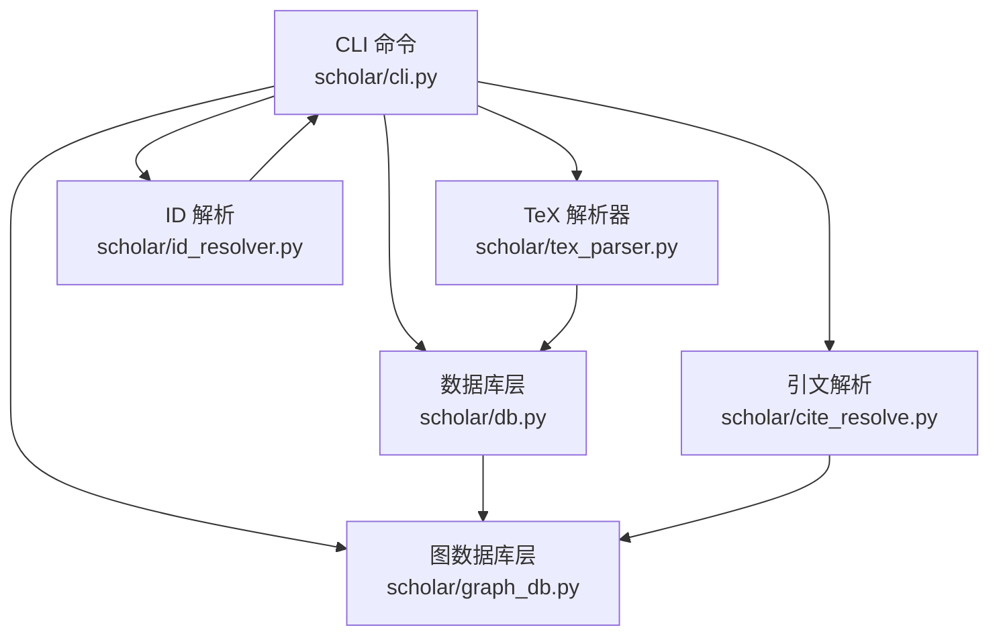
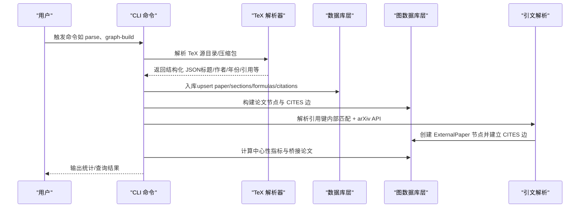
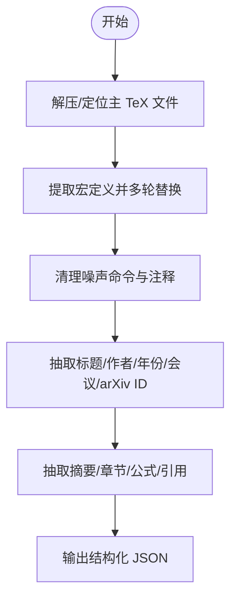
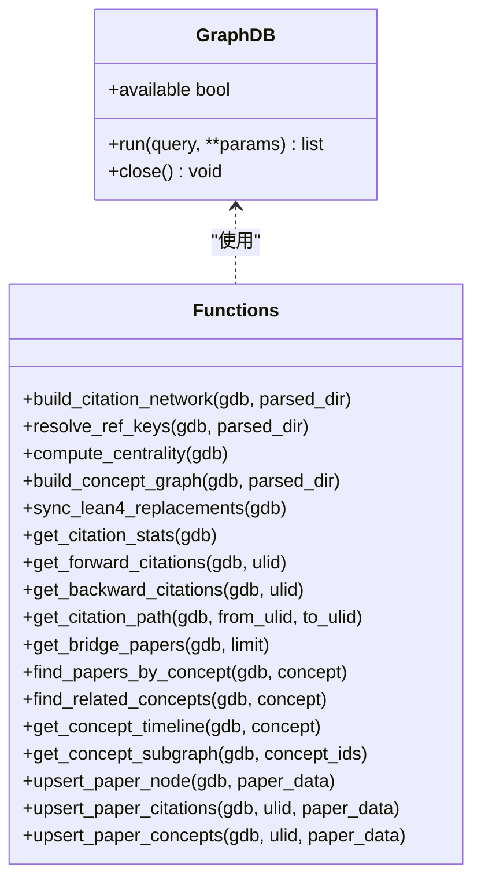
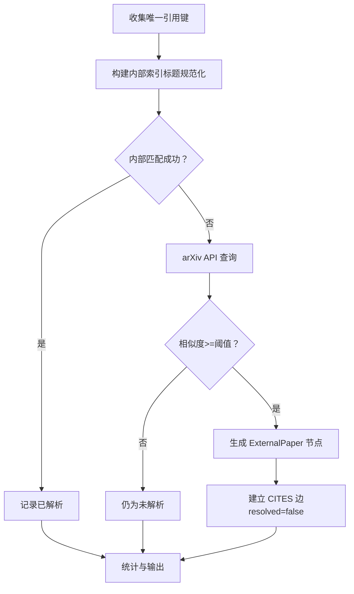
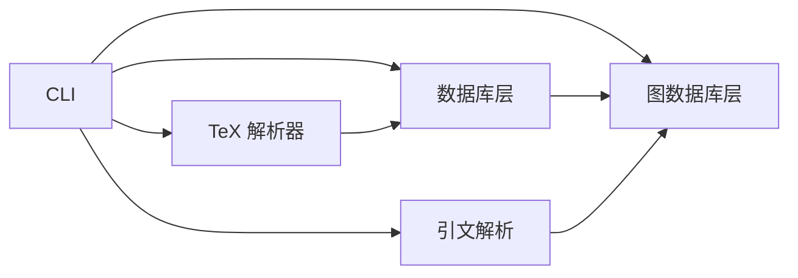
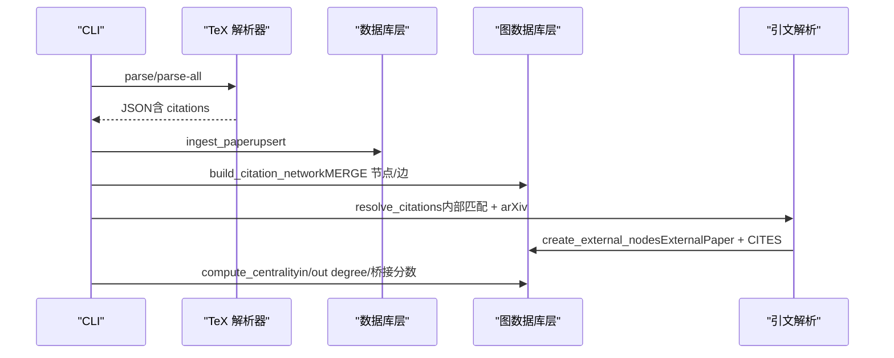
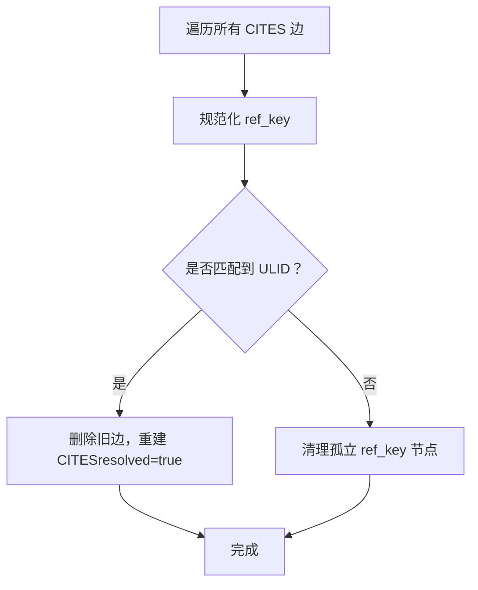

# 引文网络构建器

<cite>
**本文引用的文件列表**
- [scholar/__main__.py](file://scholar/__main__.py)
- [scholar/cli.py](file://scholar/cli.py)
- [scholar/tex_parser.py](file://scholar/tex_parser.py)
- [scholar/db.py](file://scholar/db.py)
- [scholar/config.py](file://scholar/config.py)
- [scholar/graph_db.py](file://scholar/graph_db.py)
- [scholar/cite_resolve.py](file://scholar/cite_resolve.py)
- [scholar/id_resolver.py](file://scholar/id_resolver.py)
</cite>

## 目录
1. [简介](#简介)
2. [项目结构](#项目结构)
3. [核心组件](#核心组件)
4. [架构总览](#架构总览)
5. [详细组件分析](#详细组件分析)
6. [依赖关系分析](#依赖关系分析)
7. [性能考量](#性能考量)
8. [故障排查指南](#故障排查指南)
9. [结论](#结论)
10. [附录](#附录)

## 简介
本技术文档面向“引文网络构建器”，系统阐述从论文解析、引文解析、Neo4j 图谱构建、中心性与桥接分析到查询接口与路径查找的完整流程。文档覆盖以下关键主题：
- 论文节点创建与元数据提取
- CITES 边关系建立与引用键解析
- 标题规范化、模糊匹配与外部引用解析
- 引文统计、中心性指标与桥接论文识别
- Cypher 查询示例、批量操作与性能优化
- 引文网络查询接口、路径查找与社区发现策略

## 项目结构
该项目采用模块化设计，围绕 Scholar Studio 的 CLI 命令体系组织，核心模块如下：
- CLI 层：统一入口与命令分发，负责用户交互与工作流编排
- 解析层：TeX 源解析、数据库持久化与文件落盘
- 图数据库层：Neo4j 连接、图构建、查询与增量更新
- 引文解析层：内部匹配、arXiv API 外部解析、外部节点创建
- ID 解析层：多格式论文 ID 解析与缓存

图表来源
- [scholar/cli.py](file://scholar/cli.py)
- [scholar/tex_parser.py](file://scholar/tex_parser.py)
- [scholar/db.py](file://scholar/db.py)
- [scholar/graph_db.py](file://scholar/graph_db.py)
- [scholar/cite_resolve.py](file://scholar/cite_resolve.py)
- [scholar/id_resolver.py](file://scholar/id_resolver.py)

章节来源
- [scholar/__main__.py](file://scholar/__main__.py)
- [scholar/cli.py](file://scholar/cli.py)

## 核心组件
- CLI 命令体系：提供 parse、parse-all、graph-build、graph-stats、graph-query、cite-network、cite-resolve 等命令，串联解析、入库、图构建与查询。
- TeX 解析器：从压缩包或目录中解析 TeX 源，抽取标题、作者、年份、会议、arXiv ID、摘要、章节、公式与引用列表。
- 数据库层：封装 PostgreSQL 存储，提供 upsert、全文检索与统计；在不可用时回退至文件落盘。
- 图数据库层：封装 Neo4j 连接，提供论文节点、CITES 边、概念图谱与 REPLACES 关系的构建与查询。
- 引文解析：基于内部索引与 arXiv API 的引用键解析，生成 ExternalPaper 节点并建立 CITES 边。
- ID 解析：支持 ULID、arXiv、DOI、slug 等多格式解析，并带内存缓存。

章节来源
- [scholar/cli.py](file://scholar/cli.py)
- [scholar/tex_parser.py](file://scholar/tex_parser.py)
- [scholar/db.py](file://scholar/db.py)
- [scholar/graph_db.py](file://scholar/graph_db.py)
- [scholar/cite_resolve.py](file://scholar/cite_resolve.py)
- [scholar/id_resolver.py](file://scholar/id_resolver.py)

## 架构总览
下图展示从 TeX 解析到 Neo4j 引文网络与概念图谱的整体流程，以及与数据库层的协同。

图表来源
- [scholar/cli.py](file://scholar/cli.py)
- [scholar/tex_parser.py](file://scholar/tex_parser.py)
- [scholar/db.py](file://scholar/db.py)
- [scholar/graph_db.py](file://scholar/graph_db.py)
- [scholar/cite_resolve.py](file://scholar/cite_resolve.py)

## 详细组件分析

### 组件 A：TeX 解析器（论文元数据与引用抽取）
- 功能要点
  - 支持 tar.gz、tar、zip 压缩包解压与 TeX 文件定位
  - 主文件识别：优先含 \input 的 orchestrator 文件，其次按大小排序
  - 宏定义提取与多轮替换，确保标题/作者等字段清洗
  - 抽取作者（支持 \and/\And、authblk、key-value 等）、标题、年份、会议、arXiv ID、摘要、章节、公式与引用列表
  - 引用解析：支持 \cite 系列命令与 \bibitem
- 性能与健壮性
  - 使用正则与递归输入解析，避免重复访问
  - 清洗阶段去除噪声命令、注释与多余空白，降低下游处理成本
- 输出结构
  - 包含 paper_id、title、authors、year、venue、arxiv_id、abstract、sections、formulas、citations、tex_file_count、main_tex_file 等字段

图表来源
- [scholar/tex_parser.py](file://scholar/tex_parser.py)

章节来源
- [scholar/tex_parser.py](file://scholar/tex_parser.py)

### 组件 B：数据库层（PostgreSQL 与文件落盘）
- 功能要点
  - 可选 PostgreSQL 存储：提供 upsert_paper、upsert_sections、upsert_formulas、upsert_citations、list_papers、search_papers、get_stats 等
  - 不可用时回退至文件落盘：save_parsed、load_parsed、list_parsed
- 设计特点
  - 事务封装与连接池复用，异常时自动回滚
  - 全文检索基于 ILIKE 与 JOIN，适合小规模知识库
- 与图数据库协作
  - 在 graph-build 阶段将 parsed JSON 同步到 Neo4j，同时保留结构化元数据

章节来源
- [scholar/db.py](file://scholar/db.py)

### 组件 C：图数据库层（Neo4j）
- 连接与可用性检测
  - GraphDB 类封装连接、会话与查询执行，提供可用性检查
- 论文节点与 CITES 边
  - build_citation_network：MERGE 论文节点并建立 CITES 边
  - resolve_ref_keys：将引用键映射为真实 ULID，修正边目标并清理孤立节点
- 中心性与桥接分析
  - compute_centrality：计算 in_degree、out_degree 与桥接分数（in_degree*out_degree/(in_degree+out_degree)）
- 概念图谱
  - build_concept_graph：基于创新词典与 TF-IDF 匹配，建立 HAS_CONCEPT 与 RELATED_TO 边
- REPLACES 关系同步
  - sync_lean4_replacements：从 Lean4 Database.lean 动态导入 REPLACES 关系
- 查询接口
  - get_citation_stats、get_forward_citations、get_backward_citations、get_citation_path、get_bridge_papers
  - 概念查询：find_papers_by_concept、find_related_concepts、get_concept_timeline、get_concept_subgraph
- 增量更新
  - upsert_paper_node、upsert_paper_citations、upsert_paper_concepts：针对单篇论文的增量维护

图表来源
- [scholar/graph_db.py](file://scholar/graph_db.py)

章节来源
- [scholar/graph_db.py](file://scholar/graph_db.py)

### 组件 D：引文解析（内部匹配 + arXiv API + ExternalPaper 节点）
- 流程概览
  - 收集所有唯一引用键
  - 内部匹配：基于标题规范化与相似度阈值（Levenshtein、词重叠）
  - arXiv API 解析：对未解析键进行标题相似度校验
  - Neo4j 外部节点：创建 ExternalPaper 节点并建立 CITES 边
- 标题规范化与模糊匹配
  - 规范化：小写、移除非字母数字、合并空白
  - 相似度：Levenshtein 距离归一化
  - 匹配策略：精确匹配 → 最佳相似度 → 词重叠 > 0.7
- 外部节点创建
  - MERGE ExternalPaper 节点，设置 title/year/arxiv_id/authors/ref_key
  - 为引用论文创建 CITES 边，ref_key 与 resolved 标记

图表来源
- [scholar/cite_resolve.py](file://scholar/cite_resolve.py)

章节来源
- [scholar/cite_resolve.py](file://scholar/cite_resolve.py)

### 组件 E：ID 解析（多格式论文 ID 解析与缓存）
- 功能要点
  - 支持 ULID、arXiv、DOI、slug 等格式
  - 归一化：arXiv 版本号去除、DOI URL 规范化
  - 模糊匹配：slug 关键词匹配（仅对含 “-” 且非 arXiv/DOI 格式键）
  - 内存缓存：首次调用扫描 parsed JSON 构建索引，后续直接命中
- 使用场景
  - CLI 中 resolve_id 用于解析用户输入的论文标识符，统一转换为内部 ULID

章节来源
- [scholar/id_resolver.py](file://scholar/id_resolver.py)

### 组件 F：CLI 命令与工作流
- 关键命令
  - parse/parse-all：解析单篇或多篇 TeX 源，入库并可选同步到 Neo4j
  - graph-build：构建引文网络、解析引用键、计算中心性、构建概念图谱、同步 REPLACES
  - graph-stats：统计节点/边数量、解析状态、孤立节点
  - graph-query：按概念查询相关论文与邻域
  - cite-network：查看引文统计或某篇论文的前后向引用
  - cite-resolve：执行引文解析流水线（内部匹配 + arXiv + ExternalPaper 节点）
  - bootstrap：一键初始化：parse → year-fix → author-fix → graph-build → rag-index → auto-notes → quality → classify
  - ingest：增量入库：parse → author-fix → auto-notes → quality → classify → graph-update → rag-index
- 设计原则
  - 可选 Neo4j/PG：若服务不可用，命令自动降级或提示
  - 批量与进度可视化：parse-all、bootstrap、batch-ingest 提供进度条与统计

章节来源
- [scholar/cli.py](file://scholar/cli.py)

## 依赖关系分析
- 模块耦合
  - CLI 作为编排者，依赖解析层、数据库层与图数据库层
  - 解析层与数据库层相对独立，图数据库层依赖解析层产物
  - 引文解析与图数据库层存在双向协作：解析结果驱动图构建，图构建结果反馈给解析（ref_key 重定向）
- 外部依赖
  - Neo4j 驱动（可选）
  - PostgreSQL 驱动（可选）
  - arXiv API（HTTP 请求）

图表来源
- [scholar/cli.py](file://scholar/cli.py)
- [scholar/tex_parser.py](file://scholar/tex_parser.py)
- [scholar/db.py](file://scholar/db.py)
- [scholar/graph_db.py](file://scholar/graph_db.py)
- [scholar/cite_resolve.py](file://scholar/cite_resolve.py)

章节来源
- [scholar/cli.py](file://scholar/cli.py)
- [scholar/tex_parser.py](file://scholar/tex_parser.py)
- [scholar/db.py](file://scholar/db.py)
- [scholar/graph_db.py](file://scholar/graph_db.py)
- [scholar/cite_resolve.py](file://scholar/cite_resolve.py)

## 性能考量
- 批量写入
  - Neo4j：UNWIND 批处理（默认批大小 100），减少往返开销
  - PostgreSQL：psycopg2 事务封装，批量 upsert 减少 IO
- 正则与字符串处理
  - 标题规范化与模糊匹配（Levenshtein、词重叠）在大规模数据上可能成为瓶颈，建议：
    - 限制 arXiv 查询上限（cite-resolve 命令提供 limit 参数）
    - 对 ref_key 去重后分批处理
- 索引与缓存
  - ID 解析器内存缓存，避免重复扫描 parsed JSON
  - Neo4j 建议在论文 ULID、引用键、概念 ID 上建立索引（由 MERGE 保证唯一性）
- I/O 优化
  - 解压与输入解析采用临时目录与去重访问，避免重复 IO
  - 批量命令（parse-all、bootstrap）使用进度条与分片处理，提升用户体验

[本节为通用指导，无需特定文件引用]

## 故障排查指南
- Neo4j 不可用
  - 现象：graph-build/graph-stats/graph-query 等命令报错
  - 处理：确认 NEO4J_URI/USER/PASS，或安装 neo4j 驱动；命令会自动降级提示
- PostgreSQL 不可用
  - 现象：数据库相关命令失败
  - 处理：确认 PG_HOST/PORT/NAME/USER/PASS；若不可用，系统回退到文件落盘
- arXiv API 请求失败
  - 现象：cite-resolve、year-fix、metadata-enrich 等命令失败
  - 处理：检查 SCHOLAR_ARXIV_TIMEOUT/SCHOLAR_ARXIV_RETRIES 与代理设置；必要时增加重试次数
- 引文解析未命中
  - 现象：大量 ref_key 未解析
  - 处理：提高 cite-resolve 的 limit；检查引用键格式与标题一致性；必要时手动补充

章节来源
- [scholar/config.py](file://scholar/config.py)
- [scholar/cli.py](file://scholar/cli.py)

## 结论
本项目提供了从 TeX 解析到 Neo4j 图谱构建与查询的完整链路，具备良好的模块化与可扩展性。通过内部匹配与 arXiv API 的组合，实现了对引用键的高覆盖率解析；结合中心性与桥接分数，能够有效识别关键论文与跨领域桥梁。CLI 命令体系覆盖了从批量入库到增量更新的多种场景，适合在学术研究与知识管理中落地应用。

[本节为总结性内容，无需特定文件引用]

## 附录

### 引文网络构建流程（代码级）

图表来源
- [scholar/cli.py](file://scholar/cli.py)
- [scholar/tex_parser.py](file://scholar/tex_parser.py)
- [scholar/db.py](file://scholar/db.py)
- [scholar/graph_db.py](file://scholar/graph_db.py)
- [scholar/cite_resolve.py](file://scholar/cite_resolve.py)

### 引文统计与中心性指标
- 统计接口
  - get_citation_stats：返回论文总数、引文总数、最被引用与最活跃引文者
- 中心性指标
  - compute_centrality：设置 in_degree、out_degree、bridge_score，并返回 top_cited/top_bridge
- 桥接论文识别
  - get_bridge_papers：筛选具有高桥接分数的论文（in/out 度均大于 0）

章节来源
- [scholar/graph_db.py](file://scholar/graph_db.py)

### 引用键解析与外部节点创建（代码级）

图表来源
- [scholar/graph_db.py](file://scholar/graph_db.py)

### 概念图谱构建与查询
- 构建步骤
  - 加载创新词典（Lean4 动态加载或回退种子数据）
  - 文本匹配与 TF-IDF 评分，建立 HAS_CONCEPT 边
  - 统计共现并建立 RELATED_TO 边（权重 ≥ 2）
- 查询接口
  - find_papers_by_concept、find_related_concepts、get_concept_timeline、get_concept_subgraph

章节来源
- [scholar/graph_db.py](file://scholar/graph_db.py)

### 引文网络查询接口与路径查找
- 查询接口
  - get_forward_citations、get_backward_citations、get_citation_path（最短路径）
- 路径查找
  - 使用 shortestPath，返回路径节点的 ULID 与标题序列

章节来源
- [scholar/graph_db.py](file://scholar/graph_db.py)

### 社区发现策略
- 当前实现
  - 基于桥接分数（in_degree*out_degree/(in_degree+out_degree)）近似介数中心性的简化指标
  - 通过 get_bridge_papers 获取高桥接论文
- 建议
  - 若需要更严格的社区划分，可在 Neo4j 中引入社区检测算法（如 Louvain、Label Propagation），或在图上做子图分析与聚类

章节来源
- [scholar/graph_db.py](file://scholar/graph_db.py)

### 批量操作与性能优化
- 批量写入
  - UNWIND 批处理（默认 100 条/批）
  - MERGE 语句保证幂等性
- 限流与重试
  - arXiv 请求支持重试与超时控制
- 缓存与索引
  - ID 解析器内存缓存
  - 建议在 Neo4j 上为论文 ULID、引用键、概念 ID 建立索引

章节来源
- [scholar/graph_db.py](file://scholar/graph_db.py)
- [scholar/cite_resolve.py](file://scholar/cite_resolve.py)
- [scholar/id_resolver.py](file://scholar/id_resolver.py)
- [scholar/config.py](file://scholar/config.py)

### Cypher 查询示例（路径与统计）
- 统计
  - 论文节点数：MATCH (p:Paper) RETURN count(p) AS c
  - 引文边数：MATCH ()-[c:CITES]->() RETURN count(c) AS c
  - 已解析/未解析引文：WHERE c.resolved = true/false
- 路径
  - 最短路径：shortestPath((a:Paper)-[:CITES*]-(b:Paper))
- 中心性
  - 设置 in/out 度与桥接分数：OPTIONAL MATCH + SET
- 概念图谱
  - HAS_CONCEPT/RELATED_TO 边的查询与权重过滤

章节来源
- [scholar/graph_db.py](file://scholar/graph_db.py)