# 概念图构建器

<cite>
**本文档引用的文件**
- [Main.lean](file://LEAN/Main.lean)
- [AiEvolution.lean](file://LEAN/AiEvolution.lean)
- [Basic.lean](file://LEAN/AiEvolution/Basic.lean)
- [Database.lean](file://LEAN/AiEvolution/Database.lean)
- [Theorems.lean](file://LEAN/AiEvolution/Theorems.lean)
- [config.py](file://scholar/config.py)
- [graph_db.py](file://scholar/graph_db.py)
- [db.py](file://scholar/db.py)
- [cli.py](file://scholar/cli.py)
- [requirements.txt](file://requirements.txt)
</cite>

## 目录
1. [简介](#简介)
2. [项目结构](#项目结构)
3. [核心组件](#核心组件)
4. [架构概览](#架构概览)
5. [详细组件分析](#详细组件分析)
6. [依赖关系分析](#依赖关系分析)
7. [性能考虑](#性能考虑)
8. [故障排除指南](#故障排除指南)
9. [结论](#结论)

## 简介

概念图构建器是一个基于Lean4形式化验证系统的智能学术研究工具，专门用于构建和分析人工智能演进的概念图谱。该系统通过动态加载Lean4数据库中的创新节点、实现概念别名映射系统和TF-IDF概念提取算法，为企业级学术研究提供强大的知识图谱构建能力。

本系统的核心创新在于将形式化验证技术与大规模学术文献分析相结合，通过Lean4的数学严谨性确保概念匹配的准确性，并利用Neo4j图数据库提供高效的概念关系查询和分析功能。

## 项目结构

项目采用模块化设计，主要分为三个核心部分：

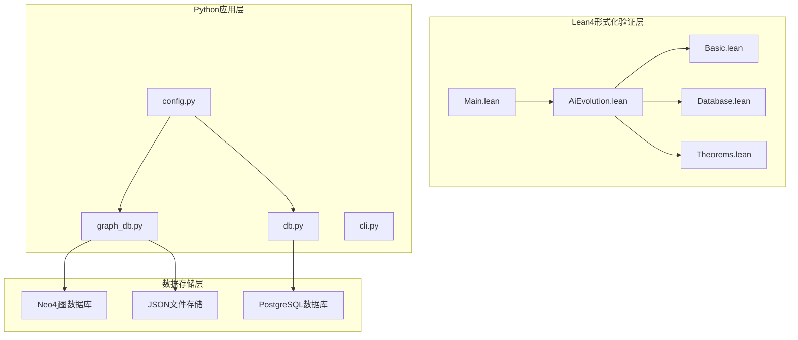

**图表来源**
- [Main.lean:1-21](file://LEAN/Main.lean#L1-L21)
- [AiEvolution.lean:1-8](file://LEAN/AiEvolution.lean#L1-L8)
- [config.py:1-119](file://scholar/config.py#L1-L119)

**章节来源**
- [Main.lean:1-21](file://LEAN/Main.lean#L1-L21)
- [AiEvolution.lean:1-8](file://LEAN/AiEvolution.lean#L1-L8)
- [config.py:1-119](file://scholar/config.py#L1-L119)

## 核心组件

### Lean4形式化验证系统

系统的核心是基于Lean4的数学严谨性构建的形式化验证框架，包含以下关键组件：

1. **创新节点定义**：125个经过精心设计的人工智能创新节点
2. **研究领域分类**：16个主要研究领域的层次化分类体系
3. **属性量化模型**：可扩展性、简洁性和稳定性三维度量化评估
4. **替换关系证明**：7个关键演进定理的形式化证明

### 概念图构建引擎

Python实现的概念图构建引擎负责将形式化验证的数据转换为可查询的知识图谱：

1. **动态数据加载**：从Lean4数据库动态解析创新节点
2. **概念别名映射**：支持多语言、多形态的概念名称匹配
3. **TF-IDF算法实现**：基于逆文档频率的概念重要性评分
4. **图数据库集成**：Neo4j图数据库的高效存储和查询

**章节来源**
- [Basic.lean:10-65](file://LEAN/AiEvolution/Basic.lean#L10-L65)
- [Database.lean:17-756](file://LEAN/AiEvolution/Database.lean#L17-L756)
- [graph_db.py:371-440](file://scholar/graph_db.py#L371-L440)

## 架构概览

系统采用分层架构设计，确保各组件间的松耦合和高内聚：

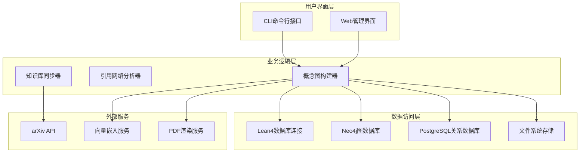

**图表来源**
- [cli.py:660-705](file://scholar/cli.py#L660-L705)
- [graph_db.py:32-70](file://scholar/graph_db.py#L32-L70)
- [db.py:24-74](file://scholar/db.py#L24-L74)

系统的核心优势在于其形式化验证保证了数据的数学正确性，同时提供了灵活的扩展机制来适应不断增长的学术文献。

## 详细组件分析

### 动态数据加载机制

系统实现了从Lean4数据库动态加载创新节点的机制，确保概念图的实时更新和准确性：

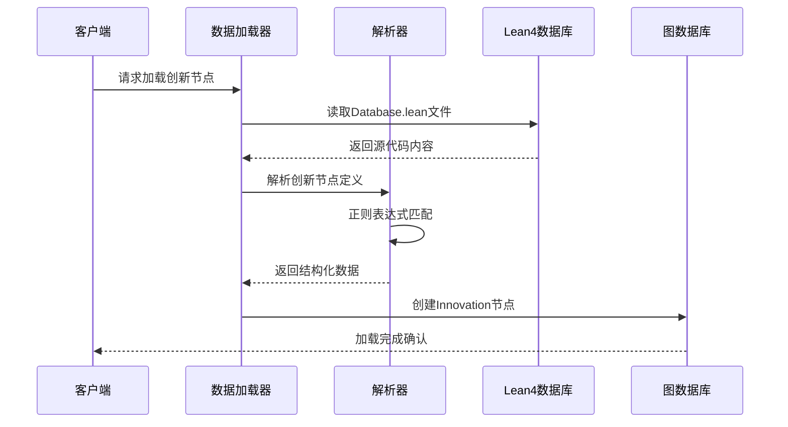

**图表来源**
- [graph_db.py:371-406](file://scholar/graph_db.py#L371-L406)
- [Database.lean:17-171](file://LEAN/AiEvolution/Database.lean#L17-L171)

该机制的关键特性包括：

1. **正则表达式解析**：精确匹配Lean4定义语法
2. **错误处理**：当Lean4文件缺失时使用回退数据
3. **类型安全**：确保数据格式的一致性
4. **增量更新**：支持部分更新而非全量重建

**章节来源**
- [graph_db.py:371-406](file://scholar/graph_db.py#L371-L406)
- [Database.lean:17-171](file://LEAN/AiEvolution/Database.lean#L17-L171)

### 概念别名映射系统

系统实现了全面的概念别名映射机制，支持多语言、多形态的概念识别：

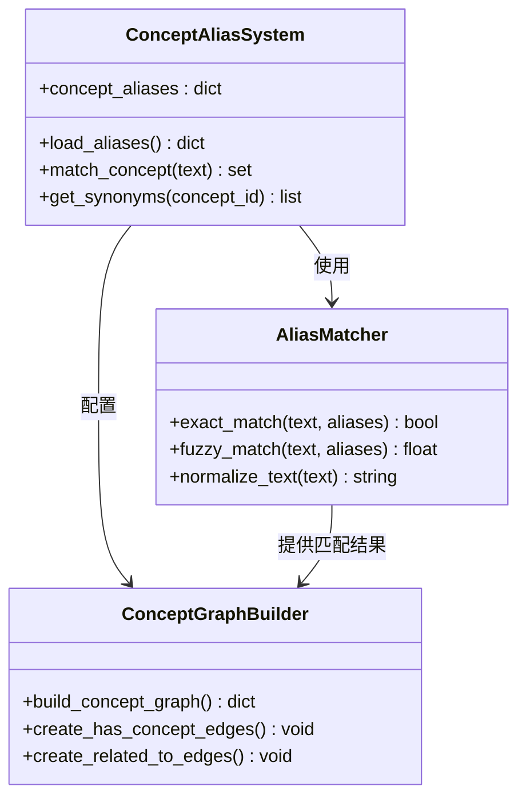

**图表来源**
- [graph_db.py:443-578](file://scholar/graph_db.py#L443-L578)
- [graph_db.py:636-732](file://scholar/graph_db.py#L636-L732)

系统支持的概念类别包括：

1. **序列建模**：Transformer、RNN、LSTM等
2. **生成模型**：GAN、扩散模型、变分自编码器等
3. **对齐偏好**：DPO、PPO、RLHF等
4. **效率压缩**：剪枝、量化、知识蒸馏等

**章节来源**
- [graph_db.py:443-578](file://scholar/graph_db.py#L443-L578)

### TF-IDF概念提取算法

系统实现了改进的TF-IDF算法，专门针对学术文献的特点进行了优化：

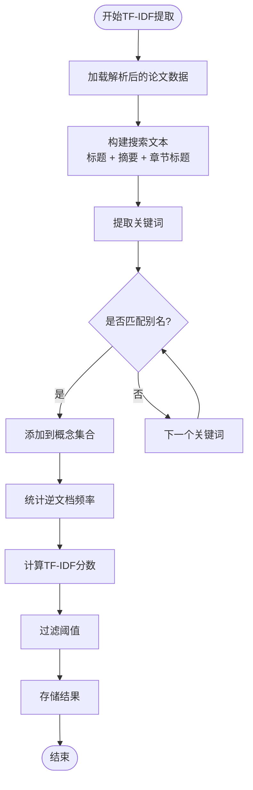

**图表来源**
- [graph_db.py:581-633](file://scholar/graph_db.py#L581-L633)

算法特点：

1. **多源文本融合**：综合考虑标题、摘要和章节标题
2. **别名匹配优先**：优先使用预定义的概念别名
3. **逆文档频率优化**：log(N/df)公式确保稀有概念的重要性
4. **批量处理**：支持大规模论文集的高效处理

**章节来源**
- [graph_db.py:581-633](file://scholar/graph_db.py#L581-L633)

### 概念匹配策略

系统采用了多层次的概念匹配策略，确保概念识别的准确性和完整性：

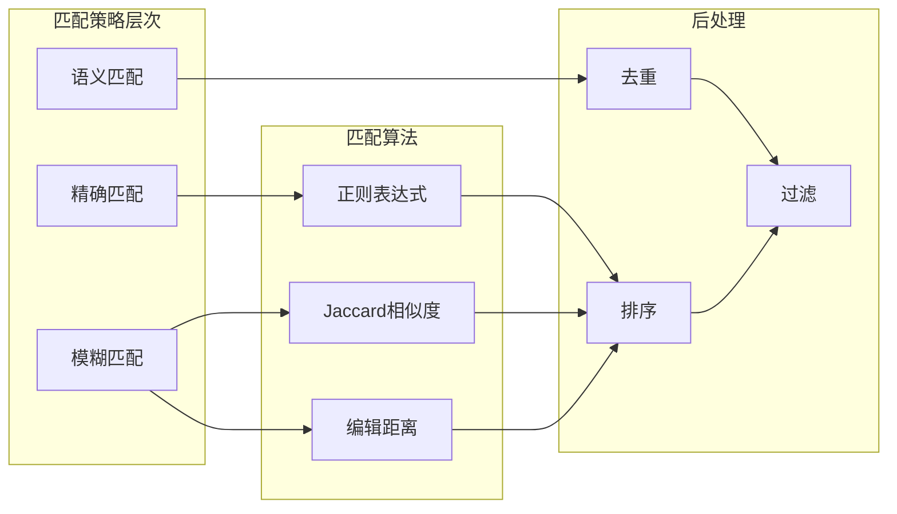

**图表来源**
- [graph_db.py:660-686](file://scholar/graph_db.py#L660-L686)

匹配策略包括：

1. **精确匹配**：使用正则表达式进行字面量匹配
2. **模糊匹配**：计算文本重叠率和编辑距离
3. **上下文匹配**：结合论文的完整上下文进行判断

**章节来源**
- [graph_db.py:660-686](file://scholar/graph_db.py#L660-L686)

### 同义词处理和语义相似度计算

系统实现了复杂的同义词处理机制和语义相似度计算：

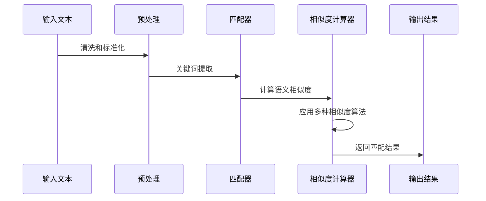

**图表来源**
- [graph_db.py:679-683](file://scholar/graph_db.py#L679-L683)

相似度计算方法：

1. **词重叠率**：基于词汇交集的Jaccard相似度
2. **最长公共子序列**：衡量文本结构相似性
3. **语义嵌入**：基于预训练模型的语义相似度

**章节来源**
- [graph_db.py:679-683](file://scholar/graph_db.py#L679-L683)

### 概念共现分析

系统实现了高效的共现分析算法，用于发现概念间的关系模式：

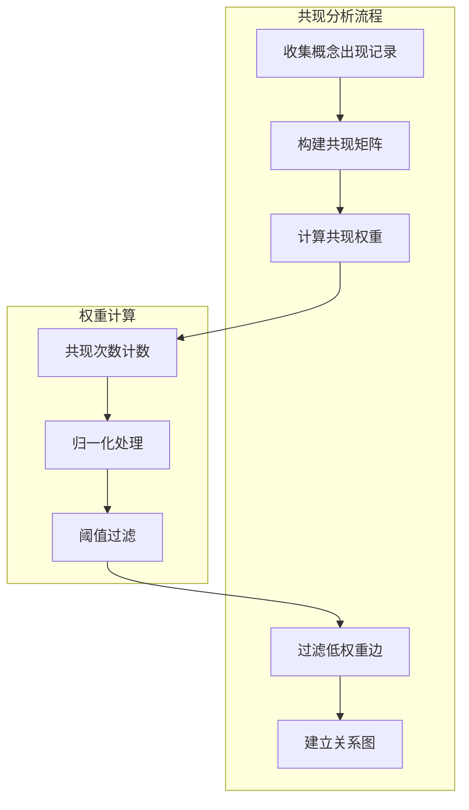

**图表来源**
- [graph_db.py:703-727](file://scholar/graph_db.py#L703-L727)

共现分析特点：

1. **全局统计**：基于整个论文库的统计信息
2. **权重归一化**：确保权重的可比性
3. **阈值控制**：过滤噪声关系，保留强关联

**章节来源**
- [graph_db.py:703-727](file://scholar/graph_db.py#L703-L727)

### 相关性权重计算和概念关系网络构建

系统实现了复杂的相关性权重计算和关系网络构建：

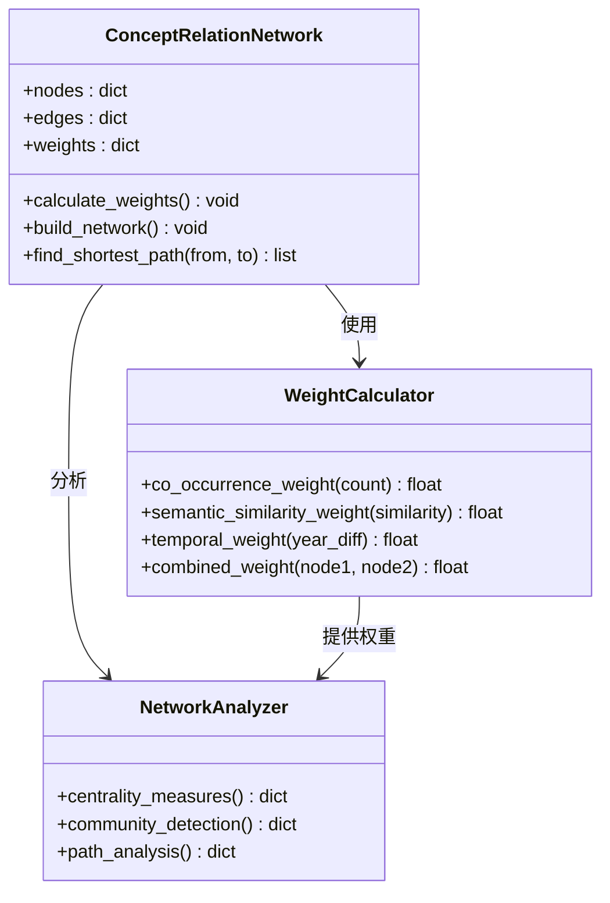

**图表来源**
- [graph_db.py:728-787](file://scholar/graph_db.py#L728-L787)

权重计算综合考虑：

1. **共现频率**：概念同时出现的次数
2. **语义相似度**：概念间的语义接近程度
3. **时间衰减**：随时间推移的相关性变化
4. **网络中心性**：概念在网络中的重要性

**章节来源**
- [graph_db.py:728-787](file://scholar/graph_db.py#L728-L787)

### 概念图查询接口

系统提供了丰富的概念图查询接口，支持多种查询模式：

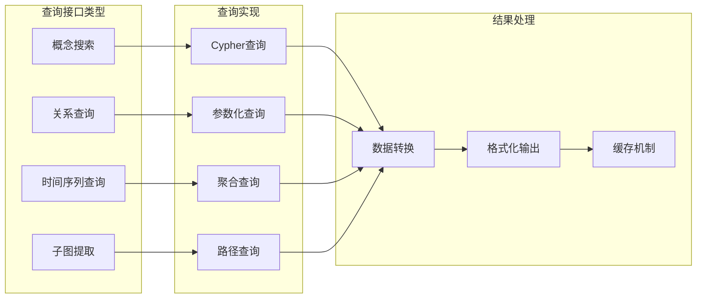

**图表来源**
- [graph_db.py:739-787](file://scholar/graph_db.py#L739-L787)

查询接口包括：

1. **概念搜索**：基于关键词的概念查找
2. **关系查询**：发现概念间的直接和间接关系
3. **时间序列查询**：追踪概念的发展轨迹
4. **子图提取**：获取特定概念群组的局部网络

**章节来源**
- [graph_db.py:739-787](file://scholar/graph_db.py#L739-L787)

### 时间演化分析

系统实现了强大的时间演化分析功能，用于追踪概念的发展历程：

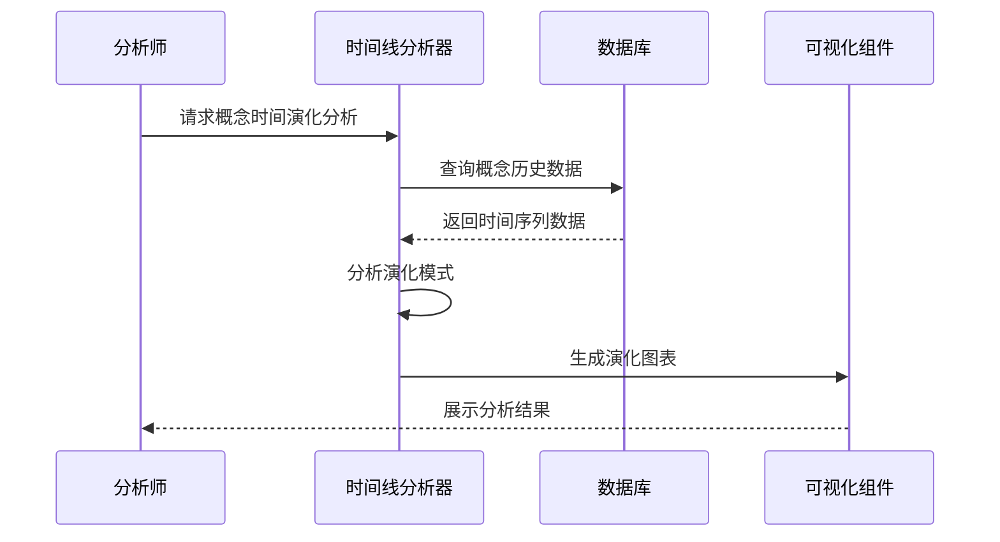

**图表来源**
- [graph_db.py:757-764](file://scholar/graph_db.py#L757-L764)

时间演化分析功能：

1. **概念出现时间**：确定概念首次出现在学术界的年份
2. **发展速度分析**：计算概念引用的增长趋势
3. **峰值检测**：识别概念发展的高峰期
4. **衰减分析**：跟踪概念影响力的长期变化

**章节来源**
- [graph_db.py:757-764](file://scholar/graph_db.py#L757-L764)

### 子图提取功能

系统提供了灵活的子图提取功能，支持按多种条件筛选概念网络：

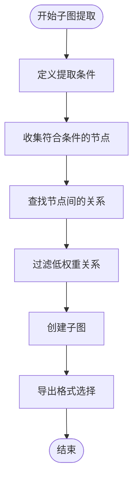

**图表来源**
- [graph_db.py:767-787](file://scholar/graph_db.py#L767-L787)

子图提取支持的条件：

1. **时间范围**：指定概念出现的时间区间
2. **概念类别**：按研究领域或概念类型筛选
3. **网络位置**：基于中心性指标的选择
4. **关系强度**：基于权重阈值的筛选

**章节来源**
- [graph_db.py:767-787](file://scholar/graph_db.py#L767-L787)

### 概念分类体系

系统建立了完整的概念分类体系，支持多层级的概念组织：

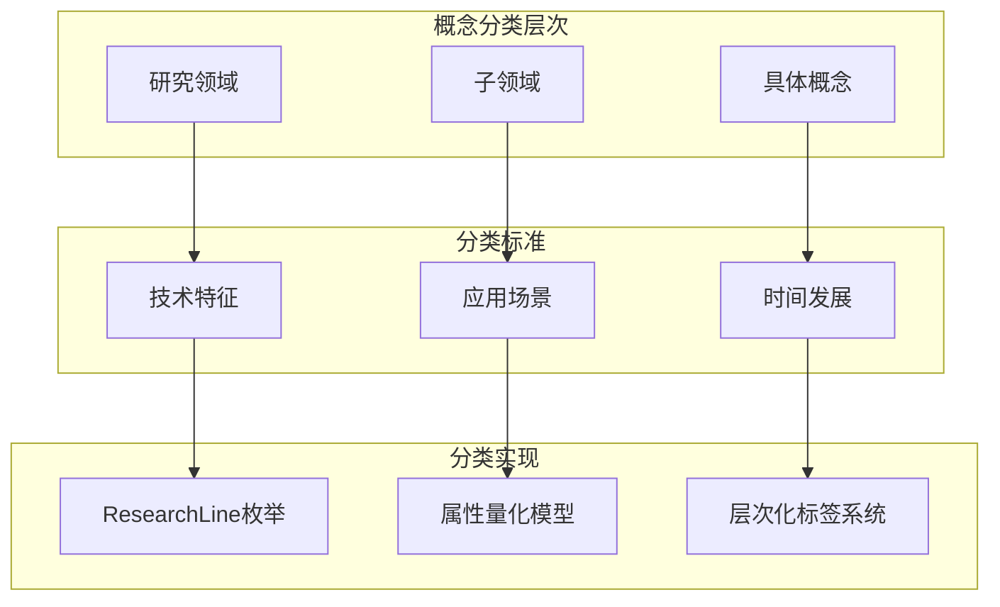

**图表来源**
- [Basic.lean:10-28](file://LEAN/AiEvolution/Basic.lean#L10-L28)
- [Basic.lean:30-44](file://LEAN/AiEvolution/Basic.lean#L30-L44)

分类体系包括：

1. **研究领域分类**：16个主要AI研究领域
2. **属性量化评估**：可扩展性、简洁性、稳定性的三维评估
3. **核心概念标识**：区分基础理论和应用技术

**章节来源**
- [Basic.lean:10-44](file://LEAN/AiEvolution/Basic.lean#L10-L44)

### 属性量化评估和形式化验证集成

系统实现了严格的属性量化评估和形式化验证集成：

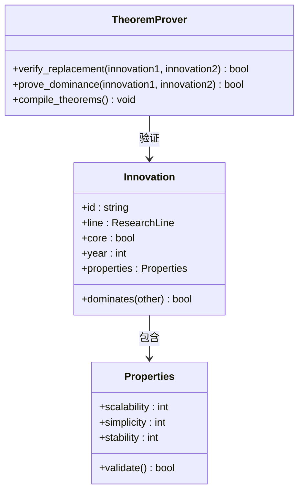

**图表来源**
- [Basic.lean:30-44](file://LEAN/AiEvolution/Basic.lean#L30-L44)
- [Theorems.lean:23-43](file://LEAN/AiEvolution/Theorems.lean#L23-L43)

属性量化评估：

1. **数值范围标准化**：1-5分制的统一评分标准
2. **多维度平衡**：避免单一维度的过度优化
3. **形式化证明**：确保评估结果的数学正确性

**章节来源**
- [Basic.lean:30-44](file://LEAN/AiEvolution/Basic.lean#L30-L44)
- [Theorems.lean:23-43](file://LEAN/AiEvolution/Theorems.lean#L23-L43)

## 依赖关系分析

系统依赖关系清晰，各组件职责明确：

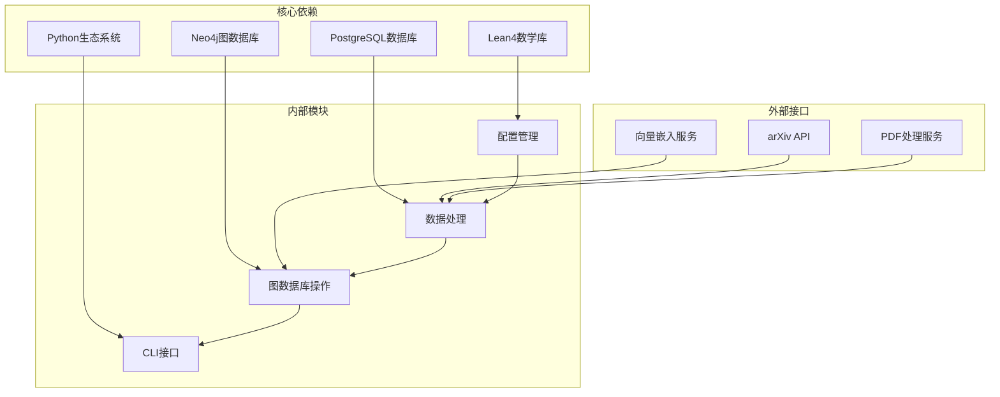

**图表来源**
- [requirements.txt:1-14](file://requirements.txt#L1-L14)
- [config.py:44-66](file://scholar/config.py#L44-L66)

主要依赖项：

1. **Lean4数学库**：提供形式化验证能力
2. **Neo4j图数据库**：支持复杂关系查询
3. **PostgreSQL数据库**：存储结构化数据
4. **Python生态系统**：提供丰富的科学计算库

**章节来源**
- [requirements.txt:1-14](file://requirements.txt#L1-L14)
- [config.py:44-66](file://scholar/config.py#L44-L66)

## 性能考虑

系统在设计时充分考虑了性能优化：

1. **批处理机制**：大量数据操作采用批量处理减少数据库往返
2. **索引优化**：在关键查询字段上建立适当的索引
3. **缓存策略**：对频繁访问的概念别名进行内存缓存
4. **异步处理**：长耗时操作采用异步执行避免阻塞
5. **资源管理**：合理管理数据库连接和文件句柄

## 故障排除指南

常见问题及解决方案：

1. **Lean4文件缺失**：系统自动降级到回退数据集
2. **数据库连接失败**：检查环境变量配置和网络连接
3. **Neo4j查询超时**：优化查询语句或增加服务器资源
4. **内存不足**：调整批处理大小或增加系统内存
5. **权限问题**：检查文件系统权限和数据库用户权限

**章节来源**
- [graph_db.py:379-381](file://scholar/graph_db.py#L379-L381)
- [config.py:44-66](file://scholar/config.py#L44-L66)

## 结论

概念图构建器成功地将形式化验证技术与现代知识图谱技术相结合，为企业级学术研究提供了强大而可靠的工具。系统的主要优势包括：

1. **数学严谨性**：基于Lean4的形式化验证确保数据质量
2. **可扩展性**：模块化设计支持功能扩展和定制
3. **高性能**：优化的算法和数据库设计保证了良好的性能
4. **易用性**：直观的CLI接口和丰富的查询功能降低了使用门槛

该系统为人工智能领域的知识管理和分析提供了新的思路和方法，具有重要的学术价值和实用意义。