# 知识图谱系统

<cite>
**本文档引用的文件**
- [scholar/__main__.py](file://scholar/__main__.py)
- [scholar/cli.py](file://scholar/cli.py)
- [scholar/db.py](file://scholar/db.py)
- [scholar/config.py](file://scholar/config.py)
- [scholar/graph_db.py](file://scholar/graph_db.py)
- [scholar/auto_notes.py](file://scholar/auto_notes.py)
- [scholar/cite_resolve.py](file://scholar/cite_resolve.py)
- [scholar/classify.py](file://scholar/classify.py)
- [scholar/id_resolver.py](file://scholar/id_resolver.py)
- [scholar/metadata_enrich.py](file://scholar/metadata_enrich.py)
- [scholar/tex_parser.py](file://scholar/tex_parser.py)
- [scholar/kb_update.py](file://scholar/kb_update.py)
- [scholar/quality.py](file://scholar/quality.py)
- [scholar/year_fix.py](file://scholar/year_fix.py)
- [requirements.txt](file://requirements.txt)
</cite>

## 目录
1. [简介](#简介)
2. [项目结构](#项目结构)
3. [核心组件](#核心组件)
4. [架构总览](#架构总览)
5. [详细组件分析](#详细组件分析)
6. [依赖关系分析](#依赖关系分析)
7. [性能考虑](#性能考虑)
8. [故障排除指南](#故障排除指南)
9. [结论](#结论)
10. [附录](#附录)

## 简介
本项目是一个面向人工智能领域的学术研究知识图谱系统，围绕论文解析、结构化入库、图数据库集成、自动笔记生成、引用解析与匹配、元数据丰富化、论文分类与质量评估、ID解析机制等核心能力构建。系统支持：
- 从 TeX 源码解析论文元数据、章节、公式、引用
- PostgreSQL 结构化存储与可选的文件模式
- Neo4j 图数据库：引用网络与概念图谱
- 自动生成阅读笔记与质量评分
- 基于 arXiv API 的元数据补全与作者/年份修复
- 一键知识库更新：下载、解析、入库、图谱更新、RAG 索引、自动生成笔记与质量评分、分类标签

## 项目结构
项目采用模块化设计，核心模块包括命令行入口、数据库层、图数据库层、论文解析器、自动笔记、引用解析、分类与质量评估、元数据丰富化、ID 解析与知识库更新等。

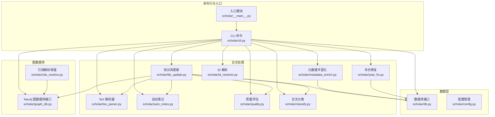

**图表来源**
- [scholar/__main__.py:1-8](file://scholar/__main__.py#L1-L8)
- [scholar/cli.py:1-800](file://scholar/cli.py#L1-L800)
- [scholar/db.py:1-276](file://scholar/db.py#L1-L276)
- [scholar/config.py:1-119](file://scholar/config.py#L1-L119)
- [scholar/graph_db.py:1-922](file://scholar/graph_db.py#L1-L922)
- [scholar/auto_notes.py:1-355](file://scholar/auto_notes.py#L1-L355)
- [scholar/cite_resolve.py:1-314](file://scholar/cite_resolve.py#L1-L314)
- [scholar/classify.py:1-328](file://scholar/classify.py#L1-L328)
- [scholar/id_resolver.py:1-107](file://scholar/id_resolver.py#L1-L107)
- [scholar/metadata_enrich.py:1-312](file://scholar/metadata_enrich.py#L1-L312)
- [scholar/tex_parser.py:1-800](file://scholar/tex_parser.py#L1-L800)
- [scholar/kb_update.py:1-473](file://scholar/kb_update.py#L1-L473)
- [scholar/quality.py:1-432](file://scholar/quality.py#L1-L432)
- [scholar/year_fix.py:1-420](file://scholar/year_fix.py#L1-L420)

**章节来源**
- [scholar/__main__.py:1-8](file://scholar/__main__.py#L1-L8)
- [scholar/cli.py:1-800](file://scholar/cli.py#L1-L800)
- [scholar/config.py:1-119](file://scholar/config.py#L1-L119)

## 核心组件
- 命令行接口：提供扫描、解析、批量解析、信息展示、全文搜索、统计、导出、arXiv 搜索、图谱构建与统计、图谱查询等命令。
- 数据库层：封装 PostgreSQL 存储，提供论文、章节、公式、引用的增删改查与全文检索；当数据库不可用时退化为文件模式。
- 图数据库层：封装 Neo4j 连接与图谱构建，包括引用网络、概念图谱、创新替换关系，提供统计查询与中心性计算。
- 论文解析器：从 TeX 源码提取标题、作者、年份、会议、arXiv ID、摘要、章节、公式、引用等。
- 自动笔记：基于解析结果生成结构化 Markdown 笔记，包含摘要、贡献、方法概览、关键公式、章节树、引用汇总。
- 引用解析增强：将引用键映射到内部 ULID 或外部 arXiv 条目，创建 ExternalPaper 节点并建立引用边。
- 分类与质量评估：多维度质量评分与领域/子方向/方法标签体系。
- 元数据丰富化：统一从 arXiv 获取 arXiv ID、DOI、作者、年份、会议等元数据。
- ID 解析：支持 ULID、arXiv、DOI、slug 等多种 ID 格式解析为内部 ULID。
- 知识库更新：一键下载、解析、入库、图谱更新、RAG 索引、自动生成笔记与质量评分、分类标签。

**章节来源**
- [scholar/cli.py:1-800](file://scholar/cli.py#L1-L800)
- [scholar/db.py:1-276](file://scholar/db.py#L1-L276)
- [scholar/graph_db.py:1-922](file://scholar/graph_db.py#L1-L922)
- [scholar/auto_notes.py:1-355](file://scholar/auto_notes.py#L1-L355)
- [scholar/cite_resolve.py:1-314](file://scholar/cite_resolve.py#L1-L314)
- [scholar/classify.py:1-328](file://scholar/classify.py#L1-L328)
- [scholar/id_resolver.py:1-107](file://scholar/id_resolver.py#L1-L107)
- [scholar/metadata_enrich.py:1-312](file://scholar/metadata_enrich.py#L1-L312)
- [scholar/tex_parser.py:1-800](file://scholar/tex_parser.py#L1-L800)
- [scholar/kb_update.py:1-473](file://scholar/kb_update.py#L1-L473)
- [scholar/quality.py:1-432](file://scholar/quality.py#L1-L432)
- [scholar/year_fix.py:1-420](file://scholar/year_fix.py#L1-L420)

## 架构总览
系统采用“命令行驱动 + 多模块协作”的架构，CLI 作为统一入口协调各模块完成论文处理与知识图谱构建。数据层与图数据库层可独立工作，亦可在可用时协同。

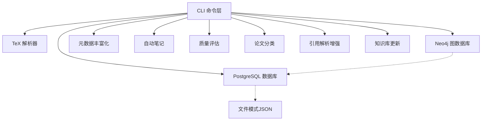

**图表来源**
- [scholar/cli.py:1-800](file://scholar/cli.py#L1-L800)
- [scholar/db.py:1-276](file://scholar/db.py#L1-L276)
- [scholar/graph_db.py:1-922](file://scholar/graph_db.py#L1-L922)
- [scholar/metadata_enrich.py:1-312](file://scholar/metadata_enrich.py#L1-L312)
- [scholar/auto_notes.py:1-355](file://scholar/auto_notes.py#L1-L355)
- [scholar/quality.py:1-432](file://scholar/quality.py#L1-L432)
- [scholar/classify.py:1-328](file://scholar/classify.py#L1-L328)
- [scholar/cite_resolve.py:1-314](file://scholar/cite_resolve.py#L1-L314)
- [scholar/kb_update.py:1-473](file://scholar/kb_update.py#L1-L473)

## 详细组件分析

### 命令行接口与控制流
- 扫描与状态：列出论文目录、源码存在情况、是否已解析、聚合统计。
- 单篇/批量解析：解析 TeX 源码为结构化 JSON，保存并可选入库。
- 信息展示：按论文 ID 展示标题、作者、年份、会议、TeX 文件数、主文件名、摘要、章节、公式、引用。
- 全文搜索：优先查询数据库，回退到 JSON 文件遍历。
- 统计与导出：输出知识库统计、导出 BibTeX。
- arXiv 搜索：基于 arXiv API 搜索并展示结果。
- 图谱构建与统计：构建引用网络、解析引用键、计算中心性、构建概念图、同步 Lean4 替换关系；展示节点/边统计与桥接论文。
- 图谱查询：按概念 ID 查询相关论文与概念。

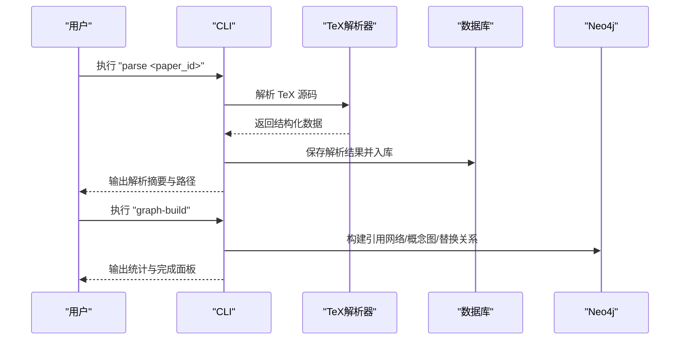

**图表来源**
- [scholar/cli.py:132-171](file://scholar/cli.py#L132-L171)
- [scholar/cli.py:663-706](file://scholar/cli.py#L663-L706)
- [scholar/tex_parser.py:219-298](file://scholar/tex_parser.py#L219-L298)
- [scholar/db.py:170-176](file://scholar/db.py#L170-L176)
- [scholar/graph_db.py:225-281](file://scholar/graph_db.py#L225-L281)

**章节来源**
- [scholar/cli.py:46-370](file://scholar/cli.py#L46-L370)
- [scholar/cli.py:663-791](file://scholar/cli.py#L663-L791)

### 数据库层（PostgreSQL）
- 支持可用性探测与连接复用，异常时退化为文件模式。
- 提供论文、章节、公式、引用的增删改查与全文检索。
- 入库流程：upsert_paper + upsert_sections + upsert_formulas + upsert_citations。
- 文件模式：save_parsed/load_parsed/list_parsed 用于无数据库场景。

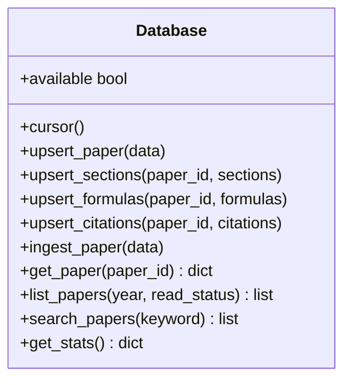

**图表来源**
- [scholar/db.py:24-242](file://scholar/db.py#L24-L242)

**章节来源**
- [scholar/db.py:1-276](file://scholar/db.py#L1-L276)

### 图数据库层（Neo4j）
- 连接管理：延迟连接、可用性探测、会话执行与关闭。
- 引用网络：创建 Paper 节点与 CITES 边，支持 ref_key 解析为 ULID。
- 中心性计算：in_degree/out_degree/bridge_score。
- 概念图谱：从 Lean4 动态加载 Innovations，匹配论文与概念，构建 HAS_CONCEPT 与 RELATED_TO 边。
- 查询接口：引用统计、前后引用、最短路径、桥接论文、按概念查询论文与关系。
- 引用解析增强：内部匹配（Levenshtein/词重叠）+ arXiv API + ExternalPaper 节点。

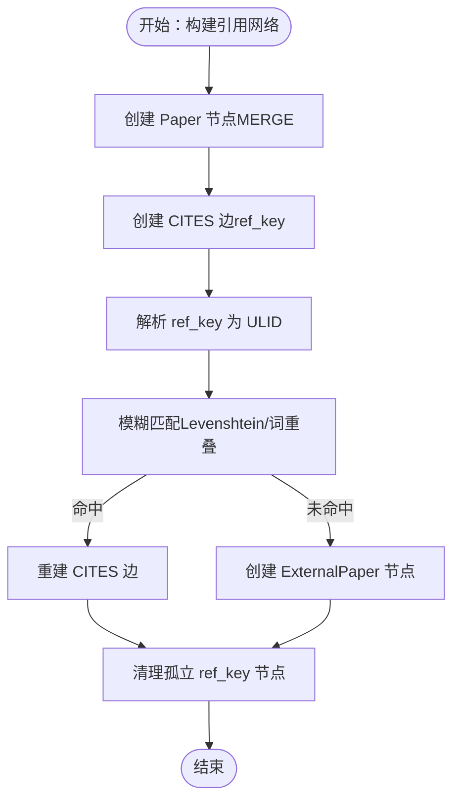

**图表来源**
- [scholar/graph_db.py:225-281](file://scholar/graph_db.py#L225-L281)
- [scholar/graph_db.py:85-178](file://scholar/graph_db.py#L85-L178)
- [scholar/cite_resolve.py:229-314](file://scholar/cite_resolve.py#L229-L314)

**章节来源**
- [scholar/graph_db.py:1-922](file://scholar/graph_db.py#L1-L922)
- [scholar/cite_resolve.py:1-314](file://scholar/cite_resolve.py#L1-L314)

### 论文解析器（TeX）
- 支持从压缩包或目录解析 TeX 源码，自动定位主文件。
- 提取宏定义、解析自定义命令，清洗格式化命令与噪声。
- 提取标题、作者、年份、会议、arXiv ID、摘要、章节、公式、引用。
- 作者解析支持多种分隔符与格式，包含对作者块、表格、键值对等的处理。
- 年份提取支持会议样式、arXiv ID、注释中的年份等。

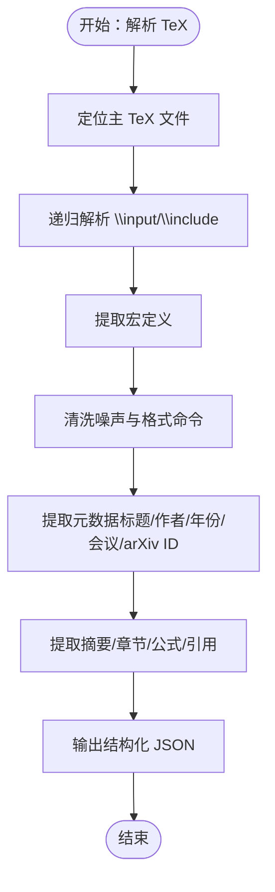

**图表来源**
- [scholar/tex_parser.py:219-298](file://scholar/tex_parser.py#L219-L298)
- [scholar/tex_parser.py:441-527](file://scholar/tex_parser.py#L441-L527)
- [scholar/tex_parser.py:529-714](file://scholar/tex_parser.py#L529-L714)

**章节来源**
- [scholar/tex_parser.py:1-800](file://scholar/tex_parser.py#L1-L800)

### 自动笔记生成
- 生成结构化 Markdown 笔记，包含摘要、核心贡献、方法概览、关键公式、章节树、引用汇总。
- 关键公式选择基于标签、复杂度与环境类型打分。
- 对 sections/formulas/citations 的字符串表示进行安全解析。

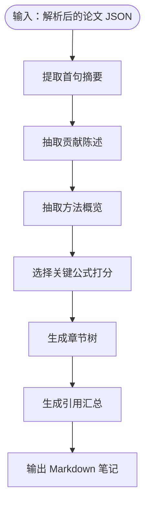

**图表来源**
- [scholar/auto_notes.py:28-161](file://scholar/auto_notes.py#L28-L161)
- [scholar/auto_notes.py:252-276](file://scholar/auto_notes.py#L252-L276)

**章节来源**
- [scholar/auto_notes.py:1-355](file://scholar/auto_notes.py#L1-L355)

### 引用解析与匹配
- 内部匹配：ref_key → 已知 ULID（标准化标题 + Levenshtein + 词重叠）。
- 外部解析：arXiv API 查询，创建 ExternalPaper 节点并建立 CITES 边。
- Neo4j 批量创建与关系重建，支持干运行模式。

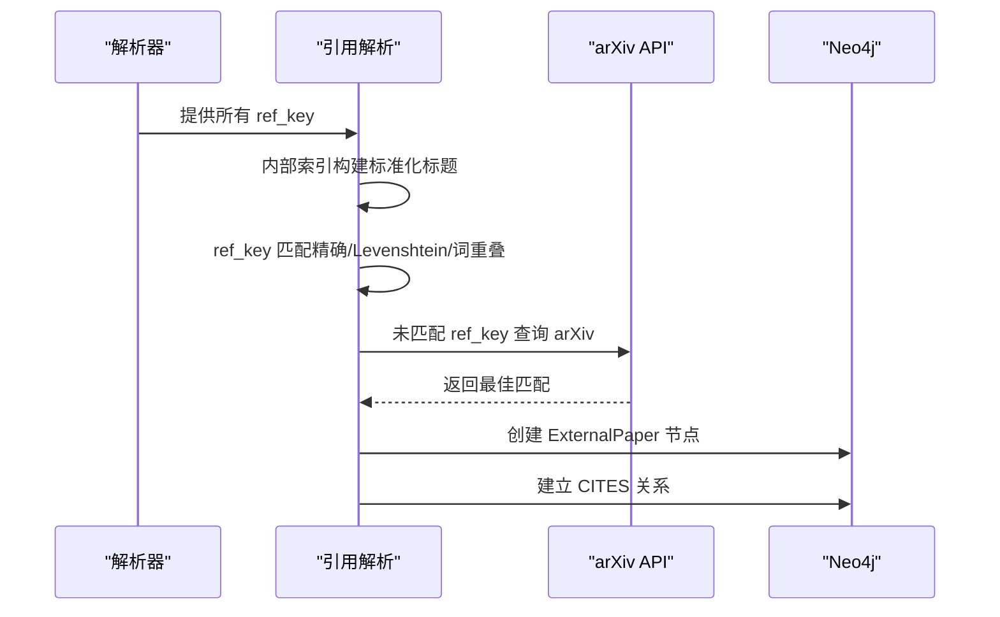

**图表来源**
- [scholar/cite_resolve.py:65-134](file://scholar/cite_resolve.py#L65-L134)
- [scholar/cite_resolve.py:140-182](file://scholar/cite_resolve.py#L140-L182)
- [scholar/cite_resolve.py:229-314](file://scholar/cite_resolve.py#L229-L314)

**章节来源**
- [scholar/cite_resolve.py:1-314](file://scholar/cite_resolve.py#L1-L314)

### 元数据丰富化与年份/作者修复
- 统一从 arXiv 获取 arXiv ID、DOI、作者、年份、会议等元数据，支持阈值过滤与覆盖策略。
- 年份修复：Lean4 论文 ID → 标题匹配 → 内容启发式推断 → arXiv API 查询。
- 作者修复：针对缺失作者的论文通过 arXiv API 补充。

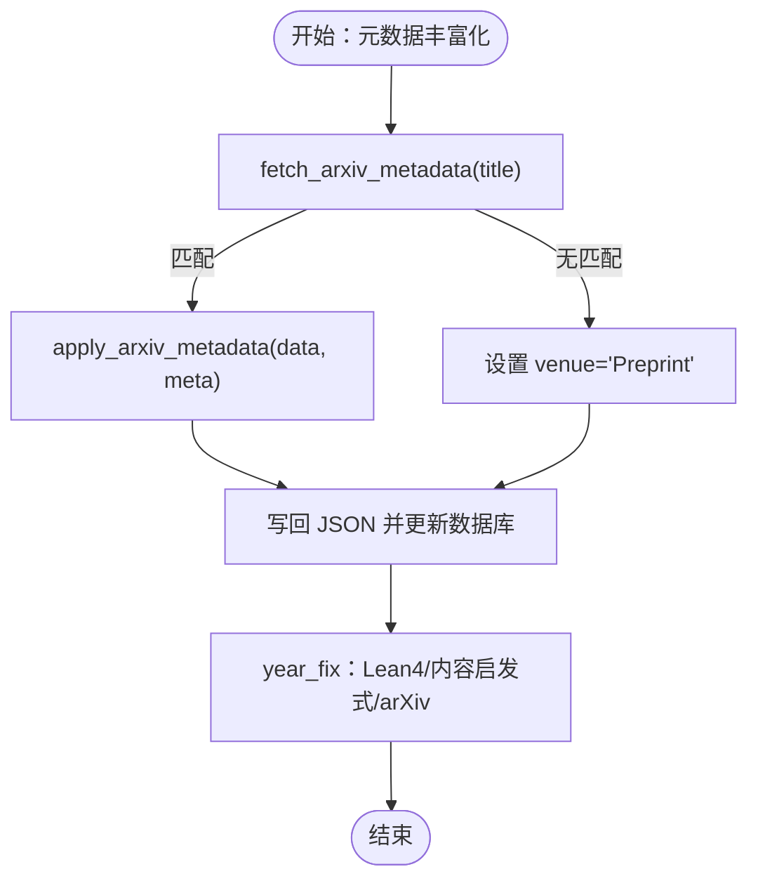

**图表来源**
- [scholar/metadata_enrich.py:80-132](file://scholar/metadata_enrich.py#L80-L132)
- [scholar/metadata_enrich.py:134-241](file://scholar/metadata_enrich.py#L134-L241)
- [scholar/year_fix.py:165-239](file://scholar/year_fix.py#L165-L239)
- [scholar/year_fix.py:262-304](file://scholar/year_fix.py#L262-L304)

**章节来源**
- [scholar/metadata_enrich.py:1-312](file://scholar/metadata_enrich.py#L1-L312)
- [scholar/year_fix.py:1-420](file://scholar/year_fix.py#L1-L420)

### 论文分类与质量评估
- 分类：多级标签体系（领域/子方向/方法），基于关键词匹配与会议提示。
- 质量：7 维评分（元数据完整性、结构质量、引用密度、可复现信号、问题定义清晰度、创新信号、实验严谨性），输出等级与明细。

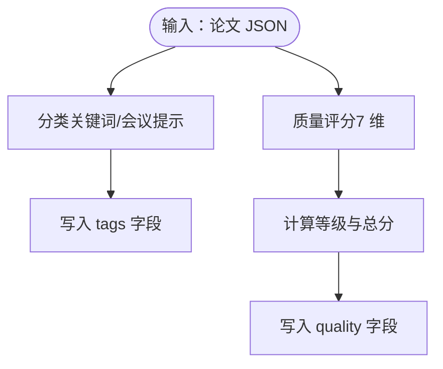

**图表来源**
- [scholar/classify.py:161-239](file://scholar/classify.py#L161-L239)
- [scholar/quality.py:317-357](file://scholar/quality.py#L317-L357)

**章节来源**
- [scholar/classify.py:1-328](file://scholar/classify.py#L1-L328)
- [scholar/quality.py:1-432](file://scholar/quality.py#L1-L432)

### ID 解析机制
- 支持 ULID、arXiv、DOI、slug 多格式解析，带内存缓存与首次扫描构建索引。
- 归一化处理（arXiv 版本号去除、DOI URL 规范化）。
- 模糊匹配（slug 关键词包含）。

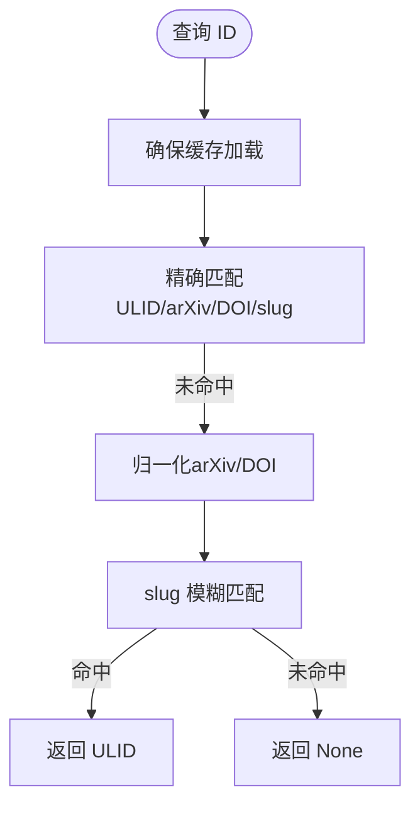

**图表来源**
- [scholar/id_resolver.py:15-96](file://scholar/id_resolver.py#L15-L96)

**章节来源**
- [scholar/id_resolver.py:1-107](file://scholar/id_resolver.py#L1-L107)

### 知识库更新（一键更新）
- arxiv-download：搜索 arXiv、去重、下载 TeX 源码与 PDF、生成 ULID 目录与初始元数据。
- batch-ingest：解析 → 元数据补全（单次 API 查询）→ 图谱更新（节点/引用/概念）→ RAG 索引 → 自动笔记/质量/分类。
- kb-update：组合下载与入库。

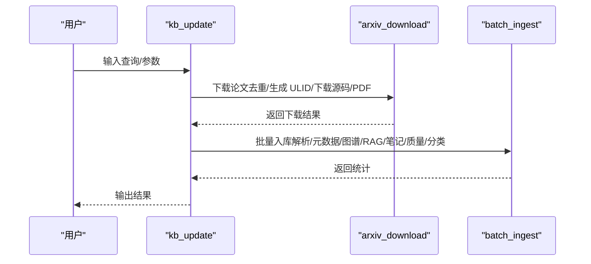

**图表来源**
- [scholar/kb_update.py:441-473](file://scholar/kb_update.py#L441-L473)
- [scholar/kb_update.py:88-214](file://scholar/kb_update.py#L88-L214)
- [scholar/kb_update.py:216-438](file://scholar/kb_update.py#L216-L438)

**章节来源**
- [scholar/kb_update.py:1-473](file://scholar/kb_update.py#L1-L473)

## 依赖关系分析
- Python 依赖：typer、rich、psycopg2-binary、neo4j、python-dotenv、PyMuPDF、mcp 等。
- 可选依赖：ulid、datasets（优雅降级）。

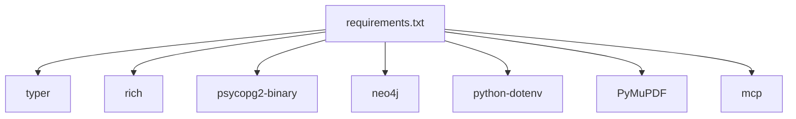

**图表来源**
- [requirements.txt:1-14](file://requirements.txt#L1-L14)

**章节来源**
- [requirements.txt:1-14](file://requirements.txt#L1-L14)

## 性能考虑
- 批量操作：数据库与图数据库均采用批量插入/更新（UNWIND + MERGE），减少往返开销。
- 连接管理：数据库连接惰性建立与复用，Neo4j 驱动按需创建与关闭。
- 算法优化：
  - 引用解析：先精确匹配，再 Levenshtein，最后词重叠，阈值控制。
  - 概念匹配：TF-IDF 文档频率 + 关键词匹配，限制批大小。
  - 元数据丰富化：单次 API 查询返回全部字段，降低请求次数。
- I/O 优化：临时目录解压、文件写入原子化（失败清理目录），避免孤儿目录。
- 速率限制：arXiv API 请求间隔控制，避免封禁。

[本节为通用指导，无需特定文件引用]

## 故障排除指南
- 数据库不可用：检查连接参数与服务状态，系统将退化为文件模式。
- Neo4j 不可用：确认服务运行与凭据正确，或安装 neo4j 驱动。
- arXiv 请求失败：检查代理、超时与重试配置，必要时设置 HTTP_PROXY。
- 解析失败：确认 TeX 源码完整性与主文件识别，查看日志输出。
- 图谱构建异常：检查引用键规范化与匹配逻辑，清理孤立节点。
- 元数据补全无效：确认标题相似度阈值与 arXiv 返回质量。

**章节来源**
- [scholar/config.py:72-119](file://scholar/config.py#L72-L119)
- [scholar/cli.py:610-627](file://scholar/cli.py#L610-L627)
- [scholar/kb_update.py:152-171](file://scholar/kb_update.py#L152-L171)

## 结论
该知识图谱系统通过模块化设计实现了从论文解析到结构化入库、图谱构建与智能应用的完整闭环。其核心优势在于：
- 多样化的论文解析能力与稳健的 TeX 处理流程
- 可选的 PostgreSQL 与文件模式，兼顾性能与易用性
- Neo4j 图数据库的引用网络与概念图谱，支撑高级检索与洞察
- 自动化流水线（元数据丰富化、笔记生成、质量评估、分类标签）
- 完善的 ID 解析与引用解析增强，提升知识关联质量

[本节为总结，无需特定文件引用]

## 附录
- 使用示例（命令行）：
  - 解析单篇：python -m scholar parse <paper_id>
  - 批量解析：python -m scholar parse-all [--limit N] [--force]
  - 图谱构建：python -m scholar graph-build
  - 图谱统计：python -m scholar graph-stats
  - 元数据补全：python -m scholar metadata-enrich [--dry-run]
  - 一键更新：python -m scholar kb-update "<query>" [--max-results N] [--download-pdf]
- 配置项（来自 .env）：数据库与图数据库连接、嵌入模型与 API Key、LaTeX 编译器、Lean4 项目路径等。

[本节为概览，无需特定文件引用]