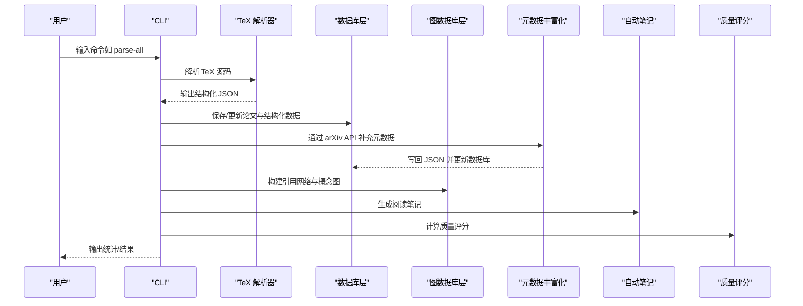
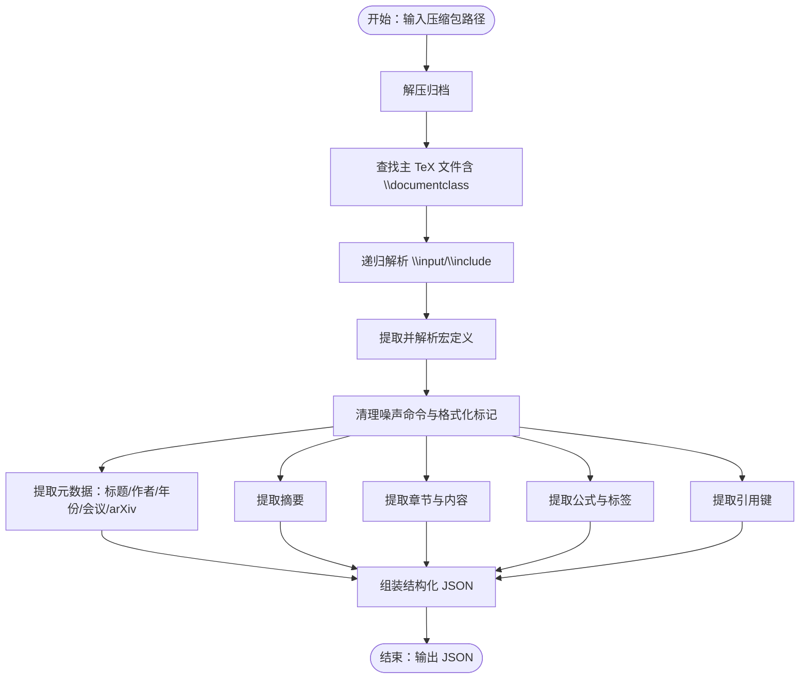
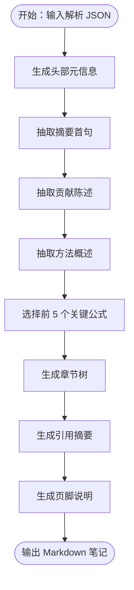
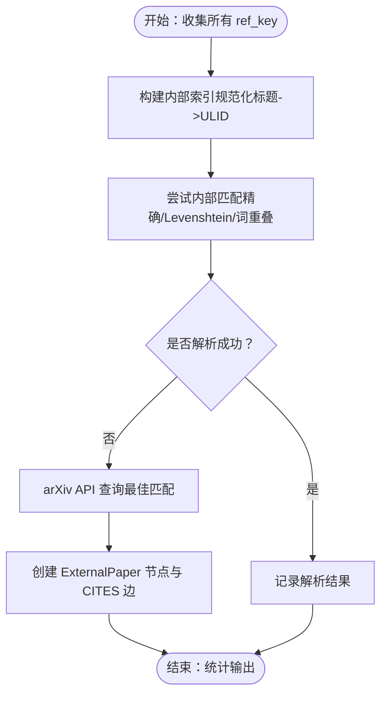
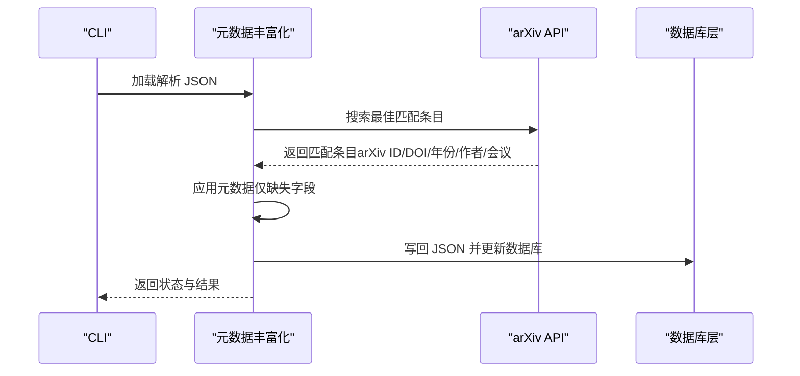
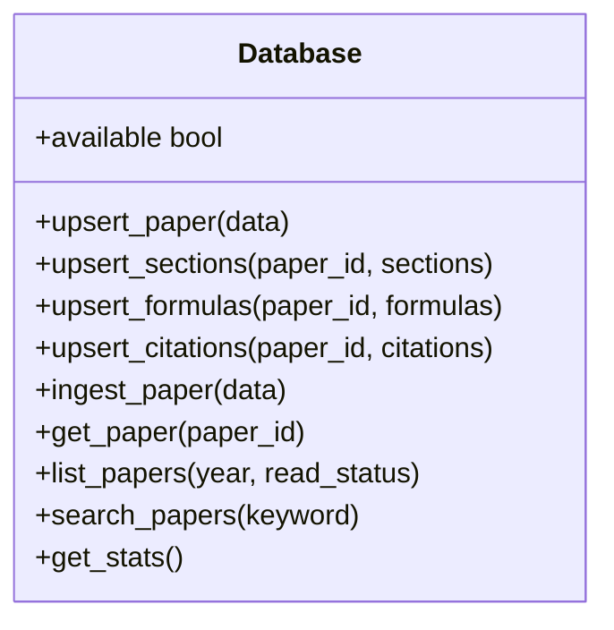
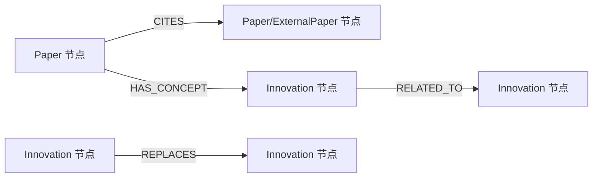
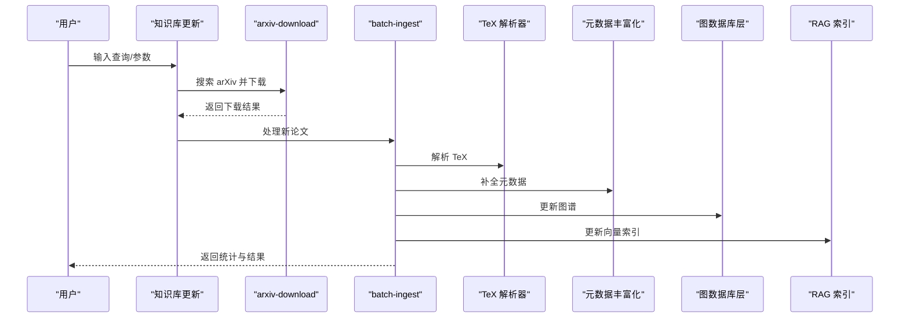
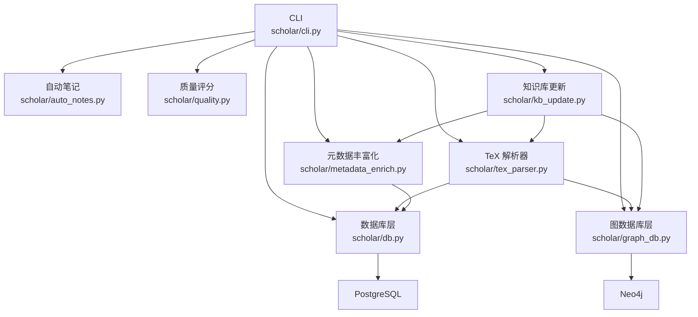

# 论文处理管道

<cite>
**本文档引用的文件**
- [README.md](file://README.md)
- [requirements.txt](file://requirements.txt)
- [scholar/__main__.py](file://scholar/__main__.py)
- [scholar/cli.py](file://scholar/cli.py)
- [scholar/tex_parser.py](file://scholar/tex_parser.py)
- [scholar/auto_notes.py](file://scholar/auto_notes.py)
- [scholar/cite_resolve.py](file://scholar/cite_resolve.py)
- [scholar/metadata_enrich.py](file://scholar/metadata_enrich.py)
- [scholar/db.py](file://scholar/db.py)
- [scholar/graph_db.py](file://scholar/graph_db.py)
- [scholar/config.py](file://scholar/config.py)
- [scholar/id_resolver.py](file://scholar/id_resolver.py)
- [scholar/kb_update.py](file://scholar/kb_update.py)
- [scholar/quality.py](file://scholar/quality.py)
</cite>

## 目录
1. [简介](#简介)
2. [项目结构](#项目结构)
3. [核心组件](#核心组件)
4. [架构总览](#架构总览)
5. [详细组件分析](#详细组件分析)
6. [依赖关系分析](#依赖关系分析)
7. [性能考虑](#性能考虑)
8. [故障排除指南](#故障排除指南)
9. [结论](#结论)
10. [附录](#附录)

## 简介
本技术文档围绕“论文处理管道”展开，系统性阐述从 TeX 源码解析到结构化数据入库、再到图谱与知识增强的完整工作流程。重点包括：
- 自动笔记生成机制（auto_notes）
- 引用解析与匹配算法（cite_resolve）
- 元数据丰富化策略（metadata_enrich）
- 论文预处理、内容提取与结构化转换（tex_parser）
- 引用关系识别、作者信息提取、期刊元数据获取、关键词标注
- 管道配置选项、性能优化策略、错误处理机制
- 数据质量控制、重复检测与冲突解决算法

## 项目结构
该项目采用模块化设计，核心位于 scholar/ 目录，提供 CLI、解析器、数据库层、图数据库层、元数据与质量评分等能力；数据与输出分别位于 data/papers/ 与 output/ 目录；基础设施通过 Docker Compose 启动 PostgreSQL 与 Neo4j。

```mermaid
graph TB
subgraph "应用层"
CLI["CLI 命令<br/>scholar/cli.py"]
MCP["MCP Server<br/>scholar_mcp/server.py"]
end
subgraph "核心处理层"
Parser["TeX 解析器<br/>scholar/tex_parser.py"]
Notes["自动笔记生成<br/>scholar/auto_notes.py"]
Cite["引用解析与匹配<br/>scholar/cite_resolve.py"]
Meta["元数据丰富化<br/>scholar/metadata_enrich.py"]
Quality["质量评分<br/>scholar/quality.py"]
KB["知识库更新<br/>scholar/kb_update.py"]
end
subgraph "数据与存储"
DB["PostgreSQL 层<br/>scholar/db.py"]
GDB["Neo4j 图数据库层<br/>scholar/graph_db.py"]
Config["配置与环境<br/>scholar/config.py"]
ID["ID 解析器<br/>scholar/id_resolver.py"]
end
subgraph "外部服务"
Arxiv["arXiv API"]
PG["PostgreSQL + pgvector"]
Neo4j["Neo4j"]
end
CLI --> Parser
CLI --> Notes
CLI --> Cite
CLI --> Meta
CLI --> Quality
CLI --> KB
CLI --> DB
CLI --> GDB
CLI --> Config
CLI --> ID
Parser --> DB
Parser --> GDB
Notes --> DB
Cite --> GDB
Meta --> DB
Quality --> DB
KB --> Parser
KB --> Meta
KB --> GDB
KB --> DB
DB <- --> PG
GDB <- --> Neo4j
Parser --> Arxiv
Meta --> Arxiv
```

图表来源
- [scholar/cli.py](file://scholar/cli.py)
- [scholar/tex_parser.py](file://scholar/tex_parser.py)
- [scholar/auto_notes.py](file://scholar/auto_notes.py)
- [scholar/cite_resolve.py](file://scholar/cite_resolve.py)
- [scholar/metadata_enrich.py](file://scholar/metadata_enrich.py)
- [scholar/db.py](file://scholar/db.py)
- [scholar/graph_db.py](file://scholar/graph_db.py)
- [scholar/config.py](file://scholar/config.py)
- [scholar/id_resolver.py](file://scholar/id_resolver.py)

章节来源
- [README.md](file://README.md)
- [requirements.txt](file://requirements.txt)

## 核心组件
- CLI 入口与命令分发：提供 scan、parse、parse-all、info、search、list-papers、stats、export-bib、author-fix、arxiv-search、graph-build、graph-stats、graph-query 等命令，并统一调度解析、入库、图谱与检索功能。
- TeX 解析器：从压缩包中提取主 TeX 文件，递归解析 \input/\include，解析标题、作者、年份、会议、arXiv ID、摘要、章节、公式与引用，输出结构化 JSON。
- 自动笔记生成：基于解析结果生成 Markdown 阅读笔记，包含摘要、贡献、方法概述、关键公式、章节树、引用汇总等。
- 引用解析与匹配：将引用键 ref_key 与内部论文或 arXiv 条目进行匹配，创建 ExternalPaper 节点并在图中建立 CITES 边。
- 元数据丰富化：通过 arXiv API 一次性提取 arXiv ID、DOI、年份、作者、会议等字段，写回 JSON 并更新数据库。
- 数据库层：封装 PostgreSQL/psycopg2，提供 upsert、批量入库、查询与统计接口。
- 图数据库层：封装 Neo4j，负责论文引用网络、概念图谱与 Lean4 REPLACES 关系的构建与查询。
- 配置与环境：集中管理目录、数据库与图数据库连接参数、arXiv 请求工具与嵌入式 API 配置。
- ID 解析器：支持 ULID/arXiv/DOI/slug 多格式解析，带内存缓存与模糊匹配。
- 知识库更新：一键下载 arXiv 论文、批量解析、元数据补全、图谱更新、RAG 索引、自动生成笔记与质量评分、分类。

章节来源
- [scholar/__main__.py](file://scholar/__main__.py)
- [scholar/cli.py](file://scholar/cli.py)
- [scholar/tex_parser.py](file://scholar/tex_parser.py)
- [scholar/auto_notes.py](file://scholar/auto_notes.py)
- [scholar/cite_resolve.py](file://scholar/cite_resolve.py)
- [scholar/metadata_enrich.py](file://scholar/metadata_enrich.py)
- [scholar/db.py](file://scholar/db.py)
- [scholar/graph_db.py](file://scholar/graph_db.py)
- [scholar/config.py](file://scholar/config.py)
- [scholar/id_resolver.py](file://scholar/id_resolver.py)
- [scholar/kb_update.py](file://scholar/kb_update.py)

## 架构总览
论文处理管道分为“离线批处理”和“在线交互”两部分：
- 离线批处理：parse-all → metadata_enrich → graph-build → rag-index → auto-notes → quality-score → classify
- 在线交互：CLI 命令驱动，结合 PostgreSQL 与 Neo4j，支持全文检索、语义检索、图谱查询与概念分析。



图表来源
- [scholar/cli.py](file://scholar/cli.py)
- [scholar/tex_parser.py](file://scholar/tex_parser.py)
- [scholar/metadata_enrich.py](file://scholar/metadata_enrich.py)
- [scholar/db.py](file://scholar/db.py)
- [scholar/graph_db.py](file://scholar/graph_db.py)
- [scholar/auto_notes.py](file://scholar/auto_notes.py)
- [scholar/quality.py](file://scholar/quality.py)

## 详细组件分析

### TeX 解析器（论文预处理与内容提取）
- 功能要点
  - 解压并定位主 TeX 文件（含 \documentclass 的文件）
  - 递归解析 \input/\include，拼接完整内容
  - 提取标题、作者、年份、会议、arXiv ID、摘要、章节、公式与引用
  - 宏定义解析与清理，去除噪声命令与格式化标记
  - 作者解析支持多种分隔符与格式（逗号、\and、tabular 等）
  - 公式环境扩展（align、gather、multline 等）与标签抽取
- 性能与健壮性
  - 通过正则与多轮宏替换提升解析稳定性
  - 对缺失主文件、无 .tex 文件等情况抛出明确异常
- 输出结构
  - JSON 字典包含 paper_id、title、authors、year、venue、arxiv_id、abstract、sections、formulas、citations、tex_file_count、main_tex_file 等字段



图表来源
- [scholar/tex_parser.py](file://scholar/tex_parser.py)

章节来源
- [scholar/tex_parser.py](file://scholar/tex_parser.py)

### 自动笔记生成（自动笔记生成机制）
- 功能要点
  - 从解析 JSON 中抽取摘要首句、贡献、方法概述、前 5 个关键公式、章节树、引用汇总
  - 支持字符串形式的列表字段安全解析
  - 输出 Markdown 格式笔记，包含元信息、章节与引用摘要
- 批处理与单篇生成
  - 支持批量生成与单篇生成，可选择覆盖已有笔记
- 质量与一致性
  - 对缺失字段给出占位提示，保证输出稳定



图表来源
- [scholar/auto_notes.py](file://scholar/auto_notes.py)

章节来源
- [scholar/auto_notes.py](file://scholar/auto_notes.py)

### 引用解析与匹配（引用关系识别与匹配算法）
- 功能要点
  - 收集所有唯一引用键 ref_key
  - 内部匹配：基于规范化标题、Levenshtein 距离与词重叠阈值匹配到已解析论文
  - 外部匹配：对未解析的 ref_key 通过 arXiv API 查询最佳匹配条目
  - 在图数据库中创建 ExternalPaper 节点并建立 CITES 边
- 匹配策略
  - 规范化：小写化、移除非字母数字、空格标准化
  - 相似度：Levenshtein 距离归一化
  - 词重叠：交集/并集比例
- 统计输出
  - 总引用键数、内部解析数、arXiv 解析数、创建 ExternalPaper 数、仍不可解析数、查询 arXiv 次数



图表来源
- [scholar/cite_resolve.py](file://scholar/cite_resolve.py)
- [scholar/graph_db.py](file://scholar/graph_db.py)

章节来源
- [scholar/cite_resolve.py](file://scholar/cite_resolve.py)
- [scholar/graph_db.py](file://scholar/graph_db.py)

### 元数据丰富化（期刊元数据获取与字段补全）
- 功能要点
  - 通过 arXiv API 一次性提取 arXiv ID、DOI、年份、作者、会议等字段
  - 标题相似度阈值动态调整（依据词数）
  - 仅在缺失字段时写回 JSON，并更新数据库
- 与作者修复、年份修复的协同
  - 与 author-fix、year-fix 等命令配合，统一补全缺失元数据
- 批处理与限速
  - 支持限制处理数量与请求间隔，避免触发速率限制



图表来源
- [scholar/metadata_enrich.py](file://scholar/metadata_enrich.py)
- [scholar/db.py](file://scholar/db.py)

章节来源
- [scholar/metadata_enrich.py](file://scholar/metadata_enrich.py)
- [scholar/db.py](file://scholar/db.py)

### 数据库层（结构化数据存储与查询）
- 功能要点
  - 提供 upsert_paper、upsert_sections、upsert_formulas、upsert_citations 等接口
  - 支持全文搜索、统计查询与分页列表
  - 文件模式降级：当数据库不可用时，自动回退到文件读写
- 性能特性
  - 使用上下文管理器确保事务提交/回滚
  - 批量插入减少往返次数



图表来源
- [scholar/db.py](file://scholar/db.py)

章节来源
- [scholar/db.py](file://scholar/db.py)

### 图数据库层（Neo4j 引用网络与概念图谱）
- 功能要点
  - 引用网络：Paper 节点与 CITES 边，支持解析 ref_key 到 ULID
  - 概念图谱：Paper-Has_Concept->Innovation，Innovation-Related_To->Innovation
  - Lean4 同步：REPLACES 关系从 Lean4 Database.lean 动态加载
- 查询能力
  - 引用统计、最短路径、桥接论文（介数近似）等
  - 概念时间线、相关概念子图等



图表来源
- [scholar/graph_db.py](file://scholar/graph_db.py)

章节来源
- [scholar/graph_db.py](file://scholar/graph_db.py)

### 配置与环境（配置选项与外部集成）
- 目录与输出
  - PAPERS_DIR、PARSED_DIR、NOTES_DIR、BIB_DIR、EXPERIMENTS_DIR、DATASETS_DIR、PDFS_DIR、DIGESTS_DIR、LOGS_DIR
- 数据库与图数据库
  - PostgreSQL 主机、端口、库名、用户、密码；Neo4j URI、用户、密码
- 嵌入式与 LaTeX
  - 智谱嵌入 API（RAG）、LaTeX 编译命令
- arXiv 请求
  - 支持代理、超时、重试与排序参数

章节来源
- [scholar/config.py](file://scholar/config.py)

### ID 解析器（Hybrid ID Resolver）
- 功能要点
  - 支持 ULID、arXiv ID、DOI、slug 多格式解析
  - 内存缓存，首次调用扫描所有解析 JSON 构建索引
  - 归一化与模糊匹配（slug 关键词）

章节来源
- [scholar/id_resolver.py](file://scholar/id_resolver.py)

### 知识库更新（一键更新与编排）
- 功能要点
  - arxiv-download：搜索 arXiv、去重、下载 TeX 源码与 PDF、生成 ULID 目录、写入初始元数据
  - batch-ingest：解析、元数据补全、图谱更新、RAG 索引、自动生成笔记、质量评分、分类
  - kb-update：组合下载与入库
- 错误处理
  - 失败清理：下载失败删除临时目录，避免孤儿目录
  - 数据库不可用时的文件模式降级



图表来源
- [scholar/kb_update.py](file://scholar/kb_update.py)
- [scholar/tex_parser.py](file://scholar/tex_parser.py)
- [scholar/metadata_enrich.py](file://scholar/metadata_enrich.py)
- [scholar/graph_db.py](file://scholar/graph_db.py)

章节来源
- [scholar/kb_update.py](file://scholar/kb_update.py)

### 质量评分（数据质量控制与评分维度）
- 评分维度
  - 元数据完整性、结构质量、引用密度、可复现信号、问题定义清晰度、创新信号、实验严谨性
- 输出
  - 每维度得分与总分、等级（A-F）、详细指标
  - 写入 notes/<ULID>-quality.json，并更新 parsed JSON 的 quality 字段

章节来源
- [scholar/quality.py](file://scholar/quality.py)

## 依赖关系分析
- 外部依赖
  - typer/rich：CLI 框架与终端美化
  - psycopg2-binary：PostgreSQL 连接
  - neo4j：Neo4j 图数据库驱动
  - python-dotenv：环境变量加载
  - PyMuPDF：PDF 处理
  - mcp：MCP Server 协议
- 内部模块耦合
  - CLI 作为门面，协调解析、入库、图谱与检索
  - 解析器与数据库/图数据库紧密耦合，输出结构化数据
  - 元数据丰富化与 arXiv API 强耦合，受网络与速率限制影响
  - ID 解析器为全局单例，被 CLI 与 kb_update 使用



图表来源
- [requirements.txt](file://requirements.txt)
- [scholar/cli.py](file://scholar/cli.py)
- [scholar/db.py](file://scholar/db.py)
- [scholar/graph_db.py](file://scholar/graph_db.py)
- [scholar/tex_parser.py](file://scholar/tex_parser.py)
- [scholar/metadata_enrich.py](file://scholar/metadata_enrich.py)
- [scholar/auto_notes.py](file://scholar/auto_notes.py)
- [scholar/quality.py](file://scholar/quality.py)
- [scholar/kb_update.py](file://scholar/kb_update.py)

章节来源
- [requirements.txt](file://requirements.txt)

## 性能考虑
- 解析阶段
  - 正则与宏替换多轮迭代，建议在大型论文上启用缓存与增量处理
  - 递归解析 \input/\include 时注意环形引用与缺失文件的容错
- 数据库与图谱
  - 批量插入使用 UNWIND 与分批提交，减少网络往返
  - 图谱构建前先 MERGE 节点，避免重复创建
- 元数据丰富化
  - arXiv API 请求间隔（默认 3 秒）可调，避免触发速率限制
  - 标题相似度阈值根据词数动态调整，平衡召回与精度
- RAG 索引
  - 嵌入 API Key 可选，无 Key 时自动回退至全文搜索
  - 索引构建耗时较长，建议在全量初始化后定期增量更新

## 故障排除指南
- arXiv API 请求失败
  - 检查代理设置与超时重试配置，必要时降低并发与增加延迟
- 数据库连接失败
  - 确认端口（默认 5433）、凭据与容器健康状态
- Neo4j 不可用
  - 确认容器运行与认证信息，或降级至文件模式
- 解析失败
  - 检查压缩包是否包含有效 .tex 文件与主文件
  - 关注缺失宏与复杂环境导致的解析异常
- 重复下载与孤儿目录
  - arxiv-download 对已存在 arxiv_id 的论文跳过，失败时清理临时目录
- ID 解析不命中
  - 使用 slug 模糊匹配或刷新缓存（resolve_id 后调用 refresh）

章节来源
- [scholar/config.py](file://scholar/config.py)
- [scholar/db.py](file://scholar/db.py)
- [scholar/graph_db.py](file://scholar/graph_db.py)
- [scholar/kb_update.py](file://scholar/kb_update.py)
- [scholar/id_resolver.py](file://scholar/id_resolver.py)

## 结论
本论文处理管道以 TeX 解析为核心，结合元数据丰富化、引用解析与匹配、图谱构建与概念标注，形成从原始源码到可检索、可推理、可组合的知识数据层。通过 CLI 命令与 MCP Server 桥接，系统支持端到端的学术研究工作流，具备良好的扩展性与可维护性。建议在生产环境中合理配置外部服务、数据库与图数据库，严格控制速率与资源使用，并持续完善质量控制与冲突解决策略。

## 附录
- 常用命令参考
  - 论文库：stats、search、list-papers、info、export-bib
  - 图谱：graph-stats、graph-query、graph-build
  - 语义搜索：rag-search（需嵌入 API Key）
  - 批处理：auto-notes、quality-score、classify
  - 研究循环：interests、research-sync
  - KB 更新：arxiv-download、batch-ingest、kb-update
  - 编排：bootstrap、ingest
  - 外部：arxiv-search
- 数据规模与覆盖
  - 570 篇论文，555 篇解析成功，97.4% 解析率；元数据覆盖率高（作者/摘要/年份/会议）

章节来源
- [README.md](file://README.md)