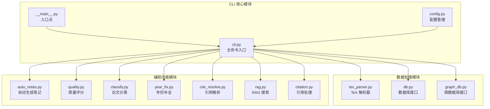
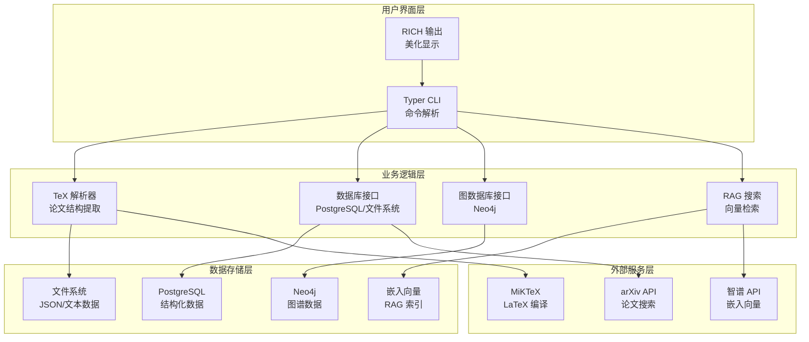
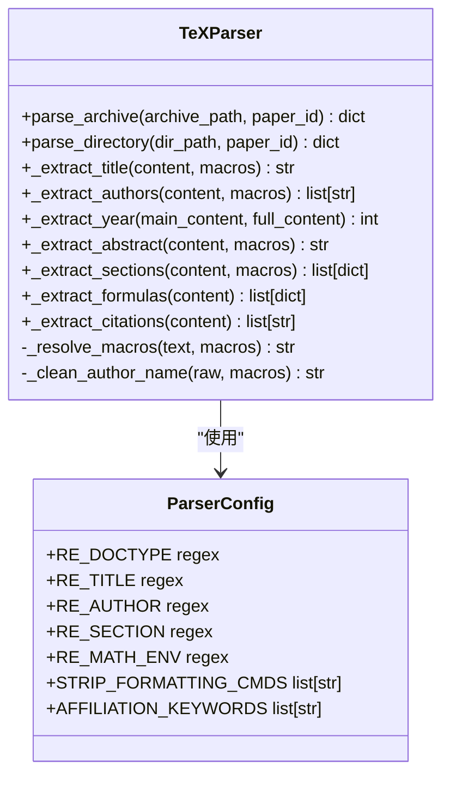
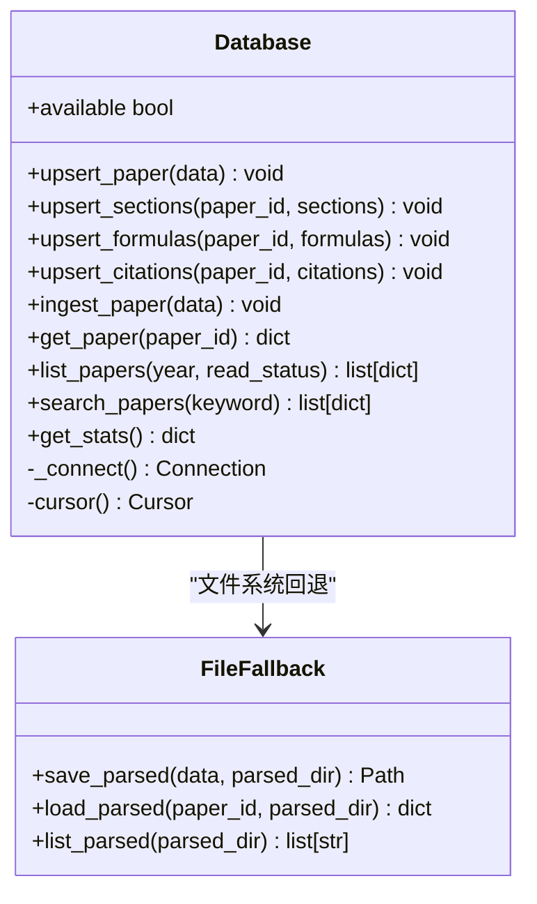
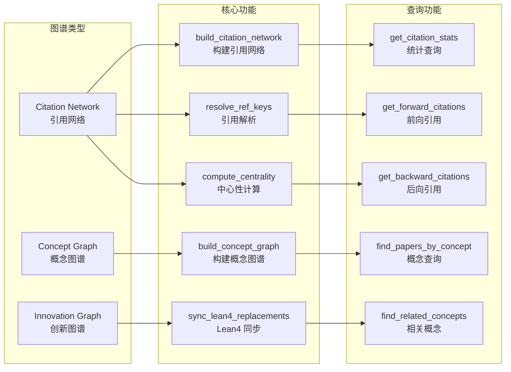
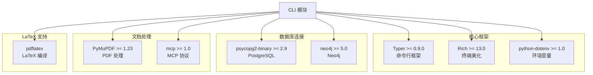
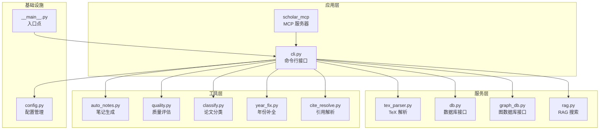
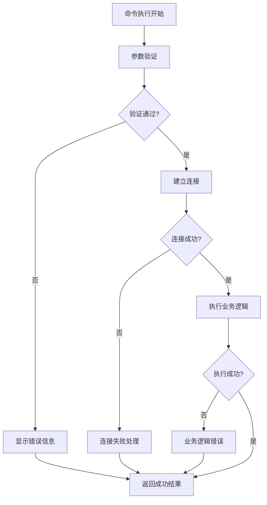

# 命令行接口

<cite>
**本文档引用的文件**
- [cli.py](file://scholar/cli.py)
- [__main__.py](file://scholar/__main__.py)
- [config.py](file://scholar/config.py)
- [db.py](file://scholar/db.py)
- [graph_db.py](file://scholar/graph_db.py)
- [tex_parser.py](file://scholar/tex_parser.py)
- [requirements.txt](file://requirements.txt)
- [README.md](file://README.md)
</cite>

## 目录
1. [简介](#简介)
2. [项目结构](#项目结构)
3. [核心组件](#核心组件)
4. [架构概览](#架构概览)
5. [详细组件分析](#详细组件分析)
6. [依赖关系分析](#依赖关系分析)
7. [性能考虑](#性能考虑)
8. [故障排除指南](#故障排除指南)
9. [结论](#结论)

## 简介

Scholar Studio 命令行接口是一个功能强大的学术研究工具集，专为管理和分析大规模论文库而设计。该系统基于 Typer 框架构建，提供了超过 30 个命令，涵盖了从论文解析、知识图谱构建到 RAG 语义搜索的完整学术研究工作流程。

该 CLI 模块的核心目标是将 440 篇 AI 演化方向论文的 TeX 源码转换为可查询、可推理、可组合的学术数据层，支持自动化调研、精读、对比和写作的全流程。

## 项目结构

Scholar Studio 的命令行接口位于 `scholar/` 目录下，采用模块化设计，每个功能模块都有清晰的职责分离：



**图表来源**
- [cli.py:1-1638](file://scholar/cli.py#L1-L1638)
- [config.py:1-62](file://scholar/config.py#L1-L62)

**章节来源**
- [cli.py:1-1638](file://scholar/cli.py#L1-L1638)
- [config.py:1-62](file://scholar/config.py#L1-L62)

## 核心组件

### 主要命令系统

CLI 模块基于 Typer 框架构建，提供了丰富的命令行功能：

| 命令类别 | 数量 | 功能概述 |
|---------|------|----------|
| **论文解析** | 4 | scan、parse、parse-all、info |
| **搜索与查询** | 6 | search、list-papers、stats、export-bib |
| **图谱分析** | 8 | graph-build、graph-stats、graph-query、cite-network |
| **RAG 语义搜索** | 4 | rag-index、rag-search、survey、landscape |
| **质量评估** | 3 | quality-score、auto-notes、classify |
| **外部集成** | 3 | arxiv-search、ingest、bootstrap |

### 配置管理系统

系统采用环境变量驱动的配置模式，支持灵活的部署和定制：

- **数据库配置**：PostgreSQL (pgvector) 和 Neo4j
- **嵌入模型配置**：支持多种嵌入提供商
- **文件路径配置**：自动解析项目根目录和输出目录
- **LaTeX 编译配置**：MiKTeX 支持

**章节来源**
- [cli.py:22-28](file://scholar/cli.py#L22-L28)
- [config.py:39-62](file://scholar/config.py#L39-L62)

## 架构概览

Scholar Studio 的命令行接口采用了分层架构设计，确保了良好的可扩展性和维护性：



**图表来源**
- [cli.py:12-1638](file://scholar/cli.py#L12-L1638)
- [db.py:24-270](file://scholar/db.py#L24-L270)
- [graph_db.py:32-922](file://scholar/graph_db.py#L32-L922)

## 详细组件分析

### TeX 解析器 (TeXParser)

TeX 解析器是整个系统的核心组件之一，负责将复杂的 LaTeX 源码转换为结构化的 JSON 数据：



**图表来源**
- [tex_parser.py:23-1605](file://scholar/tex_parser.py#L23-L1605)

#### 核心解析能力

| 解析类型 | 支持格式 | 特殊功能 |
|---------|----------|----------|
| **标题提取** | `\title{}`、`\icmltitle{}` | 宏展开、格式清理、多级嵌套 |
| **作者提取** | `\author{}`、`\icmlauthor{}` | 多种分隔符、`\and`、`\And`、`\quad` |
| **年份提取** | `\acmYear{}`、会议样式 | arXiv ID、注释解析、宏定义 |
| **摘要提取** | `\begin{abstract}...\end{abstract}` | 宏清理、引用替换、URL 处理 |
| **章节提取** | `\section{}`、`\subsection{}` | 环境清理、噪声移除、列表转换 |
| **公式提取** | `equation`、`align`、`$$...$$` | 标签识别、环境分类、去重处理 |
| **引用提取** | `\cite{}`、`\bibitem{}` | 多格式支持、键值清理、排序输出 |

**章节来源**
- [tex_parser.py:23-1605](file://scholar/tex_parser.py#L23-L1605)

### 数据库接口 (Database)

数据库接口提供了统一的数据访问抽象，支持 PostgreSQL 和文件系统两种存储模式：



**图表来源**
- [db.py:24-270](file://scholar/db.py#L24-L270)

#### 数据库模式设计

系统采用混合存储策略，确保在数据库不可用时仍能正常工作：

| 存储类型 | 适用场景 | 特点 |
|---------|----------|------|
| **PostgreSQL** | 生产环境、大数据量 | ACID 事务、复杂查询、并发安全 |
| **文件系统** | 开发测试、小规模数据 | 无需数据库、简单可靠 |
| **内存缓存** | 高频访问数据 | 快速响应、临时存储 |

**章节来源**
- [db.py:24-270](file://scholar/db.py#L24-L270)

### 图数据库接口 (GraphDB)

图数据库接口专门处理 Neo4j 的复杂图谱操作，支持三种主要图谱类型：



**图表来源**
- [graph_db.py:32-922](file://scholar/graph_db.py#L32-L922)

#### 图谱构建流程

系统实现了完整的图谱构建流水线，包括引用网络、概念图谱和创新图谱的协同构建：

| 流程阶段 | 步骤 | 描述 |
|---------|------|------|
| **引用网络构建** | 1 | 创建论文节点 (Paper) |
| | 2 | 创建引用边 (CITES) |
| | 3 | 解析引用键到 ULID |
| | 4 | 计算中心性指标 |
| **概念图谱构建** | 1 | 加载创新节点 (Innovation) |
| | 2 | 文本匹配概念 |
| | 3 | 构建共现关系 |
| | 4 | 同步 Lean4 关系 |
| **图谱同步** | 1 | 更新 Neo4j 节点属性 |
| | 2 | 维护图谱完整性 |
| | 3 | 清理孤立节点 |

**章节来源**
- [graph_db.py:225-922](file://scholar/graph_db.py#L225-L922)

### 命令行命令详解

#### 论文解析命令

##### scan 命令
扫描论文库并显示解析状态，支持大论文集的高效浏览。

**语法**：
```bash
python -m scholar scan
```

**功能特性**：
- 显示论文总数和解析状态
- 统计源文件、PDF 文件和解析完成情况
- 支持大列表的智能截断显示
- 提供聚合统计信息

##### parse 命令
解析单篇论文的 TeX 源码，生成结构化 JSON 数据。

**语法**：
```bash
python -m scholar parse <ULID>
```

**参数说明**：
- `ULID`：论文唯一标识符，对应 `data/papers/<ULID>/` 目录

**处理流程**：
1. 验证论文目录存在性
2. 调用 TeX 解析器提取元数据
3. 保存解析结果到 `output/parsed/`
4. 尝试写入数据库
5. 显示解析摘要信息

##### parse-all 命令
批量解析所有论文，支持限制数量和强制重新解析。

**语法**：
```bash
python -m scholar parse-all [--limit N] [--force]
```

**选项参数**：
- `--limit N`：最大解析数量 (默认: 0, 表示全部)
- `--force`：强制重新解析已解析的论文

**处理策略**：
- 自动过滤已解析的论文
- 支持进度条显示
- 错误收集和报告
- 批量数据库写入优化

**章节来源**
- [cli.py:45-234](file://scholar/cli.py#L45-L234)

#### 搜索与查询命令

##### search 命令
跨论文库的全文搜索，支持数据库优先和文件系统回退。

**语法**：
```bash
python -m scholar search "<关键词>" [--limit N]
```

**选项参数**：
- `--limit N`：最大结果数量 (默认: 20)

**搜索策略**：
1. **数据库优先**：使用 PostgreSQL 全文索引
2. **文件系统回退**：遍历解析的 JSON 文件
3. **智能评分**：根据匹配位置给予不同权重
4. **结果排序**：按相关性分数降序排列

##### list-papers 命令
列出已解析的论文，支持按年份过滤和数量限制。

**语法**：
```bash
python -m scholar list-papers [--year Y] [--limit N]
```

**选项参数**：
- `--year Y`：按年份过滤 (可选)
- `--limit N`：最大显示数量 (默认: 30)

**输出字段**：
- 论文 ID (ULID)
- 标题 (最多 50 字符)
- 年份
- 会议/期刊
- 章节数量
- 公式数量
- 引用数量

##### stats 命令
显示知识库统计信息，包括元数据覆盖率和分布情况。

**语法**：
```bash
python -m scholar stats
```

**统计维度**：
- 基础统计：论文总数、解析完成率
- 内容统计：章节、公式、引用总数
- 元数据统计：年份、作者、摘要、会议覆盖率
- 时间分布：按年份统计
- 会议分布：按期刊/会议统计

**章节来源**
- [cli.py:306-482](file://scholar/cli.py#L306-L482)

#### 图谱分析命令

##### graph-build 命令
构建完整的知识图谱，包括引用网络、概念图谱和创新图谱。

**语法**：
```bash
python -m scholar graph-build
```

**构建流程**：
1. **引用网络构建**：创建论文节点和引用关系
2. **引用解析**：将引用键解析为实际论文 ULID
3. **中心性计算**：计算论文的影响力指标
4. **概念图谱构建**：基于 Lean4 创新节点建立概念关系
5. **Lean4 同步**：同步 REPLACES 关系

**输出统计**：
- 引用边数量
- 解析成功的引用数量
- 概念链接数量
- 共现关系数量
- REPLACES 关系数量

##### graph-stats 命令
显示图谱的详细统计信息，包括节点、边和中心性指标。

**语法**：
```bash
python -m scholar graph-stats
```

**统计指标**：
- **节点统计**：论文节点、创新节点数量
- **边统计**：CITES、HAS_CONCEPT、RELATED_TO、REPLACES 边数量
- **引用统计**：已解析和未解析的引用关系
- **隔离节点**：没有任何连接的论文
- **热门论文**：按被引用次数排序的前 10 篇论文
- **桥接论文**：具有高桥接能力的论文

##### graph-query 命令
查询特定概念相关的论文和相关概念。

**语法**：
```bash
python -m scholar graph-query "<概念ID>"
```

**查询结果**：
- 相关论文列表（最多 20 篇）
- 相关概念及其权重和行信息

##### cite-network 命令
分析引用网络，支持全局统计和单篇分析。

**语法**：
```bash
python -m scholar cite-network [ULID]
```

**分析模式**：
- **全局模式**：显示整体引用网络统计
- **单篇模式**：分析指定论文的前向和后向引用

**输出内容**：
- 全局统计：论文总数、引用总数
- 单篇分析：前向引用（该论文引用的论文）、后向引用（被引用的论文）

**章节来源**
- [cli.py:673-893](file://scholar/cli.py#L673-L893)

#### RAG 语义搜索命令

##### rag-index 命令
构建 RAG 向量索引，支持多种嵌入模型。

**语法**：
```bash
python -m scholar rag-index
```

**前置条件**：
- 设置 `SCHOLAR_EMBEDDING_API_KEY` 环境变量
- 支持的嵌入模型：`embedding-2` (智谱)

**构建过程**：
1. 验证 API Key 存在
2. 为所有论文段落生成嵌入向量
3. 构建 HNSW 向量索引
4. 存储到数据库中

**输出统计**：
- 论文数量
- 总段落数量
- 成功嵌入数量
- 失败数量
- 索引状态

##### rag-search 命令
执行 RAG 语义搜索，支持混合搜索模式。

**语法**：
```bash
python -m scholar rag-search "<查询>" [--limit N] [--hybrid]
```

**选项参数**：
- `--limit N`：最大结果数量 (默认: 10)
- `--hybrid`：启用混合搜索模式

**搜索模式**：
- **向量搜索**：基于嵌入相似度
- **混合搜索**：向量 + BM25 + RRF 融合
- **回退机制**：无 API Key 时自动使用全文搜索

**输出格式**：
- 论文 ID
- 段落标题
- 内容片段
- 相似度分数

##### survey 命令
执行完整的调研流程，整合多种搜索和分析结果。

**语法**：
```bash
python -m scholar survey "<研究主题>" [--depth D] [--limit N]
```

**选项参数**：
- `--depth D`：调研深度 (`standard` 或 `full`)
- `--limit N`：最大论文数量 (默认: 20)

**工作流程**：
1. **混合 RAG 搜索**：结合向量和关键词搜索
2. **图谱概念查询**：基于概念图谱发现相关论文
3. **元数据丰富**：加载论文详细信息
4. **分类分析**：统计领域分布
5. **时间线生成**：按年份组织论文
6. **结果输出**：生成 Markdown 报告

**章节来源**
- [cli.py:937-1515](file://scholar/cli.py#L937-L1515)

#### 质量评估命令

##### quality-score 命令
对论文进行多维度质量评分。

**语法**：
```bash
python -m scholar quality-score [ULID] [--all]
```

**选项参数**：
- `ULID`：论文唯一标识符
- `--all`：对所有论文进行评分

**评分维度**：
- **创新性**：研究贡献和新颖性
- **方法论**：实验设计和方法合理性
- **结果**：实验结果的有效性和可靠性
- **表达**：论文写作质量和清晰度
- **影响**：引用影响力和学术价值
- **完整性**：实验和分析的完整性
- **可重复性**：实验可重现性

**评分等级**：A (优秀)、B (良好)、C (合格)、D (需改进)、F (不合格)

##### auto-notes 命令
自动生成论文阅读笔记。

**语法**：
```bash
python -m scholar auto-notes [ULID] [--force]
```

**选项参数**：
- `ULID`：论文唯一标识符 (可选，省略表示批量处理)
- `--force`：覆盖现有笔记

**处理模式**：
- **单篇模式**：生成指定论文的详细笔记
- **批量模式**：为所有论文生成基础笔记
- **智能合并**：结合人工和自动分析结果

##### classify 命令
对论文进行领域分类。

**语法**：
```bash
python -m scholar classify [ULID] [--all] [--list-tags]
```

**选项参数**：
- `ULID`：论文唯一标识符
- `--all`：对所有论文进行分类
- `--list-tags`：列出所有标签

**分类维度**：
- **领域 (Domains)**：主要研究领域
- **子方向 (Sub-directions)**：具体研究方向
- **方法 (Methods)**：采用的方法和技术

**标签体系**：基于 125 个 Lean4 创新节点构建的概念标签体系

**章节来源**
- [cli.py:1033-1125](file://scholar/cli.py#L1033-L1125)

#### 外部集成命令

##### arxiv-search 命令
搜索 arXiv 论文库。

**语法**：
```bash
python -m scholar arxiv-search "<查询>" [--max N]
```

**选项参数**：
- `--max N`：最大结果数量 (默认: 10)

**搜索范围**：
- 标题、摘要、作者、分类
- 支持布尔查询和通配符
- 按相关性排序

**输出信息**：
- 序号
- 标题 (最多 55 字符)
- 作者 (最多 3 个，其余用 "等" 表示)
- 发布年份
- arXiv ID

##### ingest 命令
增量导入单篇新论文。

**语法**：
```bash
python -m scholar ingest <ULID>
```

**处理流程**：
1. **论文解析**：提取元数据和内容
2. **作者补全**：通过 arXiv API 补充缺失作者
3. **笔记生成**：创建阅读笔记
4. **质量评分**：进行多维度评分
5. **分类标注**：自动分类
6. **图谱更新**：更新 Neo4j 图谱
7. **RAG 重索引**：更新向量索引

##### bootstrap 命令
执行完整的初始化流程。

**语法**：
```bash
python -m scholar bootstrap
```

**执行步骤**：
1. **论文解析**：解析所有未处理的论文
2. **年份补全**：通过 Lean4 和启发式方法补全年份
3. **作者补全**：通过 arXiv API 补全作者信息
4. **图谱构建**：构建 Neo4j 图谱
5. **数据库同步**：同步到 PostgreSQL
6. **RAG 索引**：构建向量索引
7. **笔记生成**：生成阅读笔记
8. **质量评分**：进行质量评估
9. **论文分类**：进行领域分类

**章节来源**
- [cli.py:1155-1372](file://scholar/cli.py#L1155-L1372)

## 依赖关系分析

### 外部依赖

Scholar Studio 的命令行接口依赖于多个外部库，每个库都有明确的职责分工：



**图表来源**
- [requirements.txt:1-9](file://requirements.txt#L1-L9)

### 内部模块依赖

各模块之间的依赖关系体现了清晰的分层架构：



**图表来源**
- [cli.py:1-1638](file://scholar/cli.py#L1-L1638)
- [config.py:1-62](file://scholar/config.py#L1-L62)

**章节来源**
- [requirements.txt:1-9](file://requirements.txt#L1-L9)
- [cli.py:1-1638](file://scholar/cli.py#L1-L1638)

## 性能考虑

### 并发处理

系统在多个层面实现了并发优化：

| 优化层次 | 实现方式 | 性能提升 |
|---------|----------|----------|
| **数据库连接池** | 使用连接复用和自动 ping | 减少连接建立开销 |
| **批量操作** | 批量插入和更新 | 提高写入效率 |
| **异步处理** | 进度条和实时反馈 | 改善用户体验 |
| **缓存策略** | 频繁访问数据缓存 | 减少重复计算 |

### 内存管理

系统采用渐进式数据处理策略：

- **流式解析**：逐个处理论文文件，避免内存峰值
- **分页查询**：数据库查询结果分批处理
- **临时文件**：大文件操作使用临时目录
- **垃圾回收**：及时释放不再使用的对象

### 网络优化

对外部服务的访问进行了优化：

- **超时控制**：合理设置请求超时时间
- **重试机制**：网络异常时自动重试
- **连接复用**：HTTP 连接池复用
- **错误隔离**：单个请求失败不影响整体流程

## 故障排除指南

### 常见问题诊断

#### 数据库连接问题

**症状**：命令执行时报数据库连接错误

**诊断步骤**：
1. 检查数据库服务状态
2. 验证连接参数配置
3. 确认网络连通性
4. 检查防火墙设置

**解决方案**：
- 重启数据库服务
- 更新连接字符串
- 检查端口映射
- 验证凭据正确性

#### Neo4j 连接问题

**症状**：图谱相关命令执行失败

**诊断步骤**：
1. 检查 Docker 容器状态
2. 验证 Bolt 协议端口 (7687)
3. 确认认证信息正确
4. 检查图谱数据完整性

**解决方案**：
- 重新启动 Neo4j 容器
- 更新认证配置
- 清理损坏的图谱数据
- 检查磁盘空间

#### RAG 搜索问题

**症状**：RAG 相关命令无结果或报错

**诊断步骤**：
1. 检查 API Key 配置
2. 验证嵌入向量索引
3. 确认网络连接
4. 检查嵌入模型兼容性

**解决方案**：
- 重新设置 API Key
- 重建向量索引
- 检查网络代理设置
- 更新嵌入模型

#### 文件权限问题

**症状**：文件读写操作失败

**诊断步骤**：
1. 检查输出目录权限
2. 验证 LaTeX 编译器可用性
3. 确认临时文件夹权限
4. 检查 PDF 处理权限

**解决方案**：
- 更新目录权限设置
- 安装缺失的 LaTeX 包
- 清理临时文件
- 重新配置文件系统权限

### 错误处理策略

系统实现了多层次的错误处理机制：



**错误处理原则**：
- **优雅降级**：数据库不可用时使用文件系统回退
- **详细日志**：记录完整的错误堆栈信息
- **用户友好**：提供清晰的错误提示和解决方案
- **自动恢复**：支持断点续传和错误重试

**章节来源**
- [cli.py:31-39](file://scholar/cli.py#L31-L39)
- [db.py:15-44](file://scholar/db.py#L15-L44)
- [graph_db.py:24-49](file://scholar/graph_db.py#L24-L49)

## 结论

Scholar Studio 的命令行接口模块展现了现代学术研究工具的完整架构设计。通过精心设计的模块化结构、强大的数据处理能力和完善的错误处理机制，该系统能够高效地管理大规模论文库并提供丰富的分析功能。

### 主要优势

1. **模块化设计**：清晰的职责分离和依赖关系
2. **多存储支持**：灵活的数据库和文件系统选择
3. **高性能处理**：并发优化和内存管理策略
4. **用户友好**：丰富的命令和详细的帮助信息
5. **可扩展性**：插件化架构支持功能扩展

### 技术特色

- **智能 TeX 解析**：支持复杂的 LaTeX 格式和宏定义
- **多维图谱分析**：引用网络、概念图谱、创新图谱协同
- **RAG 语义搜索**：向量检索与传统搜索的融合
- **自动化工作流**：从解析到分析的完整流水线

### 未来发展方向

1. **性能优化**：进一步提升大规模数据处理能力
2. **功能扩展**：支持更多学术研究场景
3. **用户体验**：增强交互式分析和可视化功能
4. **集成能力**：与其他学术平台和服务的深度集成

该命令行接口模块为学术研究提供了强大而灵活的工具集，是构建现代化学术研究基础设施的重要组成部分。