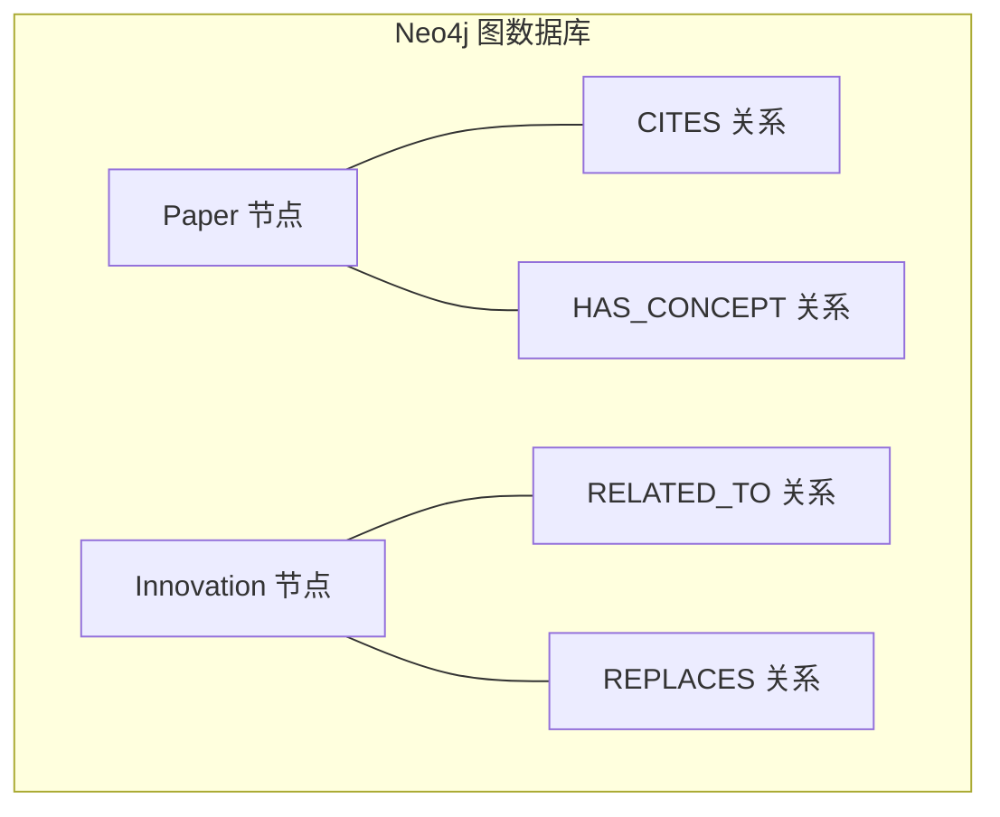
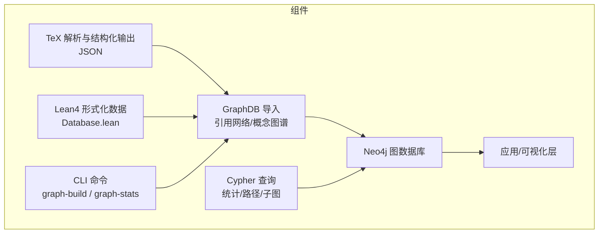
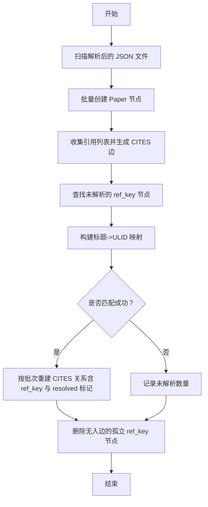
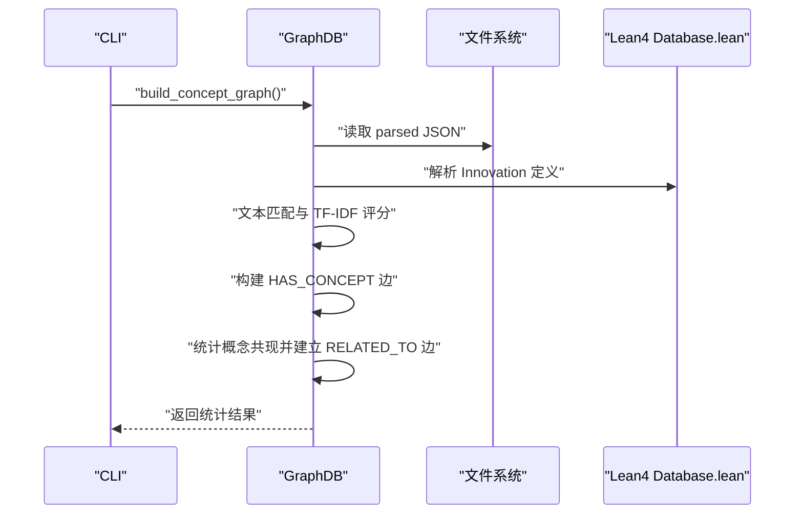
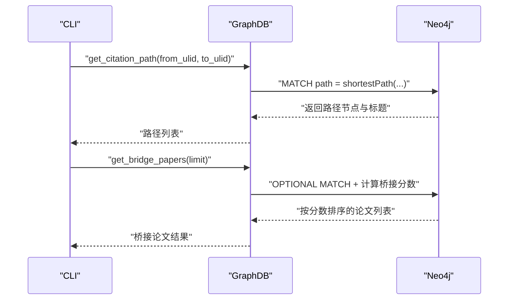
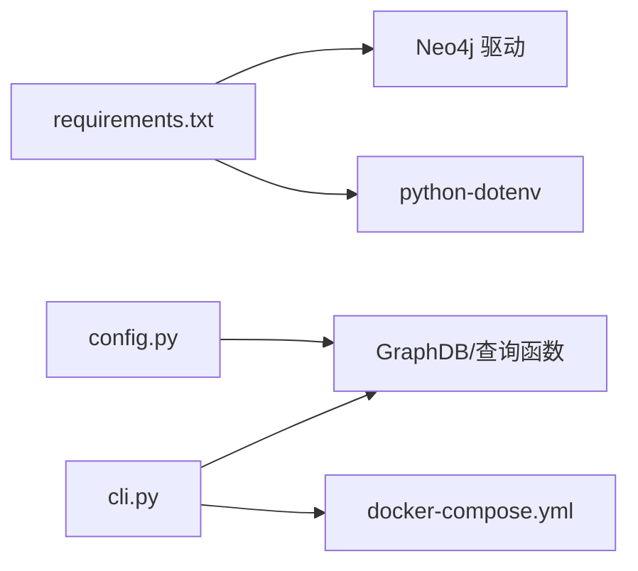

# 图数据库集成

<cite>
**本文引用的文件**
- [graph_db.py](file://scholar/graph_db.py)
- [cli.py](file://scholar/cli.py)
- [config.py](file://scholar/config.py)
- [db.py](file://scholar/db.py)
- [docker-compose.yml](file://infra/docker-compose.yml)
- [requirements.txt](file://requirements.txt)
- [__main__.py](file://scholar/__main__.py)
- [startup.ps1](file://startup.ps1)
- [Database.lean](file://LEAN/AiEvolution/Database.lean)
</cite>

## 目录
1. [简介](#简介)
2. [项目结构](#项目结构)
3. [核心组件](#核心组件)
4. [架构总览](#架构总览)
5. [详细组件分析](#详细组件分析)
6. [依赖分析](#依赖分析)
7. [性能考虑](#性能考虑)
8. [故障排查指南](#故障排查指南)
9. [结论](#结论)
10. [附录](#附录)

## 简介
本技术文档面向“图数据库集成模块”，系统性阐述基于 Neo4j 的知识图谱构建与管理能力，涵盖连接配置、节点与关系建模、实体识别与关系抽取、Cypher 查询与图遍历、增删改查与批量导入、图算法（中心性、桥接度）、以及性能优化与集群部署建议。文档同时提供可操作的命令行接口与可视化思路，帮助读者快速上手并扩展图数据库能力。

## 项目结构
该模块位于 scholar/graph_db.py，围绕三类图谱进行构建与查询：
- 引用网络：Paper 节点通过 CITES 关系互联
- 概念图谱：Paper 通过 HAS_CONCEPT 连接到 Innovation 节点；Innovation 节点之间通过 RELATED_TO 构建共现关系；同时存在 REPLACES 关系（来自 Lean4 形式化数据）
- 创新演进图：由 REPLACES 关系表达创新替代路径

图表来源
- [graph_db.py:225-281](file://scholar/graph_db.py#L225-L281)
- [graph_db.py:636-733](file://scholar/graph_db.py#L636-L733)
- [graph_db.py:794-839](file://scholar/graph_db.py#L794-L839)

章节来源
- [graph_db.py:1-10](file://scholar/graph_db.py#L1-L10)
- [graph_db.py:225-281](file://scholar/graph_db.py#L225-L281)
- [graph_db.py:636-733](file://scholar/graph_db.py#L636-L733)
- [graph_db.py:794-839](file://scholar/graph_db.py#L794-L839)

## 核心组件
- 连接层：GraphDB 封装 Neo4j 驱动，提供可用性检测、会话执行与连接复用
- 数据导入层：构建引用网络、解析 ref_key、计算中心性指标、构建概念图谱、同步 Lean4 替代关系
- 查询层：统计、路径查找、桥接度评估、子图提取
- 命令行入口：CLI 提供 graph-build、graph-stats 等命令，驱动图谱构建与统计展示

章节来源
- [graph_db.py:32-70](file://scholar/graph_db.py#L32-L70)
- [graph_db.py:225-281](file://scholar/graph_db.py#L225-L281)
- [graph_db.py:334-364](file://scholar/graph_db.py#L334-L364)
- [cli.py:673-716](file://scholar/cli.py#L673-L716)

## 架构总览
下图展示了从解析到入库再到查询的整体流程，以及与 Lean4 数据源的衔接。

图表来源
- [cli.py:673-716](file://scholar/cli.py#L673-L716)
- [graph_db.py:225-281](file://scholar/graph_db.py#L225-L281)
- [graph_db.py:636-733](file://scholar/graph_db.py#L636-L733)
- [graph_db.py:794-839](file://scholar/graph_db.py#L794-L839)

## 详细组件分析

### 连接与可用性检测
- GraphDB 类负责 Neo4j 连接与会话管理，支持可用性探测（RETURN 1），避免无效连接
- 通过 config 中的环境变量注入 URI、用户名与密码，确保部署一致性

章节来源
- [graph_db.py:32-70](file://scholar/graph_db.py#L32-L70)
- [config.py:46-49](file://scholar/config.py#L46-L49)

### 引用网络构建与修复
- 节点与边生成：批量创建 Paper 节点，基于 parsed JSON 的 citations 字段创建 CITES 边
- 引用键修复：将 ref_key 映射到真实 ULID，采用规范化标题匹配与模糊评分，分批重建关系并清理孤立节点
- 中心性指标：计算每个 Paper 的入度、出度与桥接分数（in_degree × out_degree / (in_degree + out_degree)）

图表来源
- [graph_db.py:225-281](file://scholar/graph_db.py#L225-L281)
- [graph_db.py:85-178](file://scholar/graph_db.py#L85-L178)

章节来源
- [graph_db.py:225-281](file://scholar/graph_db.py#L225-L281)
- [graph_db.py:85-178](file://scholar/graph_db.py#L85-L178)
- [graph_db.py:180-223](file://scholar/graph_db.py#L180-L223)

### 概念图谱构建与匹配
- 动态加载：从 Lean4 Database.lean 中解析 125 个 Innovation 节点，若文件缺失则回退至内置种子数据
- 文本匹配：对每篇 Paper，拼接标题、摘要与章节标题，与 CONCEPT_ALIASES 进行关键词匹配，得到候选概念集合
- 共现关系：统计 Paper 所含概念的共现频次，形成 RELATED_TO 边并设置权重
- 同步 REPLACES：从 Lean4 加载替换关系，建立 Innovation 间的 REPLACES 边

图表来源
- [graph_db.py:636-733](file://scholar/graph_db.py#L636-L733)
- [graph_db.py:371-406](file://scholar/graph_db.py#L371-L406)
- [graph_db.py:794-839](file://scholar/graph_db.py#L794-L839)

章节来源
- [graph_db.py:636-733](file://scholar/graph_db.py#L636-L733)
- [graph_db.py:371-406](file://scholar/graph_db.py#L371-L406)
- [graph_db.py:794-839](file://scholar/graph_db.py#L794-L839)

### 查询与分析接口
- 统计查询：节点/边总数、已解析与未解析引用数、孤立节点数
- 路径查询：使用 shortestPath 计算两 Paper 之间的最短引用路径
- 桥接度评估：基于入度与出度的桥接分数近似，筛选跨领域桥梁论文
- 子图提取：按给定概念 ID 列表返回节点与边信息，便于可视化

图表来源
- [graph_db.py:334-364](file://scholar/graph_db.py#L334-L364)
- [graph_db.py:345-364](file://scholar/graph_db.py#L345-L364)

章节来源
- [graph_db.py:287-364](file://scholar/graph_db.py#L287-L364)
- [graph_db.py:767-787](file://scholar/graph_db.py#L767-L787)

### 增删改查与增量更新
- 增量 Upsert：针对单篇 Paper，支持重新创建其 CITES 边与 HAS_CONCEPT 边，保证数据一致性
- 删除：在重建前删除既有 CITES 边，避免重复
- 更新：MERGE 确保节点属性与关系的幂等更新

章节来源
- [graph_db.py:846-922](file://scholar/graph_db.py#L846-L922)

### 命令行集成
- graph-build：依次执行引用网络构建、ref_key 修复、中心性计算、概念图谱构建、Lean4 同步
- graph-stats：输出节点/边统计、孤立节点、Top 被引与桥接论文

章节来源
- [cli.py:673-716](file://scholar/cli.py#L673-L716)
- [cli.py:721-800](file://scholar/cli.py#L721-L800)

## 依赖分析
- 外部依赖：neo4j（驱动）、python-dotenv（环境变量加载）、psycopg2（可选 PostgreSQL 存储）
- 内部依赖：config 提供统一配置；CLI 作为入口协调各模块

图表来源
- [requirements.txt:1-9](file://requirements.txt#L1-L9)
- [config.py:46-49](file://scholar/config.py#L46-L49)
- [cli.py:673-716](file://scholar/cli.py#L673-L716)
- [docker-compose.yml:21-40](file://infra/docker-compose.yml#L21-L40)

章节来源
- [requirements.txt:1-9](file://requirements.txt#L1-L9)
- [config.py:46-49](file://scholar/config.py#L46-L49)
- [cli.py:673-716](file://scholar/cli.py#L673-L716)
- [docker-compose.yml:21-40](file://infra/docker-compose.yml#L21-L40)

## 性能考虑
- 批处理写入：多处使用 UNWIND + 批大小（如 100）减少往返开销
- 幂等更新：MERGE 用于节点与关系，避免重复与冲突
- 索引建议（通用实践，非当前实现）：为 Paper.ulid 与 Innovation.id 建唯一索引；对高频查询属性（year、in_degree、bridge_score）建立索引
- 查询优化：优先使用 MATCH + 限定字段投影；避免 N+1 查询；合理使用 LIMIT
- 集群与资源：根据数据规模调整 Neo4j heap 与插件（如 APOC）配置；必要时启用副本与只读实例

## 故障排查指南
- Neo4j 不可用：检查 URI、认证与容器状态；使用 docker-compose 健康检查确认服务就绪
- 引用修复失败：核对 parsed JSON 的 citations 字段格式；确认规范化与模糊匹配逻辑是否命中
- 中心性计算异常：确认 Paper 节点属性（in_degree/out_degree/bridge_score）是否已写入
- CLI 报错：graph-build 前先确保 Neo4j 可达；graph-stats 需要已有图数据

章节来源
- [cli.py:673-716](file://scholar/cli.py#L673-L716)
- [cli.py:721-800](file://scholar/cli.py#L721-L800)
- [docker-compose.yml:35-39](file://infra/docker-compose.yml#L35-L39)

## 结论
该模块以 Neo4j 为核心，实现了从学术论文解析数据到引用网络与概念图谱的完整闭环。通过 CLI 命令即可完成大规模图谱构建与统计分析，并提供了路径查找、桥接度评估等实用能力。结合 Lean4 形式化数据，进一步增强了知识图谱的权威性与可追溯性。后续可在索引策略、查询优化与集群部署方面持续增强。

## 附录

### Cypher 使用要点
- 批量写入：UNWIND + 参数映射，提升吞吐
- 幂等更新：MERGE 节点与关系，SET 属性
- 最短路径：shortestPath 适用于引用网络路径分析
- 条件投影：仅返回所需字段，降低网络与内存开销

章节来源
- [graph_db.py:253-261](file://scholar/graph_db.py#L253-L261)
- [graph_db.py:273-278](file://scholar/graph_db.py#L273-L278)
- [graph_db.py:336-342](file://scholar/graph_db.py#L336-L342)

### 知识图谱可视化方案
- 可视化工具：Neo4j 浏览器（默认端口 7474）或第三方前端（如 G6、Cytoscape.js）
- 数据导出：graph_stats 输出的节点/边统计可用于前端渲染；子图查询可按需裁剪
- 交互设计：点击节点显示元信息（标题、年份、被引数等）；拖拽布局与缩放；高亮路径与桥接节点

章节来源
- [docker-compose.yml:25-27](file://infra/docker-compose.yml#L25-L27)
- [graph_db.py:767-787](file://scholar/graph_db.py#L767-L787)