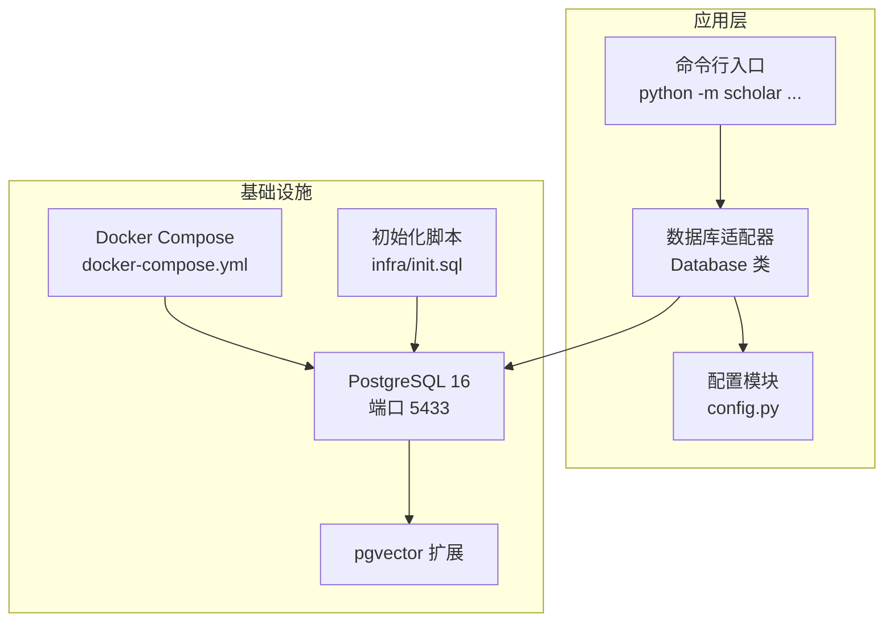
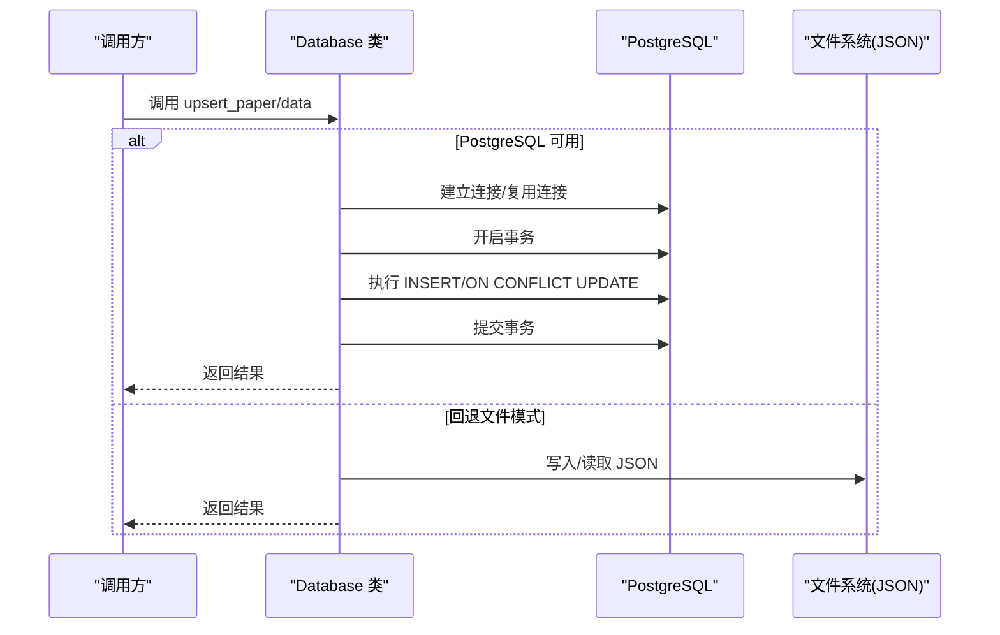
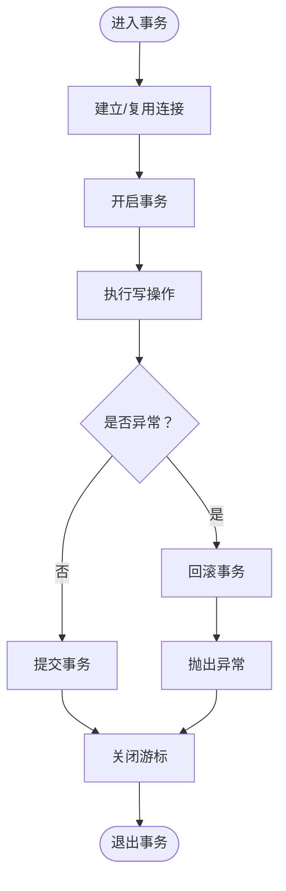
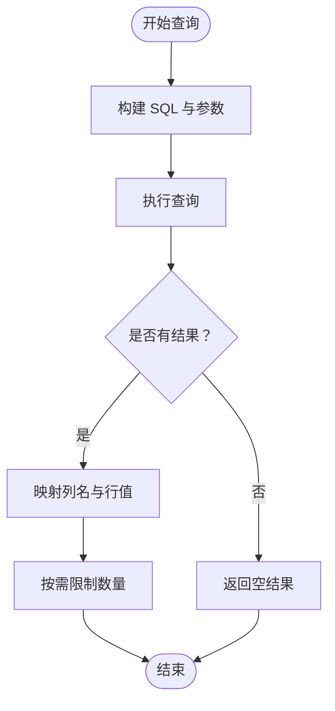
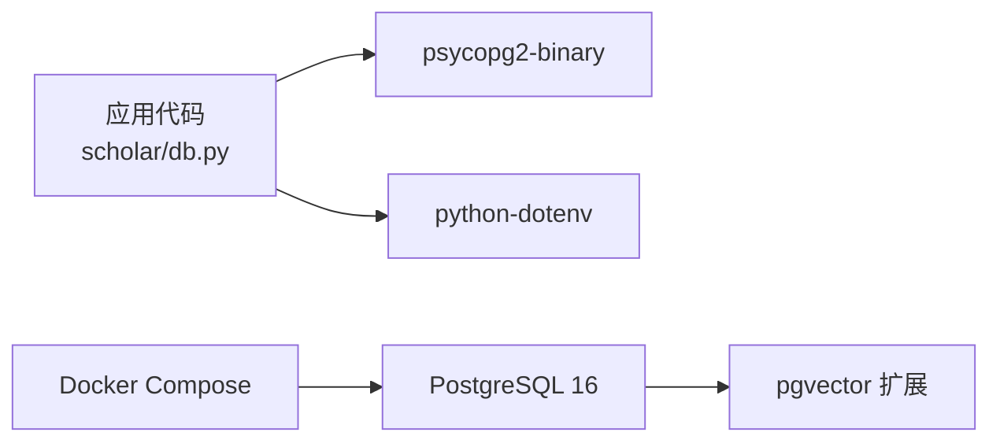

# 数据库层

<cite>
**本文引用的文件**
- [db.py](file://scholar/db.py)
- [config.py](file://scholar/config.py)
- [init.sql](file://infra/init.sql)
- [requirements.txt](file://requirements.txt)
- [startup.ps1](file://startup.ps1)
</cite>

## 目录
1. [简介](#简介)
2. [项目结构](#项目结构)
3. [核心组件](#核心组件)
4. [架构总览](#架构总览)
5. [详细组件分析](#详细组件分析)
6. [依赖分析](#依赖分析)
7. [性能考虑](#性能考虑)
8. [故障排除指南](#故障排除指南)
9. [结论](#结论)
10. [附录](#附录)

## 简介
本文件面向数据库层模块，系统性阐述基于 PostgreSQL 的数据访问与持久化实现，涵盖连接管理、表结构设计、数据操作 API、索引与性能优化、并发控制、迁移与备份恢复策略，以及常见问题排查。数据库层以可选的 PostgreSQL 存储为核心，当 PostgreSQL 不可用时自动回退到文件系统（JSON）持久化，确保系统在不同环境下均可运行。

## 项目结构
数据库层主要由以下部分组成：
- 配置模块：读取环境变量并提供数据库连接参数与输出目录路径
- 数据库适配器：封装 psycopg2 连接、事务与上下文管理，并提供论文、章节、公式、引用等数据的增删改查接口
- 初始化脚本：定义数据库模式（含扩展启用、表结构、索引、唯一约束）
- 依赖声明：列出 Python 包依赖，包括 psycopg2-binary、python-dotenv 等
- 启动脚本：通过 Docker Compose 启动数据库与图数据库服务，并进行健康检查



图表来源
- [db.py:1-270](file://scholar/db.py#L1-L270)
- [config.py:1-62](file://scholar/config.py#L1-L62)
- [init.sql:1-131](file://infra/init.sql#L1-L131)
- [startup.ps1:1-64](file://startup.ps1#L1-L64)

章节来源
- [db.py:1-270](file://scholar/db.py#L1-L270)
- [config.py:1-62](file://scholar/config.py#L1-L62)
- [init.sql:1-131](file://infra/init.sql#L1-L131)
- [requirements.txt:1-9](file://requirements.txt#L1-L9)
- [startup.ps1:1-64](file://startup.ps1#L1-L64)

## 核心组件
- Database 类：提供连接检测、连接复用、事务提交/回滚、上下文管理；实现论文、章节、公式、引用的插入/更新/替换/查询等操作
- 文件回退：当 PostgreSQL 不可用时，提供保存/加载解析后的 JSON 数据的能力
- 配置模块：集中管理数据库连接参数、输出目录、嵌入模型参数等

章节来源
- [db.py:24-270](file://scholar/db.py#L24-L270)
- [config.py:39-62](file://scholar/config.py#L39-L62)

## 架构总览
数据库层采用“可选 PostgreSQL + 文件回退”的双模持久化策略：
- 可用性优先：每次连接前先探测 PostgreSQL 是否可用，不可用则回退到文件系统
- 事务安全：所有写操作通过上下文管理器包裹，异常自动回滚，成功提交
- 数据一致性：使用 ON CONFLICT 更新策略保证幂等写入；删除后重插保持数据完整性



图表来源
- [db.py:31-74](file://scholar/db.py#L31-L74)
- [db.py:79-121](file://scholar/db.py#L79-L121)

## 详细组件分析

### 数据库连接与事务管理
- 连接检测：通过临时连接尝试判断 PostgreSQL 可用性，避免缓存死连接
- 连接复用：若当前连接未失效则复用，否则重新建立
- 事务控制：使用上下文管理器确保异常时自动回滚，正常结束时提交
- 并发控制：默认隔离级别与锁行为遵循 PostgreSQL 默认设置；高并发场景建议结合业务锁或应用层去重



图表来源
- [db.py:46-74](file://scholar/db.py#L46-L74)

章节来源
- [db.py:31-74](file://scholar/db.py#L31-L74)

### 表结构与数据模型
数据库模式由初始化脚本统一定义，包含以下核心实体与关系：

```mermaid
erDiagram
PAPERS {
text id PK
text title
text[] authors
int year
text venue
text abstract
text arxiv_id
text doi
boolean has_tex
boolean parsed_ok
text parsed_path
int section_count
int formula_count
int citation_count
text read_status
timestamptz created_at
timestamptz updated_at
}
SECTIONS {
serial id PK
text paper_id FK
text heading
int level
text content
int position
timestamptz created_at
}
FORMULAS {
serial id PK
text paper_id FK
text latex
text label
text env_type
text context
boolean lean_verified
timestamptz created_at
}
CITATIONS {
serial id PK
text from_paper FK
text to_ref
text to_paper
boolean resolved
timestamptz created_at
}
CONCEPTS {
serial id PK
text name UK
text definition
timestamptz created_at
}
PAPER_CONCEPTS {
text paper_id FK
int concept_id FK
float relevance
primary key (paper_id, concept_id)
}
CHUNKS {
serial id PK
text paper_id FK
int section_id
text section
text content
vector embedding
timestamptz created_at
}
INNOVATIONS {
text id PK
text line
boolean core
int year
int scalability
int simplicity
int stability
timestamptz created_at
}
REPLACEMENTS {
serial id PK
text from_innov FK
text to_innov FK
timestamptz created_at
}
PAPERS ||--o{ SECTIONS : "拥有"
PAPERS ||--o{ FORMULAS : "拥有"
PAPERS ||--o{ CITATIONS : "引用"
PAPERS ||--o{ CHUNKS : "分块"
PAPERS ||--o{ PAPER_CONCEPTS : "关联"
CONCEPTS ||--o{ PAPER_CONCEPTS : "被关联"
INNOVATIONS ||--o{ REPLACEMENTS : "替换"
```

图表来源
- [init.sql:9-131](file://infra/init.sql#L9-L131)

章节来源
- [init.sql:1-131](file://infra/init.sql#L1-L131)

### 数据操作 API
以下为数据库层提供的数据操作接口与典型用法说明（按功能分组）：

- 论文级操作
  - upsert_paper(data)：按主键 id 插入或更新论文元数据，支持批量字段更新与时间戳刷新
  - get_paper(paper_id)：按 id 查询单条论文记录
  - list_papers(year=None, read_status=None)：按年份与阅读状态过滤列表，支持排序
  - search_papers(keyword)：全文检索标题、摘要与章节内容，返回限定数量的结果
  - get_stats()：统计总数、解析完成数、段落数、公式数、引用数及年份范围

- 结构化内容操作
  - upsert_sections(paper_id, sections)：替换某篇论文的所有章节，先清空再逐条插入
  - upsert_formulas(paper_id, formulas)：替换某篇论文的所有公式，先清空再逐条插入

- 引用关系操作
  - upsert_citations(paper_id, citations)：替换某篇论文的引用关系，避免重复冲突

- 全量导入
  - ingest_paper(data)：一次性写入论文、章节、公式与引用，保证原子性

- 文件回退能力
  - save_parsed(data, parsed_dir)：将解析后的 JSON 写入文件
  - load_parsed(paper_id, parsed_dir)：从文件读取解析后的 JSON
  - list_parsed(parsed_dir)：枚举已解析的论文 ID 列表

章节来源
- [db.py:79-170](file://scholar/db.py#L79-L170)
- [db.py:175-235](file://scholar/db.py#L175-L235)
- [db.py:242-270](file://scholar/db.py#L242-L270)

### 查询流程与索引优化
- 查询流程
  - get_paper：按主键精确查找
  - list_papers：动态拼接 where 条件，支持年份与阅读状态过滤
  - search_papers：对标题、摘要、章节内容进行模糊匹配，限制返回数量
  - get_stats：多表聚合统计

- 索引与约束
  - 主键与外键：papers.id、sections.paper_id、formulas.paper_id、citations.from_paper/to_paper 等
  - 唯一约束：citations(from_paper,to_ref)、concepts.name
  - 辅助索引：idx_sections_paper、idx_formulas_paper、idx_citations_from、idx_citations_to、idx_chunks_paper
  - 向量索引：chunks.embedding 使用 pgvector 扩展，用于后续语义检索



图表来源
- [db.py:184-215](file://scholar/db.py#L184-L215)
- [init.sql:41-105](file://infra/init.sql#L41-L105)

章节来源
- [db.py:175-235](file://scholar/db.py#L175-L235)
- [init.sql:9-131](file://infra/init.sql#L9-L131)

### ORM 使用模式与替代方案
- 当前实现为原生 SQL + psycopg2，未引入 ORM 映射层
- 若未来需要 ORM，推荐方案：
  - SQLAlchemy Core：轻量、灵活，适合现有 SQL 风格
  - SQLAlchemy ORM：强类型映射，适合复杂对象关系
  - Tortoise ORM：异步友好，适合高并发场景
- 迁移策略：先保留现有 SQL，逐步引入 ORM 映射类，通过 Alembic 或自定义迁移脚本同步变更

[本节为概念性指导，不直接分析具体文件]

## 依赖分析
- Python 依赖
  - psycopg2-binary：PostgreSQL 驱动
  - python-dotenv：从 .env 加载环境变量
  - 其他：typer、rich、neo4j、PyMuPDF、mcp 等（与数据库层非直接相关）

- 外部服务
  - PostgreSQL 16 + pgvector：结构化存储与向量检索
  - Docker Compose：一键启动数据库与图数据库服务



图表来源
- [requirements.txt:1-9](file://requirements.txt#L1-L9)
- [db.py:15-21](file://scholar/db.py#L15-L21)
- [config.py:11-18](file://scholar/config.py#L11-L18)

章节来源
- [requirements.txt:1-9](file://requirements.txt#L1-L9)
- [config.py:11-18](file://scholar/config.py#L11-L18)

## 性能考虑
- 连接管理
  - 复用连接：减少握手开销，提高吞吐
  - 连接池：建议在生产环境中引入连接池（如 psycopg2.pool.SimpleConnectionPool），并设置最大连接数、空闲超时与重试策略
- 索引优化
  - 为高频过滤字段（year、read_status、to_paper、paper_id）建立索引
  - 对全文检索字段使用 ILIKE 时，考虑 GIN/GiST 索引或全文检索类型以提升性能
- 并发控制
  - 写操作使用事务包裹，避免脏写
  - 批量写入（upsert_sections/formulas/citations）建议使用批量 INSERT 或 COPY 以降低往返次数
- 统计与监控
  - 定期执行 ANALYZE/VACUUM，维护统计信息
  - 监控慢查询日志，识别热点 SQL

[本节提供通用性能建议，不直接分析具体文件]

## 故障排除指南
- PostgreSQL 不可用
  - 现象：Database.available 返回 False，写操作回退到文件模式
  - 排查：确认 .env 中数据库连接参数、容器健康状态与端口映射
  - 参考：启动脚本会等待服务健康，随后进行快速状态检查
- 连接失败或超时
  - 现象：连接抛出异常或 ping 失败
  - 排查：检查防火墙、网络策略、认证方式与密码
- 写入异常导致回滚
  - 现象：事务异常时自动回滚，无副作用
  - 排查：查看异常堆栈定位具体 SQL 与参数
- 文件回退模式
  - 现象：无 psycopg2 依赖或连接失败时，使用 JSON 文件存储
  - 排查：确认输出目录存在且具备读写权限

章节来源
- [db.py:31-74](file://scholar/db.py#L31-L74)
- [startup.ps1:17-64](file://startup.ps1#L17-L64)

## 结论
数据库层以简洁稳健的方式实现了结构化数据的持久化与查询，既满足当前需求，又为未来扩展（连接池、ORM、向量检索）预留空间。通过合理的索引与事务策略，可在保证一致性的同时获得良好性能表现。

## 附录

### 数据库初始化与迁移
- 初始化步骤
  - 启动容器：使用 Docker Compose 启动 PostgreSQL 与图数据库
  - 执行初始化脚本：创建扩展、表、索引与约束
  - 验证服务健康：启动脚本会检查服务状态并输出统计信息
- 迁移策略
  - 版本化：为 schema 变更编写增量脚本，记录版本号
  - 回滚计划：保留快照与备份，确保可回滚到上一个稳定版本
  - 测试环境：先在测试环境验证迁移脚本，再推广至生产

章节来源
- [init.sql:1-131](file://infra/init.sql#L1-L131)
- [startup.ps1:11-64](file://startup.ps1#L11-L64)

### 备份与恢复
- 备份策略
  - 定时逻辑备份：使用 pg_dump 生成 SQL 备份
  - 持续保护：结合 WAL 归档与时间点恢复（PITR）
- 恢复流程
  - 全量恢复：从最近一次备份恢复数据库
  - 局部恢复：针对特定表或模式进行恢复
  - 验证：恢复后执行一致性校验与性能回归测试

[本节为通用运维建议，不直接分析具体文件]