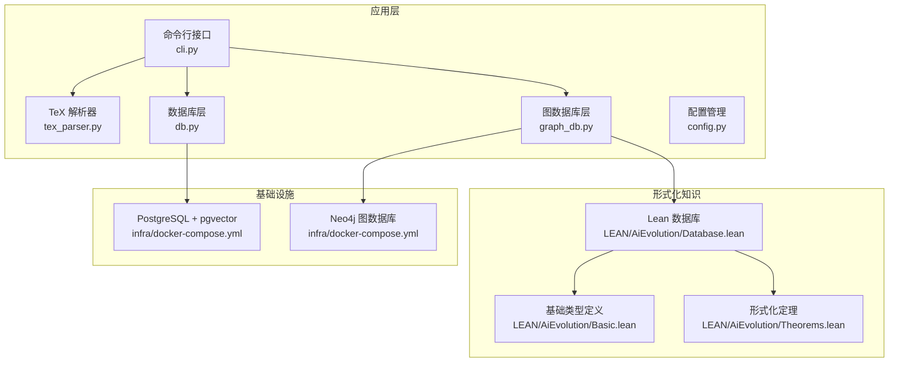
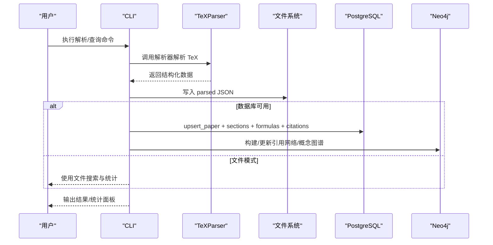
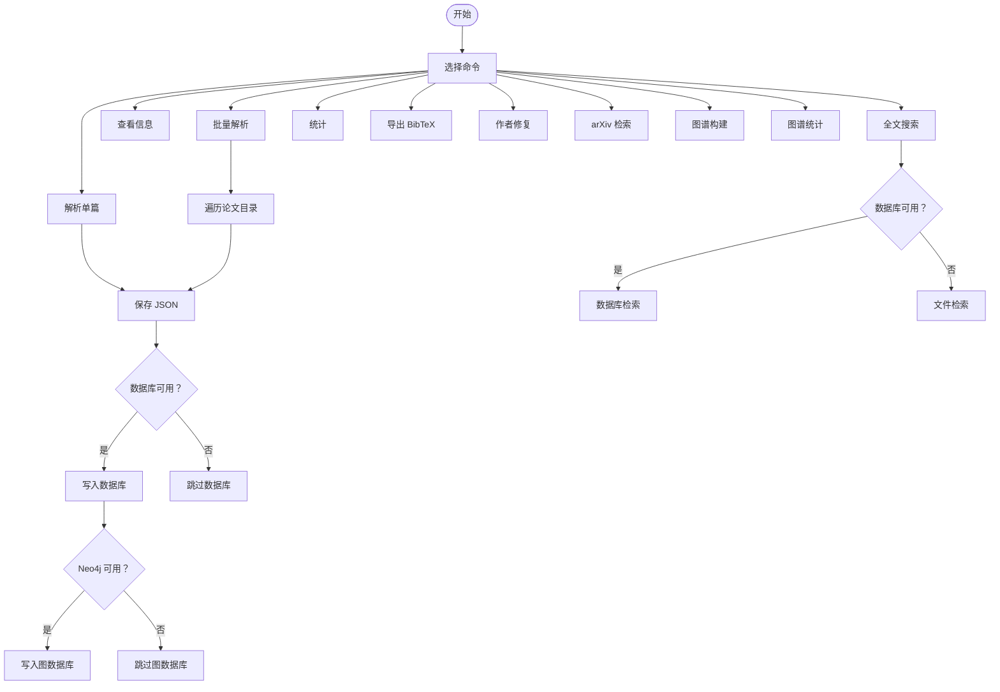
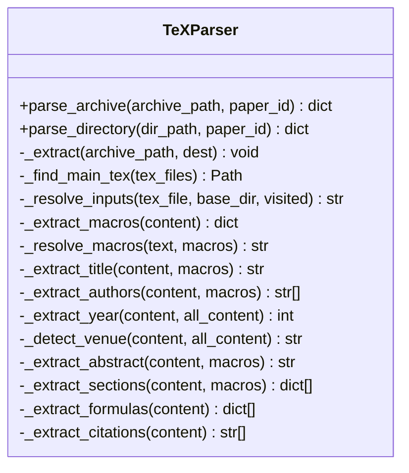
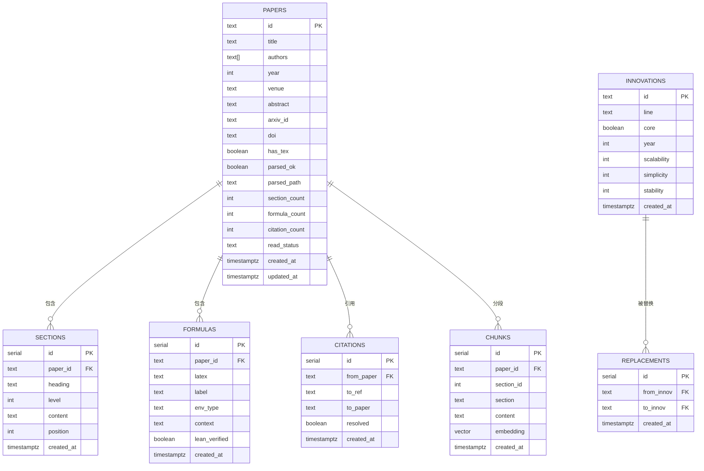
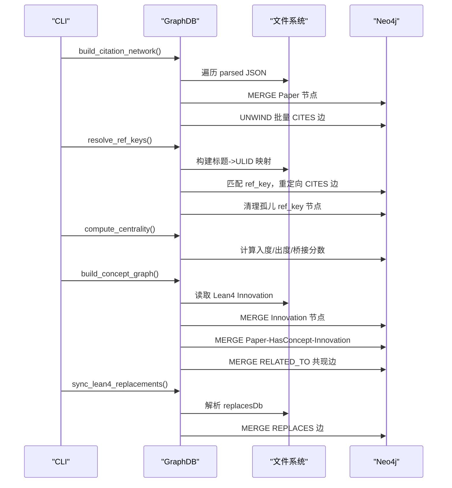
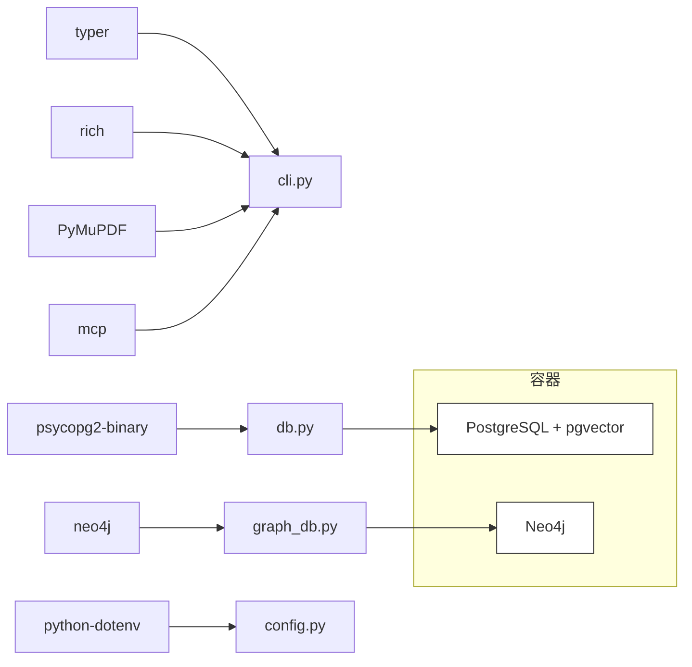

# 知识库核心模块

<cite>
**本文引用的文件列表**
- [cli.py](file://scholar/cli.py)
- [db.py](file://scholar/db.py)
- [graph_db.py](file://scholar/graph_db.py)
- [config.py](file://scholar/config.py)
- [__main__.py](file://scholar/__main__.py)
- [tex_parser.py](file://scholar/tex_parser.py)
- [requirements.txt](file://requirements.txt)
- [docker-compose.yml](file://infra/docker-compose.yml)
- [init.sql](file://infra/init.sql)
- [Database.lean](file://LEAN/AiEvolution/Database.lean)
- [Basic.lean](file://LEAN/AiEvolution/Basic.lean)
- [Theorems.lean](file://LEAN/AiEvolution/Theorems.lean)
</cite>

## 目录
1. [简介](#简介)
2. [项目结构](#项目结构)
3. [核心组件](#核心组件)
4. [架构总览](#架构总览)
5. [详细组件分析](#详细组件分析)
6. [依赖关系分析](#依赖关系分析)
7. [性能与优化](#性能与优化)
8. [故障排查指南](#故障排查指南)
9. [结论](#结论)
10. [附录：命令与配置参考](#附录命令与配置参考)

## 简介
本技术文档聚焦“知识库核心模块”，涵盖论文解析、数据库管理与图数据库（Neo4j）集成的完整实现。文档面向开发者与研究者，提供从数据导入到查询接口、从配置管理到运维部署的全链路说明；同时给出数据模型、API 规范、事务与一致性保障、索引与性能优化策略，以及常见问题的排查路径。

## 项目结构
- scholar 子系统：命令行入口、解析器、数据库层、图数据库层、配置与工具模块
- infra：容器编排与初始化脚本（PostgreSQL + pgvector、Neo4j）
- LEAN：形式化 AI 进化知识库，提供 125 创新节点与替换关系等权威数据源
- data/papers：原始论文数据目录（按 ULID 命名）

图表来源
- [cli.py](file://scholar/cli.py)
- [db.py](file://scholar/db.py)
- [graph_db.py](file://scholar/graph_db.py)
- [config.py](file://scholar/config.py)
- [docker-compose.yml](file://infra/docker-compose.yml)
- [Database.lean](file://LEAN/AiEvolution/Database.lean)
- [Basic.lean](file://LEAN/AiEvolution/Basic.lean)
- [Theorems.lean](file://LEAN/AiEvolution/Theorems.lean)

章节来源
- [cli.py](file://scholar/cli.py)
- [db.py](file://scholar/db.py)
- [graph_db.py](file://scholar/graph_db.py)
- [config.py](file://scholar/config.py)
- [docker-compose.yml](file://infra/docker-compose.yml)

## 核心组件
- 命令行接口（CLI）：提供扫描、解析、批量解析、信息展示、全文搜索、统计、导出、作者修复、arXiv 检索、图谱构建与统计等子命令
- 论文解析器（TeXParser）：从压缩包或已解压目录中提取标题、作者、年份、会议、摘要、章节、公式、引用等元数据与结构化内容
- 数据库层（PostgreSQL + pgvector）：提供结构化存储、全文检索、向量化检索支持
- 图数据库层（Neo4j）：构建论文引用网络、概念图谱、创新替换关系，支持中心性计算与路径查询
- 配置管理：通过环境变量加载，统一管理数据库与图数据库连接参数、输出目录、嵌入模型等

章节来源
- [cli.py](file://scholar/cli.py)
- [tex_parser.py](file://scholar/tex_parser.py)
- [db.py](file://scholar/db.py)
- [graph_db.py](file://scholar/graph_db.py)
- [config.py](file://scholar/config.py)

## 架构总览
系统采用“文件优先 + 可选数据库”的双模式设计：
- 文件模式：当数据库不可用时，解析结果保存为 JSON 并在 CLI 中回退到文件级搜索
- 数据库模式：启用 PostgreSQL 与 Neo4j，提供高性能查询、索引与图算法能力

图表来源
- [cli.py](file://scholar/cli.py)
- [db.py](file://scholar/db.py)
- [graph_db.py](file://scholar/graph_db.py)
- [tex_parser.py](file://scholar/tex_parser.py)

## 详细组件分析

### 命令行接口（CLI）
- 功能概览
  - 扫描：列出论文目录状态（是否含源码、PDF、是否已解析）
  - 解析：单篇/批量解析 TeX，生成结构化 JSON，并可选写入数据库与图数据库
  - 信息：展示解析后的论文元数据、章节、公式、引用
  - 搜索：基于数据库或文件的全文检索
  - 统计：知识库规模、覆盖度、年份分布、会议分布
  - 导出：生成 BibTeX
  - 作者修复：利用 arXiv API 补全缺失作者
  - arXiv 检索：直接检索 arXiv
  - 图谱构建：构建引用网络、解析引用键、计算中心性、构建概念图、同步 Lean4 替换关系
  - 图谱统计：节点/边数量、解析/未解析引用、孤立节点、Top 引用/桥接论文

- 关键流程
  - 解析单篇：调用解析器，保存 JSON，尝试写入数据库，再写入图数据库
  - 全文搜索：优先走数据库，否则回退到文件扫描
  - 图谱构建：分步执行引用网络构建、引用键解析、中心性计算、概念图构建、Lean4 同步

图表来源
- [cli.py](file://scholar/cli.py)

章节来源
- [cli.py](file://scholar/cli.py)

### 论文解析器（TeXParser）
- 设计要点
  - 支持 tar.gz、tgz、tar、zip 多格式解压
  - 自动识别主 TeX 文件（含 \documentclass 的文件），并递归解析 \input/\include
  - 宏展开：支持 \newcommand/\renewcommand 与 \def，多轮展开避免嵌套死循环
  - 元数据提取：标题、作者、年份、会议、摘要、章节、公式、引用
  - 标题/作者清洗：去除格式命令、保留纯文本，处理多分隔符（逗号、\\and、\\And、换行）
  - 公式提取：覆盖多种数学环境与 $$、\[\]
  - 引用提取：支持 \cite 系列与 \bibitem
  - 会议识别：内置多会议正则匹配，自动映射到标准会议名

- 数据结构
  - 输入：压缩包或目录路径、论文 ULID
  - 输出：包含 paper_id、title、authors、year、venue、abstract、sections、formulas、citations、tex_file_count、main_tex_file 等字段的字典

图表来源
- [tex_parser.py](file://scholar/tex_parser.py)

章节来源
- [tex_parser.py](file://scholar/tex_parser.py)

### 数据库层（PostgreSQL + pgvector）
- 设计目标
  - 提供结构化存储与全文检索
  - 支持向量化检索（chunks.embedding）
  - 事务与一致性：使用上下文管理器确保提交/回滚
  - 可选模式：若无法连接，则回退到文件模式

- 核心表与索引
  - papers：主元数据表，包含 id、title、authors、year、venue、abstract、arxiv_id、doi、has_tex、parsed_ok、parsed_path、section_count、formula_count、citation_count、read_status、created_at、updated_at
  - sections：论文章节，外键关联 papers，索引 idx_sections_paper
  - formulas：公式条目，外键关联 papers，索引 idx_formulas_paper
  - citations：引用关系，from_paper 指向 papers.id，to_ref 为引用键，to_paper 可为空表示未解析，索引 idx_citations_from、idx_citations_to
  - concepts：概念词条目
  - paper_concepts：论文-概念关联表
  - chunks：分段内容与向量嵌入，索引 idx_chunks_paper
  - innovations：创新节点，与 Lean4 数据同步
  - replacements：创新替换关系

- 关键操作
  - upsert_paper：ON CONFLICT 更新
  - upsert_sections/formulas/citations：先删除旧记录，再批量插入
  - ingest_paper：一次性写入论文、章节、公式、引用
  - 查询：get_paper、list_papers、search_papers、get_stats
  - 文件回退：save_parsed、load_parsed、list_parsed

图表来源
- [init.sql](file://infra/init.sql)

章节来源
- [db.py](file://scholar/db.py)
- [init.sql](file://infra/init.sql)

### 图数据库层（Neo4j）
- 设计目标
  - 构建三类图谱：论文引用网络、概念图谱、创新替换关系
  - 支持中心性指标（入度、出度、桥接分数）、最短路径、概念共现
  - 与 Lean4 数据源动态同步

- 核心功能
  - 引用网络：Paper 节点 + CITES 边；支持引用键解析（ref_key -> ULID）
  - 概念图谱：Paper-HasConcept-Innovation；Innovation 间 RELATED_TO（共现权重）
  - 创新替换：REPLACES 边，来自 Lean4 Database.lean 或回退数据
  - 查询：前向/后向引用、最短引用路径、Top 引用/桥接论文、按概念检索论文与时间线

- 关键流程
  - 构建引用网络：MERGE Paper 节点，UNWIND 批量创建 CITES 边
  - 解析引用键：构建标题规范化映射，模糊匹配 ref_key -> ULID，重定向边并清理孤儿节点
  - 中心性计算：计算入度、出度、桥接分数，返回 Top 列表
  - 构建概念图：从 Lean4 加载 Innovation，匹配论文与概念，建立 HAS_CONCEPT 边，统计共现并建立 RELATED_TO 边
  - 同步 Lean4 替换：解析 replacesDb，MERGE REPLACES 边

图表来源
- [graph_db.py](file://scholar/graph_db.py)

章节来源
- [graph_db.py](file://scholar/graph_db.py)

### 配置管理
- 环境变量加载：通过 python-dotenv 从项目根目录 .env 加载
- 关键配置项
  - PostgreSQL：主机、端口、数据库名、用户名、密码
  - Neo4j：URI、用户名、密码
  - 嵌入模型：提供商、模型名、维度、API Key
  - LaTeX 编译命令、Lean4 项目目录
  - 输出目录：parsed、notes、drafts、bib、experiments

章节来源
- [config.py](file://scholar/config.py)

## 依赖关系分析
- 运行时依赖：typer、rich、psycopg2-binary、neo4j、python-dotenv、PyMuPDF、mcp
- 容器化依赖：PostgreSQL + pgvector、Neo4j（含 APOC 插件）
- 形式化依赖：Lean4 项目（AiEvolution），用于提供 125 创新节点与替换关系

图表来源
- [requirements.txt](file://requirements.txt)
- [docker-compose.yml](file://infra/docker-compose.yml)
- [cli.py](file://scholar/cli.py)
- [db.py](file://scholar/db.py)
- [graph_db.py](file://scholar/graph_db.py)
- [config.py](file://scholar/config.py)

章节来源
- [requirements.txt](file://requirements.txt)
- [docker-compose.yml](file://infra/docker-compose.yml)

## 性能与优化
- 数据库层
  - 索引：sections(paper_id)、formulas(paper_id)、citations(from_paper)、citations(to_paper)、chunks(paper_id)
  - 批量写入：upsert_sections/upsert_formulas/upsert_citations 使用 UNWIND 批处理，减少往返
  - 事务：cursor 上下文确保失败回滚，成功提交
  - 全文检索：ILIKE 在大表上代价高，建议结合向量检索与分区策略
- 图数据库层
  - 批量 MERGE/UNWIND：引用网络与概念图构建均采用批处理
  - 标题规范化与模糊匹配：预构建规范化映射，降低重复计算
  - 中心性计算：分步执行，避免一次性复杂聚合
- 解析器
  - 宏展开限制轮次，避免深度嵌套导致的性能问题
  - 仅在需要时进行正则匹配，减少不必要的计算
- 运维
  - Docker Compose 提供健康检查，确保服务可用
  - Neo4j 启用 APOC 插件，增强图算法能力

[本节为通用性能指导，不直接分析具体文件]

## 故障排查指南
- 数据库不可用
  - 现象：CLI 提示数据库不可用，搜索回退到文件模式
  - 排查：确认 PostgreSQL 服务运行、凭据正确、扩展 vector 已安装
  - 参考：[docker-compose.yml](file://infra/docker-compose.yml)，[init.sql](file://infra/init.sql)
- Neo4j 不可用
  - 现象：图谱构建/统计命令报错
  - 排查：确认 Neo4j 服务运行、凭据正确、插件 APOC 可用
  - 参考：[docker-compose.yml](file://infra/docker-compose.yml)
- 解析失败
  - 现象：parse/parse-all 报错
  - 排查：确认论文目录存在、压缩包格式正确、宏定义可解析
  - 参考：[tex_parser.py](file://scholar/tex_parser.py)
- 引用键未解析
  - 现象：CITES 边指向 ref_key 节点而非 ULID
  - 排查：执行 graph-build 后再运行 resolve_ref_keys；检查标题规范化映射
  - 参考：[graph_db.py](file://scholar/graph_db.py)
- 权限与认证
  - 现象：连接数据库/图数据库失败
  - 排查：核对 .env 中的 SCHOLAR_* 环境变量
  - 参考：[config.py](file://scholar/config.py)

章节来源
- [docker-compose.yml](file://infra/docker-compose.yml)
- [init.sql](file://infra/init.sql)
- [tex_parser.py](file://scholar/tex_parser.py)
- [graph_db.py](file://scholar/graph_db.py)
- [config.py](file://scholar/config.py)

## 结论
该知识库核心模块以“文件优先 + 可选数据库”为设计原则，在保证离线可用性的前提下，提供强大的结构化存储与图谱分析能力。通过 TeXParser 的高质量解析、PostgreSQL 的高效存储与检索、Neo4j 的图算法与可视化，系统能够支撑学术论文的知识抽取、组织与发现。配合 Lean4 形式化数据源，进一步提升了知识库的权威性与可验证性。

[本节为总结性内容，不直接分析具体文件]

## 附录：命令与配置参考

### CLI 命令速览
- scan：扫描论文目录状态
- parse：解析单篇论文
- parse-all：批量解析论文
- info：查看解析详情
- search：全文搜索
- list-papers：列出论文
- stats：知识库统计
- export-bib：导出 BibTeX
- author-fix：作者修复（arXiv）
- arxiv-search：arXiv 检索
- graph-build：构建图谱
- graph-stats：图谱统计

章节来源
- [cli.py](file://scholar/cli.py)

### 配置项参考
- PostgreSQL：SCHOLAR_PG_HOST、SCHOLAR_PG_PORT、SCHOLAR_PG_NAME、SCHOLAR_PG_USER、SCHOLAR_PG_PASS
- Neo4j：SCHOLAR_NEO4J_URI、SCHOLAR_NEO4J_USER、SCHOLAR_NEO4J_PASS
- 嵌入模型：SCHOLAR_EMBEDDING_PROVIDER、SCHOLAR_EMBEDDING_MODEL、SCHOLAR_EMBEDDING_DIM、SCHOLAR_EMBEDDING_API_KEY
- 其他：SCHOLAR_LATEX_CMD、SCHOLAR_LEAN_PROJECT_DIR

章节来源
- [config.py](file://scholar/config.py)

### 数据模型与索引
- 表与索引：见“数据库层（PostgreSQL + pgvector）”
- 图模式：Paper、Innovation 节点与 CITES、HAS_CONCEPT、RELATED_TO、REPLACES 边

章节来源
- [init.sql](file://infra/init.sql)
- [graph_db.py](file://scholar/graph_db.py)

### Lean4 数据源
- 创新节点与替换关系：由 Database.lean 提供，graph_db.py 动态加载或回退到硬编码种子数据
- 形式化定理：Theorems.lean 对替换关系进行严格证明

章节来源
- [Database.lean](file://LEAN/AiEvolution/Database.lean)
- [Theorems.lean](file://LEAN/AiEvolution/Theorems.lean)
- [graph_db.py](file://scholar/graph_db.py)