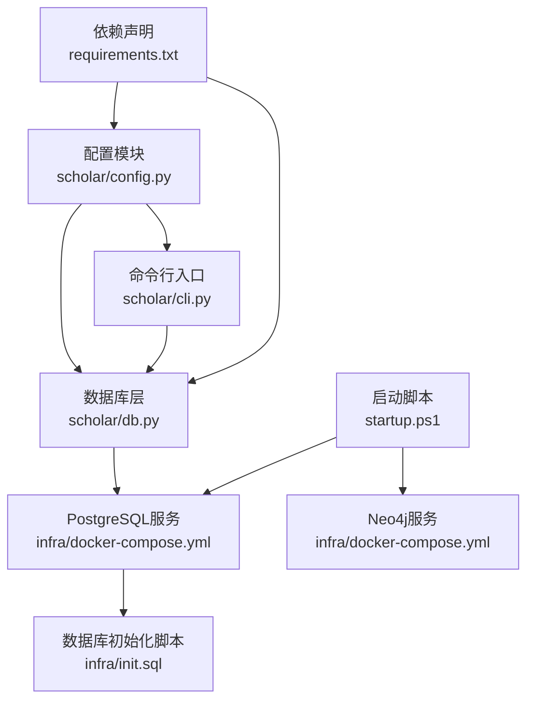
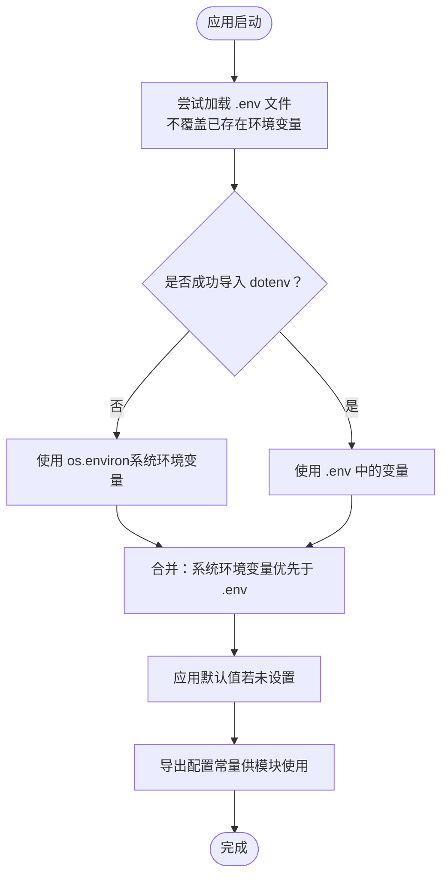
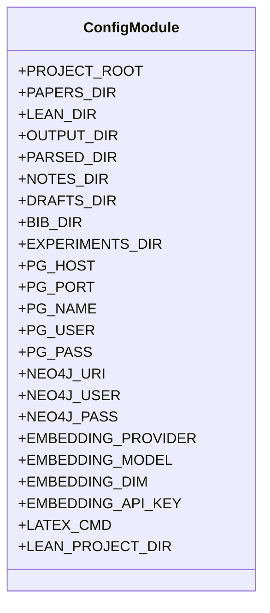
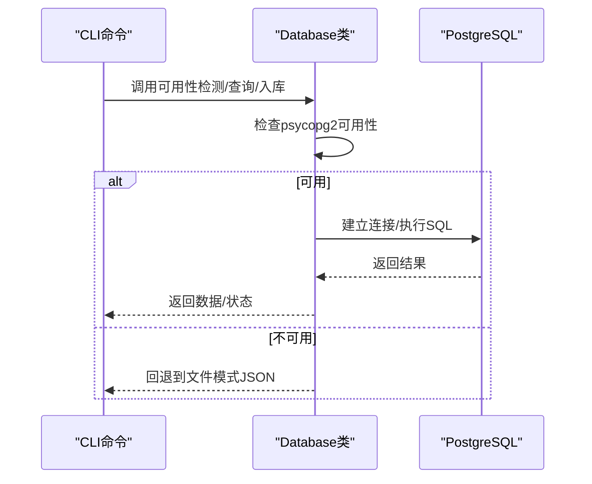
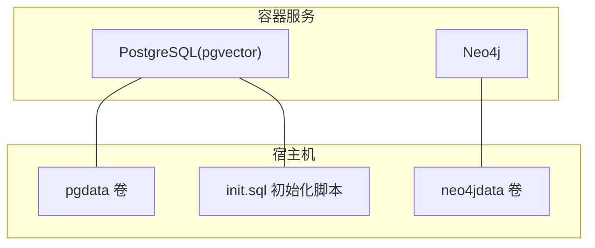
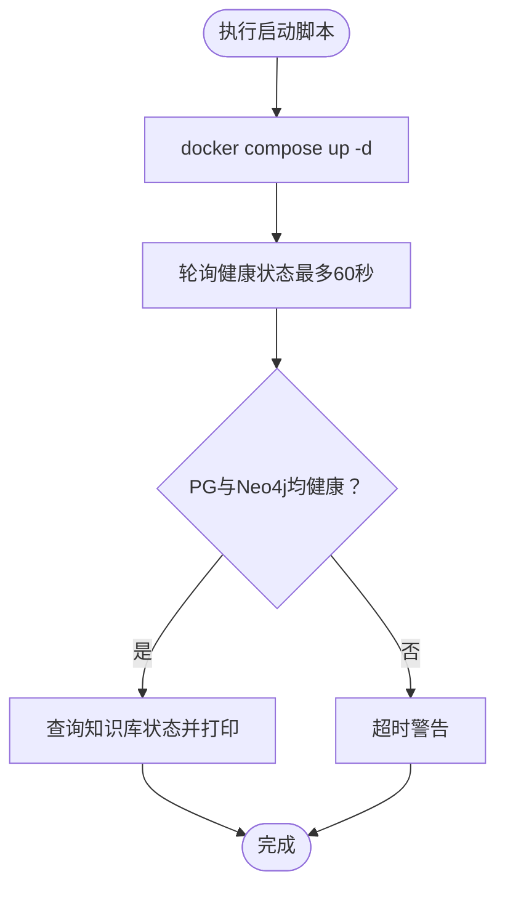
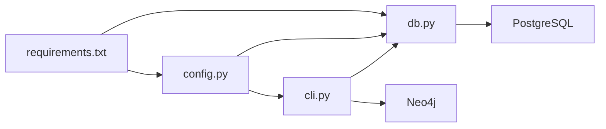

# 配置管理

<cite>
**本文引用的文件**
- [config.py](file://scholar/config.py)
- [cli.py](file://scholar/cli.py)
- [db.py](file://scholar/db.py)
- [docker-compose.yml](file://infra/docker-compose.yml)
- [init.sql](file://infra/init.sql)
- [requirements.txt](file://requirements.txt)
- [startup.ps1](file://startup.ps1)
</cite>

## 目录
1. [简介](#简介)
2. [项目结构](#项目结构)
3. [核心组件](#核心组件)
4. [架构总览](#架构总览)
5. [详细组件分析](#详细组件分析)
6. [依赖分析](#依赖分析)
7. [性能考虑](#性能考虑)
8. [故障排除指南](#故障排除指南)
9. [结论](#结论)
10. [附录](#附录)

## 简介
本文件为“配置管理”模块的技术文档，面向统一配置管理系统的设计与实现进行深入解析。内容涵盖配置文件格式、环境变量处理与默认值设置机制；覆盖数据库连接配置（PostgreSQL + pgvector）、图数据库（Neo4j）配置、RAG嵌入模型与API密钥、本地编译工具（LaTeX/Lean4）路径设置等关键配置项；提供配置验证、热重载与配置迁移的使用建议；解释配置优先级与继承关系，并给出开发/测试/生产环境的差异化管理策略与安全最佳实践；最后提供配置模板、示例文件与常见问题排查方法。

## 项目结构
配置管理涉及以下关键位置与职责：
- 配置定义与加载：Python模块负责从环境变量与.ENV文件加载配置，并在运行时提供常量供其他模块使用。
- 数据库层：通过配置中的连接参数建立PostgreSQL连接，支持可用性检测与事务上下文。
- 基础设施编排：通过Compose定义数据库与图数据库服务，提供默认端口与凭据。
- 初始化脚本：一键启动容器并等待健康检查，便于快速进入开发态。
- 依赖声明：明确运行所需的第三方包，包括dotenv、psycopg2、neo4j等。

图表来源
- [config.py](file://scholar/config.py)
- [cli.py](file://scholar/cli.py)
- [db.py](file://scholar/db.py)
- [docker-compose.yml](file://infra/docker-compose.yml)
- [init.sql](file://infra/init.sql)
- [requirements.txt](file://requirements.txt)
- [startup.ps1](file://startup.ps1)

章节来源
- [config.py](file://scholar/config.py)
- [cli.py](file://scholar/cli.py)
- [db.py](file://scholar/db.py)
- [docker-compose.yml](file://infra/docker-compose.yml)
- [init.sql](file://infra/init.sql)
- [requirements.txt](file://requirements.txt)
- [startup.ps1](file://startup.ps1)

## 核心组件
- 配置模块（scholar/config.py）
  - 负责从项目根目录下的“.env”文件加载环境变量，未安装dotenv时回退到os.environ。
  - 定义项目根目录、输入输出目录、数据库连接参数、图数据库连接参数、嵌入模型参数与命令行工具路径等。
  - 对输出目录进行自动创建，确保首次运行无需手动准备。
- 数据库层（scholar/db.py）
  - 封装PostgreSQL访问，提供可用性检测、连接池复用与事务上下文。
  - 在psycopg2不可用时，提供文件模式的保存/加载能力作为降级方案。
- 基础设施编排（infra/docker-compose.yml）
  - 定义PostgreSQL（含pgvector扩展）与Neo4j服务，默认端口与认证信息。
- 初始化脚本（infra/init.sql）
  - 定义数据库表结构、索引与扩展，支撑论文元数据、公式、引用、概念图谱与嵌入向量等。
- 启动脚本（startup.ps1）
  - 自动拉起容器并等待服务健康，随后输出知识库状态与常用命令提示。
- 依赖声明（requirements.txt）
  - 明确运行所需依赖，如typer、rich、psycopg2-binary、neo4j、python-dotenv等。

章节来源
- [config.py](file://scholar/config.py)
- [db.py](file://scholar/db.py)
- [docker-compose.yml](file://infra/docker-compose.yml)
- [init.sql](file://infra/init.sql)
- [startup.ps1](file://startup.ps1)
- [requirements.txt](file://requirements.txt)

## 架构总览
统一配置管理采用“环境变量+默认值”的分层策略：
- 最低优先级：硬编码默认值（如localhost、5433、bolt端口等）。
- 中间优先级：来自“.env”文件的环境变量（不覆盖已存在的进程环境变量）。
- 最高优先级：直接设置在操作系统环境变量中的值（例如CI/CD或容器注入）。

图表来源
- [config.py](file://scholar/config.py)

章节来源
- [config.py](file://scholar/config.py)

## 详细组件分析

### 配置模块（scholar/config.py）
- 环境变量加载
  - 通过dotenv在项目根目录查找“.env”，加载后不覆盖已存在的同名环境变量，避免破坏系统或容器注入的配置。
- 目录结构
  - 项目根目录、论文输入目录、Lean工程目录、输出目录（解析产物、笔记草稿、BibTeX、实验结果等），并在运行时确保输出目录存在。
- 数据库连接配置（PostgreSQL + pgvector）
  - 主机、端口、数据库名、用户名、密码均来自环境变量，提供合理默认值以适配本地开发。
- 图数据库连接配置（Neo4j）
  - URI、用户、密码来自环境变量，提供默认值以便快速启动。
- RAG嵌入配置
  - 提供提供商、模型名称、维度与API密钥的环境变量入口，便于切换不同供应商与模型。
- 工具链路径
  - LaTeX命令与Lean4项目目录由环境变量控制，便于在不同平台或自定义环境中调整。
- 默认值与类型转换
  - 数字型参数（端口、维度）通过显式类型转换，字符串型参数（主机名、模型名、命令）使用默认值，确保运行时类型一致。

图表来源
- [config.py](file://scholar/config.py)

章节来源
- [config.py](file://scholar/config.py)

### 数据库层（scholar/db.py）
- 可用性检测
  - 在每次需要连接时尝试建立一次短连接以判断PostgreSQL可用性，避免缓存死连接。
- 连接与事务
  - 使用上下文管理器封装cursor，自动提交或回滚，finally中关闭游标，保证资源释放。
- 论文与结构化数据操作
  - 支持论文、章节、公式、引用的插入/更新与全量入库流程。
- 查询与统计
  - 提供论文查询、全文检索（标题/摘要/章节内容）、统计信息汇总等接口。
- 文件模式降级
  - 当psycopg2不可用时，提供JSON文件的保存/加载与列表接口，保障离线场景可用。

图表来源
- [db.py](file://scholar/db.py)
- [config.py](file://scholar/config.py)

章节来源
- [db.py](file://scholar/db.py)
- [config.py](file://scholar/config.py)

### 基础设施编排（infra/docker-compose.yml）
- PostgreSQL服务
  - 镜像：pgvector/pgvector:pg16；端口映射至宿主5433；默认数据库、用户与密码；挂载初始化SQL脚本；健康检查。
- Neo4j服务
  - 镜像：neo4j:5-community；浏览器与Bolt端口映射；默认认证与插件配置；内存参数；健康检查。
- 存储卷
  - 分别持久化PostgreSQL与Neo4j数据目录。

图表来源
- [docker-compose.yml](file://infra/docker-compose.yml)
- [init.sql](file://infra/init.sql)

章节来源
- [docker-compose.yml](file://infra/docker-compose.yml)
- [init.sql](file://infra/init.sql)

### 启动脚本（startup.ps1）
- 自动启动Compose服务并等待健康检查通过。
- 输出当前知识库状态（论文数、分块数、节点数）。
- 提供常用命令提示，加速开发者上手。

图表来源
- [startup.ps1](file://startup.ps1)

章节来源
- [startup.ps1](file://startup.ps1)

## 依赖分析
- 运行时依赖
  - typer、rich：命令行界面与富文本输出。
  - psycopg2-binary：PostgreSQL驱动。
  - neo4j：图数据库客户端。
  - python-dotenv：.env文件加载。
  - PyMuPDF、mcp：文档处理与消息控制协议支持。
- 组件耦合
  - 配置模块被数据库层与CLI命令广泛依赖，形成“配置中心”角色。
  - 数据库层对配置模块的依赖为单向，降低循环依赖风险。
  - Compose与初始化脚本为外部基础设施，通过端口与凭据与应用交互。

图表来源
- [requirements.txt](file://requirements.txt)
- [config.py](file://scholar/config.py)
- [db.py](file://scholar/db.py)
- [cli.py](file://scholar/cli.py)

章节来源
- [requirements.txt](file://requirements.txt)
- [config.py](file://scholar/config.py)
- [db.py](file://scholar/db.py)
- [cli.py](file://scholar/cli.py)

## 性能考虑
- 连接复用与可用性检测
  - 数据库层在每次使用前进行可用性检测，避免缓存死连接导致的阻塞。
- 事务边界
  - 使用上下文管理器确保事务提交/回滚与资源释放，减少长事务带来的锁竞争。
- 目录预创建
  - 输出目录在启动时即创建，避免运行期I/O错误与重复检查开销。
- 健康检查与延迟
  - 启动脚本等待服务健康，减少应用启动阶段的连接失败重试成本。

## 故障排除指南
- 环境变量未生效
  - 确认“.env”位于项目根目录且未被git忽略；确认未被系统环境变量覆盖。
  - 若未安装dotenv，需在系统环境变量中显式设置对应键值。
- PostgreSQL无法连接
  - 检查端口映射（默认5433）与凭据；确认容器已健康运行；查看初始化脚本是否正确加载。
- Neo4j无法连接
  - 检查Bolt端口映射与认证；确认容器健康状态。
- RAG嵌入API密钥无效
  - 确认提供商、模型与维度与实际服务匹配；检查API密钥是否为空或过期。
- 启动脚本超时
  - 查看容器日志与健康检查配置；适当延长等待时间或调整内存参数。
- 文件模式降级
  - 当psycopg2不可用时，系统会回退到JSON文件模式；如需数据库功能，请安装psycopg2-binary。

章节来源
- [config.py](file://scholar/config.py)
- [db.py](file://scholar/db.py)
- [docker-compose.yml](file://infra/docker-compose.yml)
- [startup.ps1](file://startup.ps1)

## 结论
本配置管理体系通过“环境变量+默认值”的分层策略，结合容器化基础设施与一键启动脚本，实现了开发、测试与生产的可移植与可维护性。数据库层提供可用性检测与事务封装，CLI命令通过统一配置访问多种后端服务。建议在团队内约定“.env.example”模板与CI/CD注入策略，确保跨环境一致性与安全性。

## 附录

### 配置优先级与继承关系
- 优先级顺序（从高到低）
  1) 系统环境变量（容器注入、CI/CD）
  2) .env文件（项目根目录）
  3) 程序内置默认值
- 继承关系
  - 数据库层与CLI命令均依赖配置模块导出的常量，形成单向依赖，降低耦合度。
  - 基础设施（Compose）通过端口与凭据与应用解耦，便于独立演进。

章节来源
- [config.py](file://scholar/config.py)
- [db.py](file://scholar/db.py)
- [cli.py](file://scholar/cli.py)

### 关键配置项清单与默认值
- 数据库（PostgreSQL + pgvector）
  - 主机：SCHOLAR_PG_HOST，默认localhost
  - 端口：SCHOLAR_PG_PORT，默认5433
  - 数据库名：SCHOLAR_PG_NAME，默认scholar
  - 用户：SCHOLAR_PG_USER，默认scholar
  - 密码：SCHOLAR_PG_PASS，默认scholar2024
- 图数据库（Neo4j）
  - URI：SCHOLAR_NEO4J_URI，默认bolt://localhost:7687
  - 用户：SCHOLAR_NEO4J_USER，默认neo4j
  - 密码：SCHOLAR_NEO4J_PASS，默认scholar2024
- RAG嵌入
  - 提供商：SCHOLAR_EMBEDDING_PROVIDER，默认zhipu
  - 模型：SCHOLAR_EMBEDDING_MODEL，默认embedding-2
  - 维度：SCHOLAR_EMBEDDING_DIM，默认1024
  - API密钥：SCHOLAR_EMBEDDING_API_KEY，默认空
- 工具链路径
  - LaTeX命令：SCHOLAR_LATEX_CMD，默认pdflatex
  - Lean4项目目录：由项目根与LEAN子目录决定

章节来源
- [config.py](file://scholar/config.py)

### 配置验证与热重载建议
- 验证
  - 在应用启动时调用数据库可用性检测函数，确保连接参数有效。
  - 对数字型参数进行范围校验（端口、维度）。
- 热重载
  - 当前实现未内置热重载；可在CI/CD中通过滚动重启或容器替换实现“近似热重载”。
  - 建议将敏感配置放入只读挂载或密钥管理服务，避免频繁变更。

章节来源
- [db.py](file://scholar/db.py)
- [config.py](file://scholar/config.py)

### 开发/测试/生产环境差异管理
- 开发环境
  - 使用本地默认端口与弱密码；启用详细日志；.env中仅填写必要项。
- 测试环境
  - 通过环境变量注入隔离数据库与图数据库实例；使用专用API密钥。
- 生产环境
  - 所有敏感配置通过系统环境变量或密钥管理服务注入；最小化暴露面；严格审计日志。

章节来源
- [config.py](file://scholar/config.py)
- [docker-compose.yml](file://infra/docker-compose.yml)

### 安全配置最佳实践
- 保护凭据
  - .env与初始化脚本中的默认密码仅用于本地开发；生产必须使用强口令并通过环境变量注入。
- 最小权限
  - 数据库用户仅授予必要权限；API密钥按最小授权原则分配。
- 网络隔离
  - 服务端口仅对必要范围开放；容器网络与主机网络隔离。
- 传输加密
  - 在生产中启用TLS与双向认证（如适用）。

章节来源
- [config.py](file://scholar/config.py)
- [docker-compose.yml](file://infra/docker-compose.yml)
- [init.sql](file://infra/init.sql)

### 配置模板与示例文件
- .env示例
  - 建议在项目根目录提供“.env.example”模板，列出所有受支持的键与用途，再复制为“.env”并填入真实值。
- Compose示例
  - 参考现有docker-compose.yml，按需调整端口、卷与环境变量。
- 初始化SQL
  - 参考init.sql，确保扩展与表结构满足应用需求。

章节来源
- [config.py](file://scholar/config.py)
- [docker-compose.yml](file://infra/docker-compose.yml)
- [init.sql](file://infra/init.sql)