# 年份修正系统

<cite>
**本文档引用的文件**
- [year_fix.py](file://scholar/year_fix.py)
- [config.py](file://scholar/config.py)
- [db.py](file://scholar/db.py)
- [tex_parser.py](file://scholar/tex_parser.py)
- [AiEvolution.lean](file://LEAN/AiEvolution.lean)
- [Main.lean](file://LEAN/Main.lean)
- [Basic.lean](file://LEAN/AiEvolution/Basic.lean)
- [Database.lean](file://LEAN/AiEvolution/Database.lean)
</cite>

## 目录
1. [简介](#简介)
2. [项目结构](#项目结构)
3. [核心组件](#核心组件)
4. [架构概览](#架构概览)
5. [详细组件分析](#详细组件分析)
6. [依赖关系分析](#依赖关系分析)
7. [性能考虑](#性能考虑)
8. [故障排除指南](#故障排除指南)
9. [结论](#结论)
10. [附录](#附录)

## 简介

年份修正系统是 Scholar Studio 的一个关键模块，负责为解析后的论文数据填充缺失的出版年份信息。该系统通过多种策略确保时间戳标准化，包括：

- **形式化数据库匹配**：从 Lean4 形式化数据库中提取权威年份信息
- **智能标题匹配**：通过模糊算法在解析论文和形式化数据之间建立关联
- **内容推断算法**：基于论文内容中的年份提及进行统计推断
- **外部API集成**：利用 arXiv API 获取缺失的年份信息
- **多层验证机制**：确保修正结果的准确性和一致性

该系统采用分阶段、可回滚的设计模式，支持干运行模式用于预检和审计，同时提供详细的统计报告和错误处理机制。

## 项目结构

年份修正系统主要分布在以下目录和文件中：

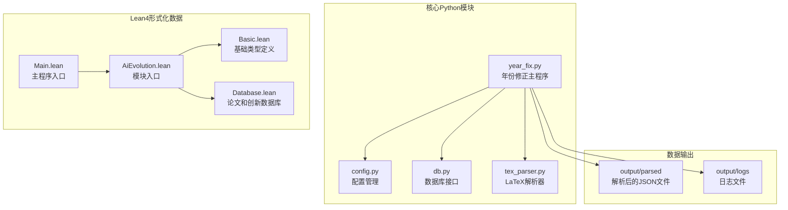

**图表来源**
- [year_fix.py:1-50](file://scholar/year_fix.py#L1-L50)
- [config.py:20-42](file://scholar/config.py#L20-L42)
- [AiEvolution.lean:1-8](file://LEAN/AiEvolution.lean#L1-L8)

**章节来源**
- [year_fix.py:1-420](file://scholar/year_fix.py#L1-L420)
- [config.py:1-119](file://scholar/config.py#L1-L119)
- [AiEvolution.lean:1-8](file://LEAN/AiEvolution.lean#L1-L8)

## 核心组件

### 年份修正主流程

年份修正系统采用两阶段处理策略：

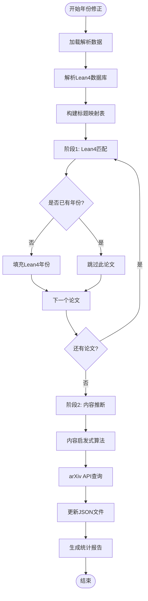

**图表来源**
- [year_fix.py:165-239](file://scholar/year_fix.py#L165-L239)

### 数据结构设计

系统使用以下核心数据结构：

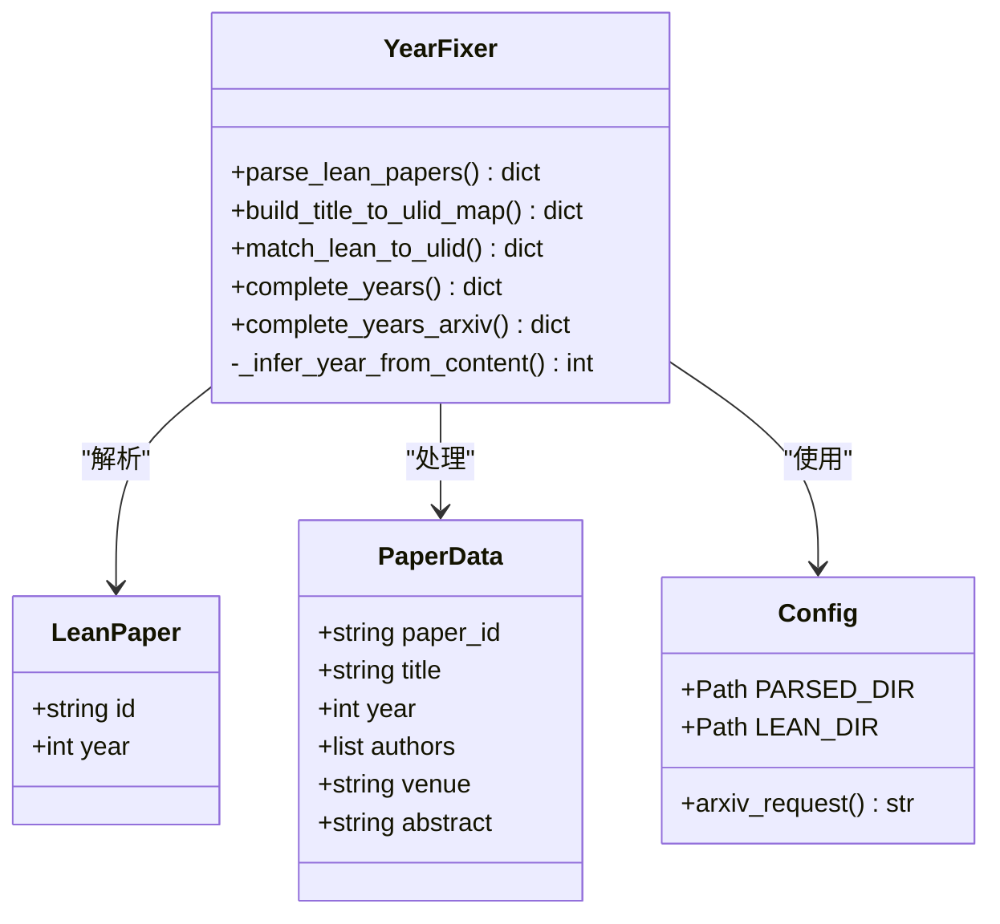

**图表来源**
- [year_fix.py:19-84](file://scholar/year_fix.py#L19-L84)
- [year_fix.py:102-158](file://scholar/year_fix.py#L102-L158)
- [config.py:20-66](file://scholar/config.py#L20-L66)

**章节来源**
- [year_fix.py:15-420](file://scholar/year_fix.py#L15-L420)
- [config.py:1-119](file://scholar/config.py#L1-L119)

## 架构概览

### 整体系统架构

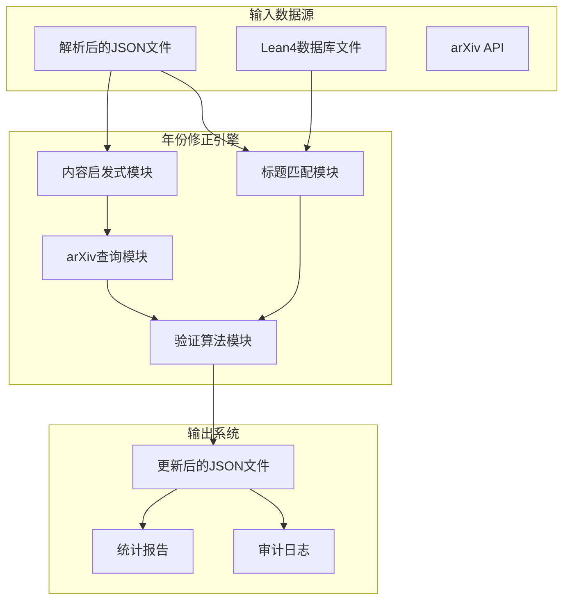

**图表来源**
- [year_fix.py:165-331](file://scholar/year_fix.py#L165-L331)
- [tex_parser.py:1036-1124](file://scholar/tex_parser.py#L1036-L1124)

### Lean4数据库集成

系统深度集成了 Lean4 形式化验证系统：

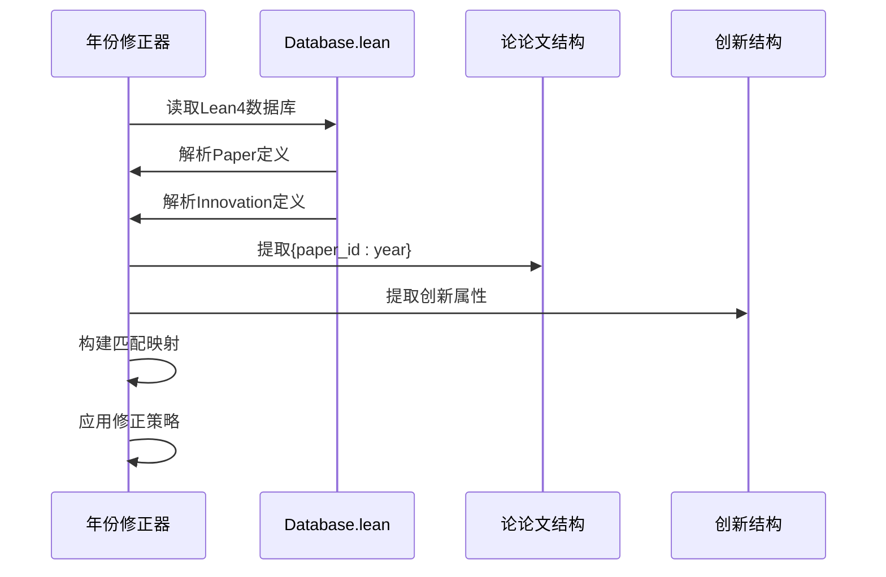

**图表来源**
- [year_fix.py:19-84](file://scholar/year_fix.py#L19-L84)
- [Database.lean:1-756](file://LEAN/AiEvolution/Database.lean#L1-L756)

**章节来源**
- [Database.lean:1-756](file://LEAN/AiEvolution/Database.lease#L1-L756)
- [Basic.lean:1-65](file://LEAN/AiEvolution/Basic.lean#L1-L65)

## 详细组件分析

### 标题匹配算法

标题匹配是年份修正的核心算法，采用多层次匹配策略：

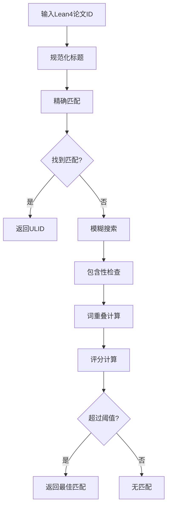

**图表来源**
- [year_fix.py:118-158](file://scholar/year_fix.py#L118-L158)

匹配算法的关键特性：

1. **标题规范化**：转换为小写，移除特殊字符，压缩空白
2. **双层匹配策略**：
   - 精确匹配：直接查找规范化标题
   - 模糊匹配：包含性检查和词重叠分析
3. **评分机制**：结合字符串包含长度和词重叠率
4. **阈值控制**：设置最小匹配分数 (0.5) 和重叠率 (0.7)

**章节来源**
- [year_fix.py:91-158](file://scholar/year_fix.py#L91-L158)

### 内容启发式推断

内容推断算法通过分析论文内容中的年份提及进行统计推断：

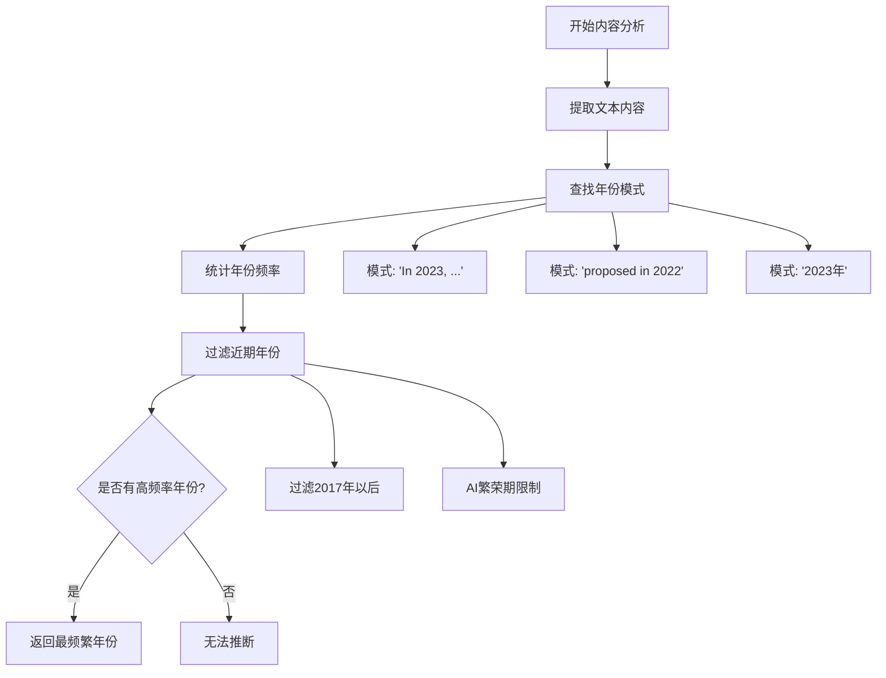

**图表来源**
- [year_fix.py:306-331](file://scholar/year_fix.py#L306-L331)

推断算法的约束条件：

1. **时间范围限制**：仅考虑2017年及以后的年份
2. **AI领域限制**：专注于人工智能相关论文
3. **统计置信度**：选择出现频率最高的年份作为推断结果
4. **上下文过滤**：排除数据集版本号等非出版年份信息

**章节来源**
- [year_fix.py:306-331](file://scholar/year_fix.py#L306-L331)

### arXiv API 集成

系统提供了完整的 arXiv API 集成，支持智能查询和错误处理：

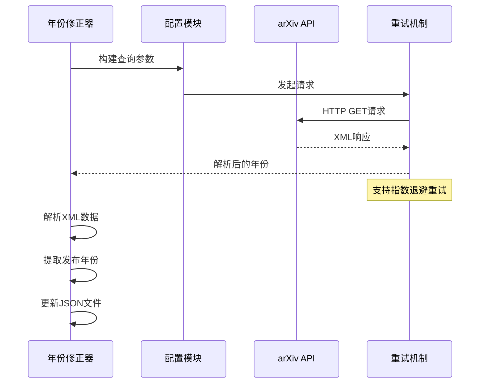

**图表来源**
- [year_fix.py:242-303](file://scholar/year_fix.py#L242-L303)
- [config.py:72-119](file://scholar/config.py#L72-L119)

API调用的关键特性：

1. **智能重试**：支持多次重试，采用2秒、4秒等退避间隔
2. **代理支持**：自动检测并使用HTTP_PROXY环境变量
3. **超时控制**：可配置的请求超时时间
4. **错误处理**：捕获所有异常并优雅降级

**章节来源**
- [year_fix.py:242-303](file://scholar/year_fix.py#L242-L303)
- [config.py:72-119](file://scholar/config.py#L72-L119)

### 数据库集成

系统支持 PostgreSQL 数据库存储，提供文件回退模式：

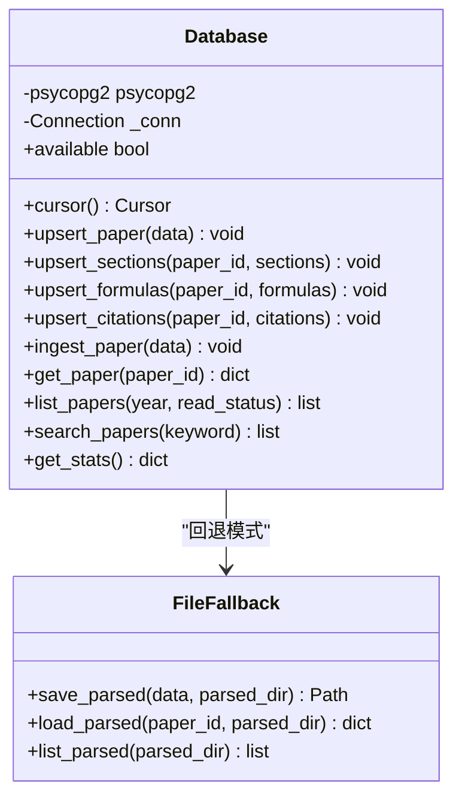

**图表来源**
- [db.py:24-276](file://scholar/db.py#L24-L276)

**章节来源**
- [db.py:1-276](file://scholar/db.py#L1-L276)

## 依赖关系分析

### 外部依赖

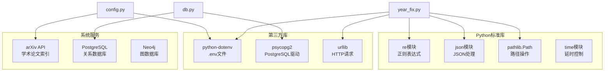

**图表来源**
- [year_fix.py:7-12](file://scholar/year_fix.py#L7-L12)
- [db.py:15-22](file://scholar/db.py#L15-L22)
- [config.py:11-18](file://scholar/config.py#L11-L18)

### 内部模块依赖

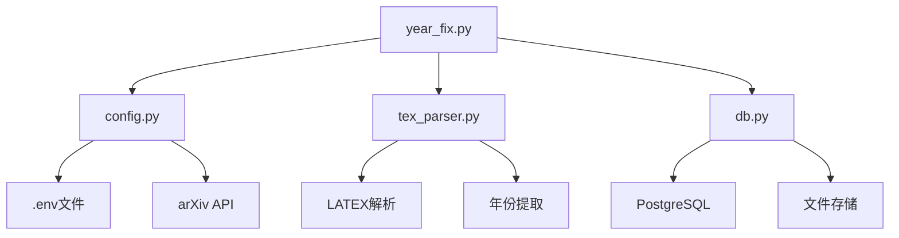

**图表来源**
- [year_fix.py:12-12](file://scholar/year_fix.py#L12-L12)
- [config.py:8-18](file://scholar/config.py#L8-L18)

**章节来源**
- [year_fix.py:1-420](file://scholar/year_fix.py#L1-L420)
- [config.py:1-119](file://scholar/config.py#L1-L119)
- [db.py:1-276](file://scholar/db.py#L1-L276)

## 性能考虑

### 时间复杂度分析

1. **标题匹配算法**：
   - 精确匹配：O(n) 其中 n 为解析论文数量
   - 模糊匹配：O(m×n) 其中 m 为Lean4论文数量，n 为解析论文数量
   - 总体复杂度：O(m×n)

2. **内容推断算法**：
   - 文本提取：O(k) 其中 k 为论文内容字符数
   - 年份查找：O(k)
   - 统计分析：O(p) 其中 p 为发现的年份数量
   - 总体复杂度：O(k)

3. **arXiv API 查询**：
   - 单次查询：O(1)
   - 限流控制：避免API限制
   - 总体复杂度：O(q) 其中 q 为查询数量

### 内存使用优化

1. **流式处理**：使用 glob 和迭代器避免一次性加载所有文件
2. **增量更新**：只处理缺失年份的论文
3. **缓存策略**：标题映射表在内存中缓存
4. **垃圾回收**：及时释放临时对象

### 并发处理

系统当前采用单线程处理模式，但具备以下并发扩展能力：

1. **异步API调用**：arXiv查询可以改为异步模式
2. **批处理优化**：支持批量文件处理
3. **数据库连接池**：PostgreSQL连接复用
4. **多进程处理**：不同论文的处理可以并行执行

## 故障排除指南

### 常见问题诊断

#### 1. Lean4数据库解析失败

**症状**：parse_lean_papers() 返回空字典

**可能原因**：
- Database.lean 文件不存在
- 文件编码问题
- 正则表达式匹配失败

**解决方案**：
- 检查 LEAN_DIR 路径配置
- 验证文件权限和存在性
- 查看日志文件获取详细错误信息

#### 2. 标题匹配率低

**症状**：匹配到的论文数量远低于预期

**可能原因**：
- 标题规范化过于严格
- 论文标题格式不一致
- Lean4数据库中的ID格式变化

**解决方案**：
- 调整匹配阈值参数
- 手动添加特殊匹配规则
- 更新Lean4数据库同步

#### 3. arXiv API查询超时

**症状**：complete_years_arxiv() 抛出异常

**可能原因**：
- 网络连接问题
- API请求频率过高
- 代理配置错误

**解决方案**：
- 检查网络连接状态
- 增加重试次数和延迟
- 配置正确的代理设置

#### 4. JSON文件更新失败

**症状**：文件写入权限错误

**可能原因**：
- 输出目录权限不足
- 磁盘空间不足
- 文件被其他进程占用

**解决方案**：
- 检查输出目录权限
- 清理磁盘空间
- 关闭占用文件的进程

### 错误处理机制

系统实现了多层次的错误处理：

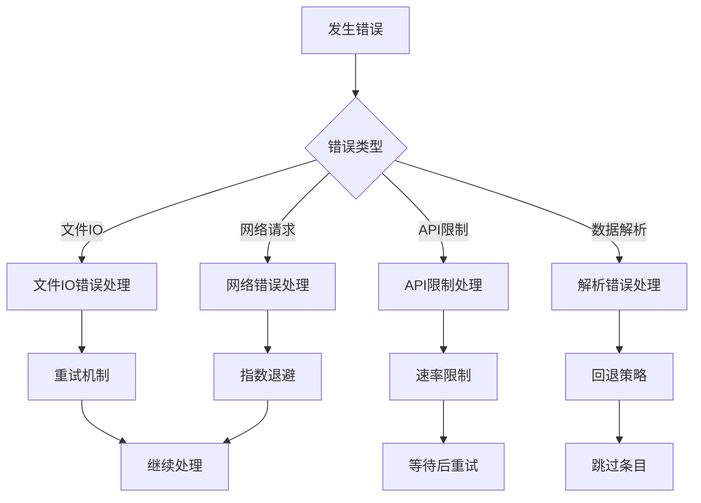

**图表来源**
- [year_fix.py:242-303](file://scholar/year_fix.py#L242-L303)
- [config.py:104-118](file://scholar/config.py#L104-L118)

**章节来源**
- [year_fix.py:242-303](file://scholar/year_fix.py#L242-L303)
- [config.py:72-119](file://scholar/config.py#L72-L119)

## 结论

年份修正系统通过多策略融合的方式，有效解决了学术论文数据中缺失年份的问题。系统的主要优势包括：

1. **可靠性**：多层验证机制确保修正结果的准确性
2. **可扩展性**：模块化设计支持新策略的添加
3. **可观测性**：详细的统计报告和日志记录
4. **容错性**：完善的错误处理和回退机制

系统的局限性主要体现在：

1. **性能瓶颈**：大规模数据处理时的性能优化需求
2. **外部依赖**：对arXiv API的依赖可能影响系统稳定性
3. **维护成本**：需要定期更新以适应新的数据格式

未来改进方向：

1. **性能优化**：引入并行处理和缓存机制
2. **智能学习**：基于机器学习的匹配算法
3. **监控告警**：实时监控系统健康状态
4. **自动化运维**：CI/CD流水线集成

## 附录

### 配置选项说明

| 配置项 | 默认值 | 描述 |
|--------|--------|------|
| SCHOLAR_PG_HOST | localhost | PostgreSQL主机地址 |
| SCHOLAR_PG_PORT | 5433 | PostgreSQL端口号 |
| SCHOLAR_PG_NAME | scholar | 数据库名称 |
| SCHOLAR_PG_USER | scholar | 数据库用户名 |
| SCHOLAR_PG_PASS | scholar2024 | 数据库密码 |
| SCHOLAR_NEO4J_URI | bolt://localhost:7687 | Neo4j数据库URI |
| SCHOLAR_NEO4J_USER | neo4j | Neo4j用户名 |
| SCHOLAR_NEO4J_PASS | scholar2024 | Neo4j密码 |
| SCHOLAR_EMBEDDING_PROVIDER | zhipu | 嵌入模型提供商 |
| SCHOLAR_EMBEDDING_MODEL | embedding-2 | 嵌入模型名称 |
| SCHOLAR_EMBEDDING_DIM | 1024 | 嵌入向量维度 |
| SCHOLAR_LATEX_CMD | pdflatex | LaTeX编译命令 |
| SCHOLAR_ARXIV_TIMEOUT | 30 | arXiv API超时时间(秒) |
| SCHOLAR_ARXIV_RETRIES | 3 | arXiv API重试次数 |

### 统计指标

系统提供以下统计指标：

- **匹配率**：Lean4论文与解析论文的匹配比例
- **修正率**：成功修正年份的论文比例
- **重复率**：已经包含年份的论文比例
- **缺失率**：仍然缺少年份的论文比例
- **API使用率**：arXiv API查询的成功率

### 使用示例

```bash
# 干运行模式（预检）
python -m scholar.year_fix complete_years --dry-run

# 实际执行
python -m scholar.year_fix complete_years

# arXiv API查询
python -m scholar.year_fix complete_years_arxiv --limit 100

# 作者信息补全
python -m scholar.year_fix complete_authors_arxiv --limit 50
```