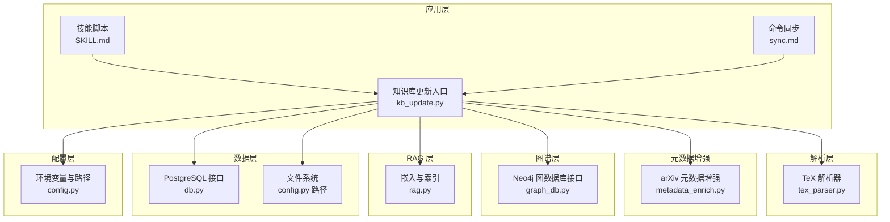
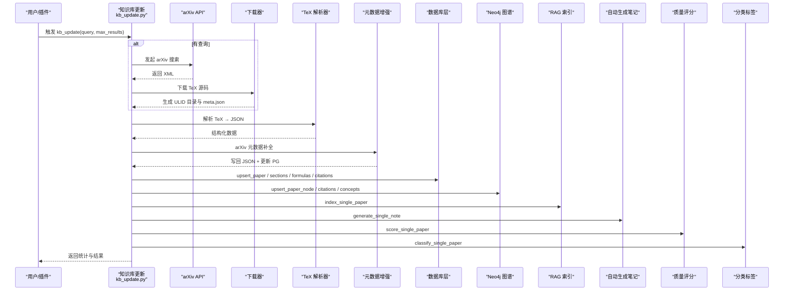
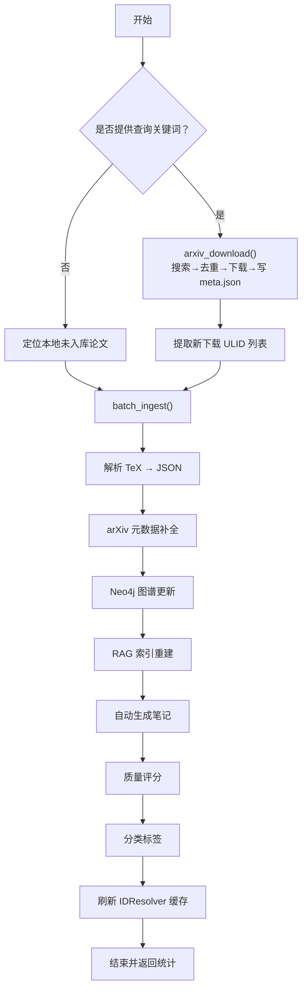
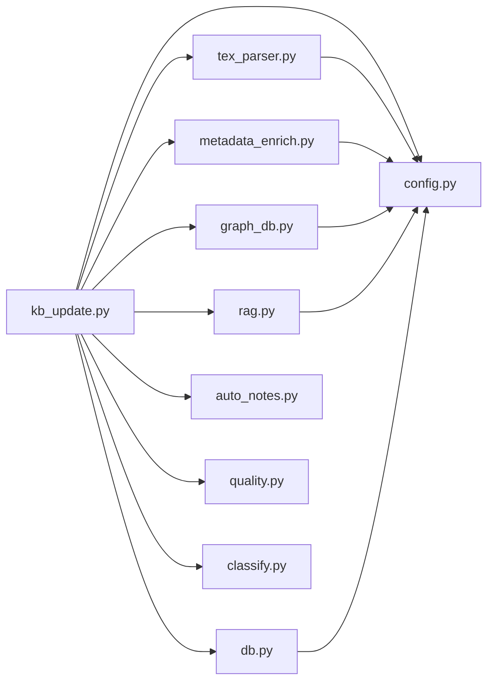

# 知识库更新机制

<cite>
**本文引用的文件**
- [kb_update.py](file://scholar/kb_update.py)
- [db.py](file://scholar/db.py)
- [config.py](file://scholar/config.py)
- [metadata_enrich.py](file://scholar/metadata_enrich.py)
- [graph_db.py](file://scholar/graph_db.py)
- [auto_notes.py](file://scholar/auto_notes.py)
- [rag.py](file://scholar/rag.py)
- [tex_parser.py](file://scholar/tex_parser.py)
- [quality.py](file://scholar/quality.py)
- [classify.py](file://scholar/classify.py)
- [SKILL.md](file://plugin/skills/kb-management/SKILL.md)
- [sync.md](file://plugin/commands/sync.md)
- [test_kb_update.py](file://test/test_kb_update.py)
- [requirements.txt](file://requirements.txt)
</cite>

## 目录
1. [简介](#简介)
2. [项目结构](#项目结构)
3. [核心组件](#核心组件)
4. [架构总览](#架构总览)
5. [详细组件分析](#详细组件分析)
6. [依赖关系分析](#依赖关系分析)
7. [性能考量](#性能考量)
8. [故障排查指南](#故障排查指南)
9. [结论](#结论)
10. [附录](#附录)

## 简介
本技术文档围绕“知识库更新机制”展开，系统性阐述自动更新流程的设计原理、触发条件、执行策略与回滚保障；详解冲突解决算法、版本控制与数据一致性方案；覆盖更新策略配置、增量更新实现、批量更新处理与回滚机制，并提供配置示例、监控指标与性能优化建议，以及错误处理、重试策略与状态跟踪方法。

## 项目结构
该项目采用模块化分层设计：
- 配置层：统一管理环境变量与外部服务连接参数
- 数据层：PostgreSQL 存储与文件系统双栈，支持数据库不可用时的降级模式
- 解析层：TeX 源码解析，抽取结构化元数据与内容
- 元数据增强层：基于 arXiv API 的元数据补全
- 图谱层：Neo4j 引用网络与概念图构建
- RAG 层：向量索引与混合检索
- 应用层：一键更新、批量入库、质量评分与分类标签

图表来源
- [kb_update.py:441-473](file://scholar/kb_update.py#L441-L473)
- [tex_parser.py:23-298](file://scholar/tex_parser.py#L23-L298)
- [metadata_enrich.py:80-131](file://scholar/metadata_enrich.py#L80-L131)
- [graph_db.py:32-69](file://scholar/graph_db.py#L32-L69)
- [rag.py:25-93](file://scholar/rag.py#L25-L93)
- [db.py:24-74](file://scholar/db.py#L24-L74)
- [config.py:23-42](file://scholar/config.py#L23-L42)

章节来源
- [kb_update.py:1-473](file://scholar/kb_update.py#L1-L473)
- [config.py:1-119](file://scholar/config.py#L1-L119)

## 核心组件
- 知识库更新入口：提供 arXiv 搜索、下载、批量入库的一键更新能力
- 数据库层：封装 PostgreSQL 连接与事务，支持文件系统降级
- 解析器：从 TeX 源码抽取标题、作者、年份、摘要、章节、公式、引用等
- 元数据增强：通过 arXiv API 补齐 arXiv ID、DOI、作者、年份、会议等
- 图谱层：构建论文引用网络与概念图，支持中心性计算与桥接论文识别
- RAG 层：分块、嵌入、向量索引与混合检索
- 质量评分与分类：多维度质量评估与多级标签体系

章节来源
- [kb_update.py:441-473](file://scholar/kb_update.py#L441-L473)
- [db.py:24-276](file://scholar/db.py#L24-L276)
- [tex_parser.py:23-298](file://scholar/tex_parser.py#L23-L298)
- [metadata_enrich.py:80-131](file://scholar/metadata_enrich.py#L80-L131)
- [graph_db.py:24-70](file://scholar/graph_db.py#L24-L70)
- [rag.py:25-93](file://scholar/rag.py#L25-L93)
- [quality.py:317-356](file://scholar/quality.py#L317-L356)
- [classify.py:161-238](file://scholar/classify.py#L161-L238)

## 架构总览
知识库更新遵循“搜索 → 下载 → 解析 → 元数据增强 → 图谱/索引 → 自动笔记/质量/分类”的流水线式处理，支持数据库可用与不可用两种模式的优雅降级。

图表来源
- [kb_update.py:441-473](file://scholar/kb_update.py#L441-L473)
- [config.py:72-118](file://scholar/config.py#L72-L118)
- [tex_parser.py:219-298](file://scholar/tex_parser.py#L219-L298)
- [metadata_enrich.py:186-240](file://scholar/metadata_enrich.py#L186-L240)
- [db.py:79-176](file://scholar/db.py#L79-L176)
- [graph_db.py:324-280](file://scholar/graph_db.py#L324-L280)
- [rag.py:551-581](file://scholar/rag.py#L551-L581)
- [auto_notes.py:330-354](file://scholar/auto_notes.py#L330-L354)
- [quality.py:405-431](file://scholar/quality.py#L405-L431)
- [classify.py:278-293](file://scholar/classify.py#L278-L293)

## 详细组件分析

### 1) 知识库更新入口与流程编排
- 支持两种模式：
  - 搜索模式：根据关键词调用 arXiv API，去重后下载 TeX 源码，生成 ULID 目录与 meta.json
  - 本地模式：仅对本地未入库论文进行批量入库
- 关键流程：
  - arxiv_download：XML 解析、去重、下载、写 meta.json、速率限制
  - batch_ingest：解析 → 元数据增强 → 图谱更新 → RAG 重建 → 自动生成笔记/质量/分类
  - kb_update：串联下载与入库，返回下载与入库统计

图表来源
- [kb_update.py:88-213](file://scholar/kb_update.py#L88-L213)
- [kb_update.py:216-438](file://scholar/kb_update.py#L216-L438)
- [kb_update.py:441-473](file://scholar/kb_update.py#L441-L473)

章节来源
- [kb_update.py:88-213](file://scholar/kb_update.py#L88-L213)
- [kb_update.py:216-438](file://scholar/kb_update.py#L216-L438)
- [kb_update.py:441-473](file://scholar/kb_update.py#L441-L473)

### 2) 冲突解决与版本控制
- 数据库层面：
  - 使用 PostgreSQL 的 upsert（ON CONFLICT）实现幂等更新，优先保留已有字段，仅在缺失时填充 arXiv/DOI 等
  - 分别维护 paper、sections、formulas、citations 的替换逻辑，确保引用与公式一致性
- 文件系统层面：
  - 解析后的 JSON 作为最终事实源；数据库不可用时，所有写入退化为文件写入
- 版本控制与回滚：
  - 无内置版本控制；通过“删除旧索引 + 重建索引”实现回滚式更新
  - RAG 层提供按论文删除旧块再重建的能力，保证索引一致性

章节来源
- [db.py:79-176](file://scholar/db.py#L79-L176)
- [rag.py:551-581](file://scholar/rag.py#L551-L581)

### 3) 增量更新与批量处理
- 增量更新：
  - batch_ingest 支持显式传入 ULID 列表或扫描本地未入库论文
  - RAG 单论文重建：先删除旧块，再插入新块，避免陈旧数据残留
- 批量处理：
  - arXiv 请求支持重试与指数退避
  - RAG 批量嵌入与进度条显示
  - 元数据增强按阈值与标题相似度选择最佳匹配

章节来源
- [kb_update.py:216-251](file://scholar/kb_update.py#L216-L251)
- [kb_update.py:330-361](file://scholar/kb_update.py#L330-L361)
- [config.py:72-118](file://scholar/config.py#L72-L118)
- [rag.py:471-548](file://scholar/rag.py#L471-L548)
- [metadata_enrich.py:80-131](file://scholar/metadata_enrich.py#L80-L131)

### 4) 数据一致性保障
- 事务与回滚：
  - 数据库层使用上下文管理器封装事务，异常自动回滚
- 去重与幂等：
  - 下载阶段基于已存在 JSON 的 arXiv ID 去重
  - 解析阶段失败不会污染目录，失败时清理空目录
- 失败容忍：
  - 图谱/索引/笔记/质量/分类均为 best-effort 步骤，不影响主流程
- 降级模式：
  - 数据库不可用时，仍可完成解析与文件写入，后续再补全数据库

章节来源
- [db.py:62-73](file://scholar/db.py#L62-L73)
- [kb_update.py:111-135](file://scholar/kb_update.py#L111-L135)
- [kb_update.py:362-433](file://scholar/kb_update.py#L362-L433)

### 5) 错误处理与重试策略
- arXiv API：
  - 支持多次重试与指数退避，设置超时
- 网络与 I/O：
  - 下载失败清理空目录；解析失败记录错误并继续
- 图谱/索引：
  - 失败捕获并忽略，不影响整体流程
- 回滚与恢复：
  - RAG 删除旧块后重建；数据库 upsert 幂等

章节来源
- [config.py:72-118](file://scholar/config.py#L72-L118)
- [kb_update.py:152-170](file://scholar/kb_update.py#L152-L170)
- [kb_update.py:311-322](file://scholar/kb_update.py#L311-L322)
- [rag.py:563-572](file://scholar/rag.py#L563-L572)

### 6) 配置与触发条件
- 触发条件：
  - 用户命令：kb-management 技能脚本、sync 命令
  - 关键参数：查询关键词、最大结果数、是否下载 PDF
- 配置项：
  - PostgreSQL 连接参数、Neo4j 连接参数、嵌入模型与 API Key、LaTeX 编译器、输出目录
  - arXiv 请求超时与重试次数

章节来源
- [SKILL.md:6-27](file://plugin/skills/kb-management/SKILL.md#L6-L27)
- [sync.md:5-10](file://plugin/commands/sync.md#L5-L10)
- [config.py:44-67](file://scholar/config.py#L44-L67)
- [config.py:72-118](file://scholar/config.py#L72-L118)
- [kb_update.py:441-473](file://scholar/kb_update.py#L441-L473)

### 7) 监控指标与状态跟踪
- 统计字段：
  - 总处理数、解析数、元数据增强数、图谱更新数、RAG 索引数、自动生成笔记数、质量评分数、分类数、错误明细
- 输出位置：
  - 控制台打印与 JSON 文件（质量评分 JSON、笔记文件）
- 健康检查：
  - stats 命令用于查看数据库统计与一致性

章节来源
- [kb_update.py:252-260](file://scholar/kb_update.py#L252-L260)
- [db.py:223-241](file://scholar/db.py#L223-L241)
- [SKILL.md:11-16](file://plugin/skills/kb-management/SKILL.md#L11-L16)

## 依赖关系分析

图表来源
- [kb_update.py:15-16](file://scholar/kb_update.py#L15-L16)
- [tex_parser.py:11-19](file://scholar/tex_parser.py#L11-L19)
- [metadata_enrich.py:14-15](file://scholar/metadata_enrich.py#L14-L15)
- [graph_db.py:17-18](file://scholar/graph_db.py#L17-L18)
- [rag.py:18-19](file://scholar/rag.py#L18-L19)
- [db.py:12-13](file://scholar/db.py#L12-L13)

章节来源
- [kb_update.py:1-36](file://scholar/kb_update.py#L1-L36)
- [requirements.txt:1-14](file://requirements.txt#L1-L14)

## 性能考量
- I/O 与并发：
  - 批量嵌入使用进度条与批大小控制内存占用
  - arXiv 请求指数退避与超时，避免阻塞
- 索引与检索：
  - HNSW 向量索引提升检索效率
  - 混合检索（向量 + BM25）提高召回与相关性
- 数据库：
  - upsert 使用 ON CONFLICT，减少重复写入
  - 分离 sections/formulas/citations 的替换逻辑，降低锁竞争
- 降级策略：
  - 数据库不可用时，解析与文件写入不受影响，后续再补写数据库

章节来源
- [rag.py:471-548](file://scholar/rag.py#L471-L548)
- [config.py:72-118](file://scholar/config.py#L72-L118)
- [db.py:79-176](file://scholar/db.py#L79-L176)

## 故障排查指南
- 常见问题与定位：
  - arXiv API 失败：检查超时与重试配置、网络代理、请求频率
  - 下载失败：确认 PDF/TeX 链接有效性、清理失败目录
  - 数据库不可用：确认连接参数、服务状态；启用文件系统降级
  - 图谱/索引失败：检查 Neo4j/PostgreSQL 可用性；必要时删除并重建索引
- 单元测试参考：
  - XML 解析、ULID 生成、去重逻辑、批处理边界条件

章节来源
- [test_kb_update.py:14-52](file://test/test_kb_update.py#L14-L52)
- [test_kb_update.py:113-137](file://test/test_kb_update.py#L113-L137)
- [kb_update.py:152-170](file://scholar/kb_update.py#L152-L170)
- [db.py:31-44](file://scholar/db.py#L31-L44)

## 结论
该知识库更新机制以“解析 → 元数据增强 → 图谱/索引 → 笔记/质量/分类”的流水线为核心，结合数据库 upsert 幂等与文件系统降级，实现了高可靠、可扩展的自动化更新。通过指数退避、去重与 best-effort 步骤，系统在复杂外部依赖环境下仍保持稳健；通过 RAG 单论文重建与数据库 upsert，提供了可回滚的增量更新能力。建议在生产环境中配合健康检查与监控指标，持续优化批大小与索引策略。

## 附录

### A. 配置示例与环境变量
- PostgreSQL 连接：主机、端口、数据库名、用户名、密码
- Neo4j 连接：URI、用户名、密码
- 嵌入模型：提供商、模型名、维度、API Key
- LaTeX 编译器：pdflatex 等
- 输出目录：解析 JSON、笔记、草稿、BibTeX、实验、数据集、PDF、摘要、日志等

章节来源
- [config.py:44-67](file://scholar/config.py#L44-L67)
- [config.py:23-42](file://scholar/config.py#L23-L42)

### B. 监控指标清单
- 数据库统计：论文总数、解析完成数、章节/公式/引用总数、年份范围
- 更新统计：总处理数、解析数、元数据增强数、图谱更新数、RAG 索引数、笔记/质量/分类数、错误明细

章节来源
- [db.py:223-241](file://scholar/db.py#L223-L241)
- [kb_update.py:252-260](file://scholar/kb_update.py#L252-L260)

### C. 回滚与恢复建议
- RAG 回滚：删除旧块后重建
- 数据库回滚：利用 upsert 幂等特性，重新执行入库步骤
- 图谱回滚：删除旧节点/边后重建

章节来源
- [rag.py:563-572](file://scholar/rag.py#L563-L572)
- [db.py:79-176](file://scholar/db.py#L79-L176)
- [graph_db.py:155-177](file://scholar/graph_db.py#L155-L177)