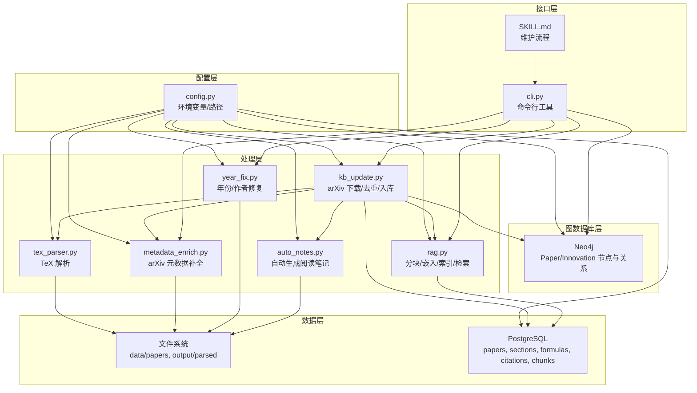
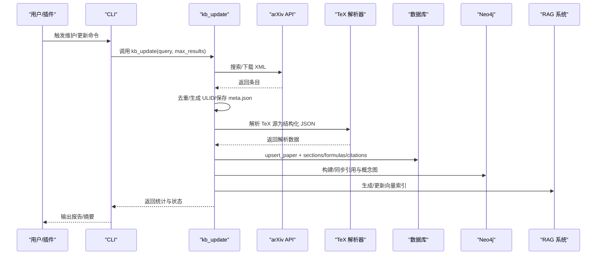
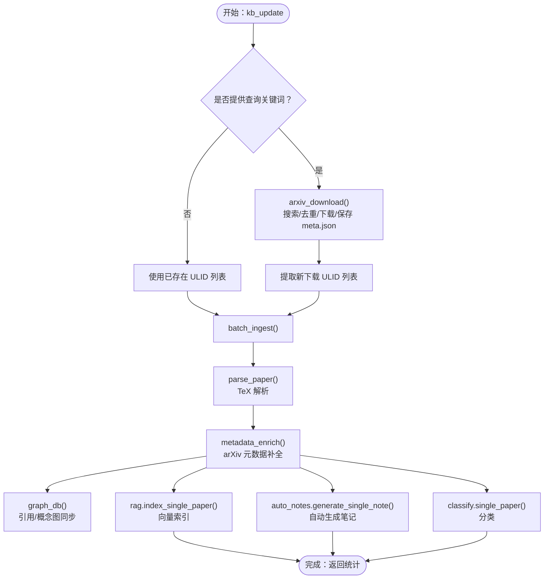
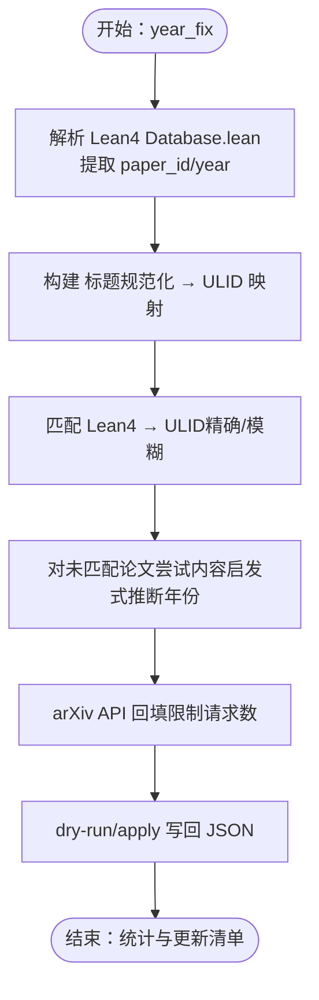
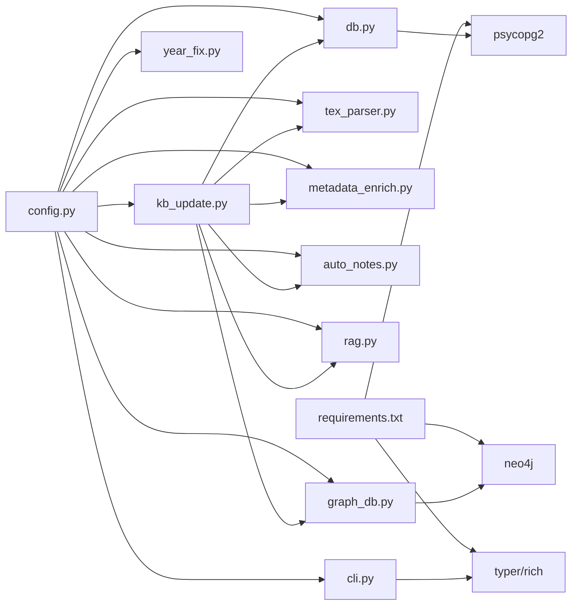

# 知识库管理系统

<cite>
**本文引用的文件**
- [scholar/kb_update.py](file://scholar/kb_update.py)
- [scholar/year_fix.py](file://scholar/year_fix.py)
- [scholar/db.py](file://scholar/db.py)
- [scholar/config.py](file://scholar/config.py)
- [scholar/cli.py](file://scholar/cli.py)
- [scholar/graph_db.py](file://scholar/graph_db.py)
- [scholar/metadata_enrich.py](file://scholar/metadata_enrich.py)
- [scholar/tex_parser.py](file://scholar/tex_parser.py)
- [scholar/auto_notes.py](file://scholar/auto_notes.py)
- [scholar/rag.py](file://scholar/rag.py)
- [plugin/skills/kb-management/SKILL.md](file://plugin/skills/kb-management/SKILL.md)
- [plugin/commands/sync.md](file://plugin/commands/sync.md)
- [infra/docker-compose.yml](file://infra/docker-compose.yml)
- [requirements.txt](file://requirements.txt)
- [test/test_kb_update.py](file://test/test_kb_update.py)
</cite>

## 目录
1. [简介](#简介)
2. [项目结构](#项目结构)
3. [核心组件](#核心组件)
4. [架构总览](#架构总览)
5. [详细组件分析](#详细组件分析)
6. [依赖关系分析](#依赖关系分析)
7. [性能考虑](#性能考虑)
8. [故障排除指南](#故障排除指南)
9. [结论](#结论)
10. [附录](#附录)

## 简介
本技术文档面向“知识库管理系统”，系统围绕学术论文的采集、解析、入库、增强、图谱构建、RAG 向量检索与自动笔记生成展开，提供从 arXiv 批量抓取、去重、入库、元数据补全、年份与作者修复、引用解析、Neo4j 图谱同步、pgvector 向量索引、以及 CLI 工具链的完整流水线。文档重点阐述：
- 知识库更新机制与自动更新流程
- 冲突解决策略与版本控制思路
- 年份修正系统的时间戳标准化与历史数据校正
- 存储结构、访问模式、缓存策略与性能优化
- 配置示例、维护指南与故障排除
- 数据迁移、备份恢复与扩展性设计

## 项目结构
系统采用模块化分层设计：
- 配置层：集中管理环境变量与路径
- 数据层：PostgreSQL（结构化）与文件系统（JSON）
- 图数据库层：Neo4j（引用网络与概念图）
- 向量检索层：pgvector（RAG）
- 解析与处理层：TeX 解析、元数据增强、年份/作者修复、自动笔记
- CLI 与插件：命令行工具与技能脚本

图表来源
- [scholar/config.py:20-66](file://scholar/config.py#L20-L66)
- [scholar/kb_update.py:88-213](file://scholar/kb_update.py#L88-L213)
- [scholar/tex_parser.py:23-298](file://scholar/tex_parser.py#L23-L298)
- [scholar/metadata_enrich.py:80-131](file://scholar/metadata_enrich.py#L80-L131)
- [scholar/year_fix.py:165-239](file://scholar/year_fix.py#L165-L239)
- [scholar/auto_notes.py:28-160](file://scholar/auto_notes.py#L28-L160)
- [scholar/rag.py:25-93](file://scholar/rag.py#L25-L93)
- [scholar/db.py:24-126](file://scholar/db.py#L24-L126)
- [scholar/graph_db.py:32-69](file://scholar/graph_db.py#L32-L69)
- [scholar/cli.py:46-126](file://scholar/cli.py#L46-L126)
- [plugin/skills/kb-management/SKILL.md:9-53](file://plugin/skills/kb-management/SKILL.md#L9-L53)

章节来源
- [scholar/config.py:20-66](file://scholar/config.py#L20-L66)
- [infra/docker-compose.yml:1-44](file://infra/docker-compose.yml#L1-L44)

## 核心组件
- 知识库更新与入库流水线：arXiv 搜索 → 下载（去重）→ 解析 → 元数据补全 → 图谱/向量/笔记/质量分类
- 年份与作者修复：Lean4 数据库匹配、内容启发式推断、arXiv API 回填
- 数据持久化：PostgreSQL（结构化）+ 文件系统（JSON），数据库不可用时降级为文件模式
- 图谱与检索：Neo4j 引用网络与概念图；pgvector 向量索引 + BM25 关键词 + RRF 融合检索
- CLI 与自动化：统一命令入口，维护流程脚本化

章节来源
- [scholar/kb_update.py:441-472](file://scholar/kb_update.py#L441-L472)
- [scholar/year_fix.py:165-303](file://scholar/year_fix.py#L165-L303)
- [scholar/db.py:24-126](file://scholar/db.py#L24-L126)
- [scholar/graph_db.py:225-280](file://scholar/graph_db.py#L225-L280)
- [scholar/rag.py:252-420](file://scholar/rag.py#L252-L420)
- [plugin/skills/kb-management/SKILL.md:9-53](file://plugin/skills/kb-management/SKILL.md#L9-L53)

## 架构总览
系统以“配置中心”为枢纽，连接各子系统。数据流从 arXiv 到 TeX 解析，再到结构化入库与多模态增强，最终形成可检索的知识库。

图表来源
- [scholar/kb_update.py:88-213](file://scholar/kb_update.py#L88-L213)
- [scholar/tex_parser.py:219-298](file://scholar/tex_parser.py#L219-L298)
- [scholar/db.py:79-175](file://scholar/db.py#L79-L175)
- [scholar/graph_db.py:225-280](file://scholar/graph_db.py#L225-L280)
- [scholar/rag.py:551-581](file://scholar/rag.py#L551-L581)
- [scholar/cli.py:421-476](file://scholar/cli.py#L421-L476)

## 详细组件分析

### 知识库更新机制与自动更新流程
- 批量下载：基于 arXiv API，解析 XML，提取标题、作者、年份、arXiv ID、摘要与 PDF 链接；按已存在 arXiv ID 去重；生成 ULID 目录与 meta.json；失败清理孤儿目录。
- 批量入库：解析 TeX → 元数据补全（arXiv API 一次性提取 arxiv_id/doi/year/venue/authors）→ Neo4j 图谱更新（节点/边）→ pgvector 索引重建 → 自动生成笔记/质量评分/分类。
- 一键更新：kb_update(query, max_results) 组合上述步骤，支持仅处理本地未入库论文。

图表来源
- [scholar/kb_update.py:88-213](file://scholar/kb_update.py#L88-L213)
- [scholar/kb_update.py:216-438](file://scholar/kb_update.py#L216-L438)
- [scholar/metadata_enrich.py:80-131](file://scholar/metadata_enrich.py#L80-L131)
- [scholar/graph_db.py:225-280](file://scholar/graph_db.py#L225-L280)
- [scholar/rag.py:551-581](file://scholar/rag.py#L551-L581)
- [scholar/auto_notes.py:330-354](file://scholar/auto_notes.py#L330-L354)

章节来源
- [scholar/kb_update.py:88-213](file://scholar/kb_update.py#L88-L213)
- [scholar/kb_update.py:216-438](file://scholar/kb_update.py#L216-L438)
- [plugin/skills/kb-management/SKILL.md:18-27](file://plugin/skills/kb-management/SKILL.md#L18-L27)

### 冲突解决策略与版本控制
- 去重与幂等：按 arXiv ID 去重；meta.json 写入失败自动清理目录，避免孤儿目录；ULID 作为稳定主键，确保后续流程一致。
- 数据库冲突：PostgreSQL 使用 upsert（ON CONFLICT）更新字段，保留强一致的结构化视图；文件模式下仅写 JSON，避免外部依赖。
- 版本控制思路：以解析 JSON 为事实源，数据库/图谱/向量索引均为派生视图；变更通过增量再索引实现，避免全量重建。

章节来源
- [scholar/kb_update.py:111-135](file://scholar/kb_update.py#L111-L135)
- [scholar/kb_update.py:186-208](file://scholar/kb_update.py#L186-L208)
- [scholar/db.py:79-126](file://scholar/db.py#L79-L126)

### 年份修正系统与历史数据校正
- Lean4 匹配：解析 Lean4 Database.lean，抽取 paper_id/year 映射，通过标题规范化与模糊匹配映射到 ULID。
- 内容启发式：对未匹配论文，从摘要/前几节中提取年份（常见表达式计数 + 时间阈值过滤）。
- arXiv 回填：对仍缺失年份的论文，按标题进行 arXiv API 查询，限定请求次数，避免限流。
- 作者修复：对缺失作者的论文，同样通过 arXiv API 查询作者列表。

图表来源
- [scholar/year_fix.py:19-84](file://scholar/year_fix.py#L19-L84)
- [scholar/year_fix.py:102-158](file://scholar/year_fix.py#L102-L158)
- [scholar/year_fix.py:165-239](file://scholar/year_fix.py#L165-L239)
- [scholar/year_fix.py:262-303](file://scholar/year_fix.py#L262-L303)
- [scholar/year_fix.py:337-419](file://scholar/year_fix.py#L337-L419)

章节来源
- [scholar/year_fix.py:165-303](file://scholar/year_fix.py#L165-L303)

### 存储结构、访问模式与缓存策略
- 文件系统：data/papers/<ULID>/source.tar.gz + meta.json；output/parsed/*.json 作为事实源。
- PostgreSQL：papers、sections、formulas、citations、chunks 表；提供查询与统计接口；不可用时降级为文件模式。
- Neo4j：Paper/Innovation 节点与 CITES/HAS_CONCEPT/RELATED_TO/REPLACES 关系；提供引用网络与概念图构建与查询。
- 缓存策略：ID 解析器缓存刷新；RAG 使用 HNSW 索引加速；BM25 轻量索引按需加载；CLI 统一输出与进度展示。

章节来源
- [scholar/db.py:24-126](file://scholar/db.py#L24-L126)
- [scholar/graph_db.py:32-69](file://scholar/graph_db.py#L32-L69)
- [scholar/rag.py:214-237](file://scholar/rag.py#L214-L237)
- [scholar/cli.py:421-476](file://scholar/cli.py#L421-L476)

### 性能优化
- 批处理与限速：arXiv 请求间隔、RAG 批量嵌入、Neo4j 批量写入。
- 索引优化：pgvector HNSW（余弦距离）；BM25 作为轻量关键词检索；混合检索（RRF）融合向量与关键词。
- I/O 优化：临时目录解压、增量索引（单篇重索引删除旧块）。

章节来源
- [scholar/rag.py:427-468](file://scholar/rag.py#L427-L468)
- [scholar/rag.py:551-581](file://scholar/rag.py#L551-L581)
- [scholar/graph_db.py:156-177](file://scholar/graph_db.py#L156-L177)

### 维护流程与配置示例
- 维护流程：健康检查（stats/scan）→ 自动更新（kb-update/batch-ingest）→ 元数据回填（metadata-enrich）→ 年份/作者修复（year-fix/author-fix）→ 引用解析与图谱同步（cite-resolve/graph-build）→ RAG 索引同步（rag-index）→ 输出报告。
- 配置要点：数据库/图数据库/嵌入 API 等通过环境变量注入；.env 示例由 python-dotenv 加载；路径集中于 config.py。

章节来源
- [plugin/skills/kb-management/SKILL.md:9-53](file://plugin/skills/kb-management/SKILL.md#L9-L53)
- [scholar/cli.py:421-476](file://scholar/cli.py#L421-L476)
- [scholar/config.py:69-118](file://scholar/config.py#L69-L118)

## 依赖关系分析

图表来源
- [requirements.txt:1-14](file://requirements.txt#L1-L14)
- [scholar/config.py:69-118](file://scholar/config.py#L69-L118)
- [scholar/kb_update.py:15-16](file://scholar/kb_update.py#L15-L16)
- [scholar/db.py:15-21](file://scholar/db.py#L15-L21)
- [scholar/graph_db.py:24-29](file://scholar/graph_db.py#L24-L29)
- [scholar/cli.py:13-28](file://scholar/cli.py#L13-L28)

章节来源
- [requirements.txt:1-14](file://requirements.txt#L1-L14)

## 性能考虑
- I/O 密集：TeX 解析与 PDF 处理，建议并行批处理与限速。
- 网络限流：arXiv API 重试与退避、速率限制；RAG 批量嵌入减少往返。
- 索引与查询：HNSW 索引显著提升向量检索；BM25 作为轻量关键词检索；RRF 融合提升召回与排序质量。
- 存储与一致性：数据库事务与文件原子写入；失败清理避免脏数据。

## 故障排除指南
- arXiv 请求失败：检查代理/超时/重试配置；确认 .env 中 SCHOLAR_ARXIV_TIMEOUT/SCHOLAR_ARXIV_RETRIES；必要时降低 max_results。
- 数据库不可用：确认 Docker Compose 启动 PostgreSQL/Neo4j；检查凭据与端口；系统将自动降级为文件模式。
- 解析失败：检查 TeX 归档完整性与 main.tex 定位；查看 CLI 错误输出与日志目录。
- 图谱同步异常：确认 Neo4j 可达；检查引用键解析（title → ULID）与批处理大小。
- RAG 索引问题：确认嵌入 API Key 与模型配置；检查 HNSW 索引创建；必要时重建索引。

章节来源
- [scholar/config.py:69-118](file://scholar/config.py#L69-L118)
- [infra/docker-compose.yml:1-44](file://infra/docker-compose.yml#L1-L44)
- [scholar/cli.py:663-704](file://scholar/cli.py#L663-L704)
- [scholar/rag.py:214-237](file://scholar/rag.py#L214-L237)

## 结论
该知识库管理系统以“解析 + 增强 + 多模态索引”的流水线为核心，结合 PostgreSQL、Neo4j 与 pgvector，形成结构化、图谱化与语义化的综合知识库。通过去重、幂等写入、增量索引与混合检索，系统在准确性与性能之间取得平衡，并提供完善的维护流程与故障排查手段。

## 附录

### 数据生命周期管理
- 入库前：arXiv 去重、meta.json 生成、ULID 目录建立
- 入库后：结构化入库（PG）、图谱同步（Neo4j）、向量索引（pgvector）、自动生成笔记
- 维护期：元数据补全、年份/作者修复、引用解析、索引重建与统计报告

章节来源
- [scholar/kb_update.py:88-213](file://scholar/kb_update.py#L88-L213)
- [scholar/metadata_enrich.py:243-311](file://scholar/metadata_enrich.py#L243-L311)
- [scholar/year_fix.py:165-303](file://scholar/year_fix.py#L165-L303)
- [scholar/graph_db.py:225-280](file://scholar/graph_db.py#L225-L280)
- [scholar/rag.py:551-581](file://scholar/rag.py#L551-L581)

### 配置示例与环境变量
- 数据库：SCHOLAR_PG_HOST/PORT/NAME/USER/PASS
- Neo4j：SCHOLAR_NEO4J_URI/USER/PASS
- 嵌入：SCHOLAR_EMBEDDING_PROVIDER/MODEL/DIM/API_KEY
- arXiv：SCHOLAR_ARXIV_TIMEOUT/RETRIES/PROXY
- LaTeX：SCHOLAR_LATEX_CMD
- Lean4：LEAN 项目路径（由 LEAN_DIR 指定）

章节来源
- [scholar/config.py:44-66](file://scholar/config.py#L44-L66)
- [scholar/config.py:69-118](file://scholar/config.py#L69-L118)

### 数据迁移与备份恢复
- 迁移：从文件 JSON 迁移到 PostgreSQL（或反之）通过 db.py 的 save_parsed/load_parsed/list_parsed 实现；结构化导入导出可通过 CLI 命令完成。
- 备份：PostgreSQL 卷（pgdata）与 Neo4j 卷（neo4jdata）持久化；定期导出 BibTeX 与笔记归档。
- 恢复：容器重启后自动挂载卷；若需重建索引，运行相应同步命令。

章节来源
- [infra/docker-compose.yml:12-14](file://infra/docker-compose.yml#L12-L14)
- [infra/docker-compose.yml:33-35](file://infra/docker-compose.yml#L33-L35)
- [scholar/db.py:248-275](file://scholar/db.py#L248-L275)
- [scholar/cli.py:492-523](file://scholar/cli.py#L492-L523)

### 扩展性设计
- 插件化：CLI 命令与技能脚本解耦，便于新增处理阶段。
- 多供应商嵌入：支持智谱/OPENAI/本地嵌入切换。
- 可观测性：CLI 输出统计与进度；Neo4j 图统计；PG 统计接口。

章节来源
- [requirements.txt:1-14](file://requirements.txt#L1-L14)
- [scholar/rag.py:100-176](file://scholar/rag.py#L100-L176)
- [scholar/cli.py:421-476](file://scholar/cli.py#L421-L476)
- [scholar/graph_db.py:711-791](file://scholar/graph_db.py#L711-L791)