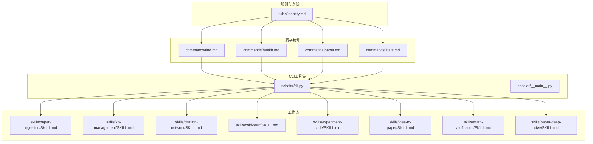
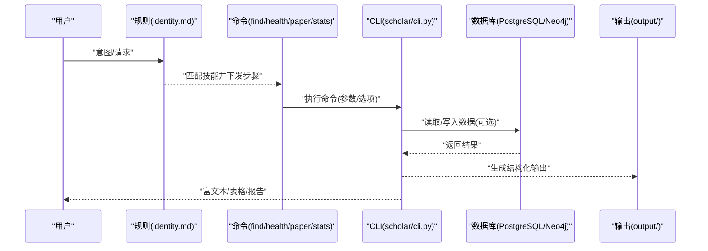
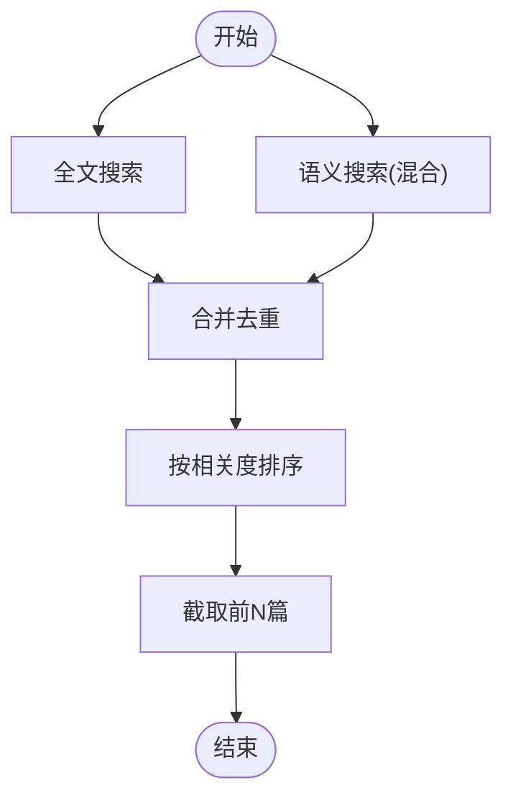
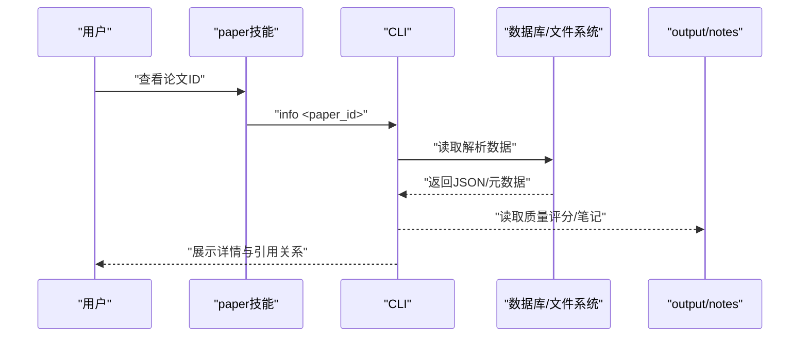
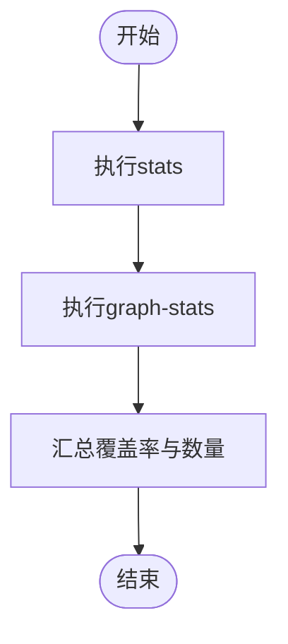

# 原子技能实现

<cite>
**本文档引用的文件**
- [plugin/commands/find.md](file://plugin/commands/find.md)
- [plugin/commands/health.md](file://plugin/commands/health.md)
- [plugin/commands/paper.md](file://plugin/commands/paper.md)
- [plugin/commands/stats.md](file://plugin/commands/stats.md)
- [plugin/rules/identity.md](file://plugin/rules/identity.md)
- [plugin/skills/paper-ingestion/SKILL.md](file://plugin/skills/paper-ingestion/SKILL.md)
- [plugin/skills/kb-management/SKILL.md](file://plugin/skills/kb-management/SKILL.md)
- [plugin/skills/citation-network/SKILL.md](file://plugin/skills/citation-network/SKILL.md)
- [plugin/skills/cold-start/SKILL.md](file://plugin/skills/cold-start/SKILL.md)
- [plugin/skills/experiment-code/SKILL.md](file://plugin/skills/experiment-code/SKILL.md)
- [plugin/skills/idea-to-paper/SKILL.md](file://plugin/skills/idea-to-paper/SKILL.md)
- [plugin/skills/math-verification/SKILL.md](file://plugin/skills/math-verification/SKILL.md)
- [plugin/skills/paper-deep-dive/SKILL.md](file://plugin/skills/paper-deep-dive/SKILL.md)
- [scholar/cli.py](file://scholar/cli.py)
- [scholar/__main__.py](file://scholar/__main__.py)
</cite>

## 目录
1. [简介](#简介)
2. [项目结构](#项目结构)
3. [核心组件](#核心组件)
4. [架构总览](#架构总览)
5. [详细组件分析](#详细组件分析)
6. [依赖分析](#依赖分析)
7. [性能考虑](#性能考虑)
8. [故障排除指南](#故障排除指南)
9. [结论](#结论)
10. [附录](#附录)

## 简介
本文件系统性梳理“原子技能”的实现与协作关系，聚焦8个原子技能：find、health、paper、stats，以及identity规则技能。文档涵盖每个原子技能的功能、输入输出、参数配置、错误处理、与其他技能的组合使用方式，并提供实际使用示例与最佳实践建议。

## 项目结构
该项目围绕“Scholar Studio”知识库与研究工作流展开，核心由以下部分组成：
- 原子技能与工作流：位于 plugin/skills 与 plugin/commands，定义了8个原子技能与6个工作流的执行步骤与Next Steps。
- CLI工具集：位于 scholar/，提供统一的命令入口与数据处理能力。
- 规则与身份：位于 plugin/rules，定义Agent的心智模型、工作模式与核心约束。
- 基础设施：包含Neo4j图数据库、PostgreSQL/PGVector、Docker编排与初始化SQL。



**图示来源**
- [plugin/rules/identity.md:1-69](file://plugin/rules/identity.md#L1-L69)
- [plugin/commands/find.md:1-7](file://plugin/commands/find.md#L1-L7)
- [plugin/commands/health.md:1-10](file://plugin/commands/health.md#L1-L10)
- [plugin/commands/paper.md:1-11](file://plugin/commands/paper.md#L1-L11)
- [plugin/commands/stats.md:1-7](file://plugin/commands/stats.md#L1-L7)
- [scholar/cli.py:1-800](file://scholar/cli.py#L1-L800)
- [scholar/__main__.py:1-8](file://scholar/__main__.py#L1-L8)

**章节来源**
- [plugin/rules/identity.md:1-69](file://plugin/rules/identity.md#L1-L69)
- [plugin/commands/find.md:1-7](file://plugin/commands/find.md#L1-L7)
- [plugin/commands/health.md:1-10](file://plugin/commands/health.md#L1-L10)
- [plugin/commands/paper.md:1-11](file://plugin/commands/paper.md#L1-L11)
- [plugin/commands/stats.md:1-7](file://plugin/commands/stats.md#L1-L7)
- [scholar/cli.py:1-800](file://scholar/cli.py#L1-L800)
- [scholar/__main__.py:1-8](file://scholar/__main__.py#L1-L8)

## 核心组件
本节聚焦8个原子技能的职责与实现要点：
- find：知识库内全文/语义搜索，合并去重并排序展示。
- health：知识库健康检查，识别数据完整性问题并给出修复建议。
- paper：查看某篇论文的详细信息，包括元数据、关键概念、引用关系与质量评分。
- stats：知识库统计概览，包括论文数量、图谱规模、RAG覆盖率等。

这些技能均通过CLI命令调用实现，遵循统一的输入参数、输出格式与错误处理策略。

**章节来源**
- [plugin/commands/find.md:1-7](file://plugin/commands/find.md#L1-L7)
- [plugin/commands/health.md:1-10](file://plugin/commands/health.md#L1-L10)
- [plugin/commands/paper.md:1-11](file://plugin/commands/paper.md#L1-L11)
- [plugin/commands/stats.md:1-7](file://plugin/commands/stats.md#L1-L7)
- [scholar/cli.py:308-487](file://scholar/cli.py#L308-L487)

## 架构总览
原子技能以“规则驱动 + CLI工具 + 工作流编排”的方式协同：
- rules/identity.md 定义Agent的工作模式与约束，确保所有技能执行遵循数据驱动与增量操作原则。
- commands/*.md 描述原子技能的执行步骤与预期输出，作为技能树的基础。
- scholar/cli.py 提供统一命令入口，封装数据库访问、文件系统操作与富文本输出。
- 工作流技能（如paper-ingestion、kb-management、citation-network等）在原子技能之上进行组合，形成端到端研究流程。



**图示来源**
- [plugin/rules/identity.md:21-34](file://plugin/rules/identity.md#L21-L34)
- [plugin/commands/find.md:3-7](file://plugin/commands/find.md#L3-L7)
- [plugin/commands/health.md:3-10](file://plugin/commands/health.md#L3-L10)
- [plugin/commands/paper.md:6-11](file://plugin/commands/paper.md#L6-L11)
- [plugin/commands/stats.md:3-7](file://plugin/commands/stats.md#L3-L7)
- [scholar/cli.py:32-41](file://scholar/cli.py#L32-L41)

## 详细组件分析

### find 技能
- 功能：在知识库中进行全文搜索与语义搜索，合并去重并按相关度排序展示前若干篇论文。
- 输入：
  - 关键词字符串（全文搜索）
  - 可选混合检索标志（语义搜索）
- 输出：
  - 论文列表（ID、标题、年份、质量等级、关键匹配段落）
- 参数配置：
  - limit：结果上限（默认20）
- 错误处理：
  - 无结果时提示“未找到”
  - 数据库不可用时回退至文件系统搜索
- 协作关系：
  - 与paper、stats等技能配合，先检索再精读与统计



**图示来源**
- [plugin/commands/find.md:3-7](file://plugin/commands/find.md#L3-L7)
- [scholar/cli.py:308-370](file://scholar/cli.py#L308-L370)

**章节来源**
- [plugin/commands/find.md:1-7](file://plugin/commands/find.md#L1-L7)
- [scholar/cli.py:308-370](file://scholar/cli.py#L308-L370)

### health 技能
- 功能：检查知识库健康状态，识别数据完整性问题。
- 执行步骤：
  - 运行stats检查元数据覆盖率
  - 检查PG数据一致性（papers vs sections vs citations数量）
  - 检查Neo4j连通性与节点/边数量
  - 检查RAG chunks数量是否为0（未索引）
  - 列出缺年份、缺作者、未评分、未分类的论文数
  - 给出修复建议（如year-fix、quality-score --all等）
- 输入：无显式参数
- 输出：健康检查报告与修复建议清单
- 错误处理：
  - 数据库不可用时提示“文件模式”
  - Neo4j未启动时提示启动命令
- 协作关系：
  - 与paper、stats、kb-management等技能联动，形成闭环维护


**图示来源**
- [plugin/commands/health.md:3-10](file://plugin/commands/health.md#L3-L10)
- [scholar/cli.py:418-487](file://scholar/cli.py#L418-L487)

**章节来源**
- [plugin/commands/health.md:1-10](file://plugin/commands/health.md#L1-L10)
- [scholar/cli.py:418-487](file://scholar/cli.py#L418-L487)

### paper 技能
- 功能：查看某篇论文的详细信息，包括元数据、关键概念、引用关系与质量评分。
- 输入：
  - 论文ID（支持ULID、arXiv ID、DOI、关键词）
- 输出：
  - 基础信息（标题、作者、年份、会议等）
  - 质量评分（若存在）
  - 阅读笔记摘要（若存在）
  - 引用关系（前向+后向各若干篇）
- 错误处理：
  - 未解析时提示先执行parse
  - ID解析失败时提示无效ID
- 协作关系：
  - 与find、stats、cite-network等技能配合，先检索再精读与分析



**图示来源**
- [plugin/commands/paper.md:6-11](file://plugin/commands/paper.md#L6-L11)
- [scholar/cli.py:240-307](file://scholar/cli.py#L240-L307)

**章节来源**
- [plugin/commands/paper.md:1-11](file://plugin/commands/paper.md#L1-L11)
- [scholar/cli.py:240-307](file://scholar/cli.py#L240-L307)

### stats 技能
- 功能：快速查看知识库当前状态，包括论文数量、图谱规模、RAG覆盖率等。
- 执行步骤：
  - 运行stats获取基础统计
  - 运行graph-stats获取图谱统计
  - 以简洁表格汇总各数据层覆盖率与数量
- 输入：year过滤（可选）
- 输出：统计面板与按年/会议聚合信息
- 错误处理：
  - 数据库不可用时提示“文件模式”
- 协作关系：
  - 与health、paper、citation-network等技能配合，形成数据洞察闭环



**图示来源**
- [plugin/commands/stats.md:3-7](file://plugin/commands/stats.md#L3-L7)
- [scholar/cli.py:418-487](file://scholar/cli.py#L418-L487)

**章节来源**
- [plugin/commands/stats.md:1-7](file://plugin/commands/stats.md#L1-L7)
- [scholar/cli.py:418-487](file://scholar/cli.py#L418-L487)

### identity 规则技能
- 功能：定义Agent的角色、心智模型、工作模式与核心约束，确保技能执行符合数据驱动与增量操作原则。
- 工作模式：
  - Skill执行模式：读取SKILL.md，创建TodoWrite，逐步执行并输出到output/子目录
  - 基础设施模式：新增CLI/工具时同步更新tools.md与MCP服务
- 核心约束：
  - 数据驱动：所有学术声明必须有JSON数据支撑
  - 引用准确：使用paper_id格式，验证存在于知识库
  - 绝不编造：不编造论文、引用、作者、年份或实验结果
  - 增量操作：批量处理逐条处理，报告进度，单条失败不阻塞整批
- 协作关系：
  - 为所有原子技能与工作流提供统一的执行范式与质量保障


**图示来源**
- [plugin/rules/identity.md:21-52](file://plugin/rules/identity.md#L21-L52)

**章节来源**
- [plugin/rules/identity.md:1-69](file://plugin/rules/identity.md#L1-L69)

## 依赖分析
原子技能与CLI、工作流之间的依赖关系如下：

```mermaid
graph LR
subgraph "原子技能"
F["find"]
H["health"]
P["paper"]
S["stats"]
end
subgraph "CLI"
CLI["scholar/cli.py"]
end
subgraph "工作流"
W1["paper-ingestion"]
W2["kb-management"]
W3["citation-network"]
W4["cold-start"]
W5["experiment-code"]
W6["idea-to-paper"]
W7["math-verification"]
W8["paper-deep-dive"]
end
F --> CLI
H --> CLI
P --> CLI
S --> CLI
CLI --> W1
CLI --> W2
CLI --> W3
CLI --> W4
CLI --> W5
CLI --> W6
CLI --> W7
CLI --> W8
```

**图示来源**
- [plugin/commands/find.md:3-7](file://plugin/commands/find.md#L3-L7)
- [plugin/commands/health.md:3-10](file://plugin/commands/health.md#L3-L10)
- [plugin/commands/paper.md:6-11](file://plugin/commands/paper.md#L6-L11)
- [plugin/commands/stats.md:3-7](file://plugin/commands/stats.md#L3-L7)
- [scholar/cli.py:32-41](file://scholar/cli.py#L32-L41)

**章节来源**
- [plugin/commands/find.md:1-7](file://plugin/commands/find.md#L1-L7)
- [plugin/commands/health.md:1-10](file://plugin/commands/health.md#L1-L10)
- [plugin/commands/paper.md:1-11](file://plugin/commands/paper.md#L1-L11)
- [plugin/commands/stats.md:1-7](file://plugin/commands/stats.md#L1-L7)
- [scholar/cli.py:32-41](file://scholar/cli.py#L32-L41)

## 性能考虑
- 搜索性能：全文搜索在数据库可用时优先走数据库查询；否则回退至文件系统遍历，注意limit控制结果数量。
- 图谱查询：Neo4j查询需关注节点/边规模与索引状态，必要时先执行graph-build与graph-stats。
- 批处理：parse-all等批处理命令采用进度条与分片处理，建议设置limit与force参数以控制资源占用。
- I/O优化：输出到output/子目录，避免重复计算；缓存解析结果与质量评分。

## 故障排除指南
- 数据库不可用：
  - 现象：stats显示“not available (file-only mode)”，graph-build提示Neo4j不可用
  - 处理：启动Docker容器或安装相应驱动；确认连接配置
- 未解析论文：
  - 现象：info提示“Paper not parsed yet”
  - 处理：先执行parse或scan定位未解析论文并批量解析
- ID解析失败：
  - 现象：paper/paper-deep-dive等技能提示无效ID
  - 处理：确认ID格式（ULID/arXiv/DOI/slug），或先执行search定位
- Neo4j未启动：
  - 现象：graph-build/graph-stats报错
  - 处理：执行docker compose启动neo4j，或使用citations字段手动分析

**章节来源**
- [scholar/cli.py:32-41](file://scholar/cli.py#L32-L41)
- [scholar/cli.py:660-706](file://scholar/cli.py#L660-L706)
- [plugin/commands/health.md:3-10](file://plugin/commands/health.md#L3-L10)

## 结论
原子技能以统一的CLI接口与规则约束为基础，围绕知识库的检索、健康检查、信息展示与统计分析形成闭环。通过与工作流技能的组合，可实现从冷启动、论文精读、实验复现到论文写作的完整研究流程。建议在日常使用中遵循identity规则的约束，优先使用CLI命令与工具，确保数据驱动与增量操作，提升研究效率与质量。

## 附录
- 实际使用示例（路径指引）：
  - 检索与精读：find → paper → paper-deep-dive
  - 健康检查与维护：health → kb-management → stats
  - 引用网络分析：stats → citation-network
  - 冷启动与学习路径：cold-start → research-survey → paper-deep-dive
  - 实验复现：experiment-code → reproduce-paper
  - 数学验证：math-verification → Lean4编译
- 最佳实践：
  - 先find后paper，再paper-deep-dive，最后writing-pipeline
  - 定期执行health与stats，保持知识库健康
  - 使用graph-build与graph-stats优化引用网络质量
  - 严格遵循identity规则，杜绝编造数据