# 原子技能实现

<cite>
**本文档引用的文件**
- [plugin/README.md](file://plugin/README.md)
- [plugin/commands/find.md](file://plugin/commands/find.md)
- [plugin/commands/health.md](file://plugin/commands/health.md)
- [plugin/commands/paper.md](file://plugin/commands/paper.md)
- [plugin/commands/stats.md](file://plugin/commands/stats.md)
- [plugin/rules/identity.md](file://plugin/rules/identity.md)
- [plugin/skills/paper-ingestion/SKILL.md](file://plugin/skills/paper-ingestion/SKILL.md)
- [plugin/skills/kb-management/SKILL.md](file://plugin/skills/kb-management/SKILL.md)
- [plugin/skills/citation-network/SKILL.md](file://plugin/skills/citation-network/SKILL.md)
- [plugin/skills/cold-start/SKILL.md](file://plugin/skills/cold-start/SKILL.md)
- [plugin/skills/experiment-code/SKILL.md](file://plugin/skills/experiment-code/SKILL.md)
- [plugin/skills/research-gap/SKILL.md](file://plugin/skills/research-gap/SKILL.md)
- [plugin/skills/review-report/SKILL.md](file://plugin/skills/review-report/SKILL.md)
- [plugin/skills/writing-pipeline/SKILL.md](file://plugin/skills/writing-pipeline/SKILL.md)
- [plugin/skills/reproduce-paper/SKILL.md](file://plugin/skills/reproduce-paper/SKILL.md)
- [plugin/skills/idea-to-paper/SKILL.md](file://plugin/skills/idea-to-paper/SKILL.md)
- [plugin/skills/math-verification/SKILL.md](file://plugin/skills/math-verification/SKILL.md)
- [plugin/skills/paper-recommendation/SKILL.md](file://plugin/skills/paper-recommendation/SKILL.md)
- [plugin/skills/paper-deep-dive/SKILL.md](file://plugin/skills/paper-deep-dive/SKILL.md)
- [scholar/cli.py](file://scholar/cli.py)
- [scholar/__main__.py](file://scholar/__main__.py)
</cite>

## 更新摘要
**所做更改**
- 更新技能总数：从22个减少到14个原子技能
- 重新整理技能分类：区分8个原子技能和6个工作流技能
- 更新技能列表和功能描述
- 修正架构图表以反映新的技能结构
- 更新依赖关系分析和协作关系

## 目录
1. [简介](#简介)
2. [项目结构](#项目结构)
3. [核心组件](#核心组件)
4. [架构总览](#架构总览)
5. [详细组件分析](#详细组件分析)
6. [依赖分析](#依赖分析)
7. [性能考虑](#性能考虑)
8. [故障排除指南](#故障排除指南)
9. [结论](#结论)
10. [附录](#附录)

## 简介
本文件系统性梳理"原子技能"的实现与协作关系，聚焦14个原子技能：find、health、paper、stats等命令技能，以及8个原子技能（paper-ingestion、math-verification、paper-recommendation、citation-network、research-gap、review-report、cold-start、experiment-code）。文档涵盖每个原子技能的功能、输入输出、参数配置、错误处理、与其他技能的组合使用方式，并提供实际使用示例与最佳实践建议。

## 项目结构
该项目围绕"Scholar Studio"知识库与研究工作流展开，核心由以下部分组成：
- 原子技能与工作流：位于 plugin/skills 与 plugin/commands，定义14个原子技能与6个工作流的执行步骤与Next Steps。
- CLI工具集：位于 scholar/，提供统一的命令入口与数据处理能力。
- 规则与身份：位于 plugin/rules，定义Agent的心智模型、工作模式与核心约束。
- 基础设施：包含Neo4j图数据库、PostgreSQL/PGVector、Docker编排与初始化SQL。

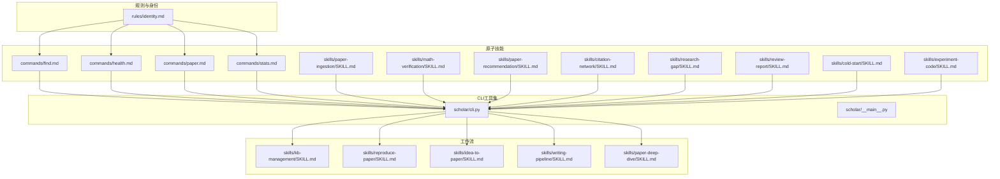

**图示来源**
- [plugin/README.md:60-79](file://plugin/README.md#L60-L79)
- [plugin/commands/find.md:1-7](file://plugin/commands/find.md#L1-L7)
- [plugin/commands/health.md:1-10](file://plugin/commands/health.md#L1-L10)
- [plugin/commands/paper.md:1-11](file://plugin/commands/paper.md#L1-L11)
- [plugin/commands/stats.md:1-7](file://plugin/commands/stats.md#L1-L7)
- [plugin/skills/paper-ingestion/SKILL.md:1-85](file://plugin/skills/paper-ingestion/SKILL.md#L1-L85)
- [plugin/skills/math-verification/SKILL.md:1-100](file://plugin/skills/math-verification/SKILL.md#L1-L100)
- [plugin/skills/paper-recommendation/SKILL.md:1-120](file://plugin/skills/paper-recommendation/SKILL.md#L1-L120)
- [plugin/skills/citation-network/SKILL.md:1-101](file://plugin/skills/citation-network/SKILL.md#L1-L101)
- [plugin/skills/research-gap/SKILL.md:1-150](file://plugin/skills/research-gap/SKILL.md#L1-L150)
- [plugin/skills/review-report/SKILL.md:1-130](file://plugin/skills/review-report/SKILL.md#L1-L130)
- [plugin/skills/cold-start/SKILL.md:1-147](file://plugin/skills/cold-start/SKILL.md#L1-L147)
- [plugin/skills/experiment-code/SKILL.md:1-111](file://plugin/skills/experiment-code/SKILL.md#L1-L111)
- [scholar/cli.py:1-800](file://scholar/cli.py#L1-L800)
- [scholar/__main__.py:1-8](file://scholar/__main__.py#L1-L8)

**章节来源**
- [plugin/README.md:1-79](file://plugin/README.md#L1-L79)
- [plugin/commands/find.md:1-7](file://plugin/commands/find.md#L1-L7)
- [plugin/commands/health.md:1-10](file://plugin/commands/health.md#L1-L10)
- [plugin/commands/paper.md:1-11](file://plugin/commands/paper.md#L1-L11)
- [plugin/commands/stats.md:1-7](file://plugin/commands/stats.md#L1-L7)
- [plugin/skills/paper-ingestion/SKILL.md:1-85](file://plugin/skills/paper-ingestion/SKILL.md#L1-L85)
- [plugin/skills/math-verification/SKILL.md:1-100](file://plugin/skills/math-verification/SKILL.md#L1-L100)
- [plugin/skills/paper-recommendation/SKILL.md:1-120](file://plugin/skills/paper-recommendation/SKILL.md#L1-L120)
- [plugin/skills/citation-network/SKILL.md:1-101](file://plugin/skills/citation-network/SKILL.md#L1-L101)
- [plugin/skills/research-gap/SKILL.md:1-150](file://plugin/skills/research-gap/SKILL.md#L1-L150)
- [plugin/skills/review-report/SKILL.md:1-130](file://plugin/skills/review-report/SKILL.md#L1-L130)
- [plugin/skills/cold-start/SKILL.md:1-147](file://plugin/skills/cold-start/SKILL.md#L1-L147)
- [plugin/skills/experiment-code/SKILL.md:1-111](file://plugin/skills/experiment-code/SKILL.md#L1-L111)
- [scholar/cli.py:1-800](file://scholar/cli.py#L1-L800)
- [scholar/__main__.py:1-8](file://scholar/__main__.py#L1-L8)

## 核心组件
本节聚焦14个原子技能的职责与实现要点：
- find：知识库内全文/语义搜索，合并去重并排序展示。
- health：知识库健康检查，识别数据完整性问题并给出修复建议。
- paper：查看某篇论文的详细信息，包括元数据、关键概念、引用关系与质量评分。
- stats：知识库统计概览，包括论文数量、图谱规模、RAG覆盖率等。
- paper-ingestion：扫描、解析并导入论文到知识库。
- math-verification：使用Lean4进行数学证明验证。
- paper-recommendation：基于引用网络的论文推荐。
- citation-network：引用网络分析，识别关键论文和桥接节点。
- research-gap：跨论文研究空白发现。
- review-report：结构化同行评审报告。
- cold-start：陌生领域知识地图与学习路径。
- experiment-code：根据论文生成实验代码。

这些技能均通过CLI命令调用实现，遵循统一的输入参数、输出格式与错误处理策略。

**章节来源**
- [plugin/commands/find.md:1-7](file://plugin/commands/find.md#L1-L7)
- [plugin/commands/health.md:1-10](file://plugin/commands/health.md#L1-L10)
- [plugin/commands/paper.md:1-11](file://plugin/commands/paper.md#L1-L11)
- [plugin/commands/stats.md:1-7](file://plugin/commands/stats.md#L1-L7)
- [plugin/skills/paper-ingestion/SKILL.md:1-85](file://plugin/skills/paper-ingestion/SKILL.md#L1-L85)
- [plugin/skills/math-verification/SKILL.md:1-100](file://plugin/skills/math-verification/SKILL.md#L1-L100)
- [plugin/skills/paper-recommendation/SKILL.md:1-120](file://plugin/skills/paper-recommendation/SKILL.md#L1-L120)
- [plugin/skills/citation-network/SKILL.md:1-101](file://plugin/skills/citation-network/SKILL.md#L1-L101)
- [plugin/skills/research-gap/SKILL.md:1-150](file://plugin/skills/research-gap/SKILL.md#L1-L150)
- [plugin/skills/review-report/SKILL.md:1-130](file://plugin/skills/review-report/SKILL.md#L1-L130)
- [plugin/skills/cold-start/SKILL.md:1-147](file://plugin/skills/cold-start/SKILL.md#L1-L147)
- [plugin/skills/experiment-code/SKILL.md:1-111](file://plugin/skills/experiment-code/SKILL.md#L1-L111)
- [scholar/cli.py:308-487](file://scholar/cli.py#L308-L487)

## 架构总览
原子技能以"规则驱动 + CLI工具 + 工作流编排"的方式协同：
- rules/identity.md 定义Agent的工作模式与约束，确保所有技能执行遵循数据驱动与增量操作原则。
- commands/*.md 描述原子技能的执行步骤与预期输出，作为技能树的基础。
- scholar/cli.py 提供统一命令入口，封装数据库访问、文件系统操作与富文本输出。
- 工作流技能（如kb-management、reproduce-paper、idea-to-paper、writing-pipeline、paper-deep-dive）在原子技能之上进行组合，形成端到端研究流程。

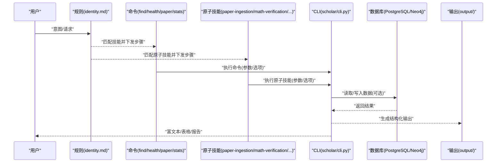

**图示来源**
- [plugin/rules/identity.md:21-34](file://plugin/rules/identity.md#L21-L34)
- [plugin/commands/find.md:3-7](file://plugin/commands/find.md#L3-L7)
- [plugin/commands/health.md:3-10](file://plugin/commands/health.md#L3-L10)
- [plugin/commands/paper.md:6-11](file://plugin/commands/paper.md#L6-L11)
- [plugin/commands/stats.md:3-7](file://plugin/commands/stats.md#L3-L7)
- [plugin/skills/paper-ingestion/SKILL.md:6-8](file://plugin/skills/paper-ingestion/SKILL.md#L6-L8)
- [plugin/skills/math-verification/SKILL.md:6-8](file://plugin/skills/math-verification/SKILL.md#L6-L8)
- [scholar/cli.py:32-41](file://scholar/cli.py#L32-L41)

## 详细组件分析

### find 技能
- 功能：在知识库中进行全文搜索与语义搜索，合并去重并按相关度排序展示前若干篇论文。
- 输入：
  - 关键词字符串（全文搜索）
  - 可选混合检索标志（语义搜索）
- 输出：
  - 论文列表（ID、标题、年份、质量等级、关键匹配段落）
- 参数配置：
  - limit：结果上限（默认20）
- 错误处理：
  - 无结果时提示"未找到"
  - 数据库不可用时回退至文件系统搜索
- 协作关系：
  - 与paper、stats等技能配合，先检索再精读与统计


**图示来源**
- [plugin/commands/find.md:3-7](file://plugin/commands/find.md#L3-L7)
- [scholar/cli.py:308-370](file://scholar/cli.py#L308-L370)

**章节来源**
- [plugin/commands/find.md:1-7](file://plugin/commands/find.md#L1-L7)
- [scholar/cli.py:308-370](file://scholar/cli.py#L308-L370)

### health 技能
- 功能：检查知识库健康状态，识别数据完整性问题。
- 执行步骤：
  - 运行stats检查元数据覆盖率
  - 检查PG数据一致性（papers vs sections vs citations数量）
  - 检查Neo4j连通性与节点/边数量
  - 检查RAG chunks数量是否为0（未索引）
  - 列出缺年份、缺作者、未评分、未分类的论文数
  - 给出修复建议（如year-fix、quality-score --all等）
- 输入：无显式参数
- 输出：健康检查报告与修复建议清单
- 错误处理：
  - 数据库不可用时提示"文件模式"
  - Neo4j未启动时提示启动命令
- 协作关系：
  - 与paper、stats、kb-management等技能联动，形成闭环维护

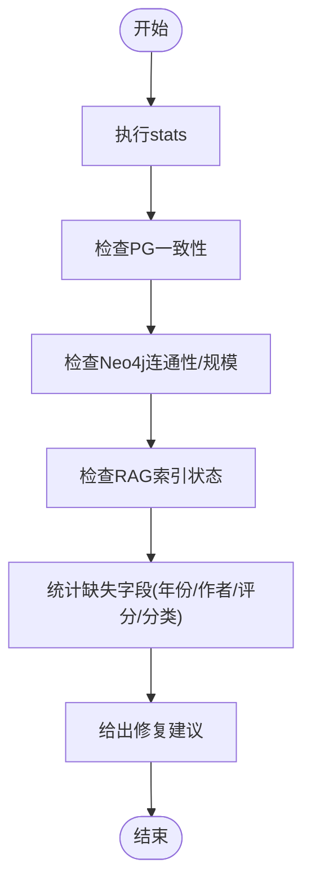

**图示来源**
- [plugin/commands/health.md:3-10](file://plugin/commands/health.md#L3-L10)
- [scholar/cli.py:418-487](file://scholar/cli.py#L418-L487)

**章节来源**
- [plugin/commands/health.md:1-10](file://plugin/commands/health.md#L1-L10)
- [scholar/cli.py:418-487](file://scholar/cli.py#L418-L487)

### paper 技能
- 功能：查看某篇论文的详细信息，包括元数据、关键概念、引用关系与质量评分。
- 输入：
  - 论文ID（支持ULID、arXiv ID、DOI、关键词）
- 输出：
  - 基础信息（标题、作者、年份、会议等）
  - 质量评分（若存在）
  - 阅读笔记摘要（若存在）
  - 引用关系（前向+后向各若干篇）
- 错误处理：
  - 未解析时提示先执行parse
  - ID解析失败时提示无效ID
- 协作关系：
  - 与find、stats、cite-network等技能配合，先检索再精读与分析

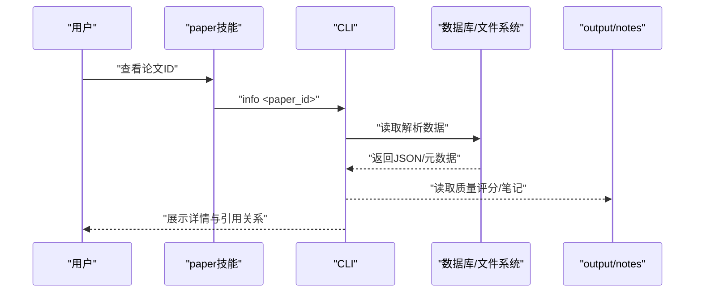

**图示来源**
- [plugin/commands/paper.md:6-11](file://plugin/commands/paper.md#L6-L11)
- [scholar/cli.py:240-307](file://scholar/cli.py#L240-L307)

**章节来源**
- [plugin/commands/paper.md:1-11](file://plugin/commands/paper.md#L1-L11)
- [scholar/cli.py:240-307](file://scholar/cli.py#L240-L307)

### stats 技能
- 功能：快速查看知识库当前状态，包括论文数量、图谱规模、RAG覆盖率等。
- 执行步骤：
  - 运行stats获取基础统计
  - 运行graph-stats获取图谱统计
  - 以简洁表格汇总各数据层覆盖率与数量
- 输入：year过滤（可选）
- 输出：统计面板与按年/会议聚合信息
- 错误处理：
  - 数据库不可用时提示"文件模式"
- 协作关系：
  - 与health、paper、citation-network等技能配合，形成数据洞察闭环


**图示来源**
- [plugin/commands/stats.md:3-7](file://plugin/commands/stats.md#L3-L7)
- [scholar/cli.py:418-487](file://scholar/cli.py#L418-L487)

**章节来源**
- [plugin/commands/stats.md:1-7](file://plugin/commands/stats.md#L1-L7)
- [scholar/cli.py:418-487](file://scholar/cli.py#L418-L487)

### paper-ingestion 技能
- 功能：扫描、解析并导入论文到知识库，完成从原始论文到结构化数据的完整转换。
- 执行步骤：
  - 扫描论文目录，查看解析状态
  - 批量解析未解析论文，提取标题、作者、年份、摘要、章节、公式、引用
  - 处理解析失败，诊断常见问题
  - 补全缺失元数据（年份、作者）
  - 批量预处理（生成阅读笔记、质量评分、分类标签）
  - 检查统计，确认入库数量和覆盖率
  - 单篇验证解析质量
- 输入：论文目录路径或论文ID
- 输出：解析后的JSON数据、阅读笔记、质量评分、分类标签
- 错误处理：
  - 缺少TeX源码时使用PDF提取元数据
  - TeX格式特殊时手动调整解析策略
  - 解析失败时标记为人工处理
- 协作关系：
  - 为所有后续技能提供结构化的论文数据基础

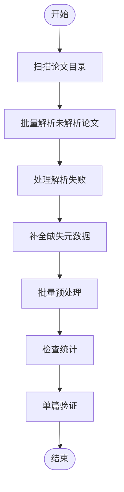

**图示来源**
- [plugin/skills/paper-ingestion/SKILL.md:11-63](file://plugin/skills/paper-ingestion/SKILL.md#L11-L63)

**章节来源**
- [plugin/skills/paper-ingestion/SKILL.md:1-85](file://plugin/skills/paper-ingestion/SKILL.md#L1-L85)

### math-verification 技能
- 功能：使用Lean4进行数学证明验证，确保论文中的数学定理和推导正确性。
- 执行步骤：
  - 从论文解析结果中提取数学公式和定理陈述
  - 在Lean4环境中构建形式化证明框架
  - 验证推导逻辑的正确性和完整性
  - 生成验证报告和错误定位
- 输入：论文ID或具体的数学公式
- 输出：形式化证明结果、验证报告、错误定位
- 错误处理：
  - 公式解析失败时提示格式问题
  - Lean4证明失败时提供可能的修复方案
  - 依赖库不可用时提示安装指南
- 协作关系：
  - 与paper-deep-dive配合，对关键论文进行数学层面的深度验证

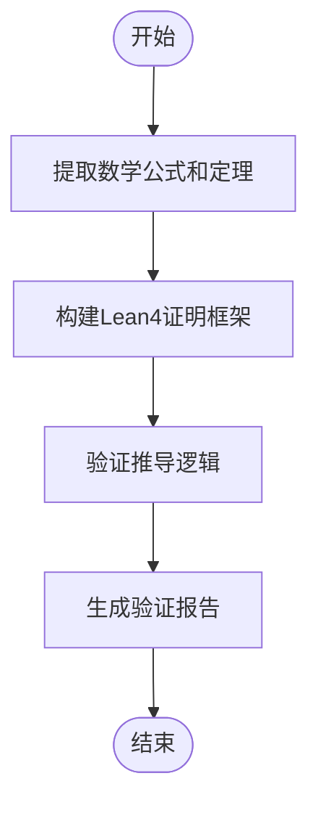

**图示来源**
- [plugin/skills/math-verification/SKILL.md:10-40](file://plugin/skills/math-verification/SKILL.md#L10-L40)

**章节来源**
- [plugin/skills/math-verification/SKILL.md:1-100](file://plugin/skills/math-verification/SKILL.md#L1-L100)

### paper-recommendation 技能
- 功能：基于引用网络和相似度分析为用户推荐相关论文。
- 执行步骤：
  - 分析用户历史阅读和偏好
  - 基于引用网络计算论文相似度
  - 考虑研究主题、发表年份、期刊影响力等因素
  - 生成个性化推荐列表
- 输入：用户ID或当前阅读的论文ID
- 输出：推荐论文列表及推荐理由
- 错误处理：
  - 用户无历史记录时提供基于流行度的推荐
  - 引用网络不完整时使用其他特征进行推荐
- 协作关系：
  - 与citation-network配合，利用引用关系进行推荐
  - 与research-gap配合，发现潜在的交叉领域论文

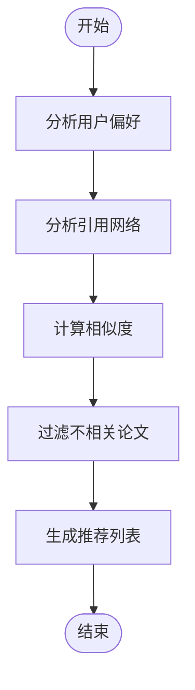

**图示来源**
- [plugin/skills/paper-recommendation/SKILL.md:15-45](file://plugin/skills/paper-recommendation/SKILL.md#L15-L45)

**章节来源**
- [plugin/skills/paper-recommendation/SKILL.md:1-120](file://plugin/skills/paper-recommendation/SKILL.md#L1-L120)

### citation-network 技能
- 功能：分析引用网络，识别关键论文和桥接节点，构建领域发展脉络。
- 执行步骤：
  - 获取引用网络的全局概览（节点数、边数、孤立节点数）
  - 分析单篇论文的前后向引用关系
  - 识别高入度、高出度、桥接论文等关键节点
  - 构建领域发展时间线
- 输入：论文ID或领域关键词
- 输出：网络统计报告、关键论文列表、时间线分析
- 错误处理：
  - Neo4j未启动时使用citations字段手动分析
  - 引用解析覆盖率不足时提示补充数据
- 协作关系：
  - 为research-gap提供网络结构分析基础
  - 为paper-deep-dive提供关键论文发现支持

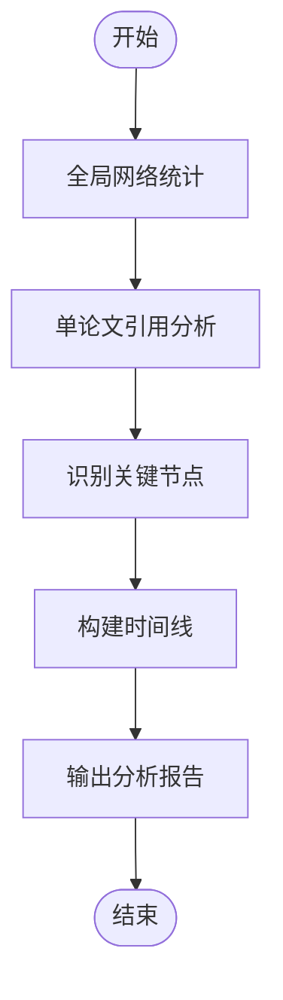

**图示来源**
- [plugin/skills/citation-network/SKILL.md:15-62](file://plugin/skills/citation-network/SKILL.md#L15-L62)

**章节来源**
- [plugin/skills/citation-network/SKILL.md:1-101](file://plugin/skills/citation-network/SKILL.md#L1-L101)

### research-gap 技能
- 功能：跨论文研究空白发现，识别引用网络中的断裂带和新兴交叉领域。
- 执行步骤：
  - 分析引用网络的连通性，识别断裂区域
  - 检查概念共现模式，发现潜在的交叉领域
  - 评估研究热点的演进趋势
  - 生成研究空白报告和建议
- 输入：领域关键词或论文集合
- 输出：研究空白列表、交叉领域建议、未来发展方向
- 错误处理：
  - 网络密度不足时降低检测阈值
  - 概念解析不完整时提供启发式建议
- 协作关系：
  - 与citation-network深度配合，利用网络结构发现空白
  - 为idea-to-paper提供创新点子挖掘支持

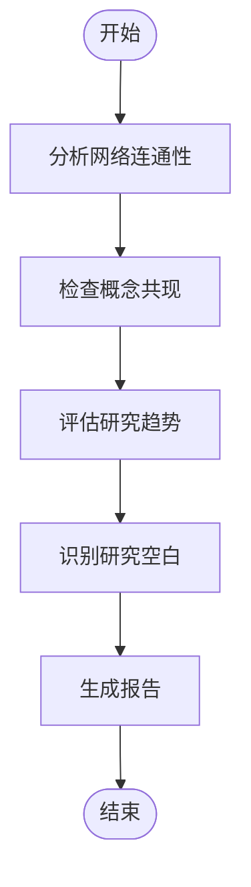

**图示来源**
- [plugin/skills/research-gap/SKILL.md:25-55](file://plugin/skills/research-gap/SKILL.md#L25-L55)

**章节来源**
- [plugin/skills/research-gap/SKILL.md:1-150](file://plugin/skills/research-gap/SKILL.md#L1-L150)

### review-report 技能
- 功能：生成结构化的同行评审报告，提供论文质量评估和改进建议。
- 执行步骤：
  - 分析论文的学术贡献和创新性
  - 评估方法论的严谨性和可重复性
  - 检查实验结果的可靠性和统计显著性
  - 生成详细的评审意见和评分
- 输入：论文ID或评审要求
- 输出：评审报告、评分矩阵、改进建议
- 错误处理：
  - 缺少评审标准时提供通用模板
  - 质量数据不足时提示补充信息
- 协作关系：
  - 与paper-deep-dive配合，基于深度分析生成评审
  - 为writing-pipeline提供反馈改进

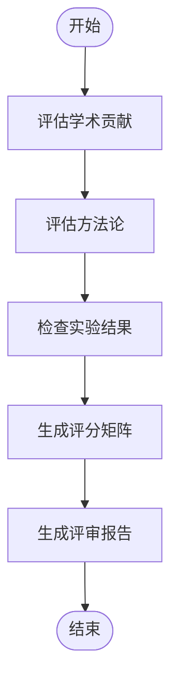

**图示来源**
- [plugin/skills/review-report/SKILL.md:25-55](file://plugin/skills/review-report/SKILL.md#L25-L55)

**章节来源**
- [plugin/skills/review-report/SKILL.md:1-130](file://plugin/skills/review-report/SKILL.md#L1-L130)

### cold-start 技能
- 功能：为陌生研究领域构建知识地图和学习路径，帮助用户快速入门。
- 执行步骤：
  - 评估本地知识库覆盖情况
  - 基于本地库或arXiv进行混合冷启动
  - 构建概念知识地图和核心论文列表
  - 生成学习路径和推荐阅读顺序
- 输入：目标研究方向或用户背景
- 输出：冷启动指南、学习路径、核心论文列表
- 错误处理：
  - 本地库覆盖不足时建议下载论文
  - 概念图谱不完整时提供启发式连接
- 协作关系：
  - 为research-survey提供基础准备
  - 为paper-deep-dive提供学习指导

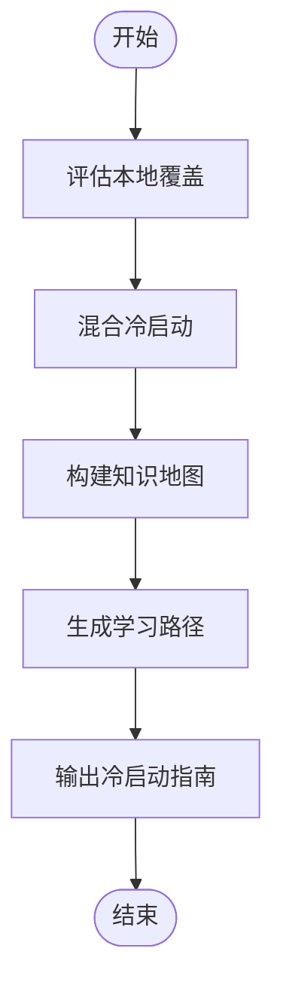

**图示来源**
- [plugin/skills/cold-start/SKILL.md:11-84](file://plugin/skills/cold-start/SKILL.md#L11-L84)

**章节来源**
- [plugin/skills/cold-start/SKILL.md:1-147](file://plugin/skills/cold-start/SKILL.md#L1-L147)

### experiment-code 技能
- 功能：根据论文方法与公式生成PyTorch实验代码，支持实验复现。
- 执行步骤：
  - 深度阅读论文方法，提取算法要素
  - 确定技术栈和运行环境
  - 生成代码结构和逐步实现
  - 验证代码正确性和性能
- 输入：论文ID或具体方法描述
- 输出：实验代码包、运行说明、验证报告
- 错误处理：
  - 方法描述歧义时选择合理解释
  - 依赖特定硬件时说明限制条件
- 协作关系：
  - 为reproduce-paper提供代码基础
  - 与paper-deep-dive配合确认实现细节

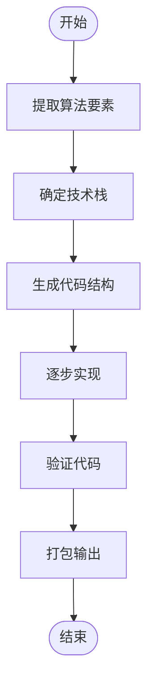

**图示来源**
- [plugin/skills/experiment-code/SKILL.md:11-70](file://plugin/skills/experiment-code/SKILL.md#L11-L70)

**章节来源**
- [plugin/skills/experiment-code/SKILL.md:1-111](file://plugin/skills/experiment-code/SKILL.md#L1-L111)

### identity 规则技能
- 功能：定义Agent的角色、心智模型、工作模式与核心约束，确保技能执行符合数据驱动与增量操作原则。
- 工作模式：
  - Skill执行模式：读取SKILL.md，创建TodoWrite，逐步执行并输出到output/子目录
  - 基础设施模式：新增CLI/工具时同步更新tools.md与MCP服务
- 核心约束：
  - 数据驱动：所有学术声明必须有JSON数据支撑
  - 引用准确：使用paper_id格式，验证存在于知识库
  - 绝不编造：不编造论文、引用、作者、年份或实验结果
  - 增量操作：批量处理逐条处理，报告进度，单条失败不阻塞整批
- 协作关系：
  - 为所有原子技能与工作流提供统一的执行范式与质量保障

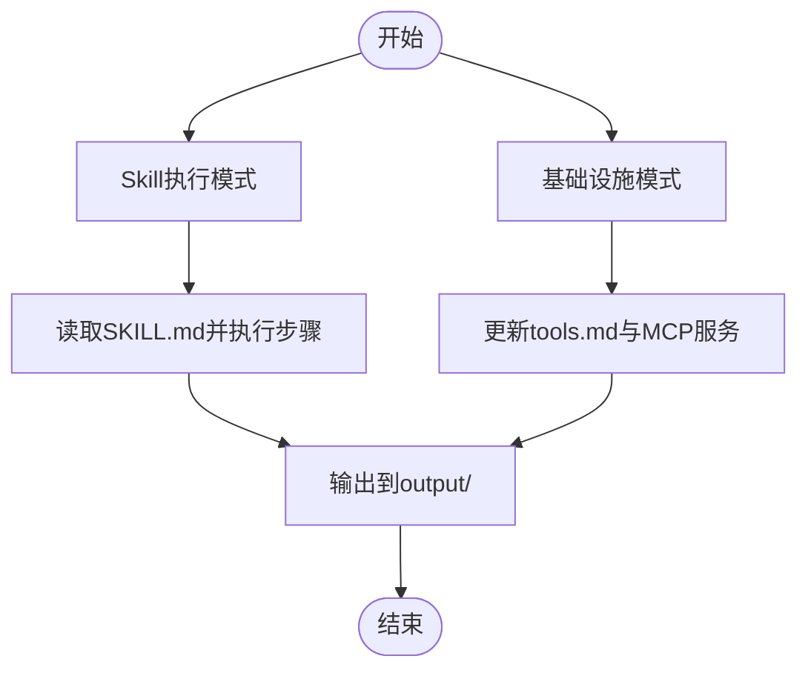

**图示来源**
- [plugin/rules/identity.md:21-52](file://plugin/rules/identity.md#L21-L52)

**章节来源**
- [plugin/rules/identity.md:1-69](file://plugin/rules/identity.md#L1-L69)

## 依赖分析
原子技能与CLI、工作流之间的依赖关系如下：

```mermaid
graph LR
subgraph "原子技能"
F["find"]
H["health"]
P["paper"]
S["stats"]
PI["paper-ingestion"]
MV["math-verification"]
PR["paper-recommendation"]
CN["citation-network"]
RG["research-gap"]
RR["review-report"]
CS["cold-start"]
EC["experiment-code"]
end
subgraph "CLI"
CLI["scholar/cli.py"]
end
subgraph "工作流"
KM["kb-management"]
RP["reproduce-paper"]
ITP["idea-to-paper"]
WP["writing-pipeline"]
PDD["paper-deep-dive"]
end
F --> CLI
H --> CLI
P --> CLI
S --> CLI
PI --> CLI
MV --> CLI
PR --> CLI
CN --> CLI
RG --> CLI
RR --> CLI
CS --> CLI
EC --> CLI
CLI --> KM
CLI --> RP
CLI --> ITP
CLI --> WP
CLI --> PDD
```

**图示来源**
- [plugin/commands/find.md:3-7](file://plugin/commands/find.md#L3-L7)
- [plugin/commands/health.md:3-10](file://plugin/commands/health.md#L3-L10)
- [plugin/commands/paper.md:6-11](file://plugin/commands/paper.md#L6-L11)
- [plugin/commands/stats.md:3-7](file://plugin/commands/stats.md#L3-L7)
- [plugin/skills/paper-ingestion/SKILL.md:12-49](file://plugin/skills/paper-ingestion/SKILL.md#L12-L49)
- [plugin/skills/math-verification/SKILL.md:12-44](file://plugin/skills/math-verification/SKILL.md#L12-L44)
- [plugin/skills/paper-recommendation/SKILL.md:18-45](file://plugin/skills/paper-recommendation/SKILL.md#L18-L45)
- [plugin/skills/citation-network/SKILL.md:16-45](file://plugin/skills/citation-network/SKILL.md#L16-L45)
- [plugin/skills/research-gap/SKILL.md:28-58](file://plugin/skills/research-gap/SKILL.md#L28-L58)
- [plugin/skills/review-report/SKILL.md:30-55](file://plugin/skills/review-report/SKILL.md#L30-L55)
- [plugin/skills/cold-start/SKILL.md:29-66](file://plugin/skills/cold-start/SKILL.md#L29-L66)
- [plugin/skills/experiment-code/SKILL.md:13-63](file://plugin/skills/experiment-code/SKILL.md#L13-L63)
- [scholar/cli.py:32-41](file://scholar/cli.py#L32-L41)

**章节来源**
- [plugin/commands/find.md:1-7](file://plugin/commands/find.md#L1-L7)
- [plugin/commands/health.md:1-10](file://plugin/commands/health.md#L1-L10)
- [plugin/commands/paper.md:1-11](file://plugin/commands/paper.md#L1-L11)
- [plugin/commands/stats.md:1-7](file://plugin/commands/stats.md#L1-L7)
- [plugin/skills/paper-ingestion/SKILL.md:1-85](file://plugin/skills/paper-ingestion/SKILL.md#L1-L85)
- [plugin/skills/math-verification/SKILL.md:1-100](file://plugin/skills/math-verification/SKILL.md#L1-L100)
- [plugin/skills/paper-recommendation/SKILL.md:1-120](file://plugin/skills/paper-recommendation/SKILL.md#L1-L120)
- [plugin/skills/citation-network/SKILL.md:1-101](file://plugin/skills/citation-network/SKILL.md#L1-L101)
- [plugin/skills/research-gap/SKILL.md:1-150](file://plugin/skills/research-gap/SKILL.md#L1-L150)
- [plugin/skills/review-report/SKILL.md:1-130](file://plugin/skills/review-report/SKILL.md#L1-L130)
- [plugin/skills/cold-start/SKILL.md:1-147](file://plugin/skills/cold-start/SKILL.md#L1-L147)
- [plugin/skills/experiment-code/SKILL.md:1-111](file://plugin/skills/experiment-code/SKILL.md#L1-L111)
- [scholar/cli.py:32-41](file://scholar/cli.py#L32-L41)

## 性能考虑
- 搜索性能：全文搜索在数据库可用时优先走数据库查询；否则回退至文件系统遍历，注意limit控制结果数量。
- 图谱查询：Neo4j查询需关注节点/边规模与索引状态，必要时先执行graph-build与graph-stats。
- 批处理：parse-all等批处理命令采用进度条与分片处理，建议设置limit与force参数以控制资源占用。
- I/O优化：输出到output/子目录，避免重复计算；缓存解析结果与质量评分。
- 数学验证：Lean4证明验证可能耗时较长，建议分批处理复杂证明。
- 代码生成：实验代码生成涉及大量文件操作，注意磁盘空间和I/O性能。

## 故障排除指南
- 数据库不可用：
  - 现象：stats显示"not available (file-only mode)"，graph-build提示Neo4j不可用
  - 处理：启动Docker容器或安装相应驱动；确认连接配置
- 未解析论文：
  - 现象：info提示"Paper not parsed yet"
  - 处理：先执行parse或scan定位未解析论文并批量解析
- ID解析失败：
  - 现象：paper、paper-deep-dive等技能提示无效ID
  - 处理：确认ID格式（ULID/arXiv/DOI/slug），或先执行search定位
- Neo4j未启动：
  - 现象：graph-build/graph-stats报错
  - 处理：执行docker compose启动neo4j，或使用citations字段手动分析
- Lean4证明失败：
  - 现象：math-verification生成验证失败
  - 处理：检查公式格式，简化证明目标，或手动验证
- 代码生成异常：
  - 现象：experiment-code生成的代码无法运行
  - 处理：检查论文方法描述的准确性，确认依赖库版本

**章节来源**
- [scholar/cli.py:32-41](file://scholar/cli.py#L32-L41)
- [scholar/cli.py:660-706](file://scholar/cli.py#L660-L706)
- [plugin/commands/health.md:3-10](file://plugin/commands/health.md#L3-L10)
- [plugin/skills/math-verification/SKILL.md:15-40](file://plugin/skills/math-verification/SKILL.md#L15-L40)
- [plugin/skills/experiment-code/SKILL.md:65-70](file://plugin/skills/experiment-code/SKILL.md#L65-L70)

## 结论
原子技能以统一的CLI接口与规则约束为基础，围绕知识库的检索、健康检查、信息展示、统计分析和研究支持形成完整的闭环。通过14个原子技能与6个工作流的组合，可实现从论文入库、知识地图构建、引用网络分析到实验复现、论文写作的全链条研究流程。建议在日常使用中遵循identity规则的约束，优先使用CLI命令与工具，确保数据驱动与增量操作，提升研究效率与质量。

## 附录
- 实际使用示例（路径指引）：
  - 论文入库流程：paper-ingestion → kb-management → stats
  - 研究入门：cold-start → research-survey → paper-deep-dive
  - 引用网络分析：stats → citation-network → research-gap
  - 实验复现：experiment-code → reproduce-paper → paper-deep-dive
  - 数学验证：paper-deep-dive → math-verification
  - 论文推荐：paper-recommendation → paper-deep-dive
  - 学术写作：writing-pipeline → review-report
- 最佳实践：
  - 先paper-ingestion后其他技能，确保数据完整性
  - 定期执行health与stats，保持知识库健康
  - 使用graph-build与graph-stats优化引用网络质量
  - 严格遵循identity规则，杜绝编造数据
  - 利用next steps进行技能间的自然流转