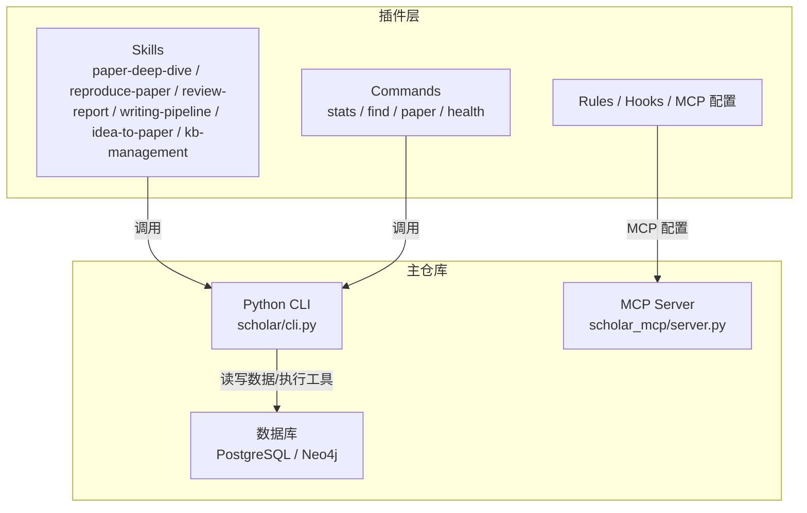
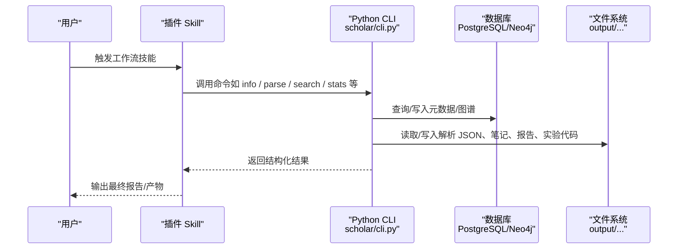
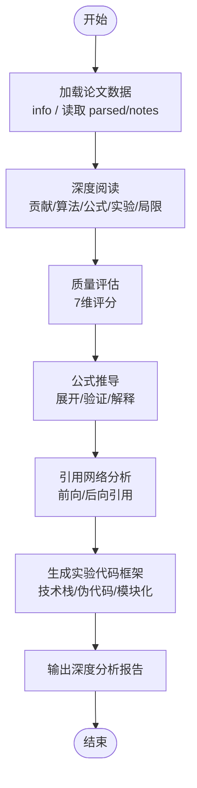
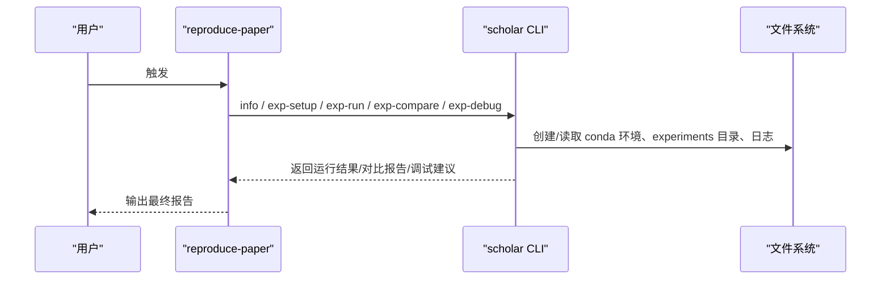
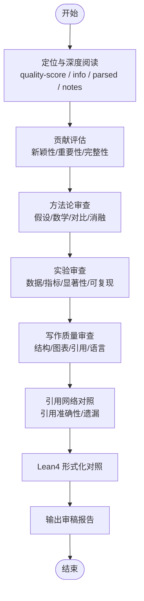
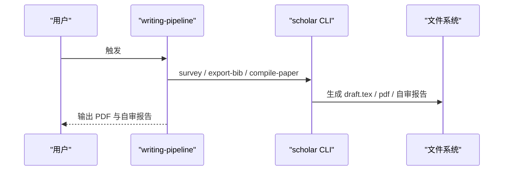
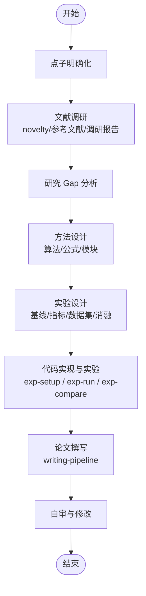
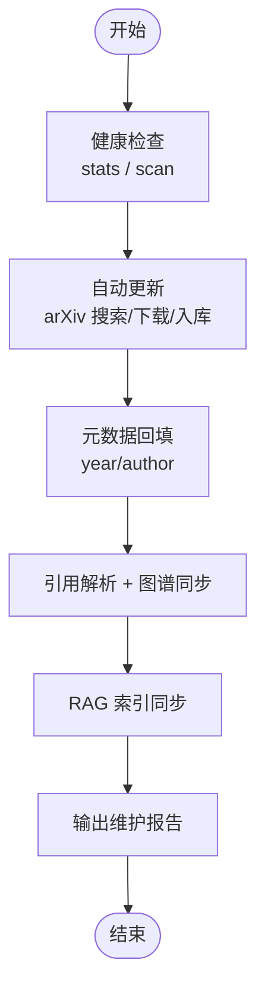
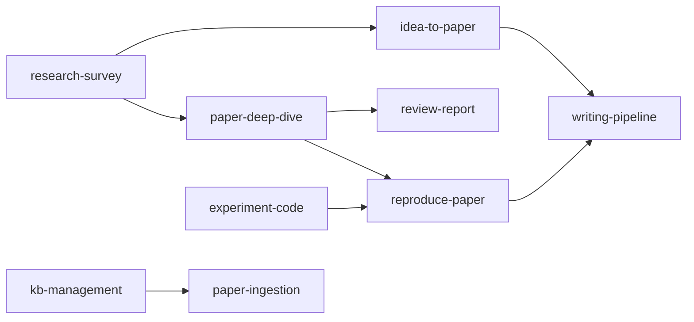

# 工作流技能实现

<cite>
**本文档引用的文件**
- [plugin/README.md](file://plugin/README.md)
- [plugin/mcp.json](file://plugin/mcp.json)
- [plugin/skills/paper-deep-dive/SKILL.md](file://plugin/skills/paper-deep-dive/SKILL.md)
- [plugin/skills/reproduce-paper/SKILL.md](file://plugin/skills/reproduce-paper/SKILL.md)
- [plugin/skills/review-report/SKILL.md](file://plugin/skills/review-report/SKILL.md)
- [plugin/skills/paper-ingestion/SKILL.md](file://plugin/skills/paper-ingestion/SKILL.md)
- [plugin/skills/kb-management/SKILL.md](file://plugin/skills/kb-management/SKILL.md)
- [plugin/skills/experiment-code/SKILL.md](file://plugin/skills/experiment-code/SKILL.md)
- [plugin/skills/research-survey/SKILL.md](file://plugin/skills/research-survey/SKILL.md)
- [plugin/skills/research-gap/SKILL.md](file://plugin/skills/research-gap/SKILL.md)
- [plugin/skills/idea-to-paper/SKILL.md](file://plugin/skills/idea-to-paper/SKILL.md)
- [plugin/skills/writing-pipeline/SKILL.md](file://plugin/skills/writing-pipeline/SKILL.md)
- [plugin/skills/cold-start/SKILL.md](file://plugin/skills/cold-start/SKILL.md)
- [plugin/skills/math-verification/SKILL.md](file://plugin/skills/math-verification/SKILL.md)
- [scholar/__main__.py](file://scholar/__main__.py)
- [scholar/cli.py](file://scholar/cli.py)
</cite>

## 目录
1. [简介](#简介)
2. [项目结构](#项目结构)
3. [核心组件](#核心组件)
4. [架构总览](#架构总览)
5. [详细组件分析](#详细组件分析)
6. [依赖分析](#依赖分析)
7. [性能考虑](#性能考虑)
8. [故障排查指南](#故障排查指南)
9. [结论](#结论)
10. [附录](#附录)

## 简介
本文件系统化梳理 Scholar Studio 插件中的 6 个工作流技能：paper-deep-dive、reproduce-paper、review-report、writing-pipeline、idea-to-paper、kb-management。文档覆盖每个工作流的设计理念、执行流程、状态管理、中间结果处理、配置选项与参数调优、结果输出格式、与其他技能的集成关系，以及扩展与定制建议，并提供典型应用场景与使用案例。

## 项目结构
- 插件层提供 14 个技能（其中 6 个为工作流）与 MCP 集成配置，负责“告诉 AI 做什么、怎么做”
- 主仓库提供 Python 后端（CLI、MCP Server）与数据库基础设施，负责“真正执行搜索、解析、检索、图谱构建等任务”

**图示来源**
- [plugin/README.md:1-79](file://plugin/README.md#L1-L79)
- [plugin/mcp.json:1-16](file://plugin/mcp.json#L1-L16)
- [scholar/__main__.py:1-8](file://scholar/__main__.py#L1-L8)

**章节来源**
- [plugin/README.md:1-79](file://plugin/README.md#L1-L79)
- [plugin/mcp.json:1-16](file://plugin/mcp.json#L1-L16)
- [scholar/__main__.py:1-8](file://scholar/__main__.py#L1-L8)

## 核心组件
- 工作流技能（6 个）
  - paper-deep-dive：单篇论文的精读、质量评估、公式推导、引用网络、实验代码生成与深度报告
  - reproduce-paper：端到端实验复现（环境配置→代码生成→运行→结果对比→调试）
  - review-report：结构化同行评审报告（贡献评估、方法论审查、实验审查、写作质量审查、引用网络对照、Lean4 形式化对照）
  - writing-pipeline：端到端学术写作（调研→撰写→编译→自审）
  - idea-to-paper：从研究点子到完整论文（调研→gap分析→方法设计→实验→论文撰写→自审）
  - kb-management：知识库维护与自动更新（健康检查→自动更新→元数据回填→图谱同步→RAG 索引）
- 原子技能（8 个）与工作流协同：paper-ingestion、experiment-code、research-survey、research-gap、cold-start、math-verification、citation-network、paper-recommendation

**章节来源**
- [plugin/README.md:60-79](file://plugin/README.md#L60-L79)

## 架构总览
工作流技能通过插件层的指令触发，调用主仓库的 Python CLI 与 MCP Server，访问 PostgreSQL 与 Neo4j 等持久化存储，形成“意图→工具调用→数据读写→产物输出”的闭环。

**图示来源**
- [plugin/README.md:1-79](file://plugin/README.md#L1-L79)
- [scholar/cli.py:1-800](file://scholar/cli.py#L1-L800)

## 详细组件分析

### paper-deep-dive 工作流
- 设计理念
  - 以“单篇论文为中心”的深度分析流水线，串联精读、质量评估、公式推导、引用网络与实验代码生成，最终产出结构化深度报告
- 执行流程
  - 步骤 1：加载论文数据（支持多种 ID，读取预生成 JSON/笔记）
  - 步骤 2：深度阅读（提取核心贡献、关键算法/公式、实验设计、局限性）
  - 步骤 3：质量评估（7 维评分）
  - 步骤 4：公式推导（展开省略步骤、验证正确性、解释含义）
  - 步骤 5：引用网络分析（前向/后向引用）
  - 步骤 6：生成实验代码框架（确定技术栈、提取伪代码、模块化文件、输出到 experiments 目录）
  - 步骤 7：输出深度分析报告（整合上述分析）
- 状态管理
  - 依赖预生成数据（parsed/notes），若缺失则先执行相应原子技能
- 中间结果处理
  - parsed JSON、notes、quality 评分、cite-network 结果、experiments 代码框架
- 配置与参数调优
  - ID 支持 Hybrid（ULID/arXiv/DOI/slug）
  - 公式推导与代码生成可结合用户偏好（框架、库、硬件）
- 结果输出格式
  - 结构化 Markdown 报告（深度分析报告）
- 与其他技能集成
  - 前置：paper-ingestion（入库）、research-survey（领域背景）
  - 后续：writing-pipeline（基于分析撰写论文）、reproduce-paper（复现实验）

**图示来源**
- [plugin/skills/paper-deep-dive/SKILL.md:1-58](file://plugin/skills/paper-deep-dive/SKILL.md#L1-L58)

**章节来源**
- [plugin/skills/paper-deep-dive/SKILL.md:1-58](file://plugin/skills/paper-deep-dive/SKILL.md#L1-L58)

### reproduce-paper 工作流
- 设计理念
  - 端到端复现实验，强调可重复性与可调试性，覆盖环境配置、代码生成、数据准备、运行与对比
- 执行流程
  - 步骤 1：深度阅读（提取算法/实验设置/超参数/数据集）
  - 步骤 2：配置运行环境（自动检测依赖、创建 conda 环境）
  - 步骤 3：生成实验代码（主训练脚本、模型定义、数据加载、评估脚本、配置文件）
  - 步骤 4：下载数据集（自动检测 HuggingFace）
  - 步骤 5：运行实验（quick/full 模式、超时保护）
  - 步骤 6：对比结果（metrics 对比、生成对比报告）
  - 步骤 7：调试失败（常见错误诊断与修复建议）
- 状态管理
  - 依赖 parsed/notes/quality 与 experiments 目录
- 中间结果处理
  - 环境配置日志、实验运行日志、对比报告、调试建议
- 配置与参数调优
  - 运行模式（quick/full）、超时阈值、依赖安装策略
- 结果输出格式
  - 对比报告、调试建议、实验产物
- 与其他技能集成
  - 前置：paper-deep-dive（深度分析）、experiment-code（代码生成）
  - 后续：writing-pipeline（将复现结果写入论文）、paper-deep-dive（进一步理论分析）

**图示来源**
- [plugin/skills/reproduce-paper/SKILL.md:1-69](file://plugin/skills/reproduce-paper/SKILL.md#L1-L69)

**章节来源**
- [plugin/skills/reproduce-paper/SKILL.md:1-69](file://plugin/skills/reproduce-paper/SKILL.md#L1-L69)

### review-report 工作流
- 设计理念
  - 结构化同行评审，涵盖贡献评估、方法论审查、实验审查、写作质量审查、引用网络对照与 Lean4 形式化对照
- 执行流程
  - 步骤 1：定位并深度阅读（读取 quality-score、info、parsed JSON、notes）
  - 步骤 2：评估论文贡献（新颖性、重要性、完整性）
  - 步骤 3：方法论审查（假设合理性、数学正确性、对比公平性、消融实验）
  - 步骤 4：实验审查（数据集、指标、显著性、可复现性）
  - 步骤 5：写作质量审查（结构、图表、引用、语言）
  - 步骤 6：对照引用网络（引用准确性、遗漏的前置工作）
  - 步骤 7：Lean4 形式化对照（如适用）
  - 步骤 8：输出审稿报告（结构化 Markdown）
- 状态管理
  - 依赖 parsed/notes/quality 与 cite-network
- 中间结果处理
  - 各维度评分、引用网络图谱、形式化对照结果
- 配置与参数调优
  - 审稿维度权重与建议（由评审者主观判断）
- 结果输出格式
  - 结构化审稿报告（Strengths/Weaknesses/Questions/Recommendation/Overall）
- 与其他技能集成
  - 前置：paper-deep-dive（公式推导与形式化对照）
  - 后续：paper-deep-dive（对引用论文精读）、export-bib（导出参考文献）

**图示来源**
- [plugin/skills/review-report/SKILL.md:1-116](file://plugin/skills/review-report/SKILL.md#L1-L116)

**章节来源**
- [plugin/skills/review-report/SKILL.md:1-116](file://plugin/skills/review-report/SKILL.md#L1-L116)

### writing-pipeline 工作流
- 设计理念
  - 端到端学术写作，从主题调研到论文撰写、LaTeX 编译、自审报告，形成完整产出
- 执行流程
  - 步骤 1：主题调研（双路搜索、arXiv 补充、生成调研报告）
  - 步骤 2：阅读关键论文笔记（Grade A/B 优先）
  - 步骤 3：撰写 Related Work（分类、时间线、BibTeX 导出）
  - 步骤 4：撰写完整论文（Abstract/Introduction/Related Work/Method/Experiments/Conclusion）
  - 步骤 5：LaTeX 编译（自动修复、重试机制、输出 PDF）
  - 步骤 6：自审报告（逻辑/引用/格式）
- 状态管理
  - 依赖调研报告、notes、drafts/pdf 目录
- 中间结果处理
  - 调研报告、LaTeX 源文件、PDF、自审报告
- 配置与参数调优
  - 搜索深度、限制条数、编译重试次数
- 结果输出格式
  - LaTeX 源文件、PDF、自审报告
- 与其他技能集成
  - 前置：research-survey（调研）、paper-deep-dive（引用论文分析）
  - 后续：reproduce-paper（复现实验）、paper-deep-dive（引用论文深度分析）

**图示来源**
- [plugin/skills/writing-pipeline/SKILL.md:1-61](file://plugin/skills/writing-pipeline/SKILL.md#L1-L61)

**章节来源**
- [plugin/skills/writing-pipeline/SKILL.md:1-61](file://plugin/skills/writing-pipeline/SKILL.md#L1-L61)

### idea-to-paper 工作流
- 设计理念
  - 从研究点子到完整论文的端到端流程，强调“调研→写作→复现→成文”的闭环
- 执行流程
  - 步骤 1：点子明确化（创新点、问题、预期贡献、目标期刊）
  - 步骤 2：文献调研（novelty 确认、关键参考文献、调研报告）
  - 步骤 3：研究 Gap 分析（已有方法局限、优势、对比基线）
  - 步骤 4：方法设计（算法框架、公式推导、关键模块）
  - 步骤 5：实验设计（基线、指标、数据集、消融实验）
  - 步骤 6：代码实现与实验（环境配置、快速验证、对比）
  - 步骤 7：论文撰写（自动触发 writing-pipeline）
  - 步骤 8：自审与修改（逻辑、结果、引用、修改建议）
- 状态管理
  - 依赖调研报告、实验代码与论文草稿
- 中间结果处理
  - 调研报告、实验对比、论文草稿、自审报告
- 配置与参数调优
  - 调研深度、实验模式（quick/full）、对比指标
- 结果输出格式
  - 论文草稿、PDF、自审报告
- 与其他技能集成
  - 前置：research-survey、research-gap、experiment-code
  - 后续：writing-pipeline、reproduce-paper、paper-deep-dive

**图示来源**
- [plugin/skills/idea-to-paper/SKILL.md:1-75](file://plugin/skills/idea-to-paper/SKILL.md#L1-L75)

**章节来源**
- [plugin/skills/idea-to-paper/SKILL.md:1-75](file://plugin/skills/idea-to-paper/SKILL.md#L1-L75)

### kb-management 工作流
- 设计理念
  - 知识库维护与自动更新，确保数据完整性、一致性与新鲜度
- 执行流程
  - 步骤 1：知识库健康检查（stats/scan）
  - 步骤 2：自动更新（arXiv 搜索→下载 TeX→批量入库）
  - 步骤 3：元数据回填（arXiv API 标题搜索补全）
  - 步骤 4：补全缺失字段（year/author）
  - 步骤 5：引用解析 + 图谱同步（cite-resolve/graph-build）
  - 步骤 6：RAG 索引同步（rag-index）
  - 步骤 7：输出维护报告
- 状态管理
  - 依赖知识库统计、图谱状态、RAG 索引
- 中间结果处理
  - 健康检查报告、更新日志、图谱同步结果、索引状态
- 配置与参数调优
  - 搜索关键词、最大结果数、应用变更开关
- 结果输出格式
  - 维护报告
- 与其他技能集成
  - 前置：paper-ingestion（增量入库）
  - 后续：research-survey（维护后重新调研）、paper-deep-dive（新入库论文深度分析）

**图示来源**
- [plugin/skills/kb-management/SKILL.md:1-59](file://plugin/skills/kb-management/SKILL.md#L1-L59)

**章节来源**
- [plugin/skills/kb-management/SKILL.md:1-59](file://plugin/skills/kb-management/SKILL.md#L1-L59)

## 依赖分析
- 技能耦合关系
  - paper-deep-dive ↔ reproduce-paper：前者产出代码框架，后者执行复现与对比
  - writing-pipeline ↔ idea-to-paper：前者负责论文撰写，后者负责从点子到论文的端到端推进
  - review-report ↔ paper-deep-dive：前者依赖后者的公式推导与形式化对照
  - kb-management ↔ paper-ingestion：前者维护后者产出的数据
- 外部依赖
  - PostgreSQL/Neo4j：持久化与图谱
  - Docker Compose：数据库与图数据库服务
  - MCP：插件与后端通信
- 潜在循环依赖
  - 技能之间通过“前置/后续”关系串联，未见直接循环依赖

**图示来源**
- [plugin/README.md:60-79](file://plugin/README.md#L60-L79)
- [plugin/skills/paper-deep-dive/SKILL.md:53-58](file://plugin/skills/paper-deep-dive/SKILL.md#L53-L58)
- [plugin/skills/reproduce-paper/SKILL.md:64-69](file://plugin/skills/reproduce-paper/SKILL.md#L64-L69)
- [plugin/skills/review-report/SKILL.md:107-116](file://plugin/skills/review-report/SKILL.md#L107-L116)
- [plugin/skills/kb-management/SKILL.md:55-59](file://plugin/skills/kb-management/SKILL.md#L55-L59)

**章节来源**
- [plugin/README.md:60-79](file://plugin/README.md#L60-L79)

## 性能考虑
- 批量处理与进度可视化：解析、搜索、图谱构建等操作采用进度条与分页显示，避免界面阻塞
- 数据库可用性降级：当数据库不可用时，CLI 自动回退到文件系统模式，保证基本功能可用
- 超时与重试：实验运行设置超时保护，LaTeX 编译支持有限次自动重试
- I/O 优化：中间产物按目录结构组织，便于缓存与增量处理

**章节来源**
- [scholar/cli.py:198-237](file://scholar/cli.py#L198-L237)
- [scholar/cli.py:420-487](file://scholar/cli.py#L420-L487)
- [plugin/skills/writing-pipeline/SKILL.md:42-47](file://plugin/skills/writing-pipeline/SKILL.md#L42-L47)

## 故障排查指南
- 知识库不可用
  - 现象：graph-build、graph-stats、graph-query 等命令报错
  - 处理：确认 Docker Compose 已启动 Neo4j 与 PostgreSQL，或使用文件系统模式
- arXiv 请求失败
  - 现象：arxiv-search 报错
  - 处理：检查网络代理设置，或稍后重试
- 解析失败
  - 现象：parse/parse-all 失败
  - 处理：检查 source.tar.gz/PDF 是否存在，必要时手动调整解析策略
- 实验运行失败
  - 现象：exp-run 超时或报错
  - 处理：使用 exp-debug 诊断常见错误（ModuleNotFoundError、CUDA OOM、FileNotFoundError），按建议修复
- 编译失败
  - 现象：compile-paper 报错
  - 处理：启用自动修复选项，检查缺失包与未定义引用

**章节来源**
- [scholar/cli.py:663-706](file://scholar/cli.py#L663-L706)
- [scholar/cli.py:605-658](file://scholar/cli.py#L605-L658)
- [scholar/cli.py:132-171](file://scholar/cli.py#L132-L171)
- [plugin/skills/reproduce-paper/SKILL.md:57-62](file://plugin/skills/reproduce-paper/SKILL.md#L57-L62)
- [plugin/skills/writing-pipeline/SKILL.md:42-47](file://plugin/skills/writing-pipeline/SKILL.md#L42-L47)

## 结论
6 个工作流技能围绕“论文数据→分析/复现/写作→评审/维护”的闭环展开，既可独立执行，也可组合使用。通过预生成数据与中间产物的标准化输出，工作流具备良好的可扩展性与可定制性。建议在实际使用中：
- 明确前置条件（如 parsed/notes/quality），优先使用已生成数据
- 合理设置参数（运行模式、超时、搜索深度），平衡速度与质量
- 将工作流产物纳入后续技能，形成持续迭代的知识生产链路

## 附录
- 使用场景与案例
  - 学术评审：使用 review-report 生成结构化审稿意见，结合 paper-deep-dive 的公式推导与形式化对照
  - 论文写作：借助 writing-pipeline 与 research-survey，快速产出高质量论文草稿
  - 实验复现：通过 reproduce-paper 完整验证他人工作，产出对比报告与调试建议
  - 研究规划：利用 idea-to-paper 从点子到论文，结合 research-gap 识别创新方向
  - 知识库治理：定期运行 kb-management，保持数据新鲜度与一致性