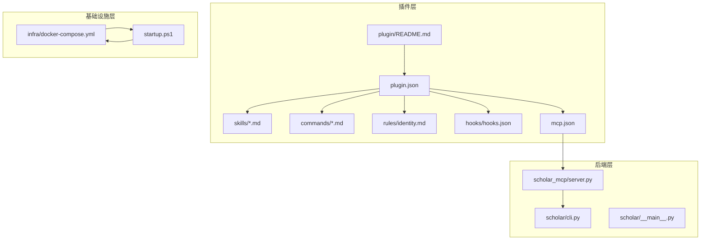
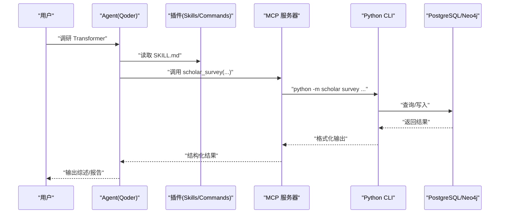
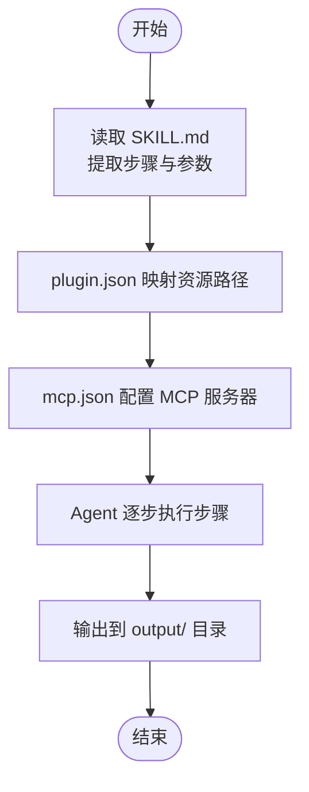
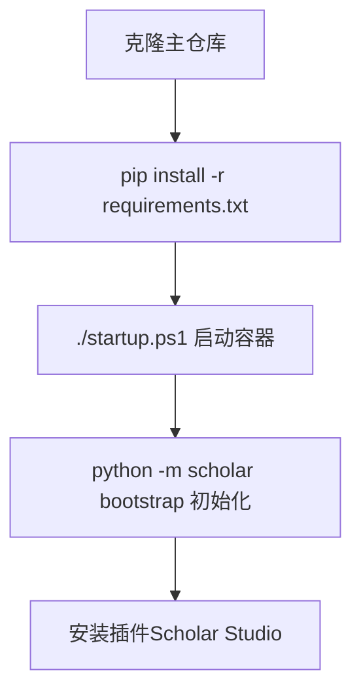
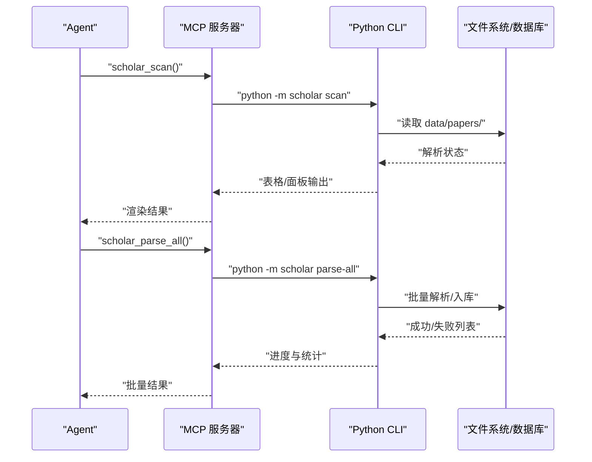
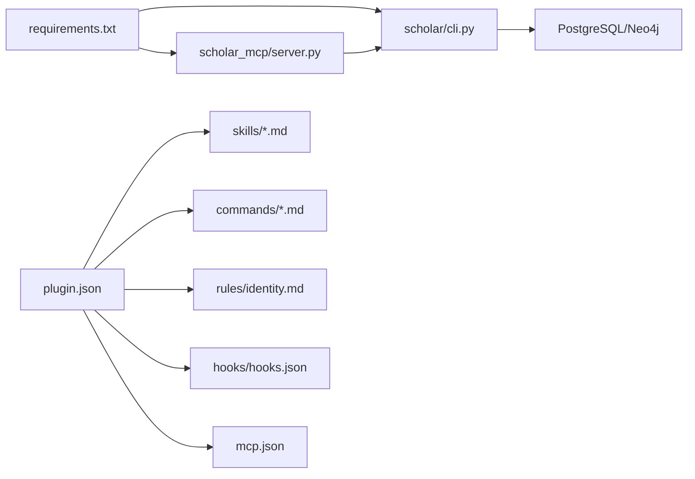

# 技能开发指南

<cite>
**本文档引用的文件**
- [plugin/README.md](file://plugin/README.md)
- [.qoder-plugin/plugin.json](file://plugin/.qoder-plugin/plugin.json)
- [plugin/mcp.json](file://plugin/mcp.json)
- [plugin/skills/citation-network/SKILL.md](file://plugin/skills/citation-network/SKILL.md)
- [plugin/skills/kb-management/SKILL.md](file://plugin/skills/kb-management/SKILL.md)
- [plugin/skills/paper-ingestion/SKILL.md](file://plugin/skills/paper-ingestion/SKILL.md)
- [plugin/skills/reproduce-paper/SKILL.md](file://plugin/skills/reproduce-paper/SKILL.md)
- [plugin/skills/review-report/SKILL.md](file://plugin/skills/review-report/SKILL.md)
- [plugin/commands/find.md](file://plugin/commands/find.md)
- [plugin/commands/health.md](file://plugin/commands/health.md)
- [plugin/commands/paper.md](file://plugin/commands/paper.md)
- [plugin/rules/identity.md](file://plugin/rules/identity.md)
- [plugin/hooks/hooks.json](file://plugin/hooks/hooks.json)
- [requirements.txt](file://requirements.txt)
- [startup.ps1](file://startup.ps1)
- [infra/docker-compose.yml](file://infra/docker-compose.yml)
- [scholar/__main__.py](file://scholar/__main__.py)
- [scholar/cli.py](file://scholar/cli.py)
- [scholar_mcp/server.py](file://scholar_mcp/server.py)
</cite>

## 目录
1. [简介](#简介)
2. [项目结构](#项目结构)
3. [核心组件](#核心组件)
4. [架构总览](#架构总览)
5. [详细组件分析](#详细组件分析)
6. [依赖分析](#依赖分析)
7. [性能考虑](#性能考虑)
8. [故障排查指南](#故障排查指南)
9. [结论](#结论)
10. [附录](#附录)

## 简介
本指南面向希望在 Scholar Studio 生态中开发“技能”（Skills）与“命令”（Commands）的开发者，系统阐述从环境搭建、项目结构、编码规范到自定义技能创建、测试、调试与发布的完整流程。项目采用“插件 + MCP 服务器 + Python CLI”的分层架构：插件负责定义技能与规则；MCP 服务器将 CLI 命令暴露为原生工具；Python CLI 提供 35+ 命令，支撑论文解析、检索、图谱构建、实验复现等能力。

## 项目结构
- 插件层（Plugin）
  - skills：14 个技能的工作流与原子步骤说明（Markdown）
  - commands：常用命令的触发与执行指引
  - rules：Agent 角色与工作模式定义
  - hooks：自动化钩子（危险命令拦截、任务完成通知）
  - mcp.json：MCP 服务配置
  - plugin.json：插件清单与资源映射
- 后端层（Python CLI + MCP Server）
  - scholar/：Typer CLI 命令集合，提供论文扫描、解析、搜索、图谱、RAG、实验复现等能力
  - scholar_mcp/：MCP 服务器，将 CLI 命令封装为 Qoder 原生工具
- 基础设施层（Docker）
  - infra/docker-compose.yml：PostgreSQL + Neo4j + APOC
  - startup.ps1：一键启动与健康检查

**图表来源**
- [plugin/README.md:1-79](file://plugin/README.md#L1-L79)
- [plugin/.qoder-plugin/plugin.json:1-23](file://plugin/.qoder-plugin/plugin.json#L1-L23)
- [plugin/mcp.json:1-16](file://plugin/mcp.json#L1-L16)
- [scholar/cli.py:1-800](file://scholar/cli.py#L1-L800)
- [scholar_mcp/server.py:1-573](file://scholar_mcp/server.py#L1-L573)
- [infra/docker-compose.yml:1-44](file://infra/docker-compose.yml#L1-L44)
- [startup.ps1:1-65](file://startup.ps1#L1-L65)

**章节来源**
- [plugin/README.md:1-79](file://plugin/README.md#L1-L79)
- [plugin/.qoder-plugin/plugin.json:1-23](file://plugin/.qoder-plugin/plugin.json#L1-L23)
- [plugin/mcp.json:1-16](file://plugin/mcp.json#L1-L16)
- [infra/docker-compose.yml:1-44](file://infra/docker-compose.yml#L1-L44)
- [startup.ps1:1-65](file://startup.ps1#L1-L65)

## 核心组件
- 技能（Skills）
  - 原子技能：paper-ingestion、math-verification、paper-recommendation、citation-network、research-gap、review-report、cold-start、experiment-code
  - 工作流：research-survey、paper-deep-dive、writing-pipeline、reproduce-paper、idea-to-paper、kb-management
- 命令（Commands）
  - find、health、paper、stats 等，提供快速检索、健康检查、论文详情查看等
- 规则（Rules）
  - identity.md 定义 Agent 工作模式、数据驱动原则、输出约定与项目结构速查
- 钩子（Hooks）
  - 阻止危险命令、任务完成通知
- MCP 与 CLI
  - mcp.json 配置 MCP 服务器；scholar_mcp/server.py 将 CLI 命令暴露为工具；scholar/cli.py 提供 35+ 命令

**章节来源**
- [plugin/README.md:60-79](file://plugin/README.md#L60-L79)
- [plugin/rules/identity.md:1-69](file://plugin/rules/identity.md#L1-L69)
- [plugin/hooks/hooks.json:1-27](file://plugin/hooks/hooks.json#L1-L27)
- [plugin/mcp.json:1-16](file://plugin/mcp.json#L1-L16)
- [scholar_mcp/server.py:1-573](file://scholar_mcp/server.py#L1-L573)
- [scholar/cli.py:1-800](file://scholar/cli.py#L1-L800)

## 架构总览
下图展示了“插件 → MCP → CLI → 数据库/图谱”的调用链路，以及技能与命令如何通过 Markdown 描述工作流，由 Agent 逐步执行。

**图表来源**
- [plugin/README.md:5-17](file://plugin/README.md#L5-L17)
- [plugin/skills/research-survey/SKILL.md:1-120](file://plugin/skills/research-survey/SKILL.md#L1-L120)
- [scholar_mcp/server.py:302-314](file://scholar_mcp/server.py#L302-L314)
- [scholar/cli.py:1-800](file://scholar/cli.py#L1-L800)

## 详细组件分析

### 技能模板与配置文件编写
- 模板位置
  - 每个技能以 SKILL.md 描述完整流程，包含触发条件、前置条件、步骤、输出与注意事项
- 配置映射
  - plugin.json 将 skills、commands、rules、hooks、mcpServers 映射到对应目录
  - mcp.json 定义 MCP 服务器命令、参数与环境变量（数据库连接）

**图表来源**
- [plugin/.qoder-plugin/plugin.json:17-22](file://plugin/.qoder-plugin/plugin.json#L17-L22)
- [plugin/mcp.json:1-16](file://plugin/mcp.json#L1-L16)
- [plugin/skills/paper-ingestion/SKILL.md:1-85](file://plugin/skills/paper-ingestion/SKILL.md#L1-L85)

**章节来源**
- [plugin/.qoder-plugin/plugin.json:1-23](file://plugin/.qoder-plugin/plugin.json#L1-L23)
- [plugin/mcp.json:1-16](file://plugin/mcp.json#L1-L16)
- [plugin/skills/paper-ingestion/SKILL.md:1-85](file://plugin/skills/paper-ingestion/SKILL.md#L1-L85)

### 环境搭建与依赖管理
- 后端依赖
  - requirements.txt 定义 CLI 与 MCP 依赖（typer、rich、psycopg2、neo4j、PyMuPDF、mcp 等）
- 基础设施
  - docker-compose.yml 启动 PostgreSQL（pgvector）与 Neo4j（APOC）
  - startup.ps1 启动容器并等待健康检查，随后打印常用命令
- 插件安装
  - 在 QoderWork 插件市场安装 Scholar Studio，或手动导入 zip

**图表来源**
- [requirements.txt:1-9](file://requirements.txt#L1-L9)
- [startup.ps1:1-65](file://startup.ps1#L1-L65)
- [infra/docker-compose.yml:1-44](file://infra/docker-compose.yml#L1-L44)
- [plugin/README.md:19-39](file://plugin/README.md#L19-L39)

**章节来源**
- [requirements.txt:1-9](file://requirements.txt#L1-L9)
- [startup.ps1:1-65](file://startup.ps1#L1-L65)
- [infra/docker-compose.yml:1-44](file://infra/docker-compose.yml#L1-L44)
- [plugin/README.md:19-39](file://plugin/README.md#L19-L39)

### 创建自定义技能（以 paper-ingestion 为例）
- 步骤拆解
  - 扫描：scan → 解析：parse/parse-all → 元数据补全：year-fix/author-fix → 预处理：auto-notes/quality-score/classify → 统计：stats → 单篇验证：info
- 增量入库
  - 新论文下载至 data/papers/<ULID>/ 后，依次执行 scan → parse → stats
- 与 MCP 的对接
  - MCP 工具：scholar_scan、scholar_parse、scholar_parse_all、scholar_info、scholar_stats 等

**图表来源**
- [plugin/skills/paper-ingestion/SKILL.md:11-75](file://plugin/skills/paper-ingestion/SKILL.md#L11-L75)
- [scholar_mcp/server.py:41-61](file://scholar_mcp/server.py#L41-L61)
- [scholar/cli.py:46-237](file://scholar/cli.py#L46-L237)

**章节来源**
- [plugin/skills/paper-ingestion/SKILL.md:1-85](file://plugin/skills/paper-ingestion/SKILL.md#L1-L85)
- [scholar_mcp/server.py:41-61](file://scholar_mcp/server.py#L41-L61)
- [scholar/cli.py:46-237](file://scholar/cli.py#L46-L237)

### 技能测试方法
- 单元测试
  - 建议针对 CLI 命令与 MCP 工具进行参数校验与异常分支测试（例如 parse/parse-all 的错误处理）
- 集成测试
  - 以 SKILL.md 的步骤为场景，串联 MCP 工具与 CLI 命令，验证端到端流程（如 paper-ingestion、citation-network、reproduce-paper）
- 性能测试
  - 批量解析 parse-all 的进度条与错误聚合输出可作为性能观测入口；graph-build、rag-index 等耗时操作可通过超时与日志定位瓶颈

**章节来源**
- [scholar/cli.py:176-237](file://scholar/cli.py#L176-L237)
- [scholar_mcp/server.py:23-37](file://scholar_mcp/server.py#L23-L37)

### 技能调试技巧
- 日志记录
  - MCP 工具统一通过 subprocess 调用 CLI，并将 stderr 追加到输出；可在工具函数中增加日志级别控制
- 错误追踪
  - CLI 命令普遍使用 rich.Console 输出错误信息；结合工具返回值与 stderr 可快速定位失败步骤
- 性能分析
  - graph-build、rag-index 等命令提供阶段性统计输出；可结合容器健康检查与数据库查询时间进行分析

**章节来源**
- [scholar_mcp/server.py:23-37](file://scholar_mcp/server.py#L23-L37)
- [scholar/cli.py:168-170](file://scholar/cli.py#L168-L170)

### 技能发布流程与最佳实践
- 版本管理
  - plugin.json 中 version 字段用于标识插件版本；发布前更新版本号并同步变更说明
- 兼容性测试
  - 在不同数据库/图谱环境下验证 graph-build、graph-stats、graph-query 的可用性
- 文档编写
  - 每个技能的 SKILL.md 应包含触发条件、前置条件、步骤、输出与注意事项；commands 与 rules 同样需要清晰说明
- 自动化保障
  - hooks.json 中的危险命令拦截与任务完成通知可减少误操作风险

**章节来源**
- [plugin/.qoder-plugin/plugin.json:3](file://plugin/.qoder-plugin/plugin.json#L3)
- [plugin/hooks/hooks.json:1-27](file://plugin/hooks/hooks.json#L1-L27)
- [plugin/skills/citation-network/SKILL.md:87-101](file://plugin/skills/citation-network/SKILL.md#L87-L101)

### 实际开发示例
- 引用网络分析（citation-network）
  - 全局统计：graph-stats、cite-network
  - 单论文分析：cite-network <ULID>
  - 概念关联：graph-query <概念ID>
  - 关键节点识别：基于中心度数据
  - 时间线构建：list-papers --year
- 知识库维护（kb-management）
  - 健康检查：stats、scan
  - 自动更新：kb-update --query "<topic>" --max 10
  - 元数据回填：metadata-enrich --apply
  - 引用解析与图谱同步：cite-resolve --apply、graph-build
  - RAG 索引同步：rag-index
- 实验复现（reproduce-paper）
  - 深度阅读：info <paper_id>
  - 环境配置：exp-setup <paper_id> --conda
  - 代码生成：输出到 output/experiments/<ULID>/
  - 数据集下载：dataset-download <dataset_name>
  - 运行实验：exp-run <paper_id> --mode quick/full
  - 结果对比：exp-compare <paper_id>
  - 失败调试：exp-debug run_log.txt

**章节来源**
- [plugin/skills/citation-network/SKILL.md:1-101](file://plugin/skills/citation-network/SKILL.md#L1-L101)
- [plugin/skills/kb-management/SKILL.md:1-59](file://plugin/skills/kb-management/SKILL.md#L1-L59)
- [plugin/skills/reproduce-paper/SKILL.md:1-69](file://plugin/skills/reproduce-paper/SKILL.md#L1-L69)

### 常见问题与解决方案
- Neo4j 未启动
  - 现象：graph-build/graph-stats 报错
  - 处理：执行 ./startup.ps1 启动容器并等待健康检查
- 数据库不可用
  - 现象：CLI 命令提示数据库不可用（文件模式）
  - 处理：确认 PostgreSQL 连接参数与容器状态
- 批量解析失败
  - 现象：parse-all 部分论文失败
  - 处理：逐条执行 info <ULID> 定位失败原因（缺少 source、PDF、格式异常等）
- 引用解析不完整
  - 现象：部分引用未解析
  - 处理：执行 cite-resolve --apply 并重新 graph-build

**章节来源**
- [startup.ps1:11-44](file://startup.ps1#L11-L44)
- [scholar/cli.py:32-41](file://scholar/cli.py#L32-L41)
- [plugin/skills/paper-ingestion/SKILL.md:27-36](file://plugin/skills/paper-ingestion/SKILL.md#L27-L36)
- [plugin/skills/citation-network/SKILL.md:87-91](file://plugin/skills/citation-network/SKILL.md#L87-L91)

## 依赖分析
- 外部依赖
  - typer、rich：CLI 交互与富文本输出
  - psycopg2、neo4j：数据库访问
  - PyMuPDF：PDF 元数据提取
  - mcp：MCP 服务器框架
- 内部依赖
  - scholar_mcp/server.py 依赖 scholar/cli.py 的命令实现
  - plugin.json 与 mcp.json 负责资源与工具映射

**图表来源**
- [requirements.txt:1-9](file://requirements.txt#L1-L9)
- [scholar/cli.py:1-800](file://scholar/cli.py#L1-L800)
- [scholar_mcp/server.py:1-573](file://scholar_mcp/server.py#L1-L573)
- [plugin/.qoder-plugin/plugin.json:1-23](file://plugin/.qoder-plugin/plugin.json#L1-L23)

**章节来源**
- [requirements.txt:1-9](file://requirements.txt#L1-L9)
- [plugin/.qoder-plugin/plugin.json:1-23](file://plugin/.qoder-plugin/plugin.json#L1-L23)

## 性能考虑
- 批量操作
  - parse-all 使用进度条与错误聚合，避免单条失败阻断整体
- 图谱与向量索引
  - graph-build、rag-index 为耗时操作，建议在稳定网络与充足内存条件下执行
- 超时与重试
  - MCP 工具统一超时控制；exp-run 支持 quick/full 模式以平衡速度与准确性

**章节来源**
- [scholar/cli.py:176-237](file://scholar/cli.py#L176-L237)
- [scholar_mcp/server.py:23-37](file://scholar_mcp/server.py#L23-L37)

## 故障排查指南
- 健康检查命令
  - health.md 提供元数据覆盖率、数据库一致性、图谱连通性、RAG 索引状态检查步骤
- 常用诊断
  - 使用 stats 查看覆盖率；scan 定位未解析论文；info 定位具体字段缺失
- MCP 工具错误
  - 若工具返回 stderr，优先检查参数与前置条件（如 Neo4j 是否启动）

**章节来源**
- [plugin/commands/health.md:1-10](file://plugin/commands/health.md#L1-L10)
- [plugin/commands/find.md:1-7](file://plugin/commands/find.md#L1-L7)
- [plugin/commands/paper.md:1-11](file://plugin/commands/paper.md#L1-L11)
- [scholar_mcp/server.py:23-37](file://scholar_mcp/server.py#L23-L37)

## 结论
通过本指南，开发者可以基于 SKILL.md 的工作流模板，结合 MCP 与 CLI 的工具链，快速创建、测试、调试与发布学术研究相关的技能与命令。遵循数据驱动原则与输出约定，配合基础设施的一键启动与健康检查，可有效提升技能开发与交付效率。

## 附录
- 术语
  - Skills：技能（工作流/原子）
  - Commands：命令（快捷操作）
  - MCP：Model Context Protocol（将 CLI 暴露为原生工具）
  - ULID：论文唯一标识符
- 参考命令
  - python -m scholar --help 查看全部命令
  - ./startup.ps1 启动数据库与图谱服务