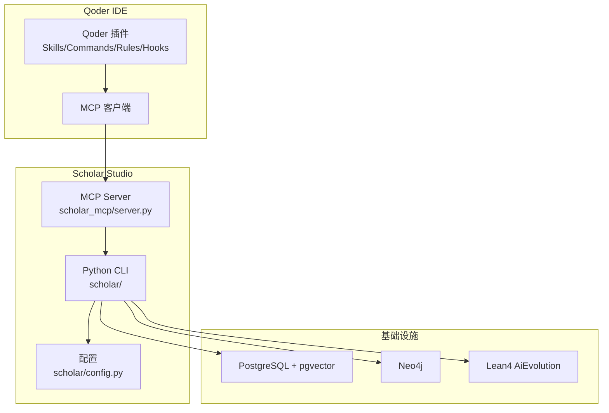
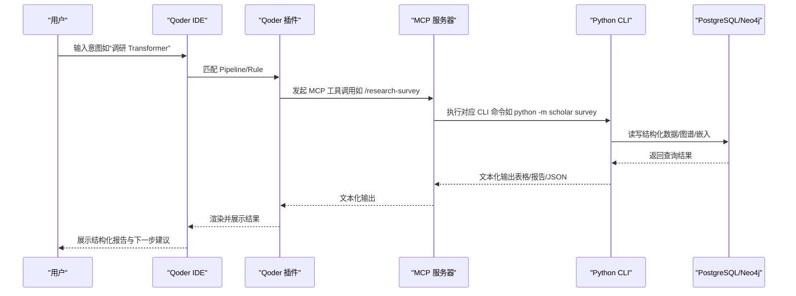
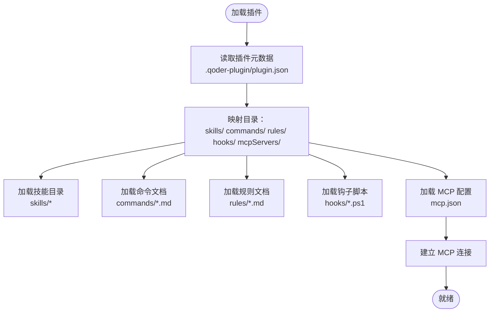
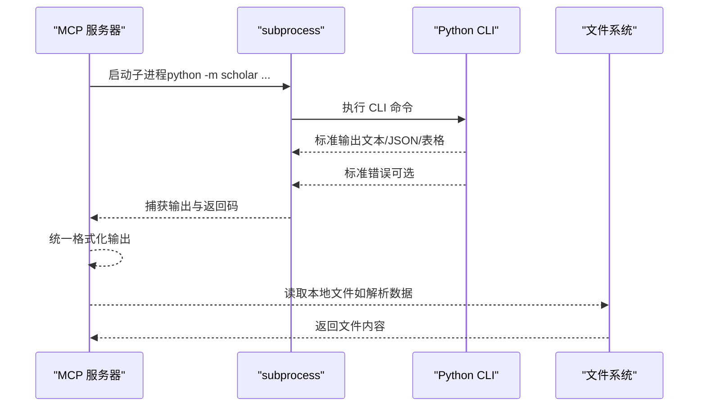
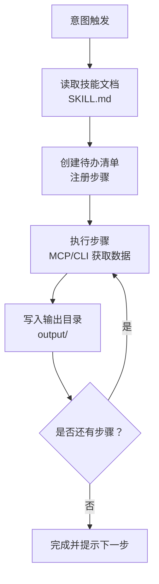
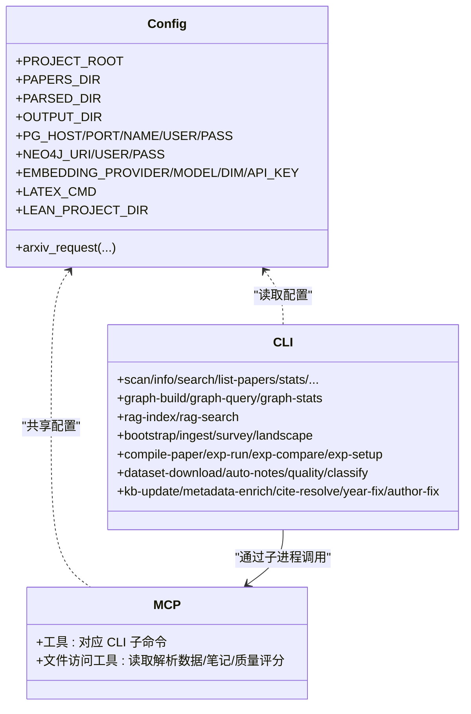
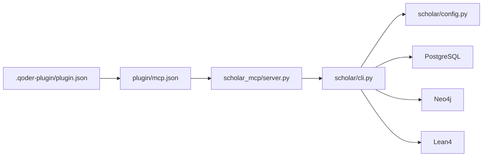

# 技能架构设计

<cite>
**本文档引用的文件**
- [plugin/README.md](file://plugin/README.md)
- [plugin/.qoder-plugin/plugin.json](file://plugin/.qoder-plugin/plugin.json)
- [plugin/mcp.json](file://plugin/mcp.json)
- [scholar/__main__.py](file://scholar/__main__.py)
- [scholar/cli.py](file://scholar/cli.py)
- [scholar/config.py](file://scholar/config.py)
- [scholar_mcp/server.py](file://scholar_mcp/server.py)
- [build_plugin.py](file://build_plugin.py)
- [plugin/skills/paper-deep-dive/SKILL.md](file://plugin/skills/paper-deep-dive/SKILL.md)
- [plugin/skills/research-survey/SKILL.md](file://plugin/skills/research-survey/SKILL.md)
- [plugin/skills/kb-management/SKILL.md](file://plugin/skills/kb-management/SKILL.md)
- [plugin/commands/stats.md](file://plugin/commands/stats.md)
- [plugin/commands/find.md](file://plugin/commands/find.md)
- [plugin/hooks/task-done.ps1](file://plugin/hooks/task-done.ps1)
- [plugin/hooks/block-dangerous.ps1](file://plugin/hooks/block-dangerous.ps1)
- [plugin/rules/identity.md](file://plugin/rules/identity.md)
</cite>

## 目录
1. [简介](#简介)
2. [项目结构](#项目结构)
3. [核心组件](#核心组件)
4. [架构总览](#架构总览)
5. [详细组件分析](#详细组件分析)
6. [依赖分析](#依赖分析)
7. [性能考量](#性能考量)
8. [故障排查指南](#故障排查指南)
9. [结论](#结论)
10. [附录](#附录)

## 简介
本文件面向“研究技能架构”的设计与实现，围绕以下目标展开：  
- 解释技能系统的整体架构，包括 MCP 协议集成、插件系统设计、技能加载机制  
- 文档化技能的生命周期管理、依赖注入、错误处理机制  
- 详细说明技能与 Qoder IDE 的集成方式，包括插件配置、连接建立、消息传递协议  
- 解释技能的分类体系，包括原子技能与工作流的区别及其在学术研究中的作用  
- 总结技术决策与设计权衡，涵盖性能与扩展性设计  

## 项目结构
该项目采用“插件 + 后端 CLI + MCP Server”的分层架构：  
- 插件层（Qoder 插件）：提供 14 个技能、4 个命令、规则与钩子，并通过 MCP 配置指向后端 MCP Server  
- 后端 CLI 层（Python scholar）：提供 35+ 命令，负责论文解析、检索、图谱构建、RAG、实验复现等  
- MCP Server 层：将 CLI 命令暴露为 MCP 工具，供 Qoder IDE 调用  
- 基础设施层：PostgreSQL + Neo4j + Lean4（AiEvolution）等外部系统  

**图表来源**
- [plugin/.qoder-plugin/plugin.json:17-21](file://plugin/.qoder-plugin/plugin.json#L17-L21)
- [plugin/mcp.json:1-16](file://plugin/mcp.json#L1-L16)
- [scholar_mcp/server.py:17-20](file://scholar_mcp/server.py#L17-L20)
- [scholar/config.py:41-63](file://scholar/config.py#L41-L63)

**章节来源**
- [plugin/README.md:5-79](file://plugin/README.md#L5-L79)
- [plugin/.qoder-plugin/plugin.json:1-23](file://plugin/.qoder-plugin/plugin.json#L1-L23)
- [plugin/mcp.json:1-16](file://plugin/mcp.json#L1-L16)
- [scholar_mcp/server.py:17-20](file://scholar_mcp/server.py#L17-L20)
- [scholar/config.py:41-63](file://scholar/config.py#L41-L63)

## 核心组件
- 插件元数据与目录映射：通过插件根目录下的元数据文件，声明技能、命令、规则、钩子与 MCP 配置的相对路径，确保 Qoder IDE 正确加载资源  
- MCP 服务器：将 Python CLI 命令封装为 MCP 工具，统一返回文本输出，便于 IDE 侧渲染与交互  
- CLI 命令集：覆盖论文解析、检索、图谱构建、RAG、元数据补全、实验复现等，形成可组合的原子能力  
- 配置与环境：集中管理数据库、图数据库、嵌入模型、LaTeX 编译器等外部依赖的访问参数  
- 插件打包与发布：自动化复制技能与命令，生成可分发的 ZIP 包，满足 Qoder 插件市场分发要求  

**章节来源**
- [plugin/.qoder-plugin/plugin.json:17-21](file://plugin/.qoder-plugin/plugin.json#L17-L21)
- [scholar_mcp/server.py:23-36](file://scholar_mcp/server.py#L23-L36)
- [scholar/cli.py:1-800](file://scholar/cli.py#L1-L800)
- [scholar/config.py:1-116](file://scholar/config.py#L1-L116)
- [build_plugin.py:95-129](file://build_plugin.py#L95-L129)

## 架构总览
下图展示了从 Qoder IDE 到 MCP 服务器再到 CLI 的调用链路，以及数据与工具的流向。

**图表来源**
- [plugin/rules/identity.md:11-15](file://plugin/rules/identity.md#L11-L15)
- [plugin/skills/research-survey/SKILL.md:11-16](file://plugin/skills/research-survey/SKILL.md#L11-L16)
- [scholar_mcp/server.py:283-313](file://scholar_mcp/server.py#L283-L313)
- [scholar/cli.py:605-657](file://scholar/cli.py#L605-L657)

**章节来源**
- [plugin/rules/identity.md:11-15](file://plugin/rules/identity.md#L11-L15)
- [plugin/skills/research-survey/SKILL.md:11-16](file://plugin/skills/research-survey/SKILL.md#L11-L16)
- [scholar_mcp/server.py:283-313](file://scholar_mcp/server.py#L283-L313)
- [scholar/cli.py:605-657](file://scholar/cli.py#L605-L657)

## 详细组件分析

### 插件系统与技能加载机制
- 插件元数据：通过插件根目录的元数据文件声明技能、命令、规则、钩子与 MCP 配置的相对路径，确保 Qoder IDE 正确定位资源  
- 技能与命令：技能以目录形式组织，每个技能包含说明文档；命令以 Markdown 文件形式提供简要说明与执行步骤  
- 钩子与规则：提供任务完成通知与危险命令拦截等安全与体验增强功能  
- MCP 配置：声明 MCP 服务器的启动命令、参数与环境变量，使 IDE 能够建立连接并调用工具  

**图表来源**
- [plugin/.qoder-plugin/plugin.json:17-21](file://plugin/.qoder-plugin/plugin.json#L17-L21)
- [plugin/mcp.json:1-16](file://plugin/mcp.json#L1-L16)

**章节来源**
- [plugin/.qoder-plugin/plugin.json:1-23](file://plugin/.qoder-plugin/plugin.json#L1-L23)
- [plugin/mcp.json:1-16](file://plugin/mcp.json#L1-L16)

### MCP 协议集成与工具暴露
- MCP 服务器：使用通用 MCP 框架，将 CLI 命令封装为工具函数，统一捕获标准输出并返回给客户端  
- 工具命名与参数：工具名称与 CLI 子命令一一对应，参数类型与默认值来自 CLI 定义  
- 超时与错误处理：为耗时操作设置超时，捕获子进程返回码与错误输出，保证稳定性  
- 文件访问工具：提供读取解析数据、质量评分、自动笔记等文件读取工具，便于 IDE 直接展示  

**图表来源**
- [scholar_mcp/server.py:23-36](file://scholar_mcp/server.py#L23-L36)
- [scholar_mcp/server.py:374-384](file://scholar_mcp/server.py#L374-L384)

**章节来源**
- [scholar_mcp/server.py:23-36](file://scholar_mcp/server.py#L23-L36)
- [scholar_mcp/server.py:374-384](file://scholar_mcp/server.py#L374-L384)

### 技能生命周期管理
- 触发与匹配：规则定义了系统心智模型与工作模式，当用户意图匹配到某个技能时，开始执行  
- 步骤分解与执行：技能文档定义了明确的步骤序列，系统据此创建待办清单并逐步执行  
- 数据驱动：每一步均通过 MCP 工具或 CLI 命令获取真实数据，避免凭空编造  
- 错误与恢复：若中途失败，从首个未完成步骤恢复执行，保证幂等与可恢复性  
- 输出归档：所有生成物写入统一的输出目录，便于后续查阅与复用  

**图表来源**
- [plugin/rules/identity.md:27-33](file://plugin/rules/identity.md#L27-L33)
- [plugin/skills/paper-deep-dive/SKILL.md:11-16](file://plugin/skills/paper-deep-dive/SKILL.md#L11-L16)

**章节来源**
- [plugin/rules/identity.md:27-33](file://plugin/rules/identity.md#L27-L33)
- [plugin/skills/paper-deep-dive/SKILL.md:11-16](file://plugin/skills/paper-deep-dive/SKILL.md#L11-L16)

### 依赖注入与配置管理
- 环境变量：数据库、图数据库、嵌入模型、LaTeX 编译器等通过环境变量注入，支持多环境切换  
- 配置模块：集中定义路径与参数，确保 CLI 与 MCP 服务器共享同一套配置  
- 外部服务：PostgreSQL/pgvector 用于结构化存储与向量检索；Neo4j 用于概念图谱与引用网络；Lean4 用于数学形式化验证  

**图表来源**
- [scholar/config.py:20-63](file://scholar/config.py#L20-L63)
- [scholar/cli.py:1-800](file://scholar/cli.py#L1-L800)
- [scholar_mcp/server.py:17-20](file://scholar_mcp/server.py#L17-L20)

**章节来源**
- [scholar/config.py:20-63](file://scholar/config.py#L20-L63)
- [scholar/cli.py:1-800](file://scholar/cli.py#L1-L800)
- [scholar_mcp/server.py:17-20](file://scholar_mcp/server.py#L17-L20)

### 错误处理机制
- CLI 层：对异常进行捕获与打印，返回退出码，便于上层判断  
- MCP 层：捕获子进程返回码与错误输出，统一拼接到标准输出中，避免静默失败  
- 钩子层：危险命令拦截脚本在预处理阶段阻断高风险操作，保障系统安全  
- 文件访问：读取本地文件失败时返回明确提示，引导用户先执行相应 CLI 命令生成数据  

**章节来源**
- [scholar/cli.py:168-170](file://scholar/cli.py#L168-L170)
- [scholar_mcp/server.py:26-36](file://scholar_mcp/server.py#L26-L36)
- [plugin/hooks/block-dangerous.ps1:11-21](file://plugin/hooks/block-dangerous.ps1#L11-L21)
- [scholar_mcp/server.py:334-354](file://scholar_mcp/server.py#L334-L354)

### 技能分类体系与学术作用
- 原子技能（8 个）：聚焦单一能力，如论文解析、数学验证、推荐、引用网络分析、研究空白发现、同行评审报告、冷启动学习路径、实验代码生成  
- 工作流（6 个）：由多个原子技能组合而成的端到端流程，如全面文献调研、单篇深度分析、端到端写作、实验复现、从点子到论文、知识库维护  
- 学术价值：原子技能提供细粒度能力，工作流提供可复用的研究范式，二者共同构成“可执行”的研究工具箱，支撑从“发现—分析—写作—验证”的闭环  

**章节来源**
- [plugin/README.md:62-79](file://plugin/README.md#L62-L79)

### 技能与 Qoder IDE 集成细节
- 插件配置：插件元数据声明技能、命令、规则、钩子与 MCP 配置的相对路径，确保 IDE 正确加载  
- 连接建立：MCP 配置文件指定 MCP 服务器的启动命令、参数与环境变量，IDE 启动后自动连接  
- 消息传递：IDE 将用户意图转化为工具调用请求，MCP 服务器执行对应 CLI 命令并返回文本化结果  
- 输出展示：CLI 输出经富文本渲染后在 IDE 中展示，同时提供“下一步”建议，引导用户继续执行  

**章节来源**
- [plugin/.qoder-plugin/plugin.json:17-21](file://plugin/.qoder-plugin/plugin.json#L17-L21)
- [plugin/mcp.json:1-16](file://plugin/mcp.json#L1-L16)
- [plugin/rules/identity.md:11-15](file://plugin/rules/identity.md#L11-L15)

### 技能文档与工作流示例
- 研讨主题全面调研：包含本地搜索、arXiv 外部搜索、关键词扩展、深度阅读、概念图谱分析与报告生成  
- 单篇论文深度分析：包含数据加载、深度阅读、质量评估、公式推导、引用网络分析、实验代码生成与综合报告  
- 知识库维护：包含健康检查、自动更新、元数据回填、缺失字段补全、引用解析与图谱同步、RAG 索引同步与维护报告  

**章节来源**
- [plugin/skills/research-survey/SKILL.md:11-75](file://plugin/skills/research-survey/SKILL.md#L11-L75)
- [plugin/skills/paper-deep-dive/SKILL.md:11-51](file://plugin/skills/paper-deep-dive/SKILL.md#L11-L51)
- [plugin/skills/kb-management/SKILL.md:11-53](file://plugin/skills/kb-management/SKILL.md#L11-L53)

## 依赖分析
- 插件到 MCP：插件通过 MCP 配置文件声明 MCP 服务器，IDE 依据配置建立连接  
- MCP 到 CLI：MCP 工具通过子进程调用 Python CLI，传递参数并捕获输出  
- CLI 到外部系统：CLI 读写数据库、图数据库与文件系统，部分能力依赖外部工具（如 LaTeX 编译）  
- 配置共享：CLI 与 MCP 共享配置模块，确保行为一致  

**图表来源**
- [plugin/.qoder-plugin/plugin.json:17-21](file://plugin/.qoder-plugin/plugin.json#L17-L21)
- [plugin/mcp.json:1-16](file://plugin/mcp.json#L1-L16)
- [scholar_mcp/server.py:23-36](file://scholar_mcp/server.py#L23-L36)
- [scholar/cli.py:1-800](file://scholar/cli.py#L1-L800)
- [scholar/config.py:41-63](file://scholar/config.py#L41-L63)

**章节来源**
- [plugin/.qoder-plugin/plugin.json:17-21](file://plugin/.qoder-plugin/plugin.json#L17-L21)
- [plugin/mcp.json:1-16](file://plugin/mcp.json#L1-L16)
- [scholar_mcp/server.py:23-36](file://scholar_mcp/server.py#L23-L36)
- [scholar/cli.py:1-800](file://scholar/cli.py#L1-L800)
- [scholar/config.py:41-63](file://scholar/config.py#L41-L63)

## 性能考量
- 子进程开销：MCP 通过子进程调用 CLI，适合将耗时任务拆分为独立进程，但需注意进程启动与通信成本  
- 超时控制：针对长时间运行的任务设置超时，避免阻塞 MCP 服务器  
- 批处理与增量：CLI 提供批量处理与增量处理选项，减少重复计算与 IO 压力  
- 外部系统优化：数据库与图数据库的连接池、索引与查询优化对整体性能至关重要  
- 输出渲染：IDE 侧对大量表格与长文本的渲染需注意性能，必要时分页或延迟加载  

[本节为通用性能讨论，无需具体文件分析]

## 故障排查指南
- CLI 执行失败：检查 CLI 的错误输出与退出码，确认输入参数与依赖可用性  
- MCP 工具无响应：检查 MCP 服务器是否正常运行、子进程是否超时、环境变量是否正确  
- 数据缺失：确认 CLI 是否已生成所需文件（如解析数据、笔记、质量评分），或先执行相应命令  
- 危险命令拦截：若脚本拦截了命令，请检查命令内容与拦截规则，必要时调整策略  
- 连接问题：核对 MCP 配置文件中的命令、参数与环境变量，确保 IDE 能成功启动 MCP 服务器  

**章节来源**
- [scholar/cli.py:168-170](file://scholar/cli.py#L168-L170)
- [scholar_mcp/server.py:26-36](file://scholar_mcp/server.py#L26-L36)
- [plugin/hooks/block-dangerous.ps1:11-21](file://plugin/hooks/block-dangerous.ps1#L11-L21)
- [plugin/mcp.json:1-16](file://plugin/mcp.json#L1-L16)

## 结论
本技能架构以“插件 + CLI + MCP”的分层设计实现了研究流程的可执行化与可视化：  
- 插件层提供清晰的技能与命令边界，规则与钩子保障安全与体验  
- MCP 服务器将 CLI 能力原生暴露给 IDE，统一输出格式，降低集成复杂度  
- CLI 命令集覆盖学术研究全流程，配合外部系统形成强大的数据与推理能力  
- 技能分类体系兼顾原子能力与工作流，既可灵活组合又可稳定复用  
在性能与扩展性方面，通过子进程隔离、超时控制、批处理与增量处理等手段平衡了易用性与效率；未来可在缓存、并发与可观测性方面进一步优化。

[本节为总结性内容，无需具体文件分析]

## 附录
- 插件打包：自动化复制技能与命令，生成符合 Qoder 要求的 ZIP 包，便于分发与安装  
- 常用命令：知识库状态、快速查找、健康检查等命令提供便捷入口  
- 安全与合规：规则定义数据驱动与引用准确原则，钩子脚本拦截危险操作  

**章节来源**
- [build_plugin.py:95-129](file://build_plugin.py#L95-L129)
- [plugin/commands/stats.md:1-7](file://plugin/commands/stats.md#L1-L7)
- [plugin/commands/find.md:1-7](file://plugin/commands/find.md#L1-L7)
- [plugin/rules/identity.md:44-51](file://plugin/rules/identity.md#L44-L51)
- [plugin/hooks/task-done.ps1:1-24](file://plugin/hooks/task-done.ps1#L1-L24)
- [plugin/hooks/block-dangerous.ps1:1-24](file://plugin/hooks/block-dangerous.ps1#L1-L24)