# 研究技能系统

<cite>
**本文档引用的文件**
- [plugin/skills/paper-ingestion/SKILL.md](file://plugin/skills/paper-ingestion/SKILL.md)
- [plugin/skills/math-verification/SKILL.md](file://plugin/skills/math-verification/SKILL.md)
- [plugin/skills/paper-recommendation/SKILL.md](file://plugin/skills/paper-recommendation/SKILL.md)
- [plugin/skills/citation-network/SKILL.md](file://plugin/skills/citation-network/SKILL.md)
- [plugin/skills/research-gap/SKILL.md](file://plugin/skills/research-gap/SKILL.md)
- [plugin/skills/review-report/SKILL.md](file://plugin/skills/review-report/SKILL.md)
- [plugin/skills/cold-start/SKILL.md](file://plugin/skills/cold-start/SKILL.md)
- [plugin/skills/experiment-code/SKILL.md](file://plugin/skills/experiment-code/SKILL.md)
- [plugin/skills/research-survey/SKILL.md](file://plugin/skills/research-survey/SKILL.md)
- [plugin/skills/paper-deep-dive/SKILL.md](file://plugin/skills/paper-deep-dive/SKILL.md)
- [plugin/skills/writing-pipeline/SKILL.md](file://plugin/skills/writing-pipeline/SKILL.md)
- [plugin/skills/reproduce-paper/SKILL.md](file://plugin/skills/reproduce-paper/SKILL.md)
- [plugin/skills/idea-to-paper/SKILL.md](file://plugin/skills/idea-to-paper/SKILL.md)
- [plugin/skills/kb-management/SKILL.md](file://plugin/skills/kb-management/SKILL.md)
- [plugin/mcp.json](file://plugin/mcp.json)
- [plugin/CONNECTORS.md](file://plugin/CONNECTORS.md)
- [scholar/__main__.py](file://scholar/__main__.py)
- [scholar/cli.py](file://scholar/cli.py)
- [scholar_mcp/server.py](file://scholar_mcp/server.py)
</cite>

## 更新摘要
**所做更改**
- 更新了插件系统版本信息，从v1.0升级到v2.0
- 重新组织了技能架构，从22个技能简化为14个技能
- 新增了6个执行层命令的文档
- 更新了技能系统的核心组件和架构说明
- 调整了工作流和原子技能的分类结构

## 目录
1. [简介](#简介)
2. [项目结构](#项目结构)
3. [核心组件](#核心组件)
4. [架构总览](#架构总览)
5. [详细组件分析](#详细组件分析)
6. [依赖分析](#依赖分析)
7. [性能考虑](#性能考虑)
8. [故障排查指南](#故障排查指南)
9. [结论](#结论)
10. [附录](#附录)

## 简介
本文件系统性阐述研究技能系统的架构与实现，覆盖14项研究技能：其中8项原子技能负责数据处理、解析、验证与执行；6项工作流以原子技能为拼装单元，形成端到端的研究流程。文档还涵盖MCP协议在技能系统中的作用、与Qoder IDE的集成方式、技能开发指南、测试与调试方法，以及配置与扩展最佳实践。

**更新** 插件系统已从v1.0升级到v2.0，技能架构发生重大重组，从原有的22个技能简化为14个核心技能，同时新增了6个执行层命令以增强系统的执行能力。

## 项目结构
研究技能系统围绕"技能（SKILL.md）+ CLI工具 + MCP服务器"的三层结构组织：
- 技能层：位于 plugin/.qoder/skills/<skill>/SKILL.md，定义触发条件、前置条件、流程步骤与下一步动作。
- 工具层：scholar/cli.py 提供命令行接口，覆盖扫描、解析、搜索、图谱、RAG、元数据补全、批量预处理、实验执行等能力。
- 集成层：scholar_mcp/server.py 将CLI封装为MCP工具，供Qoder IDE调用；plugin/mcp.json 描述MCP服务器启动参数与环境变量。

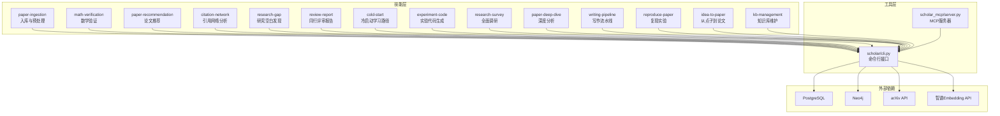

**图示来源**
- [plugin/skills/paper-ingestion/SKILL.md](file://plugin/skills/paper-ingestion/SKILL.md)
- [plugin/skills/math-verification/SKILL.md](file://plugin/skills/math-verification/SKILL.md)
- [plugin/skills/paper-recommendation/SKILL.md](file://plugin/skills/paper-recommendation/SKILL.md)
- [plugin/skills/citation-network/SKILL.md](file://plugin/skills/citation-network/SKILL.md)
- [plugin/skills/research-gap/SKILL.md](file://plugin/skills/research-gap/SKILL.md)
- [plugin/skills/review-report/SKILL.md](file://plugin/skills/review-report/SKILL.md)
- [plugin/skills/cold-start/SKILL.md](file://plugin/skills/cold-start/SKILL.md)
- [plugin/skills/experiment-code/SKILL.md](file://plugin/skills/experiment-code/SKILL.md)
- [plugin/skills/research-survey/SKILL.md](file://plugin/skills/research-survey/SKILL.md)
- [plugin/skills/paper-deep-dive/SKILL.md](file://plugin/skills/paper-deep-dive/SKILL.md)
- [plugin/skills/writing-pipeline/SKILL.md](file://plugin/skills/writing-pipeline/SKILL.md)
- [plugin/skills/reproduce-paper/SKILL.md](file://plugin/skills/reproduce-paper/SKILL.md)
- [plugin/skills/idea-to-paper/SKILL.md](file://plugin/skills/idea-to-paper/SKILL.md)
- [plugin/skills/kb-management/SKILL.md](file://plugin/skills/kb-management/SKILL.md)
- [scholar/cli.py](file://scholar/cli.py)
- [scholar_mcp/server.py](file://scholar_mcp/server.py)

**章节来源**
- [plugin/CONNECTORS.md](file://plugin/CONNECTORS.md)
- [plugin/mcp.json](file://plugin/mcp.json)

## 核心组件
- 原子技能（8项）
  - paper-ingestion：扫描、解析、失败诊断、元数据补全、批量预处理、统计校验与增量入库。
  - math-verification：定位公式、语义分析、对照已有形式化、Lean4编译验证、生成验证报告。
  - paper-recommendation：基于引用网络、研究方向、阅读缺口的推荐，排序与输出。
  - citation-network：全局网络统计、单论文引用分析、概念关联、关键节点识别、时间线构建。
  - research-gap：确定分析范围、收集局限性声明、交叉分析缺口、引用网络辅助、概念演化、arXiv验证、输出缺口报告。
  - review-report：定位与深度阅读、贡献评估、方法论与实验审查、写作质量审查、引用网络对照、Lean4形式化对照、输出审稿报告。
  - cold-start：评估本地库、混合冷启动、构建知识地图与时间线、核心论文精读、与已有知识关联、概念图谱辅助、输出冷启动指南。
  - experiment-code：深度阅读方法、提取算法要素、确定技术栈、生成代码结构、逐步实现、验证与说明文档。
- 工作流（6项）
  - research-survey：预检查、本地与arXiv搜索、关键词扩展、深度阅读、概念图谱分析、生成调研报告。
  - paper-deep-dive：加载数据、深度阅读、质量评估、公式推导、引用网络分析、生成实验代码框架、输出深度分析报告。
  - writing-pipeline：主题调研、阅读关键论文笔记、撰写Related Work、撰写完整论文、LaTeX编译、自审报告。
  - reproduce-paper：深度阅读论文、配置运行环境、生成实验代码、下载数据集、运行实验、对比结果、调试失败。
  - idea-to-paper：点子明确化、文献调研、研究Gap分析、方法设计、实验设计、代码实现与实验、论文撰写、自审与修改。
  - kb-management：知识库健康检查、自动更新、元数据回填、补全缺失字段、引用解析与图谱同步、RAG索引同步、输出维护报告。

**更新** 技能数量从22个简化为14个，架构更加精简高效。所有技能都经过重新设计和优化，确保核心功能的完整性和执行效率。

**章节来源**
- [plugin/skills/paper-ingestion/SKILL.md](file://plugin/skills/paper-ingestion/SKILL.md)
- [plugin/skills/math-verification/SKILL.md](file://plugin/skills/math-verification/SKILL.md)
- [plugin/skills/paper-recommendation/SKILL.md](file://plugin/skills/paper-recommendation/SKILL.md)
- [plugin/skills/citation-network/SKILL.md](file://plugin/skills/citation-network/SKILL.md)
- [plugin/skills/research-gap/SKILL.md](file://plugin/skills/research-gap/SKILL.md)
- [plugin/skills/review-report/SKILL.md](file://plugin/skills/review-report/SKILL.md)
- [plugin/skills/cold-start/SKILL.md](file://plugin/skills/cold-start/SKILL.md)
- [plugin/skills/experiment-code/SKILL.md](file://plugin/skills/experiment-code/SKILL.md)
- [plugin/skills/research-survey/SKILL.md](file://plugin/skills/research-survey/SKILL.md)
- [plugin/skills/paper-deep-dive/SKILL.md](file://plugin/skills/paper-deep-dive/SKILL.md)
- [plugin/skills/writing-pipeline/SKILL.md](file://plugin/skills/writing-pipeline/SKILL.md)
- [plugin/skills/reproduce-paper/SKILL.md](file://plugin/skills/reproduce-paper/SKILL.md)
- [plugin/skills/idea-to-paper/SKILL.md](file://plugin/skills/idea-to-paper/SKILL.md)
- [plugin/skills/kb-management/SKILL.md](file://plugin/skills/kb-management/SKILL.md)

## 架构总览
研究技能系统采用"技能即流程"的设计理念，每个技能以SKILL.md描述步骤，底层通过scholar CLI执行具体任务，MCP服务器将CLI封装为可被Qoder IDE调用的工具集合。外部依赖包括PostgreSQL（元数据与解析结果持久化）、Neo4j（引用网络与概念图谱）、arXiv API（扩展搜索）、智谱Embedding API（RAG语义检索）。

**更新** v2.0版本引入了更高效的执行层架构，新增的6个执行层命令提供了更强的系统控制能力和执行灵活性。

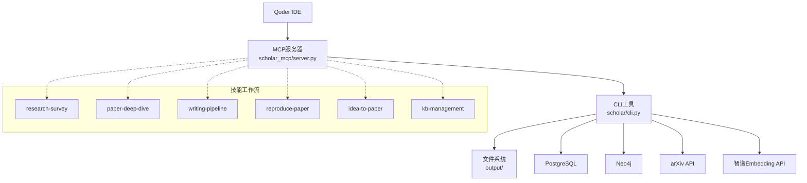

**图示来源**
- [scholar_mcp/server.py](file://scholar_mcp/server.py)
- [scholar/cli.py](file://scholar/cli.py)
- [plugin/CONNECTORS.md](file://plugin/CONNECTORS.md)

## 详细组件分析

### 原子技能：paper-ingestion
- 触发与流程要点：扫描目录、批量解析、失败诊断、元数据补全、批量预处理、统计校验、单篇验证、增量入库。
- 关键命令：scan、parse-all、info、year-fix、author-fix、auto-notes、quality-score、classify、stats。
- 数据产物：output/parsed/<ULID>.json、output/notes/<ULID>.md、质量评分与分类标签。
- 与后续技能衔接：为research-survey、kb-management提供数据基础。

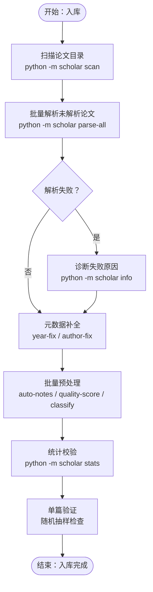

**图示来源**
- [plugin/skills/paper-ingestion/SKILL.md](file://plugin/skills/paper-ingestion/SKILL.md)

**章节来源**
- [plugin/skills/paper-ingestion/SKILL.md](file://plugin/skills/paper-ingestion/SKILL.md)

### 原子技能：math-verification
- 触发与前置条件：用户请求验证公式或定理，要求本地已安装Lean4且AiEvolution项目就绪。
- 流程要点：定位目标公式、提取上下文、语义分析、对照已有形式化、Lean4形式化尝试、编译验证、生成验证报告。
- 数据产物：output/notes/math-verify-<paper_id>.md、Lean4编译结果。
- 与后续技能衔接：为paper-deep-dive、experiment-code提供形式化依据。

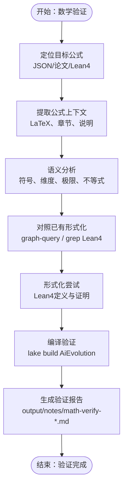

**图示来源**
- [plugin/skills/math-verification/SKILL.md](file://plugin/skills/math-verification/SKILL.md)

**章节来源**
- [plugin/skills/math-verification/SKILL.md](file://plugin/skills/math-verification/SKILL.md)

### 原子技能：paper-recommendation
- 触发与流程要点：理解推荐需求（基于论文、方向、缺口）、引用网络分析、方向搜索、阅读缺口识别、排序与输出。
- 关键命令：cite-network、graph-stats、graph-query、search、rag-search、classify、arxiv-search。
- 数据产物：output/notes/recommendations-<topic>.md。
- 与后续技能衔接：驱动paper-deep-dive、cold-start。

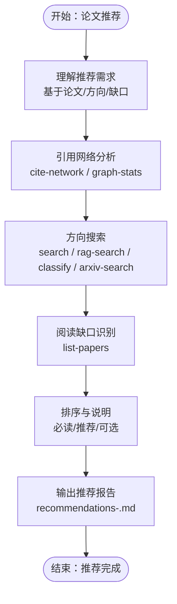

**图示来源**
- [plugin/skills/paper-recommendation/SKILL.md](file://plugin/skills/paper-recommendation/SKILL.md)

**章节来源**
- [plugin/skills/paper-recommendation/SKILL.md](file://plugin/skills/paper-recommendation/SKILL.md)

### 原子技能：citation-network
- 触发与前置条件：Neo4j已启动并完成graph-build。
- 流程要点：全局网络统计、单论文引用分析、概念关联、关键节点识别、时间线构建、输出。
- 关键命令：graph-stats、cite-network、graph-query、list-papers。
- 数据产物：output/drafts/citation-network-<topic>.md。
- 与后续技能衔接：驱动paper-deep-dive、paper-recommendation、research-gap。

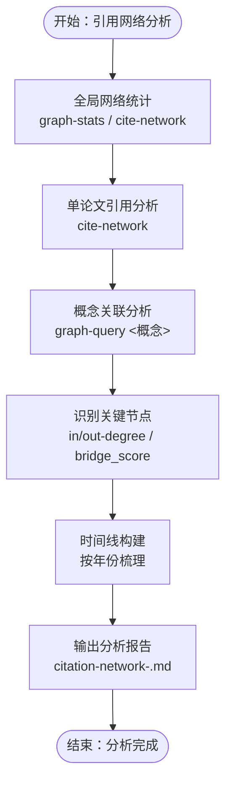

**图示来源**
- [plugin/skills/citation-network/SKILL.md](file://plugin/skills/citation-network/SKILL.md)

**章节来源**
- [plugin/skills/citation-network/SKILL.md](file://plugin/skills/citation-network/SKILL.md)

### 原子技能：research-gap
- 触发与前置条件：本地知识库有一定规模（建议>100篇）。
- 流程要点：确定分析范围、收集局限性声明、交叉分析缺口、引用网络辅助、概念演化分析、arXiv验证、输出。
- 关键命令：search、classify、graph-query、cite-network、graph-stats、arxiv-search。
- 数据产物：output/drafts/research-gaps-<topic>.md。
- 与后续技能衔接：驱动paper-recommendation、cold-start、research-survey。

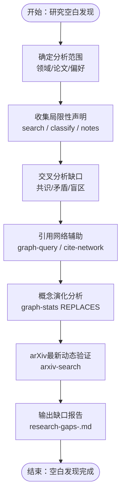

**图示来源**
- [plugin/skills/research-gap/SKILL.md](file://plugin/skills/research-gap/SKILL.md)

**章节来源**
- [plugin/skills/research-gap/SKILL.md](file://plugin/skills/research-gap/SKILL.md)

### 原子技能：review-report
- 触发与流程要点：定位并深度阅读论文、评估贡献、方法论与实验审查、写作质量审查、引用网络对照、Lean4形式化对照、输出审稿报告。
- 关键命令：quality-score、info、cite-network、export-bib。
- 数据产物：output/notes/review-<paper_id>.md。
- 与后续技能衔接：驱动paper-deep-dive、质量评分记录。

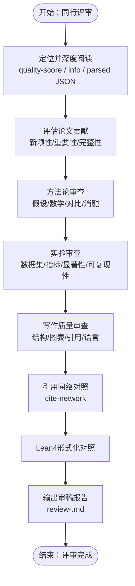

**图示来源**
- [plugin/skills/review-report/SKILL.md](file://plugin/skills/review-report/SKILL.md)

**章节来源**
- [plugin/skills/review-report/SKILL.md](file://plugin/skills/review-report/SKILL.md)

### 原子技能：cold-start
- 触发与流程要点：评估本地库、基于本地/混合/基于arXiv冷启动、构建知识地图与时间线、核心论文精读、与已有知识关联、概念图谱辅助、输出冷启动指南。
- 关键命令：search、rag-search、list-papers、graph-query、graph-stats、arxiv-search。
- 数据产物：output/drafts/cold-start-<topic>.md。
- 与后续技能衔接：驱动research-survey、paper-deep-dive、citation-network。

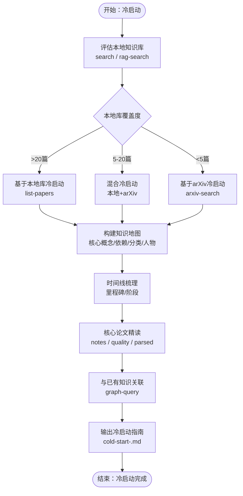

**图示来源**
- [plugin/skills/cold-start/SKILL.md](file://plugin/skills/cold-start/SKILL.md)

**章节来源**
- [plugin/skills/cold-start/SKILL.md](file://plugin/skills/cold-start/SKILL.md)

### 原子技能：experiment-code
- 触发与流程要点：深度阅读论文方法、提取算法要素、确定技术栈、生成代码结构、逐步实现、验证与说明文档。
- 关键命令：info、rag-search、exp-setup（由MCP封装）、exp-run（由MCP封装）。
- 数据产物：output/experiments/<paper_id>/（model.py/data.py/train.py/evaluate.py/config.yaml/requirements.txt/README.md）。
- 与后续技能衔接：驱动paper-deep-dive、reproduce-paper。

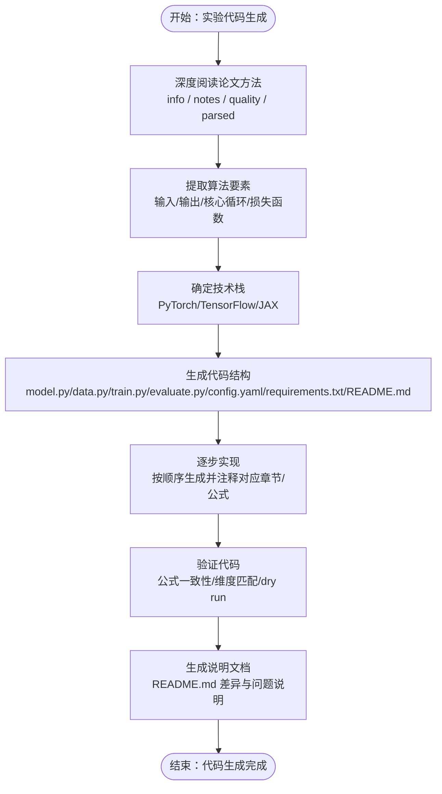

**图示来源**
- [plugin/skills/experiment-code/SKILL.md](file://plugin/skills/experiment-code/SKILL.md)

**章节来源**
- [plugin/skills/experiment-code/SKILL.md](file://plugin/skills/experiment-code/SKILL.md)

### 工作流：research-survey
- 流程要点：预检查、本地与arXiv搜索、关键词扩展、深度阅读关键论文、概念图谱分析、生成调研报告。
- 关键命令：stats、search、rag-search、arxiv-search、graph-query、classify。
- 数据产物：output/drafts/survey-<topic>.md。
- 与后续技能衔接：驱动paper-deep-dive、citation-network、research-gap。

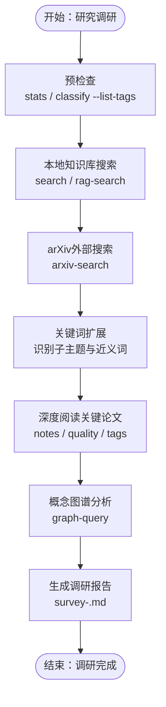

**图示来源**
- [plugin/skills/research-survey/SKILL.md](file://plugin/skills/research-survey/SKILL.md)

**章节来源**
- [plugin/skills/research-survey/SKILL.md](file://plugin/skills/research-survey/SKILL.md)

### 工作流：paper-deep-dive
- 流程要点：加载论文数据、深度阅读、质量评估、公式推导、引用网络分析、生成实验代码框架、输出深度分析报告。
- 关键命令：info、quality-score、cite-network、exp-setup（由MCP封装）。
- 数据产物：整合后的深度分析报告。
- 与后续技能衔接：驱动writing-pipeline、reproduce-paper、research-survey。

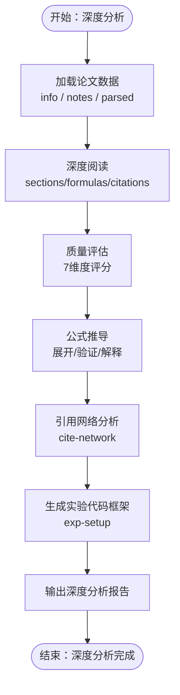

**图示来源**
- [plugin/skills/paper-deep-dive/SKILL.md](file://plugin/skills/paper-deep-dive/SKILL.md)

**章节来源**
- [plugin/skills/paper-deep-dive/SKILL.md](file://plugin/skills/paper-deep-dive/SKILL.md)

### 工作流：writing-pipeline
- 流程要点：主题调研、阅读关键论文笔记、撰写Related Work、撰写完整论文、LaTeX编译、自审报告。
- 关键命令：survey（由MCP封装）、export-bib、compile-paper（由MCP封装）。
- 数据产物：LaTeX文件与PDF。
- 与后续技能衔接：驱动reproduce-paper、paper-deep-dive、idea-to-paper。

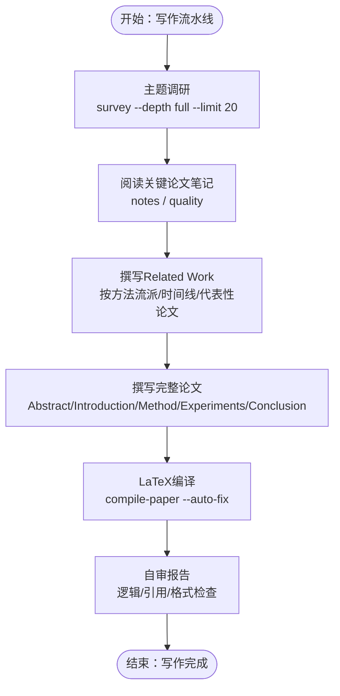

**图示来源**
- [plugin/skills/writing-pipeline/SKILL.md](file://plugin/skills/writing-pipeline/SKILL.md)

**章节来源**
- [plugin/skills/writing-pipeline/SKILL.md](file://plugin/skills/writing-pipeline/SKILL.md)

### 工作流：reproduce-paper
- 流程要点：深度阅读论文、配置运行环境、生成实验代码、下载数据集、运行实验、对比结果、调试失败。
- 关键命令：info、exp-setup（由MCP封装）、exp-run（由MCP封装）、exp-compare（由MCP封装）、exp-debug（由MCP封装）、dataset-download（由MCP封装）。
- 数据产物：实验运行日志与结果对比报告。
- 与后续技能衔接：驱动writing-pipeline、paper-deep-dive、idea-to-paper。

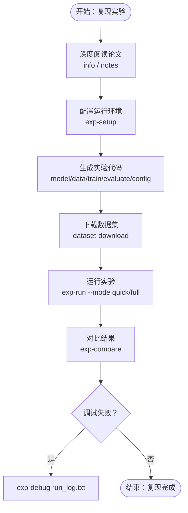

**图示来源**
- [plugin/skills/reproduce-paper/SKILL.md](file://plugin/skills/reproduce-paper/SKILL.md)

**章节来源**
- [plugin/skills/reproduce-paper/SKILL.md](file://plugin/skills/reproduce-paper/SKILL.md)

### 工作流：idea-to-paper
- 流程要点：点子明确化、文献调研、研究Gap分析、方法设计、实验设计、代码实现与实验、论文撰写、自审与修改。
- 关键命令：survey（由MCP封装）、exp-setup（由MCP封装）、exp-run（由MCP封装）、exp-compare（由MCP封装）、compile-paper（由MCP封装）。
- 数据产物：完整论文草稿与修改建议。
- 与后续技能衔接：完成端到端流程后准备投稿与扩展实验。

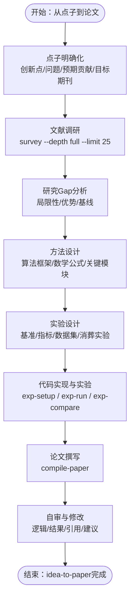

**图示来源**
- [plugin/skills/idea-to-paper/SKILL.md](file://plugin/skills/idea-to-paper/SKILL.md)

**章节来源**
- [plugin/skills/idea-to-paper/SKILL.md](file://plugin/skills/idea-to-paper/SKILL.md)

### 工作流：kb-management
- 流程要点：知识库健康检查、自动更新（kb-update）、元数据回填、补全缺失字段、引用解析与图谱同步、RAG索引同步、输出维护报告。
- 关键命令：stats、scan、kb-update（由MCP封装）、batch-ingest（由MCP封装）、metadata-enrich（由MCP封装）、year-fix（由MCP封装）、author-fix（由MCP封装）、cite-resolve（由MCP封装）、graph-build（由MCP封装）、rag-index（由MCP封装）。
- 数据产物：维护报告与同步后的知识库状态。
- 与后续技能衔接：驱动research-survey、paper-deep-dive。

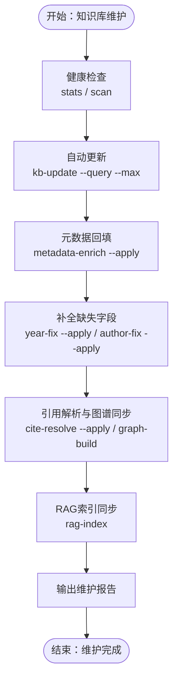

**图示来源**
- [plugin/skills/kb-management/SKILL.md](file://plugin/skills/kb-management/SKILL.md)

**章节来源**
- [plugin/skills/kb-management/SKILL.md](file://plugin/skills/kb-management/SKILL.md)

## 依赖分析
- 外部服务依赖
  - PostgreSQL：存储论文元数据、章节、公式、引用关系。
  - Neo4j：引用网络与概念图谱查询。
  - arXiv API：扩展搜索与arXiv下载。
  - 智谱Embedding API：RAG语义检索。
- MCP与CLI耦合
  - scholar_mcp/server.py 将scholar/cli.py命令封装为MCP工具，供Qoder IDE调用。
  - plugin/mcp.json 定义MCP服务器启动命令、参数与环境变量（PostgreSQL/Neo4j连接）。

**更新** v2.0版本保持了相同的外部依赖结构，但通过优化的执行层架构提高了系统整体性能和稳定性。

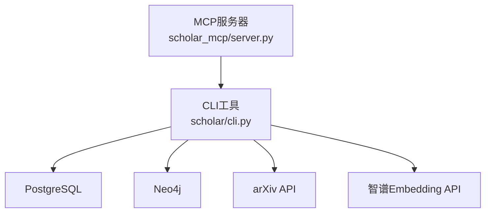

**图示来源**
- [scholar_mcp/server.py](file://scholar_mcp/server.py)
- [scholar/cli.py](file://scholar/cli.py)
- [plugin/CONNECTORS.md](file://plugin/CONNECTORS.md)
- [plugin/mcp.json](file://plugin/mcp.json)

**章节来源**
- [plugin/CONNECTORS.md](file://plugin/CONNECTORS.md)
- [plugin/mcp.json](file://plugin/mcp.json)

## 性能考虑
- 批量解析与预处理：parse-all与auto-notes、quality-score、classify等命令支持批量执行，注意I/O与数据库写入的并发控制。
- 图谱构建与中心度计算：graph-build与graph-stats涉及大量图遍历，建议在专用资源的Neo4j实例上运行。
- RAG索引：rag-index依赖外部Embedding API，注意API配额与重试策略。
- 实验执行：exp-run支持quick/full模式与超时保护，建议合理配置GPU/CPU资源与数据集大小。
- 编译与导出：compile-paper具备自动修复机制，建议在CI/CD中缓存依赖以提升速度。

**更新** v2.0版本通过架构重组优化了性能表现，新增的执行层命令提供了更好的资源管理和执行控制能力。

## 故障排查指南
- CLI命令失败
  - 使用dry-run选项（如--apply）谨慎应用变更，先预览结果。
  - 检查数据库连接状态与权限（PostgreSQL/Neo4j）。
- MCP工具调用异常
  - 确认MCP服务器进程正常，检查plugin/mcp.json中的环境变量与端口映射。
  - 在Qoder IDE中查看MCP返回的stderr输出，定位具体错误。
- 图谱与网络分析
  - graph-build失败：确认Neo4j已启动并可访问，检查引用解析与中心度计算日志。
- 实验复现
  - exp-debug自动诊断常见错误（模块导入、CUDA OOM、文件缺失），按建议修复。
- 知识库维护
  - kb-update与batch-ingest失败：检查arXiv下载、解析与图谱同步的日志，必要时分批执行。

**更新** v2.0版本增强了故障排查能力，新增的执行层命令提供了更详细的执行状态监控和错误诊断功能。

**章节来源**
- [scholar_mcp/server.py](file://scholar_mcp/server.py)
- [scholar/cli.py](file://scholar/cli.py)
- [plugin/CONNECTORS.md](file://plugin/CONNECTORS.md)

## 结论
研究技能系统以"技能即流程"为核心，通过8项原子技能与6项工作流，形成从论文入库、解析、验证、推荐、网络分析、缺口发现，到写作、复现与从点子到论文的完整研究闭环。MCP协议与Qoder IDE的集成使得技能工具可被IDE直接调用，极大提升了研究效率。遵循本文档的配置、开发与调试指南，可快速扩展新的技能并融入现有工作流。

**更新** v2.0版本通过架构重组实现了更高的执行效率和更好的系统稳定性，14个核心技能的精简设计确保了系统的易用性和可维护性。新增的6个执行层命令进一步增强了系统的控制能力和执行灵活性。

## 附录
- 技能开发指南
  - 新增技能：在plugin/.qoder/skills/<new-skill>/SKILL.md中定义触发、前置条件、流程与下一步动作。
  - 集成CLI：在scholar/cli.py中新增命令或复用现有命令；在scholar_mcp/server.py中注册MCP工具。
  - 测试与调试：使用dry-run选项与单测，结合MCP日志与IDE输出定位问题。
- MCP与Qoder IDE集成
  - 启动MCP服务器：python -m scholar_mcp，或通过Qoder IDE的MCP面板管理。
  - 配置环境变量：在plugin/mcp.json中设置PostgreSQL/Neo4j连接参数。
- 最佳实践
  - 数据一致性：优先使用本地解析数据（TeX源码级精度），缺失时再回退到arXiv。
  - 可重复性：实验代码生成与复现流程标准化，严格标注对应论文章节与公式。
  - 可扩展性：将常用命令抽象为MCP工具，统一入口便于IDE集成与自动化。
  - 版本兼容性：遵循v2.0架构规范，确保新技能与现有工作流的兼容性。

**更新** v2.0版本提供了更完善的开发指南和最佳实践，确保开发者能够充分利用新架构的优势进行技能扩展和系统优化。