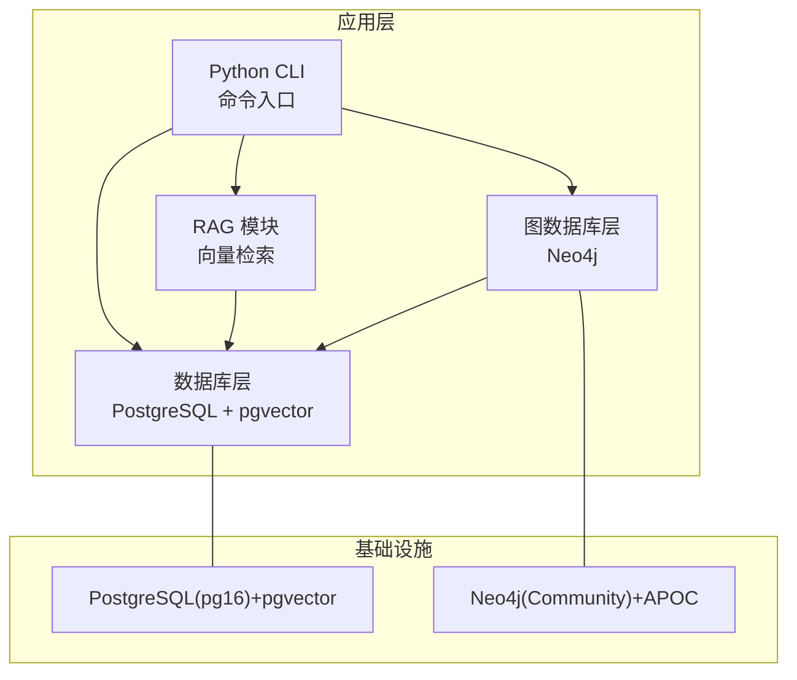
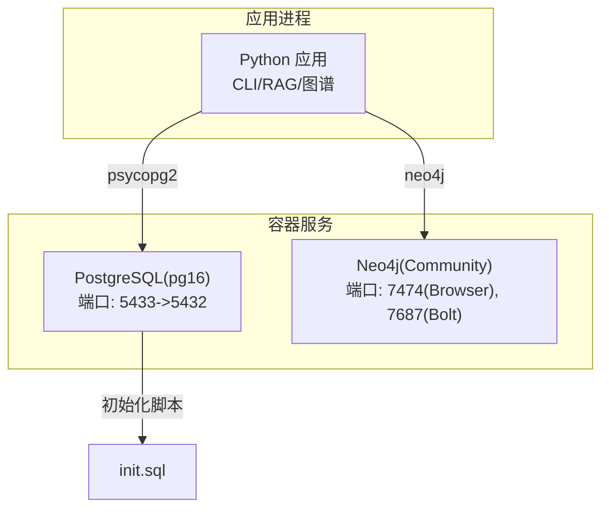
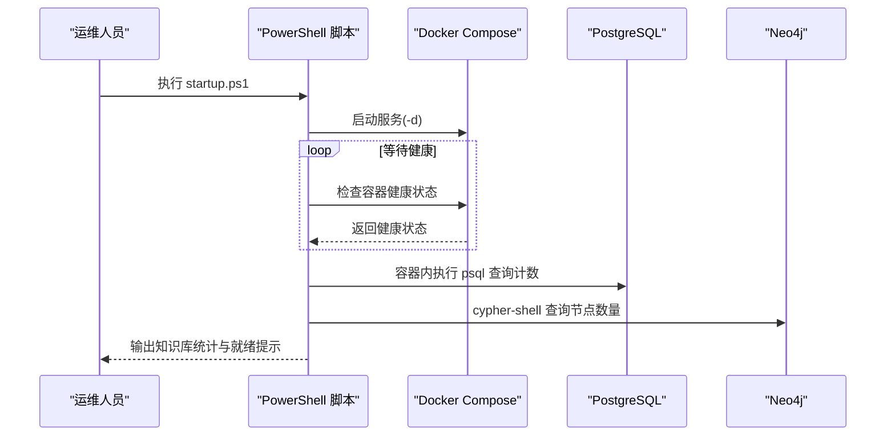
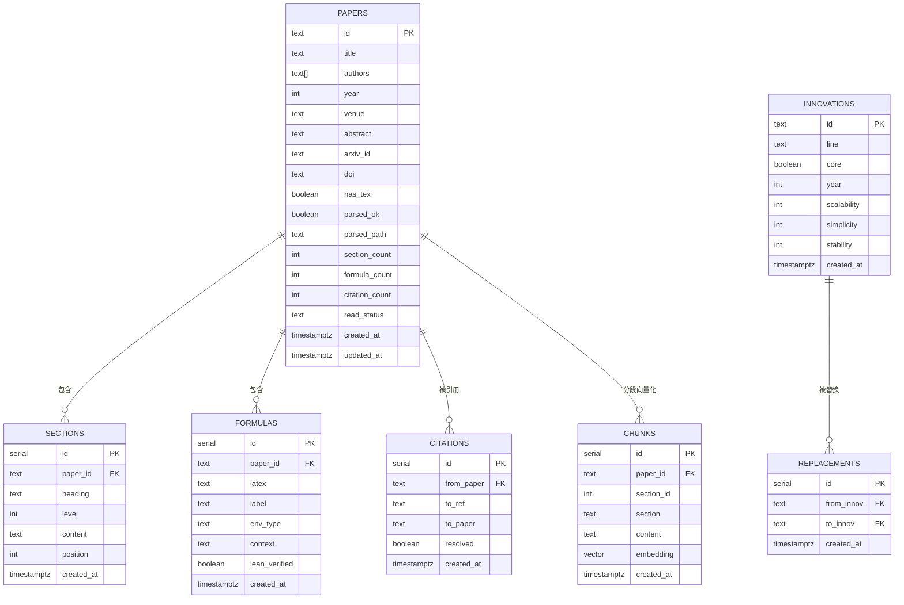
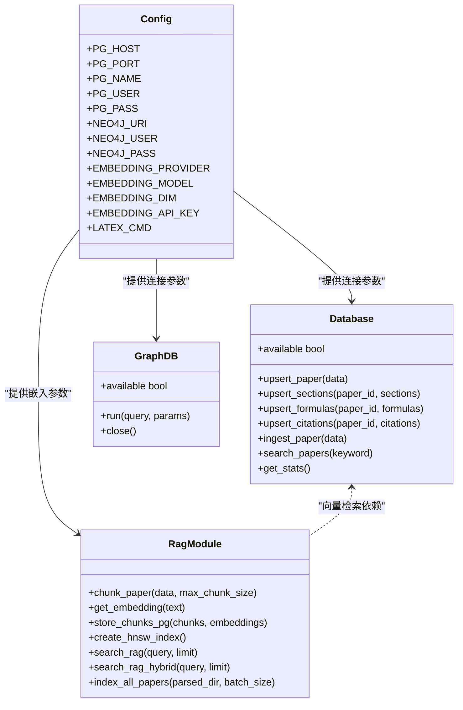
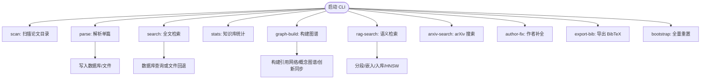
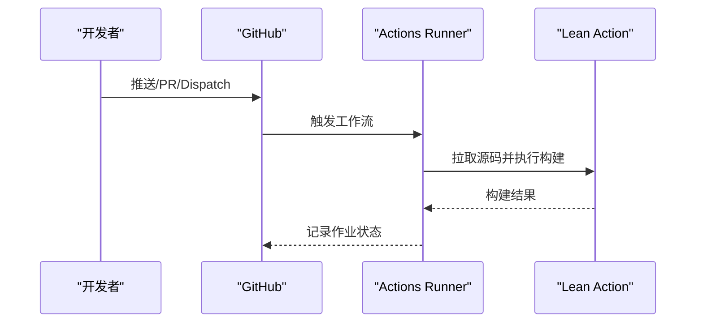
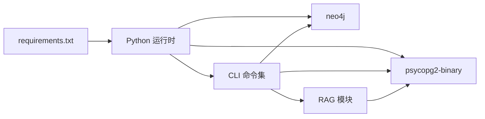

# 部署与运维

<cite>
**本文引用的文件**
- [docker-compose.yml](file://infra/docker-compose.yml)
- [init.sql](file://infra/init.sql)
- [startup.ps1](file://startup.ps1)
- [requirements.txt](file://requirements.txt)
- [config.py](file://scholar/config.py)
- [db.py](file://scholar/db.py)
- [graph_db.py](file://scholar/graph_db.py)
- [rag.py](file://scholar/rag.py)
- [cli.py](file://scholar/cli.py)
- [lean_action_ci.yml](file://LEAN/.github/workflows/lean_action_ci.yml)
- [lakefile.toml](file://LEAN/lakefile.toml)
- [README.md](file://LEAN/README.md)
</cite>

## 目录
1. [简介](#简介)
2. [项目结构](#项目结构)
3. [核心组件](#核心组件)
4. [架构总览](#架构总览)
5. [详细组件分析](#详细组件分析)
6. [依赖关系分析](#依赖关系分析)
7. [性能考量](#性能考量)
8. [故障排除指南](#故障排除指南)
9. [结论](#结论)
10. [附录](#附录)

## 简介
本指南面向部署与运维团队，提供从开发到生产的全栈操作手册，涵盖容器化部署（Docker Compose）、生产环境配置、基础设施管理、CI/CD 流水线、自动化测试与持续集成策略、监控与日志、性能分析、故障排除、备份与灾难恢复、扩展与高可用设计、以及安全与合规建议。读者可据此快速搭建稳定、可观测、可扩展的研究知识库平台。

## 项目结构
项目采用多语言混合架构：后端以 Python 为主，提供 CLI 工具、数据库访问层、RAG 向量化检索、Neo4j 图谱构建与查询；数据库层使用 PostgreSQL + pgvector 存储结构化元数据与向量索引；图数据库使用 Neo4j 构建引用网络与概念图谱；Lean4 项目用于形式化验证与创新节点同步；通过 Docker Compose 统一编排依赖服务。

图表来源
- [docker-compose.yml:1-44](file://infra/docker-compose.yml#L1-L44)
- [config.py:39-62](file://scholar/config.py#L39-L62)
- [db.py:24-74](file://scholar/db.py#L24-L74)
- [graph_db.py:32-70](file://scholar/graph_db.py#L32-L70)
- [rag.py:100-289](file://scholar/rag.py#L100-L289)

章节来源
- [docker-compose.yml:1-44](file://infra/docker-compose.yml#L1-L44)
- [requirements.txt:1-9](file://requirements.txt#L1-L9)
- [config.py:1-62](file://scholar/config.py#L1-L62)

## 核心组件
- 容器编排与依赖服务
  - PostgreSQL + pgvector：结构化元数据与向量检索，初始化 SQL 定义表结构与索引。
  - Neo4j Community：图谱构建与查询，启用 APOC 插件。
- 应用与数据层
  - Python CLI：扫描、解析、搜索、统计、图谱构建、RAG 索引等。
  - 数据库层：封装 psycopg2，支持文件回退模式。
  - 图数据库层：封装 neo4j 驱动，提供图谱构建与查询。
  - RAG 模块：分段、嵌入、向量入库、HNSW 近似检索、BM25 关键词检索与融合排序。
- Lean4 集成
  - 通过 CI 工作流与 Lake 构建系统维护 Lean4 包与目标。

章节来源
- [init.sql:1-131](file://infra/init.sql#L1-L131)
- [config.py:39-62](file://scholar/config.py#L39-L62)
- [db.py:24-270](file://scholar/db.py#L24-L270)
- [graph_db.py:32-922](file://scholar/graph_db.py#L32-L922)
- [rag.py:25-582](file://scholar/rag.py#L25-L582)
- [lean_action_ci.yml:1-15](file://LEAN/.github/workflows/lean_action_ci.yml#L1-L15)
- [lakefile.toml:1-11](file://LEAN/lakefile.toml#L1-L11)

## 架构总览
下图展示容器内服务、应用与数据层之间的交互关系，以及关键依赖与端口映射。

图表来源
- [docker-compose.yml:3-39](file://infra/docker-compose.yml#L3-L39)
- [init.sql:1-131](file://infra/init.sql#L1-L131)
- [config.py:39-62](file://scholar/config.py#L39-L62)

## 详细组件分析

### 容器化部署与启动流程
- 使用 Docker Compose 启动 PostgreSQL 与 Neo4j，并挂载初始化 SQL 与持久化卷。
- 提供一键启动脚本，自动等待服务健康检查并通过容器内命令进行基础状态校验。
- 建议在生产中使用独立的网络与资源限制，结合外部反向代理与证书管理。

图表来源
- [startup.ps1:11-65](file://startup.ps1#L11-L65)
- [docker-compose.yml:1-44](file://infra/docker-compose.yml#L1-L44)

章节来源
- [startup.ps1:1-65](file://startup.ps1#L1-L65)
- [docker-compose.yml:1-44](file://infra/docker-compose.yml#L1-L44)

### 数据库初始化与模式定义
- 初始化脚本创建扩展、核心表、索引与向量字段，确保后续 RAG 向量检索可用。
- 表结构覆盖论文元数据、章节、公式、引用、概念、论文-概念关联、创新节点与替换关系等。

图表来源
- [init.sql:9-131](file://infra/init.sql#L9-L131)

章节来源
- [init.sql:1-131](file://infra/init.sql#L1-L131)

### Python 应用与配置
- 配置加载：通过环境变量控制数据库与图数据库连接参数、RAG 提供商与模型、LaTeX 编译命令、Lean4 项目路径等。
- 数据库层：提供 UPSERT、全文检索、统计查询等能力；当无法连接时回退至文件模式。
- 图数据库层：封装连接、会话与查询，提供引用网络、概念图谱与创新节点同步。
- RAG 模块：分段策略、批量嵌入、向量入库、HNSW 近似检索、BM25 关键词检索与 RRF 融合。

图表来源
- [config.py:39-62](file://scholar/config.py#L39-L62)
- [db.py:24-270](file://scholar/db.py#L24-L270)
- [graph_db.py:32-922](file://scholar/graph_db.py#L32-L922)
- [rag.py:25-582](file://scholar/rag.py#L25-L582)

章节来源
- [config.py:1-62](file://scholar/config.py#L1-L62)
- [db.py:1-270](file://scholar/db.py#L1-L270)
- [graph_db.py:1-922](file://scholar/graph_db.py#L1-L922)
- [rag.py:1-582](file://scholar/rag.py#L1-L582)

### CLI 命令与工作流
- 常用命令：扫描、解析、搜索、统计、导出、arXiv 搜索、图谱构建与统计、作者补全等。
- 一键启动脚本：自动拉起容器、等待健康、执行基础状态检查并输出常用命令提示。

图表来源
- [cli.py:45-800](file://scholar/cli.py#L45-L800)
- [startup.ps1:46-65](file://startup.ps1#L46-L65)

章节来源
- [cli.py:1-800](file://scholar/cli.py#L1-L800)
- [startup.ps1:1-65](file://startup.ps1#L1-L65)

### CI/CD 流水线与构建
- Lean4 CI：基于 GitHub Actions 的 Lean Action，触发条件包括推送、拉取请求与手动触发。
- Lake 构建：定义包与可执行目标，便于本地与 CI 环境统一构建。

图表来源
- [lean_action_ci.yml:1-15](file://LEAN/.github/workflows/lean_action_ci.yml#L1-L15)
- [lakefile.toml:1-11](file://LEAN/lakefile.toml#L1-L11)

章节来源
- [lean_action_ci.yml:1-15](file://LEAN/.github/workflows/lean_action_ci.yml#L1-L15)
- [lakefile.toml:1-11](file://LEAN/lakefile.toml#L1-L11)
- [README.md:1-1](file://LEAN/README.md#L1-L1)

## 依赖关系分析
- 外部依赖
  - Python 依赖：typer、rich、psycopg2-binary、neo4j、python-dotenv、PyMuPDF、mcp 等。
  - 数据库：PostgreSQL 16 + pgvector 扩展。
  - 图数据库：Neo4j Community，启用 APOC 插件。
  - 嵌入服务：支持 智谱/ OpenAI API（需密钥）。
- 内部依赖
  - CLI 依赖配置模块读取环境变量，按需连接数据库与图数据库。
  - RAG 模块依赖数据库层提供分段与向量索引能力。
  - 图谱模块依赖解析后的 JSON 数据与 Lean4 创新节点定义。

图表来源
- [requirements.txt:1-9](file://requirements.txt#L1-L9)
- [config.py:39-62](file://scholar/config.py#L39-L62)
- [db.py:15-22](file://scholar/db.py#L15-L22)
- [graph_db.py:24-29](file://scholar/graph_db.py#L24-L29)
- [rag.py:100-176](file://scholar/rag.py#L100-L176)

章节来源
- [requirements.txt:1-9](file://requirements.txt#L1-L9)
- [config.py:1-62](file://scholar/config.py#L1-L62)
- [db.py:1-270](file://scholar/db.py#L1-L270)
- [graph_db.py:1-922](file://scholar/graph_db.py#L1-L922)
- [rag.py:1-582](file://scholar/rag.py#L1-L582)

## 性能考量
- 向量检索
  - 使用 HNSW 近似最近邻索引，结合余弦距离，提升大规模向量相似度检索性能。
  - 分批嵌入与入库，配合进度条与错误统计，降低单次任务失败影响。
- 关键词检索
  - 基于 BM25 的轻量级关键词检索作为补充，避免纯向量召回的语义偏差。
  - 可选 RRF 融合排序，综合向量与关键词得分。
- 数据库优化
  - 为关键列建立索引（如 chunks.embedding、sections.paper_id 等），减少查询延迟。
  - 使用连接池与上下文管理器，避免长连接泄漏。
- 图数据库优化
  - 在引用网络与概念图谱上建立节点与关系属性索引，加速查询与统计。
  - 对大规模图谱构建采用批处理与事务合并，减少往返开销。

章节来源
- [rag.py:214-289](file://scholar/rag.py#L214-L289)
- [init.sql:105-106](file://infra/init.sql#L105-L106)

## 故障排除指南
- 服务未就绪
  - 现象：启动脚本超时或健康检查失败。
  - 排查：检查容器日志、端口占用、初始化 SQL 是否成功执行。
  - 处理：确认凭据正确、卷挂载路径存在、内存参数满足 Neo4j 要求。
- 数据库连接失败
  - 现象：CLI 报告数据库不可用，回退到文件模式。
  - 排查：核对主机名、端口、数据库名、用户与密码；确认网络可达。
  - 处理：修复环境变量或 Docker 端口映射；重建数据库与扩展。
- 图数据库连接失败
  - 现象：图谱构建命令报错。
  - 排查：确认 Neo4j URI、认证与 Bolt 端口；检查 APOC 插件是否启用。
  - 处理：调整配置、重启容器、重新导入数据。
- RAG 索引异常
  - 现象：向量检索为空或 HNSW 创建失败。
  - 排查：确认嵌入 API 密钥有效、文本长度限制、向量维度一致。
  - 处理：清理旧索引、重建 HNSW、分批重索引。
- 常用命令
  - 查看知识库统计与状态：python -m scholar stats
  - 全量重置：python -m scholar bootstrap
  - 图谱构建：python -m scholar graph-build
  - 语义检索：python -m scholar rag-search "<query>"

章节来源
- [startup.ps1:17-65](file://startup.ps1#L17-L65)
- [config.py:39-62](file://scholar/config.py#L39-L62)
- [db.py:31-44](file://scholar/db.py#L31-L44)
- [graph_db.py:39-49](file://scholar/graph_db.py#L39-L49)
- [rag.py:214-289](file://scholar/rag.py#L214-L289)
- [cli.py:416-482](file://scholar/cli.py#L416-L482)

## 结论
本指南提供了从容器编排、数据库与图数据库初始化、应用配置与命令行工具、到 CI/CD 与性能优化的完整运维蓝图。通过标准化的环境变量、健康检查与一键启动脚本，可显著降低部署与运维复杂度；借助 HNSW、BM25 与 RRF 融合策略，实现高效且稳定的检索体验；完善的图谱构建与查询接口，支撑学术研究的知识网络探索。建议在生产环境中进一步完善监控、日志与备份策略，并结合企业安全与合规要求进行加固。

## 附录

### 环境变量清单（示例）
- 数据库相关
  - SCHOLAR_PG_HOST：PostgreSQL 主机
  - SCHOLAR_PG_PORT：PostgreSQL 端口
  - SCHOLAR_PG_NAME：数据库名
  - SCHOLAR_PG_USER：用户名
  - SCHOLAR_PG_PASS：密码
- 图数据库相关
  - SCHOLAR_NEO4J_URI：Neo4j Bolt 地址
  - SCHOLAR_NEO4J_USER：Neo4j 用户
  - SCHOLAR_NEO4J_PASS：Neo4j 密码
- RAG 嵌入相关
  - SCHOLAR_EMBEDDING_PROVIDER：zhipu 或 openai
  - SCHOLAR_EMBEDDING_MODEL：嵌入模型名称
  - SCHOLAR_EMBEDDING_DIM：嵌入维度
  - SCHOLAR_EMBEDDING_API_KEY：API 密钥
- 其他
  - SCHOLAR_LATEX_CMD：LaTeX 编译命令
  - SCHOLAR_LEAN_DIR：Lean4 项目目录

章节来源
- [config.py:39-62](file://scholar/config.py#L39-L62)

### 生产环境建议
- 网络与安全
  - 将数据库与图数据库置于隔离网络，仅暴露必要端口；启用 TLS 与强认证。
  - 使用反向代理与 WAF，限制访问来源与速率。
- 监控与日志
  - 收集容器标准输出与应用日志，结合指标（CPU/内存/磁盘/网络）与链路追踪。
  - 设置健康检查与告警阈值，覆盖数据库连接、图数据库可用性与检索延迟。
- 备份与恢复
  - 定期备份 PostgreSQL 与 Neo4j 卷；验证恢复流程与数据一致性。
  - 对 RAG 向量索引进行快照与增量备份，确保可回滚版本。
- 扩展与高可用
  - 数据库：主从复制、只读副本与连接池；图数据库：集群或高可用拓扑。
  - 应用：无状态化、水平扩展与负载均衡；缓存层（如 Redis）用于热点数据。
- 合规与审计
  - 数据最小化与去标识化；记录访问与变更审计日志；定期安全评估。