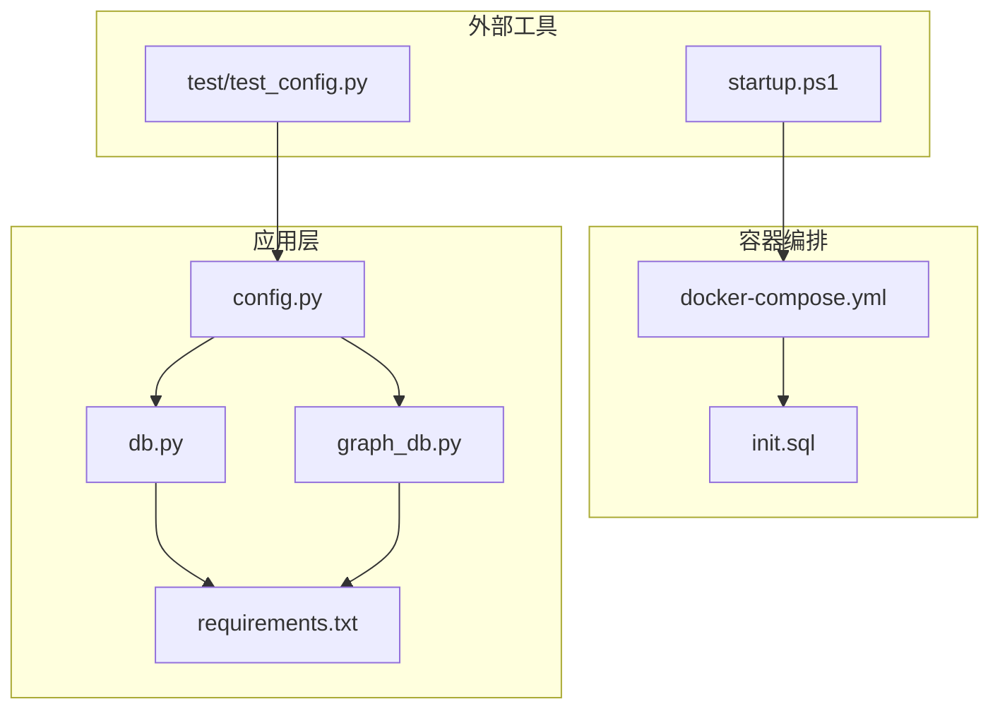
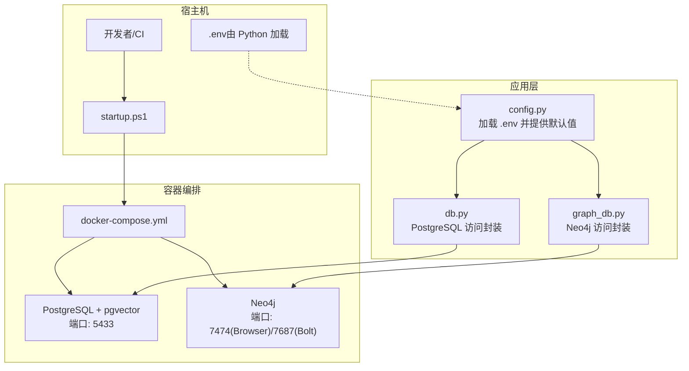
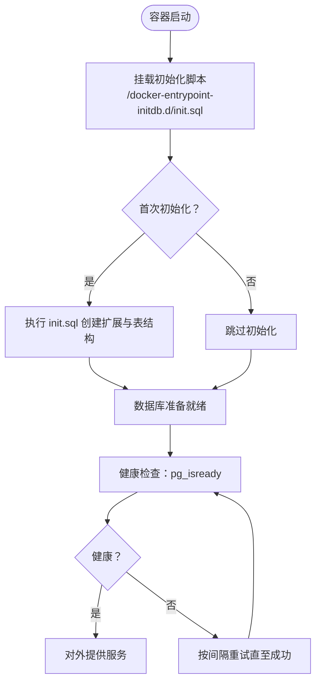
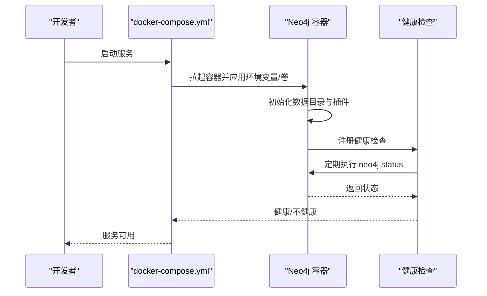
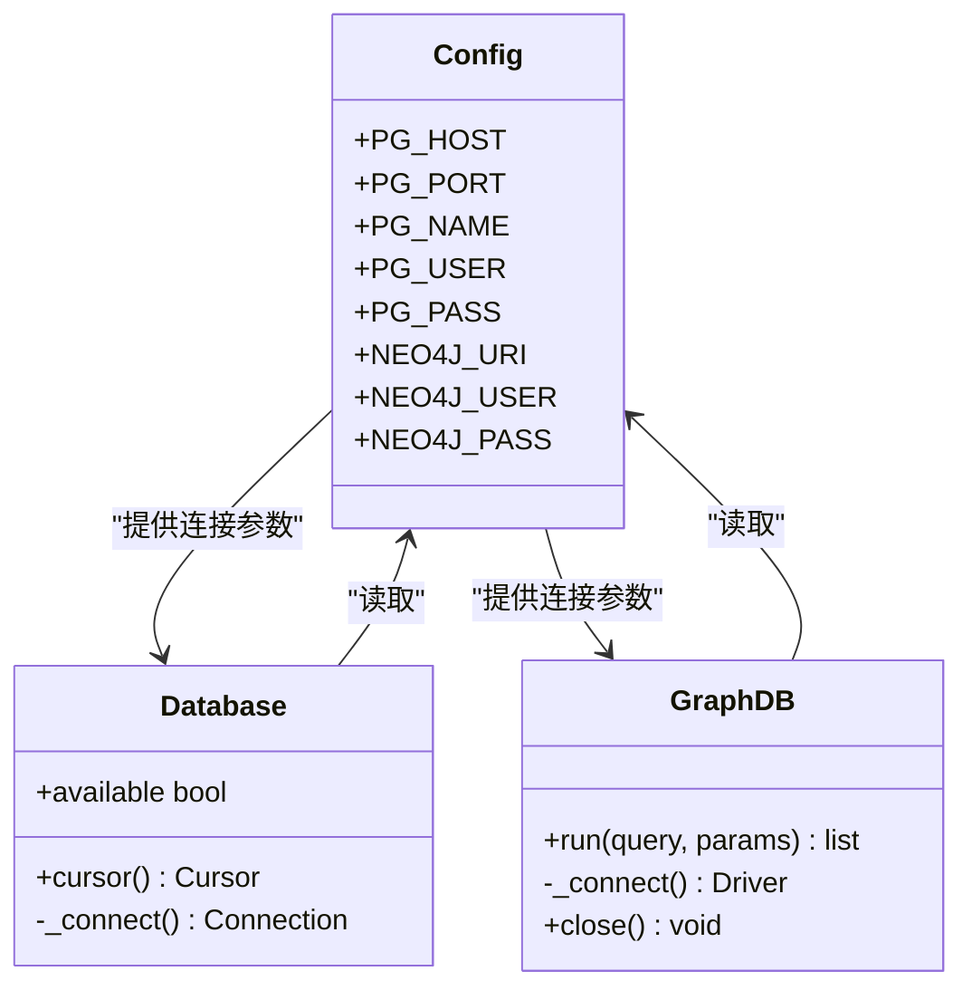
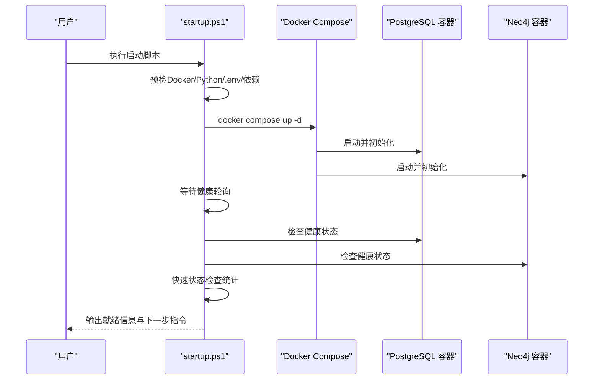
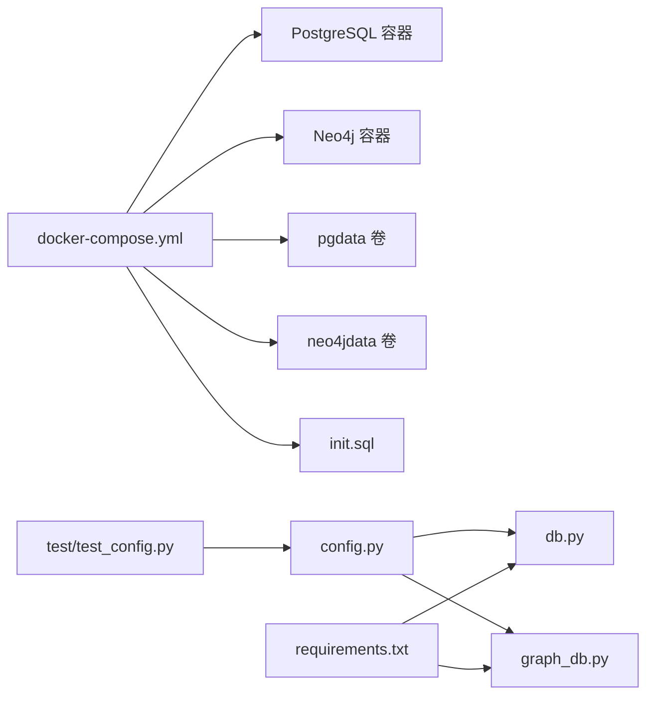

# 容器化部署

<cite>
**本文引用的文件**
- [docker-compose.yml](file://infra/docker-compose.yml)
- [init.sql](file://infra/init.sql)
- [startup.ps1](file://startup.ps1)
- [config.py](file://scholar/config.py)
- [db.py](file://scholar/db.py)
- [graph_db.py](file://scholar/graph_db.py)
- [requirements.txt](file://requirements.txt)
- [test_config.py](file://test/test_config.py)
</cite>

## 目录
1. [简介](#简介)
2. [项目结构](#项目结构)
3. [核心组件](#核心组件)
4. [架构总览](#架构总览)
5. [组件详解](#组件详解)
6. [依赖关系分析](#依赖关系分析)
7. [性能与资源规划](#性能与资源规划)
8. [故障排查指南](#故障排查指南)
9. [结论](#结论)
10. [附录](#附录)

## 简介
本指南面向在本地或开发环境中进行容器化部署的用户，围绕基于 Docker Compose 的 PostgreSQL + pgvector 与 Neo4j 图数据库服务，提供从配置解析、启动流程、健康检查到数据持久化与故障恢复的完整实施路径。文档同时结合项目中的 Python 配置模块与数据库访问层，帮助读者理解容器内外部的连接参数、默认值与可调参数。

## 项目结构
与容器化部署直接相关的目录与文件如下：
- infra/docker-compose.yml：定义 PostgreSQL 与 Neo4j 两个服务及其网络、端口、卷、环境变量与健康检查
- infra/init.sql：数据库初始化脚本，用于首次启动时创建扩展与表结构
- startup.ps1：一键启动脚本，负责预检、拉起容器、等待健康、快速状态检查与后续指引
- scholar/config.py：Python 端配置加载与默认值，包含数据库与图数据库的连接参数
- scholar/db.py：PostgreSQL 访问封装，体现连接参数来源与可用性检测逻辑
- scholar/graph_db.py：Neo4j 访问封装，体现连接参数来源与查询执行
- requirements.txt：Python 依赖清单，包含数据库驱动与图数据库驱动
- test/test_config.py：测试中对默认端口与连接 URI 的断言，辅助理解默认行为

图表来源
- [docker-compose.yml:1-44](file://infra/docker-compose.yml#L1-L44)
- [init.sql:1-131](file://infra/init.sql#L1-L131)
- [startup.ps1:1-125](file://startup.ps1#L1-L125)
- [config.py:44-61](file://scholar/config.py#L44-L61)
- [db.py:24-77](file://scholar/db.py#L24-L77)
- [graph_db.py:51-70](file://scholar/graph_db.py#L51-L70)
- [requirements.txt:1-14](file://requirements.txt#L1-L14)
- [test/test_config.py:31-39](file://test/test_config.py#L31-L39)

章节来源
- [docker-compose.yml:1-44](file://infra/docker-compose.yml#L1-L44)
- [startup.ps1:1-125](file://startup.ps1#L1-L125)

## 核心组件
- PostgreSQL + pgvector（容器名：scholar-pg）
  - 镜像版本：pgvector/pgvector:pg16
  - 端口映射：主机 5433 -> 容器 5432
  - 环境变量：数据库名、用户名、密码
  - 卷：pgdata（持久化）、init.sql（初始化脚本挂载）
  - 健康检查：使用 pg_isready 检测数据库就绪
- Neo4j（容器名：scholar-neo4j）
  - 镜像版本：neo4j:5-community
  - 端口映射：浏览器 UI 7474、Bolt 7687
  - 环境变量：认证、插件 apoc、堆内存初始与最大值
  - 卷：neo4jdata（持久化）
  - 健康检查：通过 neo4j status 命令判断服务状态

章节来源
- [docker-compose.yml:3-19](file://infra/docker-compose.yml#L3-L19)
- [docker-compose.yml:22-39](file://infra/docker-compose.yml#L22-L39)

## 架构总览
下图展示容器编排、应用配置与数据库访问层之间的交互关系：

图表来源
- [startup.ps1:58-91](file://startup.ps1#L58-L91)
- [docker-compose.yml:1-44](file://infra/docker-compose.yml#L1-L44)
- [config.py:44-61](file://scholar/config.py#L44-L61)
- [db.py:24-77](file://scholar/db.py#L24-L77)
- [graph_db.py:51-70](file://scholar/graph_db.py#L51-L70)

## 组件详解

### PostgreSQL + pgvector 服务
- 镜像与容器命名
  - 使用 pgvector/pgvector:pg16，容器名为 scholar-pg
- 端口映射
  - 主机 5433 映射至容器 5432
- 环境变量
  - 数据库名、用户名、密码
- 卷与初始化
  - pgdata 持久化数据目录
  - 将 init.sql 挂载到 /docker-entrypoint-initdb.d/，实现首次启动时自动执行
- 健康检查
  - 使用 pg_isready 检测数据库可用性，间隔与重试次数设定合理

图表来源
- [docker-compose.yml:3-19](file://infra/docker-compose.yml#L3-L19)
- [init.sql:1-131](file://infra/init.sql#L1-L131)

章节来源
- [docker-compose.yml:3-19](file://infra/docker-compose.yml#L3-L19)
- [init.sql:1-131](file://infra/init.sql#L1-L131)

### Neo4j 服务
- 镜像与容器命名
  - 使用 neo4j:5-community，容器名为 scholar-neo4j
- 端口映射
  - 7474（Browser UI）、7687（Bolt）
- 环境变量
  - 默认认证凭据
  - 启用 APOC 插件
  - 设置初始与最大堆内存大小
- 卷与持久化
  - neo4jdata 持久化数据目录
- 健康检查
  - 通过 neo4j status 命令判断服务状态

图表来源
- [docker-compose.yml:22-39](file://infra/docker-compose.yml#L22-L39)

章节来源
- [docker-compose.yml:22-39](file://infra/docker-compose.yml#L22-L39)

### 应用侧连接参数与默认值
- PostgreSQL 连接参数
  - 来源：config.py 中的环境变量加载与默认值
  - 关键字段：主机、端口、数据库名、用户名、密码
- Neo4j 连接参数
  - 来源：config.py 中的 URI、用户名、密码
- Python 依赖
  - 包含 PostgreSQL 与 Neo4j 的官方驱动，确保连接可用

图表来源
- [config.py:44-61](file://scholar/config.py#L44-L61)
- [db.py:24-77](file://scholar/db.py#L24-L77)
- [graph_db.py:51-70](file://scholar/graph_db.py#L51-L70)

章节来源
- [config.py:44-61](file://scholar/config.py#L44-L61)
- [db.py:24-77](file://scholar/db.py#L24-L77)
- [graph_db.py:51-70](file://scholar/graph_db.py#L51-L70)
- [requirements.txt:3-6](file://requirements.txt#L3-L6)

### 启动流程与服务发现
- 一键启动脚本
  - 预检：Docker 可用性、Python 可用性、.env 文件存在性、依赖安装
  - 启动：进入 infra 目录，执行 docker compose up -d
  - 等待健康：轮询检查两个容器的健康状态
  - 快速状态检查：通过容器内命令统计 papers/chunks 与 Neo4j 节点数
- 服务发现
  - 容器间通过默认网络互通；应用侧通过 config.py 提供的默认主机名与端口进行连接

图表来源
- [startup.ps1:58-104](file://startup.ps1#L58-L104)

章节来源
- [startup.ps1:1-125](file://startup.ps1#L1-L125)

## 依赖关系分析
- 容器编排依赖
  - docker-compose.yml 定义了两个服务、卷与健康检查
  - init.sql 作为初始化脚本被挂载到 PostgreSQL 容器
- 应用层依赖
  - config.py 从 .env 加载变量并提供默认值
  - db.py 与 graph_db.py 分别封装 PostgreSQL 与 Neo4j 的连接与查询
  - requirements.txt 指定数据库驱动依赖
- 测试与验证
  - test/test_config.py 断言默认端口与连接 URI，辅助理解默认行为

图表来源
- [docker-compose.yml:1-44](file://infra/docker-compose.yml#L1-L44)
- [init.sql:1-131](file://infra/init.sql#L1-L131)
- [config.py:44-61](file://scholar/config.py#L44-L61)
- [db.py:24-77](file://scholar/db.py#L24-L77)
- [graph_db.py:51-70](file://scholar/graph_db.py#L51-L70)
- [requirements.txt:3-6](file://requirements.txt#L3-L6)
- [test/test_config.py:31-39](file://test/test_config.py#L31-L39)

章节来源
- [docker-compose.yml:1-44](file://infra/docker-compose.yml#L1-L44)
- [config.py:44-61](file://scholar/config.py#L44-L61)
- [db.py:24-77](file://scholar/db.py#L24-L77)
- [graph_db.py:51-70](file://scholar/graph_db.py#L51-L70)
- [requirements.txt:3-6](file://requirements.txt#L3-L6)
- [test/test_config.py:31-39](file://test/test_config.py#L31-L39)

## 性能与资源规划
- 内存配置
  - Neo4j 通过环境变量设置了初始与最大堆内存，建议根据宿主机资源与数据规模调整
- 存储与持久化
  - 两个服务均配置了独立卷以实现数据持久化，避免容器重建导致数据丢失
- 健康检查与稳定性
  - 合理的健康检查间隔与重试次数有助于在启动阶段尽早暴露异常
- 连接参数与网络
  - 默认连接参数来自 config.py，若需跨主机或自定义网络，应在 .env 中覆盖对应变量

章节来源
- [docker-compose.yml:28-32](file://infra/docker-compose.yml#L28-L32)
- [config.py:44-61](file://scholar/config.py#L44-L61)

## 故障排查指南
- 启动脚本预检失败
  - Docker 未安装或未运行：参考脚本中的提示安装 Docker Desktop
  - Python 版本不足：按提示安装 Python 3.10+
  - .env 不存在：脚本会复制示例文件，请编辑后继续
  - 依赖缺失：按提示执行依赖安装命令
- 容器健康检查失败
  - PostgreSQL：确认初始化脚本无错误、卷权限正常、端口未被占用
  - Neo4j：确认认证凭据正确、插件启用、内存参数合理
- 应用侧连接失败
  - 检查 config.py 中的默认值与 .env 覆盖情况
  - 使用 db.py 与 graph_db.py 的可用性检测逻辑定位问题
- 快速状态核验
  - 启动脚本会输出 papers/chunks 数量与 Neo4j 节点数，便于快速判断数据导入与索引状态

章节来源
- [startup.ps1:14-56](file://startup.ps1#L14-L56)
- [startup.ps1:68-104](file://startup.ps1#L68-L104)
- [db.py:32-45](file://scholar/db.py#L32-L45)
- [graph_db.py:51-57](file://scholar/graph_db.py#L51-L57)

## 结论
通过 docker-compose.yml 的标准化编排、init.sql 的自动化初始化、startup.ps1 的一键启动与健康检查机制，以及 config.py 与数据库访问层的清晰参数来源，本项目实现了 PostgreSQL + pgvector 与 Neo4j 的稳定本地容器化部署。建议在生产或更大规模场景中进一步引入资源限制、备份策略与监控告警，并结合 .env 进行参数定制。

## 附录

### 环境变量与默认值对照
- PostgreSQL
  - 主机：默认 localhost
  - 端口：默认 5433
  - 数据库名：默认 scholar
  - 用户名：默认 scholar
  - 密码：默认 scholar2024
- Neo4j
  - URI：默认 bolt://localhost:7687
  - 用户名：默认 neo4j
  - 密码：默认 scholar2024
- RAG 嵌入
  - 提供商：默认 zhipu
  - 模型：默认 embedding-2
  - 维度：默认 1024
  - API Key：默认空

章节来源
- [config.py:44-61](file://scholar/config.py#L44-L61)

### 端口与卷一览
- PostgreSQL
  - 端口：5433:5432
  - 卷：pgdata
  - 初始化脚本：init.sql
- Neo4j
  - 端口：7474:7474、7687:7687
  - 卷：neo4jdata

章节来源
- [docker-compose.yml:6-14](file://infra/docker-compose.yml#L6-L14)
- [docker-compose.yml:25-34](file://infra/docker-compose.yml#L25-L34)

### 数据库初始化脚本作用
- 创建向量扩展
- 定义论文、章节、公式、引用、概念、论文-概念关联、嵌入块、创新与替换关系等表结构
- 为后续 RAG 与知识图谱功能提供基础数据模型

章节来源
- [init.sql:4-131](file://infra/init.sql#L4-L131)