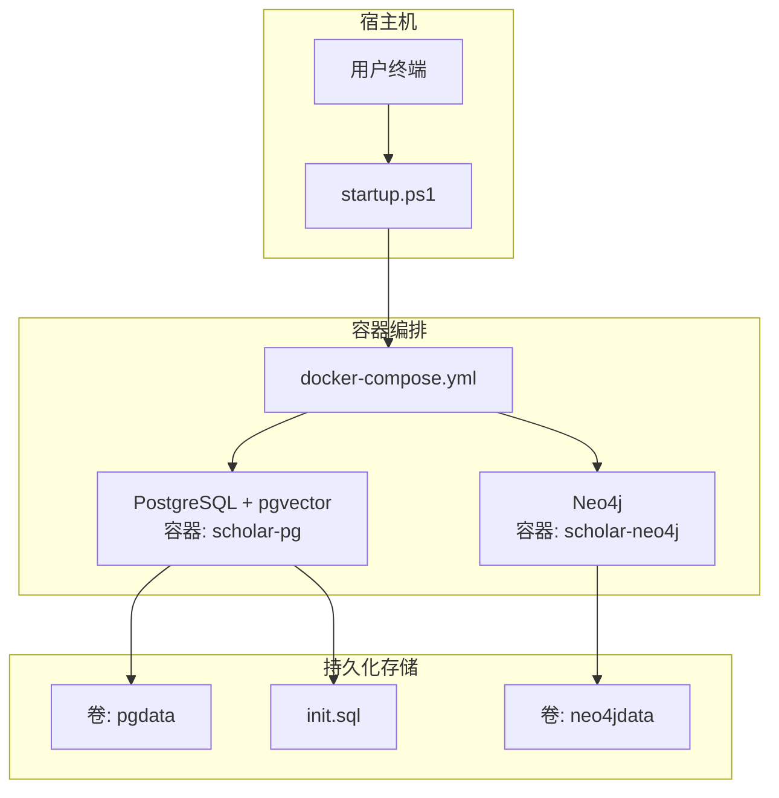
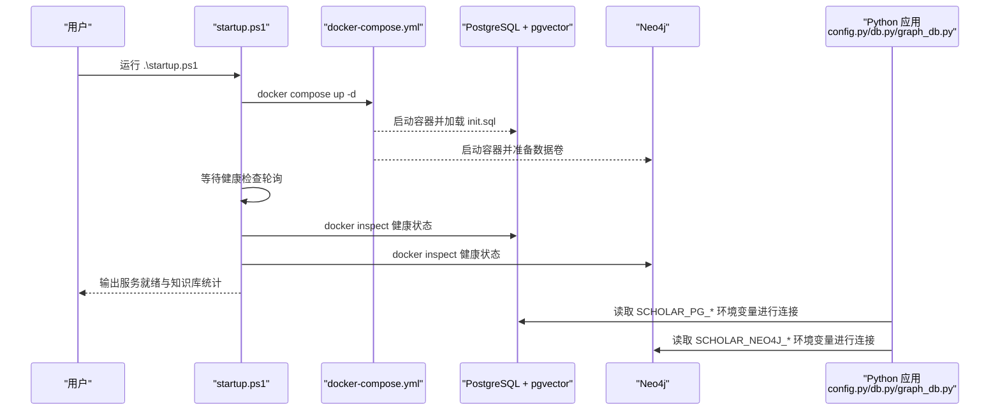
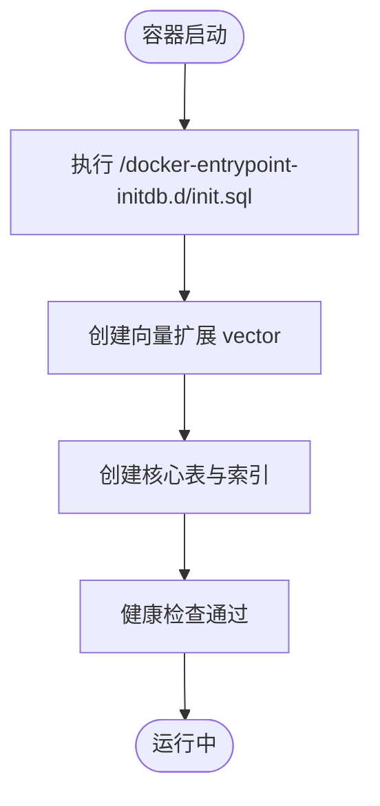
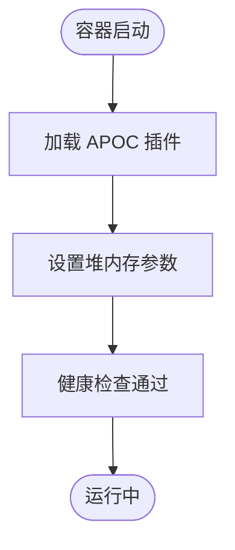
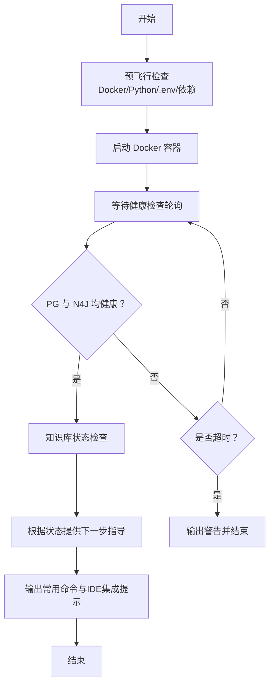
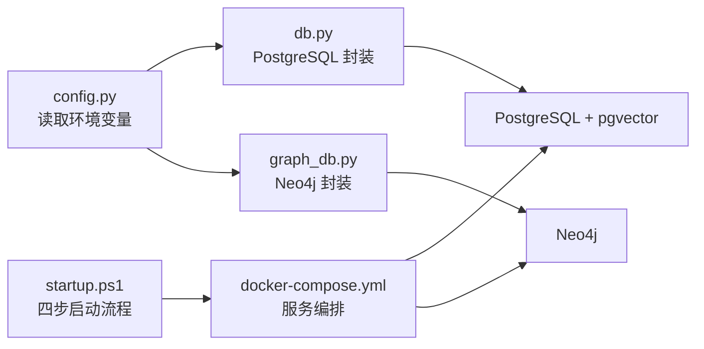

# 容器化部署

<cite>
**本文档引用的文件**
- [docker-compose.yml](file://infra/docker-compose.yml)
- [init.sql](file://infra/init.sql)
- [startup.ps1](file://startup.ps1)
- [requirements.txt](file://requirements.txt)
- [CONNECTORS.md](file://plugin/CONNECTORS.md)
- [config.py](file://scholar/config.py)
- [db.py](file://scholar/db.py)
- [graph_db.py](file://scholar/graph_db.py)
</cite>

## 目录
1. [简介](#简介)
2. [项目结构](#项目结构)
3. [核心组件](#核心组件)
4. [架构总览](#架构总览)
5. [详细组件分析](#详细组件分析)
6. [依赖关系分析](#依赖关系分析)
7. [性能考虑](#性能考虑)
8. [故障排查指南](#故障排查指南)
9. [结论](#结论)
10. [附录](#附录)

## 简介
本文件面向需要在本地或开发环境中快速搭建 Scholar Studio 的用户，提供完整的容器化部署说明。内容覆盖 docker-compose.yml 中 PostgreSQL+pgvector 与 Neo4j 两个核心服务的配置解析、环境变量与端口映射、数据卷策略、健康检查与资源限制、启动脚本的使用流程、服务间依赖与启动顺序、以及网络与安全建议。同时给出单机与可扩展部署的思路，并结合 Python 层配置与数据库层实现，帮助读者理解各组件如何协同工作。

**更新** 本版本重点更新了 startup.ps1 的四步启动流程，新增预飞行检查功能，包括 Docker 验证、Python 检测、.env 文件验证和依赖检查，以及知识库状态检查后的下一步指导。

## 项目结构
本项目的容器化部署主要位于 infra 目录，核心文件为 docker-compose.yml 与 init.sql；Python 应用通过 scholar/config.py 读取环境变量，连接数据库与图数据库；startup.ps1 提供一键启动与健康检查等待逻辑。

**图表来源**
- [docker-compose.yml:1-44](file://infra/docker-compose.yml#L1-L44)
- [init.sql:1-131](file://infra/init.sql#L1-131)

**章节来源**
- [docker-compose.yml:1-44](file://infra/docker-compose.yml#L1-L44)
- [init.sql:1-131](file://infra/init.sql#L1-131)

## 核心组件
- PostgreSQL + pgvector（scholar-pg）
  - 镜像：pgvector/pgvector:pg16
  - 端口映射：5433:5432
  - 环境变量：POSTGRES_DB、POSTGRES_USER、POSTGRES_PASSWORD
  - 数据卷：pgdata（数据库数据）、init.sql（初始化脚本）
  - 健康检查：pg_isready -U scholar，间隔5秒，最多重试5次
- Neo4j（scholar-neo4j）
  - 镜像：neo4j:5-community
  - 端口映射：7474:7474（浏览器UI）、7687:7687（Bolt协议）
  - 环境变量：认证、启用 APOC 插件、堆内存上限
  - 数据卷：neo4jdata
  - 健康检查：neo4j status，间隔10秒，最多重试5次

**章节来源**
- [docker-compose.yml:3-19](file://infra/docker-compose.yml#L3-L19)
- [docker-compose.yml:22-39](file://infra/docker-compose.yml#L22-L39)

## 架构总览
下图展示容器化部署的整体交互：Python 应用通过 scholar/config.py 读取环境变量，连接 PostgreSQL 与 Neo4j；docker-compose 启动服务并挂载数据卷；startup.ps1 等待健康检查通过后输出状态。

**图表来源**
- [startup.ps1:58-91](file://startup.ps1#L58-L91)
- [docker-compose.yml:3-19](file://infra/docker-compose.yml#L3-L19)
- [docker-compose.yml:22-39](file://infra/docker-compose.yml#L22-L39)
- [config.py:41-51](file://scholar/config.py#L41-L51)

## 详细组件分析

### PostgreSQL + pgvector 服务配置
- 镜像与版本：pgvector/pgvector:pg16
- 容器名：scholar-pg
- 端口映射：5433:5432（避免与宿主本地 PostgreSQL 冲突）
- 环境变量：
  - POSTGRES_DB：scholar
  - POSTGRES_USER：scholar
  - POSTGRES_PASSWORD：scholar2024
- 数据卷：
  - pgdata：持久化数据库数据
  - ./init.sql：容器首次启动时执行的初始化脚本
- 健康检查：
  - 使用 pg_isready -U scholar
  - 间隔：5 秒
  - 超时：5 秒
  - 重试：5 次
- 初始化脚本要点：
  - 创建向量扩展 vector
  - 定义 papers、sections、formulas、citations、concepts、paper_concepts、chunks、innovations、replacements 等表
  - 为关键列建立索引（如 idx_chunks_paper、idx_citations_to 等）

**图表来源**
- [docker-compose.yml:12-14](file://infra/docker-compose.yml#L12-L14)
- [init.sql:1-131](file://infra/init.sql#L1-131)

**章节来源**
- [docker-compose.yml:3-19](file://infra/docker-compose.yml#L3-L19)
- [init.sql:1-131](file://infra/init.sql#L1-131)

### Neo4j 图数据库配置
- 镜像与版本：neo4j:5-community
- 容器名：scholar-neo4j
- 端口映射：7474:7474（浏览器 UI）、7687:7687（Bolt 协议）
- 环境变量：
  - NEO4J_AUTH：neo4j/scholar2024
  - NEO4J_PLUGINS：["apoc"]
  - 堆内存：initial 512m，max 1G
- 数据卷：neo4jdata
- 健康检查：
  - 使用 neo4j status
  - 间隔：10 秒
  - 超时：10 秒
  - 重试：5 次

**图表来源**
- [docker-compose.yml:22-39](file://infra/docker-compose.yml#L22-L39)

**章节来源**
- [docker-compose.yml:22-39](file://infra/docker-compose.yml#L22-L39)

### 环境变量与连接配置
- PostgreSQL 连接参数（默认值来自环境变量）：
  - 主机：SCHOLAR_PG_HOST，默认 localhost
  - 端口：SCHOLAR_PG_PORT，默认 5433
  - 数据库名：SCHOLAR_PG_NAME，默认 scholar
  - 用户：SCHOLAR_PG_USER，默认 scholar
  - 密码：SCHOLAR_PG_PASS，默认 scholar2024
- Neo4j 连接参数（默认值来自环境变量）：
  - URI：SCHOLAR_NEO4J_URI，默认 bolt://localhost:7687
  - 用户：SCHOLAR_NEO4J_USER，默认 neo4j
  - 密码：SCHOLAR_NEO4J_PASS，默认 scholar2024
- RAG Embedding（可选）：
  - 提供方：SCHOLAR_EMBEDDING_PROVIDER，默认 zhipu
  - 模型：SCHOLAR_EMBEDDING_MODEL，默认 embedding-2
  - 维度：SCHOLAR_EMBEDDING_DIM，默认 1024
  - API Key：SCHOLAR_EMBEDDING_API_KEY（需自行配置）

**章节来源**
- [config.py:41-57](file://scholar/config.py#L41-L57)
- [config.py:48-51](file://scholar/config.py#L48-L51)

### 端口映射规则
- PostgreSQL：5433:5432（避免与宿主本地 PostgreSQL 冲突）
- Neo4j：
  - 7474:7474（浏览器 UI）
  - 7687:7687（Bolt 协议）

**章节来源**
- [docker-compose.yml:6-27](file://infra/docker-compose.yml#L6-L27)
- [CONNECTORS.md:8-19](file://plugin/CONNECTORS.md#L8-L19)

### 数据卷挂载策略
- PostgreSQL：
  - pgdata：持久化数据库数据目录
  - ./init.sql：容器首次启动时执行的初始化脚本
- Neo4j：
  - neo4jdata：持久化图数据库数据目录

**章节来源**
- [docker-compose.yml:12-14](file://infra/docker-compose.yml#L12-L14)
- [docker-compose.yml:33-34](file://infra/docker-compose.yml#L33-L34)

### 健康检查机制
- PostgreSQL：
  - 测试命令：pg_isready -U scholar
  - 间隔：5 秒
  - 超时：5 秒
  - 重试：5 次
- Neo4j：
  - 测试命令：neo4j status
  - 间隔：10 秒
  - 超时：10 秒
  - 重试：5 次

**章节来源**
- [docker-compose.yml:15-19](file://infra/docker-compose.yml#L15-L19)
- [docker-compose.yml:35-39](file://infra/docker-compose.yml#L35-L39)

### 资源限制配置
- 当前 compose 配置未显式设置 CPU/内存限制。若需限制，可在服务定义中添加 deploy.resources.limits（适用于 Swarm）或在 docker run 中使用 --memory/--cpus 等参数。注意：本仓库未提供现成的限制配置。

**章节来源**
- [docker-compose.yml:1-44](file://infra/docker-compose.yml#L1-L44)

### 启动脚本 startup.ps1 使用说明
**更新** startup.ps1 已升级为四步启动流程，包含全面的预飞行检查和智能引导：

#### 四步启动流程
1. **预飞行检查**（新增）
   - Docker 服务验证：确保 Docker 引擎正常运行
   - Python 环境检测：验证 Python 3.10+ 安装状态
   - .env 文件检查：自动创建配置文件并提示编辑
   - 依赖完整性验证：检查必需的 Python 包

2. **启动 Docker 容器**
   - 进入 infra 目录并执行 docker compose up -d
   - 自动切换工作目录确保路径正确

3. **健康检查等待**
   - 轮询 PostgreSQL（5433）与 Neo4j（7474/7687）健康状态
   - 最长等待 60 秒，3 秒间隔轮询
   - 显示实时等待进度信息

4. **知识库状态检查与下一步指导**
   - 查询 PostgreSQL 中 papers 和 chunks 表数量
   - 查询 Neo4j 节点总数
   - 根据知识库状态提供智能引导指令

#### 关键改进特性
- **智能依赖检查**：自动检测并提示缺失的 Python 依赖
- **自动配置管理**：.env 文件不存在时自动创建模板
- **知识库状态驱动的引导**：根据现有数据量提供相应的下一步操作
- **Qoder IDE 集成支持**：提供自然语言指令示例

#### 新增命令示例
- `python -m scholar bootstrap`：完整初始化（约40分钟）
- `python -m scholar kb-update --query 'topic' --max 5`：添加新论文
- `python -m scholar search 'query'`：全文搜索
- `python -m scholar stats`：知识库统计

#### Qoder IDE 集成
- 支持自然语言指令：调研 Transformer、精读 2401.04088、维护知识库
- 无缝集成 Scholar Studio 的所有功能

**图表来源**
- [startup.ps1:11-125](file://startup.ps1#L11-L125)

**章节来源**
- [startup.ps1:1-125](file://startup.ps1#L1-L125)

### 服务间依赖关系与启动顺序
- 依赖关系：
  - Python 应用依赖 PostgreSQL 与 Neo4j（可选）
  - docker-compose 通过健康检查保障服务可用性
- 启动顺序：
  1) 启动 PostgreSQL 容器并执行初始化脚本
  2) 启动 Neo4j 容器
  3) 启动脚本等待两者健康检查通过
  4) 执行应用侧的初始化与数据导入（如 bootstrap）

**章节来源**
- [startup.ps1:58-91](file://startup.ps1#L58-L91)
- [db.py:24-44](file://scholar/db.py#L24-L44)
- [graph_db.py:32-49](file://scholar/graph_db.py#L32-L49)

### 容器网络配置与安全设置
- 网络：
  - 默认使用 Docker 自管网络，容器间可通过服务名互联
  - 如需自定义网络，可在 docker-compose 中添加 networks 字段
- 安全：
  - 数据库凭据由容器内部管理，无需暴露到宿主 .env
  - Neo4j 默认启用认证（neo4j/scholar2024），建议在生产环境修改默认密码
  - 仅开放必要端口（5433、7474、7687），避免对外暴露
  - 建议使用只读卷与最小权限原则管理数据卷

**章节来源**
- [docker-compose.yml:8-11](file://infra/docker-compose.yml#L8-L11)
- [docker-compose.yml:28-32](file://infra/docker-compose.yml#L28-L32)
- [README.md:53-91](file://README.md#L53-L91)

### 单机部署与集群部署方案
- 单机部署：
  - 使用当前 docker-compose.yml 启动单实例 PostgreSQL 与 Neo4j
  - 适合本地开发与演示
- 集群部署（思路）：
  - PostgreSQL：可考虑主从复制或托管服务（如云数据库）
  - Neo4j：可采用 Neo4j 集群（Enterprise），或通过副本与备份策略提升可用性
  - 注意：本仓库未提供集群配置文件，以上为通用建议

**章节来源**
- [docker-compose.yml:1-44](file://infra/docker-compose.yml#L1-L44)

## 依赖关系分析
- Python 应用通过 scholar/config.py 读取环境变量，连接数据库与图数据库
- 数据库层（scholar/db.py）封装了 PostgreSQL 的连接与事务处理
- 图数据库层（scholar/graph_db.py）封装了 Neo4j 的连接与查询
- 启动脚本（startup.ps1）负责编排容器启动与健康检查等待

**图表来源**
- [config.py:41-57](file://scholar/config.py#L41-L57)
- [db.py:24-74](file://scholar/db.py#L24-L74)
- [graph_db.py:32-69](file://scholar/graph_db.py#L32-L69)
- [startup.ps1:58-91](file://startup.ps1#L58-L91)
- [docker-compose.yml:1-44](file://infra/docker-compose.yml#L1-L44)

**章节来源**
- [config.py:41-57](file://scholar/config.py#L41-L57)
- [db.py:24-74](file://scholar/db.py#L24-L74)
- [graph_db.py:32-69](file://scholar/graph_db.py#L32-L69)
- [startup.ps1:58-91](file://startup.ps1#L58-L91)
- [docker-compose.yml:1-44](file://infra/docker-compose.yml#L1-L44)

## 性能考虑
- PostgreSQL：
  - 初始与最大内存参数已在 compose 中设置，可根据实际负载调整
  - 建议为高频查询列建立合适索引（已有示例）
- Neo4j：
  - 堆内存上限已设定，建议结合数据规模与查询复杂度评估
  - 启用 APOC 插件以增强图算法能力
- 启动脚本：
  - 当前等待时间为 60 秒，可根据环境调整
  - 四步流程提高了启动成功率和用户体验
- 资源限制：
  - compose 未显式设置资源限制，建议按需添加

**章节来源**
- [docker-compose.yml:31-32](file://infra/docker-compose.yml#L31-L32)
- [startup.ps1:66-91](file://startup.ps1#L66-L91)

## 故障排查指南
- 健康检查失败：
  - 检查容器日志：docker compose logs pg 或 docker compose logs neo4j
  - 确认端口未被占用（5433、7474、7687）
  - 确认数据卷权限与磁盘空间充足
- 连接失败：
  - 核对 config.py 中的连接参数（主机、端口、用户名、密码）
  - 确保 Python 依赖已安装（requirements.txt）
- Neo4j 认证问题：
  - 初始密码为 scholar2024，建议尽快修改
- 启动脚本卡住：
  - 检查网络与 Docker 服务状态
  - 调整等待时间或手动执行 docker compose ps 查看状态
- 预飞行检查失败：
  - Docker 未安装：下载并安装 Docker Desktop
  - Python 缺失：安装 Python 3.10+ 并确保在 PATH 中
  - 依赖缺失：运行 `pip install -r requirements.txt`

**章节来源**
- [startup.ps1:14-56](file://startup.ps1#L14-L56)
- [startup.ps1:66-91](file://startup.ps1#L66-L91)
- [config.py:41-57](file://scholar/config.py#L41-L57)
- [requirements.txt:1-9](file://requirements.txt#L1-9)

## 结论
本容器化部署方案通过 docker-compose 快速拉起 PostgreSQL+pgvector 与 Neo4j，并配合升级版 startup.ps1 实现自动化启动与健康检查等待。新版本的四步启动流程包含全面的预飞行检查，显著提升了部署成功率和用户体验。Python 应用通过环境变量与数据库/图数据库封装模块实现稳定连接。建议在生产环境中补充资源限制、网络隔离与访问控制，并根据数据规模调优数据库参数。

## 附录
- 常用命令参考：
  - 启动：.\startup.ps1
  - 查看状态：docker compose ps
  - 查看日志：docker compose logs pg / neo4j
  - 进入容器：docker exec -it scholar-pg psql -U scholar -d scholar
  - 进入 Neo4j：docker exec -it scholar-neo4j cypher-shell -u neo4j -p scholar2024
- 环境变量示例（.env）：
  - SCHOLAR_EMBEDDING_API_KEY=your_api_key_here
  - 其他连接参数可按需覆盖默认值
- 新增功能命令：
  - `python -m scholar bootstrap`：完整初始化
  - `python -m scholar kb-update --query 'topic' --max 5`：增量更新
  - `python -m scholar search 'query'`：全文搜索
  - `python -m scholar stats`：知识库统计
- Qoder IDE 集成示例：
  - 调研 Transformer
  - 精读 2401.04088
  - 维护知识库

**章节来源**
- [startup.ps1:117-125](file://startup.ps1#L117-L125)
- [config.py:53-57](file://scholar/config.py#L53-L57)
- [README.md:53-91](file://README.md#L53-L91)