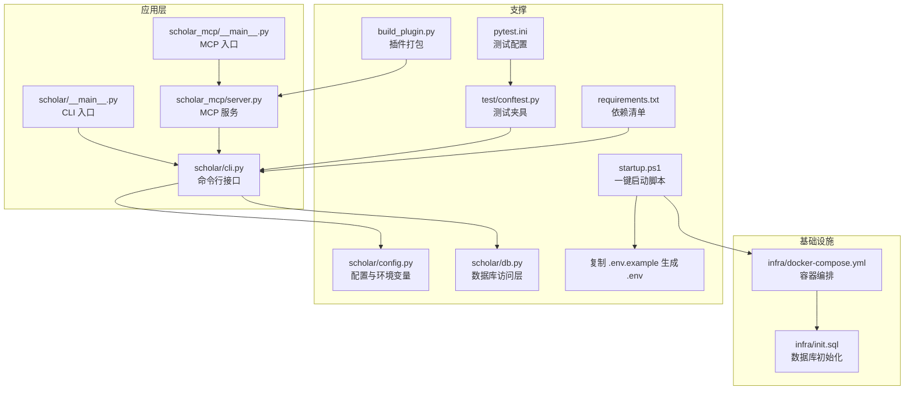
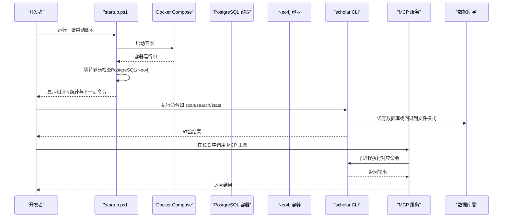
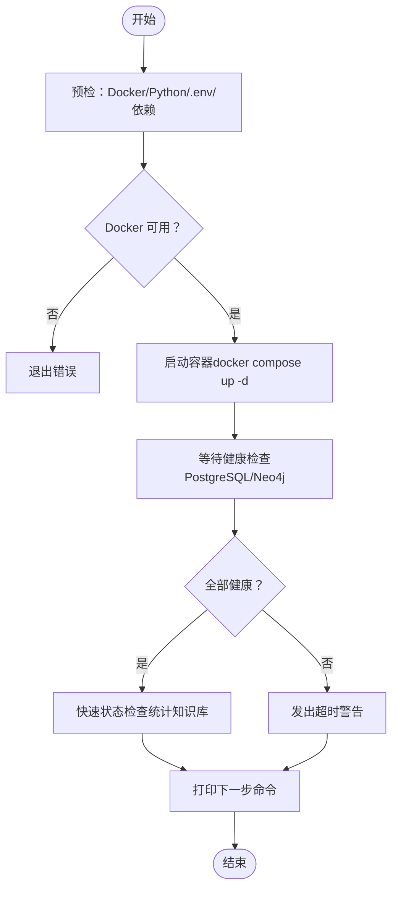
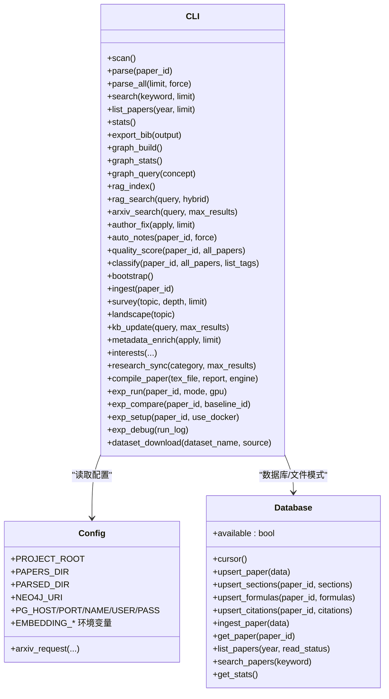
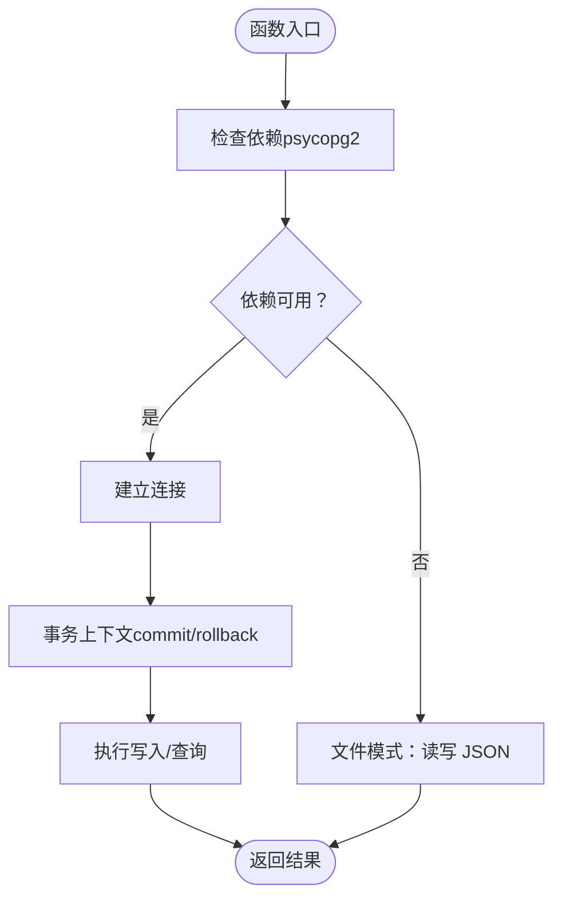
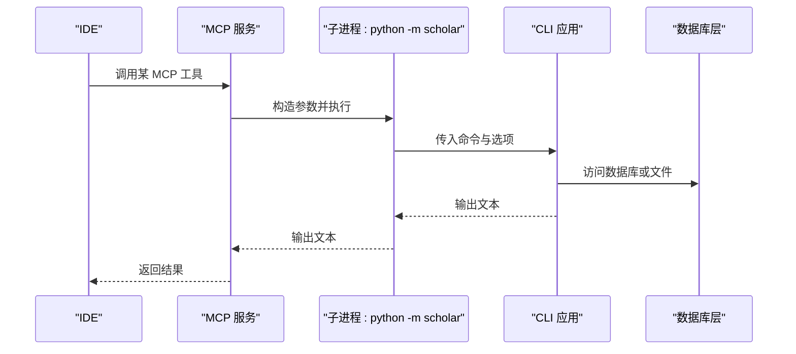
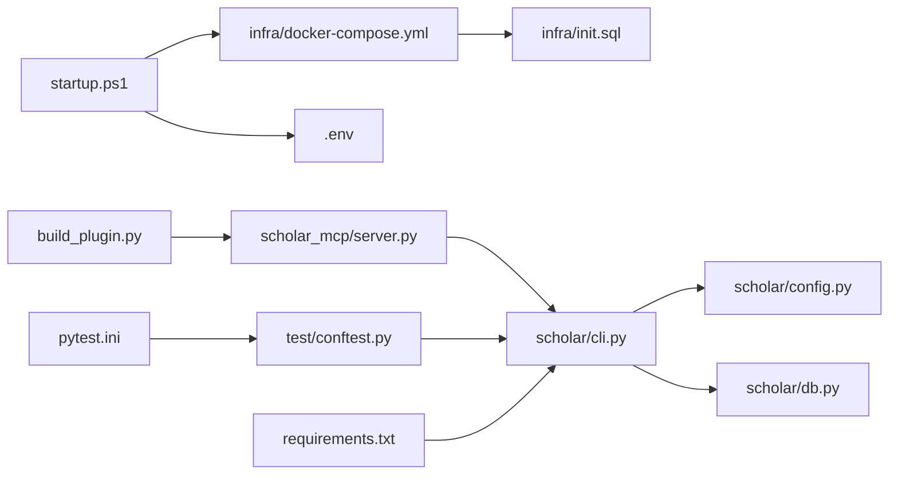

# 开发者指南

<cite>
**本文引用的文件**
- [startup.ps1](file://startup.ps1)
- [requirements.txt](file://requirements.txt)
- [pytest.ini](file://pytest.ini)
- [scholar/__main__.py](file://scholar/__main__.py)
- [scholar_mcp/__main__.py](file://scholar_mcp/__main__.py)
- [infra/docker-compose.yml](file://infra/docker-compose.yml)
- [scholar/cli.py](file://scholar/cli.py)
- [scholar/config.py](file://scholar/config.py)
- [scholar/db.py](file://scholar/db.py)
- [test/conftest.py](file://test/conftest.py)
- [build_plugin.py](file://build_plugin.py)
- [.env.example](file://.env.example)
- [scholar_mcp/server.py](file://scholar_mcp/server.py)
- [infra/init.sql](file://infra/init.sql)
</cite>

## 目录
1. [简介](#简介)
2. [项目结构](#项目结构)
3. [核心组件](#核心组件)
4. [架构总览](#架构总览)
5. [详细组件分析](#详细组件分析)
6. [依赖关系分析](#依赖关系分析)
7. [性能考虑](#性能考虑)
8. [故障排查指南](#故障排查指南)
9. [结论](#结论)
10. [附录](#附录)

## 简介
本指南面向开发者，提供本地开发环境的完整搭建与使用说明，覆盖以下主题：
- Python 虚拟环境创建、依赖安装与环境变量配置
- 启动脚本功能与使用方法（服务启动顺序、健康检查、错误处理）
- 测试框架配置与使用（pytest 配置、单元测试编写、调试技巧）
- 代码质量检查、lint 工具与持续集成设置建议
- 常见问题排查与性能优化建议

## 项目结构
该项目采用多模块分层组织：
- 核心应用：scholar（命令行入口、业务逻辑、数据库访问）
- MCP 服务：scholar_mcp（将 CLI 封装为 MCP 工具，供 IDE 集成）
- 基础设施：infra（Docker Compose 编排 PostgreSQL 与 Neo4j）
- 插件构建：build_plugin.py（将技能、规则、钩子打包为可分发插件）
- 测试：test（pytest 测试套件，含共享夹具）
- 启动与配置：startup.ps1（一键启动脚本）、.env.example（环境变量模板）

图表来源
- [startup.ps1:1-125](file://startup.ps1#L1-L125)
- [infra/docker-compose.yml:1-44](file://infra/docker-compose.yml#L1-L44)
- [infra/init.sql:1-131](file://infra/init.sql#L1-L131)
- [scholar/cli.py:1-800](file://scholar/cli.py#L1-L800)
- [scholar_mcp/server.py:1-631](file://scholar_mcp/server.py#L1-L631)
- [scholar/config.py:1-119](file://scholar/config.py#L1-L119)
- [scholar/db.py:1-276](file://scholar/db.py#L1-L276)
- [test/conftest.py:1-140](file://test/conftest.py#L1-L140)
- [requirements.txt:1-14](file://requirements.txt#L1-L14)
- [pytest.ini:1-9](file://pytest.ini#L1-L9)
- [build_plugin.py:1-180](file://build_plugin.py#L1-L180)

章节来源
- [startup.ps1:1-125](file://startup.ps1#L1-L125)
- [requirements.txt:1-14](file://requirements.txt#L1-L14)
- [pytest.ini:1-9](file://pytest.ini#L1-L9)
- [scholar/__main__.py:1-8](file://scholar/__main__.py#L1-L8)
- [scholar_mcp/__main__.py:1-5](file://scholar_mcp/__main__.py#L1-L5)
- [infra/docker-compose.yml:1-44](file://infra/docker-compose.yml#L1-L44)
- [scholar/cli.py:1-800](file://scholar/cli.py#L1-L800)
- [scholar/config.py:1-119](file://scholar/config.py#L1-L119)
- [scholar/db.py:1-276](file://scholar/db.py#L1-L276)
- [test/conftest.py:1-140](file://test/conftest.py#L1-L140)
- [build_plugin.py:1-180](file://build_plugin.py#L1-L180)
- [.env.example:1-38](file://.env.example#L1-L38)

## 核心组件
- 启动脚本：负责预检（Docker、Python、.env、依赖）、拉起容器、等待健康状态、显示知识库统计与下一步操作提示。
- CLI 应用：提供扫描、解析、搜索、统计、图谱构建、RAG、arXiv 检索、元数据补全、批量处理等命令。
- 数据库层：封装 PostgreSQL 访问，无依赖时回退至文件模式；提供查询与写入能力。
- 配置模块：加载 .env，定义目录路径与连接参数，提供 arXiv 请求工具。
- MCP 服务：将 CLI 命令映射为 MCP 工具，便于在 IDE 中直接调用。
- 测试框架：pytest 配置与共享夹具，支持标记慢测试与集成测试。
- 插件构建：将技能、命令、规则、钩子复制并打包为可分发 zip。

章节来源
- [startup.ps1:1-125](file://startup.ps1#L1-L125)
- [scholar/cli.py:1-800](file://scholar/cli.py#L1-L800)
- [scholar/db.py:1-276](file://scholar/db.py#L1-L276)
- [scholar/config.py:1-119](file://scholar/config.py#L1-L119)
- [scholar_mcp/server.py:1-631](file://scholar_mcp/server.py#L1-L631)
- [test/conftest.py:1-140](file://test/conftest.py#L1-L140)
- [pytest.ini:1-9](file://pytest.ini#L1-L9)
- [build_plugin.py:1-180](file://build_plugin.py#L1-L180)

## 架构总览
下图展示从启动脚本到服务与数据库的整体交互：

图表来源
- [startup.ps1:58-125](file://startup.ps1#L58-L125)
- [infra/docker-compose.yml:1-44](file://infra/docker-compose.yml#L1-L44)
- [scholar/cli.py:1-800](file://scholar/cli.py#L1-L800)
- [scholar/db.py:1-276](file://scholar/db.py#L1-L276)
- [scholar_mcp/server.py:1-631](file://scholar_mcp/server.py#L1-L631)

## 详细组件分析

### 启动脚本（startup.ps1）
- 功能要点
  - 预检：Docker 可用性、Python 版本、.env 文件存在性、依赖完整性
  - 启动容器：进入 infra 目录执行 docker compose up -d
  - 健康检查：轮询 PostgreSQL 与 Neo4j 的健康状态，最多等待指定秒数
  - 快速状态检查：通过容器内命令查询 papers/chunks 数量与 Neo4j 节点数量
  - 下一步提示：根据知识库是否为空给出引导命令
- 错误处理
  - Docker 不可用时直接退出
  - 依赖缺失时提示安装命令
  - 健康检查超时发出警告
- 使用建议
  - 首次运行前确保 .env 已按 .env.example 创建并填写必要密钥
  - 如需自定义数据库凭据，请保持 .env 与 docker-compose.yml 一致

图表来源
- [startup.ps1:11-125](file://startup.ps1#L11-L125)

章节来源
- [startup.ps1:1-125](file://startup.ps1#L1-L125)

### CLI 应用（scholar/cli.py）
- 命令概览（节选）
  - 扫描：列出论文目录与解析状态
  - 解析：单篇/批量解析 TeX 并入库
  - 搜索：全文检索（标题/摘要/段落）
  - 列表：按年份/元数据筛选
  - 统计：知识库统计与覆盖率
  - 导出：生成 BibTeX
  - 图谱：构建引用网络与概念图
  - RAG：向量化索引与语义检索
  - arXiv：搜索与下载
  - 元数据补全：作者/年份/会议等
  - 批处理：自动笔记、质量评分、分类、批量导入
- 设计特点
  - 使用 Typer 提供友好 CLI 接口
  - Rich 渲染表格与面板，提升可观测性
  - 数据库层具备可用性检测与文件模式回退
  - 大多数命令支持进度条与错误聚合

图表来源
- [scholar/cli.py:1-800](file://scholar/cli.py#L1-L800)
- [scholar/config.py:1-119](file://scholar/config.py#L1-L119)
- [scholar/db.py:1-276](file://scholar/db.py#L1-L276)

章节来源
- [scholar/cli.py:1-800](file://scholar/cli.py#L1-L800)
- [scholar/config.py:1-119](file://scholar/config.py#L1-L119)
- [scholar/db.py:1-276](file://scholar/db.py#L1-L276)

### 数据库层（scholar/db.py）
- 能力
  - 可选 PostgreSQL 支持：当依赖可用时连接数据库；否则回退文件模式
  - 提供 upsert 与批量写入：论文、章节、公式、引用
  - 查询接口：按年份/状态列表、全文检索、统计
- 设计要点
  - 使用上下文管理器确保事务提交/回滚
  - 连接复用与失效检测
  - 与 CLI 协作实现“文件模式”下的降级行为

图表来源
- [scholar/db.py:1-276](file://scholar/db.py#L1-L276)

章节来源
- [scholar/db.py:1-276](file://scholar/db.py#L1-L276)

### 配置与环境变量（scholar/config.py, .env.example）
- 配置职责
  - 加载 .env（位于项目根目录），未安装 python-dotenv 时回退到 os.environ
  - 定义项目根目录与各类输出目录
  - 设置数据库与图数据库连接参数
  - 提供 RAG 嵌入配置与 arXiv 请求工具（带代理、重试、超时）
- 环境变量模板
  - .env.example 提供 API Key、数据库与图数据库默认值、本地工具路径等
  - 建议仅修改必需项，并与 docker-compose.yml 保持一致

章节来源
- [scholar/config.py:1-119](file://scholar/config.py#L1-L119)
- [.env.example:1-38](file://.env.example#L1-L38)

### MCP 服务（scholar_mcp/server.py）
- 能力
  - 将 CLI 命令映射为 MCP 工具，供 IDE 集成
  - 子进程调用 python -m scholar，捕获标准输出与错误
  - 针对耗时命令设置合理超时
- 使用场景
  - 在 IDE 中直接调用解析、搜索、图谱构建、RAG、实验执行等工具
  - 作为统一执行层，屏蔽底层命令差异

图表来源
- [scholar_mcp/server.py:1-631](file://scholar_mcp/server.py#L1-L631)
- [scholar/cli.py:1-800](file://scholar/cli.py#L1-L800)
- [scholar/db.py:1-276](file://scholar/db.py#L1-L276)

章节来源
- [scholar_mcp/server.py:1-631](file://scholar_mcp/server.py#L1-L631)

### 测试框架（pytest.ini, test/conftest.py）
- pytest 配置
  - 测试目录与命名规范
  - 自定义标记：slow、integration
- 共享夹具
  - 项目根路径、示例论文数据、临时 parsed/logs 目录
  - arXiv XML 示例、周志样例、配置打补丁以隔离真实文件系统

章节来源
- [pytest.ini:1-9](file://pytest.ini#L1-L9)
- [test/conftest.py:1-140](file://test/conftest.py#L1-L140)

### 插件构建（build_plugin.py）
- 功能
  - 清理旧产物、复制技能/命令/规则/钩子到 plugin/
  - 读取 plugin.json 获取版本信息，打包为 .zip
- 输出
  - 顶层目录结构，便于 Qoder 插件系统识别

章节来源
- [build_plugin.py:1-180](file://build_plugin.py#L1-L180)

## 依赖关系分析
- 启动脚本依赖 Docker Compose 与 .env；容器健康检查依赖 init.sql 初始化的表结构
- CLI 依赖配置模块与数据库层；MCP 服务依赖 CLI
- 测试依赖 pytest 与共享夹具；部分测试需要运行中的服务（集成测试标记）

图表来源
- [startup.ps1:1-125](file://startup.ps1#L1-L125)
- [infra/docker-compose.yml:1-44](file://infra/docker-compose.yml#L1-L44)
- [infra/init.sql:1-131](file://infra/init.sql#L1-L131)
- [scholar/cli.py:1-800](file://scholar/cli.py#L1-L800)
- [scholar/config.py:1-119](file://scholar/config.py#L1-L119)
- [scholar/db.py:1-276](file://scholar/db.py#L1-L276)
- [scholar_mcp/server.py:1-631](file://scholar_mcp/server.py#L1-L631)
- [test/conftest.py:1-140](file://test/conftest.py#L1-L140)
- [pytest.ini:1-9](file://pytest.ini#L1-L9)
- [requirements.txt:1-14](file://requirements.txt#L1-L14)
- [build_plugin.py:1-180](file://build_plugin.py#L1-L180)

章节来源
- [startup.ps1:1-125](file://startup.ps1#L1-L125)
- [infra/docker-compose.yml:1-44](file://infra/docker-compose.yml#L1-L44)
- [infra/init.sql:1-131](file://infra/init.sql#L1-L131)
- [scholar/cli.py:1-800](file://scholar/cli.py#L1-L800)
- [scholar/config.py:1-119](file://scholar/config.py#L1-L119)
- [scholar/db.py:1-276](file://scholar/db.py#L1-L276)
- [scholar_mcp/server.py:1-631](file://scholar_mcp/server.py#L1-L631)
- [test/conftest.py:1-140](file://test/conftest.py#L1-L140)
- [pytest.ini:1-9](file://pytest.ini#L1-L9)
- [requirements.txt:1-14](file://requirements.txt#L1-L14)
- [build_plugin.py:1-180](file://build_plugin.py#L1-L180)

## 性能考虑
- 批处理与并发
  - 批量解析/导入时使用进度条与分批处理，避免一次性加载过多数据
- 数据库访问
  - 使用上下文管理器与事务控制，减少连接开销
  - 对高频查询建立索引（如 sections/papers/formulas/citations）
- I/O 与缓存
  - 将中间产物写入 output 目录，避免重复计算
  - 对外部 API（arXiv）启用重试与超时，降低失败影响
- 容器资源
  - Neo4j 内存参数已在 docker-compose 中设置，可根据机器调整
- MCP 超时
  - 针对耗时命令设置合理超时，防止阻塞 IDE

## 故障排查指南
- 启动脚本相关
  - Docker 未运行：安装并启动 Docker Desktop，再次运行启动脚本
  - Python 未找到：安装 Python 3.10+ 并确保在 PATH 中
  - .env 未创建：复制 .env.example 并填写必要密钥
  - 依赖缺失：执行依赖安装命令后重试
  - 健康检查超时：确认容器日志与端口映射（PostgreSQL:5433、Neo4j:7474/7687）
- 数据库相关
  - 连接失败：核对 .env 中数据库参数与 docker-compose.yml 是否一致
  - 表结构异常：确认 init.sql 已被容器初始化（首次启动）
- CLI/MCP 相关
  - MCP 工具报错：查看子进程输出与 stderr；确认 CLI 命令可用
  - 图谱构建失败：确保 Neo4j 正常运行且有足够内存
- 测试相关
  - 集成测试失败：确认所需服务已启动；使用集成测试标记运行
  - 代理/网络问题：为 arXiv 请求设置代理环境变量

章节来源
- [startup.ps1:11-125](file://startup.ps1#L11-L125)
- [infra/docker-compose.yml:1-44](file://infra/docker-compose.yml#L1-L44)
- [infra/init.sql:1-131](file://infra/init.sql#L1-L131)
- [scholar/config.py:70-119](file://scholar/config.py#L70-L119)
- [scholar_mcp/server.py:23-36](file://scholar_mcp/server.py#L23-L36)

## 结论
本指南提供了从环境搭建到日常开发与运维的全流程指引。建议开发者遵循以下步骤：
- 使用启动脚本完成容器与依赖准备
- 配置 .env 并验证数据库/图数据库连通性
- 通过 CLI 与 MCP 服务开展日常研究工作流
- 使用 pytest 与共享夹具进行单元与集成测试
- 借助插件构建工具维护与分发技能与规则

## 附录
- 一键启动命令参考
  - 运行启动脚本：在项目根目录执行启动脚本
  - 常用 CLI 命令：扫描、解析、搜索、统计、图谱构建、RAG、arXiv 检索、元数据补全、批量处理
  - MCP 工具：在 IDE 中直接调用，无需手动输入命令
- 测试运行建议
  - 运行所有测试：pytest
  - 仅运行非集成测试：pytest -m "not integration"
  - 运行慢测试：pytest -m "slow"
  - 运行集成测试：pytest -m "integration"