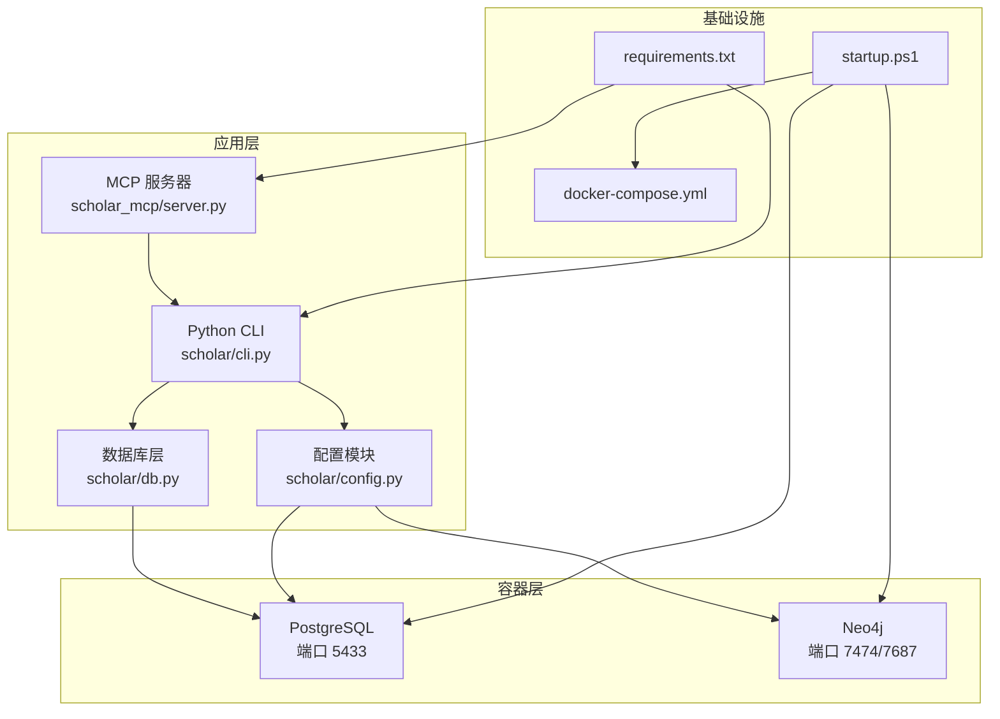
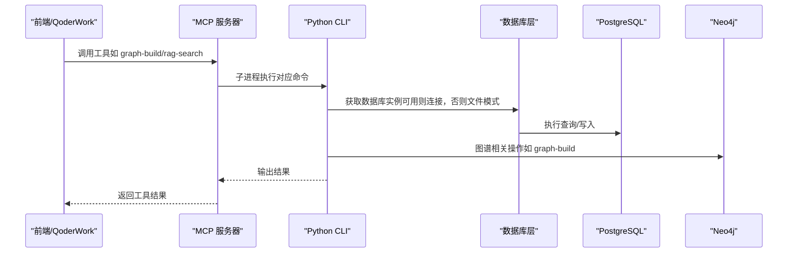
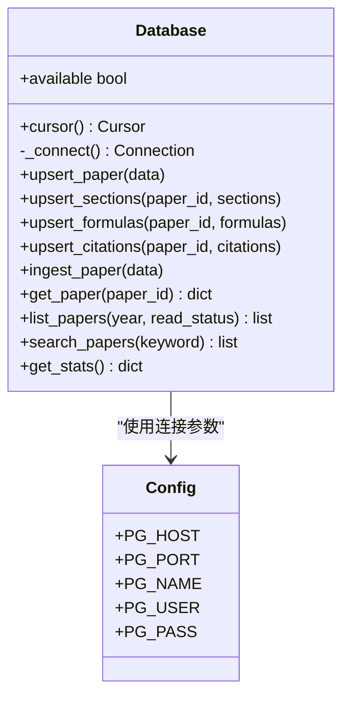
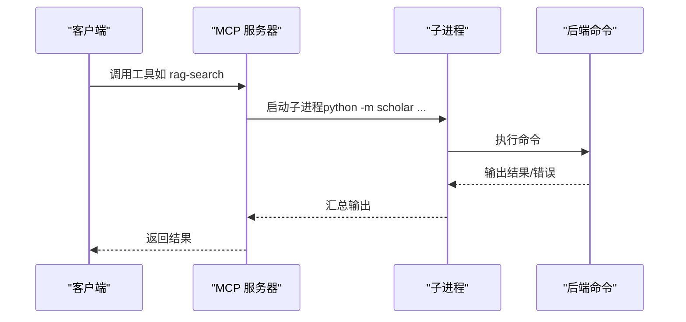
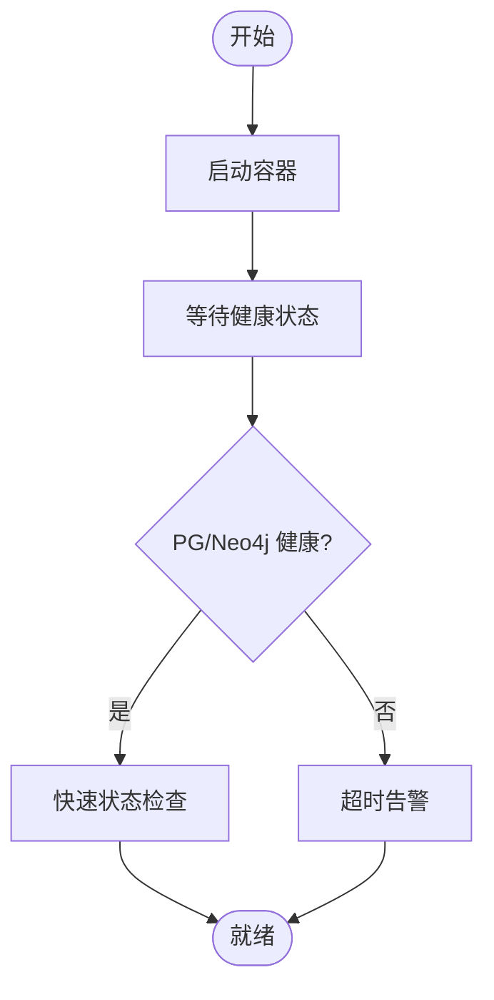
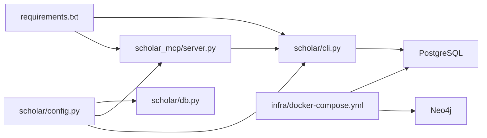

# 故障排除指南

<cite>
**本文引用的文件**
- [docker-compose.yml](file://infra/docker-compose.yml)
- [startup.ps1](file://startup.ps1)
- [config.py](file://scholar/config.py)
- [db.py](file://scholar/db.py)
- [server.py](file://scholar_mcp/server.py)
- [requirements.txt](file://requirements.txt)
- [README.md](file://plugin/README.md)
- [health.md](file://plugin/commands/health.md)
- [block-dangerous.ps1](file://plugin/hooks/block-dangerous.ps1)
- [cli.py](file://scholar/cli.py)
</cite>

## 目录
1. [简介](#简介)
2. [项目结构](#项目结构)
3. [核心组件](#核心组件)
4. [架构总览](#架构总览)
5. [详细组件分析](#详细组件分析)
6. [依赖关系分析](#依赖关系分析)
7. [性能考虑](#性能考虑)
8. [故障排除指南](#故障排除指南)
9. [结论](#结论)
10. [附录](#附录)

## 简介
本指南面向“Scholar Studio”学术研究工具链的运维与开发人员，聚焦于常见故障的诊断与解决，覆盖数据库连接失败、容器启动异常、服务无响应、日志分析与错误定位、性能问题排查（慢查询、内存泄漏、资源瓶颈）、系统恢复与紧急处理、网络与权限问题、依赖服务异常，以及故障预防与监控预警。文档以仓库现有实现为依据，结合启动脚本、配置模块、数据库层、MCP 服务器与 CLI 命令，提供可操作的排障流程。

## 项目结构
系统由以下关键部分组成：
- 容器编排：PostgreSQL + Neo4j，通过 docker-compose 启动与健康检查
- 后端服务：Python CLI 与 MCP 服务器，封装数据库访问与外部服务调用
- 配置管理：基于环境变量的统一配置加载
- 插件与工作流：QoderWork 插件桥接前端与后端，提供命令与钩子

图表来源
- [docker-compose.yml:1-44](file://infra/docker-compose.yml#L1-L44)
- [startup.ps1:1-65](file://startup.ps1#L1-L65)
- [config.py:41-57](file://scholar/config.py#L41-L57)
- [db.py:24-74](file://scholar/db.py#L24-L74)
- [server.py:17-20](file://scholar_mcp/server.py#L17-L20)
- [requirements.txt:1-9](file://requirements.txt#L1-L9)

章节来源
- [docker-compose.yml:1-44](file://infra/docker-compose.yml#L1-L44)
- [startup.ps1:1-65](file://startup.ps1#L1-L65)
- [config.py:41-57](file://scholar/config.py#L41-L57)
- [db.py:24-74](file://scholar/db.py#L24-L74)
- [server.py:17-20](file://scholar_mcp/server.py#L17-L20)
- [requirements.txt:1-9](file://requirements.txt#L1-L9)

## 核心组件
- 容器编排与健康检查：PostgreSQL 与 Neo4j 的镜像、端口映射、环境变量、卷挂载与健康检查策略
- 配置模块：统一读取环境变量，提供数据库与图数据库连接参数、嵌入模型参数、输出目录等
- 数据库层：封装 psycopg2 访问 PostgreSQL；当不可用时回退至文件模式
- MCP 服务器：将 CLI 命令包装为 MCP 工具，通过子进程调用后端逻辑
- 启动脚本：自动化拉起容器、等待健康状态、快速检查知识库统计

章节来源
- [docker-compose.yml:1-44](file://infra/docker-compose.yml#L1-L44)
- [config.py:41-57](file://scholar/config.py#L41-L57)
- [db.py:24-74](file://scholar/db.py#L24-L74)
- [server.py:23-36](file://scholar_mcp/server.py#L23-L36)
- [startup.ps1:11-44](file://startup.ps1#L11-L44)

## 架构总览
下图展示从前端到后端、再到数据库与图数据库的交互路径，以及容器健康检查与启动流程。

图表来源
- [server.py:23-36](file://scholar_mcp/server.py#L23-L36)
- [db.py:31-74](file://scholar/db.py#L31-L74)
- [config.py:41-57](file://scholar/config.py#L41-L57)

## 详细组件分析

### 数据库层（PostgreSQL）分析
- 可用性探测：通过一次性连接测试数据库可达性，避免缓存死连接
- 连接管理：按需建立连接，支持 ping 检测与异常重置
- 事务控制：上下文管理器确保提交/回滚与游标关闭
- 回退机制：当无法导入驱动或连接失败时，系统可退化为文件模式（保存/读取 JSON）

图表来源
- [db.py:24-74](file://scholar/db.py#L24-L74)
- [config.py:41-47](file://scholar/config.py#L41-L47)

章节来源
- [db.py:24-74](file://scholar/db.py#L24-L74)
- [config.py:41-47](file://scholar/config.py#L41-L47)

### MCP 服务器与 CLI 工具链
- 工具封装：将 CLI 命令映射为 MCP 工具，统一入口与超时控制
- 子进程执行：通过子进程调用后端命令，捕获标准输出与错误输出
- 多类工具：论文库、图谱与网络、RAG、元数据补全、批处理、执行层、文件访问等

图表来源
- [server.py:23-36](file://scholar_mcp/server.py#L23-L36)
- [server.py:160-180](file://scholar_mcp/server.py#L160-L180)

章节来源
- [server.py:23-36](file://scholar_mcp/server.py#L23-L36)
- [server.py:160-180](file://scholar_mcp/server.py#L160-L180)

### 启动与健康检查
- 自动启动：启动脚本进入 infra 目录，执行 docker compose up -d
- 健康等待：轮询容器健康状态，最长等待时间限制
- 快速检查：进入容器执行 SQL/Cypher 查询，统计知识库条目

图表来源
- [startup.ps1:11-44](file://startup.ps1#L11-L44)

章节来源
- [startup.ps1:11-44](file://startup.ps1#L11-L44)
- [docker-compose.yml:15-19](file://infra/docker-compose.yml#L15-L19)
- [docker-compose.yml:35-39](file://infra/docker-compose.yml#L35-L39)

## 依赖关系分析
- Python 依赖：CLI 与 MCP 服务器依赖 psycopg2、neo4j、mcp 等包
- 环境变量：数据库与图数据库连接参数、嵌入模型参数、输出目录等
- 容器依赖：PostgreSQL 与 Neo4j 作为外部服务，需先于应用启动

图表来源
- [requirements.txt:1-9](file://requirements.txt#L1-L9)
- [config.py:41-57](file://scholar/config.py#L41-L57)
- [db.py:24-74](file://scholar/db.py#L24-L74)
- [server.py:17-20](file://scholar_mcp/server.py#L17-L20)
- [docker-compose.yml:1-44](file://infra/docker-compose.yml#L1-L44)

章节来源
- [requirements.txt:1-9](file://requirements.txt#L1-L9)
- [config.py:41-57](file://scholar/config.py#L41-L57)
- [db.py:24-74](file://scholar/db.py#L24-L74)
- [server.py:17-20](file://scholar_mcp/server.py#L17-L20)
- [docker-compose.yml:1-44](file://infra/docker-compose.yml#L1-L44)

## 性能考虑
- 数据库连接池与重连：当前实现按需连接，适合轻量场景；高并发建议引入连接池与超时重试
- 查询复杂度：全文检索与向量检索可能成为热点；建议对高频查询建立索引与物化视图
- 内存与资源：Neo4j 堆内存配置需根据数据规模调整；容器资源限制需与负载匹配
- I/O 优化：批量导入与导出采用分页与流式处理，减少内存峰值

## 故障排除指南

### 一、数据库连接失败
- 现象
  - 数据库层可用性探测返回失败
  - CLI/RAG/图谱构建等命令报连接错误
- 诊断步骤
  1) 检查环境变量是否正确加载（主机、端口、库名、用户、密码）
  2) 使用容器内 psql 连接验证凭据与网络连通
  3) 查看数据库健康状态与日志
- 解决方案
  - 修正 .env 中的连接参数
  - 确认容器网络与端口映射（默认 5433）
  - 如驱动缺失，安装 psycopg2-binary
  - 若数据库未初始化，参考初始化脚本或首次引导流程

章节来源
- [db.py:31-44](file://scholar/db.py#L31-L44)
- [config.py:41-47](file://scholar/config.py#L41-L47)
- [docker-compose.yml:6-14](file://infra/docker-compose.yml#L6-L14)
- [requirements.txt](file://requirements.txt#L4)

### 二、容器启动异常
- 现象
  - docker compose 启动后健康检查长时间不通过
  - 启动脚本超时告警
- 诊断步骤
  1) 查看容器日志与健康检查命令输出
  2) 检查端口占用与防火墙
  3) 验证数据卷挂载与权限
- 解决方案
  - 清理旧容器与卷后重新启动
  - 调整健康检查间隔与超时
  - 确保宿主机端口未被占用

章节来源
- [startup.ps1:11-44](file://startup.ps1#L11-L44)
- [docker-compose.yml:15-19](file://infra/docker-compose.yml#L15-L19)
- [docker-compose.yml:35-39](file://infra/docker-compose.yml#L35-L39)

### 三、服务无响应（MCP/CLI）
- 现象
  - MCP 工具调用超时或返回空结果
  - CLI 命令执行卡顿或报错
- 诊断步骤
  1) 检查后端进程是否正常运行
  2) 查看子进程调用的 stderr 输出
  3) 验证外部服务（Neo4j、arXiv API）连通性
- 解决方案
  1) 重启 MCP 与 CLI 进程
  2) 调整工具超时参数
  3) 检查网络代理与超时设置

章节来源
- [server.py:23-36](file://scholar_mcp/server.py#L23-L36)
- [config.py:69-115](file://scholar/config.py#L69-L115)

### 四、日志分析与错误定位
- 日志位置
  - 实验运行日志与编译日志分别位于输出目录不同子目录
  - MCP 工具会将子进程 stderr 汇总并返回
- 分析要点
  - 关注模块缺失、OOM、文件不存在、运行时错误等典型模式
  - 从 stderr 段提取关键错误信息进行归因
- 建议
  - 将日志输出标准化，便于集中收集与检索
  - 在关键路径增加结构化日志字段（请求 ID、阶段、耗时）

章节来源
- [server.py:520-564](file://scholar_mcp/server.py#L520-L564)
- [cli.py:2012-2044](file://scholar/cli.py#L2012-L2044)

### 五、性能问题排查
- 慢查询分析
  - 使用数据库 EXPLAIN/ANALYZE 分析热点 SQL
  - 对高频查询建立索引（如标题、年份、引用关系）
- 内存泄漏检测
  - 监控 Python 进程 RSS 与 GC 统计
  - 定位未释放的大对象与循环引用
- 资源瓶颈识别
  - 观察容器 CPU/内存/IO 使用率
  - 调整 Neo4j 堆大小与查询批大小

章节来源
- [db.py:78-176](file://scholar/db.py#L78-L176)
- [config.py:48-51](file://scholar/config.py#L48-L51)

### 六、系统恢复与紧急处理
- 快速恢复
  - 重启容器与后端服务
  - 清理临时文件与缓存目录
- 紧急降级
  - 当数据库不可用时启用文件模式
  - 仅使用本地文件与离线功能
- 数据备份与回滚
  - 定期备份数据库与图数据库
  - 版本化配置与依赖清单

章节来源
- [db.py:247-276](file://scholar/db.py#L247-L276)
- [startup.ps1:11-44](file://startup.ps1#L11-L44)

### 七、网络连接问题
- 现象
  - arXiv API 请求失败或超时
  - Neo4j 连接被拒绝
- 诊断步骤
  1) 检查 HTTP/HTTPS 代理环境变量
  2) 验证 DNS 与防火墙规则
  3) 使用 curl/ping 测试目标连通性
- 解决方案
  1) 配置代理或直连
  2) 调整超时与重试次数
  3) 校验 Neo4j 认证与 bolt 端口

章节来源
- [config.py:69-115](file://scholar/config.py#L69-L115)
- [config.py:48-51](file://scholar/config.py#L48-L51)

### 八、权限配置问题
- 现象
  - 数据库连接提示认证失败
  - 文件写入权限不足
- 诊断步骤
  1) 检查 .env 中的用户名/密码
  2) 验证输出目录权限与磁盘空间
- 解决方案
  1) 更新 .env 并重启服务
  2) 修正目录权限与配额

章节来源
- [config.py:41-57](file://scholar/config.py#L41-L57)
- [config.py:37-39](file://scholar/config.py#L37-L39)

### 九、依赖服务异常
- 现象
  - Neo4j 不可用或图谱构建失败
  - RAG 向量索引未建立
- 诊断步骤
  1) 检查 Neo4j 健康状态与认证
  2) 确认嵌入 API 密钥与网络连通
- 解决方案
  1) 重启 Neo4j 容器
  2) 补充 API 密钥并重试索引

章节来源
- [docker-compose.yml:21-40](file://infra/docker-compose.yml#L21-L40)
- [config.py:53-57](file://scholar/config.py#L53-L57)

### 十、故障预防与监控预警
- 健康检查与告警
  - 使用 compose 健康检查与外部探针
  - 设置容器资源上限与 OOM 检测
- 日志与审计
  - 统一日志格式与采集
  - 对危险命令（DROP/TRUNCATE、rm -rf）进行拦截
- 运维流程
  - 定期巡检：连接数、索引命中率、缓存命中率
  - 回归测试：关键命令与工具链端到端验证

章节来源
- [docker-compose.yml:15-19](file://infra/docker-compose.yml#L15-L19)
- [docker-compose.yml:35-39](file://infra/docker-compose.yml#L35-L39)
- [block-dangerous.ps1:11-21](file://plugin/hooks/block-dangerous.ps1#L11-L21)
- [health.md:1-10](file://plugin/commands/health.md#L1-L10)

## 结论
本指南基于仓库现有实现，提供了从容器、配置、数据库到服务与工具链的全栈排障方法。建议在生产环境中配合健康检查、日志标准化、权限最小化与依赖版本管理，形成闭环的监控与应急响应体系。

## 附录
- 常用命令
  - 启动：进入 infra 目录执行 docker compose up -d
  - 快速状态：docker exec 进入容器执行 SQL/Cypher 统计
  - 健康检查：查看容器健康状态与日志
- 参考文件
  - docker-compose.yml：容器编排与健康检查
  - startup.ps1：一键启动与等待逻辑
  - config.py：环境变量与连接参数
  - db.py：数据库可用性探测与事务管理
  - server.py：MCP 工具与子进程调用
  - requirements.txt：Python 依赖清单
  - plugin/README.md：插件与后端关系说明
  - plugin/commands/health.md：健康状态检查步骤
  - plugin/hooks/block-dangerous.ps1：危险命令拦截