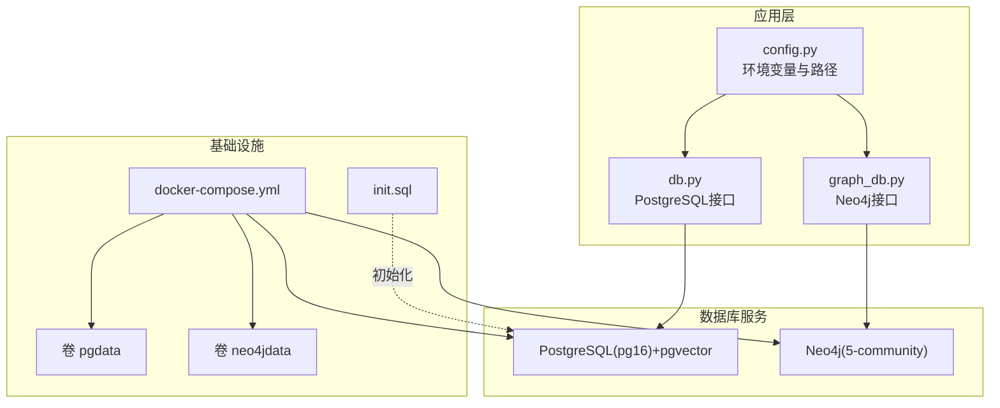
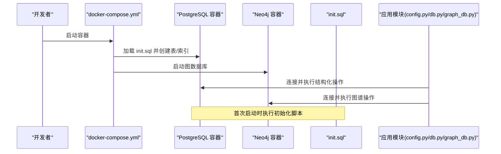
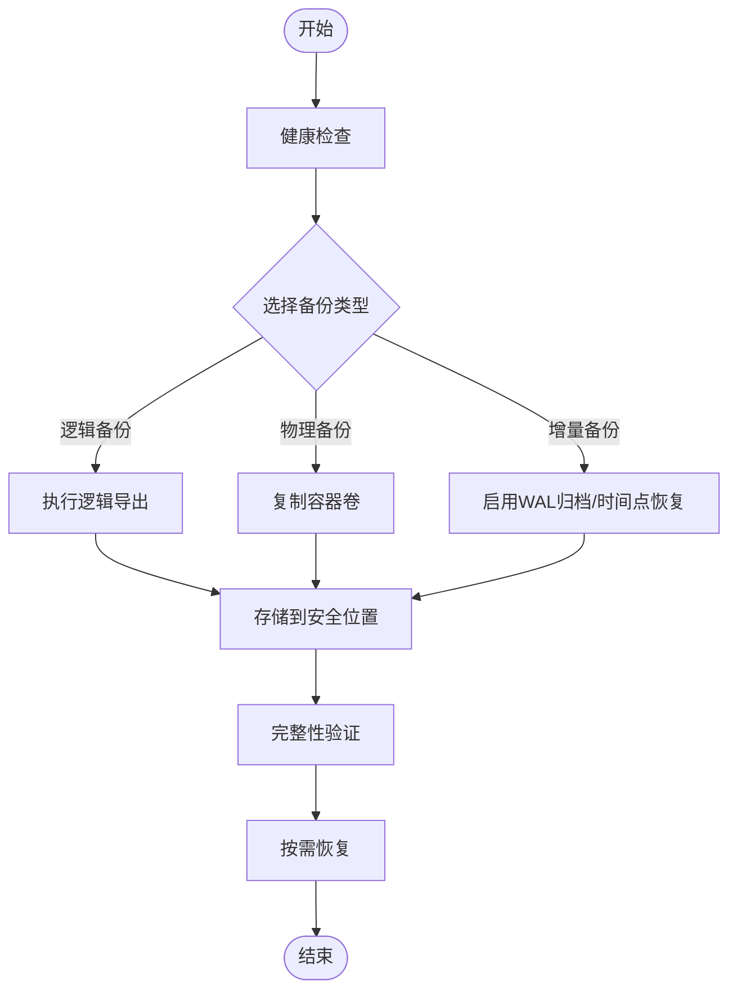
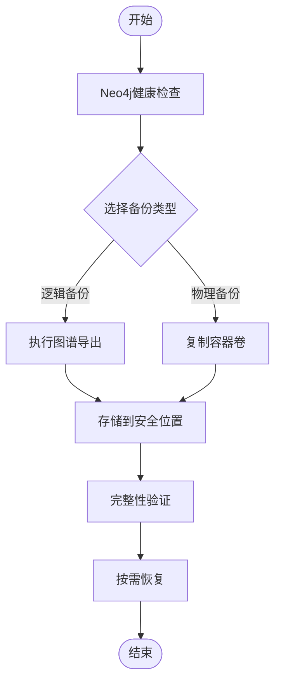
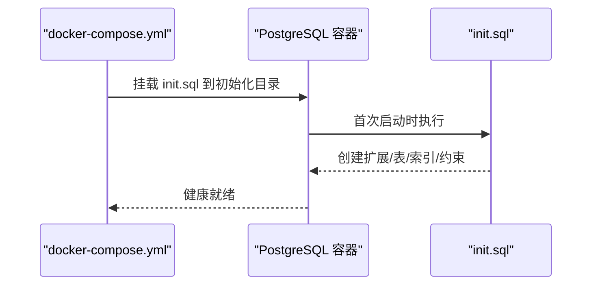
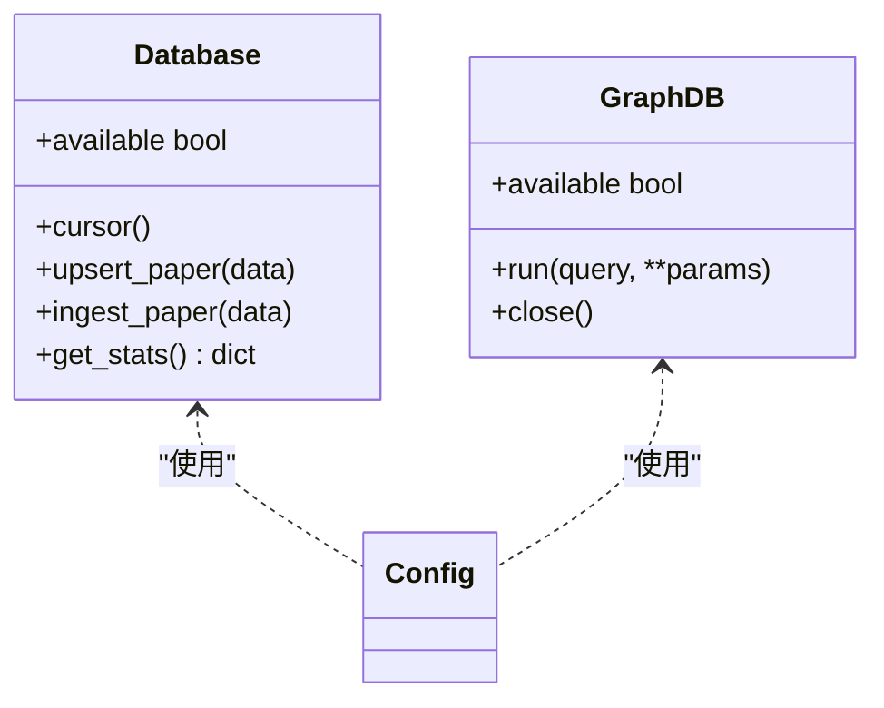
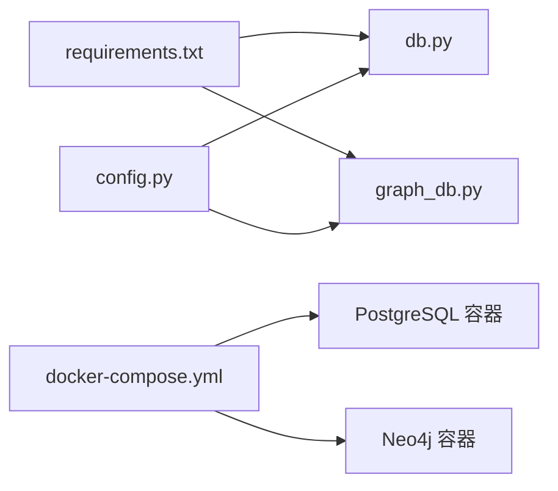

# 数据库备份与恢复

<cite>
**本文引用的文件**
- [docker-compose.yml](file://infra/docker-compose.yml)
- [init.sql](file://infra/init.sql)
- [db.py](file://scholar/db.py)
- [graph_db.py](file://scholar/graph_db.py)
- [config.py](file://scholar/config.py)
- [requirements.txt](file://requirements.txt)
- [startup.ps1](file://startup.ps1)
</cite>

## 目录
1. [简介](#简介)
2. [项目结构](#项目结构)
3. [核心组件](#核心组件)
4. [架构总览](#架构总览)
5. [详细组件分析](#详细组件分析)
6. [依赖分析](#依赖分析)
7. [性能考虑](#性能考虑)
8. [故障排查指南](#故障排查指南)
9. [结论](#结论)
10. [附录](#附录)

## 简介
本指南面向PostgreSQL与Neo4j两类数据库，提供完整的备份与恢复策略，涵盖逻辑备份、物理备份与增量备份的配置与执行要点；同时给出自动化脚本与定时任务建议、数据迁移与版本升级的最佳实践、init.sql初始化脚本的作用与使用方法，以及灾难恢复计划与数据完整性验证方法。文中所有技术细节均基于仓库中的实际配置与实现进行阐述。

## 项目结构
本项目通过容器编排同时运行PostgreSQL（含向量扩展）与Neo4j服务，并在首次启动时加载初始化SQL以建立核心表结构与索引。应用层通过Python模块连接数据库，提供结构化数据与图谱数据的写入、查询与统计能力。

图表来源
- [docker-compose.yml:1-44](file://infra/docker-compose.yml#L1-L44)
- [init.sql:1-131](file://infra/init.sql#L1-L131)
- [config.py:41-51](file://scholar/config.py#L41-L51)
- [db.py:24-74](file://scholar/db.py#L24-L74)
- [graph_db.py:32-70](file://scholar/graph_db.py#L32-L70)

章节来源
- [docker-compose.yml:1-44](file://infra/docker-compose.yml#L1-L44)
- [init.sql:1-131](file://infra/init.sql#L1-L131)
- [config.py:41-51](file://scholar/config.py#L41-L51)

## 核心组件
- PostgreSQL（PostgreSQL 16 + pgvector）：用于结构化数据存储与RAG向量检索，容器内挂载持久化卷与初始化SQL。
- Neo4j（5-community）：用于概念图谱、引用网络与创新演进图谱，容器内挂载持久化卷。
- 应用数据库接口：
  - PostgreSQL接口：提供连接管理、事务控制、UPSERT与查询等能力。
  - Neo4j接口：提供连接管理、Cypher执行与图谱构建/查询能力。
- 配置模块：集中管理数据库连接参数与输出目录等。

章节来源
- [db.py:24-74](file://scholar/db.py#L24-L74)
- [graph_db.py:32-70](file://scholar/graph_db.py#L32-L70)
- [config.py:41-51](file://scholar/config.py#L41-L51)

## 架构总览
下图展示容器、数据库与应用之间的交互关系，以及初始化脚本如何在首次启动时创建数据库结构。

图表来源
- [docker-compose.yml:12-14](file://infra/docker-compose.yml#L12-L14)
- [init.sql:1-131](file://infra/init.sql#L1-L131)
- [config.py:41-51](file://scholar/config.py#L41-L51)
- [db.py:24-74](file://scholar/db.py#L24-L74)
- [graph_db.py:32-70](file://scholar/graph_db.py#L32-L70)

## 详细组件分析

### PostgreSQL 备份与恢复策略
- 逻辑备份（推荐优先级：高）
  - 使用容器内工具进行逻辑导出，确保数据一致性与可移植性。
  - 建议在业务低峰期执行，避免长事务阻塞。
  - 导出内容包含模式与数据，便于跨版本迁移。
- 物理备份（推荐优先级：中）
  - 基于容器卷进行快照或拷贝，适合快速恢复。
  - 需要停止写入或使用只读模式，降低数据不一致风险。
- 增量备份（推荐优先级：中）
  - 可结合WAL归档与时间点恢复（PITR），但需额外配置与监控。
  - 适用于对RPO要求极高的场景。
- 自动化与定时任务
  - 建议使用系统定时任务（如cron或Windows任务计划程序）定期触发备份脚本。
  - 脚本应包含健康检查、错误处理与告警通知。
- 恢复流程
  - 选择最近可用的完整备份作为基线，按顺序应用增量备份或WAL日志。
  - 在隔离环境中验证恢复数据的完整性与业务功能。
- 数据完整性验证
  - 统计关键表记录数与校验和，比对备份前后的差异。
  - 执行代表性查询与索引扫描，确保查询性能正常。

图表来源
- [docker-compose.yml:12-19](file://infra/docker-compose.yml#L12-L19)
- [init.sql:1-131](file://infra/init.sql#L1-L131)

章节来源
- [docker-compose.yml:12-19](file://infra/docker-compose.yml#L12-L19)
- [init.sql:1-131](file://infra/init.sql#L1-L131)

### Neo4j 备份与恢复策略
- 逻辑备份（推荐优先级：高）
  - 使用Neo4j内置的备份工具导出图数据，支持增量备份。
  - 建议在维护窗口执行，避免影响在线查询。
- 物理备份（推荐优先级：中）
  - 基于容器卷进行快照或拷贝，适合快速恢复。
  - 需要确保数据库处于一致状态或使用备份锁。
- 增量备份（推荐优先级：中）
  - 通过周期性全量备份与增量备份组合，缩短RTO。
- 自动化与定时任务
  - 使用系统定时任务定期触发备份脚本，包含健康检查与告警。
- 恢复流程
  - 先恢复最近一次全量备份，再依次应用增量备份。
  - 在隔离环境验证图谱完整性与查询性能。
- 数据完整性验证
  - 统计节点与关系数量，执行代表性Cypher查询。
  - 对关键索引与约束进行扫描，确保一致性。

图表来源
- [docker-compose.yml:33-39](file://infra/docker-compose.yml#L33-L39)

章节来源
- [docker-compose.yml:33-39](file://infra/docker-compose.yml#L33-L39)

### init.sql 初始化脚本的作用与使用方法
- 作用
  - 在首次启动容器时自动执行，创建扩展与核心表结构、索引与约束。
  - 为后续的数据导入与查询提供稳定的初始状态。
- 使用方法
  - 将脚本挂载至容器入口初始化目录，容器启动即执行。
  - 修改后重新构建镜像或重启容器以应用变更。
- 注意事项
  - 脚本应幂等，避免重复执行导致异常。
  - 生产环境建议对脚本进行版本管理与变更审批。

图表来源
- [docker-compose.yml:12-14](file://infra/docker-compose.yml#L12-L14)
- [init.sql:1-131](file://infra/init.sql#L1-L131)

章节来源
- [docker-compose.yml:12-14](file://infra/docker-compose.yml#L12-L14)
- [init.sql:1-131](file://infra/init.sql#L1-L131)

### 应用层数据库接口与备份关联
- PostgreSQL接口
  - 提供连接池与事务管理，支持批量写入与查询。
  - 在备份窗口期间，建议暂停写入或切换到只读模式。
- Neo4j接口
  - 提供Cypher执行与图谱构建能力，备份前需评估写入负载。
  - 可通过维护模式减少写入压力。

图表来源
- [db.py:24-74](file://scholar/db.py#L24-L74)
- [graph_db.py:32-70](file://scholar/graph_db.py#L32-L70)
- [config.py:41-51](file://scholar/config.py#L41-L51)

章节来源
- [db.py:24-74](file://scholar/db.py#L24-L74)
- [graph_db.py:32-70](file://scholar/graph_db.py#L32-L70)
- [config.py:41-51](file://scholar/config.py#L41-L51)

## 依赖分析
- 外部依赖
  - PostgreSQL驱动：用于结构化数据访问。
  - Neo4j驱动：用于图谱数据访问。
- 内部依赖
  - 配置模块集中管理数据库连接参数，被数据库接口模块使用。
  - 容器编排文件定义了数据库服务与持久化卷的关系。

图表来源
- [requirements.txt:4-5](file://requirements.txt#L4-L5)
- [config.py:41-51](file://scholar/config.py#L41-L51)
- [db.py:24-74](file://scholar/db.py#L24-L74)
- [graph_db.py:32-70](file://scholar/graph_db.py#L32-L70)
- [docker-compose.yml:1-44](file://infra/docker-compose.yml#L1-L44)

章节来源
- [requirements.txt:4-5](file://requirements.txt#L4-L5)
- [config.py:41-51](file://scholar/config.py#L41-L51)
- [db.py:24-74](file://scholar/db.py#L24-L74)
- [graph_db.py:32-70](file://scholar/graph_db.py#L32-L70)
- [docker-compose.yml:1-44](file://infra/docker-compose.yml#L1-L44)

## 性能考虑
- 备份窗口规划
  - 选择业务低峰时段执行备份，避免影响在线查询与写入。
- 并发与锁竞争
  - 逻辑备份通常对写入影响较小；物理备份需要短时只读或停止写入。
- 存储与传输
  - 备份数据应存放在高可靠、异地容灾的存储介质上。
  - 传输过程建议启用压缩与加密。
- 恢复演练
  - 定期进行恢复演练，验证备份数据的可用性与恢复效率。

## 故障排查指南
- PostgreSQL
  - 连接失败：检查容器健康状态与端口映射，确认凭据正确。
  - 初始化异常：核对初始化脚本是否成功执行，关注扩展与索引创建。
- Neo4j
  - 连接失败：检查容器健康状态与认证信息，确认Bolt端口可达。
  - 图谱异常：核对备份一致性，必要时重建索引与约束。
- 自动化脚本
  - 健康检查：在脚本中集成容器健康状态检测，超时则告警。
  - 错误处理：捕获异常并记录日志，发送告警通知。

章节来源
- [startup.ps1:17-44](file://startup.ps1#L17-L44)
- [docker-compose.yml:15-19](file://infra/docker-compose.yml#L15-L19)
- [docker-compose.yml:35-39](file://infra/docker-compose.yml#L35-L39)

## 结论
本指南基于仓库中的容器编排与初始化脚本，给出了PostgreSQL与Neo4j的备份与恢复策略、自动化脚本与定时任务建议、数据迁移与版本升级的最佳实践、init.sql的使用方法，以及灾难恢复与数据完整性验证方法。建议在生产环境中结合自身业务特点，制定详细的备份策略与演练计划，确保数据安全与业务连续性。

## 附录
- 快速启动与健康检查
  - 一键启动脚本会等待两个数据库服务达到健康状态，并输出知识库基础统计信息，便于快速验证环境可用性。

章节来源
- [startup.ps1:11-58](file://startup.ps1#L11-L58)