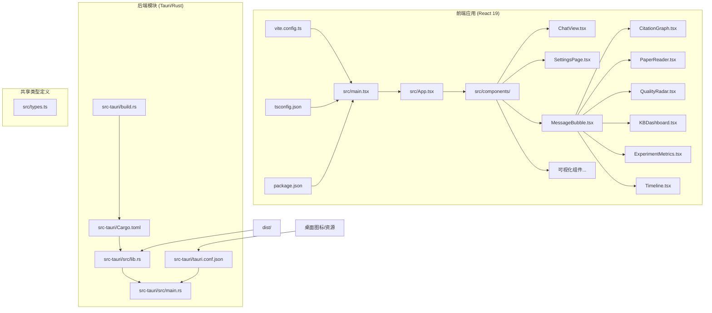
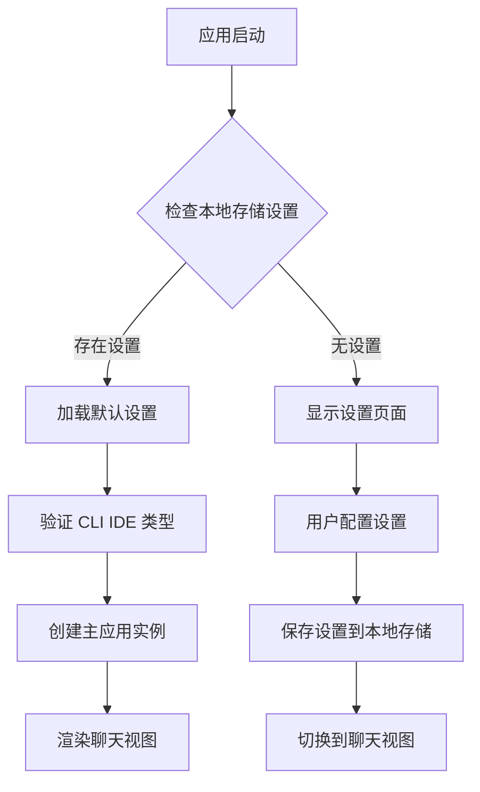
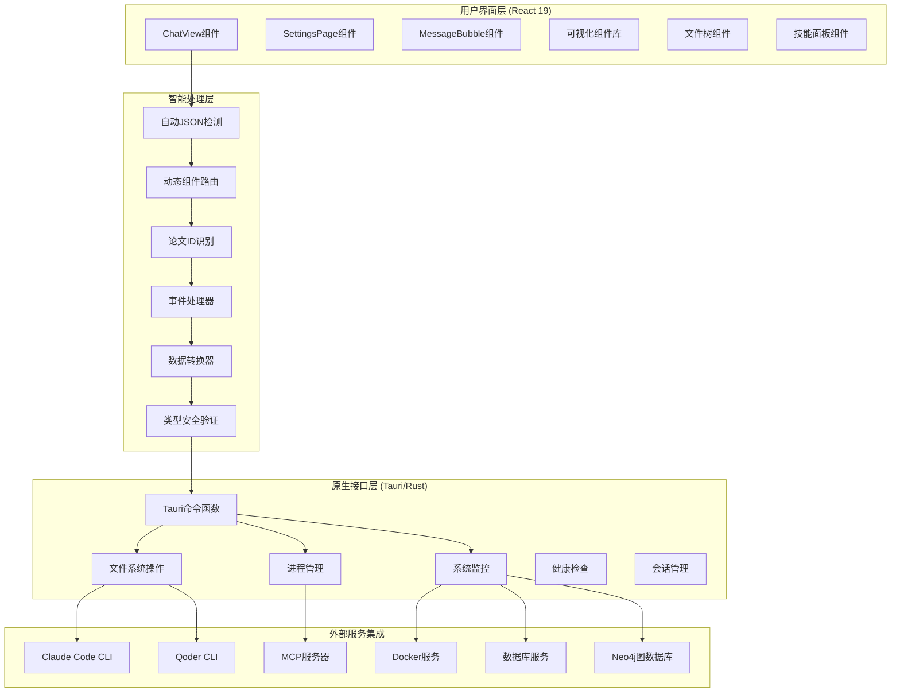
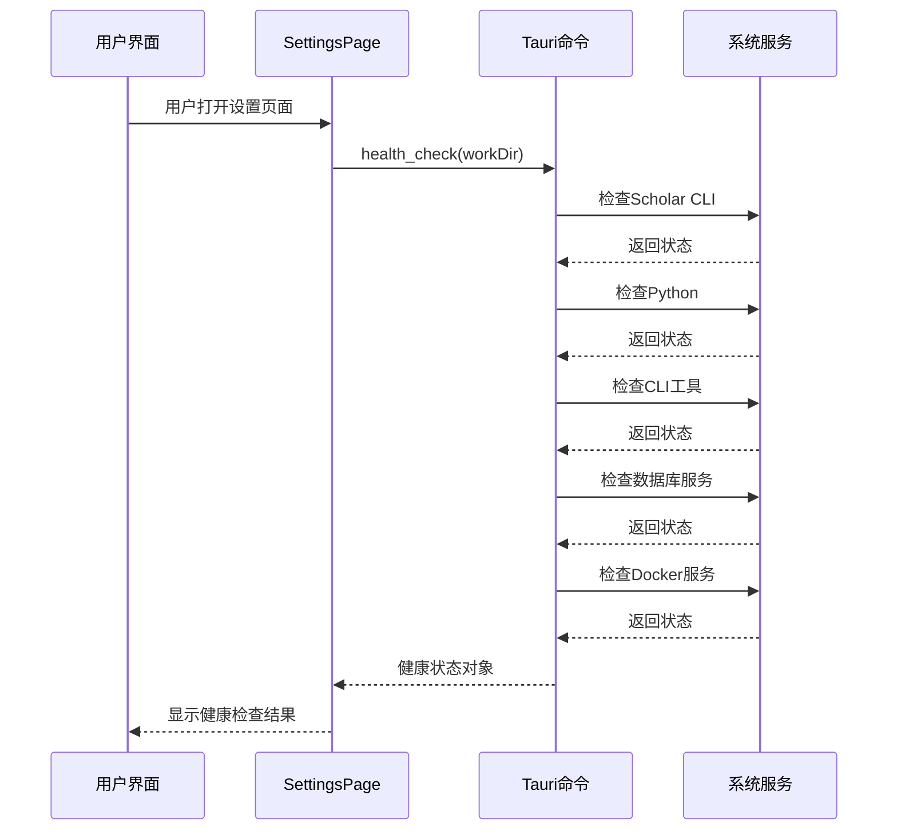
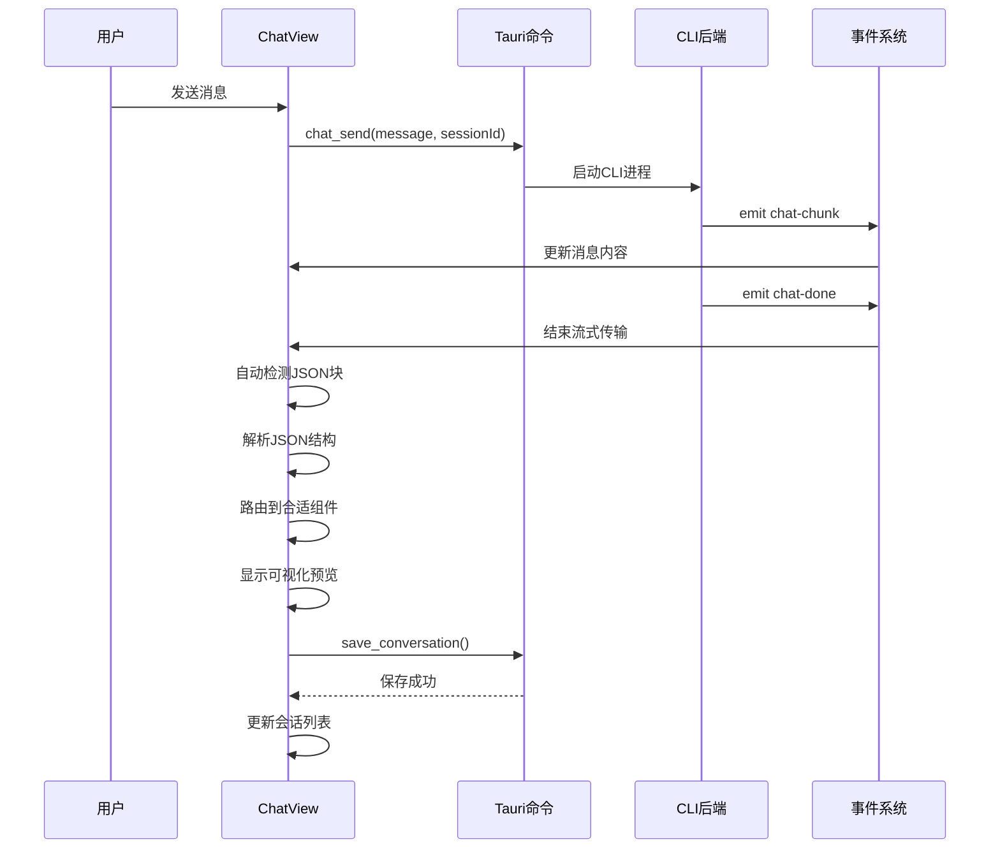
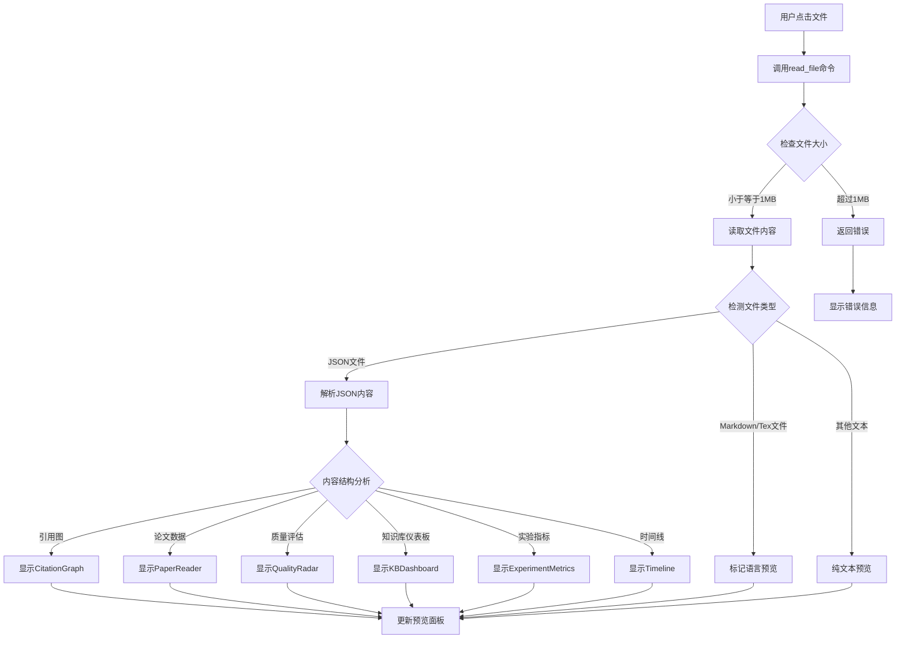
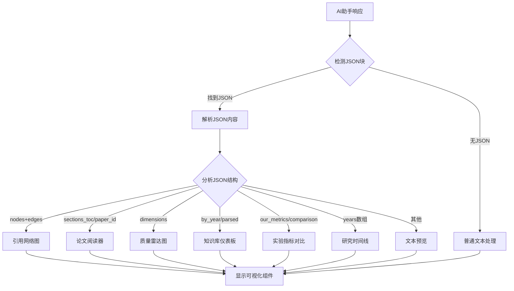
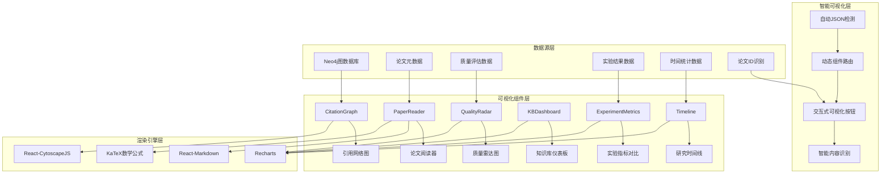
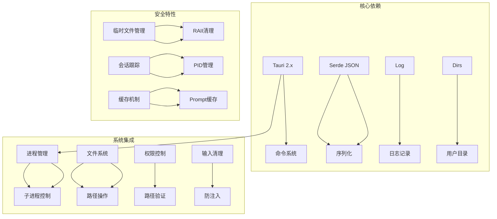
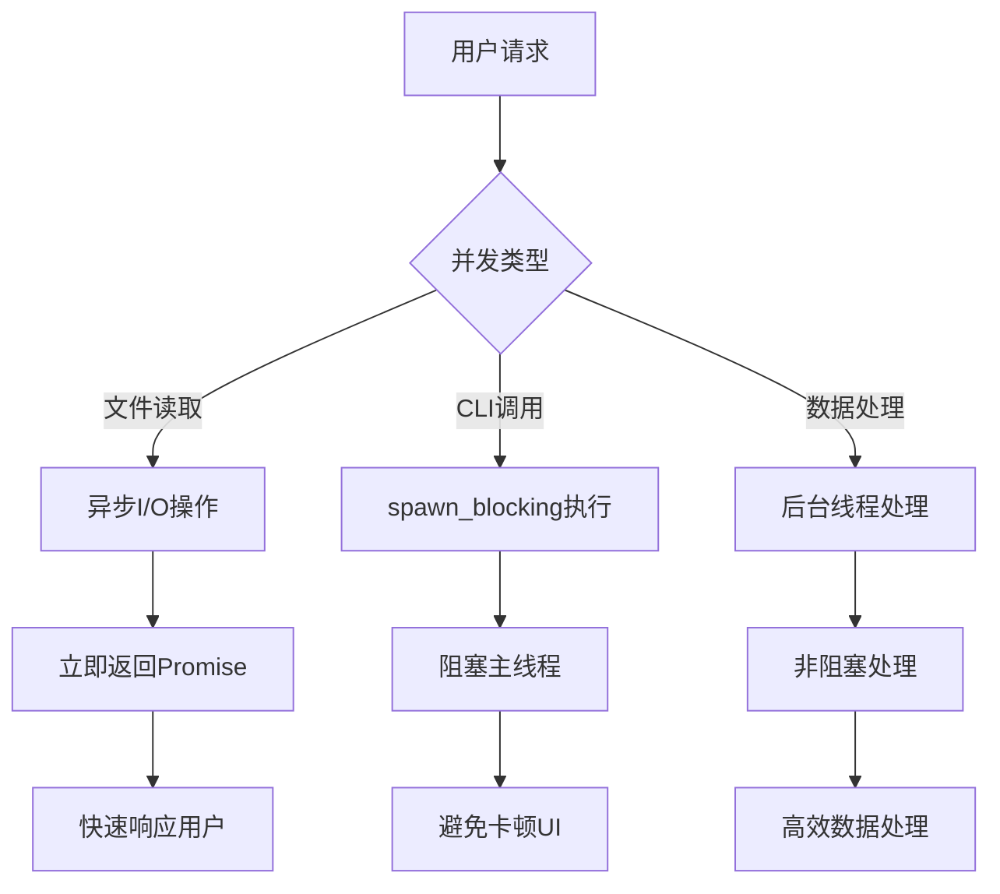

# 桌面应用程序基础设施

<cite>
**本文档引用的文件**
- [desktop/src/App.tsx](file://desktop/src/App.tsx)
- [desktop/src/main.tsx](file://desktop/src/main.tsx)
- [desktop/src/components/ChatView.tsx](file://desktop/src/components/ChatView.tsx)
- [desktop/src/components/MessageBubble.tsx](file://desktop/src/components/MessageBubble.tsx)
- [desktop/src/components/SettingsPage.tsx](file://desktop/src/components/SettingsPage.tsx)
- [desktop/src/components/CitationGraph.tsx](file://desktop/src/components/CitationGraph.tsx)
- [desktop/src/components/PaperReader.tsx](file://desktop/src/components/PaperReader.tsx)
- [desktop/src/components/QualityRadar.tsx](file://desktop/src/components/QualityRadar.tsx)
- [desktop/src/components/KBDashboard.tsx](file://desktop/src/components/KBDashboard.tsx)
- [desktop/src/components/ExperimentMetrics.tsx](file://desktop/src/components/ExperimentMetrics.tsx)
- [desktop/src/components/Timeline.tsx](file://desktop/src/components/Timeline.tsx)
- [desktop/src/types.ts](file://desktop/src/types.ts)
- [desktop/src/App.css](file://desktop/src/App.css)
- [desktop/package.json](file://desktop/package.json)
- [desktop/vite.config.ts](file://desktop/vite.config.ts)
- [desktop/tsconfig.json](file://desktop/tsconfig.json)
- [desktop/src-tauri/Cargo.toml](file://desktop/src-tauri/Cargo.toml)
- [desktop/src-tauri/tauri.conf.json](file://desktop/src-tauri/tauri.conf.json)
- [desktop/src-tauri/src/lib.rs](file://desktop/src-tauri/src/lib.rs)
- [desktop/src-tauri/src/main.rs](file://desktop/src-tauri/src/main.rs)
- [desktop/src-tauri/build.rs](file://desktop/src-tauri/build.rs)
</cite>

## 更新摘要
**所做更改**
- 新增ChatView组件的自动JSON检测和动态组件路由功能分析
- 新增MessageBubble组件的自动论文ID检测和交互式可视化按钮功能说明
- 更新可视化组件系统章节以反映新的智能路由机制
- 增强实时消息流处理和自动内容识别功能描述
- 完善可视化按钮样式和交互设计文档

## 目录
1. [简介](#简介)
2. [项目结构](#项目结构)
3. [核心组件](#核心组件)
4. [架构概览](#架构概览)
5. [详细组件分析](#详细组件分析)
6. [可视化组件系统](#可视化组件系统)
7. [依赖关系分析](#依赖关系分析)
8. [性能考虑](#性能考虑)
9. [故障排除指南](#故障排除指南)
10. [结论](#结论)

## 简介

这是一个基于 Tauri 2.x 和 React 19 的现代化桌面应用程序基础设施，专为学术研究场景设计。该应用集成了完整的AI开发者工具后端支持，包括Claude Code和Qoder CLI两种CLI IDE后端，提供了智能对话界面、文件管理、技能面板、可视化图表等功能。

应用程序采用现代化的技术栈，包括TypeScript、React 19、Tauri 2.x、Vite构建工具等，实现了跨平台的桌面应用开发。核心功能围绕学术研究工作流展开，集成了论文处理、知识管理、实验分析、引用网络可视化等多个专业领域。应用支持实时消息流处理、会话历史管理、Docker服务集成等高级功能。

**章节来源**
- [desktop/src/App.tsx:12-36](file://desktop/src/App.tsx#L12-L36)
- [desktop/src-tauri/src/lib.rs:527-740](file://desktop/src-tauri/src/lib.rs#L527-L740)

## 项目结构

该项目采用清晰的分层架构，主要分为前端React应用和后端Tauri原生模块两大部分：



**图表来源**
- [desktop/src/main.tsx:1-11](file://desktop/src/main.tsx#L1-L11)
- [desktop/src-tauri/src/lib.rs:1-800](file://desktop/src-tauri/src/lib.rs#L1-L800)

**章节来源**
- [desktop/src/main.tsx:1-11](file://desktop/src/main.tsx#L1-L11)
- [desktop/src/App.tsx:1-57](file://desktop/src/App.tsx#L1-L57)
- [desktop/src-tauri/src/lib.rs:1-800](file://desktop/src-tauri/src/lib.rs#L1-L800)

## 核心组件

### 应用入口与路由

应用程序的核心入口位于`App.tsx`，负责管理应用状态和视图切换：



**图表来源**
- [desktop/src/App.tsx:12-36](file://desktop/src/App.tsx#L12-L36)

### 智能聊天界面系统

`ChatView`组件是应用程序的核心交互界面，集成了多种功能模块：

**主要特性：**
- 实时消息流处理（支持流式响应和错误处理）
- **自动JSON检测和动态路由**（智能识别结构化数据并自动选择可视化组件）
- 多种内容类型预览（文本、图表、论文、质量雷达等）
- 文件树导航和文件读取
- 技能面板集成
- 会话历史管理
- Docker服务监控
- 健康检查状态显示

**新增功能**：
- **自动JSON块检测**：从AI助手响应中自动提取```json```代码块
- **智能组件路由**：根据JSON结构自动选择合适的可视化组件
- **交互式可视化按钮**：为检测到的数据提供一键可视化功能

**章节来源**
- [desktop/src/components/ChatView.tsx:34-611](file://desktop/src/components/ChatView.tsx#L34-L611)
- [desktop/src/types.ts:12-37](file://desktop/src/types.ts#L12-L37)

### 设置管理系统

`SettingsPage`提供了完整的环境配置功能：

**配置选项：**
- CLI IDE后端选择（Claude Code或Qoder CLI）
- 工作目录配置和验证
- 自动检测CLI路径
- Docker服务管理
- 健康检查状态显示
- dotfiles分发功能

**章节来源**
- [desktop/src/components/SettingsPage.tsx:12-390](file://desktop/src/components/SettingsPage.tsx#L12-L390)

## 架构概览

应用程序采用客户端-服务器混合架构，结合了前端React应用和后端Rust/Tauri模块：



**图表来源**
- [desktop/src-tauri/src/lib.rs:98-740](file://desktop/src-tauri/src/lib.rs#L98-L740)
- [desktop/src/components/ChatView.tsx:86-119](file://desktop/src/components/ChatView.tsx#L86-L119)

## 详细组件分析

### 健康检查系统

健康检查是应用程序的重要监控机制，确保所有依赖组件正常运行：



**图表来源**
- [desktop/src-tauri/src/lib.rs:774-800](file://desktop/src-tauri/src/lib.rs#L774-L800)
- [desktop/src-tauri/src/lib.rs:752-771](file://desktop/src-tauri/src/lib.rs#L752-L771)

### 智能消息流处理机制

应用程序实现了高效的实时消息流处理，支持流式响应、自动JSON检测和智能路由：



**图表来源**
- [desktop/src/components/ChatView.tsx:114-242](file://desktop/src/components/ChatView.tsx#L114-L242)
- [desktop/src-tauri/src/lib.rs:716-740](file://desktop/src-tauri/src/lib.rs#L716-L740)

### 文件系统集成

应用程序提供了强大的文件系统访问能力，支持工作空间管理和文件预览：



**图表来源**
- [desktop/src/components/ChatView.tsx:338-364](file://desktop/src/components/ChatView.tsx#L338-L364)
- [desktop/src-tauri/src/lib.rs:742-750](file://desktop/src-tauri/src/lib.rs#L742-L750)

**章节来源**
- [desktop/src-tauri/src/lib.rs:224-350](file://desktop/src-tauri/src/lib.rs#L224-L350)
- [desktop/src/components/ChatView.tsx:288-392](file://desktop/src/components/ChatView.tsx#L288-L392)

### 智能内容识别系统

应用程序集成了先进的内容识别和路由系统：



**图表来源**
- [desktop/src/components/ChatView.tsx:193-209](file://desktop/src/components/ChatView.tsx#L193-L209)
- [desktop/src/components/ChatView.tsx:86-95](file://desktop/src/components/ChatView.tsx#L86-L95)

**章节来源**
- [desktop/src/components/ChatView.tsx:86-95](file://desktop/src/components/ChatView.tsx#L86-L95)
- [desktop/src/components/ChatView.tsx:193-209](file://desktop/src/components/ChatView.tsx#L193-L209)

## 可视化组件系统

### 学术可视化架构

应用程序集成了完整的学术研究可视化组件系统，支持多种数据类型的图形化展示：



**图表来源**
- [desktop/src/components/CitationGraph.tsx:1-111](file://desktop/src/components/CitationGraph.tsx#L1-L111)
- [desktop/src/components/PaperReader.tsx:1-95](file://desktop/src/components/PaperReader.tsx#L1-L95)
- [desktop/src/components/QualityRadar.tsx:1-111](file://desktop/src/components/QualityRadar.tsx#L1-L111)
- [desktop/src/components/KBDashboard.tsx:1-145](file://desktop/src/components/KBDashboard.tsx#L1-L145)
- [desktop/src/components/ExperimentMetrics.tsx:1-106](file://desktop/src/components/ExperimentMetrics.tsx#L1-L106)
- [desktop/src/components/Timeline.tsx:1-81](file://desktop/src/components/Timeline.tsx#L1-L81)

### ChatView组件的智能路由系统

ChatView组件现在集成了智能的内容识别和路由功能：

**主要功能：**
- **自动JSON检测**：从AI助手响应中自动提取和解析JSON块
- **动态组件路由**：根据JSON结构自动选择最合适的可视化组件
- **交互式可视化按钮**：为检测到的数据提供一键可视化功能
- **多格式支持**：支持引用网络、论文数据、质量评估、实验指标等多种数据格式

**路由规则：**
- JSON包含`nodes`和`edges` → CitationGraph
- JSON包含`sections_toc`或`paper_id` → PaperReader  
- JSON包含`dimensions` → QualityRadar
- JSON包含`by_year`或`parsed` → KBDashboard
- JSON包含`our_metrics`或`comparison` → ExperimentMetrics
- JSON包含`years`数组 → Timeline

**章节来源**
- [desktop/src/components/ChatView.tsx:86-95](file://desktop/src/components/ChatView.tsx#L86-L95)
- [desktop/src/components/ChatView.tsx:193-209](file://desktop/src/components/ChatView.tsx#L193-L209)
- [desktop/src/components/ChatView.tsx:98-119](file://desktop/src/components/ChatView.tsx#L98-L119)

### MessageBubble组件的智能识别系统

MessageBubble组件现在具备了智能的内容识别和交互功能：

**主要功能：**
- **自动论文ID检测**：识别ULID和arXiv格式的论文ID
- **交互式可视化按钮**：为检测到的论文ID提供一键可视化功能
- **LaTeX数学公式渲染**：支持数学公式的高质量渲染
- **代码高亮显示**：支持多种编程语言的语法高亮

**论文ID识别规则：**
- ULID格式：`01K[0-9A-Z]{23}`
- arXiv格式：`\b\d{4}\.\d{4,5}\b`

**可视化按钮功能：**
- 引用网络：显示论文的引用网络图
- 论文详情：显示论文的详细信息和元数据
- 质量评估：显示论文的质量雷达图
- 实验指标：显示论文的实验结果对比

**章节来源**
- [desktop/src/components/MessageBubble.tsx:9-17](file://desktop/src/components/MessageBubble.tsx#L9-L17)
- [desktop/src/components/MessageBubble.tsx:45-60](file://desktop/src/components/MessageBubble.tsx#L45-L60)

### CitationGraph组件

CitationGraph组件使用Cytoscape.js实现复杂的引用网络可视化：

**主要功能：**
- 动态节点布局和边连接
- 中心论文突出显示
- 节点大小根据入度权重
- 交互式节点点击事件
- 响应式布局适配

**章节来源**
- [desktop/src/components/CitationGraph.tsx:1-111](file://desktop/src/components/CitationGraph.tsx#L1-L111)

### PaperReader组件

PaperReader组件提供完整的论文阅读体验：

**主要功能：**
- LaTeX数学公式渲染
- 代码高亮显示
- 论文元数据展示
- 目录导航
- 标签分类系统

**章节来源**
- [desktop/src/components/PaperReader.tsx:1-95](file://desktop/src/components/PaperReader.tsx#L1-L95)

### QualityRadar组件

QualityRadar组件使用Recharts实现多维度质量评估：

**主要功能：**
- 雷达图可视化
- 成绩等级标识
- 维度详细评分
- 响应式容器
- 交互式工具提示

**章节来源**
- [desktop/src/components/QualityRadar.tsx:1-111](file://desktop/src/components/QualityRadar.tsx#L1-L111)

### KBDashboard组件

KBDashboard组件提供知识库综合仪表板：

**主要功能：**
- 统计卡片展示
- 年份分布柱状图
- 会议分布饼图
- 元数据覆盖率
- 多图表联动

**章节来源**
- [desktop/src/components/KBDashboard.tsx:1-145](file://desktop/src/components/KBDashboard.tsx#L1-L145)

### ExperimentMetrics组件

ExperimentMetrics组件专门用于实验结果对比：

**主要功能：**
- 实验指标对比图表
- 结果差距分析
- 运行时长统计
- 表格形式数据展示
- 响应式设计

**章节来源**
- [desktop/src/components/ExperimentMetrics.tsx:1-106](file://desktop/src/components/ExperimentMetrics.tsx#L1-L106)

### Timeline组件

Timeline组件展示学术研究时间线：

**主要功能：**
- 年度论文数量统计
- 关键论文列表
- 时间轴可视化
- 交互式工具提示
- 响应式布局

**章节来源**
- [desktop/src/components/Timeline.tsx:1-81](file://desktop/src/components/Timeline.tsx#L1-L81)

## 依赖关系分析

### 前端依赖架构

应用程序的前端依赖关系体现了现代化的React开发模式：

```mermaid
graph TB
subgraph "构建工具链"
A[Vite] --> B[React插件]
C[TypeScript编译器] --> D[类型检查]
E[@vitejs/plugin-react] --> F[开发服务器]
end
subgraph "UI框架"
G[React 19] --> H[React DOM]
I[React Markdown] --> J[语法高亮]
K[Recharts] --> L[数据可视化]
M[Cytoscape] --> N[网络图谱]
O[KaTeX] --> P[LaTeX公式]
Q[Remark插件] --> R[GFM支持]
end
subgraph "桌面集成"
S[@tauri-apps/api] --> T[跨平台窗口]
U[@tauri-apps/plugin-dialog] --> V[文件选择器]
end
A --> G
C --> G
S --> G
O --> G
```

**图表来源**
- [desktop/package.json:12-36](file://desktop/package.json#L12-L36)
- [desktop/vite.config.ts:6-24](file://desktop/vite.config.ts#L6-L24)

### 后端依赖架构

Rust后端模块展现了高性能的系统编程特性：



**图表来源**
- [desktop/src-tauri/Cargo.toml:20-28](file://desktop/src-tauri/Cargo.toml#L20-L28)
- [desktop/src-tauri/src/lib.rs:1-11](file://desktop/src-tauri/src/lib.rs#L1-L11)

**章节来源**
- [desktop/package.json:1-37](file://desktop/package.json#L1-L37)
- [desktop/src-tauri/Cargo.toml:1-28](file://desktop/src-tauri/Cargo.toml#L1-L28)

## 性能考虑

### 内存管理优化

应用程序在多个层面实施了内存管理策略：

1. **组件卸载清理**：所有事件监听器在组件卸载时自动清理，防止内存泄漏
2. **状态引用优化**：使用ref对象存储可变状态，避免不必要的重新渲染
3. **文件大小限制**：对大文件读取进行限制，防止内存溢出
4. **缓存机制**：Prompt缓存避免重复计算系统提示
5. **会话管理**：PID跟踪确保进程正确清理

### 并发处理策略



### 缓存机制

应用程序实现了多级缓存策略：

1. **系统提示缓存**：缓存构建的系统提示，避免重复计算
2. **会话状态缓存**：保持会话相关状态的一致性
3. **文件树缓存**：减少重复的文件系统查询
4. **进程PID跟踪**：管理多个并发会话

### 智能内容识别性能优化

应用程序在智能内容识别方面采用了多项优化策略：

1. **延迟解析**：仅在需要时解析JSON内容
2. **正则表达式缓存**：缓存论文ID识别的正则表达式
3. **组件懒加载**：仅在需要时加载可视化组件
4. **事件节流**：限制消息流处理的频率

## 故障排除指南

### 常见问题诊断

**健康检查失败**
- 检查CLI工具是否正确安装
- 验证工作目录权限
- 确认数据库服务状态
- 检查Docker服务运行状态

**消息流中断**
- 检查CLI进程状态
- 验证MCP服务器连接
- 查看事件监听器状态
- 确认会话ID有效性

**文件读取错误**
- 确认文件路径有效性
- 检查文件大小限制（>1MB）
- 验证文件编码格式
- 检查文件访问权限

**可视化组件异常**
- 确认数据格式正确性
- 检查依赖库版本兼容性
- 验证数据完整性
- 确认渲染引擎正常工作

**智能识别功能失效**
- 检查JSON格式正确性
- 验证论文ID格式
- 确认MCP工具可用性
- 查看控制台错误信息

### 调试工具

应用程序提供了丰富的调试功能：

1. **控制台日志**：详细的错误信息输出
2. **状态检查**：实时查看应用状态
3. **性能监控**：跟踪内存和CPU使用情况
4. **事件监听**：监控消息流状态
5. **会话追踪**：管理并发会话
6. **内容识别调试**：查看JSON检测和路由过程

**章节来源**
- [desktop/src-tauri/src/lib.rs:752-800](file://desktop/src-tauri/src/lib.rs#L752-L800)
- [desktop/src/components/ChatView.tsx:181-193](file://desktop/src/components/ChatView.tsx#L181-L193)

## 结论

这个桌面应用程序基础设施展现了现代桌面应用开发的最佳实践。通过React + Tauri的组合，应用程序实现了：

- **跨平台兼容性**：统一的代码库支持Windows、macOS、Linux
- **高性能执行**：Rust后端提供高效的系统级操作
- **用户体验优化**：流畅的界面交互和实时响应
- **智能化内容识别**：自动检测和路由结构化数据
- **扩展性设计**：模块化的架构便于功能扩展
- **学术研究专业化**：完整的可视化组件和工具集成

**重大增强功能**：
- **智能JSON检测**：自动从AI助手响应中提取和解析结构化数据
- **动态组件路由**：根据数据结构自动选择最合适的可视化组件
- **交互式可视化按钮**：为检测到的数据提供一键可视化功能
- **论文ID自动识别**：支持ULID和arXiv格式的论文ID识别
- **智能内容路由**：实现从文本到可视化的无缝转换

该基础设施为学术研究场景提供了强大的技术支持，通过集成多种AI工具后端和专业的数据可视化功能，为研究人员提供了全面的工作流支持。13个新组件的加入进一步增强了应用的专业性和实用性，包括引用网络分析、论文深度阅读、质量评估、知识库管理、实验结果对比、研究时间线等核心功能模块。

未来的发展方向包括进一步优化性能、增强安全性、扩展更多专业领域的功能模块，以及改进用户体验和界面设计。应用程序的模块化架构为持续的功能扩展和技术升级奠定了坚实的基础。